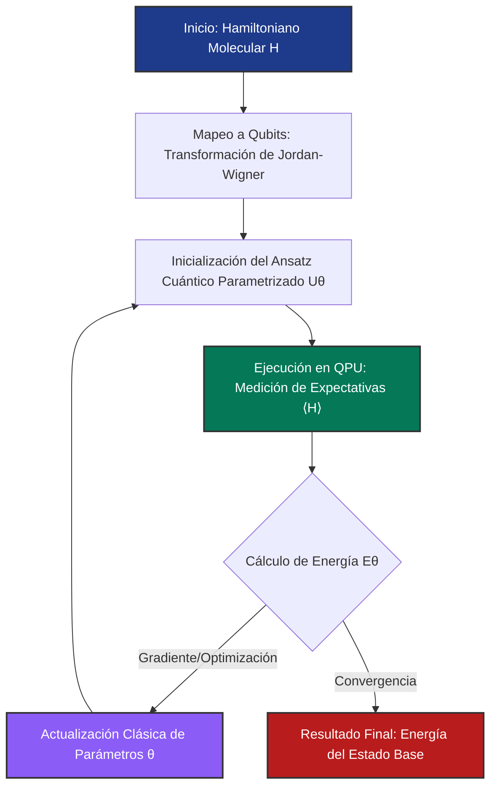

# Algoritmos y Simulación

Los algoritmos cuánticos intentan aprovechar interferencia y entrelazamiento para resolver ciertos problemas de manera más eficiente que los métodos clásicos conocidos. La simulación cuántica, además, es una de las motivaciones más profundas del campo.

## 🧮 Desarrollo Teórico Profundo

Los algoritmos cuánticos y la simulación se basan en una estructura matemática subyacente que aprovecha la mecánica cuántica de manera directa. A continuación, desarrollaremos detalladamente dos de los pilares de esta disciplina: la Transformada de Fourier Cuántica (QFT) y los fundamentos de la Simulación Cuántica de sistemas hamiltonianos.

### 1. Transformada de Fourier Cuántica (QFT)

La Transformada de Fourier Cuántica es el análogo cuántico de la transformada de Fourier discreta (DFT). Dada una base computacional ortonormal $|0\rangle, |1\rangle, \dots, |N-1\rangle$, donde $N = 2^n$ (con $n$ el número de qubits), la QFT se define mediante la siguiente transformación lineal:

$$
\text{QFT} |j\rangle = \frac{1}{\sqrt{N}} \sum_{k=0}^{N-1} e^{2\pi i j k / N} |k\rangle
$$

Para entender la estructura en términos de qubits, podemos escribir $j$ y $k$ en representación binaria:
$j = j_1 j_2 \dots j_n = j_1 2^{n-1} + j_2 2^{n-2} + \dots + j_n 2^0$
$k = k_1 k_2 \dots k_n = k_1 2^{n-1} + k_2 2^{n-2} + \dots + k_n 2^0$

La acción sobre el estado base se puede reescribir como un producto tensorial. Observando que la fase $e^{2\pi i j k / 2^n}$ se puede separar:

$$
\frac{k}{2^n} = \sum_{l=1}^n k_l 2^{-l}
$$

Por lo tanto:

$$
\text{QFT} |j\rangle = \frac{1}{\sqrt{2^n}} \bigotimes_{l=1}^n \left( |0\rangle + e^{2\pi i j 2^{-l}} |1\rangle \right)
$$

Desarrollando los términos exponenciales $j 2^{-l}$, notamos que la parte entera no contribuye a la fase (puesto que $e^{2\pi i m} = 1$ para $m \in \mathbb{Z}$). Al introducir la notación de fracción binaria $0.j_l j_{l+1} \dots j_n = \sum_{m=l}^n j_m 2^{-(m-l+1)}$, obtenemos la forma factorizada de la QFT:

$$
\text{QFT} |j_1 j_2 \dots j_n\rangle = \frac{1}{\sqrt{2^n}} \left( |0\rangle + e^{2\pi i 0.j_n} |1\rangle \right) \otimes \left( |0\rangle + e^{2\pi i 0.j_{n-1} j_n} |1\rangle \right) \otimes \dots \otimes \left( |0\rangle + e^{2\pi i 0.j_1 j_2 \dots j_n} |1\rangle \right)
$$

Este desarrollo muestra que el circuito cuántico correspondiente requiere únicamente compuertas de Hadamard ($H$) y rotaciones de fase condicionales ($R_k$):

$$
R_k = \begin{pmatrix} 1 & 0 \\ 0 & e^{2\pi i / 2^k} \end{pmatrix}
$$

El número de compuertas requeridas escala como $\mathcal{O}(n^2)$, proporcionando una ventaja exponencial frente al análogo clásico (la Fast Fourier Transform), que requiere $\mathcal{O}(n 2^n)$ operaciones.

### 2. Simulación Cuántica Universal y Trotterización

La simulación cuántica busca reproducir la dinámica de un sistema cuántico gobernado por un hamiltoniano $H$. La evolución temporal se describe por el operador unitario $U(t) = e^{-iHt}$ (tomando $\hbar = 1$). Si el hamiltoniano se puede descomponer como la suma de hamiltonianos locales o interacciones de pocos cuerpos, $H = \sum_{j=1}^m H_j$, el desafío radica en que, en general, los $H_j$ no conmutan: $[H_j, H_k] \neq 0$.

Para implementar $U(t)$ en un ordenador cuántico universal, utilizamos la fórmula de Lie-Trotter-Suzuki:

$$
e^{-i(A+B)t} = \lim_{n \to \infty} \left( e^{-i A t/n} e^{-i B t/n} \right)^n
$$

Para un paso de tiempo finito $\Delta t = t/r$, podemos aproximar la evolución completa dividiendo el tiempo total $t$ en $r$ intervalos o "pasos de Trotter". La aproximación de primer orden es:

$$
U(t) = e^{-i \sum_j H_j t} \approx \left( \prod_{j=1}^m e^{-i H_j \Delta t} \right)^r + \mathcal{O}(m^2 \Delta t^2)
$$

Donde el término de error $\mathcal{O}(m^2 \Delta t^2)$ surge de los conmutadores no nulos entre los sub-hamiltonianos. El límite de error riguroso (según la expansión de Baker-Campbell-Hausdorff) para la descomposición de primer orden es:

$$
\| e^{-i(A+B)t} - (e^{-i A t/r} e^{-i B t/r})^r \| \leq \frac{t^2}{2r} \| [A,B] \|
$$

Para mejorar la precisión, se recurre a aproximaciones de orden superior, como la fórmula de Trotter-Suzuki de segundo orden:

$$
S_2(t) = \prod_{j=1}^m e^{-i H_j \Delta t / 2} \prod_{j=m}^1 e^{-i H_j \Delta t / 2}
$$

cuyo error se reduce a $\mathcal{O}(\Delta t^3)$. De esta manera, al segmentar la simulación temporal en circuitos cuánticos elementales, logramos resolver dinámicas extremadamente complejas, que clásicamente sufrirían del crecimiento exponencial del espacio de Hilbert.

### Diagrama de Arquitectura de Simulación

El siguiente diagrama ilustra el flujo de un algoritmo clásico-cuántico híbrido, como el **Variational Quantum Eigensolver (VQE)**, comúnmente empleado en simulaciones moleculares bajo la era NISQ.

En VQE, el ordenador cuántico evalúa eficientemente el valor esperado de la energía $\langle \psi(\theta) | H | \psi(\theta) \rangle$, mientras que un optimizador clásico ajusta $\theta$ para minimizarla, en virtud del principio variacional de Rayleigh-Ritz:

$$
E_0 \leq \frac{\langle \psi | H | \psi \rangle}{\langle \psi | \psi \rangle}
$$

Este método evita los largos circuitos de fase necesarios en el Algoritmo de Estimación de Fase Cuántica (QPE), convirtiéndose en la principal herramienta de simulación cuántica hoy en día.

## 📚 Recursos Específicos

### Cursos
1. [Quantum Computing and Simulation (Coursera)](https://www.coursera.org/learn/quantum-computing-simulation)
2. [Simulating Nature with Quantum Computers (edX)](https://www.edx.org/course/simulating-nature)
3. [Introduction to Quantum Simulation (FutureLearn)](https://www.futurelearn.com/courses/quantum-simulation)
4. [Quantum Simulation and Algorithm Design (MIT OpenCourseWare)](https://ocw.mit.edu/courses/quantum-simulation)
5. [Algorithms and Quantum Simulations with Qiskit (IBM)](https://qiskit.org/learn)
6. [QuTiP Tutorials and Lectures (QuTiP)](https://qutip.org/tutorials.html)

### Artículos y Simulaciones
1. [Simulating Physics with Computers (R. Feynman, 1982)](https://doi.org/10.1007/BF02650179)
2. [Universal Quantum Simulators (S. Lloyd, 1996)](https://science.sciencemag.org/content/273/5278/1073)
3. [Qiskit (Quantum Information Science Kit)](https://qiskit.org)
4. [QuTiP: Quantum Toolbox in Python (Johansson et al., 2012)](https://arxiv.org/abs/1211.6518)
5. [Quantum algorithm for linear systems of equations (Harrow et al., 2009)](https://arxiv.org/abs/0811.3171)
6. [Simulation of Electronic Structure Hamiltonians using Quantum Computers (Whitfield et al., 2011)](https://arxiv.org/abs/1001.3855)
7. [Theory of variational quantum simulation (Yuan et al., 2019)](https://arxiv.org/abs/1812.08767)
8. [PennyLane: Quantum machine learning and optimization (Bergholm et al., 2018)](https://arxiv.org/abs/1811.04968)

### 📖 Referencias Útiles y Bibliografía
1. [Quantum Computation and Quantum Information (Nielsen & Chuang)](https://doi.org/10.1017/CBO9780511976667)
2. [Quantum Computer Science: An Introduction (N. David Mermin)](https://doi.org/10.1017/CBO9780511813870)
3. [Principles of Quantum Mechanics (R. Shankar)](https://doi.org/10.1007/978-1-4757-0576-8)
