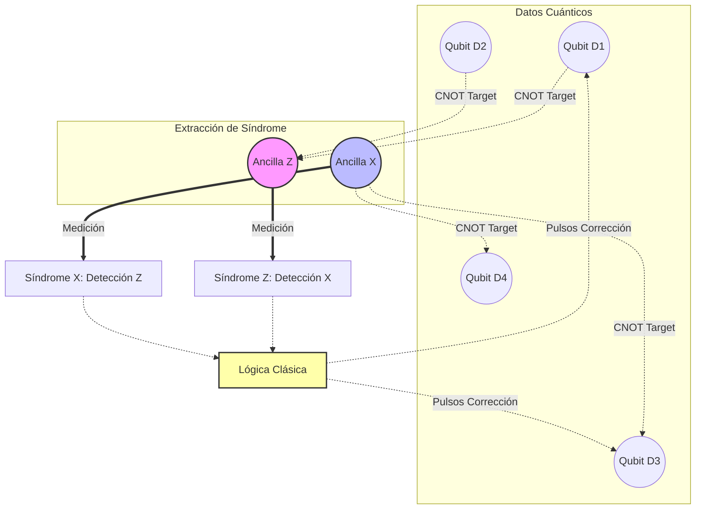

# Corrección de Errores y Hardware
La computación cuántica es extremadamente susceptible a la decoherencia y al ruido ambiental. La corrección de errores cuánticos (QEC) y el desarrollo de hardware cuántico robusto son los mayores desafíos en la construcción de ordenadores cuánticos escalables (tolerantes a fallos).

## 📜 Contexto Histórico
El teorema de no-clonación cuántica (descubierto en 1982 por Wootters, Zurek y Dieks) parecía imposibilitar la corrección de errores clásica, que se basa en hacer copias de la información. Sin embargo, en 1995, Peter Shor y Andrew Steane propusieron de manera independiente los primeros códigos de corrección de errores cuánticos, demostrando que la información podía distribuirse entre varios qubits entrelazados para protegerla sin clonarla. Simultáneamente, investigadores comenzaron a proponer arquitecturas físicas como iones atrapados (Cirac y Zoller, 1995) y superconductores.

## 🧮 Desarrollo Teórico Profundo

La corrección de errores cuánticos (QEC) aborda el problema fundamental de proteger la información cuántica contra la decoherencia y el ruido sin violar las leyes de la mecánica cuántica. A diferencia de la computación clásica, donde la redundancia se logra copiando bits, el teorema de no clonación prohíbe copiar estados cuánticos arbitrarios. Además, los errores cuánticos son continuos y la medición directa destruye la superposición. QEC resuelve esto codificando la información de un qubit lógico en el espacio de Hilbert entrelazado de múltiples qubits físicos y midiendo "síndromes" que revelan información sobre el error sin perturbar el estado lógico.

### 1. El Modelo de Error Discreto de Pauli

Aunque el estado de un qubit puede sufrir perturbaciones continuas, los errores cuánticos pueden discretizarse. Cualquier operador de error $E$ actuando sobre un único qubit puede expandirse en la base de las matrices de Pauli:

$$ E = e_0 I + e_1 X + e_2 Y + e_3 Z $$

donde $e_i$ son coeficientes complejos. Al medir el síndrome, la superposición del estado erróneo colapsa en uno de los errores discretos de Pauli. Si podemos corregir los errores $X$, $Y$ y $Z$, podemos corregir cualquier error arbitrario continuo.

El grupo de Pauli en $n$ qubits, denotado como $\mathcal{P}_n$, consiste en todos los productos tensoriales de matrices de Pauli con factores de fase globales:

$$ \mathcal{P}_n = \{ i^k P_1 \otimes P_2 \otimes \dots \otimes P_n \mid P_j \in \{I, X, Y, Z\}, k \in \{0, 1, 2, 3\} \} $$

### 2. Condiciones de Corrección de Errores (Knill-Laflamme)

Para que un código cuántico con una base de palabras código ortonormales $\{|i_L\rangle\}$ pueda corregir un conjunto de errores $\mathcal{E} = \{E_a\}$, debe satisfacer las condiciones de Knill-Laflamme:

$$ \langle i_L | E_a^\dagger E_b | j_L \rangle = C_{ab} \delta_{ij} $$

donde $C_{ab}$ es una matriz hermitiana que no depende de las palabras código $i, j$.

**Prueba paso a paso de suficiencia:**
1. Dado que $C_{ab}$ es hermitiana, puede ser diagonalizada por una matriz unitaria $U$: $D = U C U^\dagger$.
2. Definimos una nueva base de errores $F_k = \sum_a U_{ka} E_a$.
3. La condición se transforma en:

   $$ \langle i_L | F_k^\dagger F_l | j_L \rangle = d_k \delta_{kl} \delta_{ij} $$

   donde $d_k$ son los autovalores reales y no negativos de $C_{ab}$.
4. Esto implica que los estados $F_k |i_L\rangle$ y $F_l |j_L\rangle$ son ortogonales siempre que $k \neq l$ o $i \neq j$. 
5. Por lo tanto, una medición proyectiva puede distinguir unívocamente qué tipo de error $F_k$ ha ocurrido (sin revelar información sobre la base lógica $i, j$), permitiendo aplicar el operador inverso para restaurar el estado original.

### 3. El Formalismo de Estabilizadores (Gottesman)

El formalismo estabilizador es la herramienta algebraica más poderosa para diseñar códigos cuánticos. Se basa en describir el subespacio del código no mediante sus estados, sino mediante los operadores de Pauli que los dejan invariantes.

Sea $\mathcal{S} \subset \mathcal{P}_n$ un subgrupo abeliano del grupo de Pauli que no contiene el operador $-I$. El espacio de código $\mathcal{C}$ es el subespacio simultáneo de autovectores con autovalor $+1$ de todos los elementos (estabilizadores) $S \in \mathcal{S}$:

$$ \mathcal{C} = \{ |\psi\rangle \mid S |\psi\rangle = |\psi\rangle, \forall S \in \mathcal{S} \} $$

Si $\mathcal{S}$ tiene $n-k$ generadores independientes $\{S_1, S_2, \dots, S_{n-k}\}$, el código codifica $k$ qubits lógicos en $n$ qubits físicos. La dimensión del espacio de código es $2^k$.

**Detección de errores con Estabilizadores:**
Supongamos que ocurre un error de Pauli $E$. El estado corrompido es $E|\psi\rangle$. Si medimos el generador $S_i$, el resultado dependerá de las relaciones de conmutación de Pauli. Ya que dos operadores de Pauli o conmutan o anticonmutan:
- Si $[E, S_i] = 0$: $S_i (E|\psi\rangle) = E S_i |\psi\rangle = E|\psi\rangle$. El autovalor medido es $+1$.
- Si $\{E, S_i\} = 0$: $S_i (E|\psi\rangle) = -E S_i |\psi\rangle = -E|\psi\rangle$. El autovalor medido es $-1$.

El conjunto de resultados de las medidas de los generadores $(s_1, s_2, \dots, s_{n-k})$, donde $s_i \in \{+1, -1\}$, se llama el **síndrome del error**. Diferentes errores anticonmutarán con diferentes generadores, originando síndromes distintos.

### 4. Construcción del Código de Shor de 9 Qubits

Peter Shor propuso el primer código capaz de corregir errores arbitrarios de 1 qubit combinando la protección contra *bit flips* ($X$) y *phase flips* ($Z$). 

#### Paso 1: Código de Repetición para Bit Flip ($X$)
Para proteger contra un cambio de amplitud (error $X$), codificamos un qubit lógico en 3 físicos:

$$ |0_L\rangle_X = |000\rangle $$

$$ |1_L\rangle_X = |111\rangle $$

Los estabilizadores para este código son $Z_1 Z_2$ y $Z_2 Z_3$. Estos detectan cambios de paridad en la base $Z$.

#### Paso 2: Código de Repetición para Phase Flip ($Z$)
Un error de fase $Z$ actúa en la base $\{|+\rangle, |-\rangle\}$ exactamente igual que $X$ actúa en $\{|0\rangle, |1\rangle\}$. Codificamos:

$$ |0_L\rangle_Z = |+++\rangle $$

$$ |1_L\rangle_Z = |---\rangle $$

Los estabilizadores son $X_1 X_2$ y $X_2 X_3$.

#### Paso 3: Código de Shor Combinado
Shor concatenó estos dos conceptos. Cada qubit del código de fase se codifica internamente usando el código de bit-flip:

$$ |+\rangle_L = \frac{|000\rangle + |111\rangle}{\sqrt{2}} $$

$$ |-\rangle_L = \frac{|000\rangle - |111\rangle}{\sqrt{2}} $$

El qubit lógico completo de Shor se expresa en bloques de 3 qubits:

$$ |0_L\rangle = \left(\frac{|000\rangle + |111\rangle}{\sqrt{2}}\right)^{\otimes 3} $$

$$ |1_L\rangle = \left(\frac{|000\rangle - |111\rangle}{\sqrt{2}}\right)^{\otimes 3} $$

El código tiene $n=9$ y $k=1$, lo que requiere $9-1=8$ generadores estabilizadores:
- Para detectar errores de bit-flip ($X$) dentro de cada bloque, utilizamos pares $Z_i Z_j$:

  $$ g_1 = Z_1 Z_2 I I I I I I I, \quad g_2 = I Z_2 Z_3 I I I I I I $$

  $$ g_3 = I I I Z_4 Z_5 I I I I, \quad g_4 = I I I I Z_5 Z_6 I I I $$

  $$ g_5 = I I I I I I Z_7 Z_8 I, \quad g_6 = I I I I I I I Z_8 Z_9 $$

- Para detectar errores de fase ($Z$) entre los bloques, usamos bloques de $X$:

  $$ g_7 = X_1 X_2 X_3 X_4 X_5 X_6 I I I $$

  $$ g_8 = I I I X_4 X_5 X_6 X_7 X_8 X_9 $$

Cualquier error $E$ en un solo qubit originará un patrón de conmutación único frente a estos 8 estabilizadores, localizando espacialmente el error de manera precisa para su corrección.

### 5. Diagrama de la Arquitectura de Medición de Síndrome

Para evitar que la medición de los estabilizadores colapse la información del qubit de datos lógico, se utilizan "qubits auxiliares" (ancillas). El entrelazamiento transitorio transfiere la información de la paridad sin medir el dato directamente.



En los **Códigos de Superficie** (arquitectura dominante actualmente), los qubits se disponen en una red 2D bidimensional. Las ancillas alternan su rol midiendo paridades en base $X$ y $Z$ en un patrón de tablero de ajedrez, ofreciendo un altísimo grado de resistencia (tolerancia a fallos) asintótica frente a los errores locales, constituyendo la base de los prototipos modernos hacia la supremacía cuántica.

## 📝 Guía de Ejercicios Resueltos

### Ejercicio 1: Desigualdad CHSH y Entrelazamiento
Demuestre que el estado singlete de dos qubits $|\psi^{-}\rangle = \frac{1}{\sqrt{2}}(|01\rangle - |10\rangle)$ viola la desigualdad CHSH y encuentre el valor máximo de la correlación cuántica.

**Solución paso a paso:**
1. El operador CHSH es $S = A \otimes B + A \otimes B' + A' \otimes B - A' \otimes B'$. Para variables clásicas locales, $|\langle S \rangle| \le 2$.
2. Elegimos las mediciones para Alice como $A = \sigma_z$ y $A' = \sigma_x$.
3. Elegimos las mediciones para Bob como $B = \frac{-\sigma_z - \sigma_x}{\sqrt{2}}$ y $B' = \frac{\sigma_z - \sigma_x}{\sqrt{2}}$.
4. Evaluamos las correlaciones para el estado singlete $\langle \psi^- | \sigma_i \otimes \sigma_j | \psi^- \rangle = -\delta_{ij}$.
5. Calculamos cada término:

   $$ \langle A \otimes B \rangle = \frac{1}{\sqrt{2}}, \quad \langle A \otimes B' \rangle = \frac{1}{\sqrt{2}}, \quad \langle A' \otimes B \rangle = \frac{1}{\sqrt{2}}, \quad \langle A' \otimes B' \rangle = -\frac{1}{\sqrt{2}} $$

6. Sumando los términos, el valor de expectación es:

   $$ \langle S \rangle = \frac{1}{\sqrt{2}} + \frac{1}{\sqrt{2}} + \frac{1}{\sqrt{2}} - \left(-\frac{1}{\sqrt{2}}\right) = 2\sqrt{2} $$

7. Como $2\sqrt{2} > 2$, la mecánica cuántica viola el límite clásico (Desigualdad de Bell).

### Ejercicio 2: Código de Corrección de Errores de Shor (9 qubits)
Muestre cómo el código de Shor protege contra un error de fase $Z$ arbitrario en el primer qubit.

**Solución paso a paso:**
1. El estado lógico $|0\rangle_L$ está codificado como $\frac{1}{2\sqrt{2}}(|000\rangle + |111\rangle)^{\otimes 3}$.
2. Supongamos un error de fase en el primer qubit: $Z_1 |\psi_L\rangle$. El término interior pasa a ser $\frac{1}{\sqrt{2}}(Z|000\rangle + Z|111\rangle) = \frac{1}{\sqrt{2}}(|000\rangle - |111\rangle)$.
3. Para detectar el error, realizamos mediciones de síndrome con los operadores estabilizadores del código de fase: $X_1 X_2 X_3 X_4 X_5 X_6$ y $X_4 X_5 X_6 X_7 X_8 X_9$.
4. El error de fase es detectado por la medición cruzada entre los bloques. Equivalentemente, al aplicar compuertas Hadamard en cada bloque y realizar paridad $Z$ como en el código bit-flip, identificamos en qué bloque ocurrió el cambio de signo.
5. Tras identificar que el error ocurrió en el primer bloque de 3 qubits, aplicamos el operador de corrección $Z$ correspondiente al bloque, el cual restaura la fase global relativa.
6. El estado vuelve exactamente a $|\psi_L\rangle$ sin pérdida de información, probando la efectividad contra un error $Z_1$.

### Ejercicio 3: Transformada de Fourier Cuántica (QFT)
Construya el circuito y derive la acción de la QFT sobre un estado de base computacional de 3 qubits $|x\rangle = |x_2 x_1 x_0\rangle$.

**Solución paso a paso:**
1. La definición de la QFT en $n$ qubits es $|x\rangle \to \frac{1}{\sqrt{2^n}} \sum_{y=0}^{2^n-1} e^{2\pi i x y / 2^n} |y\rangle$.
2. Para 3 qubits, se puede reescribir como un producto tensorial:

   $$ \frac{1}{\sqrt{8}} (|0\rangle + e^{2\pi i 0.x_0}|1\rangle) \otimes (|0\rangle + e^{2\pi i 0.x_1 x_0}|1\rangle) \otimes (|0\rangle + e^{2\pi i 0.x_2 x_1 x_0}|1\rangle) $$

3. Se aplica primero una compuerta Hadamard al qubit $x_2$, obteniendo $\frac{1}{\sqrt{2}}(|0\rangle + e^{2\pi i 0.x_2}|1\rangle)$.
4. Se aplican rotaciones controladas $R_2$ dependiente de $x_1$ y $R_3$ dependiente de $x_0$, transformando el estado a $\frac{1}{\sqrt{2}}(|0\rangle + e^{2\pi i 0.x_2 x_1 x_0}|1\rangle)$.
5. Se repite el proceso para los qubits restantes, aplicando Hadamard y $R_2$ en $x_1$, y finalmente Hadamard en $x_0$.
6. El circuito final requiere operaciones SWAP para invertir el orden de los qubits y coincidir con la convención estándar.

## 💻 Simulaciones Computacionales

Simulación del decaimiento de la fidelidad cuántica debido a un canal despolarizante, modelando el límite práctico del hardware cuántico NISQ.

```python
import numpy as np
import matplotlib.pyplot as plt

def depolarizing_channel(rho, p):
    """Aplica canal despolarizante a un qubit."""
    I = np.eye(2)
    X = np.array([[0, 1], [1, 0]])
    Y = np.array([[0, -1j], [1j, 0]])
    Z = np.array([[1, 0], [0, -1]])
    
    return (1 - p) * rho + (p / 3) * (X @ rho @ X + Y @ rho @ Y + Z @ rho @ Z)

# Estado inicial |0>
psi_0 = np.array([1, 0])
rho_0 = np.outer(psi_0, psi_0.conj())

depths = np.arange(1, 100)
fidelities = []
p_error = 0.02 # 2% error por compuerta

rho_current = rho_0.copy()
for d in depths:
    rho_current = depolarizing_channel(rho_current, p_error)
    # Fidelidad con el estado ideal |0>
    fid = np.real(np.trace(rho_0 @ rho_current))
    fidelities.append(fid)

plt.figure(figsize=(8, 5))
plt.plot(depths, fidelities, 'r-', lw=2, label=f'Error rate = {p_error}')
plt.axhline(0.5, color='gray', linestyle='--', label='Límite caótico (Estado mixto)')
plt.title("Decaimiento de la Fidelidad en Hardware Cuántico (Canal Despolarizante)")
plt.xlabel("Profundidad del Circuito (Compuertas)")
plt.ylabel("Fidelidad")
plt.legend()
plt.grid(True)
plt.show()
```

## 🚀 Fronteras de Investigación y Problemas Abiertos

A fecha de 2026, la sinergia indisoluble entre la arquitectura material del hardware y la corrección de errores constituye el núcleo del "Codesign Cuántico". Las prioridades investigativas han divergido hacia rutas no convencionales de variables continuas y física mesoscópica topológica.

- **Códigos Bosónicos y GKP (Gottesman-Kitaev-Preskill):** El hardware superconductor de cavidades (3D microwave cavities) utiliza estados cat, binomiales y GKP. Un problema colosal abierto es estabilizar dinámicamente, y de forma autónoma, el entramado GKP frente a pérdidas de fotones de múltiples órdenes y derivas del oscilador inducidas por anarmonicidad parásita acoplada a las uniones de Josephson.
- **Fermiones de Majorana (Hardware Topológico Computacional):** Más allá de los nano-hilos semiconductores, el desafío persiste en demostrar concluyentemente la existencia de modos cero de Majorana verdaderamente aislados topológicamente y la realización coherente de la "fusión de paridad", que logre la demostración inequívoca del entrelazamiento no beliano mediante el braid geométrico estadístico.
- **Crosstalk Multiqubit a Gran Escala:** En mallas transversales de miles de qubits (por ejemplo, transmon en chips flip-chip TSV de multiestratos), el acoplamiento cruzado dinámico (ZY y ZZ parasitic coupling) reduce la fidelidad de las puertas CNOT de dos qubits por debajo del umbral del 99.9%. Las técnicas dinámicas de desacoplamiento (Dynamical Decoupling de Alta Frecuencia) chocan con los límites de calentamiento criogénico disipado en los atenuadores microondas de 20 mK.

## 📐 Formalismo Matemático Avanzado (Nivel Posgrado/Doctorado)

El hardware de estados bosónicos y las cavidades fotónicas de microondas exigen el andamiaje del **Álgebra de Operadores en Variables Continuas y la Geometría Simpléctica** en espacios de Hilbert infinito-dimensionales $\mathcal{L}^2(\mathbb{R})$.

Para los códigos GKP, los qubits lógicos se encodifican como una cuadrícula en el espacio de fase conjugado de los operadores de cuadratura continuos $[\hat{q}, \hat{p}] = i\hbar$. Los operadores de desplazamiento de Weyl que generan el grupo de traslación Heisenberg-Weyl son:

$$ D(\alpha) = \exp(\alpha \hat{a}^\dagger - \alpha^* \hat{a}) \equiv \exp\left( \frac{i}{\hbar}(p_0 \hat{q} - q_0 \hat{p}) \right) $$

Los estabilizadores del código ideal GKP se definen en el retículo (lattice) de un toro topológico y corresponden a traslaciones por distancias geométricas macroscópicas $2\sqrt{\pi}$:

$$ S_q = e^{i 2\sqrt{\pi} \hat{p}}, \quad S_p = e^{-i 2\sqrt{\pi} \hat{q}} $$

Como $e^{i\hat{A}}e^{i\hat{B}} = e^{i\hat{B}}e^{i\hat{A}} e^{-[\hat{A},\hat{B}]}$ (identidad de Baker-Campbell-Hausdorff), vemos que para $\hat{A} = 2\sqrt{\pi} \hat{p}$ y $\hat{B} = -2\sqrt{\pi} \hat{q}$, el conmutador produce una fase de $e^{i 4\pi} = 1$, lo que certifica la conmutación abeliana de estabilizadores no triviales $[S_q, S_p] = 0$.

El estado lógico $|0\rangle_{GKP}$ se formaliza mediante la suma infinita sobre el retículo de deltas de Dirac:

$$ |0\rangle_{GKP} \propto \sum_{s \in \mathbb{Z}} |\hat{q} = 2s\sqrt{\pi}\rangle $$

La dinámica del ruido en hardware (pérdida fotónica) se modela rigurosamente mediante las Operaciones de Kraus en la superoperación Master Equation de Lindblad de forma asintótica difusiva. El problema de la corrección requiere medir síndromes análogos que mapean el error de cuadratura estocástico dentro de la zona de Brillouin fundamental $\mathcal{B} = [-\sqrt{\pi}/2, \sqrt{\pi}/2) \times [-\sqrt{\pi}/2, \sqrt{\pi}/2)$, donde la homología del toro delinea categóricamente la manifestación de un fallo lógico (si el ruido causa un cruce fronterizo topológico de módulo perimetral).

## 📚 Recursos Específicos

### Cursos Recomendados
1. [Quantum Hardware y Control (Qutech/TU Delft en edX)](https://www.edx.org/course/quantum-hardware-and-control)
2. [Architecture of Quantum Computers (Coursera)](https://www.coursera.org/learn/architecture-quantum-computers)
3. [Fault-Tolerant Quantum Computing (Coursera)](https://www.coursera.org/learn/fault-tolerant-quantum-computing)

### Artículos y Simulaciones
1. **Fault-tolerant quantum computation with constant error rate (Aharonov & Ben-Or, 1997)**
   - **Enlace:** [https://arxiv.org/abs/quant-ph/9611025](https://arxiv.org/abs/quant-ph/9611025)
   - **Importancia Teórica:** Es la obra cumbre que demuestra el Teorema del Umbral: si la tasa de error físico está por debajo de un umbral $p_c$, las operaciones cuánticas lógicas pueden hacerse con una tasa de error asintóticamente nula.
   - **Fondo Matemático:** Introduce códigos concatenados, anidando códigos unos dentro de otros. Si cada nivel reduce el error a $\epsilon' \leq c \cdot \epsilon^2$, tras $k$ concatenaciones el error lógico se suprime doblemente exponencialmente como:

     $$

     \epsilon_{logic} \approx \frac{(c \cdot p_{phys})^{2^k}}{c}

     $$

   - **Implicaciones Físicas:** Demuestra definitivamente que un ordenador cuántico escalable y con tolerancia a fallos es físicamente construible siempre que el hardware rompa la barrera de fidelidad requerida por la arquitectura subyacente.

2. **Superconducting Qubits: Current State of Play (Kjaergaard et al., 2020)**
   - **Enlace:** [https://arxiv.org/abs/1905.13641](https://arxiv.org/abs/1905.13641)
   - **Importancia Teórica:** Una exhaustiva revisión que detalla los principios de funcionamiento, ventajas y barreras para la escala de qubits superconductores transmón, el pilar de IBM y Google.
   - **Fondo Matemático:** El hamiltoniano del qubit (unión de Josephson) es fundamentalmente un oscilador anarmónico LC. La fase superconductora $\phi$ y la carga $n$ (pares de Cooper) actúan como variables conjugadas $[\phi, n] = i$. El término no lineal (la energía de Josephson $E_J$) permite usar los dos niveles de energía más bajos ($0, 1$) para formar el qubit:

     $$

     \mathcal{H} = 4 E_C (n - n_g)^2 - E_J \cos(\phi)

     $$

   - **Implicaciones Físicas:** Establece el compromiso (trade-off) ingenieril intrínseco en los sistemas de hardware cuántico moderno entre la coherencia térmica (tiempos $T_1$ y $T_2$) y la anarmonicidad que previene fugas fuera del subespacio computacional.

3. **Surface codes: Towards practical large-scale quantum computation (A. Fowler et al., 2012)**
   - **Enlace:** [https://arxiv.org/abs/1208.0928](https://arxiv.org/abs/1208.0928)
   - **Importancia Teórica:** Propone la adaptación del código Tórico/Superficie para configuraciones de mallas cuadradas 2D de qubits interactuantes locales, minimizando el cruzamiento perjudicial (crosstalk).
   - **Fondo Matemático:** Emplea ciclos homológicos para operaciones lógicas. Un error lógico se corresponde con una cadena de Pauli no trivial (inobservada localmente) de peso macroscópico $d$ (distancia del código) que conecta dos fronteras opuestas del arreglo topológico:

     $$

     E_L = \bigotimes_{i \in \gamma} Z_i \quad \text{donde} \quad |\gamma| = d

     $$

   - **Implicaciones Físicas:** Proporciona un modelo ingenieril extremadamente perdonador ($1\%$ de umbral) adaptado excelentemente a arquitecturas físicas rígidas limitadas dimensionalmente.

### 📖 Referencias Útiles y Bibliografía
1. [Quantum Computation and Quantum Information (Nielsen & Chuang)](https://doi.org/10.1017/CBO9780511976667)
2. [Quantum Error Correction (D. A. Lidar, T. A. Brun)](https://doi.org/10.1017/CBO9781139034807)

## 🌐 Seminarios Avanzados y Literatura de Frontera

### Seminarios y Cursos
- [Perimeter Institute - Quantum Information Seminars](https://pirsa.org/)
- [Institute for Quantum Computing (IQC) Seminars](https://uwaterloo.ca/institute-for-quantum-computing/events)
- [Harvard Quantum Initiative](https://quantum.harvard.edu/events)

### Literatura de Frontera
- [npj Quantum Information](https://www.nature.com/npjqi/): Publica avances líderes en computación cuántica, criptografía y algoritmos.
- [PRX Quantum](https://journals.aps.org/prxquantum/): Revista open-access de la APS centrada en tecnologías cuánticas y su aplicación interdisciplinar.
- [Quantum (Journal)](https://quantum-journal.org/): Ofrece publicaciones revisadas por pares de alto impacto impulsadas por la propia comunidad cuántica.
