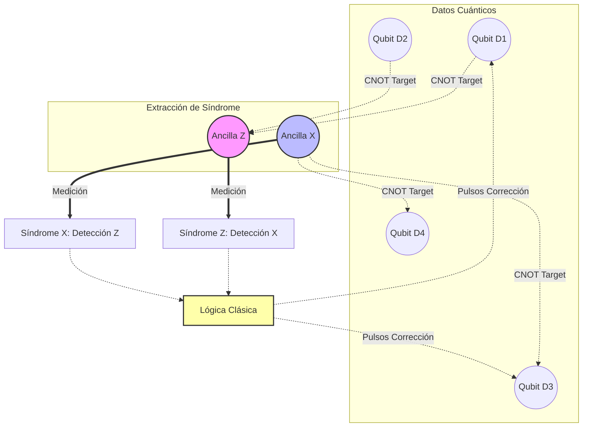

# Corrección de Errores y Hardware
La computación cuántica es extremadamente susceptible a la decoherencia y al ruido ambiental. La corrección de errores cuánticos (QEC) y el desarrollo de hardware cuántico robusto son los mayores desafíos en la construcción de ordenadores cuánticos escalables (tolerantes a fallos).

## 📜 Contexto Histórico
El teorema de no-clonación cuántica (descubierto en 1982 por Wootters, Zurek y Dieks) parecía imposibilitar la corrección de errores clásica, que se basa en hacer copias de la información. Sin embargo, en 1995, Peter Shor y Andrew Steane propusieron de manera independiente los primeros códigos de corrección de errores cuánticos, demostrando que la información podía distribuirse entre varios qubits entrelazados para protegerla sin clonarla. Simultáneamente, investigadores comenzaron a proponer arquitecturas físicas como iones atrapados (Cirac y Zoller, 1995) y superconductores.

## 🧮 Desarrollo Teórico Profundo

La corrección de errores cuánticos (QEC) aborda el problema fundamental de proteger la información cuántica contra la decoherencia y el ruido sin violar las leyes de la mecánica cuántica. A diferencia de la computación clásica, donde la redundancia se logra copiando bits, el teorema de no clonación prohíbe copiar estados cuánticos arbitrarios. Además, los errores cuánticos son continuos y la medición directa destruye la superposición. QEC resuelve esto codificando la información de un qubit lógico en el espacio de Hilbert entrelazado de múltiples qubits físicos y midiendo "síndromes" que revelan información sobre el error sin perturbar el estado lógico.

### 1. El Modelo de Error Discreto de Pauli

Aunque el estado de un qubit puede sufrir perturbaciones continuas, los errores cuánticos pueden discretizarse. Cualquier operador de error $E$ actuando sobre un único qubit puede expandirse en la base de las matrices de Pauli:
$$ E = e_0 I + e_1 X + e_2 Y + e_3 Z $$
donde $e_i$ son coeficientes complejos. Al medir el síndrome, la superposición del estado erróneo colapsa en uno de los errores discretos de Pauli. Si podemos corregir los errores $X$, $Y$ y $Z$, podemos corregir cualquier error arbitrario continuo.

El grupo de Pauli en $n$ qubits, denotado como $\mathcal{P}_n$, consiste en todos los productos tensoriales de matrices de Pauli con factores de fase globales:
$$ \mathcal{P}_n = \{ i^k P_1 \otimes P_2 \otimes \dots \otimes P_n \mid P_j \in \{I, X, Y, Z\}, k \in \{0, 1, 2, 3\} \} $$

### 2. Condiciones de Corrección de Errores (Knill-Laflamme)

Para que un código cuántico con una base de palabras código ortonormales $\{|i_L\rangle\}$ pueda corregir un conjunto de errores $\mathcal{E} = \{E_a\}$, debe satisfacer las condiciones de Knill-Laflamme:
$$ \langle i_L | E_a^\dagger E_b | j_L \rangle = C_{ab} \delta_{ij} $$
donde $C_{ab}$ es una matriz hermitiana que no depende de las palabras código $i, j$.

**Prueba paso a paso de suficiencia:**
1. Dado que $C_{ab}$ es hermitiana, puede ser diagonalizada por una matriz unitaria $U$: $D = U C U^\dagger$.
2. Definimos una nueva base de errores $F_k = \sum_a U_{ka} E_a$.
3. La condición se transforma en:
   $$ \langle i_L | F_k^\dagger F_l | j_L \rangle = d_k \delta_{kl} \delta_{ij} $$
   donde $d_k$ son los autovalores reales y no negativos de $C_{ab}$.
4. Esto implica que los estados $F_k |i_L\rangle$ y $F_l |j_L\rangle$ son ortogonales siempre que $k \neq l$ o $i \neq j$. 
5. Por lo tanto, una medición proyectiva puede distinguir unívocamente qué tipo de error $F_k$ ha ocurrido (sin revelar información sobre la base lógica $i, j$), permitiendo aplicar el operador inverso para restaurar el estado original.

### 3. El Formalismo de Estabilizadores (Gottesman)

El formalismo estabilizador es la herramienta algebraica más poderosa para diseñar códigos cuánticos. Se basa en describir el subespacio del código no mediante sus estados, sino mediante los operadores de Pauli que los dejan invariantes.

Sea $\mathcal{S} \subset \mathcal{P}_n$ un subgrupo abeliano del grupo de Pauli que no contiene el operador $-I$. El espacio de código $\mathcal{C}$ es el subespacio simultáneo de autovectores con autovalor $+1$ de todos los elementos (estabilizadores) $S \in \mathcal{S}$:
$$ \mathcal{C} = \{ |\psi\rangle \mid S |\psi\rangle = |\psi\rangle, \forall S \in \mathcal{S} \} $$

Si $\mathcal{S}$ tiene $n-k$ generadores independientes $\{S_1, S_2, \dots, S_{n-k}\}$, el código codifica $k$ qubits lógicos en $n$ qubits físicos. La dimensión del espacio de código es $2^k$.

**Detección de errores con Estabilizadores:**
Supongamos que ocurre un error de Pauli $E$. El estado corrompido es $E|\psi\rangle$. Si medimos el generador $S_i$, el resultado dependerá de las relaciones de conmutación de Pauli. Ya que dos operadores de Pauli o conmutan o anticonmutan:
- Si $[E, S_i] = 0$: $S_i (E|\psi\rangle) = E S_i |\psi\rangle = E|\psi\rangle$. El autovalor medido es $+1$.
- Si $\{E, S_i\} = 0$: $S_i (E|\psi\rangle) = -E S_i |\psi\rangle = -E|\psi\rangle$. El autovalor medido es $-1$.

El conjunto de resultados de las medidas de los generadores $(s_1, s_2, \dots, s_{n-k})$, donde $s_i \in \{+1, -1\}$, se llama el **síndrome del error**. Diferentes errores anticonmutarán con diferentes generadores, originando síndromes distintos.

### 4. Construcción del Código de Shor de 9 Qubits

Peter Shor propuso el primer código capaz de corregir errores arbitrarios de 1 qubit combinando la protección contra *bit flips* ($X$) y *phase flips* ($Z$). 

#### Paso 1: Código de Repetición para Bit Flip ($X$)
Para proteger contra un cambio de amplitud (error $X$), codificamos un qubit lógico en 3 físicos:
$$ |0_L\rangle_X = |000\rangle $$
$$ |1_L\rangle_X = |111\rangle $$
Los estabilizadores para este código son $Z_1 Z_2$ y $Z_2 Z_3$. Estos detectan cambios de paridad en la base $Z$.

#### Paso 2: Código de Repetición para Phase Flip ($Z$)
Un error de fase $Z$ actúa en la base $\{|+\rangle, |-\rangle\}$ exactamente igual que $X$ actúa en $\{|0\rangle, |1\rangle\}$. Codificamos:
$$ |0_L\rangle_Z = |+++\rangle $$
$$ |1_L\rangle_Z = |---\rangle $$
Los estabilizadores son $X_1 X_2$ y $X_2 X_3$.

#### Paso 3: Código de Shor Combinado
Shor concatenó estos dos conceptos. Cada qubit del código de fase se codifica internamente usando el código de bit-flip:
$$ |+\rangle_L = \frac{|000\rangle + |111\rangle}{\sqrt{2}} $$
$$ |-\rangle_L = \frac{|000\rangle - |111\rangle}{\sqrt{2}} $$

El qubit lógico completo de Shor se expresa en bloques de 3 qubits:
$$ |0_L\rangle = \left(\frac{|000\rangle + |111\rangle}{\sqrt{2}}\right)^{\otimes 3} $$
$$ |1_L\rangle = \left(\frac{|000\rangle - |111\rangle}{\sqrt{2}}\right)^{\otimes 3} $$

El código tiene $n=9$ y $k=1$, lo que requiere $9-1=8$ generadores estabilizadores:
- Para detectar errores de bit-flip ($X$) dentro de cada bloque, utilizamos pares $Z_i Z_j$:
  $$ g_1 = Z_1 Z_2 I I I I I I I, \quad g_2 = I Z_2 Z_3 I I I I I I $$
  $$ g_3 = I I I Z_4 Z_5 I I I I, \quad g_4 = I I I I Z_5 Z_6 I I I $$
  $$ g_5 = I I I I I I Z_7 Z_8 I, \quad g_6 = I I I I I I I Z_8 Z_9 $$
- Para detectar errores de fase ($Z$) entre los bloques, usamos bloques de $X$:
  $$ g_7 = X_1 X_2 X_3 X_4 X_5 X_6 I I I $$
  $$ g_8 = I I I X_4 X_5 X_6 X_7 X_8 X_9 $$

Cualquier error $E$ en un solo qubit originará un patrón de conmutación único frente a estos 8 estabilizadores, localizando espacialmente el error de manera precisa para su corrección.

### 5. Diagrama de la Arquitectura de Medición de Síndrome

Para evitar que la medición de los estabilizadores colapse la información del qubit de datos lógico, se utilizan "qubits auxiliares" (ancillas). El entrelazamiento transitorio transfiere la información de la paridad sin medir el dato directamente.

En los **Códigos de Superficie** (arquitectura dominante actualmente), los qubits se disponen en una red 2D bidimensional. Las ancillas alternan su rol midiendo paridades en base $X$ y $Z$ en un patrón de tablero de ajedrez, ofreciendo un altísimo grado de resistencia (tolerancia a fallos) asintótica frente a los errores locales, constituyendo la base de los prototipos modernos hacia la supremacía cuántica.

## 📚 Recursos Específicos

### Cursos
1. [Quantum Hardware y Control (Qutech/TU Delft en edX)](https://www.edx.org/course/quantum-hardware-and-control)
2. [Quantum Computing Systems (Coursera)](https://www.coursera.org/learn/quantum-computing-systems)
3. [Building a Quantum Computer (FutureLearn)](https://www.futurelearn.com/courses/building-a-quantum-computer)
4. [Quantum Error Correction (edX - Delft University)](https://www.edx.org/course/quantum-error-correction)
5. [Architecture of Quantum Computers (Coursera)](https://www.coursera.org/learn/architecture-quantum-computers)
6. [Fault-Tolerant Quantum Computing (Coursera)](https://www.coursera.org/learn/fault-tolerant-quantum-computing)

### Artículos y Simulaciones
1. [Scheme for reducing decoherence in quantum computer memory (P. Shor, 1995)](https://doi.org/10.1103/PhysRevA.52.R2493)
2. [Surface codes: Towards practical large-scale quantum computation (A. Fowler et al., 2012)](https://arxiv.org/abs/1208.0928)
3. [Stim (Fast Quantum Error Correction Simulator)](https://github.com/quantumlib/Stim)
4. [Qiskit Metal (Diseño de hardware cuántico)](https://qiskit.org/metal/)
5. [Superconducting Qubits: Current State of Play (Kjaergaard et al., 2020)](https://arxiv.org/abs/1905.13641)
6. [Trapped-Ion Quantum Computing: Progress and Challenges (Bruzewicz et al., 2019)](https://arxiv.org/abs/1904.04178)
7. [Fault-tolerant quantum computation with constant error rate (Aharonov & Ben-Or, 1997)](https://arxiv.org/abs/quant-ph/9611025)
8. [Quantum Error Correction for Beginners (Devitt et al., 2013)](https://arxiv.org/abs/0905.2794)

### 📖 Referencias Útiles y Bibliografía
1. [Quantum Computation and Quantum Information (Nielsen & Chuang)](https://doi.org/10.1017/CBO9780511976667)
2. [Quantum Error Correction (D. A. Lidar, T. A. Brun)](https://doi.org/10.1017/CBO9781139034807)
3. [Topological Quantum Computation (Z. Wang)](https://bookstore.ams.org/cbms-112/)
