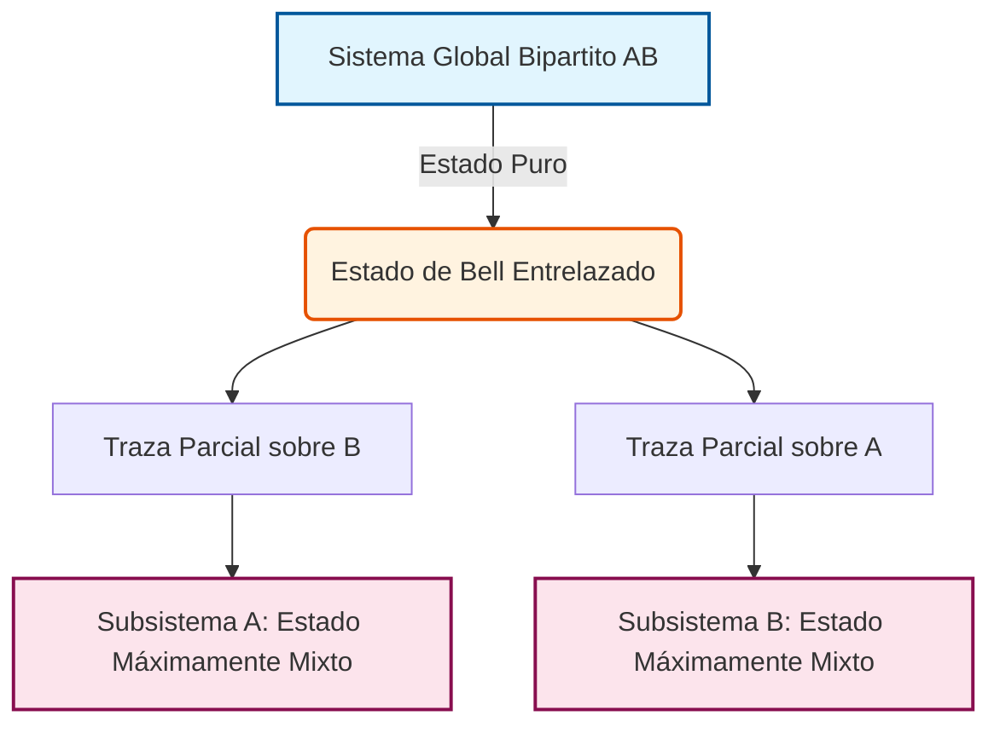

# Entrelazamiento y Medición

El entrelazamiento es una de las propiedades más características y menos clásicas de la física cuántica. La medición, por su parte, no solo extrae información sino que modifica el estado del sistema.

## Conceptos Fundamentales

- **Entrelazamiento**: Correlación cuántica no reducible a estados independientes.
- **Estados Bell**: Ejemplos canónicos de pares máximamente entrelazados.
- **Matriz densidad**: Herramienta para describir sistemas mixtos y subsistemas.
- **Decoherencia**: Pérdida de coherencia por interacción con el entorno.
- **Medición proyectiva**: Selecciona resultados con probabilidades dadas por la regla de Born.

## Ideas Clave

### 1. Correlaciones no clásicas
El entrelazamiento es el recurso detrás de teleportación, criptografía y muchas ventajas cuánticas.

### 2. Información parcial
Un sistema global puro puede contener subsistemas localmente mixtos.

### 3. Límites físicos
La medición impone restricciones profundas sobre clonación, conocimiento simultáneo y extracción de información.

## 🧮 Desarrollo Teórico Profundo

El entrelazamiento y la medición constituyen los pilares del procesamiento de la información cuántica. En esta sección abordaremos formalmente la estructura matemática de los sistemas bipartitos, las medidas cuánticas y la violación del realismo local.

### 1. Producto Tensorial y Sistemas Compuestos

El marco matemático para describir sistemas cuánticos compuestos es el producto tensorial de espacios de Hilbert. Sean $\mathcal{H}_A$ y $\mathcal{H}_B$ los espacios de Hilbert asociados a los subsistemas $A$ y $B$, con dimensiones $d_A$ y $d_B$ respectivamente. El espacio de Hilbert global del sistema compuesto es:

$$ \mathcal{H}_{AB} = \mathcal{H}_A \otimes \mathcal{H}_B $$

Dadas las bases ortonormales $\{ |i\rangle_A \}$ para $\mathcal{H}_A$ y $\{ |j\rangle_B \}$ para $\mathcal{H}_B$, el conjunto $\{ |i\rangle_A \otimes |j\rangle_B \}$, denotado habitualmente como $\{ |i,j\rangle \}$, forma una base ortonormal para $\mathcal{H}_{AB}$. La dimensión total es $d = d_A \times d_B$.

Cualquier estado puro general $|\Psi\rangle_{AB} \in \mathcal{H}_{AB}$ se puede escribir como una combinación lineal:

$$ |\Psi\rangle_{AB} = \sum_{i=1}^{d_A} \sum_{j=1}^{d_B} c_{ij} |i\rangle_A \otimes |j\rangle_B $$

donde $c_{ij} \in \mathbb{C}$ y $\sum_{i,j} |c_{ij}|^2 = 1$.

### 2. Entrelazamiento vs. Separabilidad

**Definición (Estado Separable):** Un estado puro $|\Psi\rangle_{AB}$ es separable si se puede expresar como el producto tensorial de estados individuales en cada subsistema:

$$ |\Psi\rangle_{AB} = |\psi\rangle_A \otimes |\phi\rangle_B $$

**Definición (Estado Entrelazado):** Un estado que no es separable se denomina entrelazado.

#### 2.1 Los Estados de Bell

Los estados de Bell son cuatro estados máximamente entrelazados de dos qubits ($d_A = d_B = 2$). Estos forman una base ortonormal para $\mathcal{H}_{AB} \cong \mathbb{C}^4$:

$$ |\Phi^\pm\rangle = \frac{1}{\sqrt{2}} ( |00\rangle \pm |11\rangle ) $$
$$ |\Psi^\pm\rangle = \frac{1}{\sqrt{2}} ( |01\rangle \pm |10\rangle ) $$

**Prueba de que $|\Phi^+\rangle$ es entrelazado:**

Supongamos por contradicción que $|\Phi^+\rangle$ es separable, es decir, puede escribirse como $|\Phi^+\rangle = (a_0|0\rangle + a_1|1\rangle)_A \otimes (b_0|0\rangle + b_1|1\rangle)_B$.
Desarrollando el producto tensorial, obtenemos:

$$ |\Phi^+\rangle = a_0 b_0 |00\rangle + a_0 b_1 |01\rangle + a_1 b_0 |10\rangle + a_1 b_1 |11\rangle $$

Igualando los coeficientes con la definición de $|\Phi^+\rangle = \frac{1}{\sqrt{2}}|00\rangle + \frac{1}{\sqrt{2}}|11\rangle$:
1) $a_0 b_0 = \frac{1}{\sqrt{2}}$
2) $a_0 b_1 = 0$
3) $a_1 b_0 = 0$
4) $a_1 b_1 = \frac{1}{\sqrt{2}}$

De (2), dado que un producto es cero, o $a_0 = 0$ o $b_1 = 0$. 
- Si $a_0 = 0$, entonces (1) implica $0 = 1/\sqrt{2}$, lo cual es absurdo.
- Si $b_1 = 0$, entonces (4) implica $0 = 1/\sqrt{2}$, lo cual también es absurdo.

Por lo tanto, la suposición inicial es falsa, y $|\Phi^+\rangle$ no es separable, es decir, es un estado entrelazado. $\blacksquare$

### 3. Matriz Densidad y Traza Parcial

Para describir sistemas en los que tenemos una ignorancia estadística (estados mixtos) o subsistemas de un sistema compuesto entrelazado, recurrimos al formalismo de la matriz densidad, $\rho$.
Un estado cuántico está representado por un operador de densidad $\rho$ que cumple tres propiedades fundamentales:
1. $\rho^\dagger = \rho$ (Hermiticidad)
2. $\text{Tr}(\rho) = 1$ (Normalización de probabilidad)
3. $\rho \geq 0$ (Semi-definición positiva)

Para un estado puro $|\psi\rangle$, $\rho = |\psi\rangle\langle\psi|$.

#### 3.1 La Traza Parcial

Si tenemos el estado global $\rho_{AB}$ de un sistema compuesto, el estado local (reducido) del subsistema $A$, se obtiene aplicando la operación matemática de traza parcial sobre el subsistema $B$:

$$ \rho_A = \text{Tr}_B(\rho_{AB}) $$

Analíticamente, dada una base ortonormal $\{|j\rangle_B\}$ para $\mathcal{H}_B$, la traza parcial se evalúa como:

$$ \rho_A = \sum_{j} (\mathbb{I}_A \otimes \langle j|_B) \rho_{AB} (\mathbb{I}_A \otimes |j\rangle_B) $$

**Ejemplo y Derivación para el Estado de Bell $|\Phi^+\rangle$:**

Sea el estado global $\rho_{AB} = |\Phi^+\rangle\langle\Phi^+|$:

$$ \rho_{AB} = \frac{1}{2} \Big( |00\rangle\langle 00| + |00\rangle\langle 11| + |11\rangle\langle 00| + |11\rangle\langle 11| \Big) $$

Evaluamos la traza parcial respecto a $B$:

$$ \rho_A = \text{Tr}_B(\rho_{AB}) = \langle 0|_B \rho_{AB} |0\rangle_B + \langle 1|_B \rho_{AB} |1\rangle_B $$

Primero evaluamos la contribución para $\langle 0|_B \dots |0\rangle_B$:
$$ \langle 0|_B \rho_{AB} |0\rangle_B = \frac{1}{2} \Big( |0\rangle_A\langle 0|_A \langle 0|0\rangle \langle 0|0\rangle + |0\rangle_A\langle 1|_A \langle 0|0\rangle \langle 1|0\rangle + |1\rangle_A\langle 0|_A \langle 0|1\rangle \langle 0|0\rangle + |1\rangle_A\langle 1|_A \langle 0|1\rangle \langle 1|0\rangle \Big) $$
$$ = \frac{1}{2} |0\rangle\langle 0| $$

De manera similar, la contribución para $\langle 1|_B \dots |1\rangle_B$:
$$ \langle 1|_B \rho_{AB} |1\rangle_B = \frac{1}{2} |1\rangle\langle 1| $$

Sumando ambos términos:

$$ \rho_A = \frac{1}{2} \big( |0\rangle\langle 0| + |1\rangle\langle 1| \big) = \frac{1}{2} \mathbb{I} $$

El subsistema local se describe mediante una matriz identidad escalada, lo cual representa el **estado máximamente mixto**. Esto demuestra que para un estado máximamente entrelazado, la información global es máxima (entropía de von Neumann $S(\rho_{AB})=0$), pero la información local sobre cada subsistema es nula (entropía $S(\rho_A)=1$ bit para un qubit).



### 4. Desigualdad de CHSH y Teorema de Bell

El teorema de Bell y en particular la desigualdad CHSH demuestran que las predicciones de la mecánica cuántica no pueden ser reproducidas por ninguna teoría local de variables ocultas.

Consideremos que Alice mide observables $A$ y $a$ y Bob mide observables $B$ y $b$. Los resultados de estas medidas dicotómicas (espín o polarización) siempre toman valores $\pm 1$. Por lo tanto, para cualquier realización dada, bajo un marco de realismo local, la cantidad:

$$ S_{CHSH} = (A - a)B + (A + a)b $$
puede evaluarse algebraicamente. Ya que $A, a \in \{-1, +1\}$, uno de los términos $(A-a)$ o $(A+a)$ debe ser 0, y el otro debe ser $\pm 2$. Dado que $B, b \in \{-1, +1\}$, se deduce rigurosamente que $S_{CHSH} \in \{-2, 2\}$.

Calculando el valor esperado estadístico sobre múltiples ejecuciones, el límite de realismo local es:

$$ |\langle S_{CHSH} \rangle| = |\langle A B \rangle - \langle a B \rangle + \langle A b \rangle + \langle a b \rangle| \leq 2 $$

**Violación Cuántica:**
Consideremos que Alice y Bob comparten el estado de Bell singlet $|\Psi^-\rangle = \frac{1}{\sqrt{2}}(|01\rangle - |10\rangle)$. 
Alice mide en direcciones correspondientes a los observables de Pauli: $A = \sigma_z$, $a = \sigma_x$.
Bob mide en direcciones rotadas: $B = -\frac{1}{\sqrt{2}}(\sigma_z + \sigma_x)$ y $b = \frac{1}{\sqrt{2}}(\sigma_z - \sigma_x)$.

La correlación para un singlet al medir proyectando en direcciones $\hat{n}_A$ y $\hat{n}_B$ es:
$$ \langle \Psi^- | (\hat{n}_A \cdot \vec{\sigma} \otimes \hat{n}_B \cdot \vec{\sigma}) |\Psi^- \rangle = -\hat{n}_A \cdot \hat{n}_B $$

Calculamos cada valor esperado:
1) $\langle A B \rangle = -\hat{z} \cdot \left[ -\frac{1}{\sqrt{2}}(\hat{z} + \hat{x}) \right] = \frac{1}{\sqrt{2}}$
2) $\langle a B \rangle = -\hat{x} \cdot \left[ -\frac{1}{\sqrt{2}}(\hat{z} + \hat{x}) \right] = \frac{1}{\sqrt{2}}$
3) $\langle A b \rangle = -\hat{z} \cdot \left[ \frac{1}{\sqrt{2}}(\hat{z} - \hat{x}) \right] = -\frac{1}{\sqrt{2}}$
4) $\langle a b \rangle = -\hat{x} \cdot \left[ \frac{1}{\sqrt{2}}(\hat{z} - \hat{x}) \right] = \frac{1}{\sqrt{2}}$

Por lo tanto, la cantidad $S_{CHSH}$ para estas medidas resulta:

$$ \langle S_{CHSH} \rangle = \frac{1}{\sqrt{2}} - \frac{1}{\sqrt{2}} + \left(-\frac{1}{\sqrt{2}}\right) - \frac{1}{\sqrt{2}} = -2\sqrt{2} $$

El valor absoluto es $2\sqrt{2} \approx 2.828 > 2$. Este valor máximo permitido en mecánica cuántica se conoce como el **límite de Tsirelson**. Esta derivación demuestra inequívocamente la no-localidad intrínseca (o contextualidad cuántica) frente a cualquier modelo de variables ocultas locales.

### 5. Medidas Cuánticas y POVMs

#### 5.1 Medidas Proyectivas (von Neumann)
Un observable en mecánica cuántica es un operador hermítico $O$ asociado a una medida. Se descompone espectralmente como:

$$ O = \sum_{m} \lambda_m P_m $$

donde $\lambda_m$ son los valores propios reales (posibles resultados experimentales) y $P_m = |m\rangle\langle m|$ son los proyectores ortogonales correspondientes. 
- La probabilidad de medir $\lambda_m$ en un estado $|\psi\rangle$ está dada por la regla de Born:
  $$ p(m) = \langle\psi|P_m|\psi\rangle $$
- El estado posterior a la medida (colapso de la función de onda) se actualiza de acuerdo a:
  $$ |\psi'\rangle = \frac{P_m |\psi\rangle}{\sqrt{p(m)}} $$

#### 5.2 Medidas Generalizadas (POVMs)
Una medida positiva valuada por operadores (POVM - *Positive Operator-Valued Measure*) permite describir procesos de medición que no son completamente proyectivos, incluyendo interacción con aparatos con ruido o medidas no deterministas.

Un POVM consiste en un conjunto de operadores hermíticos semi-definidos positivos $\{ E_m \}$, donde $E_m \geq 0$, que resuelven la identidad:

$$ \sum_{m} E_m = \mathbb{I} $$

La probabilidad de obtener el resultado $m$ es:
$$ p(m) = \text{Tr}(\rho E_m) = \langle \psi | E_m | \psi \rangle $$

A diferencia de los proyectores, los elementos de un POVM no necesitan cumplir $E_m^2 = E_m$ ni ser mutuamente ortogonales, permitiendo el estudio de técnicas avanzadas como **State Discrimination** óptimo donde las proyecciones estándar no bastan. 

El **Teorema de Naimark** postula formalmente que cualquier POVM sobre un espacio $\mathcal{H}_S$ puede representarse físicamente acoplando el sistema principal a un espacio auxiliar o *ancilla* $\mathcal{H}_A$, realizando una transformación unitaria conjunta y, posteriormente, una medida proyectiva en el espacio auxiliar.

## 📝 Guía de Ejercicios Resueltos

### Ejercicio 1: Desigualdad CHSH y Entrelazamiento
Demuestre que el estado singlete de dos qubits $|\psi^{-}\rangle = \frac{1}{\sqrt{2}}(|01\rangle - |10\rangle)$ viola la desigualdad CHSH y encuentre el valor máximo de la correlación cuántica.

**Solución paso a paso:**
1. El operador CHSH es $S = A \otimes B + A \otimes B' + A' \otimes B - A' \otimes B'$. Para variables clásicas locales, $|\langle S \rangle| \le 2$.
2. Elegimos las mediciones para Alice como $A = \sigma_z$ y $A' = \sigma_x$.
3. Elegimos las mediciones para Bob como $B = \frac{-\sigma_z - \sigma_x}{\sqrt{2}}$ y $B' = \frac{\sigma_z - \sigma_x}{\sqrt{2}}$.
4. Evaluamos las correlaciones para el estado singlete $\langle \psi^- | \sigma_i \otimes \sigma_j | \psi^- \rangle = -\delta_{ij}$.
5. Calculamos cada término:
   $$ \langle A \otimes B \rangle = \frac{1}{\sqrt{2}}, \quad \langle A \otimes B' \rangle = \frac{1}{\sqrt{2}}, \quad \langle A' \otimes B \rangle = \frac{1}{\sqrt{2}}, \quad \langle A' \otimes B' \rangle = -\frac{1}{\sqrt{2}} $$
6. Sumando los términos, el valor de expectación es:
   $$ \langle S \rangle = \frac{1}{\sqrt{2}} + \frac{1}{\sqrt{2}} + \frac{1}{\sqrt{2}} - \left(-\frac{1}{\sqrt{2}}\right) = 2\sqrt{2} $$
7. Como $2\sqrt{2} > 2$, la mecánica cuántica viola el límite clásico (Desigualdad de Bell).

### Ejercicio 2: Código de Corrección de Errores de Shor (9 qubits)
Muestre cómo el código de Shor protege contra un error de fase $Z$ arbitrario en el primer qubit.

**Solución paso a paso:**
1. El estado lógico $|0\rangle_L$ está codificado como $\frac{1}{2\sqrt{2}}(|000\rangle + |111\rangle)^{\otimes 3}$.
2. Supongamos un error de fase en el primer qubit: $Z_1 |\psi_L\rangle$. El término interior pasa a ser $\frac{1}{\sqrt{2}}(Z|000\rangle + Z|111\rangle) = \frac{1}{\sqrt{2}}(|000\rangle - |111\rangle)$.
3. Para detectar el error, realizamos mediciones de síndrome con los operadores estabilizadores del código de fase: $X_1 X_2 X_3 X_4 X_5 X_6$ y $X_4 X_5 X_6 X_7 X_8 X_9$.
4. El error de fase es detectado por la medición cruzada entre los bloques. Equivalentemente, al aplicar compuertas Hadamard en cada bloque y realizar paridad $Z$ como en el código bit-flip, identificamos en qué bloque ocurrió el cambio de signo.
5. Tras identificar que el error ocurrió en el primer bloque de 3 qubits, aplicamos el operador de corrección $Z$ correspondiente al bloque, el cual restaura la fase global relativa.
6. El estado vuelve exactamente a $|\psi_L\rangle$ sin pérdida de información, probando la efectividad contra un error $Z_1$.

### Ejercicio 3: Transformada de Fourier Cuántica (QFT)
Construya el circuito y derive la acción de la QFT sobre un estado de base computacional de 3 qubits $|x\rangle = |x_2 x_1 x_0\rangle$.

**Solución paso a paso:**
1. La definición de la QFT en $n$ qubits es $|x\rangle \to \frac{1}{\sqrt{2^n}} \sum_{y=0}^{2^n-1} e^{2\pi i x y / 2^n} |y\rangle$.
2. Para 3 qubits, se puede reescribir como un producto tensorial:
   $$ \frac{1}{\sqrt{8}} (|0\rangle + e^{2\pi i 0.x_0}|1\rangle) \otimes (|0\rangle + e^{2\pi i 0.x_1 x_0}|1\rangle) \otimes (|0\rangle + e^{2\pi i 0.x_2 x_1 x_0}|1\rangle) $$
3. Se aplica primero una compuerta Hadamard al qubit $x_2$, obteniendo $\frac{1}{\sqrt{2}}(|0\rangle + e^{2\pi i 0.x_2}|1\rangle)$.
4. Se aplican rotaciones controladas $R_2$ dependiente de $x_1$ y $R_3$ dependiente de $x_0$, transformando el estado a $\frac{1}{\sqrt{2}}(|0\rangle + e^{2\pi i 0.x_2 x_1 x_0}|1\rangle)$.
5. Se repite el proceso para los qubits restantes, aplicando Hadamard y $R_2$ en $x_1$, y finalmente Hadamard en $x_0$.
6. El circuito final requiere operaciones SWAP para invertir el orden de los qubits y coincidir con la convención estándar.

## 💻 Simulaciones Computacionales

Simulación de la violación de la desigualdad de CHSH mediante el cálculo de valores esperados de observables en estados de Bell.

```python
import numpy as np

# Matrices de Pauli
I = np.eye(2)
X = np.array([[0, 1], [1, 0]])
Z = np.array([[1, 0], [0, -1]])

# Estado Singlete |Psi->
psi_minus = np.array([0, 1, -1, 0]) / np.sqrt(2)

def expectation_value(op_A, op_B, state):
    op_AB = np.kron(op_A, op_B)
    return np.real(state.conj().T @ op_AB @ state)

# Observables de Alice
A = Z
A_prime = X

# Observables de Bob
B = (-Z - X) / np.sqrt(2)
B_prime = (Z - X) / np.sqrt(2)

# Valores esperados
E_AB = expectation_value(A, B, psi_minus)
E_ABp = expectation_value(A, B_prime, psi_minus)
E_ApB = expectation_value(A_prime, B, psi_minus)
E_ApBp = expectation_value(A_prime, B_prime, psi_minus)

S_CHSH = E_AB - E_ABp + E_ApB + E_ApBp

print(f"<A⊗B>  = {E_AB:.4f}")
print(f"<A⊗B'> = {E_ABp:.4f}")
print(f"<A'⊗B> = {E_ApB:.4f}")
print(f"<A'⊗B'>= {E_ApBp:.4f}")
print("-" * 20)
print(f"S_CHSH = {S_CHSH:.4f}")
if np.abs(S_CHSH) > 2.0:
    print("¡Desigualdad CHSH violada! El sistema exhibe no-localidad cuántica.")
else:
    print("Mecánica clásica no superada.")
```

## 🚀 Fronteras de Investigación y Problemas Abiertos

En 2026, el análisis y caracterización del entrelazamiento ha trascendido los meros pares bipártitos de qubits, abriéndose camino en la vastedad fenomenológica de la **Termodinámica Cuántica de Muchos Cuerpos** y la cuantificación del entrelazamiento macroscópico.

- **Entrelazamiento Multipartito Complejo (W, GHZ vs Grafos):** Determinar, clasificar taxonómicamente y sintetizar empíricamente verdaderos estados entrelazados de cientos de subsistemas sin caer en descripciones polinómicas. El problema de separabilidad multipartita es notoriamente NP-Hard. El límite exacto del entrelazamiento genuino no local en sistemas condensados es aún objeto de intenso debate (e.g. ¿Cuándo la Entropía Topológica de Entrelazamiento distingue inequívocamente el orden líquido de espín a temperatura finita?).
- **El Problema de la Discordia Cuántica (Quantum Discord):** Identificar con exactitud el rol algorítmico y termodinámico (para los Motores Térmicos Cuánticos) de las correlaciones no clásicas que *sobreviven* a la ausencia estricta de entrelazamiento. Aún no se conoce el límite último extractable del trabajo (Ergotropía) usando ensambles densos con discordancia no nula.
- **Mediciones Continuas, POVM Adaptativos y Efecto Zenón Inverso:** Las fronteras actuales persiguen el régimen de medición estocástica débil (weak measurement routing) para la retroalimentación en tiempo real con latencias ultra-bajas, con la incógnita de cuál es la precisión óptima de la Inferencia Bayesiana Cuántica Filtrada frente a fluctuaciones no-Markovianas del baño térmico.

## 📐 Formalismo Matemático Avanzado (Nivel Posgrado/Doctorado)

El tratamiento riguroso de medidas cuánticas (POVM) y canales de decoherencia (CPTP maps) requiere la inmersión en la **Teoría de C*-Álgebras y Mapas Completamente Positivos y Preservadores de Traza**.

Cualquier dinámica discreta general (como una medición) del sistema cuántico $\mathcal{H}_A$, denotado a través del espacio de clase traza afín (estado $\rho \in \mathcal{T}(\mathcal{H}_A)$), debe estar regido por un súper-operador (Canal Cuántico) $\mathcal{E}: \mathcal{T}(\mathcal{H}_A) \to \mathcal{T}(\mathcal{H}_B)$. Para asegurar la consistencia causal probabilística de cualquier subsistema extendido en el multiverso tensor $\mathcal{H}_A \otimes \mathcal{H}_{aux}$, el canal debe ser **Completamente Positivo** (Teorema de Stinespring). 

La formalización algebraica se comprueba verificando que la *Matriz Dinámica de Choi-Jamiołkowski* es definida no negativa. Isomorfismo de Choi-Jamiołkowski:
Dado un estado máximamente entrelazado $|\Omega\rangle = \frac{1}{\sqrt{d}} \sum_{i=1}^d |i\rangle \otimes |i\rangle$, la isometría unívoca es:
$$ J(\mathcal{E}) = (\mathcal{E} \otimes \mathbb{I}) (|\Omega\rangle \langle\Omega|) \geq 0 $$

En cuanto al Entrelazamiento de Formación (Entanglement of Formation) y Entropía Topológica para el Entrelazamiento Bipartito sobre Funcionales Convexas. El estado óptimo se busca minimizando el índice espectral:
$$ E_F(\rho) = \inf \left\{ \sum_j p_j S(\text{Tr}_B(|\psi_j\rangle\langle\psi_j|)) \;\Bigg|\; \rho = \sum_j p_j |\psi_j\rangle\langle\psi_j| \right\} $$

Matemáticamente, para los estados de clase Genuinamente Multipartitos (GME), el análisis invoca el Álgebra Polinomial de los Invariantes Locales Unitarios. La medida polinómica canónica, el "3-Tangle" (o hiperdeterminante de Cayley), mide invariantes de superposición para 3 qubits ($| \psi \rangle = \sum c_{ijk} |i,j,k\rangle$), expresándose mediante tensores antisimétricos con contracciones tensoriales:
$$ \tau_{ABC} = 4 \left| d_1 - 2 d_2 + 4 d_3 \right| $$
donde $d_m$ son contracciones polinomiales complejas de grado 4 de la amplitud métrica $c_{ijk}$. Extender estas métricas topológicas irreductibles y variedades seccionadas hipercomplejas a más de 4 qubits subyace la actual gran incógnita matemática en Teoría Cuántica de la Información.

## 📚 Recursos Específicos

### Cursos Recomendados
1. [Quantum Entanglement and Decoherence (Coursera)](https://www.coursera.org/learn/quantum-entanglement)
2. [Quantum Measurement (MIT OpenCourseWare)](https://ocw.mit.edu/courses/quantum-measurement)
3. [The Physics of Quantum Information (edX)](https://www.edx.org/course/physics-of-quantum-information)

### Artículos y Simulaciones
1. **Can Quantum-Mechanical Description of Physical Reality Be Considered Complete? (Einstein, Podolsky, Rosen, 1935)**
   - **Enlace:** [https://doi.org/10.1103/PhysRev.47.777](https://doi.org/10.1103/PhysRev.47.777)
   - **Importancia Teórica:** El artículo EPR, que formalizó conceptualmente el entrelazamiento cuántico señalándolo paradójicamente como "acción espeluznante a distancia" (spooky action at a distance).
   - **Fondo Matemático:** Examina estados inseparables de la forma $|\psi\rangle = \int dp |p\rangle |-p\rangle$, donde la posición relativa $x_1 - x_2$ y momento total $p_1 + p_2$ conmutan:
     $$
     [X_1 - X_2, P_1 + P_2] = [X_1, P_1] - [X_2, P_2] = i\hbar - i\hbar = 0
     $$
   - **Implicaciones Físicas:** Demuestra que si se exige causalidad local estricta, la mecánica cuántica no puede describir de manera completa todos los elementos de la realidad física, impulsando las teorías de variables ocultas.

2. **On the Einstein Podolsky Rosen paradox (J. S. Bell, 1964)**
   - **Enlace:** [https://doi.org/10.1103/PhysicsPhysiqueFizika.1.195](https://doi.org/10.1103/PhysicsPhysiqueFizika.1.195)
   - **Importancia Teórica:** Las desigualdades de Bell. Proveyó el mecanismo matemático para falsar empíricamente cualquier teoría de variables ocultas locales.
   - **Fondo Matemático:** Establece que para cualquier modelo determinista local, la correlación de medidas $P(\vec{a}, \vec{b})$ debe satisfacer la desigualdad de CHSH:
     $$
     |E(a, b) - E(a, b') + E(a', b) + E(a', b')| \leq 2
     $$
     Mientras que la mecánica cuántica para el estado singlete viola este límite alcanzando $2\sqrt{2}$.
   - **Implicaciones Físicas:** Probó que el universo, en su nivel fundamental, es intrínsecamente no-local, marcando el nacimiento de la teoría de la información cuántica experimental.

3. **Decoherence and the transition from quantum to classical (W. Zurek, 2003)**
   - **Enlace:** [https://arxiv.org/abs/quant-ph/0306072](https://arxiv.org/abs/quant-ph/0306072)
   - **Importancia Teórica:** Resuelve en gran medida el problema de la medición explicando el colapso aparente y cómo surge el mundo clásico macroscópico a partir de la cuántica (Darwinismo Cuántico).
   - **Fondo Matemático:** Estudia la dinámica de la matriz de densidad reducida $\rho_S = \text{Tr}_E[\rho_{SE}]$ bajo un hamiltoniano de interacción con el entorno $H_{int}$. La decoherencia suprime los términos no diagonales de $\rho_S$ en la base de "pointer states":
     $$
     \rho_S(t) \approx \sum_i P_i |\pi_i\rangle \langle \pi_i|
     $$
   - **Implicaciones Físicas:** Desmitifica el papel del observador consciente, mostrando que la interacción continua y no evitable con el ambiente es lo que induce la selección de superposiciones viables.

### 📖 Referencias Útiles y Bibliografía
1. [Quantum Computation and Quantum Information (Nielsen & Chuang)](https://doi.org/10.1017/CBO9780511976667)
2. [Quantum Measurement (V. B. Braginsky, F. Ya. Khalili)](https://doi.org/10.1017/CBO9780511622748)
