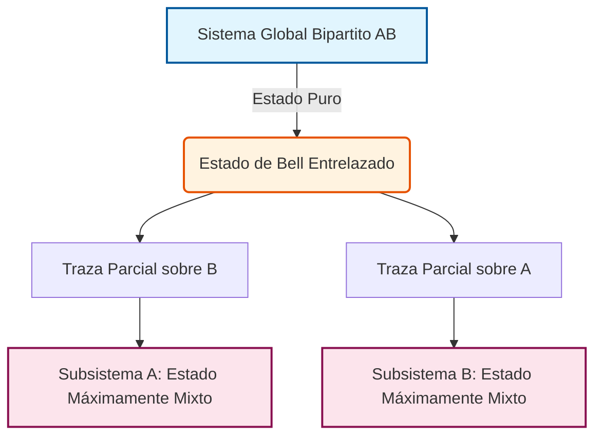

# Entrelazamiento y Medición

El entrelazamiento es una de las propiedades más características y menos clásicas de la física cuántica. La medición, por su parte, no solo extrae información sino que modifica el estado del sistema.

## Conceptos Fundamentales

- **Entrelazamiento**: Correlación cuántica no reducible a estados independientes.
- **Estados Bell**: Ejemplos canónicos de pares máximamente entrelazados.
- **Matriz densidad**: Herramienta para describir sistemas mixtos y subsistemas.
- **Decoherencia**: Pérdida de coherencia por interacción con el entorno.
- **Medición proyectiva**: Selecciona resultados con probabilidades dadas por la regla de Born.

## Ideas Clave

### 1. Correlaciones no clásicas
El entrelazamiento es el recurso detrás de teleportación, criptografía y muchas ventajas cuánticas.

### 2. Información parcial
Un sistema global puro puede contener subsistemas localmente mixtos.

### 3. Límites físicos
La medición impone restricciones profundas sobre clonación, conocimiento simultáneo y extracción de información.

## 🧮 Desarrollo Teórico Profundo

El entrelazamiento y la medición constituyen los pilares del procesamiento de la información cuántica. En esta sección abordaremos formalmente la estructura matemática de los sistemas bipartitos, las medidas cuánticas y la violación del realismo local.

### 1. Producto Tensorial y Sistemas Compuestos

El marco matemático para describir sistemas cuánticos compuestos es el producto tensorial de espacios de Hilbert. Sean $\mathcal{H}_A$ y $\mathcal{H}_B$ los espacios de Hilbert asociados a los subsistemas $A$ y $B$, con dimensiones $d_A$ y $d_B$ respectivamente. El espacio de Hilbert global del sistema compuesto es:

$$ \mathcal{H}_{AB} = \mathcal{H}_A \otimes \mathcal{H}_B $$

Dadas las bases ortonormales $\{ |i\rangle_A \}$ para $\mathcal{H}_A$ y $\{ |j\rangle_B \}$ para $\mathcal{H}_B$, el conjunto $\{ |i\rangle_A \otimes |j\rangle_B \}$, denotado habitualmente como $\{ |i,j\rangle \}$, forma una base ortonormal para $\mathcal{H}_{AB}$. La dimensión total es $d = d_A \times d_B$.

Cualquier estado puro general $|\Psi\rangle_{AB} \in \mathcal{H}_{AB}$ se puede escribir como una combinación lineal:

$$ |\Psi\rangle_{AB} = \sum_{i=1}^{d_A} \sum_{j=1}^{d_B} c_{ij} |i\rangle_A \otimes |j\rangle_B $$

donde $c_{ij} \in \mathbb{C}$ y $\sum_{i,j} |c_{ij}|^2 = 1$.

### 2. Entrelazamiento vs. Separabilidad

**Definición (Estado Separable):** Un estado puro $|\Psi\rangle_{AB}$ es separable si se puede expresar como el producto tensorial de estados individuales en cada subsistema:

$$ |\Psi\rangle_{AB} = |\psi\rangle_A \otimes |\phi\rangle_B $$

**Definición (Estado Entrelazado):** Un estado que no es separable se denomina entrelazado.

#### 2.1 Los Estados de Bell

Los estados de Bell son cuatro estados máximamente entrelazados de dos qubits ($d_A = d_B = 2$). Estos forman una base ortonormal para $\mathcal{H}_{AB} \cong \mathbb{C}^4$:

$$ |\Phi^\pm\rangle = \frac{1}{\sqrt{2}} ( |00\rangle \pm |11\rangle ) $$
$$ |\Psi^\pm\rangle = \frac{1}{\sqrt{2}} ( |01\rangle \pm |10\rangle ) $$

**Prueba de que $|\Phi^+\rangle$ es entrelazado:**

Supongamos por contradicción que $|\Phi^+\rangle$ es separable, es decir, puede escribirse como $|\Phi^+\rangle = (a_0|0\rangle + a_1|1\rangle)_A \otimes (b_0|0\rangle + b_1|1\rangle)_B$.
Desarrollando el producto tensorial, obtenemos:

$$ |\Phi^+\rangle = a_0 b_0 |00\rangle + a_0 b_1 |01\rangle + a_1 b_0 |10\rangle + a_1 b_1 |11\rangle $$

Igualando los coeficientes con la definición de $|\Phi^+\rangle = \frac{1}{\sqrt{2}}|00\rangle + \frac{1}{\sqrt{2}}|11\rangle$:
1) $a_0 b_0 = \frac{1}{\sqrt{2}}$
2) $a_0 b_1 = 0$
3) $a_1 b_0 = 0$
4) $a_1 b_1 = \frac{1}{\sqrt{2}}$

De (2), dado que un producto es cero, o $a_0 = 0$ o $b_1 = 0$. 
- Si $a_0 = 0$, entonces (1) implica $0 = 1/\sqrt{2}$, lo cual es absurdo.
- Si $b_1 = 0$, entonces (4) implica $0 = 1/\sqrt{2}$, lo cual también es absurdo.

Por lo tanto, la suposición inicial es falsa, y $|\Phi^+\rangle$ no es separable, es decir, es un estado entrelazado. $\blacksquare$

### 3. Matriz Densidad y Traza Parcial

Para describir sistemas en los que tenemos una ignorancia estadística (estados mixtos) o subsistemas de un sistema compuesto entrelazado, recurrimos al formalismo de la matriz densidad, $\rho$.
Un estado cuántico está representado por un operador de densidad $\rho$ que cumple tres propiedades fundamentales:
1. $\rho^\dagger = \rho$ (Hermiticidad)
2. $\text{Tr}(\rho) = 1$ (Normalización de probabilidad)
3. $\rho \geq 0$ (Semi-definición positiva)

Para un estado puro $|\psi\rangle$, $\rho = |\psi\rangle\langle\psi|$.

#### 3.1 La Traza Parcial

Si tenemos el estado global $\rho_{AB}$ de un sistema compuesto, el estado local (reducido) del subsistema $A$, se obtiene aplicando la operación matemática de traza parcial sobre el subsistema $B$:

$$ \rho_A = \text{Tr}_B(\rho_{AB}) $$

Analíticamente, dada una base ortonormal $\{|j\rangle_B\}$ para $\mathcal{H}_B$, la traza parcial se evalúa como:

$$ \rho_A = \sum_{j} (\mathbb{I}_A \otimes \langle j|_B) \rho_{AB} (\mathbb{I}_A \otimes |j\rangle_B) $$

**Ejemplo y Derivación para el Estado de Bell $|\Phi^+\rangle$:**

Sea el estado global $\rho_{AB} = |\Phi^+\rangle\langle\Phi^+|$:

$$ \rho_{AB} = \frac{1}{2} \Big( |00\rangle\langle 00| + |00\rangle\langle 11| + |11\rangle\langle 00| + |11\rangle\langle 11| \Big) $$

Evaluamos la traza parcial respecto a $B$:

$$ \rho_A = \text{Tr}_B(\rho_{AB}) = \langle 0|_B \rho_{AB} |0\rangle_B + \langle 1|_B \rho_{AB} |1\rangle_B $$

Primero evaluamos la contribución para $\langle 0|_B \dots |0\rangle_B$:
$$ \langle 0|_B \rho_{AB} |0\rangle_B = \frac{1}{2} \Big( |0\rangle_A\langle 0|_A \langle 0|0\rangle \langle 0|0\rangle + |0\rangle_A\langle 1|_A \langle 0|0\rangle \langle 1|0\rangle + |1\rangle_A\langle 0|_A \langle 0|1\rangle \langle 0|0\rangle + |1\rangle_A\langle 1|_A \langle 0|1\rangle \langle 1|0\rangle \Big) $$
$$ = \frac{1}{2} |0\rangle\langle 0| $$

De manera similar, la contribución para $\langle 1|_B \dots |1\rangle_B$:
$$ \langle 1|_B \rho_{AB} |1\rangle_B = \frac{1}{2} |1\rangle\langle 1| $$

Sumando ambos términos:

$$ \rho_A = \frac{1}{2} \big( |0\rangle\langle 0| + |1\rangle\langle 1| \big) = \frac{1}{2} \mathbb{I} $$

El subsistema local se describe mediante una matriz identidad escalada, lo cual representa el **estado máximamente mixto**. Esto demuestra que para un estado máximamente entrelazado, la información global es máxima (entropía de von Neumann $S(\rho_{AB})=0$), pero la información local sobre cada subsistema es nula (entropía $S(\rho_A)=1$ bit para un qubit).

### 4. Desigualdad de CHSH y Teorema de Bell

El teorema de Bell y en particular la desigualdad CHSH demuestran que las predicciones de la mecánica cuántica no pueden ser reproducidas por ninguna teoría local de variables ocultas.

Consideremos que Alice mide observables $A$ y $a$ y Bob mide observables $B$ y $b$. Los resultados de estas medidas dicotómicas (espín o polarización) siempre toman valores $\pm 1$. Por lo tanto, para cualquier realización dada, bajo un marco de realismo local, la cantidad:

$$ S_{CHSH} = (A - a)B + (A + a)b $$
puede evaluarse algebraicamente. Ya que $A, a \in \{-1, +1\}$, uno de los términos $(A-a)$ o $(A+a)$ debe ser 0, y el otro debe ser $\pm 2$. Dado que $B, b \in \{-1, +1\}$, se deduce rigurosamente que $S_{CHSH} \in \{-2, 2\}$.

Calculando el valor esperado estadístico sobre múltiples ejecuciones, el límite de realismo local es:

$$ |\langle S_{CHSH} \rangle| = |\langle A B \rangle - \langle a B \rangle + \langle A b \rangle + \langle a b \rangle| \leq 2 $$

**Violación Cuántica:**
Consideremos que Alice y Bob comparten el estado de Bell singlet $|\Psi^-\rangle = \frac{1}{\sqrt{2}}(|01\rangle - |10\rangle)$. 
Alice mide en direcciones correspondientes a los observables de Pauli: $A = \sigma_z$, $a = \sigma_x$.
Bob mide en direcciones rotadas: $B = -\frac{1}{\sqrt{2}}(\sigma_z + \sigma_x)$ y $b = \frac{1}{\sqrt{2}}(\sigma_z - \sigma_x)$.

La correlación para un singlet al medir proyectando en direcciones $\hat{n}_A$ y $\hat{n}_B$ es:
$$ \langle \Psi^- | (\hat{n}_A \cdot \vec{\sigma} \otimes \hat{n}_B \cdot \vec{\sigma}) |\Psi^- \rangle = -\hat{n}_A \cdot \hat{n}_B $$

Calculamos cada valor esperado:
1) $\langle A B \rangle = -\hat{z} \cdot \left[ -\frac{1}{\sqrt{2}}(\hat{z} + \hat{x}) \right] = \frac{1}{\sqrt{2}}$
2) $\langle a B \rangle = -\hat{x} \cdot \left[ -\frac{1}{\sqrt{2}}(\hat{z} + \hat{x}) \right] = \frac{1}{\sqrt{2}}$
3) $\langle A b \rangle = -\hat{z} \cdot \left[ \frac{1}{\sqrt{2}}(\hat{z} - \hat{x}) \right] = -\frac{1}{\sqrt{2}}$
4) $\langle a b \rangle = -\hat{x} \cdot \left[ \frac{1}{\sqrt{2}}(\hat{z} - \hat{x}) \right] = \frac{1}{\sqrt{2}}$

Por lo tanto, la cantidad $S_{CHSH}$ para estas medidas resulta:

$$ \langle S_{CHSH} \rangle = \frac{1}{\sqrt{2}} - \frac{1}{\sqrt{2}} + \left(-\frac{1}{\sqrt{2}}\right) - \frac{1}{\sqrt{2}} = -2\sqrt{2} $$

El valor absoluto es $2\sqrt{2} \approx 2.828 > 2$. Este valor máximo permitido en mecánica cuántica se conoce como el **límite de Tsirelson**. Esta derivación demuestra inequívocamente la no-localidad intrínseca (o contextualidad cuántica) frente a cualquier modelo de variables ocultas locales.

### 5. Medidas Cuánticas y POVMs

#### 5.1 Medidas Proyectivas (von Neumann)
Un observable en mecánica cuántica es un operador hermítico $O$ asociado a una medida. Se descompone espectralmente como:

$$ O = \sum_{m} \lambda_m P_m $$

donde $\lambda_m$ son los valores propios reales (posibles resultados experimentales) y $P_m = |m\rangle\langle m|$ son los proyectores ortogonales correspondientes. 
- La probabilidad de medir $\lambda_m$ en un estado $|\psi\rangle$ está dada por la regla de Born:
  $$ p(m) = \langle\psi|P_m|\psi\rangle $$
- El estado posterior a la medida (colapso de la función de onda) se actualiza de acuerdo a:
  $$ |\psi'\rangle = \frac{P_m |\psi\rangle}{\sqrt{p(m)}} $$

#### 5.2 Medidas Generalizadas (POVMs)
Una medida positiva valuada por operadores (POVM - *Positive Operator-Valued Measure*) permite describir procesos de medición que no son completamente proyectivos, incluyendo interacción con aparatos con ruido o medidas no deterministas.

Un POVM consiste en un conjunto de operadores hermíticos semi-definidos positivos $\{ E_m \}$, donde $E_m \geq 0$, que resuelven la identidad:

$$ \sum_{m} E_m = \mathbb{I} $$

La probabilidad de obtener el resultado $m$ es:
$$ p(m) = \text{Tr}(\rho E_m) = \langle \psi | E_m | \psi \rangle $$

A diferencia de los proyectores, los elementos de un POVM no necesitan cumplir $E_m^2 = E_m$ ni ser mutuamente ortogonales, permitiendo el estudio de técnicas avanzadas como **State Discrimination** óptimo donde las proyecciones estándar no bastan. 

El **Teorema de Naimark** postula formalmente que cualquier POVM sobre un espacio $\mathcal{H}_S$ puede representarse físicamente acoplando el sistema principal a un espacio auxiliar o *ancilla* $\mathcal{H}_A$, realizando una transformación unitaria conjunta y, posteriormente, una medida proyectiva en el espacio auxiliar.

## 📚 Recursos Específicos

### Cursos
1. [Quantum Entanglement and Decoherence (Coursera)](https://www.coursera.org/learn/quantum-entanglement)
2. [Quantum Measurement (MIT OpenCourseWare)](https://ocw.mit.edu/courses/quantum-measurement)
3. [The Physics of Quantum Information (edX)](https://www.edx.org/course/physics-of-quantum-information)
4. [Fundamentals of Quantum Entanglement (FutureLearn)](https://www.futurelearn.com/courses/quantum-entanglement-fundamentals)
5. [Quantum Mechanics and Measurement (Stanford Online)](https://online.stanford.edu/courses/quantum-mechanics-measurement)

### Artículos y Simulaciones
1. [Can Quantum-Mechanical Description of Physical Reality Be Considered Complete? (Einstein, Podolsky, Rosen, 1935)](https://doi.org/10.1103/PhysRev.47.777)
2. [On the Einstein Podolsky Rosen paradox (J. S. Bell, 1964)](https://doi.org/10.1103/PhysicsPhysiqueFizika.1.195)
3. [Quantum entanglement for babies (Chris Ferrie)](https://csferrie.com/books/quantum-entanglement-for-babies/)
4. [Quantum Theory of Measurement (Wheeler & Zurek, 1983)](https://press.princeton.edu/books/paperback/9780691083162/quantum-theory-and-measurement)
5. [Decoherence and the transition from quantum to classical (W. Zurek, 2003)](https://arxiv.org/abs/quant-ph/0306072)
6. [Quirk: Drag-and-drop quantum circuit simulator](https://algassert.com/quirk)
7. [IBM Quantum Composer](https://quantum-computing.ibm.com/composer/)
8. [Quantum Nonlocality and Information (Popescu & Rohrlich, 1994)](https://doi.org/10.1007/BF02058098)

### 📖 Referencias Útiles y Bibliografía
1. [Quantum Computation and Quantum Information (Nielsen & Chuang)](https://doi.org/10.1017/CBO9780511976667)
2. [Speakable and Unspeakable in Quantum Mechanics (J. S. Bell)](https://doi.org/10.1017/CBO9780511815676)
3. [Quantum Measurement (V. B. Braginsky, F. Ya. Khalili)](https://doi.org/10.1017/CBO9780511622748)
