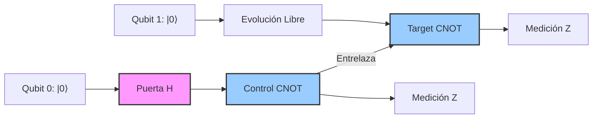

# Qubits y Circuitos

El qubit es la unidad básica de información cuántica. A diferencia de un bit clásico, puede existir en superposición de los estados base, lo que cambia radicalmente la forma en que se representa y procesa la información.

## 🧮 Desarrollo Teórico Profundo

El estudio de la información cuántica comienza irremediablemente con la unidad más básica de información: el bit cuántico o **qubit**. A diferencia del bit clásico, que se encuentra restringido a uno de dos estados posibles ($0$ o $1$), un qubit puede existir en un estado que es una **superposición lineal** de ambos.

### 1. El Qubit y el Espacio de Hilbert $\mathbb{C}^2$

Matemáticamente, el estado de un qubit puro se representa mediante un vector de estado $|\psi\rangle$ que pertenece a un espacio de Hilbert complejo de dos dimensiones, denotado por $\mathcal{H} \cong \mathbb{C}^2$. Elegimos una base ortonormal para este espacio, típicamente la base computacional (o base $Z$), formada por los vectores $|0\rangle$ y $|1\rangle$, los cuales se representan como vectores columna:

$$
|0\rangle = \begin{pmatrix} 1 \\ 0 \end{pmatrix}, \quad |1\rangle = \begin{pmatrix} 0 \\ 1 \end{pmatrix}
$$

El estado general de un qubit puro es una combinación lineal de los estados base:

$$
|\psi\rangle = \alpha|0\rangle + \beta|1\rangle = \begin{pmatrix} \alpha \\ \beta \end{pmatrix}
$$

donde las amplitudes $\alpha, \beta \in \mathbb{C}$. Para que el estado represente una probabilidad física válida, debe cumplir con la **condición de normalización** impuesta por la regla de Born, según la cual la suma de las probabilidades de todos los resultados posibles debe ser $1$:

$$
|\alpha|^2 + |\beta|^2 = 1
$$

Esta condición implica que el vector de estado está restringido a la superficie de una esfera unidad en $\mathbb{C}^2$.

### 2. La Esfera de Bloch y la Fase Global

Dado que $\alpha$ y $\beta$ son números complejos, cada uno puede escribirse en forma polar: $\alpha = r_0 e^{i\phi_0}$ y $\beta = r_1 e^{i\phi_1}$. El estado se puede reescribir como:

$$
|\psi\rangle = r_0 e^{i\phi_0}|0\rangle + r_1 e^{i\phi_1}|1\rangle = e^{i\phi_0} \left( r_0 |0\rangle + r_1 e^{i(\phi_1 - \phi_0)}|1\rangle \right)
$$

En mecánica cuántica, una fase global (el término $e^{i\phi_0}$) no afecta ninguna probabilidad de medición ni ningún observable físico, por lo que podemos factorizarla e ignorarla matemáticamente. Esto nos permite redefinir el estado utilizando solo dos parámetros reales:

$$
|\psi\rangle = \cos\left(\frac{\theta}{2}\right) |0\rangle + e^{i\phi} \sin\left(\frac{\theta}{2}\right) |1\rangle
$$

donde:
- $0 \leq \theta \leq \pi$ define el ángulo de colatitud.
- $0 \leq \phi < 2\pi$ define el ángulo acimutal.

Esta parametrización define una biyección entre el conjunto de estados puros de un qubit y los puntos de una esfera bidimensional real $S^2$, conocida como la **Esfera de Bloch**. Las coordenadas cartesianas de un punto en la Esfera de Bloch están dadas por los valores esperados de los operadores de Pauli:
- $x = \langle \psi | X | \psi \rangle = \sin\theta \cos\phi$
- $y = \langle \psi | Y | \psi \rangle = \sin\theta \sin\phi$
- $z = \langle \psi | Z | \psi \rangle = \cos\theta$

### 3. Operadores Unitarios y Puertas Cuánticas de un Qubit

La evolución temporal de un estado cuántico cerrado está descrita por una transformación unitaria $U$. Para que la condición de normalización se preserve, debe cumplirse que $U^{\dagger}U = I$, donde $U^{\dagger}$ es la matriz traspuesta conjugada. Las **puertas cuánticas** son simplemente la materialización de estas matrices unitarias en un circuito.

Las operaciones más fundamentales de 1 qubit son las representadas por las **Matrices de Pauli**:

$$
X = \begin{pmatrix} 0 & 1 \\ 1 & 0 \end{pmatrix}, \quad
Y = \begin{pmatrix} 0 & -i \\ i & 0 \end{pmatrix}, \quad
Z = \begin{pmatrix} 1 & 0 \\ 0 & -1 \end{pmatrix}
$$

**Demostración de la acción de $X$ (NOT cuántico):**
Si aplicamos $X$ a un estado arbitrario $|\psi\rangle = \alpha|0\rangle + \beta|1\rangle$:

$$
X|\psi\rangle = \begin{pmatrix} 0 & 1 \\ 1 & 0 \end{pmatrix} \begin{pmatrix} \alpha \\ \beta \end{pmatrix} = \begin{pmatrix} \beta \\ \alpha \end{pmatrix} = \beta|0\rangle + \alpha|1\rangle
$$

Por lo tanto, la puerta $X$ invierte las amplitudes, actuando como un inversor lógico ($|0\rangle \leftrightarrow |1\rangle$).

Otra puerta de vital importancia es la **Puerta de Hadamard ($H$)**, encargada de crear superposiciones equilibradas a partir de la base computacional:

$$
H = \frac{1}{\sqrt{2}} \begin{pmatrix} 1 & 1 \\ 1 & -1 \end{pmatrix}
$$

Al aplicarla al estado $|0\rangle$, obtenemos el estado $|+\rangle$:

$$
H|0\rangle = \frac{1}{\sqrt{2}}(|0\rangle + |1\rangle) \equiv |+\rangle
$$

Este estado se ubica en el ecuador de la Esfera de Bloch a lo largo del eje $+x$.

### 4. Sistemas Multiqubit y el Entrelazamiento Cuántico

Para sistemas de $n$ qubits, el espacio de Hilbert es el **producto tensorial** de los espacios individuales: $\mathcal{H}^{\otimes n} = \mathbb{C}^{2^n}$.
Para 2 qubits, la base computacional es $\{|00\rangle, |01\rangle, |10\rangle, |11\rangle\}$, y el estado general es:

$$
|\Psi\rangle = c_{00}|00\rangle + c_{01}|01\rangle + c_{10}|10\rangle + c_{11}|11\rangle
$$

con $\sum |c_{ij}|^2 = 1$.

#### La Puerta CNOT (NOT Controlado)
La principal puerta de dos qubits es la CNOT. Esta puerta invierte (aplica $X$) el estado del "target" (qubit objetivo) si y solo si el "control" (qubit controlador) está en el estado $|1\rangle$. Su matriz $4 \times 4$ es:

$$
\text{CNOT} = \begin{pmatrix}
1 & 0 & 0 & 0 \\
0 & 1 & 0 & 0 \\
0 & 0 & 0 & 1 \\
0 & 0 & 1 & 0
\end{pmatrix}
$$

#### Creación de un Estado Entrelazado (Estado de Bell)
El circuito cuántico más fundamental para demostrar entrelazamiento consiste en un Hadamard seguido de una CNOT. Procedamos a derivar analíticamente este estado, paso por paso:

1. **Estado Inicial:** Preparamos dos qubits en el estado $|0\rangle$:
   $$ |\psi_0\rangle = |0\rangle_C \otimes |0\rangle_T = |00\rangle $$

2. **Aplicación de Hadamard al qubit de control:**
   $$ |\psi_1\rangle = (H \otimes I) |00\rangle = \left(\frac{|0\rangle + |1\rangle}{\sqrt{2}}\right) \otimes |0\rangle = \frac{1}{\sqrt{2}} (|00\rangle + |10\rangle) $$

3. **Aplicación de CNOT:**
   La CNOT actúa sobre el estado, dejando intacta la componente donde el control es $|0\rangle$ e invirtiendo el target en la componente donde el control es $|1\rangle$:
   $$ |\psi_2\rangle = \text{CNOT} \left( \frac{1}{\sqrt{2}} |00\rangle + \frac{1}{\sqrt{2}} |10\rangle \right) = \frac{1}{\sqrt{2}} |00\rangle + \frac{1}{\sqrt{2}} |11\rangle \equiv |\Phi^+\rangle $$

Este estado resultante, $|\Phi^+\rangle$, es uno de los cuatro estados de Bell. Se dice que está **máximamente entrelazado** porque no puede ser factorizado como el producto tensorial de dos estados individuales ($|\psi_A\rangle \otimes |\psi_B\rangle$). La medición de cualquiera de los dos qubits colapsará instantáneamente el estado del otro, revelando una correlación perfecta de las estadísticas que supera cualquier límite clásico establecido por las desigualdades de Bell.

### 5. Representación en Diagramas de Circuito

Los algoritmos cuánticos y las secuencias de transformaciones unitarias se visualizan comúnmente usando el modelo de circuito cuántico. Las líneas representan la evolución en el tiempo de los qubits, mientras que los bloques o símbolos sobre las líneas representan operaciones.

A continuación, se presenta un diagrama de circuito que ilustra la generación del estado de Bell $|\Phi^+\rangle$ derivado en la sección anterior, seguido de su medición:

En la formalidad de este marco, cualquier computación cuántica puede reducirse a una secuencia discreta compuesta de puertas de un qubit (como rotaciones arbitrarias) y puertas de entrelazamiento de dos qubits (como la CNOT), lo cual conforma un conjunto de puertas **universal**. El teorema de Solovay-Kitaev nos garantiza además que, incluso con un conjunto finito y discreto de tales puertas fundamentales, podemos aproximar eficientemente cualquier operador unitario continuo con una precisión deseada $\epsilon$.

## 📚 Recursos Específicos

### Cursos
1. [Introduction to Quantum Circuits (Coursera)](https://www.coursera.org/learn/quantum-circuits)
2. [Qubits, Quantum Gates, and Quantum Circuits (edX)](https://www.edx.org/course/qubits-and-quantum-circuits)
3. [Quantum Information Science I, Part 1 (MITx on edX)](https://www.edx.org/course/quantum-information-science-i-part-1)
4. [Quantum Computing Foundations (IBM/Coursera)](https://www.coursera.org/specializations/quantum-computing-ibm)
5. [Fundamentals of Quantum Algorithms (University of Colorado Boulder)](https://www.coursera.org/learn/fundamentals-quantum-algorithms)

### Artículos y Simulaciones
1. [Quantum Circuits (Qiskit Textbook)](https://qiskit.org/textbook/ch-gates/introduction.html)
2. [IBM Quantum Composer](https://quantum-computing.ibm.com/composer/)
3. [Quirk: Drag-and-drop quantum circuit simulator](https://algassert.com/quirk)
4. [Elementary gates for quantum computation (Barenco et al., 1995)](https://arxiv.org/abs/quant-ph/9503016)
5. [The Solovay-Kitaev algorithm (Dawson & Nielsen, 2005)](https://arxiv.org/abs/quant-ph/0505030)
6. [Circuit QED (Blais et al., 2004)](https://arxiv.org/abs/cond-mat/0402216)
7. [Quantum circuits with mixed states (Aharonov et al., 1998)](https://arxiv.org/abs/quant-ph/9812039)
8. [Quantum Computational Complexity (Watrous, 2008)](https://arxiv.org/abs/0804.3401)

### 📖 Referencias Útiles y Bibliografía
1. [Quantum Computation and Quantum Information (Nielsen & Chuang)](https://doi.org/10.1017/CBO9780511976667)
2. [Quantum Computer Science: An Introduction (N. David Mermin)](https://doi.org/10.1017/CBO9780511813870)
3. [Classical and Quantum Computation (Kitaev, Shen, Vyalyi)](https://bookstore.ams.org/gsm-47)
