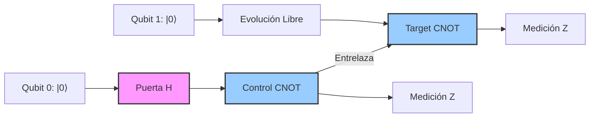

# Qubits y Circuitos

El qubit es la unidad básica de información cuántica. A diferencia de un bit clásico, puede existir en superposición de los estados base, lo que cambia radicalmente la forma en que se representa y procesa la información.

## 🧮 Desarrollo Teórico Profundo

El estudio de la información cuántica comienza irremediablemente con la unidad más básica de información: el bit cuántico o **qubit**. A diferencia del bit clásico, que se encuentra restringido a uno de dos estados posibles ($0$ o $1$), un qubit puede existir en un estado que es una **superposición lineal** de ambos.

### 1. El Qubit y el Espacio de Hilbert $\mathbb{C}^2$

Matemáticamente, el estado de un qubit puro se representa mediante un vector de estado $|\psi\rangle$ que pertenece a un espacio de Hilbert complejo de dos dimensiones, denotado por $\mathcal{H} \cong \mathbb{C}^2$. Elegimos una base ortonormal para este espacio, típicamente la base computacional (o base $Z$), formada por los vectores $|0\rangle$ y $|1\rangle$, los cuales se representan como vectores columna:

$$
|0\rangle = \begin{pmatrix} 1 \\ 0 \end{pmatrix}, \quad |1\rangle = \begin{pmatrix} 0 \\ 1 \end{pmatrix}
$$

El estado general de un qubit puro es una combinación lineal de los estados base:

$$
|\psi\rangle = \alpha|0\rangle + \beta|1\rangle = \begin{pmatrix} \alpha \\ \beta \end{pmatrix}
$$

donde las amplitudes $\alpha, \beta \in \mathbb{C}$. Para que el estado represente una probabilidad física válida, debe cumplir con la **condición de normalización** impuesta por la regla de Born, según la cual la suma de las probabilidades de todos los resultados posibles debe ser $1$:

$$
|\alpha|^2 + |\beta|^2 = 1
$$

Esta condición implica que el vector de estado está restringido a la superficie de una esfera unidad en $\mathbb{C}^2$.

### 2. La Esfera de Bloch y la Fase Global

Dado que $\alpha$ y $\beta$ son números complejos, cada uno puede escribirse en forma polar: $\alpha = r_0 e^{i\phi_0}$ y $\beta = r_1 e^{i\phi_1}$. El estado se puede reescribir como:

$$
|\psi\rangle = r_0 e^{i\phi_0}|0\rangle + r_1 e^{i\phi_1}|1\rangle = e^{i\phi_0} \left( r_0 |0\rangle + r_1 e^{i(\phi_1 - \phi_0)}|1\rangle \right)
$$

En mecánica cuántica, una fase global (el término $e^{i\phi_0}$) no afecta ninguna probabilidad de medición ni ningún observable físico, por lo que podemos factorizarla e ignorarla matemáticamente. Esto nos permite redefinir el estado utilizando solo dos parámetros reales:

$$
|\psi\rangle = \cos\left(\frac{\theta}{2}\right) |0\rangle + e^{i\phi} \sin\left(\frac{\theta}{2}\right) |1\rangle
$$

donde:
- $0 \leq \theta \leq \pi$ define el ángulo de colatitud.
- $0 \leq \phi < 2\pi$ define el ángulo acimutal.

Esta parametrización define una biyección entre el conjunto de estados puros de un qubit y los puntos de una esfera bidimensional real $S^2$, conocida como la **Esfera de Bloch**. Las coordenadas cartesianas de un punto en la Esfera de Bloch están dadas por los valores esperados de los operadores de Pauli:
- $x = \langle \psi | X | \psi \rangle = \sin\theta \cos\phi$
- $y = \langle \psi | Y | \psi \rangle = \sin\theta \sin\phi$
- $z = \langle \psi | Z | \psi \rangle = \cos\theta$

### 3. Operadores Unitarios y Puertas Cuánticas de un Qubit

La evolución temporal de un estado cuántico cerrado está descrita por una transformación unitaria $U$. Para que la condición de normalización se preserve, debe cumplirse que $U^{\dagger}U = I$, donde $U^{\dagger}$ es la matriz traspuesta conjugada. Las **puertas cuánticas** son simplemente la materialización de estas matrices unitarias en un circuito.

Las operaciones más fundamentales de 1 qubit son las representadas por las **Matrices de Pauli**:

$$
X = \begin{pmatrix} 0 & 1 \\ 1 & 0 \end{pmatrix}, \quad
Y = \begin{pmatrix} 0 & -i \\ i & 0 \end{pmatrix}, \quad
Z = \begin{pmatrix} 1 & 0 \\ 0 & -1 \end{pmatrix}
$$

**Demostración de la acción de $X$ (NOT cuántico):**
Si aplicamos $X$ a un estado arbitrario $|\psi\rangle = \alpha|0\rangle + \beta|1\rangle$:

$$
X|\psi\rangle = \begin{pmatrix} 0 & 1 \\ 1 & 0 \end{pmatrix} \begin{pmatrix} \alpha \\ \beta \end{pmatrix} = \begin{pmatrix} \beta \\ \alpha \end{pmatrix} = \beta|0\rangle + \alpha|1\rangle
$$

Por lo tanto, la puerta $X$ invierte las amplitudes, actuando como un inversor lógico ($|0\rangle \leftrightarrow |1\rangle$).

Otra puerta de vital importancia es la **Puerta de Hadamard ($H$)**, encargada de crear superposiciones equilibradas a partir de la base computacional:

$$
H = \frac{1}{\sqrt{2}} \begin{pmatrix} 1 & 1 \\ 1 & -1 \end{pmatrix}
$$

Al aplicarla al estado $|0\rangle$, obtenemos el estado $|+\rangle$:

$$
H|0\rangle = \frac{1}{\sqrt{2}}(|0\rangle + |1\rangle) \equiv |+\rangle
$$

Este estado se ubica en el ecuador de la Esfera de Bloch a lo largo del eje $+x$.

### 4. Sistemas Multiqubit y el Entrelazamiento Cuántico

Para sistemas de $n$ qubits, el espacio de Hilbert es el **producto tensorial** de los espacios individuales: $\mathcal{H}^{\otimes n} = \mathbb{C}^{2^n}$.
Para 2 qubits, la base computacional es $\{|00\rangle, |01\rangle, |10\rangle, |11\rangle\}$, y el estado general es:

$$
|\Psi\rangle = c_{00}|00\rangle + c_{01}|01\rangle + c_{10}|10\rangle + c_{11}|11\rangle
$$

con $\sum |c_{ij}|^2 = 1$.

#### La Puerta CNOT (NOT Controlado)
La principal puerta de dos qubits es la CNOT. Esta puerta invierte (aplica $X$) el estado del "target" (qubit objetivo) si y solo si el "control" (qubit controlador) está en el estado $|1\rangle$. Su matriz $4 \times 4$ es:

$$
\text{CNOT} = \begin{pmatrix}
1 & 0 & 0 & 0 \\
0 & 1 & 0 & 0 \\
0 & 0 & 0 & 1 \\
0 & 0 & 1 & 0
\end{pmatrix}
$$

#### Creación de un Estado Entrelazado (Estado de Bell)
El circuito cuántico más fundamental para demostrar entrelazamiento consiste en un Hadamard seguido de una CNOT. Procedamos a derivar analíticamente este estado, paso por paso:

1. **Estado Inicial:** Preparamos dos qubits en el estado $|0\rangle$:
   $$ |\psi_0\rangle = |0\rangle_C \otimes |0\rangle_T = |00\rangle $$

2. **Aplicación de Hadamard al qubit de control:**
   $$ |\psi_1\rangle = (H \otimes I) |00\rangle = \left(\frac{|0\rangle + |1\rangle}{\sqrt{2}}\right) \otimes |0\rangle = \frac{1}{\sqrt{2}} (|00\rangle + |10\rangle) $$

3. **Aplicación de CNOT:**
   La CNOT actúa sobre el estado, dejando intacta la componente donde el control es $|0\rangle$ e invirtiendo el target en la componente donde el control es $|1\rangle$:
   $$ |\psi_2\rangle = \text{CNOT} \left( \frac{1}{\sqrt{2}} |00\rangle + \frac{1}{\sqrt{2}} |10\rangle \right) = \frac{1}{\sqrt{2}} |00\rangle + \frac{1}{\sqrt{2}} |11\rangle \equiv |\Phi^+\rangle $$

Este estado resultante, $|\Phi^+\rangle$, es uno de los cuatro estados de Bell. Se dice que está **máximamente entrelazado** porque no puede ser factorizado como el producto tensorial de dos estados individuales ($|\psi_A\rangle \otimes |\psi_B\rangle$). La medición de cualquiera de los dos qubits colapsará instantáneamente el estado del otro, revelando una correlación perfecta de las estadísticas que supera cualquier límite clásico establecido por las desigualdades de Bell.

### 5. Representación en Diagramas de Circuito

Los algoritmos cuánticos y las secuencias de transformaciones unitarias se visualizan comúnmente usando el modelo de circuito cuántico. Las líneas representan la evolución en el tiempo de los qubits, mientras que los bloques o símbolos sobre las líneas representan operaciones.

A continuación, se presenta un diagrama de circuito que ilustra la generación del estado de Bell $|\Phi^+\rangle$ derivado en la sección anterior, seguido de su medición:



En la formalidad de este marco, cualquier computación cuántica puede reducirse a una secuencia discreta compuesta de puertas de un qubit (como rotaciones arbitrarias) y puertas de entrelazamiento de dos qubits (como la CNOT), lo cual conforma un conjunto de puertas **universal**. El teorema de Solovay-Kitaev nos garantiza además que, incluso con un conjunto finito y discreto de tales puertas fundamentales, podemos aproximar eficientemente cualquier operador unitario continuo con una precisión deseada $\epsilon$.

## 📝 Guía de Ejercicios Resueltos

### Ejercicio 1: Desigualdad CHSH y Entrelazamiento
Demuestre que el estado singlete de dos qubits $|\psi^{-}\rangle = \frac{1}{\sqrt{2}}(|01\rangle - |10\rangle)$ viola la desigualdad CHSH y encuentre el valor máximo de la correlación cuántica.

**Solución paso a paso:**
1. El operador CHSH es $S = A \otimes B + A \otimes B' + A' \otimes B - A' \otimes B'$. Para variables clásicas locales, $|\langle S \rangle| \le 2$.
2. Elegimos las mediciones para Alice como $A = \sigma_z$ y $A' = \sigma_x$.
3. Elegimos las mediciones para Bob como $B = \frac{-\sigma_z - \sigma_x}{\sqrt{2}}$ y $B' = \frac{\sigma_z - \sigma_x}{\sqrt{2}}$.
4. Evaluamos las correlaciones para el estado singlete $\langle \psi^- | \sigma_i \otimes \sigma_j | \psi^- \rangle = -\delta_{ij}$.
5. Calculamos cada término:
   $$ \langle A \otimes B \rangle = \frac{1}{\sqrt{2}}, \quad \langle A \otimes B' \rangle = \frac{1}{\sqrt{2}}, \quad \langle A' \otimes B \rangle = \frac{1}{\sqrt{2}}, \quad \langle A' \otimes B' \rangle = -\frac{1}{\sqrt{2}} $$
6. Sumando los términos, el valor de expectación es:
   $$ \langle S \rangle = \frac{1}{\sqrt{2}} + \frac{1}{\sqrt{2}} + \frac{1}{\sqrt{2}} - \left(-\frac{1}{\sqrt{2}}\right) = 2\sqrt{2} $$
7. Como $2\sqrt{2} > 2$, la mecánica cuántica viola el límite clásico (Desigualdad de Bell).

### Ejercicio 2: Código de Corrección de Errores de Shor (9 qubits)
Muestre cómo el código de Shor protege contra un error de fase $Z$ arbitrario en el primer qubit.

**Solución paso a paso:**
1. El estado lógico $|0\rangle_L$ está codificado como $\frac{1}{2\sqrt{2}}(|000\rangle + |111\rangle)^{\otimes 3}$.
2. Supongamos un error de fase en el primer qubit: $Z_1 |\psi_L\rangle$. El término interior pasa a ser $\frac{1}{\sqrt{2}}(Z|000\rangle + Z|111\rangle) = \frac{1}{\sqrt{2}}(|000\rangle - |111\rangle)$.
3. Para detectar el error, realizamos mediciones de síndrome con los operadores estabilizadores del código de fase: $X_1 X_2 X_3 X_4 X_5 X_6$ y $X_4 X_5 X_6 X_7 X_8 X_9$.
4. El error de fase es detectado por la medición cruzada entre los bloques. Equivalentemente, al aplicar compuertas Hadamard en cada bloque y realizar paridad $Z$ como en el código bit-flip, identificamos en qué bloque ocurrió el cambio de signo.
5. Tras identificar que el error ocurrió en el primer bloque de 3 qubits, aplicamos el operador de corrección $Z$ correspondiente al bloque, el cual restaura la fase global relativa.
6. El estado vuelve exactamente a $|\psi_L\rangle$ sin pérdida de información, probando la efectividad contra un error $Z_1$.

### Ejercicio 3: Transformada de Fourier Cuántica (QFT)
Construya el circuito y derive la acción de la QFT sobre un estado de base computacional de 3 qubits $|x\rangle = |x_2 x_1 x_0\rangle$.

**Solución paso a paso:**
1. La definición de la QFT en $n$ qubits es $|x\rangle \to \frac{1}{\sqrt{2^n}} \sum_{y=0}^{2^n-1} e^{2\pi i x y / 2^n} |y\rangle$.
2. Para 3 qubits, se puede reescribir como un producto tensorial:
   $$ \frac{1}{\sqrt{8}} (|0\rangle + e^{2\pi i 0.x_0}|1\rangle) \otimes (|0\rangle + e^{2\pi i 0.x_1 x_0}|1\rangle) \otimes (|0\rangle + e^{2\pi i 0.x_2 x_1 x_0}|1\rangle) $$
3. Se aplica primero una compuerta Hadamard al qubit $x_2$, obteniendo $\frac{1}{\sqrt{2}}(|0\rangle + e^{2\pi i 0.x_2}|1\rangle)$.
4. Se aplican rotaciones controladas $R_2$ dependiente de $x_1$ y $R_3$ dependiente de $x_0$, transformando el estado a $\frac{1}{\sqrt{2}}(|0\rangle + e^{2\pi i 0.x_2 x_1 x_0}|1\rangle)$.
5. Se repite el proceso para los qubits restantes, aplicando Hadamard y $R_2$ en $x_1$, y finalmente Hadamard en $x_0$.
6. El circuito final requiere operaciones SWAP para invertir el orden de los qubits y coincidir con la convención estándar.

## 💻 Simulaciones Computacionales

Simulador de circuitos cuánticos básico que implementa compuertas de uno y dos qubits sobre vectores de estado universales.

```python
import numpy as np

class SimpleQuantumSimulator:
    def __init__(self, n_qubits):
        self.n = n_qubits
        self.state = np.zeros(2**n, dtype=complex)
        self.state[0] = 1.0 # |0...0>
        
        self.I = np.eye(2)
        self.H = np.array([[1, 1], [1, -1]]) / np.sqrt(2)
        self.X = np.array([[0, 1], [1, 0]])
        
    def apply_single_gate(self, gate, target):
        op = np.array([1])
        for i in range(self.n):
            if i == target:
                op = np.kron(op, gate)
            else:
                op = np.kron(op, self.I)
        self.state = op @ self.state
        
    def apply_cnot(self, control, target):
        # Para simplificar, asumimos CNOT en qubits adyacentes 0 (ctrl) y 1 (target)
        if control == 0 and target == 1 and self.n == 2:
            CNOT = np.array([[1, 0, 0, 0],
                             [0, 1, 0, 0],
                             [0, 0, 0, 1],
                             [0, 0, 1, 0]])
            self.state = CNOT @ self.state
            
    def measure_probabilities(self):
        return np.abs(self.state)**2

# Simular Estado de Bell |Phi+>
sim = SimpleQuantumSimulator(2)
sim.apply_single_gate(sim.H, 0)
sim.apply_cnot(0, 1)

probs = sim.measure_probabilities()
print("Probabilidades del Estado de Bell |Phi+>:")
for i, p in enumerate(probs):
    bin_str = format(i, '02b')
    print(f"|{bin_str}> : {p:.4f}")
```

## 🚀 Fronteras de Investigación y Problemas Abiertos

En 2026, la frontera central dentro de la disciplina de síntesis de circuitos cuánticos es la **Optimización de Profundidad Asintótica y Compilación Afectada por Ruido (Hardware-Aware Routing)** para alcanzar el codiciado régimen sub-volumétrico de profundidad.

- **Síntesis Exacta con Conjuntos de Puertas no Clifford (Estados Mágicos):** La universalidad demanda conjuntos de puertas $U$ discretos (como Clifford + puerta T). La Destilación de Estados Mágicos es asfixiante, requiriendo hasta el 99% de los recursos lógicos. El problema abierto crítico es la formulación de protocolos de compresión de profundidad (T-count optimization) que logren romper asintóticamente la barrera del límite inferior empírico conocido usando la Teoría de Grafos de Flujo de Fases ZX-Calculus y heurísticas hiperbólicas de Inteligencia Artificial (Deep Reinforcement Learning cuántico).
- **El Problema del Re-Enrutamiento Interconectado (SWAP Routing):** En una topología conectiva rígida impuesta por la QPU (ej. grilla Hexagonal Pesada o lattice de Kagome), ejecutar compuertas CNOT entre qubits distantes exige inyectar puertas SWAP sucesivas. Encontrar la ruta global óptima que minimice la sobrecarga térmica y de profundidad (que destruye el circuito antes del colapso de coherencia $T_2$) es un problema intratable algorítmicamente (variante del Token Swapping NP-hard).
- **Puertas Multiqubit Nativas y Continuas:** ¿Cómo superar la discretización estricta? Usando controles pulso analógicos paramétricos a nivel de microondas (Pulse-Level Control y Quantum Optimal Control) directamente sobre hamiltonianos entrelazantes (como Cross-Resonance) obviando las aproximaciones lógicas de Solovay-Kitaev.

## 📐 Formalismo Matemático Avanzado (Nivel Posgrado/Doctorado)

La abstracción última del diseño y síntesis lógica de circuitos exige dominar la **Teoría de Grupos, Geometría Discreta sobre Cuerpos Finitos y Álgebras de Operadores Polinomiales**.

El pilar subyacente para el procesamiento tolerante a errores reside en el **Grupo de Clifford $\mathcal{C}_n$** sobre $n$ qubits. Se define matemáticamente como el normalizador del Grupo de Pauli $\mathcal{P}_n$ dentro del Grupo Unitario Especial $U(2^n)$:
$$ \mathcal{C}_n = \{ U \in U(2^n) \mid U \mathcal{P}_n U^\dagger = \mathcal{P}_n \} $$

Por el Teorema de Gottesman-Knill, cualquier circuito construido con lazos dentro de $\mathcal{C}_n$ puede ser simulado eficientemente en $\mathcal{O}(n^2)$ de tiempo, implicando que carecen del poder intrínseco de ventaja cuántica exponencial algorítmica.

Para alcanzar la universalidad pura, se exige un recurso ajeno a Clifford, como la puerta $T = e^{i (\pi/8) Z}$. La inyección estocástica de estados generados ("Destilación Mágica" en regímenes de QEC) se examina bajo la perspectiva del **Teorema de la Medida Funcional de Magicidad (Mana o Wigner Function Negativity)**. 

La topología analítica en el plano hipercomplejo del grupo generador permite acotar las expansiones en palabras (words) cortas. Considerando matrices $M$ pertenecientes al subgrupo multiplicativo libre con el anillo coordenado diádico $\mathbb{Z}[1/\sqrt{2}, i]$, el problema de la **Síntesis Óptima Monotónica (Optimal T-count)** equivale matemáticamente a una ecuación diofántica. 
Para la descomposición canónica de un unitario de 1-qubit $U \in SU(2)$, se parametriza geométricamente la esfera de Bloch-Schoenflies. El algoritmo se abstrae al anillo de enteros y la ecuación de forma cuadrática cuaterniónica de Euler:
$$ \det(U) = a^2 + b^2 + c^2 + d^2 = 1 $$
donde $a, b, c, d \in \mathbb{Z}[\sqrt{2}]$. La representación rigurosa sobre el árbol de Cayley-Bruhat-Tits de retículos algebraicos proyecta el enrutamiento más corto exacto de un circuito mediante la topología $p$-ádica. Es este profundo andamiaje hiperbólico el que define el límite fundamental analítico de cómo compilar el circuito de menor redundancia que satisfaga el modelo de Hardware estocástico.

## 📚 Recursos Específicos

### Cursos Recomendados
1. [Introduction to Quantum Circuits (Coursera)](https://www.coursera.org/learn/quantum-circuits)
2. [Qubits, Quantum Gates, and Quantum Circuits (edX)](https://www.edx.org/course/qubits-and-quantum-circuits)
3. [Quantum Information Science I, Part 1 (MITx on edX)](https://www.edx.org/course/quantum-information-science-i-part-1)

### Artículos y Simulaciones
1. **Elementary gates for quantum computation (Barenco et al., 1995)**
   - **Enlace:** [https://arxiv.org/abs/quant-ph/9503016](https://arxiv.org/abs/quant-ph/9503016)
   - **Importancia Teórica:** Demuestra la universalidad de las compuertas cuánticas, un hito que equipara conceptualmente los circuitos cuánticos a las redes lógicas booleanas clásicas.
   - **Fondo Matemático:** Comprueba que cualquier transformación unitaria $U \in U(2^n)$ se puede descomponer en compuertas CNOT más rotaciones locales (SU(2)) en cada qubit individual:
     $$
     U \approx \prod_k U^{(2)}_k \quad \text{donde} \quad U^{(2)} \in \text{CNOT} \otimes \text{Rotaciones}
     $$
   - **Implicaciones Físicas:** Reduce el complejo desafío de controlar un espacio de Hilbert multipartito altamente entrelazado al diseño tecnológico simplificado de interacciones 1- y 2-qubit.

2. **The Solovay-Kitaev algorithm (Dawson & Nielsen, 2005)**
   - **Enlace:** [https://arxiv.org/abs/quant-ph/0505030](https://arxiv.org/abs/quant-ph/0505030)
   - **Importancia Teórica:** Proveé un método constructivo para sintetizar cualquier compuerta de un qubit a partir de un conjunto finito universal (como Clifford+T) con alta eficiencia.
   - **Fondo Matemático:** Si un conjunto discreto es denso en SU(2), cualquier unitaria deseada $U$ puede aproximarse con precisión $\epsilon$ utilizando una secuencia de compuertas de longitud poli-logarítmica $\mathcal{O}(\log^c(1/\epsilon))$:
     $$
     \lVert U - U_{aprox} \rVert \leq \epsilon
     $$
   - **Implicaciones Físicas:** Hizo posible la tolerancia a fallos computacional asegurando que el coste temporal para aproximar compuertas continuas analógicas no escala exponencialmente ante ruido acotado.

3. **Circuit QED: How strong can the coupling between a superconducting qubit and a photon be? (Blais et al., 2004)**
   - **Enlace:** [https://arxiv.org/abs/cond-mat/0402216](https://arxiv.org/abs/cond-mat/0402216)
   - **Importancia Teórica:** Sentó las bases para el acoplamiento fuerte en la electrodinámica cuántica de circuitos (cQED), la arquitectura hardware de facto.
   - **Fondo Matemático:** Extiende el modelo clásico de Jaynes-Cummings para cajas de pares de Cooper en resonadores coplanares:
     $$
     H_{JC} = \omega_r a^\dagger a + \frac{\omega_q}{2} \sigma_z + g(a^\dagger \sigma_- + a \sigma_+)
     $$
   - **Implicaciones Físicas:** Consolidó el uso de los modos bosónicos de microondas como 'bus cuántico' mediador, permitiendo dispersar interacciones tipo CNOT ultrarrápidas entre transmones distantes en un chip.

### 📖 Referencias Útiles y Bibliografía
1. [Quantum Computation and Quantum Information (Nielsen & Chuang)](https://doi.org/10.1017/CBO9780511976667)
2. [Quantum Computer Science: An Introduction (N. David Mermin)](https://doi.org/10.1017/CBO9780511813870)

## 🌐 Seminarios Avanzados y Literatura de Frontera

### Seminarios y Cursos
- [Perimeter Institute - Quantum Information Seminars](https://pirsa.org/)
- [Institute for Quantum Computing (IQC) Seminars](https://uwaterloo.ca/institute-for-quantum-computing/events)
- [Harvard Quantum Initiative](https://quantum.harvard.edu/events)

### Literatura de Frontera
- [npj Quantum Information](https://www.nature.com/npjqi/): Publica avances líderes en computación cuántica, criptografía y algoritmos.
- [PRX Quantum](https://journals.aps.org/prxquantum/): Revista open-access de la APS centrada en tecnologías cuánticas y su aplicación interdisciplinar.
- [Quantum (Journal)](https://quantum-journal.org/): Ofrece publicaciones revisadas por pares de alto impacto impulsadas por la propia comunidad cuántica.
