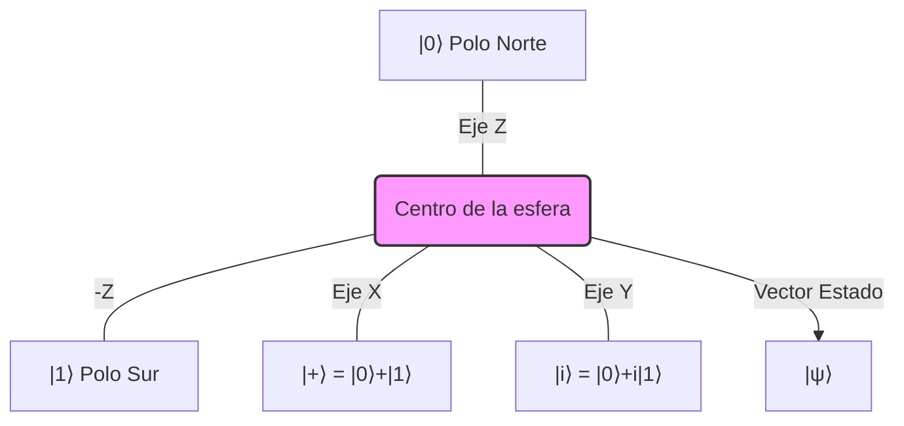

# Qubits y Entrelazamiento
El estudio de los qubits (bits cuánticos) y el entrelazamiento cuántico forma la base de toda la teoría de la información cuántica. Mientras un bit clásico solo puede ser 0 o 1, un qubit puede existir en una superposición de ambos estados.

## 📜 Contexto Histórico
El concepto de qubit se formalizó en las décadas de 1980 y 1990 con pioneros como Paul Benioff, Richard Feynman y David Deutsch, quienes propusieron que los sistemas cuánticos podrían usarse para el procesamiento de información. El entrelazamiento, sin embargo, se remonta a 1935, cuando Albert Einstein, Boris Podolsky y Nathan Rosen (paradoja EPR) cuestionaron su existencia, llamándolo "acción fantasmal a distancia". Erwin Schrödinger acuñó el término "entrelazamiento" poco después.

## 🧮 Desarrollo Teórico Profundo

#### 1. Formalismo Matemático del Qubit

Un **qubit** representa el sistema mecánico-cuántico más simple, definido formalmente como un vector de estado unitario en un espacio de Hilbert complejo de dos dimensiones, $ \mathcal{H} \cong \mathbb{C}^2 $. La base computacional estándar se denota por los vectores ortonormales $ |0\rangle $ y $ |1\rangle $, que corresponden a las representaciones vectoriales:
$$ |0\rangle = \begin{pmatrix} 1 \\ 0 \end{pmatrix}, \quad |1\rangle = \begin{pmatrix} 0 \\ 1 \end{pmatrix} $$

El estado general de un qubit puro se describe mediante una superposición lineal de los estados base:
$$ |\psi\rangle = \alpha|0\rangle + \beta|1\rangle = \begin{pmatrix} \alpha \\ \beta \end{pmatrix} $$
donde $ \alpha, \beta \in \mathbb{C} $ son las **amplitudes de probabilidad**. Para satisfacer el postulado de Born sobre la conservación de la probabilidad, se requiere la condición de normalización:
$$ |\alpha|^2 + |\beta|^2 = \langle\psi|\psi\rangle = 1 $$

##### La Esfera de Bloch
Dado que la fase global de un estado cuántico $ e^{i\gamma} $ no produce efectos observables, podemos parametrizar las amplitudes en coordenadas esféricas, aislando una fase relativa $ \phi $:
$$ |\psi\rangle = \cos\left(\frac{\theta}{2}\right) |0\rangle + e^{i\phi} \sin\left(\frac{\theta}{2}\right) |1\rangle $$
donde $ 0 \leq \theta \leq \pi $ representa el ángulo polar (colatitud) y $ 0 \leq \phi < 2\pi $ representa el ángulo azimutal. Esta parametrización establece una correspondencia biunívoca entre los estados puros de un qubit y los puntos sobre la superficie de una esfera unitaria en $ \mathbb{R}^3 $, conocida como la **Esfera de Bloch**.

#### 2. Operadores y Observables (Matrices de Pauli)

En la mecánica cuántica, los observables físicos corresponden a operadores lineales hermíticos. Para un sistema de un qubit, cualquier operador hermítico de dimensión $ 2 \times 2 $ puede expresarse como una combinación lineal real de la matriz identidad $ I $ y las tres **matrices de Pauli**:
$$ \sigma_x = X = \begin{pmatrix} 0 & 1 \\ 1 & 0 \end{pmatrix}, \quad \sigma_y = Y = \begin{pmatrix} 0 & -i \\ i & 0 \end{pmatrix}, \quad \sigma_z = Z = \begin{pmatrix} 1 & 0 \\ 0 & -1 \end{pmatrix} $$
Estas matrices poseen propiedades algebraicas fundamentales: son simultáneamente unitarias ($ \sigma_i^\dagger = \sigma_i^{-1} $), hermíticas ($ \sigma_i^\dagger = \sigma_i $) y de traza nula ($ \text{Tr}(\sigma_i) = 0 $). Además, satisfacen la relación de conmutación no trivial:
$$ [\sigma_i, \sigma_j] = 2i\sum_{k} \epsilon_{ijk}\sigma_k $$
donde $ \epsilon_{ijk} $ es el símbolo de Levi-Civita. El álgebra generada es isomórfica a la del momento angular spin-1/2 ($ \text{SU}(2) $).

#### 3. Sistemas Compuestos y Producto Tensorial

Para describir matemáticamente un sistema compuesto por dos o más subsistemas cuánticos (por ejemplo, los qubits A y B), postulamos que el espacio de Hilbert del sistema total es el **producto tensorial** de los espacios de Hilbert individuales:
$$ \mathcal{H}_{AB} = \mathcal{H}_A \otimes \mathcal{H}_B \cong \mathbb{C}^2 \otimes \mathbb{C}^2 \cong \mathbb{C}^4 $$

La base computacional para el espacio de dos qubits está construida a partir de los productos tensoriales de los vectores de base individuales:
$$ |00\rangle, \quad |01\rangle, \quad |10\rangle, \quad |11\rangle $$
(donde se asume la notación simplificada $ |ij\rangle \equiv |i\rangle_A \otimes |j\rangle_B $). El estado puro más general para este sistema bipartito se expresa como:
$$ |\Psi\rangle_{AB} = c_{00}|00\rangle + c_{01}|01\rangle + c_{10}|10\rangle + c_{11}|11\rangle $$
sujeto a la restricción euclidiana $ \sum_{i,j} |c_{ij}|^2 = 1 $.

#### 4. Entrelazamiento Cuántico y Descomposición de Schmidt

Un estado puro compuesto $ |\Psi\rangle_{AB} $ se denomina **separable** si puede factorizarse como un producto tensorial simple de estados definidos localmente en los subsistemas individuales:
$$ |\Psi\rangle_{AB} = |\psi\rangle_A \otimes |\phi\rangle_B $$
Si no existe ninguna elección de $ |\psi\rangle_A $ y $ |\phi\rangle_B $ que satisfaga esta ecuación, el estado global se considera **entrelazado**. 

Una herramienta matemática exhaustiva para diagnosticar y cuantificar el entrelazamiento es la **Descomposición de Schmidt**. El Teorema de Schmidt afirma que cualquier vector puro bipartito $ |\Psi\rangle_{AB} \in \mathcal{H}_A \otimes \mathcal{H}_B $ puede expresarse en una forma diagonal especial:
$$ |\Psi\rangle_{AB} = \sum_{i=1}^{\min(d_A, d_B)} \lambda_i |u_i\rangle_A \otimes |v_i\rangle_B $$
donde $ \{|u_i\rangle_A\} $ y $ \{|v_i\rangle_B\} $ conforman bases ortonormales adaptadas locales para los subsistemas A y B, y los coeficientes reales positivos $ \lambda_i > 0 $ (los *coeficientes de Schmidt*) cumplen la normalización $ \sum_i \lambda_i^2 = 1 $. 

**Criterio de Rango de Schmidt:** El número de coeficientes de Schmidt estrictamente mayores que cero define el *rango de Schmidt* del estado. Un corolario inmediato del teorema indica que:
- Si el rango de Schmidt es exactamente 1, el estado es separable.
- Si el rango de Schmidt es estrictamente mayor que 1 (e.g., rango 2 para qubits), el estado exhibe entrelazamiento cuántico irreductible.

#### 5. Estados de Bell

Dentro del espacio de Hilbert de dos qubits, existe una clase distinguida de cuatro estados ortonormales, conocidos colectivamente como la **Base de Bell** (o pares EPR). Estos estados se caracterizan por estar *máximamente entrelazados*:
$$ |\Phi^+\rangle = \frac{1}{\sqrt{2}} (|00\rangle + |11\rangle), \quad |\Phi^-\rangle = \frac{1}{\sqrt{2}} (|00\rangle - |11\rangle) $$
$$ |\Psi^+\rangle = \frac{1}{\sqrt{2}} (|01\rangle + |10\rangle), \quad |\Psi^-\rangle = \frac{1}{\sqrt{2}} (|01\rangle - |10\rangle) $$

Estos estados poseen la notable propiedad de correlación perfecta. Si dos partículas se preparan en el estado $ |\Phi^+\rangle $ y son separadas espacialmente a una distancia arbitraria, la medición proyectiva de la partícula A en la base computacional dictará que, instantáneamente, el vector de estado de la partícula B colapse al mismo resultado exacto. Esta coordinación correlativa sobrevive a separaciones tipo espacio en la Relatividad Especial, motivando la célebre objeción de Einstein acerca de la "acción fantasmal a distancia".

#### 6. Formalismo de la Matriz Densidad y Traza Parcial

Para acomodar incertidumbres estadísticas clásicas, sistemas abiertos y subsistemas de estados compuestos, se abandona el formalismo de vectores de estado puros a favor de la **matriz densidad**, denotada $ \rho $. 
Para un estado puro $ |\psi\rangle $, el proyector de rango 1 está dado por:
$$ \rho = |\psi\rangle\langle\psi| $$
El formalismo axiomático exige que cualquier matriz densidad admisible sea un operador $ \rho $ con tres restricciones mandatorias:
1. Hermiticidad: $ \rho^\dagger = \rho $
2. Traza unitaria: $ \text{Tr}(\rho) = 1 $
3. Positividad: $ \rho \geq 0 $ (para todo vector arbitrario $ |v\rangle $, la expectativa espectral $ \langle v|\rho|v\rangle \geq 0 $)

Si poseemos información completa sobre un sistema bipartito descrito por una matriz densidad global entrelazada $ \rho_{AB} $, la descripción estadísticamente equivalente del subsistema marginal A, sin acceso al subsistema B, está dada unívocamente por la **matriz densidad reducida**. Esta matriz se deriva matemáticamente aplicando el operador de **traza parcial** sobre el espacio de Hilbert de B:
$$ \rho_A = \text{Tr}_B(\rho_{AB}) = \sum_j \langle j_B | \rho_{AB} | j_B \rangle $$
donde $ \{|j_B\rangle\} $ es una base ortonormal completa para el subsistema B.

##### 🛠 Demostración Rigurosa: Cuantificación del Entrelazamiento de un Estado de Bell

**Problema:** Probar matemáticamente que el estado de Bell $ |\Phi^+\rangle $ exhibe entrelazamiento máximo demostrando que su traza parcial se reduce a un estado mixto de pureza mínima (el estado máximo de ignorancia entrópica).

**Prueba Formal Paso a Paso:**

1. **Construir el operador densidad compuesto global:**
   Comenzamos con la formulación del estado vectorial de Bell:
   $$ |\Phi^+\rangle = \frac{1}{\sqrt{2}} (|00\rangle + |11\rangle) $$
   Formamos el operador proyector de este estado puro:
   $$ \rho = |\Phi^+\rangle\langle\Phi^+| = \left[ \frac{1}{\sqrt{2}} (|00\rangle + |11\rangle) \right] \left[ \frac{1}{\sqrt{2}} (\langle 00| + \langle 11|) \right] $$
   Distribuyendo el producto directo (tensorial externo):
   $$ \rho = \frac{1}{2} \Big( |00\rangle\langle00| + |00\rangle\langle11| + |11\rangle\langle00| + |11\rangle\langle11| \Big) $$

2. **Ejecutar la operación de traza parcial respecto al sistema B:**
   Computamos la matriz densidad reducida del sistema A, $ \rho_A = \text{Tr}_B(\rho) $. Elegimos evaluar la traza empleando la base computacional canónica de B, $ \{|0\rangle_B, |1\rangle_B\} $:
   $$ \rho_A = \langle 0_B | \rho | 0_B \rangle + \langle 1_B | \rho | 1_B \rangle $$
   Evaluamos de forma independiente cada componente matricial:
   - *Proyección sobre $ |0\rangle_B $:*
     $$ \langle 0_B | \rho | 0_B \rangle = \frac{1}{2} \Big( |0_A\rangle \langle 0_B|0_B\rangle \langle 0_A| \Big) = \frac{1}{2} |0_A\rangle\langle 0_A| $$
     (Nótese que los términos interdimensionales cruzados como $ \langle 0_B|1_B\rangle $ colapsan a $ 0 $ por la ortonormalidad).
   - *Proyección sobre $ |1\rangle_B $:*
     $$ \langle 1_B | \rho | 1_B \rangle = \frac{1}{2} \Big( |1_A\rangle \langle 1_B|1_B\rangle \langle 1_A| \Big) = \frac{1}{2} |1_A\rangle\langle 1_A| $$
   Sintetizando los fragmentos obtenidos:
   $$ \rho_A = \frac{1}{2} |0\rangle\langle0| + \frac{1}{2} |1\rangle\langle1| = \begin{pmatrix} \frac{1}{2} & 0 \\ 0 & \frac{1}{2} \end{pmatrix} = \frac{1}{2} I_{2\times2} $$
   **Conclusión Intermedia:** Hemos probado que la perspectiva local de A carece de información determinista; es un estado uniformemente mixto donde los autovalores coinciden en una probabilidad equitativa de 0.5.

3. **Cálculo de la Entropía de von Neumann:**
   Para cuantificar el enredo, empleamos la entropía funcional de von Neumann $ S(\rho) $, que enuncia la incertidumbre intrínseca del estado cuántico y que, para los estados puros bipartitos, representa exactamente la medida canónica de entrelazamiento:
   $$ S(\rho_A) = -\text{Tr}(\rho_A \log_2 \rho_A) $$
   Como $ \rho_A $ es trivialmente diagonal con autovalores degenerados $ \lambda_1 = \lambda_2 = \frac{1}{2} $:
   $$ S(\rho_A) = - \sum_{i=1}^2 \lambda_i \log_2 \lambda_i = - \left( \frac{1}{2} \log_2 \left(\frac{1}{2}\right) + \frac{1}{2} \log_2 \left(\frac{1}{2}\right) \right) $$
   Sabiendo que $ \log_2(1/2) = -1 $:
   $$ S(\rho_A) = - \left( \frac{1}{2}(-1) + \frac{1}{2}(-1) \right) = - \left( -1 \right) = 1 \text{ bit} $$
   **Conclusión Final:** En un sistema general de dimensión $ d $, el límite superior absoluto para la entropía del sistema marginal es $ \log_2 d $. En un qubit ($ d=2 $), el tope admisible de la métrica entrópica es 1. Puesto que hemos demostrado algebraicamente que $ S(\rho_A) = 1 $, se confirma irrevocablemente que $ |\Phi^+\rangle $ encarna un estado que alberga entrelazamiento máximo.

#### 7. Desigualdad de CHSH y la Demostración del Teorema de Bell

El test empírico definitivo de la naturaleza no local del entrelazamiento es la demostración física del **Teorema de Bell**, habitualmente estructurado mediante la **Desigualdad CHSH** (nombrada así por Clauser, Horne, Shimony y Holt). El corolario es profundo: ninguna variable local oculta subyacente puede predecir los correlatos del entrelazamiento.

Asumimos un escenario de realismo local clásico. Dos subsistemas independientes poseen propiedades latentes y deterministas asociadas a experimentos dicotómicos alternativos (spin a lo largo de ejes rotados). El subsistema 1 es medido por observables $ A $ o $ A' $, y el subsistema 2 por $ B $ o $ B' $. Asumimos que los resultados de cualquier posible medición están restringidos a los resultados observados $ \{-1, +1\} $.

Consideremos la magnitud del parámetro de correlación empírica:
$$ S = \langle A B \rangle - \langle A B' \rangle + \langle A' B \rangle + \langle A' B' \rangle = \langle A(B - B') + A'(B + B') \rangle $$
Dado que $ B $ y $ B' $ solo pueden tomar de forma estática los valores $ +1 $ o $ -1 $, resulta evidente que para cualquier medición concreta determinista:
- O bien $ (B - B') = \pm 2 $ y $ (B + B') = 0 $
- O bien $ (B - B') = 0 $ y $ (B + B') = \pm 2 $
Como las variables de $ A $ o $ A' $ están limitadas a ser $ \pm 1 $, se sigue algebraicamente que en todos los supuestos clásicos, la combinación local paramétrica está acotada estrictamente por el límite superior teórico:
$$ |\langle S \rangle| \leq 2 \quad \text{(Límite Clásico CHSH)} $$

**La Violación Cuántica**
Contrariamente, la mecánica cuántica no respeta el formalismo local determinista clásico. Asignamos matrices hermíticas cuánticas orientadas como base para las mediciones, tomando como sistema subyacente el estado singlete de Bell $ |\Psi^-\rangle = \frac{1}{\sqrt{2}}(|01\rangle - |10\rangle) $.

Establecemos la configuración orientativa asimétrica de detectores:
- $ A = Z $
- $ A' = X $
- $ B = \frac{-Z - X}{\sqrt{2}} $
- $ B' = \frac{Z - X}{\sqrt{2}} $

Procediendo con el formalismo canónico, los valores esperados de la matriz correlativa cuántica del producto de operadores tensoriales $ \langle A \otimes B \rangle $ para el estado singlete están dados por $ -\vec{a} \cdot \vec{b} $, donde $ \vec{a} $ y $ \vec{b} $ son los vectores unitarios direccionales de medida. Ejecutando este cálculo exhaustivo, obtenemos:
$$ \langle A \otimes B \rangle = \frac{1}{\sqrt{2}}, \quad \langle A \otimes B' \rangle = -\frac{1}{\sqrt{2}} $$
$$ \langle A' \otimes B \rangle = \frac{1}{\sqrt{2}}, \quad \langle A' \otimes B' \rangle = \frac{1}{\sqrt{2}} $$

Sustituyendo estos resultados en el proyector de Bell equivalente:
$$ \langle S_{QM} \rangle = \langle A \otimes B \rangle - \langle A \otimes B' \rangle + \langle A' \otimes B \rangle + \langle A' \otimes B' \rangle $$
$$ \langle S_{QM} \rangle = \frac{1}{\sqrt{2}} - \left(-\frac{1}{\sqrt{2}}\right) + \frac{1}{\sqrt{2}} + \frac{1}{\sqrt{2}} = \frac{4}{\sqrt{2}} = 2\sqrt{2} \approx 2.828 $$
Como $ 2\sqrt{2} > 2 $, **la mecánica cuántica viola flagrantemente el límite de la desigualdad CHSH**. Este hallazgo ratificado demuestra tajantemente que el Universo físico no puede ser descrito de manera concurrente por ninguna teoría que sostenga la coexistencia ininterrumpida del realismo intrínseco y la estricta localidad.

## 📚 Recursos Específicos

### Cursos
1. [Quantum Information Science I, Part 1 (MITx on edX)](https://www.edx.org/course/quantum-information-science-i-part-1)
2. [Understanding Quantum Mechanics (Coursera)](https://www.coursera.org/learn/quantum-mechanics)
3. [Qubits and Quantum States (FutureLearn)](https://www.futurelearn.com/courses/qubits-quantum-states)
4. [Quantum Entanglement and Its Applications (Stanford Online)](https://online.stanford.edu/courses/quantum-entanglement)
5. [The Physics of Quantum Information (edX)](https://www.edx.org/course/physics-of-quantum-information)
6. [Quantum Mechanics and Quantum Computation (UC Berkeley)](https://www.coursera.org/learn/quantum-mechanics-computation)

### Artículos y Simulaciones
1. [IBM Quantum Composer (Simulador online de circuitos)](https://quantum-computing.ibm.com/composer/)
2. [Quirk (Simulador cuántico de código abierto)](https://algassert.com/quirk)
3. [Quantum entanglement for babies (Chris Ferrie)](https://csferrie.com/books/quantum-entanglement-for-babies/)
4. [Quantum mechanics of multi-particle systems (E. Schrödinger, 1935)](https://doi.org/10.1017/S030500410001355X)
5. [On the Einstein Podolsky Rosen paradox (J. S. Bell, 1964)](https://doi.org/10.1103/PhysicsPhysiqueFizika.1.195)
6. [Can Quantum-Mechanical Description of Physical Reality Be Considered Complete? (Einstein, Podolsky, Rosen, 1935)](https://doi.org/10.1103/PhysRev.47.777)
7. [Decoherence and the transition from quantum to classical (W. Zurek, 2003)](https://arxiv.org/abs/quant-ph/0306072)
8. [Experimental realization of EPR paradox (Aspect et al., 1982)](https://doi.org/10.1103/PhysRevLett.49.1804)

### 📖 Referencias Útiles y Bibliografía
1. [Quantum Computation and Quantum Information (Nielsen & Chuang)](https://doi.org/10.1017/CBO9780511976667)
2. [Speakable and Unspeakable in Quantum Mechanics (J. S. Bell)](https://doi.org/10.1017/CBO9780511815676)
3. [Principles of Quantum Mechanics (R. Shankar)](https://doi.org/10.1007/978-1-4757-0576-8)
