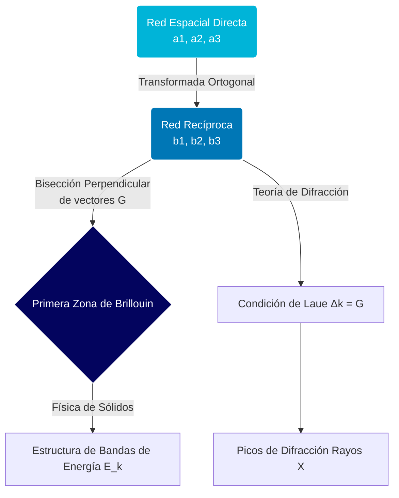

# Estructura Cristalina y Redes

La estructura cristalina se refiere a la disposición ordenada, periódica y simétrica de los átomos, iones o moléculas en un sólido. Es la base para comprender la mayoría de las propiedades mecánicas, térmicas y electrónicas de los materiales, desde los metales simples hasta los semiconductores complejos.

## 📜 Contexto Histórico

El estudio sistemático de las estructuras cristalinas comenzó con la formulación de las leyes de la cristalografía macroscópica por René Just Haüy en el siglo XVIII. Sin embargo, el verdadero avance se produjo en 1912 cuando Max von Laue descubrió la difracción de rayos X por los cristales, lo que demostró la naturaleza ondulatoria de los rayos X y la disposición periódica de los átomos. Posteriormente, William Henry Bragg y William Lawrence Bragg desarrollaron la ley de difracción que lleva su nombre, permitiendo la determinación directa de la estructura atómica de los cristales, lo cual les valió el Premio Nobel en 1915.

## 🧮 Desarrollo Teórico Profundo

La clasificación matemática de la estructura cristalina es uno de los mayores triunfos de la teoría de grupos y la geometría discreta aplicada a la física en el siglo XIX, permitiendo reducir la infinita variedad de cristales posibles a unas pocas clasificaciones fundamentales de simetría.

### 1. El Grupo Espacial y el Grupo Puntual

Cualquier operación de simetría sobre un cristal ideal se puede describir matemáticamente como un operador de Seitz $\{\mathbf{S} | \mathbf{v}\}$, donde $\mathbf{S}$ representa una operación puntual (rotación, reflexión, inversión) y $\mathbf{v}$ representa un vector de traslación. Al actuar sobre un vector de posición $\mathbf{r}$ en el cristal, transforma la coordenada como:

$$ \mathbf{r}' = \{\mathbf{S} | \mathbf{v}\}\mathbf{r} = \mathbf{S}\mathbf{r} + \mathbf{v} $$

El conjunto de todas estas operaciones que dejan la red de átomos invariante forma el **Grupo Espacial**. En tres dimensiones existen exactamente 230 grupos espaciales. Si restringimos las operaciones a aquellas que no contienen traslación pura (dejando al menos un punto invariante), obtenemos el **Grupo Puntual Cristalino** (las operaciones isomórficas a isometrías puntuales). Existen estrictamente 32 grupos puntuales cristalográficos, debido al teorema de restricción cristalográfica que dicta que solo son posibles rotaciones por factores espaciales de orden $n=1,2,3,4,6$ en una red traslacional (las simetrías de orden 5 y mayores a 6 están prohibidas para llenar el espacio periódicamente, lo que es la base de los *cuasicristales*).

### 2. La Red Recíproca: El Espacio de Momento (k-space)

Mientras que la red de Bravais directa reside en el espacio coordenado tridimensional real, el análisis de difracción (fotones) y de transporte electrónico requiere transformar al espacio de momento (o espacio recíproco de vectores de onda, k-space). 

Dado un cristal con vectores base primitivos $\mathbf{a}_1, \mathbf{a}_2, \mathbf{a}_3$, la densidad electrónica $\rho(\mathbf{r})$ en el cristal tiene la misma periodicidad de la red: $\rho(\mathbf{r} + \mathbf{R}) = \rho(\mathbf{r})$ para todo vector de Bravais $\mathbf{R}$. Su desarrollo en serie de Fourier requiere la construcción de una base recíproca.
Un vector de la red recíproca $\mathbf{G}$ se define formalmente como aquel que cumple la periodicidad de ondas planas:
$$ e^{i \mathbf{G} \cdot \mathbf{R}} = 1 $$

Sustituyendo $\mathbf{R} = n_1 \mathbf{a}_1 + n_2 \mathbf{a}_2 + n_3 \mathbf{a}_3$ y $\mathbf{G} = h \mathbf{b}_1 + k \mathbf{b}_2 + l \mathbf{b}_3$, la ecuación demanda que el producto escalar mutuo sea un múltiplo de $2\pi$:

$$ \mathbf{a}_i \cdot \mathbf{b}_j = 2\pi \delta_{ij} $$

donde $\delta_{ij}$ es la delta de Kronecker. Esto lleva a las definiciones explícitas del vector recíproco mediante los productos cruz espaciales:
$$ \mathbf{b}_1 = 2\pi \frac{\mathbf{a}_2 \times \mathbf{a}_3}{V_c}, \quad \mathbf{b}_2 = 2\pi \frac{\mathbf{a}_3 \times \mathbf{a}_1}{V_c}, \quad \mathbf{b}_3 = 2\pi \frac{\mathbf{a}_1 \times \mathbf{a}_2}{V_c} $$
Donde $V_c = \mathbf{a}_1 \cdot (\mathbf{a}_2 \times \mathbf{a}_3)$ es el volumen escalar de la celda unitaria primitiva directa.

La relación entre ambas es profundamente simétrica: la red recíproca de una red recíproca es nuevamente la red directa original. Este formalismo matemático subyace tanto en la Ley de Bragg ($2d \sin\theta = n\lambda$) como en el concepto de Primera Zona de Brillouin (la celda de Wigner-Seitz del espacio recíproco).

### Diagrama: Generación Recíproca y Zonas de Brillouin



## 🛠 Ejemplo Práctico

**Problema:** Calcula y demuestra analíticamente los vectores primitivos de la red recíproca para una estructura Cúbica Centrada en las Caras (FCC), con un parámetro de red $a$. Demuestre geométricamente qué tipo de red resulta en el espacio recíproco.

**Solución paso a paso:**

1. **Definición de vectores base primitivos de la red FCC directa:**
   Una red FCC convencional es un cubo de lado $a$, con puntos reticulares en los vértices y en los centros de todas las caras. Los vectores que unen el origen con los centros de las tres caras adyacentes forman un conjunto primitivo:
   $$ \mathbf{a}_1 = \frac{a}{2}(\hat{y} + \hat{z}) $$
   $$ \mathbf{a}_2 = \frac{a}{2}(\hat{x} + \hat{z}) $$
   $$ \mathbf{a}_3 = \frac{a}{2}(\hat{x} + \hat{y}) $$

2. **Cálculo del volumen de la celda primitiva ($V_c$):**
   Evaluamos el producto mixto $V_c = \mathbf{a}_1 \cdot (\mathbf{a}_2 \times \mathbf{a}_3)$.
   Primero, calculamos el producto cruz $\mathbf{a}_2 \times \mathbf{a}_3$:
   $$ \mathbf{a}_2 \times \mathbf{a}_3 = \frac{a^2}{4} [(\hat{x} + \hat{z}) \times (\hat{x} + \hat{y})] = \frac{a^2}{4} (\hat{x}\times\hat{x} + \hat{x}\times\hat{y} + \hat{z}\times\hat{x} + \hat{z}\times\hat{y}) $$
   Usando las propiedades del producto cruz ortonormal ($\hat{x}\times\hat{x}=0$, $\hat{x}\times\hat{y}=\hat{z}$, $\hat{z}\times\hat{x}=\hat{y}$, $\hat{z}\times\hat{y}=-\hat{x}$):
   $$ \mathbf{a}_2 \times \mathbf{a}_3 = \frac{a^2}{4}(\hat{z} + \hat{y} - \hat{x}) $$
   Ahora, el producto escalar para el volumen:
   $$ V_c = \frac{a}{2}(\hat{y} + \hat{z}) \cdot \frac{a^2}{4}(-\hat{x} + \hat{y} + \hat{z}) = \frac{a^3}{8} ( (\hat{y}\cdot\hat{y}) + (\hat{z}\cdot\hat{z}) ) = \frac{a^3}{8}(1 + 1) = \frac{a^3}{4} $$
   El volumen primitivo es un cuarto del cubo unitario convencional.

3. **Cálculo de los vectores recíprocos ($\mathbf{b}_1, \mathbf{b}_2, \mathbf{b}_3$):**
   Utilizando la definición matemática demostrada en la teoría:
   $$ \mathbf{b}_1 = \frac{2\pi}{V_c} (\mathbf{a}_2 \times \mathbf{a}_3) = \frac{2\pi}{a^3/4} \left[ \frac{a^2}{4} (-\hat{x} + \hat{y} + \hat{z}) \right] $$
   $$ \mathbf{b}_1 = \frac{2\pi}{a} (-\hat{x} + \hat{y} + \hat{z}) $$
   
   Por simetría cíclica en la permutación de las coordenadas (haciendo rotaciones $x\to y, y\to z, z\to x$), obtenemos $\mathbf{b}_2$ y $\mathbf{b}_3$:
   $$ \mathbf{b}_2 = \frac{2\pi}{V_c} (\mathbf{a}_3 \times \mathbf{a}_1) = \frac{2\pi}{a} (\hat{x} - \hat{y} + \hat{z}) $$
   $$ \mathbf{b}_3 = \frac{2\pi}{V_c} (\mathbf{a}_1 \times \mathbf{a}_2) = \frac{2\pi}{a} (\hat{x} + \hat{y} - \hat{z}) $$

4. **Análisis de los resultados geométricos:**
   Los vectores generados $(\mathbf{b}_1, \mathbf{b}_2, \mathbf{b}_3)$ son vectores que apuntan hacia las esquinas de un cubo imaginario de tamaño $(4\pi/a)$. Formalmente, este conjunto de base describe puntos que se encuentran en el centro de un cubo y en sus 8 vértices.
   
**Conclusión Fundamental:** Las matemáticas demuestran rígidamente que la red recíproca de una red FCC (Cúbica Centrada en las Caras) es una red BCC (Cúbica Centrada en el Cuerpo) con arista de longitud $4\pi/a$. Este es uno de los teoremas de dualidad geométrica más prominentes y estéticamente agradables en la cristalografía.

## 📝 Guía de Ejercicios Resueltos

### Problema 1: Fracción de Empaquetamiento de la Red HCP
Calcule el factor de empaquetamiento atómico (APF) de la estructura hexagonal compacta (HCP) asumiendo esferas duras.

**Solución paso a paso:**
En la celda unitaria de la estructura HCP ideal, la base basal es un romboide con dos triángulos equiláteros de lado $a$. El volumen de la celda hexagonal base es el área de la base multiplicada por la altura $c$:
El área basal es $A = a^2 \sin(60^\circ) = \frac{\sqrt{3}}{2} a^2$.
El volumen total es $V_{celda} = \frac{\sqrt{3}}{2} a^2 c$.
En una red HCP, la relación ideal c/a se determina por geometría tetraédrica: $c/a = \sqrt{8/3}$.
Por lo tanto, $V_{celda} = \frac{\sqrt{3}}{2} a^3 \sqrt{\frac{8}{3}} = \sqrt{2} a^3$.
El número de átomos dentro de esta celda primitiva es exactamente 2.
El radio de las esferas que están en contacto en el plano basal es $R = a/2$.
El volumen de los átomos dentro de la celda es:
$$ V_{átomos} = 2 \times \frac{4}{3} \pi R^3 = 2 \times \frac{4}{3} \pi \left( \frac{a}{2} \right)^3 = \frac{\pi}{3} a^3 $$
El Factor de Empaquetamiento (APF) es la razón:
$$ APF = \frac{V_{átomos}}{V_{celda}} = \frac{\frac{\pi}{3} a^3}{\sqrt{2} a^3} = \frac{\pi}{3\sqrt{2}} \approx 0.74 $$
Este es el máximo empaquetamiento teóricamente posible para esferas idénticas (idéntico a la estructura FCC).

### Problema 2: Índices de Miller de un Plano Intersecante
Determine los índices de Miller de un plano en una red cúbica simple que intercepta los ejes cristalográficos principales en las distancias $2a$, $3a$ y $a$ del origen.

**Solución paso a paso:**
El procedimiento estándar para hallar los índices de Miller $(hkl)$ es:
1. Encontrar las intersecciones del plano con los ejes, expresadas en términos de las constantes de red. Aquí son 2, 3 y 1.
2. Tomar los inversos de estos números:
   $$ 1/2, \quad 1/3, \quad 1/1 $$
3. Multiplicar por el mínimo común múltiplo (MCM) de los denominadores (que es 6) para reducirlos a los números enteros más pequeños posibles:
   $$ 6 \times (1/2) = 3 $$
   $$ 6 \times (1/3) = 2 $$
   $$ 6 \times (1/1) = 6 $$
Por lo tanto, los índices de Miller para este plano son $(3 2 6)$.

### Problema 3: Red Recíproca de la Red BCC
Demuestre que la red recíproca de una estructura cúbica centrada en el cuerpo (BCC) de lado $a$ es una estructura cúbica centrada en las caras (FCC) con un tamaño de celda de $4\pi/a$.

**Solución paso a paso:**
Los vectores primitivos de la red BCC directa son:
$$ \mathbf{a}_1 = \frac{a}{2} (\mathbf{\hat{i}} + \mathbf{\hat{j}} - \mathbf{\hat{k}}) $$
$$ \mathbf{a}_2 = \frac{a}{2} (-\mathbf{\hat{i}} + \mathbf{\hat{j}} + \mathbf{\hat{k}}) $$
$$ \mathbf{a}_3 = \frac{a}{2} (\mathbf{\hat{i}} - \mathbf{\hat{j}} + \mathbf{\hat{k}}) $$
El volumen de esta celda primitiva es $V_c = \mathbf{a}_1 \cdot (\mathbf{a}_2 \times \mathbf{a}_3) = \frac{a^3}{2}$.
Calculamos el primer vector primitivo recíproco $\mathbf{b}_1$:
$$ \mathbf{a}_2 \times \mathbf{a}_3 = \frac{a^2}{4} \left( (\mathbf{\hat{j}}+\mathbf{\hat{k}}-\mathbf{\hat{i}}) \times (\mathbf{\hat{i}}+\mathbf{\hat{k}}-\mathbf{\hat{j}}) \right) = \frac{a^2}{2} (\mathbf{\hat{i}} + \mathbf{\hat{j}}) $$
$$ \mathbf{b}_1 = 2\pi \frac{\mathbf{a}_2 \times \mathbf{a}_3}{V_c} = 2\pi \frac{\frac{a^2}{2}(\mathbf{\hat{i}}+\mathbf{\hat{j}})}{a^3/2} = \frac{2\pi}{a} (\mathbf{\hat{i}} + \mathbf{\hat{j}}) $$
Por permutación cíclica para los otros dos:
$$ \mathbf{b}_2 = \frac{2\pi}{a} (\mathbf{\hat{j}} + \mathbf{\hat{k}}), \quad \mathbf{b}_3 = \frac{2\pi}{a} (\mathbf{\hat{k}} + \mathbf{\hat{i}}) $$
Estos tres vectores $\mathbf{b}_1, \mathbf{b}_2, \mathbf{b}_3$ son exactamente los vectores primitivos canónicos de una red FCC en el espacio recíproco. La arista del cubo de dicha red recíproca es $2 \times \frac{2\pi}{a} = \frac{4\pi}{a}$.

## 💻 Simulaciones Computacionales

```python
import numpy as np
import matplotlib.pyplot as plt

def plot_reciprocal_lattice_2d():
    # Direct lattice primitive vectors (Hexagonal)
    a1 = np.array([1, 0])
    a2 = np.array([0.5, np.sqrt(3)/2])
    
    # Reciprocal lattice vectors
    area = np.cross(a1, a2)
    b1 = 2 * np.pi * np.array([a2[1], -a2[0]]) / area
    b2 = 2 * np.pi * np.array([-a1[1], a1[0]]) / area
    
    fig, (ax1, ax2) = plt.subplots(1, 2, figsize=(12, 6))
    
    # Generate points
    n = np.arange(-3, 4)
    N1, N2 = np.meshgrid(n, n)
    
    # Direct lattice
    Rx = N1 * a1[0] + N2 * a2[0]
    Ry = N1 * a1[1] + N2 * a2[1]
    ax1.scatter(Rx, Ry, color='blue')
    ax1.quiver(0, 0, a1[0], a1[1], angles='xy', scale_units='xy', scale=1, color='r')
    ax1.quiver(0, 0, a2[0], a2[1], angles='xy', scale_units='xy', scale=1, color='g')
    ax1.set_title("Red Directa (Hexagonal)")
    ax1.set_aspect('equal')
    ax1.grid(True)
    
    # Reciprocal lattice
    Gx = N1 * b1[0] + N2 * b2[0]
    Gy = N1 * b1[1] + N2 * b2[1]
    ax2.scatter(Gx, Gy, color='purple')
    ax2.quiver(0, 0, b1[0], b1[1], angles='xy', scale_units='xy', scale=1, color='r')
    ax2.quiver(0, 0, b2[0], b2[1], angles='xy', scale_units='xy', scale=1, color='g')
    ax2.set_title("Red Recíproca")
    ax2.set_aspect('equal')
    ax2.grid(True)
    
    plt.tight_layout()
    plt.show()

if __name__ == '__main__':
    plot_reciprocal_lattice_2d()
```

## 📚 Recursos Específicos

### Cursos
1. **[MIT OCW 8.231 - Physics of Solids](https://ocw.mit.edu):** Explora la estructura de la red recíproca con gran detalle matemático.
2. **[Cristalografía y Simetría (Coursera)](https://www.coursera.org):** Para aprender a identificar grupos espaciales.
3. **[Solid State Physics (NPTEL)](https://nptel.ac.in):** Excelentes clases magistrales enfocadas en difracción de rayos X y redes de Bravais.
4. **[X-Ray Diffraction in Crystals (edX)](https://www.edx.org):** Técnicas experimentales e interpretación de difractogramas.
5. **[Introduction to Crystallography (Oxford online materials)](https://www.ox.ac.uk):** Recursos interactivos y visuales para entender índices de Miller.
6. **[Symmetry in Condensed Matter (Cambridge)](https://www.cam.ac.uk):** Un curso avanzado para usar la teoría de grupos aplicada a las redes.

### Artículos y Simulaciones
1. **[PhET Interactive Simulations - "Crystal Lattice"](https://phet.colorado.edu):** Simulación visual básica para ver arreglos atómicos.
2. **[VESTA (Visualization for Electronic and STructural Analysis)](https://jp-minerals.org/vesta/en/):** Software indispensable para visualizar redes y densidades electrónicas.
3. **[O-PTIR and X-Ray Scattering (Article)](https://pubs.acs.org):** Ejemplos recientes en caracterización estructural.
4. **["The Discovery of X-Ray Diffraction" (W.L. Bragg, original papers)](https://www.nobelprize.org):** La historia y fundamentos físicos desde la fuente.
5. **[Bilbao Crystallographic Server](https://www.cryst.ehu.es/):** Una herramienta online esencial para estudiar simetrías espaciales.
6. **[Mercury (CSD)](https://www.ccdc.cam.ac.uk):** Simulación y exploración estructural de moléculas en redes cristalinas.
7. **[Jmol / JSmol](https://jmol.sourceforge.net/):** Simuladores en el navegador para estudiar estructuras empaquetadas.
8. **["A periodic table of crystal structures" (Nature Review Materials)](https://www.nature.com):** Un resumen visual muy útil para estructuras complejas.

### 📖 Referencias Útiles y Bibliografía
1. [Ashcroft, N. W., & Mermin, N. D. (1976). *Solid State Physics*](https://archive.org). (Capítulos 1-5).
2. [Kittel, C. (2004). *Introduction to Solid State Physics*](https://archive.org). (Capítulos iniciales sobre redes).
3. [Hammond, C. (2015). *The Basics of Crystallography and Diffraction*](https://global.oup.com). Oxford University Press.
4. [Cullity, B. D. (1978). *Elements of X-Ray Diffraction*](https://archive.org). Addison-Wesley.
