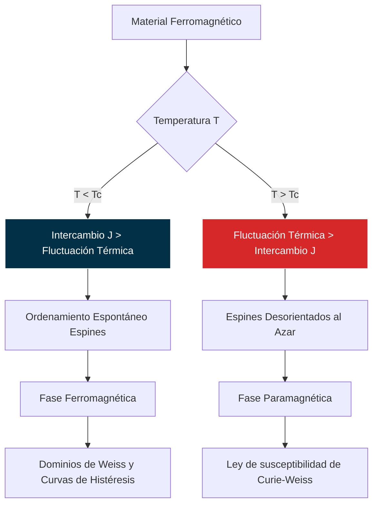

# Magnetismo en Materia

El magnetismo en la materia es el estudio de cómo los materiales responden a los campos magnéticos y cómo los momentos magnéticos intrínsecos de sus partículas elementales (principalmente electrones) interactúan entre sí. Esta rama abarca desde el diamagnetismo y paramagnetismo débil hasta fenómenos cooperativos fuertes como el ferromagnetismo, el antiferromagnetismo y el ferrimagnetismo.

## 📜 Contexto Histórico

El conocimiento del magnetismo se remonta a la antigüedad con el descubrimiento de la magnetita (piedra imán). El entendimiento moderno comenzó con los trabajos de Oersted, Ampère y Faraday en el siglo XIX, unificando electricidad y magnetismo. Sin embargo, la explicación del ferromagnetismo requirió de la mecánica cuántica. En 1907, Pierre Weiss introdujo la idea de un "campo molecular" para explicar el alineamiento espontáneo de los espines. Más tarde, en 1928, Werner Heisenberg explicó que este campo molecular era una consecuencia directa del **principio de exclusión de Pauli** y la **interacción de intercambio** culombiana, sentando las bases del magnetismo cuántico.

## 🧮 Desarrollo Teórico Profundo

El magnetismo macroscópico es fundamentalmente un fenómeno cuántico; la mecánica clásica estricta es incapaz de predecir cualquier tipo de magnetización (Teorema de Bohr-van Leeuwen). El comportamiento magnético surge de la intrincada interacción entre el momento angular orbital y el espín intrínseco de los electrones.

### 1. El Hamiltoniano Cuántico y el Diamagnetismo / Paramagnetismo

Para un átomo aislado en un campo magnético uniforme $\mathbf{B} = \nabla \times \mathbf{A}$, el Hamiltoniano cuántico del sistema multi-electrónico acopla el espín $\mathbf{S}_i$ y la cinemática:

$$ \mathcal{H} = \sum_i \left( \frac{(\mathbf{p}_i + e\mathbf{A}_i)^2}{2m_e} + V_i \right) + g \mu_B \mathbf{B} \cdot \mathbf{S}_i $$

donde $\mu_B = e\hbar / 2m_e$ es el Magnetón de Bohr. Expandiendo el término cuadrático cinético y eligiendo el calibre simétrico $\mathbf{A} = \frac{1}{2} \mathbf{B} \times \mathbf{r}$:

$$ \mathcal{H} = \mathcal{H}_0 + \mu_B (\mathbf{L} + g\mathbf{S}) \cdot \mathbf{B} + \frac{e^2}{8m_e} \sum_i (\mathbf{B} \times \mathbf{r}_i)^2 $$

Aquí, $\mathbf{L} = \sum_i \mathbf{l}_i$ es el momento angular orbital total y $\mathbf{S}$ el espín total.
El comportamiento material se dicta aplicando teoría de perturbaciones sobre el nivel base atómico $|0\rangle$:

1. El término lineal $\mu_B (\mathbf{L} + g\mathbf{S}) \cdot \mathbf{B}$ introduce el efecto Zeeman. Si el estado fundamental tiene un momento magnético neto $\mathbf{J} \neq 0$, este término domina. La tendencia del momento atómico a alinearse térmicamente paralelamente con $\mathbf{B}$ resulta en una magnetización inducida positiva que sigue la ley de Curie ($\chi \propto 1/T$). Esto es el **Paramagnetismo atómico**.

2. El término cuadrático en $\mathbf{B}^2$ es puramente repulsivo e induce una respuesta magnética opuesta de los orbitales atómicos, que incrementan su energía diamagnética para resistir el campo impuesto (Ley de Lenz a nivel orbital). Esto origina una magnetización inducida y susceptibilidad $\chi < 0$, conocida como **Diamagnetismo de Larmor**. Esta componente subyace en toda la materia.

### 2. Magnetismo Colectivo: Modelo de Intercambio de Heisenberg

Para entender el ferromagnetismo en metales de transición (Fe, Co, Ni), la mecánica cuántica introduce la **Interacción de Intercambio**. Es una fuerza culombiana electrostática que, combinada con la asimetría impuesta por el Principio de Exclusión de Pauli sobre las funciones de onda fermiónicas interpenetrantes de electrones vecinos, dicta si el estado base energético favorece espines paralelos o antiparalelos.

Werner Heisenberg y Paul Dirac demostraron que esta interacción para dos electrones equivale a un Hamiltoniano de espín efectivo:

$$ \mathcal{H}_{Heis} = -2 J \mathbf{S}_1 \cdot \mathbf{S}_2 $$

Si la integral de intercambio $J > 0$ (como ocurre debido a efectos de apantallamiento en las bandas d-orbitales del Hierro), la energía se minimiza cuando los espines son colineales (Ferromagnetismo). 

Extendiendo este modelo a una red cristalina completa sobre pares de vecinos más cercanos $\langle i,j \rangle$:

$$ \mathcal{H} = - \sum_{\langle i,j \rangle} J_{ij} \mathbf{S}_i \cdot \mathbf{S}_j - g \mu_B \mathbf{B} \cdot \sum_i \mathbf{S}_i $$

### 3. Aproximación de Campo Medio (Teoría de Weiss)

Resolver el modelo de Heisenberg exactamente en 3D es matemáticamente inabarcable. Pierre Weiss propuso simplificarlo asumiendo que cada espín $\mathbf{S}_i$ "siente" la presencia de sus vecinos no como operadores cuánticos estocásticos, sino como un **campo molecular promedio** isotrópico proporcional a la magnetización total del sistema $\mathbf{M}$.

El espín individual interactúa con un campo magnético efectivo local:
$$ \mathbf{B}_{eff} = \mathbf{B}_{ext} + \lambda \mathbf{M} $$
donde $\lambda$ es la constante de campo molecular de Weiss, parametrizando la fuerza del intercambio $J$.

Bajo este campo promedio, el comportamiento estadístico vuelve a ser idéntico al de un sistema paramagnético puro de espines independientes. Para iones con momento angular $\mathbf{J}$, la magnetización obedece la función de Brillouin $B_J(x)$:

$$ M(T, B) = M_{sat} B_J \left( \frac{g \mu_B J B_{eff}}{k_B T} \right) = M_{sat} B_J \left( \frac{g \mu_B J (B_{ext} + \lambda M)}{k_B T} \right) $$

Esta es una **ecuación de estado trascendental autorreferente**. Para $\mathbf{B}_{ext} = 0$, la única forma de que exista magnetización espontánea $M \neq 0$ es que la pendiente de la función termodinámica en el origen supere a la inversa de la función linear, lo que determina exactamente una transición de fase de segundo orden en la **Temperatura de Curie ($T_C$)**:

$$ T_C = \frac{C \lambda}{\mu_0} = \frac{z J S(S+1)}{3 k_B} $$
donde $z$ es el número de coordinación.

Para $T > T_C$, la magnetización espontánea es destruida por el desorden térmico y el sistema se vuelve paramagnético, con una susceptibilidad gobernada por la Ley de Curie-Weiss divergente:
$$ \chi = \frac{C}{T - T_C} $$

### Diagrama: Transición Ferromagnética

## 🛠 Ejemplo Práctico

**Problema:** Obtener rigurosamente la clásica Ley de Curie para un gas ideal de iones paramagnéticos con espín elemental $S=1/2$ (momento angular orbital cero) bajo un campo magnético externo constante $B$ orientado en el eje z.

**Solución paso a paso:**

1. **Niveles de Energía de Zeeman:**
   Para un espín $S=1/2$, la componente cuántica z del momento angular $S_z$ solo puede tomar dos valores propios permitidos: $+1/2$ y $-1/2$.
   Usando $g \approx 2$ para electrones sin momento orbital, el momento magnético en el eje z es $\mu_z = -g \mu_B S_z = \mp \mu_B$.
   La energía Zeeman del acoplamiento es $E = -\boldsymbol{\mu} \cdot \mathbf{B} = -\mu_z B$.
   Por lo tanto, los dos niveles de energía posibles (el espín paralelo y el antiparalelo al campo) son:
   $$ E_\downarrow = +\mu_B B \quad \text{(antiparalelo, mayor energía)} $$
   $$ E_\uparrow = -\mu_B B \quad \text{(paralelo, menor energía)} $$

2. **Estadística de Maxwell-Boltzmann:**
   A temperatura termodinámica $T$, la probabilidad de encontrar al ion en un estado particular $i$ está gobernada por el factor de Boltzmann $e^{-E_i/k_B T}$.
   Para asegurar que las probabilidades sumen 1, normalizamos dividiendo por la función de partición canónica $Z$:
   $$ Z = \sum_i e^{-E_i/k_B T} = e^{+\mu_B B / k_B T} + e^{-\mu_B B / k_B T} = 2 \cosh\left(\frac{\mu_B B}{k_B T}\right) $$
   Las probabilidades de ocupación son:
   $$ P_\uparrow = \frac{1}{Z} e^{\mu_B B / k_B T} $$
   $$ P_\downarrow = \frac{1}{Z} e^{-\mu_B B / k_B T} $$

3. **Momento Magnético Térmico Promedio:**
   El valor esperado estocástico de la componente z del momento de un ion único es la media ponderada térmica:
   $$ \langle \mu_z \rangle = (+ \mu_B) P_\uparrow + (- \mu_B) P_\downarrow $$
   Sustituyendo y factorizando $\mu_B$:
   $$ \langle \mu_z \rangle = \mu_B \frac{e^{\mu_B B / k_B T} - e^{-\mu_B B / k_B T}}{e^{\mu_B B / k_B T} + e^{-\mu_B B / k_B T}} $$
   Reconociendo la definición matemática de la tangente hiperbólica:
   $$ \langle \mu_z \rangle = \mu_B \tanh\left(\frac{\mu_B B}{k_B T}\right) $$
   A campos muy altos o temperaturas cercanas al cero absoluto, el argumento diverge y $\tanh \to 1$, produciendo la saturación magnética ($\mu_z = \mu_B$).

4. **Límite de Altas Temperaturas (Derivación de la Ley de Curie):**
   Para parámetros de laboratorio normales (campos débiles, temperatura ambiente), la energía térmica domina la alienación magnética: $k_B T \gg \mu_B B$.
   En el límite de argumentos pequeños $x \ll 1$, desarrollamos la función hiperbólica en su serie de Taylor: $\tanh(x) \approx x$.
   $$ \langle \mu_z \rangle \approx \mu_B \left( \frac{\mu_B B}{k_B T} \right) = \frac{\mu_B^2 B}{k_B T} $$

5. **Magnetización Macroscópica y Susceptibilidad:**
   Para un gas ideal con una densidad de volumen de $N$ iones independientes, la Magnetización $M$ (momento por unidad de volumen) es una simple sumatoria escalar:
   $$ M = N \langle \mu_z \rangle \approx \frac{N \mu_B^2}{k_B T} B $$
   Definimos la susceptibilidad magnética como el ratio linear de respuesta al campo en el vacío $H = B/\mu_0$:
   $$ \chi = \frac{M}{H} = \mu_0 \frac{M}{B} = \frac{\mu_0 N \mu_B^2}{k_B T} $$

**Conclusión Matemática:** El coeficiente de proporcionalidad es estrictamente dependiente de la inversa de la temperatura absoluta $T$. Hemos deducido la icónica **Ley de Curie paramagnética**:
$$ \chi = \frac{C}{T} \quad \text{donde la constante de Curie es} \quad C = \frac{\mu_0 N \mu_B^2}{k_B} $$

## 📚 Recursos Específicos

### Cursos
1. **[Magnetism and Magnetic Materials (NPTEL)](https://nptel.ac.in):** Tratamiento completo, desde momentos atómicos hasta dominios magnéticos.
2. **[Spintronics and Magnetism (edX)](https://www.edx.org):** Para aplicaciones modernas del magnetismo en dispositivos de espín.
3. **[Quantum Magnetism (MIT OCW)](https://ocw.mit.edu):** Aborda modelos de Heisenberg y efectos de muchos cuerpos magnéticos.
4. **[Solid State Magnetism (Coursera)](https://www.coursera.org):** Curso introductorio a diamagnetismo, paramagnetismo y ferromagnetismo.
5. **[Magnetic Phase Transitions (Oxford lectures)](https://www.ox.ac.uk):** Teoría de campo medio y fluctuaciones térmicas.

### Artículos y Simulaciones
1. **[Ising Model Simulator](https://mattbierbaum.github.io/ising.js/):** (Varios en GitHub o HTML5) para observar transiciones de fase y dominios en 2D.
2. **["Giant Magnetoresistance" (Fert & Grünberg, Nobel lectures)](https://www.nobelprize.org):** El artículo sobre el descubrimiento de la GMR.
3. **[OOMMF (Object Oriented Micromagnetic Framework)](https://math.nist.gov/oommf/):** El software estándar para simular dominios micromagnéticos.
4. **["Spin Glasses and Complexity" (Giorgio Parisi)](https://arxiv.org):** Artículos sobre sistemas magnéticos desordenados.
5. **[PhET - Magnets and Electromagnets](https://phet.colorado.edu):** Nivel básico, pero excelente para entender campos generados por imanes.
6. **["The Hubbard Model" (Review articles)](https://journals.aps.org):** Para profundizar en cómo el magnetismo surge de repulsión coulombsiana.
7. **[Mumax3](https://mumax.github.io):** Simulador magnético acelerado por GPU (muy utilizado en investigación actual).
8. **["Magnetic Skyrmions" (Nature Physics)](https://www.nature.com):** Artículo sobre texturas magnéticas topológicas modernas.

### 📖 Referencias Útiles y Bibliografía
1. [Blundell, S. *Magnetism in Condensed Matter*](https://global.oup.com). Oxford. (El mejor libro introductorio del tema).
2. [Coey, J. M. D. *Magnetism and Magnetic Materials*](https://www.cambridge.org). Cambridge.
3. [Cullity, B. D., & Graham, C. D. *Introduction to Magnetic Materials*](https://www.wiley.com). Wiley.
4. [Ashcroft, N. W., & Mermin, N. D. *Solid State Physics*](https://archive.org). (Capítulos 31-33).
5. [Kittel, C. *Introduction to Solid State Physics*](https://archive.org). (Capítulos de magnetismo).
