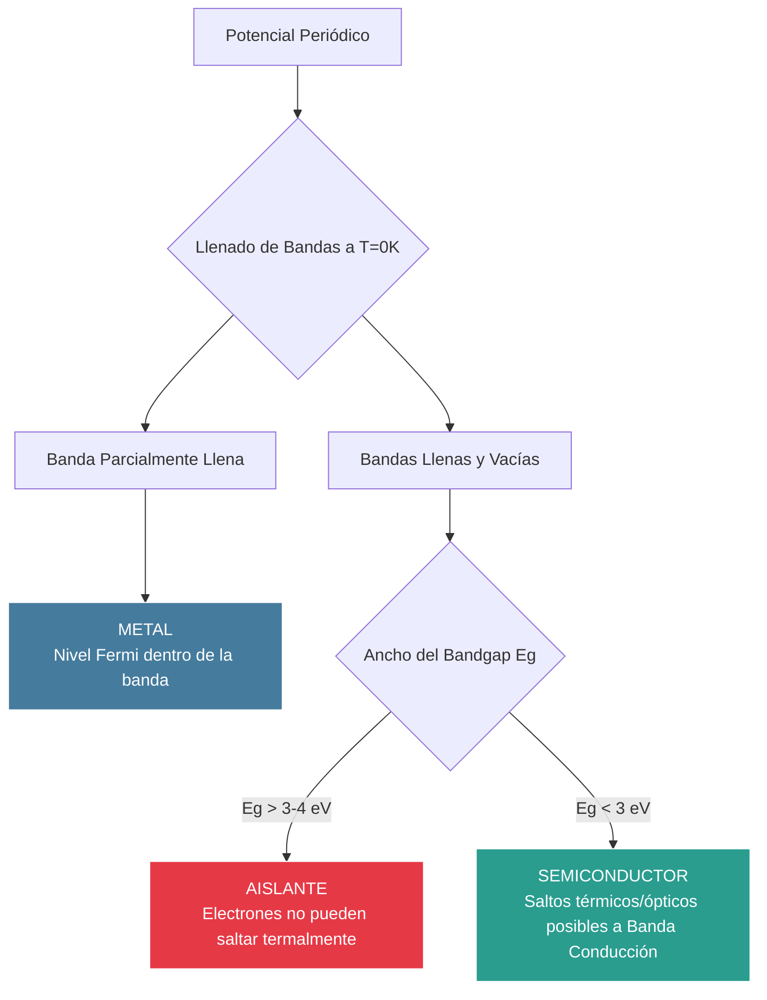

# Propiedades Electrónicas y Bandas

La teoría de bandas de los sólidos es el modelo cuántico que explica el comportamiento de los electrones en la materia condensada. Al someter a los electrones a un potencial periódico creado por la red cristalina, sus niveles de energía permitidos se agrupan en "bandas" continuas separadas por "brechas" (bandgaps) de energías prohibidas. Esta teoría es la piedra angular para entender por qué existen metales, aislantes y semiconductores.

## 📜 Contexto Histórico

El modelo del electrón libre fue propuesto inicialmente por Paul Drude (1900) y mejorado con la estadística cuántica por Arnold Sommerfeld (1927). Sin embargo, este modelo no podía explicar la existencia de aislantes o semiconductores. En 1928, Felix Bloch desarrolló el teorema que lleva su nombre, aplicando la mecánica cuántica a partículas en potenciales periódicos. Poco después, A.H. Wilson formuló la teoría moderna de semiconductores en 1931, basándose en la idea de que los materiales con bandas totalmente llenas y un gran bandgap actúan como aislantes, mientras que aquellos con bandas parcialmente llenas son conductores.

## 🧮 Desarrollo Teórico Profundo

El movimiento de un electrón en un cristal está gobernado por la ecuación de Schrödinger para una partícula en un potencial iónico periódico $U(\mathbf{r}) = U(\mathbf{r} + \mathbf{R})$, donde $\mathbf{R}$ es cualquier vector de la red de Bravais.

$$ \left[ -\frac{\hbar^2}{2m_e} \nabla^2 + U(\mathbf{r}) \right] \psi(\mathbf{r}) = E \psi(\mathbf{r}) $$

### 1. El Teorema de Bloch

La periodicidad del Hamiltoniano requiere que las funciones de onda electrónicas, conocidas como **Funciones de Bloch**, tengan la forma de una onda plana envolvente modulada por una función que comparte exactamente la misma periodicidad de la red cristalina:

$$ \psi_{n\mathbf{k}}(\mathbf{r}) = e^{i\mathbf{k}\cdot\mathbf{r}} u_{n\mathbf{k}}(\mathbf{r}) $$

donde $u_{n\mathbf{k}}(\mathbf{r} + \mathbf{R}) = u_{n\mathbf{k}}(\mathbf{r})$.
El índice $n$ es el **índice de banda** (que etiqueta bandas discretas para un mismo $\mathbf{k}$) y $\mathbf{k}$ es el **vector de onda cristalino** o cuasi-momento, que está restringido a la **Primera Zona de Brillouin** en el espacio recíproco. 

La consecuencia más notable de este teorema es que un electrón en un estado de Bloch *no colisiona* con los núcleos de la red periódica. La dispersión eléctrica (resistencia) solo se debe a impurezas o vibraciones térmicas (fonones) que rompen la periodicidad perfecta $U(\mathbf{r})$.

### 2. Ecuación Central y Zonas de Brillouin

Si expandimos el potencial periódico y la función de onda en series de Fourier sobre los vectores de la red recíproca $\mathbf{G}$:
$$ U(\mathbf{r}) = \sum_{\mathbf{G}} U_{\mathbf{G}} e^{i\mathbf{G}\cdot\mathbf{r}} \quad \text{y} \quad \psi_{\mathbf{k}}(\mathbf{r}) = \sum_{\mathbf{G}'} C_{\mathbf{k}-\mathbf{G}'} e^{i(\mathbf{k}-\mathbf{G}')\cdot\mathbf{r}} $$
Sustituyendo esto en la ecuación de Schrödinger, obtenemos la **Ecuación Central** (un sistema de ecuaciones algebraicas acopladas):

$$ \left( \frac{\hbar^2}{2m} |\mathbf{k} - \mathbf{G}|^2 - E \right) C_{\mathbf{k}-\mathbf{G}} + \sum_{\mathbf{G}'} U_{\mathbf{G}'-\mathbf{G}} C_{\mathbf{k}-\mathbf{G}'} = 0 $$

En un metal alcalino simple, $U_{\mathbf{G}}$ es pequeño. Lejos de las fronteras de Brillouin, $E(\mathbf{k}) \approx \hbar^2 k^2/2m$. Sin embargo, cuando $|\mathbf{k}| \approx |\mathbf{k} - \mathbf{G}|$ (la condición de Bragg), el electrón se acopla fuertemente a las ondas reflejadas. Esto genera la formación de ondas estacionarias tipo seno y coseno. Como estas ondas acumulan carga electrónica en diferentes posiciones relativas a los iones (en los iones atractivos o en los intersticios), sus energías difieren, abriendo una **Brecha de Energía (Bandgap $E_g$)** de magnitud $2|U_\mathbf{G}|$.

### 3. Modelo Tight-Binding (Enlace Fuerte)

Mientras que el teorema de Bloch asume electrones casi libres, el modelo de *Tight-Binding* asume electrones fuertemente ligados a los átomos individuales (como los electrones $d$ en metales de transición). 
Se propone como solución una combinación lineal de orbitales atómicos (LCAO) localizados $\phi(\mathbf{r})$:

$$ \psi_{\mathbf{k}}(\mathbf{r}) = \frac{1}{\sqrt{N}} \sum_{\mathbf{R}} e^{i\mathbf{k}\cdot\mathbf{R}} \phi(\mathbf{r} - \mathbf{R}) $$

Asumiendo que sólo hay saltos (hopping) permitidos entre átomos vecinos más cercanos con una integral de transferencia $t = - \langle \phi_i | H | \phi_{i+1} \rangle$, la energía de la banda de una red cúbica simple de constante $a$ resulta en:

$$ E(\mathbf{k}) = E_0 - 2t (\cos(k_x a) + \cos(k_y a) + \cos(k_z a)) $$

El ancho total de esta banda es proporcional al solapamiento orbital ($W = 12t$). Cuanto más cerca estén los átomos, mayor será la transferencia $t$ y más ancha será la banda.

### Diagrama: Estructura de Bandas y Clasificación de Materiales



## 🛠 Ejemplo Práctico

**Problema:** Derivar rigurosamente el tensor de **masa efectiva** $m^*$ de un electrón cerca del mínimo de una banda de conducción isótropa e indicar cómo afecta la dinámica de la partícula. Luego, aplíquelo al caso unidimensional de una banda generada por Tight-Binding.

**Solución paso a paso:**

1. **Dinámica del Paquete de Ondas:**
   La velocidad de grupo (velocidad clásica) de un paquete de electrones centrado en $\mathbf{k}$ es:
   $$ \mathbf{v}_g = \frac{1}{\hbar} \nabla_{\mathbf{k}} E(\mathbf{k}) $$
   
2. **Aceleración y Teorema de Bloch Semi-clásico:**
   Si aplicamos un campo eléctrico externo $\mathbf{F} = -e\mathbf{E}$, el trabajo realizado sobre el electrón es $dW = \mathbf{F} \cdot \mathbf{v}_g dt$. 
   Puesto que $dW = dE = \nabla_{\mathbf{k}} E \cdot d\mathbf{k}$, obtenemos:
   $$ \nabla_{\mathbf{k}} E \cdot d\mathbf{k} = \mathbf{F} \cdot \left( \frac{1}{\hbar} \nabla_{\mathbf{k}} E \right) dt $$
   Resultando en la ecuación de movimiento semi-clásica: $\hbar \frac{d\mathbf{k}}{dt} = \mathbf{F}$.

3. **Obtención de la Masa Efectiva:**
   Derivamos la velocidad de grupo respecto al tiempo para encontrar la aceleración clásica $\mathbf{a}$:
   $$ \mathbf{a} = \frac{d\mathbf{v}_g}{dt} = \frac{1}{\hbar} \frac{d}{dt} (\nabla_{\mathbf{k}} E) = \frac{1}{\hbar} \sum_j \frac{\partial^2 E}{\partial k_i \partial k_j} \frac{dk_j}{dt} $$
   Sustituyendo $\frac{dk_j}{dt} = \frac{F_j}{\hbar}$:
   $$ a_i = \sum_j \left( \frac{1}{\hbar^2} \frac{\partial^2 E}{\partial k_i \partial k_j} \right) F_j $$
   Comparando esto con la segunda ley de Newton $a_i = \sum_j (m^{-1})_{ij} F_j$, identificamos el **tensor de masa efectiva**:
   $$ \left( \frac{1}{m^*} \right)_{ij} = \frac{1}{\hbar^2} \frac{\partial^2 E}{\partial k_i \partial k_j} $$

4. **Aplicación a una Banda de Tight-Binding 1D:**
   Dada la dispersión $E(k) = E_0 - 2t \cos(ka)$.
   - En el fondo de la banda ($k=0$): $\cos(ka) \approx 1 - (ka)^2/2 \implies E(k) \approx (E_0 - 2t) + t a^2 k^2$.
     La derivada segunda es $\frac{d^2E}{dk^2} = 2ta^2$.
     Por tanto, $m^* = \frac{\hbar^2}{2ta^2}$. La masa es positiva y constante para electrones en el fondo de banda. Un alto salto $t$ (banda ancha) genera electrones muy ligeros.
   - En el tope de la banda ($k=\pi/a$): $\cos(ka \approx \pi) \approx -1 + (k - \pi/a)^2 a^2/2$.
     La derivada segunda resulta negativa: $\frac{d^2E}{dk^2} = -2ta^2$.
     Por tanto, $m^* = -\frac{\hbar^2}{2ta^2}$.

**Conclusión:** Un electrón cerca del tope de una banda en el cristal desarrolla una *masa inercial negativa*. Empujarlo en una dirección provoca que acelere en dirección opuesta (debido a intensas reflexiones de Bragg con la red). Esta anomalía física se trata convencionalmente definiendo la dinámica de las ausencias de electrones: los llamados **huecos** (holes), que exhiben masa positiva y carga eléctrica positiva.

## 📝 Guía de Ejercicios Resueltos

### Problema 1: Modelo Tight-Binding en 1D
Considere una cadena unidimensional de átomos idénticos separados por una distancia $a$. Utilizando el modelo de enlaces fuertes (tight-binding) con solo interacciones a primeros vecinos (integral de salto $t$ e integral in-situ $E_0$), derive la relación de dispersión $E(k)$ de la banda electrónica resultante.

**Solución paso a paso:**
En el método tight-binding, la función de onda de Bloch se aproxima como una combinación lineal de orbitales atómicos $\phi(x)$ localizados en cada sitio de la red $x_n = na$:
$$ \psi_k(x) = \frac{1}{\sqrt{N}} \sum_{n} e^{ikna} \phi(x - na) $$
Insertamos esto en la ecuación de Schrödinger $\hat{H}\psi_k = E(k)\psi_k$ y multiplicamos por $\phi^*(x)$ e integramos en todo el espacio:
$$ \sum_{n} e^{ikna} \int \phi^*(x) \hat{H} \phi(x - na) dx = E(k) \sum_{n} e^{ikna} \int \phi^*(x) \phi(x - na) dx $$
Consideramos la aproximación de orbitales ortogonales in situ, de forma que el lado derecho resulta aproximadamente $E(k) e^0 = E(k)$.
En el lado izquierdo, los elementos de matriz de $\hat{H}$ (energía de salto) son:
$$ \int \phi^*(x) \hat{H} \phi(x) dx \approx E_0 \quad (n=0) $$
$$ \int \phi^*(x) \hat{H} \phi(x \pm a) dx \approx -t \quad (n=\pm 1) $$
Todos los términos de orden mayor ($|n| \ge 2$) se desprecian. Sustituyendo en la suma:
$$ E_0 e^{i k (0)} - t e^{i k a} - t e^{-i k a} = E(k) $$
Usando la relación de Euler $e^{ix} + e^{-ix} = 2\cos(x)$:
$$ E(k) = E_0 - 2t \cos(ka) $$
Esta es la dispersión de la banda. La banda tiene una anchura total $4t$, centrada en $E_0$.

### Problema 2: Masa Efectiva en la Aproximación de Banda
Usando el resultado del modelo de Tight-Binding 1D del ejercicio anterior, encuentre la expresión para la masa efectiva $m^*$ de los electrones cerca del fondo y del tope de la banda de energía. 

**Solución paso a paso:**
La definición semiclásica de la masa efectiva de transporte está relacionada con la curvatura de la banda energética en el espacio recíproco:
$$ \frac{1}{m^*} = \frac{1}{\hbar^2} \frac{d^2E}{dk^2} $$
Utilizamos la relación de dispersión obtenida $E(k) = E_0 - 2t \cos(ka)$.
Derivamos dos veces respecto al vector de onda $k$:
$$ \frac{dE}{dk} = 2t a \sin(ka) $$
$$ \frac{d^2E}{dk^2} = 2t a^2 \cos(ka) $$
Por lo tanto, la masa efectiva en función de $k$ es:
$$ m^*(k) = \frac{\hbar^2}{2t a^2 \cos(ka)} $$
1. **Cerca del fondo de la banda ($k \approx 0$):**
   Evaluamos en $k=0$, donde $\cos(0) = 1$.
   $$ m^*_{fondo} = \frac{\hbar^2}{2t a^2} > 0 $$
   El electrón se comporta como una partícula clásica con masa positiva constante.
2. **Cerca del tope de la banda ($k \approx \pm \pi/a$ en el borde de zona):**
   Evaluamos en $k = \pm \pi/a$, donde $\cos(\pm \pi) = -1$.
   $$ m^*_{tope} = -\frac{\hbar^2}{2t a^2} < 0 $$
   La masa efectiva es negativa. Físicamente, un estado vacío cerca del tope (un "hueco") responderá a los campos electromagnéticos matemáticamente equivalente a poseer carga positiva y masa efectiva positiva $|m^*|$.

### Problema 3: Modelo de Kronig-Penney y la Aparición de la Banda Prohibida
Describa cualitativamente el modelo unidimensional de Kronig-Penney (pozos cuadrados periódicos de potencial $V_0$). Demuestre, analizando el comportamiento de contorno, por qué no hay soluciones para ciertos rangos de energía (bandas prohibidas o gaps).

**Solución paso a paso:**
En el modelo Kronig-Penney de red perfecta se emplea el teorema de Bloch, exigiendo que las soluciones para los pozo y las barreras se empalmen: $\psi_{n+1}(x) = e^{ika} \psi_n(x)$.
La ecuación de Schrödinger rinde soluciones oscilatorias tipo senos o cosenos en las zonas de pozo ($E > 0$) y exponenciales decayentes en las zonas barrera ($E < V_0$).
Al aplicar condiciones de continuidad de $\psi$ y $\psi'$ en las interfaces, el determinante del sistema lineal de coeficientes debe anularse para poseer soluciones no triviales.
Tras el límite idealizado de un potencial tipo delta de Dirac (barreras infinitamente estrechas pero altas), se llega a la condición trascendental restrictiva:
$$ P \frac{\sin(\alpha a)}{\alpha a} + \cos(\alpha a) = \cos(ka) $$
donde $\alpha = \sqrt{2mE}/\hbar$ y $P \propto V_0$ mide la "fuerza" de los átomos.
El lado derecho, $\cos(ka)$, representa la red cristalina y su valor **está matemáticamente restringido al intervalo $[-1, 1]$** puesto que $k$ debe ser un número real para estados propagantes.
Sin embargo, la función del lado izquierdo, que depende de la energía de la partícula ($E \propto \alpha^2$), es oscilatoria pero excede la magnitud de $1$ periódicamente por la suma del seno.
Cuando la energía de prueba $E$ arroja un valor para el lado izquierdo fuera del dominio $[-1, 1]$, no existe ningún número real $k$ que la satisfaga. Estos rangos de energía incompatibles son físicamente estados donde el electrón no puede propagarse por el cristal, reflejándose por interferencia destructiva de Bragg (las denominadas **Bandas Prohibidas o Band Gaps**).

## 💻 Simulaciones Computacionales

```python
import numpy as np
import matplotlib.pyplot as plt

def plot_tight_binding_bands_1d():
    a = 1.0  # Lattice constant
    t = 1.0  # Hopping parameter
    E0 = 0.0 # On-site energy
    
    k = np.linspace(-np.pi/a, np.pi/a, 400)
    E = E0 - 2 * t * np.cos(k * a)
    
    plt.figure(figsize=(8, 5))
    plt.plot(k, E, label='$E(k) = E_0 - 2t \cos(ka)$', color='darkred', lw=2)
    plt.axvline(-np.pi/a, color='k', linestyle='--', label='Borde Zona Brillouin')
    plt.axvline(np.pi/a, color='k', linestyle='--')
    plt.xlabel('Vector de onda k')
    plt.ylabel('Energía E')
    plt.title('Simulación: Estructura de Bandas 1D (Tight-Binding)')
    plt.xticks([-np.pi/a, 0, np.pi/a], ['$-\pi/a$', '$0$', '$\pi/a$'])
    plt.legend()
    plt.grid(True)
    plt.show()

if __name__ == '__main__':
    plot_tight_binding_bands_1d()
```

## 📚 Recursos Específicos

### Cursos
1. **[Semiconductor Devices (Coursera / Purdue)](https://www.coursera.org):** Excelente introducción a cómo las bandas definen la funcionalidad de los dispositivos.
2. **[Quantum Theory of Materials (Oxford)](https://www.ox.ac.uk):** Teoría rigurosa sobre el comportamiento de electrones en redes periódicas.
3. **[Electronic Structure of Solids (MIT OCW)](https://ocw.mit.edu):** Enfocado en modelos de enlace fuerte (tight-binding) y ondas planas.
4. **[NPTEL Electronic Materials](https://nptel.ac.in):** Estudio detallado de materiales semiconductores y metales.
5. **[Band Theory of Solids (edX)](https://www.edx.org):** Ideal para estudiantes que recién se introducen al espacio k y zonas de Brillouin.

### Artículos y Simulaciones
1. **[nanoHUB "Band Structure"](https://nanohub.org):** Simulador online interactivo para calcular estructuras de bandas.
2. **["Energy Bands in Solids" (Bloch's original concepts)](https://archive.org):** Notas sobre la formulación original del teorema de Bloch.
3. **[Wannier90 (Software)](http://www.wannier.org/):** Herramienta clave para construir orbitales localizados a partir de bandas (simulaciones avanzadas).
4. **["Graphene: Status and Prospects" (Geim, Science)](https://www.science.org):** Artículo sobre el modelo de bandas más famoso y de cono de Dirac.
5. **[Tight-Binding Studio](https://tight-binding.com/):** Aplicación para generar bandas de energía con modelos tight-binding fenomenológicos.
6. **[VASP / Quantum Espresso examples](https://www.quantum-espresso.org/):** Simulaciones DFT para obtener bandas de materiales reales.
7. **["The physics of bandgaps" (Review paper)](https://journals.aps.org):** Lectura fundamental sobre por qué se abren los bandgaps.
8. **[ARPES simulators](https://arxiv.org):** Para entender cómo se miden las bandas experimentalmente con fotoemisión.
9. **[PhET Semiconductors](https://phet.colorado.edu):** Muestra conceptos básicos de bandas de valencia y conducción interactivos.

### 📖 Referencias Útiles y Bibliografía
1. [Ashcroft, N. W., & Mermin, N. D. *Solid State Physics*](https://archive.org) (Particularmente caps. 8-10).
2. [Kittel, C. *Introduction to Solid State Physics*](https://archive.org).
3. [Sutton, A. P. *Electronic Structure of Materials*](https://global.oup.com). Oxford University Press.
4. [Sze, S. M. *Physics of Semiconductor Devices*](https://www.wiley.com). Wiley.
