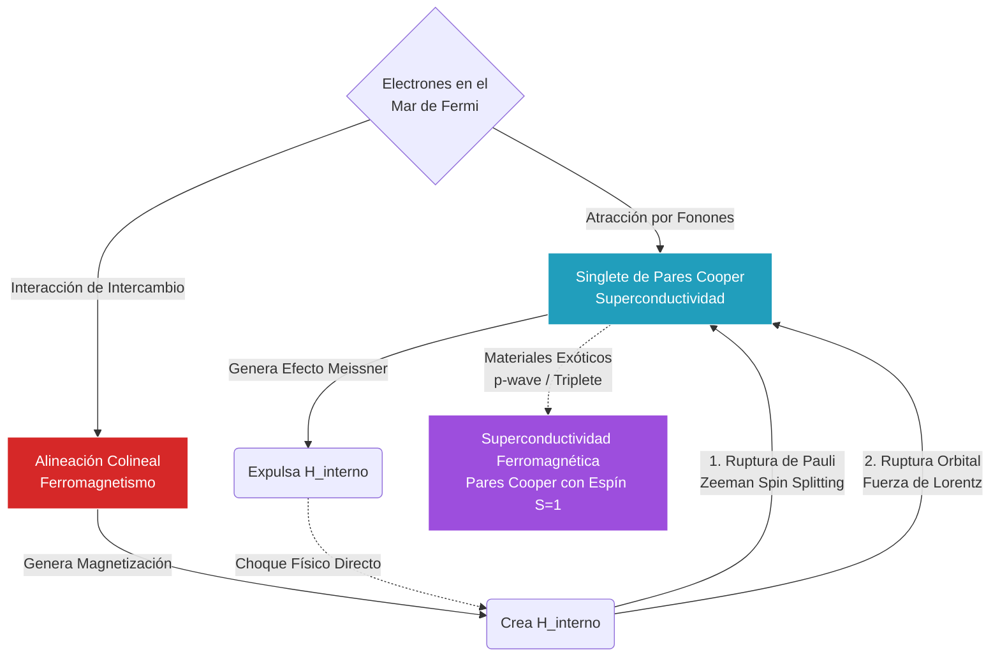

# Superconductividad y Magnetismo

Estos fenómenos muestran cómo las interacciones microscópicas pueden producir orden colectivo macroscópico. Son ejemplos privilegiados de transición de fase y ruptura espontánea de simetría en sistemas de muchos cuerpos.

## 🧮 Desarrollo Teórico Profundo

La superconductividad y el ferromagnetismo son, en su esencia más destilada, fenómenos diametralmente excluyentes y ferozmente competitivos en la física de materia condensada. Mientras que el magnetismo busca alinear los espines electrónicos colinealmente para ganar energía de intercambio, la superconductividad BCS estándar sobrevive uniendo electrones de espines opuestos (singletes $\uparrow\downarrow$). Esta incompatibilidad engendra ricas transiciones de fase y fenómenos topológicos cuando ambos intentan coexistir microscópicamente en un material (como en los superconductores magnéticos $ErRh_4B_4$ o $UGe_2$).

### 1. Competencia y Destrucción del Estado Superconductor

Existen dos mecanismos teóricos principales por los cuales el magnetismo aniquila a la superconductividad singlete estándar:

**El Efecto Orbital (Límite Meissner):**
Un campo magnético externo ($\mathbf{H}$) interacciona geométricamente con los momentos orbitales de los electrones mediante las fuerzas de Lorentz. El superconductor gasta energía en mantener corrientes superficiales de apantallamiento para cancelar $\mathbf{B}$ en su interior ($\mathbf{B} = \mu_0(\mathbf{H} + \mathbf{M}) = 0 \implies \mathbf{M} = -\mathbf{H}$).
La termodinámica requiere que el aumento de la energía libre magnética no supere a la energía de condensación estabilizadora del estado BCS. Cuando el campo aplicado $H$ supera un límite termodinámico crítico, se vuelve energéticamente favorable abortar la fase Meissner, romper los pares y que el material reingrese al estado normal permeable.
$$ \Delta G_{mag} = \frac{1}{2} \mu_0 H_c^2 \equiv E_{condensacion} \implies H_c = \sqrt{\frac{2 \mu_0}{V_c} E_{cond}} $$
Para superconductores Tipo II, las ecuaciones de Ginzburg-Landau demuestran que en lugar de destruirse uniformemente, el material permite la penetración parcial y cuantizada del campo a través de la formación de una Red de Vórtices de Abrikosov, sobreviviendo así hasta campos formidables $H_{c2}$.

**El Efecto Paramagnético de Pauli (Límite de Clogston-Chandrasekhar):**
Este mecanismo microscópico no concierne al movimiento orbital, sino estrictamente a la energía Zeeman de los espines. Un campo magnético penetrante interactúa de manera desigual con los espines del par de Cooper ($\uparrow$ y $\downarrow$).
La energía del estado antiparalelo no se altera promedialmente, pero en el estado normal, los electrones pueden polarizarse todos "spin-up" para ganar energía Zeeman ($\Delta E_{Z} = \mu_B B$). Si la ganancia de energía Zeeman térmica de los electrones normales iguala o supera la brecha atractiva emparejadora $\Delta_0$ (gap superconductor a T=0), el par se rompe catastróficamente por desalineación de momentos.
El campo crítico superior estricto impuesto por la ruptura de par de Pauli es:
$$ \mu_B B_p = \frac{\Delta_0}{\sqrt{2}} \implies B_p(T=0) \approx 1.84 \, T_c \, [\text{Tesla/Kelvin}] $$

### 2. Parámetro de Orden de Ginzburg-Landau Acoplado

Para modelar matemáticamente los dominios donde el ferromagnetismo y la superconductividad chocan, el fenomenalismo de Landau se expande introduciendo dos parámetros de orden coexistentes: $\Psi(\mathbf{r})$ (la densidad coherente de pares de Cooper) y $\mathbf{M}(\mathbf{r})$ (el vector de magnetización local).
El funcional de Energía Libre $F[\Psi, \mathbf{M}]$ añade las contribuciones individuales y un término heurístico de interacción magnetoestática e intercambio:

$$ F = \int d^3r \Big[ \alpha_\Psi |\Psi|^2 + \frac{\beta_\Psi}{2}|\Psi|^4 + \frac{1}{2m^*} |(\nabla - i \frac{2e}{\hbar c}\mathbf{A})\Psi|^2 + \alpha_M M^2 + \frac{\beta_M}{2}M^4 + \gamma (\nabla \mathbf{M})^2 + \eta |\Psi|^2 M^2 \Big] $$

El término de acoplamiento biquadrático $\eta |\Psi|^2 M^2$ (con $\eta > 0$ por la fuerte repulsión repulsiva entre estados) dicta que es energéticamente prohibitivo que ambos parámetros de orden sean simultáneamente grandes en el mismo espacio. Las ecuaciones de minimización ($\delta F = 0$) derivan en complejas soluciones oscilatorias, previendo estados intermedios estriados donde el material intercala espontáneamente dominios nanométricos magnéticos y superconductores (Fase Criptomagnética).

### Diagrama: Efectos Antagónicos y Exotismo Topológico



## 🛠 Ejemplo Práctico

**Problema:** Un nuevo superconductor candidato de baja temperatura (Nb-X) tiene una temperatura crítica puramente medida de $T_c = 4.2 \, \text{K}$. Al fabricar películas ultradelgadas donde el campo magnético puede ser puramente paralelo a la película (minimizando el efecto Meissner orbital), los experimentalistas logran observar la destrucción de la fase superconductora dictada enteramente por el límite paramagnético de Pauli a $0\,K$.
Utilice la ley de Clogston-Chandrasekhar para calcular teóricamente la intensidad del campo magnético crítico de Pauli $B_p$ requerido para destruir los pares singlete. Si el material estuviese dopado con átomos magnéticos de forma que produzcan internamente un campo microscópico efectivo de intercambio equivalente a $2.5 \, \text{T}$, ¿sobreviviría la superconductividad a temperaturas por debajo de $T_c$?

**Solución paso a paso:**

1. **Estimación del Gap de BCS:**
   Para calcular el límite teórico, primero determinamos la brecha de energía superconductora en el cero absoluto ($\Delta_0$). Empleamos la universalidad BCS para un acoplamiento débil de electrones-fonones:
   $$ 2\Delta_0 = 3.52 k_B T_c \implies \Delta_0 = 1.76 k_B T_c $$
   Usando $k_B \approx 8.617 \times 10^{-5} \, \text{eV/K}$:
   $$ \Delta_0 = 1.76 \times (8.617 \times 10^{-5}) \times 4.2 \approx 6.37 \times 10^{-4} \, \text{eV} = 0.637 \, \text{meV} $$

2. **Cálculo del Límite Paramagnético Crítico (Pauli-Clogston):**
   La condición física establece que la superconductividad se extingue cuando la ganancia energética de orientar un espín electrón al campo (Energía Zeeman $\mu_B B$) iguala a la energía necesaria para quebrar el par estabilizado por la brecha de energía, ajustado por la termodinámica de la superficie de Fermi normal ($1/\sqrt{2}$ de diferencia en energías libres):
   $$ \mu_B B_p = \frac{\Delta_0}{\sqrt{2}} $$
   Con el magnetón de Bohr $\mu_B \approx 5.788 \times 10^{-5} \, \text{eV/T}$ y $\sqrt{2} \approx 1.414$:
   $$ B_p = \frac{6.37 \times 10^{-4} \, \text{eV}}{\sqrt{2} \times 5.788 \times 10^{-5} \, \text{eV/T}} \approx \frac{6.37}{1.414 \times 0.5788} \approx \frac{6.37}{0.818} \approx 7.78 \, \text{Tesla} $$
   *(Alternativamente, la fórmula empírica directa establece $B_p \approx 1.84 \, T_c = 1.84 \times 4.2 \approx 7.73 \, \text{T}$, muy concordante dadas las diferencias de redondeo).*

3. **Análisis de Coexistencia del Dopaje:**
   El campo destructivo molecular interno aportado por las impurezas magnéticas es $B_{int} = 2.5 \, \text{T}$.
   Comparamos este campo con la tenacidad magnética del material calculada ($B_p \approx 7.78 \, \text{T}$).
   Como $B_{int} = 2.5 \, \text{T} < B_p = 7.78 \, \text{T}$, el campo efectivo de la magnetización no es lo suficientemente potente como para reventar todos los pares de Cooper mediante Zeeman splitting.

**Conclusión Física:** El material Nb-X ultradelgado sí **sostendrá la fase de superconductividad coexistente** a pesar del entorno fuertemente magnético que lo permea en el bulk. Este es el principio rector para diseñar ciertos "superconductores de aleación pesada" que soportan simultáneamente flujos de intercambio ferromagnéticos y supercorrientes bosónicas a muy bajas temperaturas.

## 📝 Guía de Ejercicios Resueltos

### Problema 1: Efecto Isotópico y Teoría BCS
La temperatura crítica de un elemento superconductor está vinculada experimentalmente a su masa isotópica $M$ mediante la relación $T_c \propto M^{-\alpha}$. Demuestre teóricamente que la teoría BCS (Bardeen-Cooper-Schrieffer) predice $\alpha = 0.5$ en el límite de acoplamiento débil.

**Solución paso a paso:**
En la teoría BCS de acoplamiento débil (cuando el potencial de interacción electrón-fonón $V$ por la densidad de estados $N(0)$ cumple $N(0)V \ll 1$), la temperatura crítica $T_c$ se obtiene de:
$$ k_B T_c \approx 1.13 \hbar \omega_D e^{-1 / N(0)V} $$
donde $\omega_D$ es la frecuencia de Debye de la red cristalina, indicativa de la energía fonónica característica.
En el modelo simple de osciladores acoplados de masa iónica $M$ y constante restauradora de muelle $K$ (asociada a los enlaces químicos), la frecuencia máxima $\omega_D$ es proporcional a la frecuencia del oscilador armónico básico:
$$ \omega_D \propto \sqrt{\frac{K}{M}} $$
Puesto que distintos isótopos de un material cambian $M$ pero dejan la estructura electrónica y, por ende, el acoplamiento $V$ y la fuerza elástica $K$ prácticamente invariantes, tenemos que:
$$ T_c \propto \omega_D \propto M^{-1/2} $$
Por lo tanto, la teoría BCS predice intrínsecamente un exponente isotópico $\alpha = 1/2$.
Esto fue una prueba definitiva de que los fonones (vibraciones reticulares) median la atracción entre electrones (formación de pares de Cooper) responsable de la superconductividad clásica.

### Problema 2: Penetración Magnética y el Parámetro de Ginzburg-Landau
Dadas la longitud de coherencia $\xi \approx 3$ nm y la longitud de penetración $\lambda_L \approx 150$ nm de un compuesto cuprato (YBa$_2$Cu$_3$O$_{7-x}$), calcule el parámetro de Ginzburg-Landau $\kappa$. Justifique si se trata de un superconductor de tipo I o tipo II y comente cómo el magnetismo entra al material.

**Solución paso a paso:**
El parámetro de Ginzburg-Landau se define adimensionalmente como el cociente:
$$ \kappa = \frac{\lambda_L}{\xi} $$
Sustituyendo los valores provistos:
$$ \kappa = \frac{150 \text{ nm}}{3 \text{ nm}} = 50 $$
La teoría fenomenológica de Ginzburg-Landau indica que la transición de energía superficial en la interfaz entre una región normal y una superconductora cambia de signo en $\kappa = 1/\sqrt{2} \approx 0.707$.
- Si $\kappa < 1/\sqrt{2}$, la energía superficial es positiva y el campo es totalmente expulsado (Tipo I).
- Si $\kappa > 1/\sqrt{2}$, la energía superficial es negativa (Tipo II).
Puesto que $\kappa = 50 \gg 1/\sqrt{2}$, este es un superconductor fuertemente de **Tipo II**.
Por su energía superficial negativa, es termodinámicamente favorable maximizar la interfase normal/superconductor cuando se supera el primer campo crítico $H_{c1}$. Por ello, el campo magnético no se expulsa repentinamente, sino que penetra en el material formando una red de filamentos de fase normal (vórtices de Abrikosov). Cada vórtice encierra un cuanto de flujo magnético $\Phi_0$ centrado en un núcleo normal (de tamaño $\sim \xi$), mientras que el superconductor en su entorno filtra las corrientes superflúas de apantallamiento en un área extensa (de tamaño $\sim \lambda_L$). Este es el **estado mixto**.

### Problema 3: Superconductividad y Ferromagnetismo Competitivo
Explique por qué, en los materiales convencionales, el ferromagnetismo y la superconductividad son fases antagonistas, utilizando los argumentos sobre la orientación de los espines (Límite paramagnético de Clogston-Chandrasekhar).

**Solución paso a paso:**
1. **El par de Cooper convencional:**
En la teoría BCS, la superconductividad se logra apareando electrones con espines opuestos y momento opuesto (estado de singlete de espín, $S=0$, $\mathbf{k}\uparrow$ y $-\mathbf{k}\downarrow$). Esto es óptimo porque las energías de los estados de espín up y down son idénticas en ausencia de campo, permitiendo maximizar los estados de par disponibles en la superficie de Fermi.
2. **Influencia del intercambio Ferromagnético:**
En un medio ferromagnético, los espines electrónicos están sujetos a un enorme "campo de intercambio" interno (interacción de canje de Heisenberg). Este campo de intercambio produce el efecto Zeeman, dividiendo y desplazando (spin-splitting) drásticamente la banda de energía de electrones con espín paralelo respecto a los de espín antiparalelo.
3. **Destrucción del singlete:**
Para crear un par de Cooper singlete, necesitamos formar pares de un electrón up y un electrón down situados a energías idénticas cerca del nivel de Fermi original. El desdoblamiento Zeeman fuerza a que los estados de igual energía tengan valores de $\mathbf{k}$ considerablemente distintos. Esto debilita severamente o extingue la interacción atractiva electrón-fonón, que es fuertemente picuda para momento neto del par igual a cero.
4. **El Límite Termodinámico (Clogston-Chandrasekhar):**
Si el campo de intercambio interno (efectivamente un campo magnético $H_M$) impone una polarización de espín (energía de ganancia de desdoblamiento magnético $\mu_B H_M$) que supera la energía de condensación de emparejamiento superconductor por par (que es del orden del gap de energía $\Delta_0$ a temperatura $T=0$), el sistema prefiere destrozar los pares para ganar energía de alineación ferromagnética. El campo magnético en el que se rompen todos los pares de singlete es el campo límite de Pauli $H_p \approx \Delta_0 / (\sqrt{2} \mu_B)$. Puesto que en los ferromagnetos el campo interno excede largamente a $H_p$, destruyen instantáneamente la superconductividad. Solo estados atípicos como la superconductividad de triplete de espín (espines paralelos, $S=1$) tienen chance de coexistir con ferromagnetismo, en algunos compuestos exóticos (p.ej., UGe$_2$).

## 💻 Simulaciones Computacionales

```python
import numpy as np
import matplotlib.pyplot as plt

def plot_pauli_limit():
    T_c = 1.0 # T_c normalized
    T = np.linspace(0, T_c, 200)
    
    # Gap BCS approximation (interpolation)
    Delta_T = np.sqrt(1 - (T/T_c)**3.2) # Phenomenological approximation
    
    # Pauli limit H_p ~ Delta(T) / sqrt(2) * mu_B
    # We plot normalized H_p(T) / H_p(0)
    H_p = Delta_T
    
    plt.figure(figsize=(8, 5))
    plt.plot(T, H_p, label='$H_p(T) / H_p(0)$', color='purple', lw=2)
    plt.fill_between(T, H_p, alpha=0.3, color='purple', label='Fase Superconductora')
    
    plt.xlabel('Temperatura Normalizada $T/T_c$')
    plt.ylabel('Campo Crítico de Pauli $H_p$ (Normalizado)')
    plt.title('Simulación: Destrucción de la Superconductividad por Límite de Pauli')
    plt.legend()
    plt.grid(True)
    plt.show()

if __name__ == '__main__':
    plot_pauli_limit()
```

## 📚 Recursos Específicos

### Cursos
1. **[Interplay of Magnetism and Superconductivity (NPTEL advanced)](https://nptel.ac.in):** Análisis de cómo el magnetismo normalmente destruye la superconductividad y excepciones notables.
2. **[Strongly Correlated Electron Systems (MIT OCW)](https://ocw.mit.edu):** Curso avanzado sobre fermiones pesados donde coexisten ambas fases.
3. **[Quantum Phase Transitions (Coursera / edX)](https://www.coursera.org):** Teoría de transiciones cuánticas en el cero absoluto entre estados magnéticos y superconductores.
4. **[Advanced Solid State Physics (Cambridge)](https://www.cam.ac.uk):** Discusión sobre simetrías rotas.
5. **[Unconventional Superconductors (Oxford lectures)](https://www.ox.ac.uk):** Estudio de casos donde las fluctuaciones magnéticas median los pares de Cooper.

### Artículos y Simulaciones
1. **["Coexistence of superconductivity and magnetism" (Review of Modern Physics)](https://journals.aps.org/rmp/):** Artículo comprensivo sobre sistemas donde ambos fenómenos ocurren simultáneamente.
2. **["Magnetic Fluctuations in High-Tc Cuprates" (Nature Physics)](https://www.nature.com):** Sobre el origen magnético de los superconductores de alta temperatura.
3. **[MuSR (Muon Spin Rotation) virtual labs](https://www.psi.ch/en/lmu):** Técnicas experimentales para detectar magnetismo en materiales superconductores.
4. **["Ferromagnetic Superconductors" (UGe2, URhGe, etc.)](https://arxiv.org):** Literatura sobre materiales muy peculiares que combinan ambos mundos de forma cooperativa.
5. **[SQUIDs simulators (Falstad / Python)](https://www.falstad.com/circuit/):** Interacción práctica entre un dispositivo superconductor y flujos magnéticos muy débiles.
6. **["Majorana Fermions in Condensed Matter" (Alicea, ROP)](https://arxiv.org):** Sobre cómo la combinación de un campo magnético y un superconductor (con acoplamiento espín-órbita) da lugar a estos estados exóticos.
7. **[Simulación de vórtices magnéticos en superconductores](https://github.com):** Herramientas GL para ver campos penetrando en forma de líneas de flujo (vórtices de Abrikosov).
8. **["Spin-Triplet Superconductivity" (Physics Today)](https://physicstoday.scitation.org):** Cuando los pares de Cooper se forman con espines paralelos.

### 📖 Referencias Útiles y Bibliografía
1. [Tinkham, M. *Introduction to Superconductivity*](https://store.doverpublications.com).
2. [Blundell, S. *Magnetism in Condensed Matter*](https://global.oup.com).
3. [Annett, J. F. *Superconductivity, Superfluids and Condensates*](https://global.oup.com). Oxford University Press.
4. [Kittel, C. *Introduction to Solid State Physics*](https://archive.org).
5. [Sachdev, S. *Quantum Phase Transitions*](https://www.cambridge.org). Cambridge University Press.
