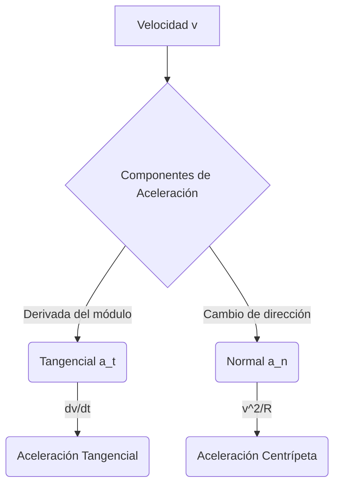

# Cinemática

La cinemática (del griego $\kappa\iota\nu\eta\mu\alpha$, kinema, "movimiento") es la rama de la mecánica clásica que describe el movimiento de puntos, cuerpos y sistemas de cuerpos sin considerar las fuerzas que provocan dicho movimiento. Mientras que la dinámica explica el "por qué" se mueven los objetos, la cinemática se centra estrictamente en el "cómo".

## 📜 Contexto Histórico
El estudio formal de la cinemática moderna comenzó con **Galileo Galilei** a principios del siglo XVII. Galileo rompió con la tradición aristotélica al demostrar empíricamente (lanzando esferas por planos inclinados) que en ausencia de resistencia del aire, todos los objetos caen con la misma aceleración, independientemente de su masa. Introdujo el concepto de que el movimiento de los proyectiles es parabólico y sentó las bases para que, décadas más tarde, Isaac Newton desarrollara el cálculo y las leyes del movimiento.

---

## 🧮 Desarrollo Teórico Profundo

El marco analítico de la cinemática se asienta en el cálculo diferencial e integral, donde la geometría del espacio-tiempo euclidiano sirve como lienzo continuo para las trayectorias de partículas puntuales o el centro de masa de cuerpos extensos.

### 1. Formulación Vectorial y Tensorial en 3D

Consideremos una variedad euclidiana $\mathbb{R}^3$ dotada de una base ortonormal $\{\hat{e}_1, \hat{e}_2, \hat{e}_3\}$ independiente del tiempo (sistema de referencia inercial). La descripción cinemática requiere un mapeo continuo $\vec{r}: \mathbb{R} \to \mathbb{R}^3$ donde $t \mapsto \vec{r}(t)$.

- **Vector Posición ($\vec{r}(t)$)**: Define la localización instantánea del móvil.

  

$$
\vec{r}(t) = \sum_{i=1}^3 x_i(t) \hat{e}_i = x(t)\hat{i} + y(t)\hat{j} + z(t)\hat{k}
$$

  
- **Cinemática Diferencial**: Definiendo el desplazamiento diferencial $d\vec{r}$, se obtiene la velocidad instantánea como el límite del cociente de diferencias:

  

$$
\vec{v}(t) = \lim_{\Delta t \to 0} \frac{\vec{r}(t+\Delta t) - \vec{r}(t)}{\Delta t} = \frac{d\vec{r}}{dt} = \dot{\vec{r}}(t)
$$

  La aceleración instantánea es la derivada de la velocidad:

  

$$
\vec{a}(t) = \frac{d\vec{v}}{dt} = \frac{d^2\vec{r}}{dt^2} = \ddot{\vec{r}}(t)
$$

### 2. Geometría Diferencial de Curvas y Triedro de Frenet-Serret

Para una trayectoria suave parametrizada por la longitud de arco $s(t) = \int_{t_0}^t |\vec{v}(\tau)| d\tau$, definimos el triedro móvil ortonormal en cada punto de la curva:

1. **Vector Tangente Unitario ($\hat{T}$)**:

   

$$
\hat{T} = \frac{d\vec{r}}{ds} = \frac{d\vec{r}/dt}{ds/dt} = \frac{\vec{v}}{|\vec{v}|}
$$

2. **Vector Normal Principal ($\hat{N}$)**: Mide la tasa de cambio direccional de $\hat{T}$.

   

$$
\frac{d\hat{T}}{ds} = \kappa \hat{N}
$$

   donde $\kappa = 1/\rho$ es la curvatura y $\rho$ es el radio de curvatura local.
3. **Vector Binormal ($\hat{B}$)**:

   

$$
\hat{B} = \hat{T} \times \hat{N}
$$

**Descomposición Intrínseca de la Aceleración**:
Usando la regla de la cadena para la velocidad $\vec{v}(t) = v(t) \hat{T}(t)$ (donde $v = ds/dt$), derivamos para hallar la aceleración:

$$
\vec{a}(t) = \frac{d}{dt}(v \hat{T}) = \dot{v} \hat{T} + v \frac{d\hat{T}}{dt}
$$

Aplicando $\frac{d\hat{T}}{dt} = \frac{d\hat{T}}{ds} \frac{ds}{dt} = (\kappa \hat{N}) v = \frac{v}{\rho} \hat{N}$:

$$
\vec{a}(t) = a_t \hat{T} + a_n \hat{N} = \ddot{s} \hat{T} + \frac{v^2}{\rho} \hat{N}
$$

Esto demuestra rigurosamente que la aceleración tiene una componente tangencial que altera la celeridad y una componente normal (centrípeta) responsable de cambiar la dirección del movimiento, sin que exista componente en la dirección binormal.



### 3. Integración de Ecuaciones de Movimiento: MRUA y Generalizaciones

Dado un campo de aceleraciones $\vec{a}(t)$, las soluciones analíticas para $\vec{v}(t)$ y $\vec{r}(t)$ requieren dos condiciones de frontera o iniciales, $\vec{r}(t_0) = \vec{r}_0$ y $\vec{v}(t_0) = \vec{v}_0$:

$$
\vec{v}(t) = \vec{v}_0 + \int_{t_0}^t \vec{a}(\tau) d\tau
$$

$$
\vec{r}(t) = \vec{r}_0 + \int_{t_0}^t \vec{v}(\tau) d\tau
$$

**Caso de Aceleración Constante ($\vec{a}(t) = \vec{a}_0$)**:
Sustituyendo e integrando formalmente:

$$
\vec{v}(t) = \vec{v}_0 + \vec{a}_0(t - t_0)
$$

$$
\vec{r}(t) = \vec{r}_0 + \vec{v}_0(t - t_0) + \frac{1}{2}\vec{a}_0(t - t_0)^2
$$

**Ecuación de Torricelli (Relación Integral Generalizada)**:
Para movimiento unidimensional dependiente de la posición, sea $a = a(x)$. Usando la regla de la cadena $a(x) = \frac{dv}{dt} = v \frac{dv}{dx}$:

$$
\int_{v_0}^{v} v' dv' = \int_{x_0}^{x} a(x') dx' \implies \frac{1}{2}v^2 - \frac{1}{2}v_0^2 = \int_{x_0}^{x} a(x') dx'
$$

Si $a$ es constante, recuperamos $v^2 = v_0^2 + 2a(x - x_0)$.

### 4. Sistemas de Coordenadas Curvilíneas (Polares, Cilíndricas y Esféricas)

A menudo, las simetrías físicas dictan el uso de bases locales ortonormales en lugar de cartesianas globales.

**Coordenadas Polares 2D $(r, \theta)$**:
La base de vectores unitarios rota con el tiempo:

$$
\hat{e}_r = \cos\theta \hat{i} + \sin\theta \hat{j}
$$

$$
\hat{e}_\theta = -\sin\theta \hat{i} + \cos\theta \hat{j}
$$

Las derivadas de los vectores unitarios con respecto al tiempo revelan dependencias de $\dot{\theta}$:

$$
\dot{\hat{e}}_r = \dot{\theta}\hat{e}_\theta, \quad \dot{\hat{e}}_\theta = -\dot{\theta}\hat{e}_r
$$

El vector posición es $\vec{r} = r \hat{e}_r$. La velocidad se deriva usando la regla del producto:

$$
\vec{v} = \dot{r} \hat{e}_r + r \dot{\hat{e}}_r = \dot{r} \hat{e}_r + r \dot{\theta} \hat{e}_\theta
$$

Derivando de nuevo para la aceleración:

$$
\vec{a} = \frac{d}{dt}(\dot{r}\hat{e}_r + r\dot{\theta}\hat{e}_\theta) = (\ddot{r} - r\dot{\theta}^2)\hat{e}_r + (r\ddot{\theta} + 2\dot{r}\dot{\theta})\hat{e}_\theta
$$

- El término $-r\dot{\theta}^2$ representa la aceleración centrípeta.
- El término $2\dot{r}\dot{\theta}$ es la **aceleración de Coriolis**, vital en marcos de referencia rotatorios y sistemas que cambian su radio de curvatura.

### 5. Independencia de Movimientos: El Teorema de Superposición

La linealidad del operador derivada permite desacoplar la cinemática en direcciones ortogonales. Para el movimiento de proyectiles en un campo gravitacional uniforme $\vec{g} = -g \hat{k}$:
La ecuación diferencial rectora $\ddot{\vec{r}} = -g \hat{k}$ implica:

$$
\ddot{x} = 0, \quad \ddot{y} = 0, \quad \ddot{z} = -g
$$

Lo que produce el conjunto clásico desacoplado:

$$
\begin{cases} x(t) = x_0 + v_{x0}t \\ y(t) = y_0 + v_{y0}t \\ z(t) = z_0 + v_{z0}t - \frac{1}{2}gt^2 \end{cases}
$$

Eliminando el parámetro temporal $t$, se obtiene la ecuación de la trayectoria parabólica en el plano de movimiento.

---

## 🛠 Ejemplo Práctico: Altura Máxima y Alcance
Un cañón dispara un proyectil con velocidad $v_0$ a un ángulo $\theta$. ¿Cuál es la altura máxima ($H$) y el alcance máximo ($R$)?

**Solución**:
1. **Altura Máxima ($H$)**: Ocurre cuando la velocidad vertical es cero ($v_y = 0$).
   Usando $v_y = v_0 \sin\theta - gt = 0 \implies t_{subida} = \frac{v_0 \sin\theta}{g}$.
   Sustituyendo en $y(t)$:

   

$$
H = (v_0 \sin\theta)\left(\frac{v_0 \sin\theta}{g}\right) - \frac{1}{2}g\left(\frac{v_0 \sin\theta}{g}\right)^2 = \mathbf{\frac{v_0^2 \sin^2\theta}{2g}}
$$

2. **Alcance Máximo ($R$)**: El proyectil cae al suelo cuando $y=0$ (en $t = 2 t_{subida}$ por simetría).

   

$$
t_{total} = \frac{2v_0 \sin\theta}{g}
$$

   Sustituyendo en $x(t)$:

   

$$
R = (v_0 \cos\theta)\left(\frac{2v_0 \sin\theta}{g}\right) = \frac{v_0^2 (2 \sin\theta \cos\theta)}{g} = \mathbf{\frac{v_0^2 \sin(2\theta)}{g}}
$$

   *(De aquí se deduce que el alcance máximo ocurre a $\theta = 45^\circ$)*.

---

## 📝 Guía de Ejercicios Resueltos

**Problema 1: Cinemática tensorial en coordenadas cilíndricas no inerciales**
Un insecto camina radialmente hacia afuera a una velocidad constante $v_0$ sobre un disco que gira con aceleración angular constante $\alpha$ partiendo del reposo. Además, el disco entero acelera linealmente en la dirección del eje Z con $a_z = k t^2$. Determine el vector aceleración absoluta del insecto en cualquier instante $t$ utilizando el triedro cilíndrico local del insecto.
**Solución paso a paso:**
1. Definimos el vector posición en el marco fijo inercial usando la base móvil cilíndrica: $\vec{r}(t) = r(t)\hat{e}_r + z(t)\hat{k}$.
2. Las condiciones iniciales dictan: $r(t) = v_0 t$, $\theta(t) = \frac{1}{2}\alpha t^2 \implies \dot{\theta} = \alpha t$, y $z(t) = \int \int a_z dt dt = \frac{k}{12}t^4$.
3. La velocidad angular del marco es $\vec{\omega} = \alpha t \hat{k}$.
4. Aplicamos el operador derivada absoluta: $\vec{v} = \dot{r}\hat{e}_r + r\dot{\theta}\hat{e}_\theta + \dot{z}\hat{k} = v_0\hat{e}_r + (v_0 t)(\alpha t)\hat{e}_\theta + \frac{k}{3}t^3\hat{k} = v_0\hat{e}_r + v_0 \alpha t^2 \hat{e}_\theta + \frac{k}{3}t^3\hat{k}$.
5. Derivamos para la aceleración, $\vec{a} = \left(\ddot{r} - r\dot{\theta}^2\right)\hat{e}_r + \left(r\ddot{\theta} + 2\dot{r}\dot{\theta}\right)\hat{e}_\theta + \ddot{z}\hat{k}$.
6. Evaluando componentes: $\ddot{r} = 0$, $r\dot{\theta}^2 = (v_0 t)(\alpha t)^2 = v_0 \alpha^2 t^3$.
7. $r\ddot{\theta} = (v_0 t)(\alpha) = v_0 \alpha t$ y la aceleración de Coriolis $2\dot{r}\dot{\theta} = 2(v_0)(\alpha t) = 2v_0 \alpha t$.
8. Sumando en la dirección tangencial: $v_0 \alpha t + 2v_0 \alpha t = 3v_0 \alpha t$.
9. La componente en z es dada por $\ddot{z} = k t^2$.
10. Resultado final: $\vec{a}(t) = -v_0 \alpha^2 t^3 \hat{e}_r + 3v_0 \alpha t \hat{e}_\theta + k t^2 \hat{k}$.

**Problema 2: Triedro de Frenet-Serret para una hélice cónica**
Una partícula se mueve a lo largo de una hélice cónica parametrizada por $\vec{r}(t) = e^{-t}\cos(t)\hat{i} + e^{-t}\sin(t)\hat{j} + e^{-t}\hat{k}$. Determine el radio de curvatura $\rho(t)$ de la trayectoria.
**Solución paso a paso:**
1. Calculamos la velocidad: $\vec{v}(t) = \dot{\vec{r}}(t) = e^{-t}(-\cos t - \sin t)\hat{i} + e^{-t}(-\sin t + \cos t)\hat{j} - e^{-t}\hat{k}$.
2. Su magnitud (celeridad) $v(t) = |\vec{v}| = e^{-t}\sqrt{(-\cos t - \sin t)^2 + (-\sin t + \cos t)^2 + (-1)^2} = e^{-t}\sqrt{1 + 2\cos t\sin t + 1 - 2\sin t\cos t + 1} = e^{-t}\sqrt{3}$.
3. Calculamos la aceleración $\vec{a}(t) = \ddot{\vec{r}}(t)$.
   $\ddot{x}(t) = e^{-t}(\cos t + \sin t + \sin t - \cos t) = 2e^{-t}\sin t$
   $\ddot{y}(t) = e^{-t}(\sin t - \cos t - \cos t - \sin t) = -2e^{-t}\cos t$
   $\ddot{z}(t) = e^{-t}$
   $\vec{a}(t) = e^{-t}(2\sin t \hat{i} - 2\cos t \hat{j} + \hat{k})$.
4. Calculamos el producto cruz $\vec{v} \times \vec{a}$:
   $\vec{v} \times \vec{a} = e^{-2t} [ (-\sin t + \cos t - (-2\cos t(-1)))\hat{i} - (-\cos t - \sin t - (-1)(2\sin t))\hat{j} + (-2\cos t(-\cos t - \sin t) - 2\sin t(-\sin t + \cos t))\hat{k} ]$
   $\vec{v} \times \vec{a} = e^{-2t} [ (\cos t - 3\sin t)\hat{i} + (\sin t + 3\cos t)\hat{j} + (2\cos^2 t + 2\sin^2 t)\hat{k} ] = e^{-2t} [ (\cos t - 3\sin t)\hat{i} + (\sin t + 3\cos t)\hat{j} + 2\hat{k} ]$.
5. Módulo de $\vec{v} \times \vec{a}$:
   $|\vec{v} \times \vec{a}|^2 = e^{-4t}[ (\cos t - 3\sin t)^2 + (\sin t + 3\cos t)^2 + 4 ] = e^{-4t}[ \cos^2 t - 6\cos t\sin t + 9\sin^2 t + \sin^2 t + 6\sin t\cos t + 9\cos^2 t + 4 ] = e^{-4t}[ 10 + 4 ] = 14 e^{-4t}$.
   $|\vec{v} \times \vec{a}| = \sqrt{14} e^{-2t}$.
6. El radio de curvatura está dado por $\rho = \frac{v^3}{|\vec{v} \times \vec{a}|}$.
7. $\rho(t) = \frac{(e^{-t}\sqrt{3})^3}{\sqrt{14}e^{-2t}} = \frac{3\sqrt{3} e^{-3t}}{\sqrt{14} e^{-2t}} = 3\sqrt{\frac{3}{14}} e^{-t}$.

**Problema 3: Integración de la ecuación de arrastre no lineal**
Un cohete de prueba se desplaza horizontalmente (la gravedad no afecta este eje) partiendo con velocidad $v_0$. El motor se apaga y el fluido genera una resistencia aerodinámica puramente cuadrática $\vec{F} = -k v^2 \hat{v}$. Encuentre la distancia total $x(t)$ y demuestre que, teóricamente, el proyectil nunca se detiene en un tiempo finito, pero viaja una distancia infinita logarítmica.
**Solución paso a paso:**
1. Ecuación de movimiento: $m\frac{dv}{dt} = -k v^2$.
2. Separación de variables para encontrar $v(t)$: $\int_{v_0}^{v} v^{-2} dv = \int_{0}^{t} -\frac{k}{m} dt$.
3. $- \left( \frac{1}{v} - \frac{1}{v_0} \right) = -\frac{k}{m} t \implies \frac{1}{v} = \frac{1}{v_0} + \frac{k}{m} t = \frac{m + k v_0 t}{m v_0}$.
4. $v(t) = \frac{m v_0}{m + k v_0 t}$.
5. Nótese que $v(t) \to 0$ solo cuando $t \to \infty$, demostrando que matemáticamente el objeto nunca se detiene por completo en tiempo finito.
6. Integramos para hallar posición: $x(t) = \int_0^t v(\tau) d\tau = \int_0^t \frac{m v_0}{m + k v_0 \tau} d\tau$.
7. Cambio de variable $u = m + k v_0 \tau \implies du = k v_0 d\tau$:
   $x(t) = \frac{m}{k} \int_{m}^{m+k v_0 t} \frac{1}{u} du = \frac{m}{k} \ln\left( \frac{m + k v_0 t}{m} \right)$.
8. $x(t) = \frac{m}{k} \ln\left( 1 + \frac{k v_0}{m} t \right)$. Como el logaritmo diverge, $x \to \infty$ si $t \to \infty$.

## 💻 Simulaciones Computacionales

A continuación, se presenta una simulación avanzada en Python que resuelve numéricamente la trayectoria de un proyectil sujeto a la gravedad y a una fuerza de arrastre aerodinámico cuadrático.

```python
import numpy as np
import matplotlib.pyplot as plt
from scipy.integrate import solve_ivp

# Parámetros físicos
g = 9.81        # Gravedad (m/s^2)
m = 1.0         # Masa (kg)
rho = 1.225     # Densidad del aire (kg/m^3)
C_d = 0.47      # Coeficiente de arrastre (esfera)
A = 0.01        # Área transversal (m^2)
k = 0.5 * rho * C_d * A / m

def projectile_motion(t, state):
    x, y, vx, vy = state
    v = np.hypot(vx, vy)
    ax = -k * v * vx
    ay = -g - k * v * vy
    return [vx, vy, ax, ay]

# Condiciones iniciales
v0 = 50.0       # Velocidad inicial (m/s)
theta = np.radians(45)
state0 = [0, 0, v0 * np.cos(theta), v0 * np.sin(theta)]
t_span = (0, 10)

# Resolver sistema
sol = solve_ivp(projectile_motion, t_span, state0, dense_output=True, events=lambda t, y: y[1])
sol.t_events[0].size > 0 and sol.y_events[0].size > 0

t = np.linspace(0, sol.t_events[0][0], 500)
z = sol.sol(t)

# Sin arrastre para comparar
t_ideal = np.linspace(0, 2 * v0 * np.sin(theta) / g, 500)
x_ideal = v0 * np.cos(theta) * t_ideal
y_ideal = v0 * np.sin(theta) * t_ideal - 0.5 * g * t_ideal**2

plt.figure(figsize=(10, 5))
plt.plot(z[0], z[1], label='Con Arrastre Cuadrático', color='red', linewidth=2)
plt.plot(x_ideal, y_ideal, '--', label='Vacío (Ideal)', color='blue')
plt.title('Trayectoria de Proyectil bidimensional')
plt.xlabel('Distancia (m)')
plt.ylabel('Altura (m)')
plt.legend()
plt.grid(True)
plt.show()
```

## 🚀 Fronteras de Investigación y Problemas Abiertos

La cinemática contemporánea, aunque bien fundamentada, está en el centro de varias fronteras tecnológicas y de investigación. A partir de 2026, los mayores desafíos se encuentran en la **cinemática de sistemas articulados hiper-redundantes** (soft robotics o robótica blanda), donde los modelos discretos tradicionales de eslabones rígidos fallan, requiriendo modelos continuos y cinemática en variedades de dimensión infinita. Adicionalmente, el **Control Predictivo por Modelo (MPC) No Lineal**, emparejado con aprendizaje por refuerzo profundo, busca resolver el problema cinemático inverso en tiempo real para robots humanoides sometidos a perturbaciones topológicas drásticas del terreno.

## 📐 Formalismo Matemático Avanzado (Nivel Posgrado/Doctorado)

En una formulación matemáticamente rigurosa, la cinemática de cuerpos rígidos se describe utilizando las propiedades geométricas del **Grupo Especial Euclidiano**, $SE(3)$, y su correspondiente **Álgebra de Lie**, $\mathfrak{se}(3)$.

La configuración espacial de un cuerpo rígido pertenece a la variedad diferenciable $SE(3) = \mathbb{R}^3 \ltimes SO(3)$. La cinemática puede formularse elegantemente mediante la cinemática de curvas en grupos de Lie. Si $g(t) \in SE(3)$ es la trayectoria, la "velocidad" se define en el álgebra de Lie $\mathfrak{se}(3)$ usando la derivada logarítmica:

$$
\hat{V}^b = g^{-1} \dot{g} = \begin{pmatrix} \hat{\omega} & v \\ 0 & 0 \end{pmatrix} \in \mathfrak{se}(3)
$$

donde $\hat{\omega} \in \mathfrak{so}(3)$ es la matriz antisimétrica asociada al vector de velocidad angular $\omega \in \mathbb{R}^3$, y $v \in \mathbb{R}^3$ es la velocidad de traslación. La derivada temporal de objetos vectoriales adscritos a este marco rotatorio general (como los momentos) es tratada intrínsecamente usando el corchete de Lie o el operador adjunto de la cinemática (derivada covariante).

## 📚 Recursos Específicos de Cinemática

### 🎓 Cursos y Clases Recomendadas
1. **[MIT 8.01: Classical Mechanics (Walter Lewin, Fall 1999)](https://ocw.mit.edu/courses/8-01-physics-i-classical-mechanics-fall-1999/)**: Curso legendario que introduce la cinemática en 1D, 2D y 3D con demostraciones experimentales impecables.
2. **[Stanford PHYS 41: Mechanics](https://physics.stanford.edu/news/phys-41-mechanics)**: Abordaje más profundo con enfoque en cálculo vectorial avanzado aplicable a sistemas de coordenadas curvilíneas.
3. **[edX - Classical Mechanics (MITx 8.01.1x)](https://www.edx.org/course/mechanics-kinematics-and-dynamics)**: Módulos interactivos y evaluaciones rigurosas de la cinemática del punto.

### 📝 Artículos, Publicaciones y Teoría Avanzada
1. **[The Kinematics of an Electron (Dirac, 1928)](https://doi.org/10.1098/rspa.1928.0023)**
   - *Importancia Teórica*: Aunque es un documento de mecánica cuántica relativista, este "paper" seminal establece cómo la cinemática del punto debe modificarse drásticamente bajo transformaciones de Lorentz.
   - *Contexto Matemático*: Introduce formalmente los espinores. En cinemática clásica, la posición $\vec{r}(t)$ se transforma bajo el grupo de Galileo. Dirac muestra que las ecuaciones cinemáticas requieren matrices complejas $\alpha_i, \beta$ anticonmutativas para preservar la invarianza invariante de Lorentz, $ds^2 = c^2 dt^2 - dx^2 - dy^2 - dz^2$.
   - *Implicaciones*: La cinemática clásica falla a altas velocidades $v \to c$.
2. **[On the Kinematics of Rigid Bodies (Euler, 1776)](https://scholarlycommons.pacific.edu/euler-works/478/)**
   - *Importancia Teórica*: Fundacional para todo el análisis cinemático de rotaciones tridimensionales.
   - *Contexto Matemático*: Euler demuestra el teorema de rotación, el cual estipula que cualquier desplazamiento cinemático de un cuerpo rígido con un punto fijo se puede describir como una rotación unívoca por un ángulo $\theta$ sobre un eje fijo $\hat{n}$. Matricialmente, toda matriz de rotación ortogonal propia $\mathbf{R} \in SO(3)$ cumple $\det(\mathbf{R}) = +1$ y tiene al menos un valor propio $\lambda = 1$.
   - *Implicaciones*: Sienta las bases para las ecuaciones dinámicas rotacionales y la robótica moderna.
3. **[Geometry of Time and Space in Kinematics (Minkowski, 1908)](https://en.wikisource.org/wiki/Translation:Space_and_Time)**
   - *Importancia Teórica*: La cinemática adquiere su forma geométrica suprema.
   - *Contexto Matemático*: Unifica el espacio $\mathbb{R}^3$ y el tiempo $t$ en una variedad seudoeuclidiana de 4 dimensiones $\mathbb{R}^{1,3}$. El cuadrivector posición se define como $x^\mu = (ct, \vec{r})$, y la cuadrivelocidad es $U^\mu = \frac{dx^\mu}{d\tau} = \gamma (c, \vec{v})$, donde $d\tau = dt/\gamma$ es el tiempo propio. La magnitud invariante es $U^\mu U_\mu = c^2$.
   - *Implicaciones*: Elimina la noción de un tiempo absoluto universal.

### 📖 Referencias Útiles y Bibliografía
- **[Classical Mechanics - H. Goldstein, C. Poole, J. Safko](https://www.pearson.com/en-us/subject-catalog/p/classical-mechanics/P200000003328/9780201657029)**: El texto estándar para pregrado y posgrado en cinemática analítica.
- **[Introduction to Classical Mechanics - D. Morin (Cambridge University Press)](https://www.cambridge.org/highereducation/books/introduction-to-classical-mechanics/31CB8B93623D3F14E1EE98B223D1DE47)**: Enfoque riguroso y matemático con ejercicios complejos sobre movimiento relativo y coordenadas curvilíneas.

## 🌐 Seminarios Avanzados y Literatura de Frontera
- [Harvard CMSA: Mathematical Physics Seminars](https://cmsa.fas.harvard.edu/seminars/mathematical-physics-seminar/) - Charlas avanzadas sobre estructuras geométricas y topológicas aplicadas a la cinemática teórica y moderna.
- [Perimeter Institute: Recorded Seminar Archive](https://pirsa.org/) - Colección de cursos sobre las bases geométricas espaciotemporales, con énfasis en transformaciones de Lorentz y cinemática relativista.
- [MIT Center for Theoretical Physics Seminars](https://ctp.lns.mit.edu/seminars/) - Series de conferencias semanales donde se discuten avances recientes en sistemas dinámicos y descripción cinemática.
- [Nature Physics: Emergent kinematics in active matter](https://www.nature.com/nphys/) - Demuestra cómo conjuntos de partículas autopropulsadas exhiben leyes cinemáticas colectivas novedosas y no triviales.
- [PRL: Kinematic control in non-Hermitian systems](https://journals.aps.org/prl/) - Analiza la cinemática de sistemas microscópicos que presentan disipación y ganancia asimétrica, redefiniendo trayectorias.
- [arXiv: Lie Group Formulation of Kinematics (Preprints)](https://arxiv.org/archive/math-ph) - Explora modelos contemporáneos sobre la aplicación sistemática del Álgebra de Lie $\mathfrak{se}(3)$ en robótica blanda.
