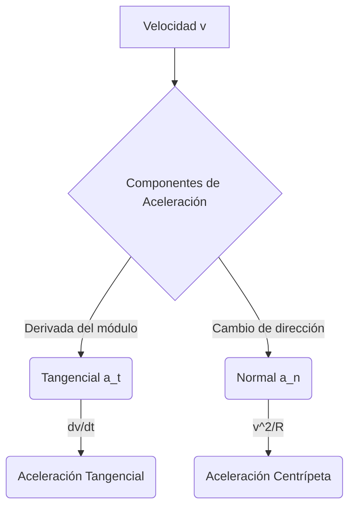

# Cinemática

La cinemática (del griego $\kappa\iota\nu\eta\mu\alpha$, kinema, "movimiento") es la rama de la mecánica clásica que describe el movimiento de puntos, cuerpos y sistemas de cuerpos sin considerar las fuerzas que provocan dicho movimiento. Mientras que la dinámica explica el "por qué" se mueven los objetos, la cinemática se centra estrictamente en el "cómo".

## 📜 Contexto Histórico
El estudio formal de la cinemática moderna comenzó con **Galileo Galilei** a principios del siglo XVII. Galileo rompió con la tradición aristotélica al demostrar empíricamente (lanzando esferas por planos inclinados) que en ausencia de resistencia del aire, todos los objetos caen con la misma aceleración, independientemente de su masa. Introdujo el concepto de que el movimiento de los proyectiles es parabólico y sentó las bases para que, décadas más tarde, Isaac Newton desarrollara el cálculo y las leyes del movimiento.

---

## 🧮 Desarrollo Teórico Profundo

El marco analítico de la cinemática se asienta en el cálculo diferencial e integral, donde la geometría del espacio-tiempo euclidiano sirve como lienzo continuo para las trayectorias de partículas puntuales o el centro de masa de cuerpos extensos.

### 1. Formulación Vectorial y Tensorial en 3D

Consideremos una variedad euclidiana $\mathbb{R}^3$ dotada de una base ortonormal $\{\hat{e}_1, \hat{e}_2, \hat{e}_3\}$ independiente del tiempo (sistema de referencia inercial). La descripción cinemática requiere un mapeo continuo $\vec{r}: \mathbb{R} \to \mathbb{R}^3$ donde $t \mapsto \vec{r}(t)$.

- **Vector Posición ($\vec{r}(t)$)**: Define la localización instantánea del móvil.
  $$ \vec{r}(t) = \sum_{i=1}^3 x_i(t) \hat{e}_i = x(t)\hat{i} + y(t)\hat{j} + z(t)\hat{k} $$
  
- **Cinemática Diferencial**: Definiendo el desplazamiento diferencial $d\vec{r}$, se obtiene la velocidad instantánea como el límite del cociente de diferencias:
  $$ \vec{v}(t) = \lim_{\Delta t \to 0} \frac{\vec{r}(t+\Delta t) - \vec{r}(t)}{\Delta t} = \frac{d\vec{r}}{dt} = \dot{\vec{r}}(t) $$
  La aceleración instantánea es la derivada de la velocidad:
  $$ \vec{a}(t) = \frac{d\vec{v}}{dt} = \frac{d^2\vec{r}}{dt^2} = \ddot{\vec{r}}(t) $$

### 2. Geometría Diferencial de Curvas y Triedro de Frenet-Serret

Para una trayectoria suave parametrizada por la longitud de arco $s(t) = \int_{t_0}^t |\vec{v}(\tau)| d\tau$, definimos el triedro móvil ortonormal en cada punto de la curva:

1. **Vector Tangente Unitario ($\hat{T}$)**:
   $$ \hat{T} = \frac{d\vec{r}}{ds} = \frac{d\vec{r}/dt}{ds/dt} = \frac{\vec{v}}{|\vec{v}|} $$
2. **Vector Normal Principal ($\hat{N}$)**: Mide la tasa de cambio direccional de $\hat{T}$.
   $$ \frac{d\hat{T}}{ds} = \kappa \hat{N} $$
   donde $\kappa = 1/\rho$ es la curvatura y $\rho$ es el radio de curvatura local.
3. **Vector Binormal ($\hat{B}$)**:
   $$ \hat{B} = \hat{T} \times \hat{N} $$

**Descomposición Intrínseca de la Aceleración**:
Usando la regla de la cadena para la velocidad $\vec{v}(t) = v(t) \hat{T}(t)$ (donde $v = ds/dt$), derivamos para hallar la aceleración:
$$ \vec{a}(t) = \frac{d}{dt}(v \hat{T}) = \dot{v} \hat{T} + v \frac{d\hat{T}}{dt} $$
Aplicando $\frac{d\hat{T}}{dt} = \frac{d\hat{T}}{ds} \frac{ds}{dt} = (\kappa \hat{N}) v = \frac{v}{\rho} \hat{N}$:
$$ \vec{a}(t) = a_t \hat{T} + a_n \hat{N} = \ddot{s} \hat{T} + \frac{v^2}{\rho} \hat{N} $$
Esto demuestra rigurosamente que la aceleración tiene una componente tangencial que altera la celeridad y una componente normal (centrípeta) responsable de cambiar la dirección del movimiento, sin que exista componente en la dirección binormal.

### 3. Integración de Ecuaciones de Movimiento: MRUA y Generalizaciones

Dado un campo de aceleraciones $\vec{a}(t)$, las soluciones analíticas para $\vec{v}(t)$ y $\vec{r}(t)$ requieren dos condiciones de frontera o iniciales, $\vec{r}(t_0) = \vec{r}_0$ y $\vec{v}(t_0) = \vec{v}_0$:

$$ \vec{v}(t) = \vec{v}_0 + \int_{t_0}^t \vec{a}(\tau) d\tau $$
$$ \vec{r}(t) = \vec{r}_0 + \int_{t_0}^t \vec{v}(\tau) d\tau $$

**Caso de Aceleración Constante ($\vec{a}(t) = \vec{a}_0$)**:
Sustituyendo e integrando formalmente:
$$ \vec{v}(t) = \vec{v}_0 + \vec{a}_0(t - t_0) $$
$$ \vec{r}(t) = \vec{r}_0 + \vec{v}_0(t - t_0) + \frac{1}{2}\vec{a}_0(t - t_0)^2 $$

**Ecuación de Torricelli (Relación Integral Generalizada)**:
Para movimiento unidimensional dependiente de la posición, sea $a = a(x)$. Usando la regla de la cadena $a(x) = \frac{dv}{dt} = v \frac{dv}{dx}$:
$$ \int_{v_0}^{v} v' dv' = \int_{x_0}^{x} a(x') dx' \implies \frac{1}{2}v^2 - \frac{1}{2}v_0^2 = \int_{x_0}^{x} a(x') dx' $$
Si $a$ es constante, recuperamos $v^2 = v_0^2 + 2a(x - x_0)$.

### 4. Sistemas de Coordenadas Curvilíneas (Polares, Cilíndricas y Esféricas)

A menudo, las simetrías físicas dictan el uso de bases locales ortonormales en lugar de cartesianas globales.

**Coordenadas Polares 2D $(r, \theta)$**:
La base de vectores unitarios rota con el tiempo:
$$ \hat{e}_r = \cos\theta \hat{i} + \sin\theta \hat{j} $$
$$ \hat{e}_\theta = -\sin\theta \hat{i} + \cos\theta \hat{j} $$
Las derivadas de los vectores unitarios con respecto al tiempo revelan dependencias de $\dot{\theta}$:
$$ \dot{\hat{e}}_r = \dot{\theta}\hat{e}_\theta, \quad \dot{\hat{e}}_\theta = -\dot{\theta}\hat{e}_r $$
El vector posición es $\vec{r} = r \hat{e}_r$. La velocidad se deriva usando la regla del producto:
$$ \vec{v} = \dot{r} \hat{e}_r + r \dot{\hat{e}}_r = \dot{r} \hat{e}_r + r \dot{\theta} \hat{e}_\theta $$
Derivando de nuevo para la aceleración:
$$ \vec{a} = \frac{d}{dt}(\dot{r}\hat{e}_r + r\dot{\theta}\hat{e}_\theta) = (\ddot{r} - r\dot{\theta}^2)\hat{e}_r + (r\ddot{\theta} + 2\dot{r}\dot{\theta})\hat{e}_\theta $$
- El término $-r\dot{\theta}^2$ representa la aceleración centrípeta.
- El término $2\dot{r}\dot{\theta}$ es la **aceleración de Coriolis**, vital en marcos de referencia rotatorios y sistemas que cambian su radio de curvatura.

### 5. Independencia de Movimientos: El Teorema de Superposición

La linealidad del operador derivada permite desacoplar la cinemática en direcciones ortogonales. Para el movimiento de proyectiles en un campo gravitacional uniforme $\vec{g} = -g \hat{k}$:
La ecuación diferencial rectora $\ddot{\vec{r}} = -g \hat{k}$ implica:
$$ \ddot{x} = 0, \quad \ddot{y} = 0, \quad \ddot{z} = -g $$
Lo que produce el conjunto clásico desacoplado:
$$ \begin{cases} x(t) = x_0 + v_{x0}t \\ y(t) = y_0 + v_{y0}t \\ z(t) = z_0 + v_{z0}t - \frac{1}{2}gt^2 \end{cases} $$
Eliminando el parámetro temporal $t$, se obtiene la ecuación de la trayectoria parabólica en el plano de movimiento.

---

## 🛠 Ejemplo Práctico: Altura Máxima y Alcance
Un cañón dispara un proyectil con velocidad $v_0$ a un ángulo $\theta$. ¿Cuál es la altura máxima ($H$) y el alcance máximo ($R$)?

**Solución**:
1. **Altura Máxima ($H$)**: Ocurre cuando la velocidad vertical es cero ($v_y = 0$).
   Usando $v_y = v_0 \sin\theta - gt = 0 \implies t_{subida} = \frac{v_0 \sin\theta}{g}$.
   Sustituyendo en $y(t)$:
   $$ H = (v_0 \sin\theta)\left(\frac{v_0 \sin\theta}{g}\right) - \frac{1}{2}g\left(\frac{v_0 \sin\theta}{g}\right)^2 = \mathbf{\frac{v_0^2 \sin^2\theta}{2g}} $$

2. **Alcance Máximo ($R$)**: El proyectil cae al suelo cuando $y=0$ (en $t = 2 t_{subida}$ por simetría).
   $$ t_{total} = \frac{2v_0 \sin\theta}{g} $$
   Sustituyendo en $x(t)$:
   $$ R = (v_0 \cos\theta)\left(\frac{2v_0 \sin\theta}{g}\right) = \frac{v_0^2 (2 \sin\theta \cos\theta)}{g} = \mathbf{\frac{v_0^2 \sin(2\theta)}{g}} $$
   *(De aquí se deduce que el alcance máximo ocurre a $\theta = 45^\circ$)*.

---

## 📚 Recursos Específicos de Cinemática

### 🎓 Cursos y Clases Recomendadas (5-7)
1. **[MIT 8.01 - Kinematics (Walter Lewin)](https://ocw.mit.edu/courses/8-01sc-classical-mechanics-fall-2016/pages/week-1-kinematics/)**: La primera semana del famoso curso, centrada en sistemas 1D y 2D y con una claridad asombrosa.
2. **[Yale PHYS 200 - Lecture 2: Vectors in Multiple Dimensions](https://oyc.yale.edu/physics/phys-200/lecture-2)**: Tratamiento profundo de vectores en cinemática, con aplicaciones al movimiento 3D.
3. **[Khan Academy - Movimiento Unidimensional y Bidimensional](https://es.khanacademy.org/science/physics/one-dimensional-motion)**: Práctica interactiva paso a paso para dominar gráficas y ecuaciones.
4. **[Coursera - Kinematics and Dynamics (UPenn)](https://www.coursera.org/learn/robotics-kinematics)**: Curso específico sobre cómo modelar sistemas mecánicos y su movimiento espacial.
5. **[edX - Classical Mechanics (MITx)](https://www.edx.org/course/mechanics-kinematics-and-dynamics)**: Módulos interactivos enfocados a la resolución de problemas cinemáticos avanzados.
6. **[Física en Línea - Universidad de los Andes](https://fisica.uniandes.edu.co/)**: Módulos en español con simulaciones de trayectoria y problemas de encuentro de móviles.

### 📝 Artículos, Simulaciones e Interactivos (8-10)
1. **Artículo**: [Galileo's Experiments on Falling Bodies (Scholarpedia)](http://www.scholarpedia.org/article/Galileo%27s_experiments_on_falling_bodies) - Análisis histórico de los planos inclinados.
2. **Artículo**: [Ecuación de Torricelli y su deducción](https://es.wikipedia.org/wiki/Ecuaci%C3%B3n_de_Torricelli) - Historia y uso de las fórmulas independientes del tiempo.
3. **Simulador**: [PhET - Movimiento de un Proyectil](https://phet.colorado.edu/es/simulations/projectile-motion) - Ajusta masa, arrastre aerodinámico y gravedad de proyectiles.
4. **Simulador**: [PhET - El Hombre Móvil](https://phet.colorado.edu/es/simulations/moving-man) - Clave para intuir gráficas de posición, velocidad y aceleración en el tiempo.
5. **Simulador**: [FísicaLab - Cinemática](https://www.fisicalab.com/tema/cinematica-conceptos) - Problemas interactivos y animaciones de movimientos MRU/MRUA.
6. **Video**: [The Physics of Bullet Drop (YouTube)](https://www.youtube.com/watch?v=cxvsHNRXLjw) - La independencia de ejes visualizada en situaciones de alcance extremo.
7. **Artículo**: [Kinematics of Mechanisms (HyperPhysics)](http://hyperphysics.phy-astr.gsu.edu/hbase/kinm.html) - Cinemática aplicada al mundo real (engranajes, levas, poleas).
8. **Simulador**: [GeoGebra - Tiro Parabólico Interactivo](https://www.geogebra.org/m/eDkG6vG9) - Applets de la comunidad para ver los vectores de velocidad variando su componente en Y.

### 📖 Referencias Útiles y Bibliografía
- **[Classical Mechanics por Herbert Goldstein](https://en.wikipedia.org/wiki/Classical_Mechanics_(Goldstein_book))**: Obra fundamental; aunque se enfoca en mecánica analítica, los capítulos iniciales asientan bases formales.
- **[Classical Mechanics por John R. Taylor](https://uscibooks.aip.org/books/classical-mechanics/)**: Excelente texto para transición entre física general y teórica. Muy claro en cinemática polar y 3D.
- **[Classical Dynamics of Particles and Systems por Stephen T. Thornton y Jerry B. Marion](https://www.cengage.com/c/classical-dynamics-of-particles-and-systems-5e-thornton/9780534408961/)**: Conocido como el "Marion", incluye un tratamiento excepcionalmente claro sobre sistemas de partículas.
- **[Física Universitaria por Sears y Zemansky](https://www.pearson.com/en-us/subject-catalog/p/university-physics-with-modern-physics/P200000003295/9780135159552)**: El libro base estándar con cientos de problemas propuestos de cinemática de nivel básico a intermedio.
- **[The Feynman Lectures on Physics (Vol 1)](https://www.feynmanlectures.caltech.edu/I_toc.html)**: Para una discusión filosófica e intuitiva sobre el tiempo, el espacio y la relatividad de Galileo.
