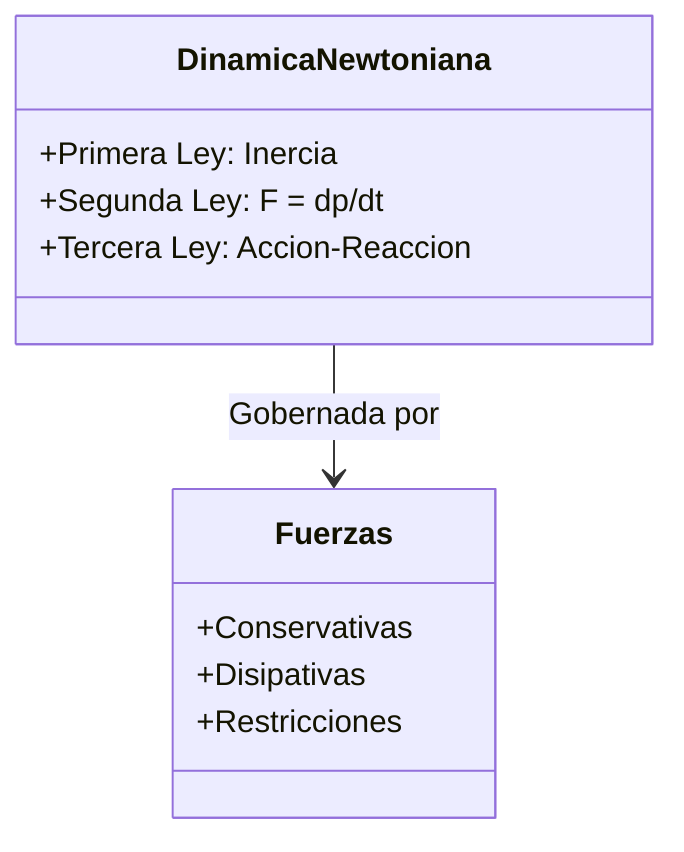

# Dinámica

La dinámica es la parte de la mecánica clásica que estudia la relación entre el movimiento de un cuerpo y las causas que lo producen (las fuerzas y momentos). Es el "por qué" las cosas se mueven.

## 📜 Contexto Histórico
Culminando con la publicación de su obra maestra *Philosophiæ Naturalis Principia Mathematica* en 1687, **Sir Isaac Newton** unificó el comportamiento mecánico del cielo y de la Tierra. Antes de él, Aristóteles afirmaba que el estado natural de un objeto era el reposo (y que se requería una fuerza continua para moverlo). Newton demostró que el estado natural es el movimiento rectilíneo uniforme, estableciendo las leyes fundamentales que gobernaron la física durante más de 200 años hasta la llegada de la relatividad.

---

## 🧮 Desarrollo Teórico Profundo

La dinámica establece el nexo causal entre las interacciones físicas (modeladas como fuerzas) y el cambio en la cinemática de un cuerpo. Este formalismo se construye sobre ecuaciones diferenciales vectoriales de segundo orden.

### 1. Marcos de Referencia Inerciales y Postulados Newtonianos

La mecánica clásica requiere una formulación rigurosa de los marcos de referencia.

**Primera Ley (Postulado del Sistema Inercial)**:
Define la existencia de un conjunto privilegiado de observadores para los cuales una partícula libre (aislada de interacciones) exhibe movimiento rectilíneo uniforme.
$$ \exists S \mid \text{si } \sum \vec{F} = \vec{0} \implies \ddot{\vec{r}} = \vec{0} $$
Cualquier marco que se mueva con velocidad constante relativa a $S$ también es inercial (Transformaciones de Galileo).

**Segunda Ley (Ecuación de Movimiento de Newton-Euler)**:
Establece que la fuerza neta externa sobre un cuerpo puntual equivale a la tasa temporal de cambio de su momento lineal $\vec{p} = m\vec{v}$:
$$ \sum_{i} \vec{F}_{i}(\vec{r}, \dot{\vec{r}}, t) = \frac{d\vec{p}}{dt} $$
Para un sistema termodinámicamente cerrado donde la masa invariante de reposo $m$ es constante:
$$ \sum_{i} \vec{F}_{i} = m\frac{d\vec{v}}{dt} = m\ddot{\vec{r}} $$
Esta es una Ecuación Diferencial Ordinaria (EDO) vectorial de segundo orden. Resolver un problema de dinámica equivale matemáticamente al **problema de valor inicial** de Cauchy.

**Tercera Ley (Simetría de Interacciones y Conservación)**:
Derivada de la homogeneidad del espacio, postula que las fuerzas son manifestaciones de interacciones binarias mutuas. Para partículas $j$ y $k$:
$$ \vec{F}_{jk} = -\vec{F}_{kj} $$
Además, el principio fuerte requiere que la fuerza esté alineada en la dirección que conecta ambas partículas $\vec{r}_{jk} \times \vec{F}_{jk} = \vec{0}$, lo que garantiza la conservación estricta del momento angular interno.

### 2. Taxonomía Tensorial y Vectorial de Fuerzas

El término $\vec{F}$ en la Segunda Ley a menudo resulta de contribuciones fenomenológicas:

**Fuerzas de Restricción (Holonómicas y no Holonómicas)**:
Fuerzas como la tensión $\vec{T}$ o la Normal $\vec{N}$ no vienen dadas a priori, sino que se deducen a posteriori a partir de la cinemática restringida.
Por ejemplo, la condición de deslizamiento sobre una superficie implícita $\Phi(x, y, z) = 0$ exige que la Normal sea paralela al gradiente escalar:
$$ \vec{N} = \lambda \nabla \Phi $$
donde el multiplicador de Lagrange $\lambda$ determina la magnitud de la fuerza normal requerida para mantener $\Phi=0$.

**Fuerzas Viscosas y de Arrastre Aerodinámico**:
La fricción fluida se modela generalmente con una expansión polinómica de la velocidad:
$$ \vec{f}_{drag} = - \left( c_1 |\vec{v}| + c_2 |\vec{v}|^2 \right) \frac{\vec{v}}{|\vec{v}|} $$
En régimen de Stokes (flujo laminar para números de Reynolds bajos), $c_1 \propto \eta R$ y domina el término lineal. En régimen turbulento, $c_2 \propto \rho A C_D$ y domina el término cuadrático, derivando la **velocidad terminal** asintótica de la EDO no lineal $\frac{dv}{dt} = g - \frac{c_2}{m}v^2$, cuya solución hiperbólica es:
$$ v(t) = v_{\infty} \tanh\left( \frac{g t}{v_{\infty}} \right), \quad v_{\infty} = \sqrt{\frac{mg}{c_2}} $$

**Ley de Fricción Seca de Coulomb-Amontons**:
Modelada empíricamente como un par desigualdad-igualdad:
- **Régimen Estático**: $|\vec{f}_s| \le \mu_s |\vec{N}|$. La fuerza se iguala a la solicitación activa paralela a la superficie para mantener $a=0$.
- **Régimen Cinético**: $\vec{f}_k = - \mu_k |\vec{N}| \hat{v}_{tangencial}$. 

### 3. Dinámica en Sistemas de Referencia No Inerciales

Al resolver las ecuaciones desde un sistema girando con vector de velocidad angular instantánea $\vec{\Omega}$ y acelerando su origen, debemos agregar un marco de **fuerzas ficticias** derivadas de transformaciones del espacio de configuraciones:

Derivando el vector posición en el marco giratorio, el operador derivada se transforma como $\left( \frac{d}{dt} \right)_{inercial} = \left( \frac{d}{dt} \right)_{rot} + \vec{\Omega} \times$.
Al aplicarlo a $\vec{v}$ obtenemos la ecuación de Newton generalizada para el marco acelerado:
$$ m\vec{a}_{rot} = \sum \vec{F}_{real} - m\vec{A}_0 - m\dot{\vec{\Omega}} \times \vec{r}' - 2m(\vec{\Omega} \times \vec{v}') - m\vec{\Omega} \times (\vec{\Omega} \times \vec{r}') $$
Donde surgen intrínsecamente:
1. Fuerzas de traslación $-m\vec{A}_0$
2. Fuerza de Euler $-m\dot{\vec{\Omega}} \times \vec{r}'$
3. Fuerza de Coriolis $-2m(\vec{\Omega} \times \vec{v}')$
4. Fuerza Centrífuga $-m\vec{\Omega} \times (\vec{\Omega} \times \vec{r}')$

Esto provee el marco analítico profundo de por qué un péndulo de Foucault precesa o cómo se forman los huracanes debido a la curvatura isobárica afectada por Coriolis.

---

## 🛠 Ejemplo Práctico: Plano Inclinado con Fricción
Un bloque de masa $m$ se desliza hacia abajo por un plano inclinado con ángulo $\theta$ respecto a la horizontal. El coeficiente de fricción cinética es $\mu_k$. Calcular la aceleración del bloque.

**Solución**:
1. Establecemos los ejes de coordenadas: el eje $x$ paralelo al plano (hacia abajo positivo) y el eje $y$ perpendicular al plano (hacia arriba positivo).
2. Descomponemos el peso $mg$ en estos ejes:
   - $W_x = mg \sin\theta$
   - $W_y = -mg \cos\theta$
3. Aplicamos la Segunda Ley de Newton en el eje $y$ (no hay movimiento en $y$):
   $$ \sum F_y = N - mg \cos\theta = 0 \implies N = mg \cos\theta $$
4. Aplicamos la Segunda Ley de Newton en el eje $x$:
   $$ \sum F_x = mg \sin\theta - f_k = ma $$
   Como $f_k = \mu_k N = \mu_k (mg \cos\theta)$:
   $$ mg \sin\theta - \mu_k mg \cos\theta = ma $$
5. Cancelando la masa $m$, obtenemos la aceleración (independiente de la masa):
   $$ \mathbf{a = g (\sin\theta - \mu_k \cos\theta)} $$

---

## 📚 Recursos Específicos de Dinámica

### 🎓 Cursos y Clases Recomendadas (5-7)
1. **[MIT 8.01 - Newton's Laws of Motion (Walter Lewin)](https://ocw.mit.edu/courses/8-01sc-classical-mechanics-fall-2016/pages/week-2-newtons-laws-of-motion/)**: Semanas 2 y 3 dedicadas exclusivamente a resolver problemas clásicos de dinámica.
2. **[Yale PHYS 200 - Lecture 3: Newton's Laws of Motion](https://oyc.yale.edu/physics/phys-200/lecture-3)**: Un análisis riguroso de qué son realmente la masa y la inercia.
3. **[Khan Academy - Fuerzas y Leyes de Newton](https://es.khanacademy.org/science/physics/forces-newtons-laws)**: Diagramas de cuerpo libre paso a paso y fuerzas interactivas.
4. **[Coursera - Engineering Mechanics: Statics & Dynamics (Georgia Tech)](https://www.coursera.org/learn/engineering-mechanics-statics)**: Un enfoque muy práctico sobre fuerzas en estructuras y aceleración de componentes mecánicos.
5. **[NPTEL - Engineering Mechanics (IIT)](https://nptel.ac.in/courses/122/104/122104015/)**: Excelente curso centrado en problemas de dinámica rigurosa con un enfoque ingenieril avanzado.

### 📝 Artículos, Simulaciones e Interactivos (8-10)
1. **Artículo Histórico**: [Principia Mathematica en español](http://www.cervantesvirtual.com/obra/principios-matematicos-de-la-filosofia-natural--0/) - Leer las propias palabras de Newton al definir la inercia y fuerza.
2. **Artículo (Stanford)**: [Newton's Philosophiae Naturalis Principia Mathematica](https://plato.stanford.edu/entries/newton-principia/) - Análisis filosófico detallado de sus leyes axiomáticas.
3. **Simulador**: [PhET - Fuerzas y Movimiento (Conceptos básicos)](https://phet.colorado.edu/es/simulations/forces-and-motion-basics) - Excelente para visualizar empujones, tirones y fuerzas de fricción.
4. **Simulador**: [PhET - Rampa, Fuerzas y Movimiento](https://phet.colorado.edu/es/simulations/ramp-forces-and-motion) - Ajusta el coeficiente de fricción de un plano inclinado y observa diagramas de cuerpo libre cambiantes.
5. **Video Analítico**: [Veritasium - Why Gravity is NOT a Force](https://www.youtube.com/watch?v=XRr1kaXKBsU) - Interesante contraste entre la dinámica newtoniana y relativista.
6. **Artículo**: [Friction and Drag (HyperPhysics)](http://hyperphysics.phy-astr.gsu.edu/hbase/frict.html) - Conceptos básicos sobre rozamiento aerodinámico y fuerzas disipativas.
7. **Simulador**: [GeoGebra - Diagramas de Cuerpo Libre](https://www.geogebra.org/m/J2K6D3x5) - Applets para practicar la suma vectorial de fuerzas con polígonos.
8. **Video Experimental**: [SmarterEveryDay - Fluid Dynamics and Drag](https://www.youtube.com/watch?v=3u_R4yqHqA8) - Impacto visual de las fuerzas de arrastre fluidas que complican la ley de Newton.

### 📖 Referencias Útiles y Bibliografía
- **[Classical Dynamics of Particles and Systems (Marion & Thornton)](https://www.cengage.com/c/classical-dynamics-of-particles-and-systems-5e-thornton/9780534408961/)**: Clave para ir un paso más allá de la física de primer año, abordando fuerzas centrales y acopladas.
- **[Classical Mechanics (John R. Taylor)](https://uscibooks.aip.org/books/classical-mechanics/)**: Su tratamiento sobre fuerzas con resistencia del aire (drag) y fuerzas restauradoras es magnífico.
- **[Classical Mechanics (Goldstein)](https://en.wikipedia.org/wiki/Classical_Mechanics_(Goldstein_book))**: Aborda la dinámica desde el principio de D'Alembert, esencial para la formulación lagrangiana de sistemas restringidos.
- **[Física Universitaria (Sears & Zemansky)](https://www.pearson.com/en-us/subject-catalog/p/university-physics-with-modern-physics/P200000003295/9780135159552)**: Extenso banco de ejercicios sobre tensiones, resortes, planos inclinados y máquinas de Atwood.
- **[Introduction to Classical Mechanics (David Morin)](https://www.cambridge.org/highereducation/books/introduction-to-classical-mechanics/31CB8B93623D3F14E1EE98B223D1DE47)**: Lleno de problemas retadores de dinámica, famoso por su rigor matemático intuitivo y sus limericks.
