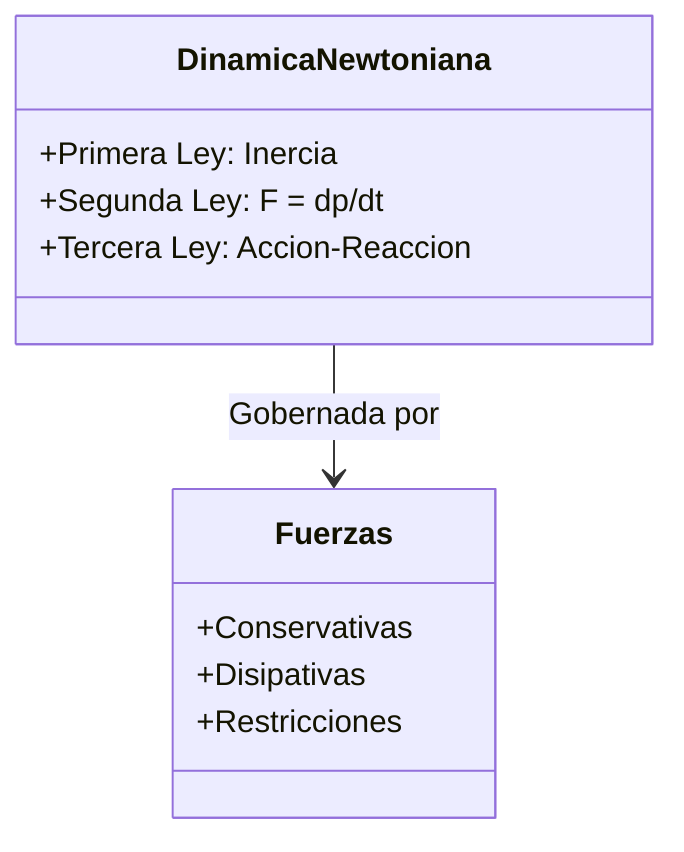

# Dinámica

La dinámica es la parte de la mecánica clásica que estudia la relación entre el movimiento de un cuerpo y las causas que lo producen (las fuerzas y momentos). Es el "por qué" las cosas se mueven.

## 📜 Contexto Histórico
Culminando con la publicación de su obra maestra *Philosophiæ Naturalis Principia Mathematica* en 1687, **Sir Isaac Newton** unificó el comportamiento mecánico del cielo y de la Tierra. Antes de él, Aristóteles afirmaba que el estado natural de un objeto era el reposo (y que se requería una fuerza continua para moverlo). Newton demostró que el estado natural es el movimiento rectilíneo uniforme, estableciendo las leyes fundamentales que gobernaron la física durante más de 200 años hasta la llegada de la relatividad.

---

## 🧮 Desarrollo Teórico Profundo

La dinámica establece el nexo causal entre las interacciones físicas (modeladas como fuerzas) y el cambio en la cinemática de un cuerpo. Este formalismo se construye sobre ecuaciones diferenciales vectoriales de segundo orden.

### 1. Marcos de Referencia Inerciales y Postulados Newtonianos

La mecánica clásica requiere una formulación rigurosa de los marcos de referencia.

**Primera Ley (Postulado del Sistema Inercial)**:
Define la existencia de un conjunto privilegiado de observadores para los cuales una partícula libre (aislada de interacciones) exhibe movimiento rectilíneo uniforme.

$$
\exists S \mid \text{si } \sum \vec{F} = \vec{0} \implies \ddot{\vec{r}} = \vec{0}
$$

Cualquier marco que se mueva con velocidad constante relativa a $S$ también es inercial (Transformaciones de Galileo).

**Segunda Ley (Ecuación de Movimiento de Newton-Euler)**:
Establece que la fuerza neta externa sobre un cuerpo puntual equivale a la tasa temporal de cambio de su momento lineal $\vec{p} = m\vec{v}$:

$$
\sum_{i} \vec{F}_{i}(\vec{r}, \dot{\vec{r}}, t) = \frac{d\vec{p}}{dt}
$$

Para un sistema termodinámicamente cerrado donde la masa invariante de reposo $m$ es constante:

$$
\sum_{i} \vec{F}_{i} = m\frac{d\vec{v}}{dt} = m\ddot{\vec{r}}
$$

Esta es una Ecuación Diferencial Ordinaria (EDO) vectorial de segundo orden. Resolver un problema de dinámica equivale matemáticamente al **problema de valor inicial** de Cauchy.

**Tercera Ley (Simetría de Interacciones y Conservación)**:
Derivada de la homogeneidad del espacio, postula que las fuerzas son manifestaciones de interacciones binarias mutuas. Para partículas $j$ y $k$:

$$
\vec{F}_{jk} = -\vec{F}_{kj}
$$

Además, el principio fuerte requiere que la fuerza esté alineada en la dirección que conecta ambas partículas $\vec{r}_{jk} \times \vec{F}_{jk} = \vec{0}$, lo que garantiza la conservación estricta del momento angular interno.



### 2. Taxonomía Tensorial y Vectorial de Fuerzas

El término $\vec{F}$ en la Segunda Ley a menudo resulta de contribuciones fenomenológicas:

**Fuerzas de Restricción (Holonómicas y no Holonómicas)**:
Fuerzas como la tensión $\vec{T}$ o la Normal $\vec{N}$ no vienen dadas a priori, sino que se deducen a posteriori a partir de la cinemática restringida.
Por ejemplo, la condición de deslizamiento sobre una superficie implícita $\Phi(x, y, z) = 0$ exige que la Normal sea paralela al gradiente escalar:

$$
\vec{N} = \lambda \nabla \Phi
$$

donde el multiplicador de Lagrange $\lambda$ determina la magnitud de la fuerza normal requerida para mantener $\Phi=0$.

**Fuerzas Viscosas y de Arrastre Aerodinámico**:
La fricción fluida se modela generalmente con una expansión polinómica de la velocidad:

$$
\vec{f}_{drag} = - \left( c_1 |\vec{v}| + c_2 |\vec{v}|^2 \right) \frac{\vec{v}}{|\vec{v}|}
$$

En régimen de Stokes (flujo laminar para números de Reynolds bajos), $c_1 \propto \eta R$ y domina el término lineal. En régimen turbulento, $c_2 \propto \rho A C_D$ y domina el término cuadrático, derivando la **velocidad terminal** asintótica de la EDO no lineal $\frac{dv}{dt} = g - \frac{c_2}{m}v^2$, cuya solución hiperbólica es:

$$
v(t) = v_{\infty} \tanh\left( \frac{g t}{v_{\infty}} \right), \quad v_{\infty} = \sqrt{\frac{mg}{c_2}}
$$

**Ley de Fricción Seca de Coulomb-Amontons**:
Modelada empíricamente como un par desigualdad-igualdad:
- **Régimen Estático**: $|\vec{f}_s| \le \mu_s |\vec{N}|$. La fuerza se iguala a la solicitación activa paralela a la superficie para mantener $a=0$.
- **Régimen Cinético**: $\vec{f}_k = - \mu_k |\vec{N}| \hat{v}_{tangencial}$. 

### 3. Dinámica en Sistemas de Referencia No Inerciales

Al resolver las ecuaciones desde un sistema girando con vector de velocidad angular instantánea $\vec{\Omega}$ y acelerando su origen, debemos agregar un marco de **fuerzas ficticias** derivadas de transformaciones del espacio de configuraciones:

Derivando el vector posición en el marco giratorio, el operador derivada se transforma como $\left( \frac{d}{dt} \right)_{inercial} = \left( \frac{d}{dt} \right)_{rot} + \vec{\Omega} \times$.
Al aplicarlo a $\vec{v}$ obtenemos la ecuación de Newton generalizada para el marco acelerado:

$$
m\vec{a}_{rot} = \sum \vec{F}_{real} - m\vec{A}_0 - m\dot{\vec{\Omega}} \times \vec{r}' - 2m(\vec{\Omega} \times \vec{v}') - m\vec{\Omega} \times (\vec{\Omega} \times \vec{r}')
$$

Donde surgen intrínsecamente:
1. Fuerzas de traslación $-m\vec{A}_0$
2. Fuerza de Euler $-m\dot{\vec{\Omega}} \times \vec{r}'$
3. Fuerza de Coriolis $-2m(\vec{\Omega} \times \vec{v}')$
4. Fuerza Centrífuga $-m\vec{\Omega} \times (\vec{\Omega} \times \vec{r}')$

Esto provee el marco analítico profundo de por qué un péndulo de Foucault precesa o cómo se forman los huracanes debido a la curvatura isobárica afectada por Coriolis.

---

## 🛠 Ejemplo Práctico: Plano Inclinado con Fricción
Un bloque de masa $m$ se desliza hacia abajo por un plano inclinado con ángulo $\theta$ respecto a la horizontal. El coeficiente de fricción cinética es $\mu_k$. Calcular la aceleración del bloque.

**Solución**:
1. Establecemos los ejes de coordenadas: el eje $x$ paralelo al plano (hacia abajo positivo) y el eje $y$ perpendicular al plano (hacia arriba positivo).
2. Descomponemos el peso $mg$ en estos ejes:
   - $W_x = mg \sin\theta$
   - $W_y = -mg \cos\theta$
3. Aplicamos la Segunda Ley de Newton en el eje $y$ (no hay movimiento en $y$):

   

$$
\sum F_y = N - mg \cos\theta = 0 \implies N = mg \cos\theta
$$

4. Aplicamos la Segunda Ley de Newton en el eje $x$:

   

$$
\sum F_x = mg \sin\theta - f_k = ma
$$

   Como $f_k = \mu_k N = \mu_k (mg \cos\theta)$:

   

$$
mg \sin\theta - \mu_k mg \cos\theta = ma
$$

5. Cancelando la masa $m$, obtenemos la aceleración (independiente de la masa):

   

$$
\mathbf{a = g (\sin\theta - \mu_k \cos\theta)}
$$

---

## 📝 Guía de Ejercicios Resueltos

**Problema 1: Fuerza de restricción no holonómica en superficie esférica**
Una partícula de masa $m$ descansa en el polo norte de una esfera lisa fija de radio $R$. Se le da un desplazamiento infinitesimal y comienza a deslizarse hacia abajo por efecto de la gravedad $g$. Determine el ángulo exacto $\theta$ (medido desde el polo norte) donde la partícula pierde contacto con la superficie, usando multiplicadores de Lagrange o dinámica newtoniana en polares.
**Solución paso a paso:**
1. Usamos coordenadas polares $r$ y $\theta$ con el origen en el centro de la esfera. Ecuación de restricción holonómica: $r = R$ (mientras haya contacto).
2. Fuerzas sobre la masa: gravedad $\vec{W} = mg(\cos\theta \hat{e}_r - \sin\theta \hat{e}_\theta)$ y la Normal radial $\vec{N} = N\hat{e}_r$.
3. Ecuación radial de Newton: $mg\cos\theta - N = m\frac{v^2}{R}$.
4. Por conservación de la energía mecánica, desde $\theta=0$ a $\theta$:
   $E_i = mgR$.
   $E_f = mgR\cos\theta + \frac{1}{2}mv^2$.
   Igualando: $mgR(1 - \cos\theta) = \frac{1}{2}mv^2 \implies v^2 = 2gR(1 - \cos\theta)$.
5. Sustituimos $v^2$ en la ecuación de fuerzas:
   $mg\cos\theta - N = \frac{m}{R}(2gR(1 - \cos\theta)) = 2mg - 2mg\cos\theta$.
   $N = mg\cos\theta - 2mg + 2mg\cos\theta = mg(3\cos\theta - 2)$.
6. La partícula abandona la esfera cuando la fuerza de contacto (Normal) se anula: $N \to 0$.
7. $3\cos\theta - 2 = 0 \implies \cos\theta = \frac{2}{3}$.
8. $\theta = \arccos(2/3) \approx 48.19^\circ$.

**Problema 2: Masa variable, problema de la cuerda cayendo**
Una cuerda perfectamente flexible y uniforme de masa lineal $\lambda$ y longitud $L$ cuelga inicialmente en reposo siendo sostenida por su extremo superior. El extremo se suelta de modo que la cuerda cae sobre una balanza de plato situada justo debajo de su extremo inferior. Determine la fuerza $F(t)$ que registra la balanza en función de la porción de cuerda que ya ha caído, $x$.
**Solución paso a paso:**
1. Cuando cae libremente una distancia $x$, el segmento de cuerda incidente tiene una velocidad dada por caída libre: $v = \sqrt{2gx}$.
2. La balanza mide dos componentes de fuerza: el peso de la cuerda en reposo sobre ella ($W$) y la fuerza impulsiva debida a la transferencia de momento de los eslabones incidentes ($F_{imp}$).
3. El peso acumulado en el plato es la longitud que ha impactado $x$ multiplicada por su masa lineal y la gravedad: $W = \lambda x g$.
4. La fuerza impulsiva proviene de la Segunda Ley de Newton para flujo de masa: $F_{imp} = \dot{m} v = \frac{dm}{dt}v$.
5. La tasa de masa depositada es $\frac{dm}{dt} = \lambda \frac{dx}{dt} = \lambda v$.
6. Por lo tanto, $F_{imp} = (\lambda v)v = \lambda v^2$.
7. Sustituyendo $v^2 = 2gx$, obtenemos $F_{imp} = \lambda (2gx) = 2\lambda x g$.
8. Sumando ambas contribuciones, la balanza registra:
   $F_{total} = W + F_{imp} = \lambda x g + 2\lambda x g = 3\lambda x g$.
9. Esto demuestra el resultado clásico: la balanza siente exactamente **tres veces** el peso del segmento que ya está posado en ella. Al terminar de caer, mide $3Mg$ infinitesimalmente antes de volver a $Mg$.

**Problema 3: Péndulo en marco acelerado (Efecto de equivalencia)**
Un tren se mueve horizontalmente con aceleración constante $a$. Un péndulo de masa $m$ y longitud $L$ cuelga del techo. Encuentre el ángulo de equilibrio aparente $\theta_{eq}$ y la frecuencia angular $\omega$ de las pequeñas oscilaciones alrededor de este equilibrio desde el punto de vista del marco no inercial del tren.
**Solución paso a paso:**
1. En el marco acelerado, definimos un campo gravitacional efectivo sumando la aceleración de gravedad y la aceleración inercial de traslación ficticia:
   $\vec{g}_{eff} = \vec{g} - \vec{a} = -g\hat{j} - a\hat{i}$.
2. La magnitud de la gravedad efectiva es $g_{eff} = \sqrt{g^2 + a^2}$.
3. El nuevo "suelo" o plomada aparente se alinea con la dirección de $\vec{g}_{eff}$. El ángulo $\theta_{eq}$ respecto a la vertical clásica está dado por:
   $\tan\theta_{eq} = \frac{a}{g} \implies \theta_{eq} = \arctan\left(\frac{a}{g}\right)$.
4. Para hallar la dinámica de las oscilaciones, la ecuación del péndulo simple con gravedad es $\ddot{\phi} + \frac{g}{L}\sin\phi = 0$.
5. Por el Principio de Equivalencia, la dinámica local es idéntica si sustituimos la gravedad por su contraparte efectiva $g_{eff}$.
6. $\ddot{\phi} + \frac{g_{eff}}{L}\sin\phi = 0$.
7. Para pequeñas oscilaciones alrededor de este nuevo equilibrio, $\sin\phi \approx \phi$, la frecuencia angular resulta ser $\omega = \sqrt{\frac{g_{eff}}{L}}$.
8. Finalmente, $\omega = \left( \frac{g^2 + a^2}{L^2} \right)^{1/4}$.

## 💻 Simulaciones Computacionales

A continuación, se presenta un modelo computacional para el Péndulo Doble, un sistema clásico que exhibe comportamiento caótico, resuelto usando `scipy.integrate`.

```python
import numpy as np
import matplotlib.pyplot as plt
from scipy.integrate import solve_ivp

# Parámetros del sistema
g = 9.81
L1, L2 = 1.0, 1.0
m1, m2 = 1.0, 1.0

def double_pendulum(t, y):
    theta1, z1, theta2, z2 = y
    c, s = np.cos(theta1-theta2), np.sin(theta1-theta2)

    theta1dot = z1
    theta2dot = z2
    
    # Ecuaciones de Euler-Lagrange
    denom1 = (m1+m2)*L1 - m2*L1*c*c
    z1dot = (m2*g*np.sin(theta2)*c - m2*s*(L1*z1**2*c + L2*z2**2) - (m1+m2)*g*np.sin(theta1)) / denom1
    
    denom2 = (L2/L1)*denom1
    z2dot = ((m1+m2)*(L1*z1**2*s - g*np.sin(theta2) + g*np.sin(theta1)*c) + m2*L2*z2**2*s*c) / denom2
    
    return [theta1dot, z1dot, theta2dot, z2dot]

# Condiciones iniciales
y0 = [np.pi/2, 0, np.pi/2, 0]
t_span = (0, 10)
t_eval = np.linspace(*t_span, 1000)

sol = solve_ivp(double_pendulum, t_span, y0, t_eval=t_eval, method='Radau')

# Coordenadas cartesianas
x1 = L1 * np.sin(sol.y[0])
y1 = -L1 * np.cos(sol.y[0])
x2 = x1 + L2 * np.sin(sol.y[2])
y2 = y1 - L2 * np.cos(sol.y[2])

plt.figure(figsize=(6, 6))
plt.plot(x1, y1, label='Masa 1', alpha=0.5)
plt.plot(x2, y2, label='Masa 2', color='red')
plt.title('Trayectoria del Péndulo Doble (Caos Determinado)')
plt.xlabel('x (m)')
plt.ylabel('y (m)')
plt.legend()
plt.grid(True)
plt.show()
```

## 🚀 Fronteras de Investigación y Problemas Abiertos

Las fronteras modernas de la dinámica en 2026 exploran la **materia activa**, donde conjuntos de partículas autopropulsadas violan activamente el teorema de fluctuación-disipación microscópico para generar dinámicas macroscópicas emergentes, tales como enjambres celulares y turbulencia nemática activa. Asimismo, problemas de **sistemas caóticos hiperdimensionales** y **dinámica estocástica anómala** siguen siendo grandes interrogantes, al igual que los fenómenos de sincronización espontánea en redes dinámicas complejas (modelos de Kuramoto generalizados).

## 📐 Formalismo Matemático Avanzado (Nivel Posgrado/Doctorado)

El estudio fundamental de la dinámica se enmarca rigurosamente en la **Geometría Simpléctica** de las variedades diferenciables. El espacio de fases es un haz cotangente $T^*Q$ sobre la variedad de configuración $Q$, dotado de una **forma simpléctica** canónica cerrada y no degenerada $\omega$.

Dado un sistema con coordenadas locales $(q^i, p_i)$, la forma simpléctica exacta es:

$$
\omega = \sum_{i=1}^n dq^i \wedge dp_i = -d\theta
$$

donde $\theta = \sum p_i dq^i$ es la 1-forma tautológica de Liouville. La evolución temporal del sistema está dada por el flujo generador de un observable Hamiltoniano $H: T^*Q \to \mathbb{R}$, produciendo el campo vectorial Hamiltoniano $X_H$, definido unívocamente por la relación fundamental:

$$
\iota_{X_H} \omega = dH
$$

Las célebres ecuaciones canónicas de Hamilton son simplemente la expresión local en coordenadas de la relación global de variedades simplécticas. Bajo este marco geométrico riguroso, transformaciones canónicas no son más que difeomorfismos que preservan (pullbacks) la forma simpléctica: $\Phi^*\omega = \omega$.

## 📚 Recursos Específicos de Dinámica

### 🎓 Cursos y Clases Recomendadas
1. **[MIT 8.01: Classical Mechanics (Walter Lewin)](https://ocw.mit.edu/courses/8-01-physics-i-classical-mechanics-fall-1999/)**: Cubre las Leyes de Newton, fricción y dinámica de sistemas con ejemplos experimentales en vivo (clases 6 a 14).
2. **[Stanford Leonard Susskind's Classical Mechanics (The Theoretical Minimum)](https://theoreticalminimum.com/courses/classical-mechanics/2011/fall)**: Curso enfocado en la física teórica profunda; transiciona de las leyes de Newton a los Lagrangianos y Hamiltonianos.
3. **[Yale PHYS 200: Fundamentals of Physics I (R. Shankar)](https://oyc.yale.edu/physics/phys-200)**: Análisis profundo sobre osciladores armónicos acoplados y dinámica no inercial.

### 📝 Artículos, Publicaciones y Teoría Avanzada
1. **[The Variational Principles of Mechanics (Lanczos, 1949 / Dover Edition)](https://store.doverpublications.com/products/9780486650678)**
   - *Importancia Teórica*: Muestra cómo las Ecuaciones de Newton se derivan del Principio de Mínima Acción.
   - *Contexto Matemático*: La trayectoria física $\vec{q}(t)$ que minimiza el funcional de acción $\mathcal{S} = \int_{t_1}^{t_2} L(q, \dot{q}, t) dt$, donde el Lagrangiano es $L = T - V$. La variación de la acción $\delta \mathcal{S} = 0$ nos da las Ecuaciones de Euler-Lagrange: 

     

$$
\frac{d}{dt} \left( \frac{\partial L}{\partial \dot{q}_i} \right) - \frac{\partial L}{\partial q_i} = 0
$$

     Esto es equivalente a $\vec{F} = m\vec{a}$ pero válido en cualquier sistema de coordenadas generalizadas.
   - *Implicaciones*: Cambia el paradigma de fuerzas puntuales vectoriales a energías escalares globales del sistema, base de toda la física moderna (incluso cuántica).
2. **[Foucault's Pendulum and the Coriolis Effect (Sommerfeld, Mechanics Lectures)](https://www.elsevier.com/books/mechanics/sommerfeld/978-0-12-654650-8)**
   - *Importancia Teórica*: Explicación matemática estricta de las fuerzas ficticias en sistemas rotatorios (no inerciales).
   - *Contexto Matemático*: En la Tierra (marco giratorio con $\vec{\Omega}$), la aceleración aparente es $\vec{a}' = \vec{g} - 2\vec{\Omega} \times \vec{v}' - \vec{\Omega} \times (\vec{\Omega} \times \vec{r}')$. Para un péndulo largo, la componente horizontal de Coriolis induce una precesión lenta del plano de oscilación con velocidad angular $\omega_P = \Omega \sin \lambda$, donde $\lambda$ es la latitud.
   - *Implicaciones*: Comprueba la rotación de la Tierra sin necesidad de mirar a los astros, confirmando las transformaciones de coordenadas no inerciales.
3. **[On the Problem of Three Bodies (Poincaré, 1890)](https://link.springer.com/article/10.1007/BF02392006)**
   - *Importancia Teórica*: Estableció que los sistemas dinámicos deterministas newtonianos pueden presentar Caos y sensibilidad a las condiciones iniciales.
   - *Contexto Matemático*: Poincaré demostró que las ecuaciones de Newton $\ddot{\vec{r}}_i = \sum G m_i m_j (\vec{r}_j - \vec{r}_i) / |\vec{r}_i - \vec{r}_j|^3$ no tienen soluciones analíticas cerradas para $N \geq 3$ utilizando integrales de movimiento. Introdujo las secciones de Poincaré y la teoría de perturbaciones homoclínicas.
   - *Implicaciones*: Da nacimiento a la Teoría del Caos; el determinismo laplaciano falla pragmáticamente por la divergencia exponencial de trayectorias colindantes (exponente de Lyapunov positivo $\lambda > 0$).

### 📖 Referencias Útiles y Bibliografía
- **[Classical Dynamics of Particles and Systems (Thornton & Marion)](https://www.cengage.com/c/classical-dynamics-of-particles-and-systems-5e-thornton/9780534408961/)**: Perfecto para problemas numéricos aplicados a fuerzas de arrastre y oscilaciones dinámicas.
- **[Mechanics - L. D. Landau & E. M. Lifshitz (Course of Theoretical Physics)](https://www.elsevier.com/books/mechanics/landau/978-0-08-021022-3)**: El texto sagrado ruso para la mecánica; inicia la dinámica asumiendo directamente la homogeneidad e isotropía del espacio.

## 🌐 Seminarios Avanzados y Literatura de Frontera
- [CERN Theory Division Seminars](https://theory.cern/seminars) - Seminarios enfocados en la dinámica fundamental de partículas elementales, caos cuántico y física no lineal.
- [Kavli Institute for Theoretical Physics (KITP): Dynamics Seminars](https://www.kitp.ucsb.edu/activities) - Ciclos de charlas sobre dinámica de materia activa, fluidos complejos y sistemas fuera del equilibrio.
- [Perimeter Institute: Quantum and Classical Dynamics](https://pirsa.org/) - Conferencias impartidas por líderes mundiales sobre geometría simpléctica y sistemas dinámicos acoplados.
- [Reviews of Modern Physics: Dynamics of Active Matter](https://journals.aps.org/rmp/) - Un análisis exhaustivo del estado del arte en sistemas cuyas partículas violan el teorema de fluctuación-disipación.
- [Science: Observation of chaos in deterministic microscopic systems](https://www.science.org/) - Reporta evidencia experimental de dinámicas hiperdimensionales caóticas a escalas nanométricas insospechadas.
- [PRL: Anomalous Stochastic Dynamics in Networks](https://journals.aps.org/prl/) - Expone soluciones recientes para redes de osciladores acoplados tipo Kuramoto con fluctuaciones anómalas.
