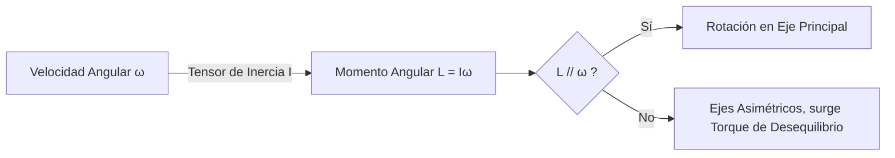

# Dinámica Rotacional

Para entender el movimiento completo de los objetos reales (no solo de partículas puntuales ideales), debemos incorporar la rotación. Para casi cada concepto de la mecánica traslacional (masa, velocidad, fuerza) existe una contraparte análoga en el mundo rotacional.

## 📜 Contexto Histórico
El estudio de los sólidos rígidos, y en particular la introducción de los momentos de inercia y los ejes principales, se debe abrumadoramente a **Leonhard Euler** en el siglo XVIII. Sus *Ecuaciones de Euler* describen la rotación de cuerpos tridimensionales sin necesidad de reducirlos a puntos individuales, revolucionando campos como la ingeniería mecánica, la giroscopía y la astronomía.

---

## 🧮 Desarrollo Teórico Profundo

La dinámica rotacional de sólidos rígidos constituye uno de los dominios más matemáticamente ricos de la mecánica clásica, superando las meras analogías con el movimiento traslacional para introducir matrices tensoriales de orden 2 y dinámicas no lineales que pueden ser sorprendentemente contraintuitivas (como la precesión y nutación).

### 1. Formalismo Vectorial del Movimiento Angular

Un cuerpo rígido queda definido geométricamente como un sistema discreto o continuo de partículas para el cual la distancia relativa $|\vec{r}_i - \vec{r}_j|$ entre cualquier par de puntos $i, j$ es estrictamente constante bajo el transcurso del tiempo.
El Teorema de Chasles establece que el movimiento general de un cuerpo rígido puede descomponerse unívocamente en una traslación de un punto de referencia (comúnmente el centro de masa $\vec{r}_{cm}$) sumada a una rotación pura sobre un eje que pasa por ese punto.

Dado el vector de velocidad angular instantánea $\vec{\omega}(t)$, el campo de velocidades para cualquier punto $\vec{r}_i$ del sólido con respecto al centro de rotación es:
$$ \vec{v}_i = \vec{\omega} \times \vec{r}_i $$

La derivada temporal de este vector provee la aceleración, donde el uso del operador $\left(\frac{d}{dt}\right)_{inercial} = \left(\frac{d}{dt}\right)_{rot} + \vec{\omega} \times$ produce de inmediato:
$$ \vec{a}_i = \dot{\vec{\omega}} \times \vec{r}_i + \vec{\omega} \times (\vec{\omega} \times \vec{r}_i) = \vec{\alpha} \times \vec{r}_i + \vec{\omega} \times \vec{v}_i $$
Aquí, $\vec{\alpha}$ es la aceleración angular, el primer término es la componente tangencial y el segundo término representa la aceleración normal (centrípeta) hacia el eje instantáneo de rotación.

### 2. El Tensor de Momento de Inercia y Matrices Ortogonales

Mientras que la masa inercial es un escalar isotrópico para sistemas traslacionales, el "equivalente" rotacional presenta asimetrías extremas dependientes de la dirección.
Para el momento angular total $\vec{L} = \sum (\vec{r}_i \times m_i \vec{v}_i)$, sustituyendo $\vec{v}_i = \vec{\omega} \times \vec{r}_i$ y aplicando la identidad del doble producto cruz $\vec{A} \times (\vec{B} \times \vec{C}) = \vec{B}(\vec{A}\cdot\vec{C}) - \vec{C}(\vec{A}\cdot\vec{B})$:
$$ \vec{L} = \sum m_i \left[ r_i^2 \vec{\omega} - \vec{r}_i (\vec{r}_i \cdot \vec{\omega}) \right] $$
Esta transformación lineal desde $\vec{\omega}$ hasta $\vec{L}$ define el Tensor de Inercia $\mathbf{I}$, tal que $\vec{L} = \mathbf{I} \vec{\omega}$. En notación matricial sobre una base Cartesiana:
$$
\mathbf{I} = \begin{pmatrix} 
I_{xx} & I_{xy} & I_{xz} \\
I_{yx} & I_{yy} & I_{yz} \\
I_{zx} & I_{zy} & I_{zz}
\end{pmatrix}
= \int \rho(\vec{r}) \begin{pmatrix} y^2+z^2 & -xy & -xz \\ -yx & x^2+z^2 & -yz \\ -zx & -zy & x^2+y^2 \end{pmatrix} dV
$$
Los términos de la diagonal son los **momentos de inercia**, mientras que los elementos extra-diagonales son los **productos de inercia**. 
Debido a que $\mathbf{I}$ es una matriz real, simétrica, el teorema espectral del álgebra lineal garantiza la existencia de un conjunto de ejes ortonormales que diagonalizan el tensor. Estos son los **Ejes Principales de Inercia**.



### 3. Las Ecuaciones Dinámicas de Euler

Al analizar el momento angular en el marco fijo al cuerpo (un marco rotatorio no inercial), la conservación de Newton para torque neto $\vec{\tau}_{neto} = \left(\frac{d\vec{L}}{dt}\right)_{inercial}$ se transforma a:
$$ \vec{\tau}_{neto} = \left(\frac{d\vec{L}}{dt}\right)_{cuerpo} + \vec{\omega} \times \vec{L} $$
Alineando el sistema de coordenadas con los ejes principales del cuerpo, $\mathbf{I}$ se vuelve diagonal ($I_1, I_2, I_3$), y $\vec{L} = (I_1\omega_1, I_2\omega_2, I_3\omega_3)^T$. La sustitución directa arroja el sistema desacoplado de las **Ecuaciones de Euler para el Sólido Rígido**:
$$ \tau_1 = I_1 \dot{\omega}_1 + (I_3 - I_2)\omega_2 \omega_3 $$
$$ \tau_2 = I_2 \dot{\omega}_2 + (I_1 - I_3)\omega_3 \omega_1 $$
$$ \tau_3 = I_3 \dot{\omega}_3 + (I_2 - I_1)\omega_1 \omega_2 $$
Estas EDOs altamente no lineales son fundamentales en la girodinámica y explican por qué objetos girando en su eje de inercia intermedio son inestables (Teorema de la Raqueta de Tenis o Efecto Dzhanibekov).

### 4. Teorema de Steiner (Ejes Paralelos) y Energía

Si se conoce el momento de inercia respecto a un eje que pasa por el Centro de Masa ($I_{cm}$), el momento de inercia respecto a cualquier eje paralelo situado a una distancia perpendicular $d$ se determina escalarmente como:
$$ I_{nuevo} = I_{cm} + M d^2 $$
Esto aplica igualmente al tensor métrico entero usando matrices de desplazamiento.

La **Energía Cinética Total** del sólido rígido se desacopla elegantemente mediante los teoremas de König en una fracción puramente traslacional y otra rotacional referida al centro de masa:
$$ K = \frac{1}{2} M \vec{v}_{cm}^2 + \frac{1}{2} \vec{\omega}^T \mathbf{I}_{cm} \vec{\omega} $$
Para rotación simple alrededor de un eje principal: $K = \frac{1}{2}mv^2 + \frac{1}{2}I\omega^2$.

---

## 🛠 Ejemplo Práctico: Descenso por un plano inclinado
Imagina que soltamos simultáneamente un aro hueco ($I = MR^2$), un cilindro macizo ($I = \frac{1}{2}MR^2$) y una esfera sólida ($I = \frac{2}{5}MR^2$) por una rampa. Todos tienen masa $M$ y radio $R$. Ruedan sin resbalar. ¿Cuál llega primero al final de la rampa (altura $h$)?

**Solución por Energía**:
1. Conservación de energía para todos. $U_i = Mgh$, $K_i = 0$.
2. Al pie de la rampa, la energía cinética es traslacional más rotacional:
   $$ E_f = \frac{1}{2} M v^2 + \frac{1}{2} I \omega^2 = Mgh $$
3. Como ruedan sin deslizar, $v = \omega R \implies \omega = v/R$.
4. Sustituyendo $I = c MR^2$ (donde $c=1$ aro, $c=1/2$ cilindro, $c=2/5$ esfera):
   $$ \frac{1}{2} M v^2 + \frac{1}{2} (c MR^2) \left(\frac{v^2}{R^2}\right) = Mgh $$
   $$ \frac{1}{2} v^2 (1 + c) = gh \implies \mathbf{v = \sqrt{\frac{2gh}{1 + c}}} $$
5. Como $v$ es mayor para el coeficiente $c$ más pequeño, el objeto con la masa más concentrada en el centro ganará. 
   **Ganador**: La esfera ($c=0.4$). **Perdedor**: El aro ($c=1$).

---

## 📝 Guía de Ejercicios Resueltos

**Problema 1: Ecuaciones de Euler y precesión libre**
Un satélite asimétrico tiene momentos principales de inercia $I_1 < I_2 < I_3$. Gira en el espacio profundo libre de torques con una velocidad angular inicial orientada muy cerca del eje principal asociado a $I_2$, tal que $\vec{\omega} = (\epsilon_1, \omega_2, \epsilon_3)$ donde $\epsilon_1, \epsilon_3 \ll \omega_2$. Demuestre analíticamente que la rotación alrededor de este eje intermedio es inestable y las perturbaciones crecerán exponencialmente.
**Solución paso a paso:**
1. Las Ecuaciones de Euler libres de torque ($\tau = 0$) son:
   $I_1 \dot{\omega}_1 + (I_3 - I_2)\omega_2 \omega_3 = 0$
   $I_2 \dot{\omega}_2 + (I_1 - I_3)\omega_3 \omega_1 = 0$
   $I_3 \dot{\omega}_3 + (I_2 - I_1)\omega_1 \omega_2 = 0$
2. Dado que $\omega_1 = \epsilon_1$ y $\omega_3 = \epsilon_3$ son pequeñas, el término $\omega_1 \omega_3$ es de segundo orden y despreciable. La segunda ecuación se reduce a $I_2 \dot{\omega}_2 \approx 0 \implies \omega_2 \approx \text{constante}$.
3. Sustituyendo en la primera y tercera ecuación:
   $\dot{\omega}_1 = -\frac{I_3 - I_2}{I_1} \omega_2 \omega_3$
   $\dot{\omega}_3 = -\frac{I_2 - I_1}{I_3} \omega_2 \omega_1$
4. Derivamos la primera ecuación con respecto al tiempo:
   $\ddot{\omega}_1 = -\frac{I_3 - I_2}{I_1} \omega_2 \dot{\omega}_3$
5. Sustituimos $\dot{\omega}_3$ de la otra ecuación:
   $\ddot{\omega}_1 = -\frac{I_3 - I_2}{I_1} \omega_2 \left( -\frac{I_2 - I_1}{I_3} \omega_2 \omega_1 \right) = \frac{(I_3 - I_2)(I_2 - I_1)}{I_1 I_3} \omega_2^2 \omega_1$
6. Dado que $I_1 < I_2 < I_3$, tenemos $(I_3 - I_2) > 0$ y $(I_2 - I_1) > 0$.
7. Definimos una constante positiva $k^2 = \frac{(I_3 - I_2)(I_2 - I_1)}{I_1 I_3} \omega_2^2 > 0$.
8. La EDO resultante es $\ddot{\omega}_1 = k^2 \omega_1$. Su solución es $\omega_1(t) = A e^{kt} + B e^{-kt}$.
9. El término $e^{kt}$ crece exponencialmente en el tiempo. Cualquier mínima perturbación inicial $\epsilon_1$ se magnifica sin límite (hasta que la aproximación lineal falla), probando la **inestabilidad** del eje intermedio (Teorema de la Raqueta de Tenis).

**Problema 2: Tensor de Inercia de un cono sólido**
Determine el momento de inercia $I_z$ de un cono circular recto sólido de masa $M$, altura $h$ y radio base $R$, rotando sobre su eje de simetría (el eje $z$).
**Solución paso a paso:**
1. Asumimos densidad uniforme $\rho = \frac{M}{V} = \frac{M}{\frac{1}{3}\pi R^2 h}$.
2. Alineamos el vértice del cono en el origen, abriéndose a lo largo del eje $z$ positivo. La ecuación de la superficie cónica lateral es $\frac{r}{z} = \frac{R}{h} \implies r = \frac{R}{h}z$.
3. Integramos dividiendo el cono en discos infinitesimales apilados a lo largo de $z$. Cada disco de grosor $dz$ tiene una masa $dm = \rho dV = \rho (\pi r^2) dz$.
4. El momento de inercia de un disco respecto a su eje central es $dI_z = \frac{1}{2} r^2 dm$.
5. Sustituyendo $dm$: $dI_z = \frac{1}{2} r^2 (\rho \pi r^2 dz) = \frac{\pi \rho}{2} r^4 dz$.
6. Sustituyendo la dependencia del radio con $z$: $r = \frac{R}{h}z \implies r^4 = \left(\frac{R}{h}\right)^4 z^4$.
7. $dI_z = \frac{\pi \rho}{2} \left(\frac{R}{h}\right)^4 z^4 dz$.
8. Integramos desde $z=0$ hasta $z=h$:
   $I_z = \int_0^h \frac{\pi \rho}{2} \left(\frac{R}{h}\right)^4 z^4 dz = \frac{\pi \rho}{2} \left(\frac{R}{h}\right)^4 \left[ \frac{z^5}{5} \right]_0^h = \frac{\pi \rho}{2} \frac{R^4}{h^4} \frac{h^5}{5} = \frac{\pi \rho R^4 h}{10}$.
9. Sustituyendo $\rho$:
   $I_z = \frac{\pi}{10} \left( \frac{M}{\frac{1}{3}\pi R^2 h} \right) R^4 h = \frac{3}{10} M R^2$.

**Problema 3: Bola de billar y rotación inicial**
Se golpea horizontalmente el centro exacto de una bola de billar sólida de radio $R$ y masa $M$ en reposo. Comienza a deslizarse sin rotar a velocidad $v_0$ sobre una mesa con coeficiente de fricción cinético $\mu_k$. Calcule a qué tiempo $t$ la bola comienza a rodar sin resbalar de forma pura.
**Solución paso a paso:**
1. Inicialmente: $v = v_0$ y $\omega = 0$. Condición final buscada para rodar sin resbalar: $v_f = \omega_f R$.
2. La fricción cinética $\vec{f}_k$ actúa en contra del deslizamiento. Su magnitud es $f_k = \mu_k N = \mu_k Mg$.
3. Ecuación traslacional: $\sum F = -f_k = Ma \implies -\mu_k Mg = Ma \implies a = -\mu_k g$.
4. Ecuación rotacional (tomando el centro de masa): El torque lo aplica la fricción. $\tau = f_k R = I \alpha$.
5. Sabiendo que $I = \frac{2}{5}MR^2$ para una esfera sólida:
   $\mu_k Mg R = \left(\frac{2}{5}MR^2\right)\alpha \implies \alpha = \frac{5\mu_k g}{2R}$.
6. Cinemática del centro de masa: $v(t) = v_0 + at = v_0 - \mu_k g t$.
7. Cinemática angular: $\omega(t) = \omega_0 + \alpha t = 0 + \frac{5\mu_k g}{2R} t$.
8. Imponga la condición $v(t) = \omega(t) R$:
   $v_0 - \mu_k g t = \left( \frac{5\mu_k g}{2R} t \right) R = \frac{5}{2}\mu_k g t$.
9. Agrupando términos: $v_0 = \mu_k g t + \frac{5}{2}\mu_k g t = \frac{7}{2}\mu_k g t$.
10. El tiempo de transición es $t = \frac{2v_0}{7\mu_k g}$.

## 💻 Simulaciones Computacionales

El Efecto Dzhanibekov o Teorema de la Raqueta de Tenis demuestra la inestabilidad de la rotación sobre el eje principal intermedio. Aquí se simulan las ecuaciones de Euler para el sólido rígido libre de torques.

```python
import numpy as np
import matplotlib.pyplot as plt
from scipy.integrate import solve_ivp

# Momentos principales de inercia (I1 < I2 < I3)
I1, I2, I3 = 1.0, 2.0, 3.0

def euler_equations(t, omega):
    w1, w2, w3 = omega
    dw1 = (I2 - I3) / I1 * w2 * w3
    dw2 = (I3 - I1) / I2 * w3 * w1
    dw3 = (I1 - I2) / I3 * w1 * w2
    return [dw1, dw2, dw3]

# Rotación dominada por el eje intermedio (w2) con pequeña perturbación
omega0 = [0.1, 5.0, 0.1] 
t_span = (0, 20)
t_eval = np.linspace(*t_span, 1000)

sol = solve_ivp(euler_equations, t_span, omega0, t_eval=t_eval)

plt.figure(figsize=(10, 5))
plt.plot(sol.t, sol.y[0], label='$\omega_1$ (Eje Menor)')
plt.plot(sol.t, sol.y[1], label='$\omega_2$ (Eje Intermedio)')
plt.plot(sol.t, sol.y[2], label='$\omega_3$ (Eje Mayor)')
plt.title('Inestabilidad del Eje Intermedio (Efecto Dzhanibekov)')
plt.xlabel('Tiempo')
plt.ylabel('Velocidad Angular')
plt.legend()
plt.grid(True)
plt.show()
```

## 📚 Recursos Específicos de Dinámica Rotacional

### 🎓 Cursos y Clases Recomendadas (5-7)
1. **[MIT 8.01 - Torque and Angular Momentum (Walter Lewin)](https://ocw.mit.edu/courses/8-01sc-classical-mechanics-fall-2016/pages/week-9-rotational-dynamics/)**: Uno de los bloques más famosos de Lewin, con demostraciones legendarias de giroscopios y patinadores.
2. **[Yale PHYS 200 - Lecture 9: Rotations](https://oyc.yale.edu/physics/phys-200/lecture-9)**: Descripción matricial y vectorial rigurosa de las transformaciones rotacionales.
3. **[Khan Academy - Torque y Momento Angular](https://es.khanacademy.org/science/physics/torque-angular-momentum)**: Explicaciones muy amigables sobre rotaciones, momentos de inercia y equilibrio estático.
4. **[Coursera - Advanced Engineering Mechanics (Various)](https://www.coursera.org/learn/advanced-engineering-systems-in-motion-dynamics-of-three-dimensional-3d-motion)**: Ideal para ver aplicaciones de las ecuaciones de Euler a la ingeniería aeroespacial o robótica.
5. **[edX - Rotational Dynamics (MITx)](https://www.edx.org/course/mechanics-rotational-dynamics)**: Problemas interactivos centrados en la conservación del momento angular y choques rotacionales.

### 📝 Artículos, Simulaciones e Interactivos (8-10)
1. **Artículo**: [Conservation of Angular Momentum (HyperPhysics)](http://hyperphysics.phy-astr.gsu.edu/hbase/amom.html) - Desglose de fórmulas sobre precesión y momentos.
2. **Artículo**: [Euler's equations for rigid body dynamics](https://en.wikipedia.org/wiki/Euler%27s_equations_(rigid_body_dynamics)) - Para un enfoque tensorial más avanzado de las rotaciones 3D.
3. **Simulador**: [PhET - Ladybug Revolution](https://phet.colorado.edu/es/simulations/rotation) - Explora posición, velocidad y aceleración angular con una mariquita en un plato giratorio.
4. **Simulador**: [PhET - Balancing Act](https://phet.colorado.edu/es/simulations/balancing-act) - Aprende el principio de las palancas y la igualación de torques.
5. **Video Experimental**: [Veritasium - Bullet Block Experiment](https://www.youtube.com/watch?v=vVQzgrKExF4) - Experimento espectacular que involucra momento angular e inercia en una colisión.
6. **Artículo**: [Tensor de Inercia (Scholarpedia)](http://www.scholarpedia.org/article/Moment_of_inertia) - Definición profunda de los ejes principales de rotación para objetos asimétricos.
7. **Video Analítico**: [SmarterEveryDay - Gyroscopic Precession](https://www.youtube.com/watch?v=cquvA_IpEsA) - Explicación clara y visual del contra-intuitivo fenómeno de la precesión de los giroscopios.
8. **Simulador**: [GeoGebra - Momento de Inercia](https://www.geogebra.org/m/XfN6sZRb) - Herramienta para integrar virtualmente el momento de inercia de perfiles 2D de masa constante.

### 📖 Referencias Útiles y Bibliografía
- **[Classical Mechanics (Herbert Goldstein)](https://en.wikipedia.org/wiki/Classical_Mechanics_(Goldstein_book))**: Famoso por su detalladísimo estudio matemático sobre la cinemática de los cuerpos rígidos, los ángulos de Euler y el tensor de inercia.
- **[Classical Dynamics of Particles and Systems (Marion & Thornton)](https://www.cengage.com/c/classical-dynamics-of-particles-and-systems-5e-thornton/9780534408961/)**: Aporta un equilibrio perfecto, tratando el cuerpo rígido usando la formulación newtoniana clásica y matrices.
- **[Classical Mechanics (John R. Taylor)](https://uscibooks.aip.org/books/classical-mechanics/)**: Incluye un capítulo soberbio sobre dinámica de cuerpos rígidos, rotaciones 3D de la Tierra (efecto Coriolis y péndulo de Foucault).
- **[Introduction to Classical Mechanics (David Morin)](https://www.cambridge.org/highereducation/books/introduction-to-classical-mechanics/31CB8B93623D3F14E1EE98B223D1DE47)**: Tiene una colección brutal de problemas avanzados y contra-intuitivos de trompos, aros y cilindros rodantes.
- **[Feynman Lectures on Physics (Vol 1)](https://www.feynmanlectures.caltech.edu/I_toc.html)**: Feynman ilumina los conceptos de rotación, con especial énfasis en la analogía matemática profunda con la traslación.
