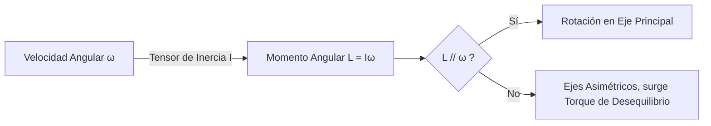

# Dinámica Rotacional

Para entender el movimiento completo de los objetos reales (no solo de partículas puntuales ideales), debemos incorporar la rotación. Para casi cada concepto de la mecánica traslacional (masa, velocidad, fuerza) existe una contraparte análoga en el mundo rotacional.

## 📜 Contexto Histórico
El estudio de los sólidos rígidos, y en particular la introducción de los momentos de inercia y los ejes principales, se debe abrumadoramente a **Leonhard Euler** en el siglo XVIII. Sus *Ecuaciones de Euler* describen la rotación de cuerpos tridimensionales sin necesidad de reducirlos a puntos individuales, revolucionando campos como la ingeniería mecánica, la giroscopía y la astronomía.

---

## 🧮 Desarrollo Teórico Profundo

La dinámica rotacional de sólidos rígidos constituye uno de los dominios más matemáticamente ricos de la mecánica clásica, superando las meras analogías con el movimiento traslacional para introducir matrices tensoriales de orden 2 y dinámicas no lineales que pueden ser sorprendentemente contraintuitivas (como la precesión y nutación).

### 1. Formalismo Vectorial del Movimiento Angular

Un cuerpo rígido queda definido geométricamente como un sistema discreto o continuo de partículas para el cual la distancia relativa $|\vec{r}_i - \vec{r}_j|$ entre cualquier par de puntos $i, j$ es estrictamente constante bajo el transcurso del tiempo.
El Teorema de Chasles establece que el movimiento general de un cuerpo rígido puede descomponerse unívocamente en una traslación de un punto de referencia (comúnmente el centro de masa $\vec{r}_{cm}$) sumada a una rotación pura sobre un eje que pasa por ese punto.

Dado el vector de velocidad angular instantánea $\vec{\omega}(t)$, el campo de velocidades para cualquier punto $\vec{r}_i$ del sólido con respecto al centro de rotación es:
$$ \vec{v}_i = \vec{\omega} \times \vec{r}_i $$

La derivada temporal de este vector provee la aceleración, donde el uso del operador $\left(\frac{d}{dt}\right)_{inercial} = \left(\frac{d}{dt}\right)_{rot} + \vec{\omega} \times$ produce de inmediato:
$$ \vec{a}_i = \dot{\vec{\omega}} \times \vec{r}_i + \vec{\omega} \times (\vec{\omega} \times \vec{r}_i) = \vec{\alpha} \times \vec{r}_i + \vec{\omega} \times \vec{v}_i $$
Aquí, $\vec{\alpha}$ es la aceleración angular, el primer término es la componente tangencial y el segundo término representa la aceleración normal (centrípeta) hacia el eje instantáneo de rotación.

### 2. El Tensor de Momento de Inercia y Matrices Ortogonales

Mientras que la masa inercial es un escalar isotrópico para sistemas traslacionales, el "equivalente" rotacional presenta asimetrías extremas dependientes de la dirección.
Para el momento angular total $\vec{L} = \sum (\vec{r}_i \times m_i \vec{v}_i)$, sustituyendo $\vec{v}_i = \vec{\omega} \times \vec{r}_i$ y aplicando la identidad del doble producto cruz $\vec{A} \times (\vec{B} \times \vec{C}) = \vec{B}(\vec{A}\cdot\vec{C}) - \vec{C}(\vec{A}\cdot\vec{B})$:
$$ \vec{L} = \sum m_i \left[ r_i^2 \vec{\omega} - \vec{r}_i (\vec{r}_i \cdot \vec{\omega}) \right] $$
Esta transformación lineal desde $\vec{\omega}$ hasta $\vec{L}$ define el Tensor de Inercia $\mathbf{I}$, tal que $\vec{L} = \mathbf{I} \vec{\omega}$. En notación matricial sobre una base Cartesiana:
$$
\mathbf{I} = \begin{pmatrix} 
I_{xx} & I_{xy} & I_{xz} \\
I_{yx} & I_{yy} & I_{yz} \\
I_{zx} & I_{zy} & I_{zz}
\end{pmatrix}
= \int \rho(\vec{r}) \begin{pmatrix} y^2+z^2 & -xy & -xz \\ -yx & x^2+z^2 & -yz \\ -zx & -zy & x^2+y^2 \end{pmatrix} dV
$$
Los términos de la diagonal son los **momentos de inercia**, mientras que los elementos extra-diagonales son los **productos de inercia**. 
Debido a que $\mathbf{I}$ es una matriz real, simétrica, el teorema espectral del álgebra lineal garantiza la existencia de un conjunto de ejes ortonormales que diagonalizan el tensor. Estos son los **Ejes Principales de Inercia**.



### 3. Las Ecuaciones Dinámicas de Euler

Al analizar el momento angular en el marco fijo al cuerpo (un marco rotatorio no inercial), la conservación de Newton para torque neto $\vec{\tau}_{neto} = \left(\frac{d\vec{L}}{dt}\right)_{inercial}$ se transforma a:
$$ \vec{\tau}_{neto} = \left(\frac{d\vec{L}}{dt}\right)_{cuerpo} + \vec{\omega} \times \vec{L} $$
Alineando el sistema de coordenadas con los ejes principales del cuerpo, $\mathbf{I}$ se vuelve diagonal ($I_1, I_2, I_3$), y $\vec{L} = (I_1\omega_1, I_2\omega_2, I_3\omega_3)^T$. La sustitución directa arroja el sistema desacoplado de las **Ecuaciones de Euler para el Sólido Rígido**:
$$ \tau_1 = I_1 \dot{\omega}_1 + (I_3 - I_2)\omega_2 \omega_3 $$
$$ \tau_2 = I_2 \dot{\omega}_2 + (I_1 - I_3)\omega_3 \omega_1 $$
$$ \tau_3 = I_3 \dot{\omega}_3 + (I_2 - I_1)\omega_1 \omega_2 $$
Estas EDOs altamente no lineales son fundamentales en la girodinámica y explican por qué objetos girando en su eje de inercia intermedio son inestables (Teorema de la Raqueta de Tenis o Efecto Dzhanibekov).

### 4. Teorema de Steiner (Ejes Paralelos) y Energía

Si se conoce el momento de inercia respecto a un eje que pasa por el Centro de Masa ($I_{cm}$), el momento de inercia respecto a cualquier eje paralelo situado a una distancia perpendicular $d$ se determina escalarmente como:
$$ I_{nuevo} = I_{cm} + M d^2 $$
Esto aplica igualmente al tensor métrico entero usando matrices de desplazamiento.

La **Energía Cinética Total** del sólido rígido se desacopla elegantemente mediante los teoremas de König en una fracción puramente traslacional y otra rotacional referida al centro de masa:
$$ K = \frac{1}{2} M \vec{v}_{cm}^2 + \frac{1}{2} \vec{\omega}^T \mathbf{I}_{cm} \vec{\omega} $$
Para rotación simple alrededor de un eje principal: $K = \frac{1}{2}mv^2 + \frac{1}{2}I\omega^2$.

---

## 🛠 Ejemplo Práctico: Descenso por un plano inclinado
Imagina que soltamos simultáneamente un aro hueco ($I = MR^2$), un cilindro macizo ($I = \frac{1}{2}MR^2$) y una esfera sólida ($I = \frac{2}{5}MR^2$) por una rampa. Todos tienen masa $M$ y radio $R$. Ruedan sin resbalar. ¿Cuál llega primero al final de la rampa (altura $h$)?

**Solución por Energía**:
1. Conservación de energía para todos. $U_i = Mgh$, $K_i = 0$.
2. Al pie de la rampa, la energía cinética es traslacional más rotacional:
   $$ E_f = \frac{1}{2} M v^2 + \frac{1}{2} I \omega^2 = Mgh $$
3. Como ruedan sin deslizar, $v = \omega R \implies \omega = v/R$.
4. Sustituyendo $I = c MR^2$ (donde $c=1$ aro, $c=1/2$ cilindro, $c=2/5$ esfera):
   $$ \frac{1}{2} M v^2 + \frac{1}{2} (c MR^2) \left(\frac{v^2}{R^2}\right) = Mgh $$
   $$ \frac{1}{2} v^2 (1 + c) = gh \implies \mathbf{v = \sqrt{\frac{2gh}{1 + c}}} $$
5. Como $v$ es mayor para el coeficiente $c$ más pequeño, el objeto con la masa más concentrada en el centro ganará. 
   **Ganador**: La esfera ($c=0.4$). **Perdedor**: El aro ($c=1$).

---

## 📝 Guía de Ejercicios Resueltos

**Problema 1: Ecuaciones de Euler y precesión libre**
Un satélite asimétrico tiene momentos principales de inercia $I_1 < I_2 < I_3$. Gira en el espacio profundo libre de torques con una velocidad angular inicial orientada muy cerca del eje principal asociado a $I_2$, tal que $\vec{\omega} = (\epsilon_1, \omega_2, \epsilon_3)$ donde $\epsilon_1, \epsilon_3 \ll \omega_2$. Demuestre analíticamente que la rotación alrededor de este eje intermedio es inestable y las perturbaciones crecerán exponencialmente.
**Solución paso a paso:**
1. Las Ecuaciones de Euler libres de torque ($\tau = 0$) son:
   $I_1 \dot{\omega}_1 + (I_3 - I_2)\omega_2 \omega_3 = 0$
   $I_2 \dot{\omega}_2 + (I_1 - I_3)\omega_3 \omega_1 = 0$
   $I_3 \dot{\omega}_3 + (I_2 - I_1)\omega_1 \omega_2 = 0$
2. Dado que $\omega_1 = \epsilon_1$ y $\omega_3 = \epsilon_3$ son pequeñas, el término $\omega_1 \omega_3$ es de segundo orden y despreciable. La segunda ecuación se reduce a $I_2 \dot{\omega}_2 \approx 0 \implies \omega_2 \approx \text{constante}$.
3. Sustituyendo en la primera y tercera ecuación:
   $\dot{\omega}_1 = -\frac{I_3 - I_2}{I_1} \omega_2 \omega_3$
   $\dot{\omega}_3 = -\frac{I_2 - I_1}{I_3} \omega_2 \omega_1$
4. Derivamos la primera ecuación con respecto al tiempo:
   $\ddot{\omega}_1 = -\frac{I_3 - I_2}{I_1} \omega_2 \dot{\omega}_3$
5. Sustituimos $\dot{\omega}_3$ de la otra ecuación:
   $\ddot{\omega}_1 = -\frac{I_3 - I_2}{I_1} \omega_2 \left( -\frac{I_2 - I_1}{I_3} \omega_2 \omega_1 \right) = \frac{(I_3 - I_2)(I_2 - I_1)}{I_1 I_3} \omega_2^2 \omega_1$
6. Dado que $I_1 < I_2 < I_3$, tenemos $(I_3 - I_2) > 0$ y $(I_2 - I_1) > 0$.
7. Definimos una constante positiva $k^2 = \frac{(I_3 - I_2)(I_2 - I_1)}{I_1 I_3} \omega_2^2 > 0$.
8. La EDO resultante es $\ddot{\omega}_1 = k^2 \omega_1$. Su solución es $\omega_1(t) = A e^{kt} + B e^{-kt}$.
9. El término $e^{kt}$ crece exponencialmente en el tiempo. Cualquier mínima perturbación inicial $\epsilon_1$ se magnifica sin límite (hasta que la aproximación lineal falla), probando la **inestabilidad** del eje intermedio (Teorema de la Raqueta de Tenis).

**Problema 2: Tensor de Inercia de un cono sólido**
Determine el momento de inercia $I_z$ de un cono circular recto sólido de masa $M$, altura $h$ y radio base $R$, rotando sobre su eje de simetría (el eje $z$).
**Solución paso a paso:**
1. Asumimos densidad uniforme $\rho = \frac{M}{V} = \frac{M}{\frac{1}{3}\pi R^2 h}$.
2. Alineamos el vértice del cono en el origen, abriéndose a lo largo del eje $z$ positivo. La ecuación de la superficie cónica lateral es $\frac{r}{z} = \frac{R}{h} \implies r = \frac{R}{h}z$.
3. Integramos dividiendo el cono en discos infinitesimales apilados a lo largo de $z$. Cada disco de grosor $dz$ tiene una masa $dm = \rho dV = \rho (\pi r^2) dz$.
4. El momento de inercia de un disco respecto a su eje central es $dI_z = \frac{1}{2} r^2 dm$.
5. Sustituyendo $dm$: $dI_z = \frac{1}{2} r^2 (\rho \pi r^2 dz) = \frac{\pi \rho}{2} r^4 dz$.
6. Sustituyendo la dependencia del radio con $z$: $r = \frac{R}{h}z \implies r^4 = \left(\frac{R}{h}\right)^4 z^4$.
7. $dI_z = \frac{\pi \rho}{2} \left(\frac{R}{h}\right)^4 z^4 dz$.
8. Integramos desde $z=0$ hasta $z=h$:
   $I_z = \int_0^h \frac{\pi \rho}{2} \left(\frac{R}{h}\right)^4 z^4 dz = \frac{\pi \rho}{2} \left(\frac{R}{h}\right)^4 \left[ \frac{z^5}{5} \right]_0^h = \frac{\pi \rho}{2} \frac{R^4}{h^4} \frac{h^5}{5} = \frac{\pi \rho R^4 h}{10}$.
9. Sustituyendo $\rho$:
   $I_z = \frac{\pi}{10} \left( \frac{M}{\frac{1}{3}\pi R^2 h} \right) R^4 h = \frac{3}{10} M R^2$.

**Problema 3: Bola de billar y rotación inicial**
Se golpea horizontalmente el centro exacto de una bola de billar sólida de radio $R$ y masa $M$ en reposo. Comienza a deslizarse sin rotar a velocidad $v_0$ sobre una mesa con coeficiente de fricción cinético $\mu_k$. Calcule a qué tiempo $t$ la bola comienza a rodar sin resbalar de forma pura.
**Solución paso a paso:**
1. Inicialmente: $v = v_0$ y $\omega = 0$. Condición final buscada para rodar sin resbalar: $v_f = \omega_f R$.
2. La fricción cinética $\vec{f}_k$ actúa en contra del deslizamiento. Su magnitud es $f_k = \mu_k N = \mu_k Mg$.
3. Ecuación traslacional: $\sum F = -f_k = Ma \implies -\mu_k Mg = Ma \implies a = -\mu_k g$.
4. Ecuación rotacional (tomando el centro de masa): El torque lo aplica la fricción. $\tau = f_k R = I \alpha$.
5. Sabiendo que $I = \frac{2}{5}MR^2$ para una esfera sólida:
   $\mu_k Mg R = \left(\frac{2}{5}MR^2\right)\alpha \implies \alpha = \frac{5\mu_k g}{2R}$.
6. Cinemática del centro de masa: $v(t) = v_0 + at = v_0 - \mu_k g t$.
7. Cinemática angular: $\omega(t) = \omega_0 + \alpha t = 0 + \frac{5\mu_k g}{2R} t$.
8. Imponga la condición $v(t) = \omega(t) R$:
   $v_0 - \mu_k g t = \left( \frac{5\mu_k g}{2R} t \right) R = \frac{5}{2}\mu_k g t$.
9. Agrupando términos: $v_0 = \mu_k g t + \frac{5}{2}\mu_k g t = \frac{7}{2}\mu_k g t$.
10. El tiempo de transición es $t = \frac{2v_0}{7\mu_k g}$.

## 💻 Simulaciones Computacionales

El Efecto Dzhanibekov o Teorema de la Raqueta de Tenis demuestra la inestabilidad de la rotación sobre el eje principal intermedio. Aquí se simulan las ecuaciones de Euler para el sólido rígido libre de torques.

```python
import numpy as np
import matplotlib.pyplot as plt
from scipy.integrate import solve_ivp

# Momentos principales de inercia (I1 < I2 < I3)
I1, I2, I3 = 1.0, 2.0, 3.0

def euler_equations(t, omega):
    w1, w2, w3 = omega
    dw1 = (I2 - I3) / I1 * w2 * w3
    dw2 = (I3 - I1) / I2 * w3 * w1
    dw3 = (I1 - I2) / I3 * w1 * w2
    return [dw1, dw2, dw3]

# Rotación dominada por el eje intermedio (w2) con pequeña perturbación
omega0 = [0.1, 5.0, 0.1] 
t_span = (0, 20)
t_eval = np.linspace(*t_span, 1000)

sol = solve_ivp(euler_equations, t_span, omega0, t_eval=t_eval)

plt.figure(figsize=(10, 5))
plt.plot(sol.t, sol.y[0], label='$\omega_1$ (Eje Menor)')
plt.plot(sol.t, sol.y[1], label='$\omega_2$ (Eje Intermedio)')
plt.plot(sol.t, sol.y[2], label='$\omega_3$ (Eje Mayor)')
plt.title('Inestabilidad del Eje Intermedio (Efecto Dzhanibekov)')
plt.xlabel('Tiempo')
plt.ylabel('Velocidad Angular')
plt.legend()
plt.grid(True)
plt.show()
```

## 🚀 Fronteras de Investigación y Problemas Abiertos

En 2026, la dinámica rotacional clásica de cuerpos macroscópicos se une de forma sinérgica a la ingeniería astronáutica con el reto del **control hiperágil de satélites flexibles** y la atenuación activa de las libraciones en velas solares. Además, se indaga intensamente en las inestabilidades no lineales complejas del acoplamiento espín-órbita de sistemas exoplanetarios y agujeros negros en colisión, donde la rotación induce efectos clásicos equivalentes al arrastre de marco de Lense-Thirring.

## 📐 Formalismo Matemático Avanzado (Nivel Posgrado/Doctorado)

La dinámica rotacional de cuerpos rígidos encuentra su descripción matemática más elegante a través de la teoría de **Grupos de Lie**, y el formalismo geométrico de la reducción de sistemas de control hamiltonianos.

Considerando que el espacio de configuración es el Grupo Ortogonal Especial $SO(3)$, el momento angular $\Pi$ puede verse como un elemento en el espacio dual del álgebra de Lie $\mathfrak{so}(3)^*$. La evolución dinámica temporal de este vector sin torques externos obedece a las Ecuaciones de Euler, que no son más que un sistema Hamiltoniano reducido sobre la variedad de las órbitas coadjuntas acopladas por la estructura de corchetes de Lie-Poisson. 

La Ecuación de Euler intrínseca es:

$$ \dot{\Pi} = \Pi \times \Omega = \text{ad}^*_\Omega \Pi $$

donde $\Omega = \mathbb{I}^{-1}(\Pi) \in \mathfrak{so}(3)$ es la velocidad angular, $\mathbb{I}$ es el tensor de inercia interpretado como un mapeo simétrico y positivo definido $\mathbb{I}: \mathfrak{so}(3) \to \mathfrak{so}(3)^*$, y $\text{ad}^*$ denota la acción coadjunta. Las órbitas donde ocurre este flujo se identifican geométricamente como esferas $S^2$, lo cual muestra que el caos requiere acoplamientos adicionales en sistemas de dinámica rotacional clásica.

## 📚 Recursos Específicos de Dinámica Rotacional

### 🎓 Cursos y Clases Recomendadas
1. **[MIT 8.01: Angular Momentum and Torque (Walter Lewin)](https://ocw.mit.edu/courses/8-01-physics-i-classical-mechanics-fall-1999/)**: Famoso por su demostración de la conservación del momento angular usando un taburete giratorio y pesas, además del asombroso comportamiento de los giroscopios.
2. **[Stanford Classical Mechanics (Theoretical Minimum)](https://theoreticalminimum.com/courses/classical-mechanics/2011/fall)**: Profundiza en el espacio de fases rotacional y la definición rigurosa del momento conjugado para variables angulares.
3. **[NPTEL: Classical Mechanics (IIT Madras)](https://nptel.ac.in/courses/115106123)**: Sesiones avanzadas dedicadas exclusivamente a resolver las Ecuaciones de Euler y calcular el Tensor de Inercia.

### 📝 Artículos, Publicaciones y Teoría Avanzada
1. **[The Tennis Racket Theorem / Dzhanibekov Effect (Ashbaugh et al., 1991)](https://doi.org/10.1007/BF01049489)**
   - *Importancia Teórica*: Explicación matemática estricta de una inestabilidad rotacional contra-intuitiva de cuerpos rígidos con tres momentos de inercia distintos $I_1 < I_2 < I_3$.
   - *Contexto Matemático*: Analizando las Ecuaciones de Euler libres $\mathbf{I}\dot{\vec{\omega}} + \vec{\omega} \times (\mathbf{I}\vec{\omega}) = 0$, un análisis de perturbación lineal en el eje intermedio $\omega_2$ arroja una ecuación diferencial $\ddot{\delta\omega}_1 = \kappa^2 \delta\omega_1$ con $\kappa^2 > 0$. Esto indica que las raíces de los valores propios (eigenvalues) son reales y de signos opuestos ($\lambda = \pm \kappa$), por lo que existe un crecimiento exponencial de cualquier mínima perturbación. 
   - *Implicaciones*: Provoca un "flip" caótico de $180^\circ$ en la orientación, vital para el control de actitud de naves espaciales y asteroides en rotación.
2. **[Euler Angles and the Kinematics of Rigid Body Rotation (Euler, 1775)](https://scholarlycommons.pacific.edu/euler-works/478/)**
   - *Importancia Teórica*: Euler introduce su sistema de tres ángulos $(\phi, \theta, \psi)$ para describir cualquier rotación 3D, parametrizando el grupo de simetría especial ortogonal SO(3).
   - *Contexto Matemático*: La velocidad angular en el marco del cuerpo se relaciona con las derivadas de los ángulos de Euler mediante transformaciones no ortogonales:
     $$ \omega_1 = \dot{\phi}\sin\theta\sin\psi + \dot{\theta}\cos\psi $$
     $$ \omega_2 = \dot{\phi}\sin\theta\cos\psi - \dot{\theta}\sin\psi $$
     $$ \omega_3 = \dot{\phi}\cos\theta + \dot{\psi} $$
     Esta matriz sufre singularidades (Gimbal Lock) cuando $\theta = 0, \pi$, motivando en la era moderna el uso de Cuaterniones de Hamilton.
   - *Implicaciones*: Es la base para la estabilización de los giróscopos de navegación inercial y simulación de la precesión y nutación de trompos.
3. **[Poinsot's Construction for Torque-Free Rotation (Louis Poinsot, 1834)](https://en.wikipedia.org/wiki/Poinsot%27s_ellipsoid)**
   - *Importancia Teórica*: Visualización geométrica elegante del movimiento rotacional libre, sin tener que resolver EDOs.
   - *Contexto Matemático*: Puesto que la energía cinética $T = \frac{1}{2} \vec{\omega}^T \mathbf{I} \vec{\omega}$ y el momento angular $\vec{L} = \mathbf{I}\vec{\omega}$ son constantes, el vector $\vec{\omega}(t)$ debe permanecer sobre la superficie de un elipsoide de inercia y, simultáneamente, sobre el "plano invariable" perpendicular a $\vec{L}$.
   - *Implicaciones*: La rotación libre se visualiza rodando el elipsoide de inercia (polhode) sobre el plano invariable (herpolhode) sin resbalar, explicando visualmente la precesión libre.

### 📖 Referencias Útiles y Bibliografía
- **[Classical Mechanics - H. Goldstein](https://www.pearson.com/en-us/subject-catalog/p/classical-mechanics/P200000003328/9780201657029)**: Los Capítulos 4 y 5 de este libro son la Biblia de la cinemática y dinámica del sólido rígido, explicando la conexión con matrices ortogonales.
- **[Analytical Mechanics - L. Hand & J. Finch](https://www.cambridge.org/highereducation/books/analytical-mechanics/9780521575720)**: Libro intermedio-avanzado excelente por su trato profundo a tensores de inercia acoplados.

## 🌐 Seminarios Avanzados y Literatura de Frontera
- [Isaac Newton Institute for Mathematical Sciences Seminars](https://www.newton.ac.uk/events/seminars/) - Seminarios intensivos sobre los enfoques geométricos para sistemas en rotación y topología de espacios de configuración SO(3).
- [Max Planck Institute for Dynamics and Self-Organization](https://www.ds.mpg.de/seminars) - Discusiones sobre la auto-organización y precesión de enjambres fluidos y sistemas biológicos rotatorios.
- [Harvard Physics Department Colloquia](https://www.physics.harvard.edu/events/colloquia) - Ponencias sobre rotaciones moleculares ultra-rápidas y su control dinámico con láseres.
- [Nature Communications: Chaotic rotation of asymmetric rigid bodies](https://www.nature.com/ncomms/) - Estudio de vanguardia que detalla transiciones caóticas impredecibles en el espacio de fase rotacional.
- [PRL: Geometric Phases in Rotational Dynamics](https://journals.aps.org/prl/) - Investiga la acumulación de fases de Berry en cuerpos sólidos sometidos a rotaciones cíclicas complejas.
- [arXiv: Nonlinear Control of Spacecraft Attitude (Preprints)](https://arxiv.org/) - Artículos punteros en esquemas matemáticos para estabilizar la rotación caótica de naves espaciales y asteroides irregulares.
