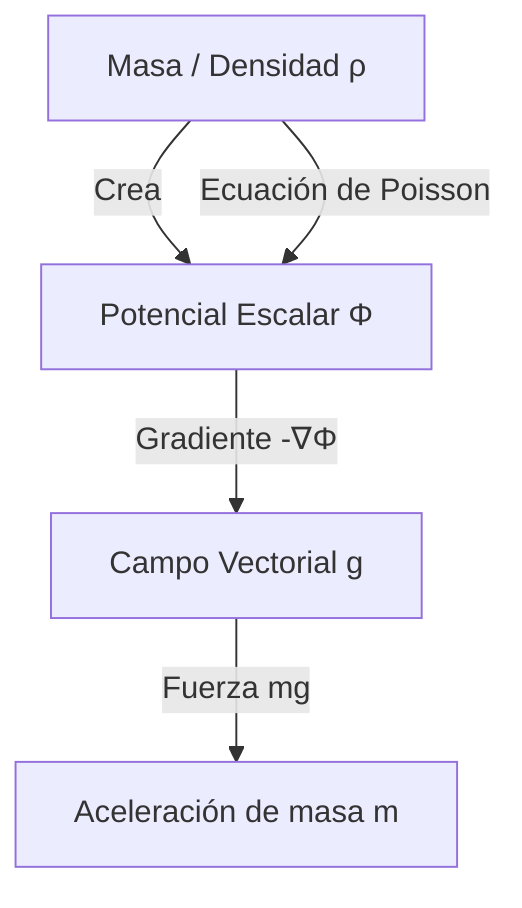

# Gravitación

La fuerza que mantiene unida la estructura del cosmos a gran escala. Históricamente, fue la primera fuerza fundamental en ser matematizada y sigue siendo un campo de intensa investigación moderna.

## 📜 Contexto Histórico
Las **Leyes de Kepler** (1609-1619) describían empíricamente cómo se movían los planetas en elipses a diferentes velocidades, basadas en los increíbles datos observacionales de Tycho Brahe. Décadas después, **Isaac Newton** (1687) revolucionó la ciencia al formular su *Ley de Gravitación Universal*, demostrando matemáticamente que la *misma* fuerza invisible que hacía caer las manzanas de los árboles era la responsable de atar la Luna en su órbita terrestre y validar con total precisión cada una de las empíricas leyes de Kepler.

---

## 🧮 Desarrollo Teórico Profundo

El tratamiento moderno de la gravitación clásica abarca no solo la formulación puntual newtoniana, sino también la teoría del potencial (que inspiró más tarde el electromagnetismo de Maxwell) y la resolución exhaustiva del problema de los dos cuerpos a través de la reducción del centro de masa y lagrangianos.

### 1. Formulación de Campo y Ley de Gauss Gravitacional

La ley de fuerza gravitatoria entre masas puntuales $\vec{F}_{12} = -G \frac{m_1 m_2}{r_{12}^2} \hat{r}_{12}$ se reinterpreta localmente postulando que una fuente $M$ altera las propiedades del espacio euclidiano creando un **campo gravitacional vectorial** $\vec{g}(\vec{r})$:
$$ \vec{g}(\vec{r}) = \lim_{m_{test} \to 0} \frac{\vec{F}_{grav}}{m_{test}} = -G \int_{V} \frac{\rho(\vec{r}') (\vec{r} - \vec{r}')}{|\vec{r} - \vec{r}'|^3} d^3r' $$
Dado que este campo exhibe dependencia inversa al cuadrado (decaimiento $1/r^2$), el flujo del campo a través de una superficie cerrada $\partial V$ depende exclusivamente de la masa contenida. De aquí deriva la forma integral de la **Ley de Gauss para la Gravedad**:
$$ \oint_{\partial V} \vec{g} \cdot d\vec{A} = -4\pi G M_{int} $$
Mediante el Teorema de la Divergencia de Gauss ($\int_V \nabla \cdot \vec{g} dV = \oint \vec{g} \cdot d\vec{A}$), se extrae la Ecuación Diferencial de Campo local (Ecuación de Poisson gravitatoria):
$$ \nabla \cdot \vec{g} = -4\pi G \rho $$

Dado que la curvatura curliana es nula ($\nabla \times \vec{g} = \vec{0}$), el campo $\vec{g}$ es puramente irrotacional y por ende deriva del gradiente de un **Potencial Gravitatorio Escalar** $\Phi(\vec{r})$, tal que $\vec{g} = -\nabla \Phi$. 
Sustituyendo esto en la ley local obtenemos la formulación final de campo:
$$ \nabla^2 \Phi = 4\pi G \rho $$

### 2. Dinámica del Problema de los Dos Cuerpos (Two-Body Problem)

Consideremos dos masas estelares, $m_1$ y $m_2$, sujetas puramente a su gravedad mutua. El sistema se formula con el Hamiltoniano de 6 grados de libertad espaciales, pero se puede reducir explotando integrales de movimiento asintóticas.
Definimos el Centro de Masa $\vec{R}$ y el vector de Posición Relativa $\vec{r}$:
$$ \vec{R} = \frac{m_1\vec{r}_1 + m_2\vec{r}_2}{m_1 + m_2}, \quad \vec{r} = \vec{r}_1 - \vec{r}_2 $$
La dinámica del centro de masa $\vec{R}$ es rectilínea y uniforme (invariancia de Galileo). El sistema colapsa drásticamente a un problema efectivo de **un solo cuerpo** sometido a una fuerza central esféricamente simétrica:
$$ \mu \ddot{\vec{r}} = -\frac{G m_1 m_2}{r^2} \hat{r} $$
Donde la "Masa Reducida" de la partícula ficticia es $\mu = \frac{m_1 m_2}{m_1 + m_2}$.

### 3. Solución a la Ecuación de la Órbita Keplereana

Al estar gobernado por una fuerza puramente central ($\vec{r} \times \vec{F} = \vec{0}$), el momento angular relativo $\vec{\ell} = \vec{r} \times \vec{p}$ es un vector constante de movimiento.
Esto impone inmediatamente dos fuertes restricciones topológicas:
1. El movimiento $\vec{r}(t)$ transcurre en un plano bi-dimensional inmutable perpendicular a $\vec{\ell}$.
2. En coordenadas polares cilíndricas planares, $\ell = \mu r^2 \dot{\theta} = \text{constante}$. Esta constante revela geométrica y diferencialmente la Segunda Ley de Kepler: el radio vector barre áreas a un ritmo $\frac{dA}{dt} = \frac{\ell}{2\mu} = \text{cte}$.

Con la conservación de la Energía Mecánica relativa $E = \frac{1}{2}\mu \dot{r}^2 + \frac{\ell^2}{2\mu r^2} - \frac{GM\mu}{r}$, efectuamos el histórico cambio de variable de Binet $u(\theta) = 1/r(\theta)$. La ecuación diferencial no lineal del tiempo se convierte mágicamente en la Ecuación Diferencial del Oscilador Armónico Excitado, cuya solución asintótica traza explícitamente secciones cónicas matemáticas:
$$ \frac{d^2u}{d\theta^2} + u = \frac{GM\mu^2}{\ell^2} \implies r(\theta) = \frac{p}{1 + \epsilon \cos(\theta - \theta_0)} $$
Donde:
- $p = \frac{\ell^2}{GM\mu^2}$ es el semi-latus rectum.
- $\epsilon = \sqrt{1 + \frac{2E\ell^2}{\mu(GM\mu)^2}}$ es la excentricidad orbital dependiente de la energía del sistema.

### 4. Clasificación Energética y Vector de Runge-Lenz

El estado final del sistema astrofísico es rígidamente dictaminado por su energía mecánica $E$:
- Si $E < 0$, entonces $\epsilon < 1$: Estado Ligado. La cónica es una **Elipse** (Círculo si $\epsilon=0$). (Tercera Ley de Kepler se prueba para sistemas acotados con período cerrado).
- Si $E = 0$, entonces $\epsilon = 1$: Estado Umbral Crítico. La curva abre al infinito en una **Parábola**. Es el caso límite de escape exacto.
- Si $E > 0$, entonces $\epsilon > 1$: Estado de Dispersión (Scattering). Partícula intrusa que desvía asintóticamente en una **Hipérbola**.

Finalmente, el hecho de que las órbitas limitadas no presenten precesión anómala y se cierren geométricamente sobre sí mismas de vuelta a $2\pi$ es garantizado en la mecánica newtoniana por un segundo e ignoto vector conservado que señala la simetría especial del potencial $-1/r$, conocido como vector invariante de excentricidad o **Vector de Laplace-Runge-Lenz**:
$$ \vec{A} = \vec{p} \times \vec{L} - \mu k \hat{r} $$
La precesión mínima observada en Mercurio violaba esta simetría subyacente, pavimentando la crisis fundacional que resolvió la Relatividad General un siglo después.

---

## 🛠 Ejemplo Práctico: Velocidad de Escape
¿A qué velocidad $v_{esc}$ debes disparar un proyectil de masa $m$ desde la superficie terrestre ($M$, $R$) para que nunca vuelva a caer, escapando hasta el infinito?

**Solución**:
1. Usamos la conservación de la energía mecánica $E_i = E_f$.
2. En la superficie: $E_i = K_i + U_i = \frac{1}{2}m v_{esc}^2 - G \frac{mM}{R}$.
3. Para apenas escapar, su velocidad al llegar al infinito ($r \to \infty$) será exactamente cero: $E_f = K_f + U_f = 0 + 0 = 0$.
4. Igualamos:
   $$ \frac{1}{2}m v_{esc}^2 - G \frac{mM}{R} = 0 $$
5. Despejando $v_{esc}$ (nota que no depende de la masa $m$ del cohete):
   $$ \mathbf{v_{esc} = \sqrt{\frac{2GM}{R}}} $$
   Para la Tierra, esto equivale a unos espectaculares $11.2 \text{ km/s}$.

---

## 📚 Recursos Específicos de Gravitación

### 🎓 Cursos y Clases Recomendadas (5-7)
1. **[MIT 8.01 - Universal Gravity (Walter Lewin)](https://ocw.mit.edu/courses/8-01sc-classical-mechanics-fall-2016/pages/week-10-rotational-energy/)**: Cubre magistralmente las Leyes de Kepler, la mecánica celeste y el concepto de energía en el espacio profundo.
2. **[Yale PHYS 200 - Lecture 7: Universal Gravitation](https://oyc.yale.edu/physics/phys-200/lecture-7)**: Deducción formal del cálculo orbital, secciones cónicas y reducción al problema de un solo cuerpo.
3. **[Khan Academy - Gravitación y Órbitas](https://es.khanacademy.org/science/physics/centripetal-force-and-gravitation)**: Excelente guía de paso a paso, abarcando peso aparente en el espacio y órbitas satelitales.
4. **[Coursera - Orbital Mechanics (University of Colorado Boulder)](https://www.coursera.org/learn/spacecraft-dynamics-kinematics)**: Un enfoque desde la ingeniería aeroespacial de las maniobras orbitales de Hohmann y las esferas de influencia gravitacional.
5. **[edX - Astrophysics: Cosmology (ANU)](https://www.edx.org/course/astrophysics-cosmology)**: Para ir más allá, conectando la gravedad de Newton con su rol fundamental en la estructura cosmológica.

### 📝 Artículos, Simulaciones e Interactivos (8-10)
1. **Artículo Histórico**: [Kepler's Discovery of the Laws of Planetary Motion (Scholarpedia)](http://www.scholarpedia.org/article/Kepler%27s_laws_of_planetary_motion) - Relato de cómo Kepler dedujo sus empíricas elipses de los datos de Tycho Brahe.
2. **Artículo (Cavendish)**: [El Experimento de Cavendish (Wikipedia)](https://es.wikipedia.org/wiki/Experimento_de_Cavendish) - Cómo la humanidad "pesó" la Tierra midiendo directamente la esquiva constante universal $G$.
3. **Simulador**: [PhET - Laboratorio de Gravedad](https://phet.colorado.edu/es/simulations/gravity-and-orbits) - Construye tu propio sistema solar y observa cómo varían las trayectorias parabólicas, hiperbólicas o elípticas.
4. **Simulador**: [PhET - Mi Sistema Solar](https://phet.colorado.edu/es/simulations/my-solar-system) - Excelente herramienta interactiva para jugar con órbitas multicuerpo inestables.
5. **Juego Educativo**: [Kerbal Space Program](https://www.kerbalspaceprogram.com/) - El mejor simulador espacial jamás creado para entender instintivamente la mecánica orbital newtoniana.
6. **Video Documental**: [Carl Sagan's Cosmos - Kepler & Newton](https://www.youtube.com/watch?v=zSzBksEbxYg) - Clips icónicos que enlazan el trabajo místico de Kepler con el genio matemático de Newton.
7. **Artículo**: [Gravity and General Relativity (HyperPhysics)](http://hyperphysics.phy-astr.gsu.edu/hbase/Relativ/grel.html) - Sobre cómo y cuándo la aproximación clásica falla respecto a los agujeros negros.
8. **Simulador**: [Newton's Cannon on a Mountain](https://contrib.pbslearningmedia.org/WGBH/nvce/vis_cannon/vis_cannon.html) - La clásica demostración interactiva del experimento mental original de Newton para orbitar la Tierra.

### 📖 Referencias Útiles y Bibliografía
- **[Classical Mechanics (John R. Taylor)](https://uscibooks.aip.org/books/classical-mechanics/)**: Extraordinario capítulo sobre el problema de la fuerza central (two-body problem) y órbitas perturbadas.
- **[Orbital Mechanics for Engineering Students (Howard D. Curtis)](https://www.elsevier.com/books/orbital-mechanics-for-engineering-students/curtis/978-0-08-102133-0)**: La biblia moderna para los cálculos específicos que se usan hoy en día en satélites y viajes interplanetarios.
- **[Classical Dynamics of Particles and Systems (Marion & Thornton)](https://www.cengage.com/c/classical-dynamics-of-particles-and-systems-5e-thornton/9780534408961/)**: Su tratamiento de las secciones eficaces, las fuerzas tipo $1/r^2$ y el vector de Runge-Lenz es fundamental.
- **[Principia Mathematica (Isaac Newton)](https://es.wikipedia.org/wiki/Philosophi%C3%A6_naturalis_principia_mathematica)**: Aunque ilegible como texto moderno, los postulados sobre la Ley Universal y el Teorema de Cascarón Esférico provienen directamente de aquí.
- **[Gravity: An Introduction to Einstein's General Relativity (James Hartle)](https://www.cambridge.org/highereducation/books/gravity/D8B1C6BB1E413B52701198A019448AFE)**: Para aquellos que desean ver la frontera superior de la gravedad newtoniana.
