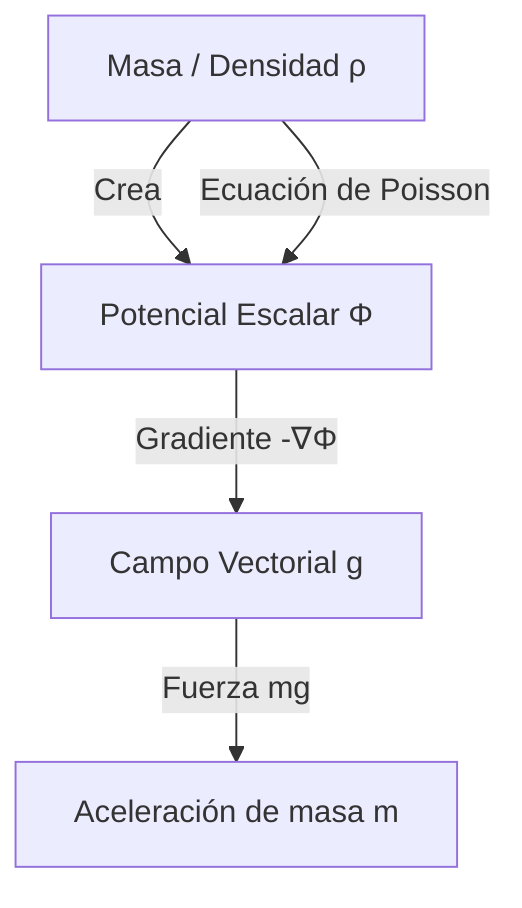

# Gravitación

La fuerza que mantiene unida la estructura del cosmos a gran escala. Históricamente, fue la primera fuerza fundamental en ser matematizada y sigue siendo un campo de intensa investigación moderna.

## 📜 Contexto Histórico
Las **Leyes de Kepler** (1609-1619) describían empíricamente cómo se movían los planetas en elipses a diferentes velocidades, basadas en los increíbles datos observacionales de Tycho Brahe. Décadas después, **Isaac Newton** (1687) revolucionó la ciencia al formular su *Ley de Gravitación Universal*, demostrando matemáticamente que la *misma* fuerza invisible que hacía caer las manzanas de los árboles era la responsable de atar la Luna en su órbita terrestre y validar con total precisión cada una de las empíricas leyes de Kepler.

---

## 🧮 Desarrollo Teórico Profundo

El tratamiento moderno de la gravitación clásica abarca no solo la formulación puntual newtoniana, sino también la teoría del potencial (que inspiró más tarde el electromagnetismo de Maxwell) y la resolución exhaustiva del problema de los dos cuerpos a través de la reducción del centro de masa y lagrangianos.

### 1. Formulación de Campo y Ley de Gauss Gravitacional

La ley de fuerza gravitatoria entre masas puntuales $\vec{F}_{12} = -G \frac{m_1 m_2}{r_{12}^2} \hat{r}_{12}$ se reinterpreta localmente postulando que una fuente $M$ altera las propiedades del espacio euclidiano creando un **campo gravitacional vectorial** $\vec{g}(\vec{r})$:

$$ \vec{g}(\vec{r}) = \lim_{m_{test} \to 0} \frac{\vec{F}_{grav}}{m_{test}} = -G \int_{V} \frac{\rho(\vec{r}') (\vec{r} - \vec{r}')}{|\vec{r} - \vec{r}'|^3} d^3r' $$

Dado que este campo exhibe dependencia inversa al cuadrado (decaimiento $1/r^2$), el flujo del campo a través de una superficie cerrada $\partial V$ depende exclusivamente de la masa contenida. De aquí deriva la forma integral de la **Ley de Gauss para la Gravedad**:

$$ \oint_{\partial V} \vec{g} \cdot d\vec{A} = -4\pi G M_{int} $$

Mediante el Teorema de la Divergencia de Gauss ($\int_V \nabla \cdot \vec{g} dV = \oint \vec{g} \cdot d\vec{A}$), se extrae la Ecuación Diferencial de Campo local (Ecuación de Poisson gravitatoria):

$$ \nabla \cdot \vec{g} = -4\pi G \rho $$

Dado que la curvatura curliana es nula ($\nabla \times \vec{g} = \vec{0}$), el campo $\vec{g}$ es puramente irrotacional y por ende deriva del gradiente de un **Potencial Gravitatorio Escalar** $\Phi(\vec{r})$, tal que $\vec{g} = -\nabla \Phi$. 
Sustituyendo esto en la ley local obtenemos la formulación final de campo:

$$ \nabla^2 \Phi = 4\pi G \rho $$



### 2. Dinámica del Problema de los Dos Cuerpos (Two-Body Problem)

Consideremos dos masas estelares, $m_1$ y $m_2$, sujetas puramente a su gravedad mutua. El sistema se formula con el Hamiltoniano de 6 grados de libertad espaciales, pero se puede reducir explotando integrales de movimiento asintóticas.
Definimos el Centro de Masa $\vec{R}$ y el vector de Posición Relativa $\vec{r}$:

$$ \vec{R} = \frac{m_1\vec{r}_1 + m_2\vec{r}_2}{m_1 + m_2}, \quad \vec{r} = \vec{r}_1 - \vec{r}_2 $$

La dinámica del centro de masa $\vec{R}$ es rectilínea y uniforme (invariancia de Galileo). El sistema colapsa drásticamente a un problema efectivo de **un solo cuerpo** sometido a una fuerza central esféricamente simétrica:

$$ \mu \ddot{\vec{r}} = -\frac{G m_1 m_2}{r^2} \hat{r} $$

Donde la "Masa Reducida" de la partícula ficticia es $\mu = \frac{m_1 m_2}{m_1 + m_2}$.

### 3. Solución a la Ecuación de la Órbita Keplereana

Al estar gobernado por una fuerza puramente central ($\vec{r} \times \vec{F} = \vec{0}$), el momento angular relativo $\vec{\ell} = \vec{r} \times \vec{p}$ es un vector constante de movimiento.
Esto impone inmediatamente dos fuertes restricciones topológicas:
1. El movimiento $\vec{r}(t)$ transcurre en un plano bi-dimensional inmutable perpendicular a $\vec{\ell}$.
2. En coordenadas polares cilíndricas planares, $\ell = \mu r^2 \dot{\theta} = \text{constante}$. Esta constante revela geométrica y diferencialmente la Segunda Ley de Kepler: el radio vector barre áreas a un ritmo $\frac{dA}{dt} = \frac{\ell}{2\mu} = \text{cte}$.

Con la conservación de la Energía Mecánica relativa $E = \frac{1}{2}\mu \dot{r}^2 + \frac{\ell^2}{2\mu r^2} - \frac{GM\mu}{r}$, efectuamos el histórico cambio de variable de Binet $u(\theta) = 1/r(\theta)$. La ecuación diferencial no lineal del tiempo se convierte mágicamente en la Ecuación Diferencial del Oscilador Armónico Excitado, cuya solución asintótica traza explícitamente secciones cónicas matemáticas:

$$ \frac{d^2u}{d\theta^2} + u = \frac{GM\mu^2}{\ell^2} \implies r(\theta) = \frac{p}{1 + \epsilon \cos(\theta - \theta_0)} $$

Donde:
- $p = \frac{\ell^2}{GM\mu^2}$ es el semi-latus rectum.
- $\epsilon = \sqrt{1 + \frac{2E\ell^2}{\mu(GM\mu)^2}}$ es la excentricidad orbital dependiente de la energía del sistema.

### 4. Clasificación Energética y Vector de Runge-Lenz

El estado final del sistema astrofísico es rígidamente dictaminado por su energía mecánica $E$:
- Si $E < 0$, entonces $\epsilon < 1$: Estado Ligado. La cónica es una **Elipse** (Círculo si $\epsilon=0$). (Tercera Ley de Kepler se prueba para sistemas acotados con período cerrado).
- Si $E = 0$, entonces $\epsilon = 1$: Estado Umbral Crítico. La curva abre al infinito en una **Parábola**. Es el caso límite de escape exacto.
- Si $E > 0$, entonces $\epsilon > 1$: Estado de Dispersión (Scattering). Partícula intrusa que desvía asintóticamente en una **Hipérbola**.

Finalmente, el hecho de que las órbitas limitadas no presenten precesión anómala y se cierren geométricamente sobre sí mismas de vuelta a $2\pi$ es garantizado en la mecánica newtoniana por un segundo e ignoto vector conservado que señala la simetría especial del potencial $-1/r$, conocido como vector invariante de excentricidad o **Vector de Laplace-Runge-Lenz**:

$$ \vec{A} = \vec{p} \times \vec{L} - \mu k \hat{r} $$

La precesión mínima observada en Mercurio violaba esta simetría subyacente, pavimentando la crisis fundacional que resolvió la Relatividad General un siglo después.

---

## 🛠 Ejemplo Práctico: Velocidad de Escape
¿A qué velocidad $v_{esc}$ debes disparar un proyectil de masa $m$ desde la superficie terrestre ($M$, $R$) para que nunca vuelva a caer, escapando hasta el infinito?

**Solución**:
1. Usamos la conservación de la energía mecánica $E_i = E_f$.
2. En la superficie: $E_i = K_i + U_i = \frac{1}{2}m v_{esc}^2 - G \frac{mM}{R}$.
3. Para apenas escapar, su velocidad al llegar al infinito ($r \to \infty$) será exactamente cero: $E_f = K_f + U_f = 0 + 0 = 0$.
4. Igualamos:

   $$ \frac{1}{2}m v_{esc}^2 - G \frac{mM}{R} = 0 $$

5. Despejando $v_{esc}$ (nota que no depende de la masa $m$ del cohete):

   $$ \mathbf{v_{esc} = \sqrt{\frac{2GM}{R}}} $$

   Para la Tierra, esto equivale a unos espectaculares $11.2 \text{ km/s}$.

---

## 📝 Guía de Ejercicios Resueltos

**Problema 1: Campo en el interior de una esfera maciza hueca descentrada**
Considere una esfera de radio $R$ con una densidad de masa uniforme $\rho$. Dentro de ella hay una cavidad esférica hueca (vacía) de radio $a$, cuyo centro está desplazado un vector $\vec{d}$ respecto al centro de la esfera original. Demuestre que el campo gravitacional en el interior de la cavidad es uniforme y calcule su vector.
**Solución paso a paso:**
1. Por el Principio de Superposición, el campo total $\vec{g}_{tot}$ es la suma del campo que produciría una esfera maciza completa de densidad $\rho$, más el campo de una esfera de radio $a$ y densidad negativa $-\rho$ (la cavidad).
2. Para una esfera de densidad uniforme, aplicando la Ley de Gauss, el campo en el interior (a un vector de posición $\vec{r}$ desde el centro) es:
   $\oint \vec{g} \cdot d\vec{A} = -4\pi G M_{int} = -4\pi G (\rho \frac{4}{3}\pi r^3)$.
   $g (4\pi r^2) = -\frac{16\pi^2}{3} G \rho r^3 \implies \vec{g}(\vec{r}) = -\frac{4}{3}\pi G \rho \vec{r}$.
3. Sea el centro de la esfera principal el origen. El campo creado por esta esfera sólida evaluado en un punto arbitrario $\vec{r}$ dentro de la cavidad es $\vec{g}_1 = -\frac{4}{3}\pi G \rho \vec{r}$.
4. El centro de la cavidad está en $\vec{d}$. El vector desde el centro de la cavidad hasta el mismo punto de prueba es $\vec{r}' = \vec{r} - \vec{d}$.
5. El campo producido por la "masa negativa" $-\rho$ en la cavidad es:
   $\vec{g}_2 = -\frac{4}{3}\pi G (-\rho) \vec{r}' = \frac{4}{3}\pi G \rho (\vec{r} - \vec{d})$.
6. Sumamos ambos campos para obtener el campo total dentro de la cavidad:
   $\vec{g}_{tot} = \vec{g}_1 + \vec{g}_2 = -\frac{4}{3}\pi G \rho \vec{r} + \frac{4}{3}\pi G \rho (\vec{r} - \vec{d})$.
7. Simplificando algebraicamente:
   $\vec{g}_{tot} = -\frac{4}{3}\pi G \rho \vec{d}$.
8. Este resultado no depende de $\vec{r}$. El campo gravitacional dentro de la cavidad es sorprendentemente **constante**, uniforme y apunta anti-paralelamente al vector de desplazamiento $\vec{d}$.

**Problema 2: Perturbación en órbita y conservación del Vector Runge-Lenz**
Un planeta de masa $m$ orbita el sol $M$ en una elipse de semieje mayor $a$ y excentricidad $\epsilon$. Encuentre la dependencia explícita entre la energía orbital $E$, el momento angular $\ell$ y la magnitud del vector Runge-Lenz $\vec{A} = \vec{p} \times \vec{L} - \mu k \hat{r}$, sabiendo que $k = GM\mu$.
**Solución paso a paso:**
1. Calculamos el producto punto del vector de Runge-Lenz consigo mismo para hallar su magnitud cuadrada $A^2 = \vec{A} \cdot \vec{A}$.
2. $A^2 = (\vec{p} \times \vec{L} - \mu k \hat{r}) \cdot (\vec{p} \times \vec{L} - \mu k \hat{r})$.
3. Desarrollamos: $A^2 = (\vec{p} \times \vec{L})^2 - 2\mu k \hat{r} \cdot (\vec{p} \times \vec{L}) + \mu^2 k^2$.
4. Usando identidades vectoriales: $(\vec{p} \times \vec{L})^2 = p^2 L^2 - (\vec{p} \cdot \vec{L})^2$.
5. Puesto que $\vec{L} = \vec{r} \times \vec{p}$, $\vec{p}$ es ortogonal a $\vec{L}$, así que $\vec{p} \cdot \vec{L} = 0$. Luego $(\vec{p} \times \vec{L})^2 = p^2 L^2 = 2\mu K L^2$, donde $K = \frac{p^2}{2\mu}$ es la energía cinética.
6. El término cruzado requiere la permutación cíclica del triple producto escalar:
   $\hat{r} \cdot (\vec{p} \times \vec{L}) = \vec{L} \cdot (\hat{r} \times \vec{p}) = \frac{1}{r} \vec{L} \cdot (\vec{r} \times \vec{p}) = \frac{1}{r} \vec{L} \cdot \vec{L} = \frac{L^2}{r}$.
7. Sustituyendo los términos:
   $A^2 = 2\mu K L^2 - 2\mu k \left(\frac{L^2}{r}\right) + \mu^2 k^2$.
8. Factorizamos $2\mu L^2$:
   $A^2 = 2\mu L^2 \left( K - \frac{k}{r} \right) + \mu^2 k^2$.
9. Reconocemos que la energía mecánica total es $E = K - \frac{k}{r}$.
10. $A^2 = 2\mu E L^2 + \mu^2 k^2 \implies \mathbf{A = \sqrt{2\mu E L^2 + \mu^2 k^2}}$. Este vector establece que la energía y momento angular fijan geométricamente la forma invariable de la órbita en el problema Kepleriano.

**Problema 3: Radio de la esfera de la Muerte (Desgarro de marea)**
Se tiene un objeto esférico denso de masa $M$ y un pequeño satélite esférico de masa $m$, radio $r$ y densidad homogénea, en órbita a distancia $R$. Encuentre a qué distancia límite $R_L$ (Límite de Roche en cuerpo rígido) la fuerza de marea gravitacional iguala a la gravedad propia del satélite en su superficie.
**Solución paso a paso:**
1. La fuerza gravitatoria ejercida por $M$ decae con la distancia. El diferencial de esta fuerza a lo largo del diámetro del satélite induce un gradiente de fuerza de marea que intenta desgarrarlo.
2. Sea $F_G(R) = \frac{GMm}{R^2}$ la fuerza atractiva en el centro del satélite. En el borde más cercano a $M$, a distancia $R-r$, la fuerza es $F_G(R-r) = \frac{GMm}{(R-r)^2}$.
3. La fuerza de marea neta sobre una partícula de prueba $dm$ depositada en ese borde extremo, en relación al marco en caída libre del centro de masa, es $\Delta F = \frac{GMdm}{(R-r)^2} - \frac{GMdm}{R^2}$.
4. Usamos aproximación de Taylor de primer orden ya que $r \ll R$:
   $(R-r)^{-2} = R^{-2}\left(1 - \frac{r}{R}\right)^{-2} \approx R^{-2}\left(1 + \frac{2r}{R}\right)$.
5. Sustituyendo:
   $\Delta F \approx \frac{GMdm}{R^2} \left( 1 + \frac{2r}{R} - 1 \right) = \frac{2GMdm r}{R^3}$.
6. Esta fuerza de marea arranca $dm$ hacia el exterior. La gravedad propia del satélite trata de mantener a $dm$ sujeto: $F_{propia} = \frac{G m dm}{r^2}$.
7. El desgarro comienza exactamente cuando $\Delta F = F_{propia}$:
   $\frac{2GMdm r}{R_L^3} = \frac{G m dm}{r^2}$.
8. Despejamos el límite radial $R_L$:
   $R_L^3 = \frac{2GM r^3}{m} \implies R_L = r \left(\frac{2M}{m}\right)^{1/3}$.
9. En términos de las densidades ($\rho_M = M / (\frac{4}{3}\pi R_M^3)$ y $\rho_m = m / (\frac{4}{3}\pi r^3)$):
   $R_L = R_M \left( \frac{2\rho_M}{\rho_m} \right)^{1/3}$. Para la Tierra y la Luna, esto equivale a unos ~18,000 km, por debajo del cual se forman los anillos planetarios.

## 💻 Simulaciones Computacionales

Simulación del problema de los N-cuerpos bajo atracción gravitacional mutua. Este código resuelve las órbitas usando integración de ecuaciones diferenciales ordinarias.

```python
import numpy as np
import matplotlib.pyplot as plt
from scipy.integrate import solve_ivp

G = 1.0 # Constante gravitacional (unidades arbitrarias)
m1, m2, m3 = 1.0, 1.0, 1.0 # Masas idénticas para la coreografía del 8

# Coreografía en forma de 8
v_x, v_y = 0.347111, 0.532728
initial_state = [
    0.97000436, -0.24308753,  # r1
    -0.97000436, 0.24308753,  # r2
    0.0, 0.0,                 # r3
    -v_x/2, -v_y/2,           # v1
    -v_x/2, -v_y/2,           # v2
    v_x, v_y                  # v3
]

def gravity_n_body(t, state):
    r1, r2, r3 = state[0:2], state[2:4], state[4:6]
    v1, v2, v3 = state[6:8], state[8:10], state[10:12]
    
    def force(ri, rj, mj):
        r_ij = rj - ri
        return G * mj * r_ij / np.linalg.norm(r_ij)**3
        
    a1 = force(r1, r2, m2) + force(r1, r3, m3)
    a2 = force(r2, r1, m1) + force(r2, r3, m3)
    a3 = force(r3, r1, m1) + force(r3, r2, m2)
    
    return np.concatenate((v1, v2, v3, a1, a2, a3))

t_span = (0, 10)
sol = solve_ivp(gravity_n_body, t_span, initial_state, t_eval=np.linspace(0, 10, 1000), rtol=1e-9)

plt.figure(figsize=(6, 6))
plt.plot(sol.y[0], sol.y[1], label='Cuerpo 1', color='red')
plt.plot(sol.y[2], sol.y[3], label='Cuerpo 2', color='blue')
plt.plot(sol.y[4], sol.y[5], label='Cuerpo 3', color='green')
plt.title('Coreografía en "8" del Problema de los 3 Cuerpos')
plt.xlabel('x')
plt.ylabel('y')
plt.grid(True)
plt.show()
```

## 🚀 Fronteras de Investigación y Problemas Abiertos

La física gravitacional en 2026 se centra en la astronomía de precisión de **ondas gravitacionales** usando detectores de próxima generación (LISA, Einstein Telescope), buscando señales estocásticas del fondo cosmológico y fusiones de agujeros negros primordiales. A nivel teórico, la tensión de Hubble y la naturaleza intrínseca de la **materia oscura** vs. teorías de **gravedad modificada** (MOND escalar-tensorial) siguen siendo problemas abiertos dominantes que la mecánica celeste avanzada intenta dilucidar mediante sondeos galácticos masivos.

## 📐 Formalismo Matemático Avanzado (Nivel Posgrado/Doctorado)

La gravitación clásica profunda abandona el potencial escalar newtoniano $V(r)$ para ser reformulada geométricamente. Utilizando **Geometría Diferencial**, la gravedad es una manifestación de la curvatura del espaciotiempo pseudo-riemanniano $\mathcal{M}$ equipado con una métrica lorentziana $g_{\mu\nu}$.

El formalismo culmina en las Ecuaciones de Campo de Einstein, que vinculan el tensor de Einstein $G_{\mu\nu}$ (curvatura) con el tensor de energía-impulso $T_{\mu\nu}$ (materia/energía):

$$ R_{\mu\nu} - \frac{1}{2}R g_{\mu\nu} + \Lambda g_{\mu\nu} = \frac{8\pi G}{c^4} T_{\mu\nu} $$

Bajo el **formalismo hamiltoniano ADM (Arnowitt-Deser-Misner)**, usado exhaustivamente en la relatividad numérica moderna para simular fusiones de agujeros negros, la variedad tetradimensional se folia en hipersuperficies espaciales $\Sigma_t$ de evolución continua. La métrica se descompone usando el lapso $\alpha$ y el vector de desplazamiento $\beta^i$:

$$ ds^2 = -\alpha^2 dt^2 + \gamma_{ij}(dx^i + \beta^i dt)(dx^j + \beta^j dt) $$

lo cual transforma las ecuaciones de Einstein en un problema de valor inicial con ecuaciones de ligadura y ecuaciones de evolución geométrica, resolubles mediante supercomputadoras para predecir las ondas gravitacionales en el régimen de campo fuerte no lineal.

## 📚 Recursos Específicos de Gravitación

### 🎓 Cursos y Clases Recomendadas
1. **[MIT 8.01: Gravity and Orbits (Walter Lewin)](https://ocw.mit.edu/courses/8-01-physics-i-classical-mechanics-fall-1999/)**: Cubre las leyes de Kepler empíricamente y deduce la fuerza inversa del cuadrado de Newton.
2. **[Yale PHYS 200: Law of Gravitation (R. Shankar)](https://oyc.yale.edu/physics/phys-200)**: Análisis profundo del problema de los dos cuerpos, reducción a la masa reducida y cálculo de la energía potencial en el infinito.
3. **[Stanford - General Relativity (Susskind)](https://theoreticalminimum.com/courses/general-relativity/2012/fall)**: Para dar el salto desde la gravedad newtoniana a la concepción del espacio-tiempo curvo, empezando con el Principio de Equivalencia.

### 📝 Artículos, Publicaciones y Teoría Avanzada
1. **[The Runge-Lenz Vector and the Kepler Problem (Goldstein, 1975)](https://aapt.scitation.org/doi/10.1119/1.10023)**
   - *Importancia Teórica*: Explora la simetría "escondida" (simetría dinámica SO(4)) del potencial central $V(r) = -k/r$.
   - *Contexto Matemático*: En la mecánica celeste, la fuerza gravitatoria de Newton conserva no solo la energía $E$ y el momento angular $\vec{L}$, sino un tercer vector, el vector de Laplace-Runge-Lenz:

     $$ \vec{A} = \vec{p} \times \vec{L} - \mu k \hat{r} $$

     La conservación de $\vec{A}$ implica algebraicamente que las órbitas acotadas ($E < 0$) son cónicas perfectamente cerradas y sin precesión. El corrimiento del perihelio de Mercurio se debió a perturbaciones que rompen exactamente esta invariancia $\frac{d\vec{A}}{dt} \neq 0$.
   - *Implicaciones*: Explica la degeneración "accidental" de los niveles de energía del átomo de hidrógeno en mecánica cuántica (que obedece al mismo potencial inverso).
2. **[Newton's Theorem on the Gravitational Field of Spherical Shells (Principia, 1687)](https://cudl.lib.cam.ac.uk/view/PR-ADV-B-00039-00001/1)**
   - *Importancia Teórica*: El Teorema del Cascarón Esférico (*Shell Theorem*) probó que un cuerpo masivo esférico simétrico se comporta gravitacionalmente en su exterior como si toda su masa se concentrara en un punto matemático central.
   - *Contexto Matemático*: Newton integró anillos infinitesimales superficiales; hoy usamos la Ley de Gauss. Para un cascarón esférico $M$ de radio $R$, el campo interno $(r<R)$ resulta ser cero debido a la perfecta cancelación simétrica escalar del potencial:

     $$ V(r < R) = - \frac{GM}{R} = \text{constante} \implies \vec{g} = -\nabla V = \vec{0} $$

     Para $r > R$, $\vec{g} = -\frac{GM}{r^2}\hat{r}$.
   - *Implicaciones*: Validó el que Newton pudiera modelar a los gigantescos planetas físicos como simples masas puntuales sin error matemático.
3. **[Tidal Forces and the Roche Limit (Édouard Roche, 1848)](https://en.wikipedia.org/wiki/Roche_limit)**
   - *Importancia Teórica*: Teoría fundamental en astrofísica para comprender la estabilidad estructural bajo gradientes gravitacionales (fuerzas de marea).
   - *Contexto Matemático*: La fuerza gravitatoria de marea a través de un cuerpo de diámetro $2r$ orbitando a un cuerpo mayor $M$ a distancia $R$ viene de la expansión diferencial de Taylor del campo. La condición límite para que la auto-gravedad del satélite sucumba ante el desgarro de marea arroja el Límite de Roche rígido:

     $$ d = R_M \left( \frac{2 \rho_M}{\rho_m} \right)^{1/3} $$

   - *Implicaciones*: Explica la formación y persistencia de los anillos de Saturno y advierte de la espaguetización (*spaghettification*) cerca del horizonte de eventos de un Agujero Negro, donde el tensor de curvatura de Riemann es colosal.

### 📖 Referencias Útiles y Bibliografía
- **[Classical Mechanics - John R. Taylor](https://uscibooks.aip.org/books/classical-mechanics/)**: El Capítulo 8 sobre Problemas de Fuerza Central provee la deducción más didáctica posible sobre el problema Kepleriano, secciones cónicas y órbitas de Hohmann.
- **[Orbital Mechanics for Engineering Students - H. Curtis](https://www.elsevier.com/books/orbital-mechanics-for-engineering-students/curtis/978-0-08-102133-0)**: Extenso tratado riguroso para aplicaciones aeroespaciales prácticas: problemas de tres cuerpos restringidos, maniobras de transferencia orbital y encuentros planetarios.

## 🌐 Seminarios Avanzados y Literatura de Frontera
- [Perimeter Institute: Gravity Seminars](https://pirsa.org/) - Exploración profunda sobre gravedad cuántica, relatividad numérica y fronteras observacionales de campos gravitatorios.
- [LIGO/Virgo Collaboration Open Seminars](https://www.ligo.caltech.edu/page/ligo-seminars) - Presentaciones de frontera sobre detección astronómica de ondas gravitacionales y colisiones astrofísicas masivas.
- [CERN: Cosmology and Astroparticle Physics Seminars](https://theory.cern/seminars) - Debates sobre materia oscura, modificaciones del campo de gravedad clásico y evolución cosmológica estructurada.
- [Nature: Testing General Relativity with Black Hole Mergers](https://www.nature.com/) - Observaciones clave que revalidan o desafían el marco relativista de Einstein en el límite de gravedad extrema.
- [PRL: High-Precision Measurements of the Gravitational Constant](https://journals.aps.org/prl/) - Publicaciones con las determinaciones experimentales modernas más exactas de $G$ usando interferometría atómica.
- [Reviews of Modern Physics: Post-Newtonian Approximations](https://journals.aps.org/rmp/) - Reseña matemática exhaustiva que compendia cómo expandir el formalismo relativista hacia parámetros manejables clásicamente.
