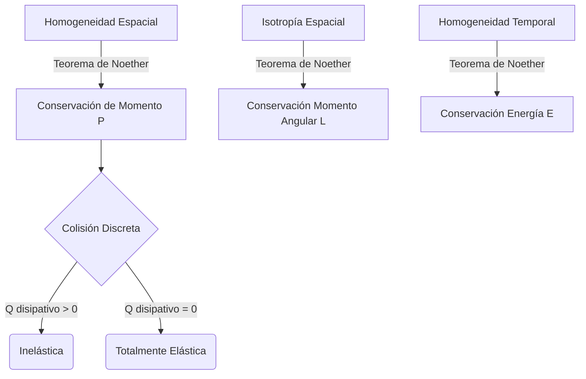

# Momento Lineal y Colisiones

El momento lineal y el impulso son conceptos fundamentales derivados de la segunda ley de Newton que nos permiten analizar sistemas de múltiples partículas y eventos bruscos, como choques y explosiones, sin necesidad de conocer los intrincados detalles de las fuerzas instantáneas.

## 📜 Contexto Histórico
El concepto fue introducido formalmente por **René Descartes** como *quantitas motus* (cantidad de movimiento), argumentando que esta cantidad se conservaba en el universo. **John Wallis** y **Christopher Wren**, contemporáneos de Newton, formularon las primeras reglas precisas de las colisiones elásticas e inelásticas, demostrando empíricamente la conservación del momento antes de que Newton la derivara rigurosamente de su Tercera Ley.

---

## 🧮 Desarrollo Teórico Profundo

El marco teórico asociado al momento (o cantidad de movimiento) ofrece herramientas potentísimas al trascender el estudio de fuerzas instantáneas. Abrazado firmemente en las simetrías inherentes del espacio por el teorema de Noether, este formalismo dicta pautas irrompibles sobre el destino final de sistemas interactuantes multicuerpo a lo largo del tiempo.

### 1. Dinámica Fundamental e Integral en Eventos Discretos

El vector momento lineal (o ímpetu) para un objeto o una partícula individual de masa invariante $m$ está dado por la relación directa en la métrica euclidiana $\vec{p} = m \vec{v}$.

**La Segunda Ley Generalizada**:
Si replanteamos axiomáticamente el Principio de Newton usando este invariante, permitiendo el estudio riguroso de cuerpos con transferencia de masa:
$$ \sum \vec{F} = \frac{d\vec{p}}{dt} = m \frac{d\vec{v}}{dt} + \vec{v} \frac{dm}{dt} $$
Esta reformulación es la base ineludible de la **Dinámica Estocástica Continua** (fricción de cohetes en lanzamiento asintótico donde se eyectan o adquieren propulsantes).

**Teorema de Impulso - Transferencia Discreta**:
En eventos cataclísmicos mecánicos de extremada brevedad temporal (como impactos, explosiones estelares o pelotazos), la función de la fuerza $\vec{F}(t)$ experimenta picos tipo función delta de Dirac en $t_0$. Si integramos en todo el dominio temporal infinitesimal del contacto $\Delta t \to \epsilon$:
$$ \vec{J} = \int_{t_0}^{t_0+\Delta t} \vec{F}(t) \, dt = \int_{\vec{p}_i}^{\vec{p}_f} d\vec{p} = \Delta\vec{p} $$
El Impulso Vectorial $\vec{J}$ se transfiere de inmediato, permitiendo puentear y esquivar analíticamente los procesos micro-deformativos del choque.

### 2. Teorema de Noether y Sistemas Continuos Aislados

Considerando un ensamble $N$-partículas de sub-masas $m_1, m_2...$, si la métrica espacial presenta **Homogeneidad Traslacional** (las leyes de la física son intrínsecamente independientes de "dónde" se sitúe el sistema en el vacío de universo cerrado), el teorema de Emmy Noether asegura formalmente una constante local de conservación del lagrangiano, que resulta ser justamente el vector del Momento Lineal Total $\vec{P}_{tot} = \sum_{j=1}^N \vec{p}_j$.
Esto se valida también derivando las sumatorias de las terceras leyes accionales ($\vec{F}_{ij} = - \vec{F}_{ji}$ cancela los vínculos inter-atomicos):
$$ \frac{d\vec{P}_{tot}}{dt} = \sum \vec{F}_{ext} $$
Si el ensamble no experimenta gradientes de campo de fondo perturbantes ($\sum \vec{F}_{ext} = 0$):
$$ \mathbf{\vec{P}_{tot} = Constante Vectorial} \implies m_1\vec{v}_{1,i} + m_2\vec{v}_{2,i} + ... = m_1\vec{v}_{1,f} + m_2\vec{v}_{2,f} + ... $$



### 3. Álgebra en Problemas de Dispersión Cuasi-Elástica

Dentro de los eventos resolutivos con restricción termodinámica ideal ($\Delta E_{cin} = 0$), las colisiones elásticas requieren manipular simultáneamente tensores cuadráticos y lineales de constancia.
Para un choque 1D entre $m_1$ y $m_2$ donde $v_{2i} = 0$:
1. $m_1 v_{1i} = m_1 v_{1f} + m_2 v_{2f}$
2. $\frac{1}{2}m_1 v_{1i}^2 = \frac{1}{2}m_1 v_{1f}^2 + \frac{1}{2}m_2 v_{2f}^2$

La manipulación matricial acoplada de ambas depara a las célebres soluciones modales cerradas:
$$ v_{1f} = \left(\frac{m_1 - m_2}{m_1 + m_2}\right) v_{1i} $$
$$ v_{2f} = \left(\frac{2m_1}{m_1 + m_2}\right) v_{1i} $$
Las asintóticas demuestran escenarios maravillosos:
- Si $m_1 = m_2$, los constituyentes ceden momento perfecto como partículas especulares (bolas de billar, péndulo de Newton).
- Si $m_1 \ll m_2$, rebote elástico a pared inamovible $v_{1f} \approx -v_{1i}$.
- Si $m_1 \gg m_2$, cañón empujando pluma a hipervelocidad $v_{2f} \approx 2v_{1i}$.

### 4. Tensor del Coeficiente de Restitución y Pérdidas Plásticas

Las restricciones microscópicas termodinámicas impiden el ideal elástico en la práctica; siempre hay desorden estructural asimétrico vibracional, fonones que disipan como sonido o roturas de malla ($K_{final} < K_{inicial}$). 
Esta inelásticidad macroscópica está encapsulada estocásticamente de modo pragmático dentro del **Coeficiente Empírico Restitutivo** $e$, el cual impone una métrica lineal sobre las magnitudes recesivas de la cinemática de aproximación y expansión a lo largo de la normal instantánea de contacto $\hat{n}$:
$$ e = \frac{\vec{v}_{separacion} \cdot \hat{n}}{\vec{v}_{aproximacion} \cdot \hat{n}} = \frac{v_{2f} - v_{1f}}{v_{1i} - v_{2i}} $$
Rango métrico:
- $e = 1$: Ideal elástico inafectado por gradientes de choque disipativos en su sección seccional de red.
- $0 < e < 1$: Regímenes cuasi y semi-inelásticos estables macroscópicos. Disipación parcial de $K$.
- $e = 0$: Choque Perfectamente Inelástico (soldadura total o impacto adherente plástico). Transferencia escalar de calor máxima, $\Delta K = - \frac{1}{2} \mu |\vec{v}_{1i} - \vec{v}_{2i}|^2$ donde $\mu$ es la masa reducida del dueto.

### 5. Mecánica del Centro de Masa (C.M.) y Transformaciones de Referencia

El paradigma matemático se simplifica operando en transformadas referenciales galileanas que anulan el momento agregado. El **Centro de Masa** constituye un pseudo-baricentro gravitacional topológico:
$$ \vec{R}_{CM} = \frac{1}{M_{tot}} \int \vec{r} \, dm $$
La velocidad del C.M., al ser ponderada por las masas, no es otra cosa que $\vec{v}_{CM} = \frac{\vec{P}_{tot}}{M_{tot}}$. Si no intervienen macro-fuerzas externas, $\vec{v}_{CM}$ es estrictamente inmodificable, ni colisiones estruendosas nucleares interrumpiéndolo le afectan en lo más mínimo.

El uso de un sistema coordinado móvil anclado a este punto ($S_{cm}$) hace que la sumatoria total del Momento del ensamble allí valga cero ($\vec{P}_{cm}^{tot} = \vec{0}$). Este "Zero-Momentum Frame" permite que todo colisionador cuántico actual (CERN, Fermilab) reduzca las geometrías de scattering angular 3D complejas de interacciones nucleónicas a distribuciones polares simples dependientes sólo de secciones transversales y ángulos esféricos, desacoplando la cinética del centroide virtual de las dinámicas relativas inelásticas.

---

## 🛠 Ejemplo Práctico: El Péndulo Balístico
Un bloque de madera de masa $M$ cuelga de dos cuerdas. Una bala de masa $m$ que viaja horizontalmente a velocidad $v_0$ se incrusta en el bloque. El conjunto se balancea hasta una altura máxima $h$. ¿Cuál era la velocidad inicial de la bala $v_0$?

**Solución**:
Este clásico problema se divide en dos fases distintas:
1. **Fase de Colisión (Completamente inelástica)**: 
   Las fuerzas impulsivas internas son inmensas, pero la fuerza externa neta horizontal es 0. Conservamos el momento, *pero no* la energía.
   $$ m v_0 = (m + M) V_{final} \implies V_{final} = \frac{m}{m+M} v_0 $$
2. **Fase de Balanceo (Conservación de Energía)**:
   La tensión de las cuerdas no hace trabajo. La única fuerza conservativa es la gravedad. Aquí se conserva la energía mecánica, *pero no* el momento (la gravedad actúa).
   Energía inicial de esta fase: $K = \frac{1}{2}(m+M)V_{final}^2$. Energía final: $U = (m+M)gh$.
   $$ \frac{1}{2}(m+M)V_{final}^2 = (m+M)gh \implies V_{final} = \sqrt{2gh} $$
3. **Igualando ecuaciones**:
   $$ \frac{m}{m+M} v_0 = \sqrt{2gh} \implies \mathbf{v_0 = \left(\frac{m+M}{m}\right) \sqrt{2gh}} $$

---

## 📝 Guía de Ejercicios Resueltos

**Problema 1: Ecuación del Cohete de Tsiolkovsky en Campo Gravitatorio**
Un cohete de masa inicial $M_0$ despega verticalmente desde la Tierra. Su motor eyecta gases hacia abajo a una velocidad de escape constante relativa al cohete, $v_e$, y a una tasa másica de quema constante $\frac{dm}{dt} = -\alpha$. Calcule la velocidad $v(t)$ del cohete en función del tiempo considerando gravedad constante $g$.
**Solución paso a paso:**
1. Usamos la Segunda Ley de Newton para un sistema de masa variable. El momento inicial del sistema cohete+gases evaluado en $t$ es $p(t) = m v$.
2. En el instante $t + dt$, la masa del cohete es $m + dm$ (donde $dm < 0$) y su velocidad es $v + dv$. La masa del gas eyectado es $-dm$ y viaja con velocidad $v - v_e$ relativa a la Tierra.
3. El momento en $t+dt$ es $p(t+dt) = (m+dm)(v+dv) + (-dm)(v - v_e) = mv + m dv + v dm + dv dm - v dm + v_e dm$. Despreciando el diferencial cuadrático, $dp = p(t+dt) - p(t) = m dv + v_e dm$.
4. Según Newton, $\frac{dp}{dt} = \sum F_{ext} = -mg$.
5. Sustituimos: $m \frac{dv}{dt} + v_e \frac{dm}{dt} = -mg$.
6. Dividimos por la masa $m$: $dv = -v_e \frac{dm}{m} - g dt$.
7. Integramos desde el estado inicial ($t=0, v=0, m=M_0$) hasta el instante $t$ (masa $m(t) = M_0 - \alpha t$):
   $\int_0^v dv' = -v_e \int_{M_0}^{m} \frac{dm'}{m'} - g \int_0^t dt'$.
8. $v(t) = -v_e \ln\left(\frac{m}{M_0}\right) - gt = v_e \ln\left(\frac{M_0}{m}\right) - gt$.
9. Escrito explícitamente en función de $t$:
   $v(t) = v_e \ln\left( \frac{M_0}{M_0 - \alpha t} \right) - gt$. (Condición: $\alpha v_e > M_0 g$ para levantar vuelo).

**Problema 2: Dispersión 2D, colisión elástica en sistema Centro de Masa (CM)**
Una partícula incidente de masa $m$ y velocidad $v_0\hat{i}$ colisiona elásticamente con otra idéntica de masa $m$ en reposo. Demuestre que el ángulo final entre los vectores velocidad de salida de ambas partículas es siempre de $90^\circ$ en el sistema del Laboratorio, empleando las propiedades geométricas del referencial de centro de masa.
**Solución paso a paso:**
1. En el referencial del Laboratorio (Lab), conservación de la energía y momento:
   $m v_0^2 = m v_1^2 + m v_2^2 \implies v_0^2 = v_1^2 + v_2^2$.
   $m \vec{v}_0 = m \vec{v}_1 + m \vec{v}_2 \implies \vec{v}_0 = \vec{v}_1 + \vec{v}_2$.
2. De la conservación vectorial, elevamos el momento al cuadrado mediante el producto escalar:
   $\vec{v}_0 \cdot \vec{v}_0 = (\vec{v}_1 + \vec{v}_2) \cdot (\vec{v}_1 + \vec{v}_2)$.
   $v_0^2 = v_1^2 + v_2^2 + 2\vec{v}_1 \cdot \vec{v}_2$.
3. Combinando esto con la conservación de energía ($v_0^2 = v_1^2 + v_2^2$):
   $v_1^2 + v_2^2 = v_1^2 + v_2^2 + 2\vec{v}_1 \cdot \vec{v}_2 \implies 2\vec{v}_1 \cdot \vec{v}_2 = 0$.
4. Si las velocidades de salida son no nulas, el producto escalar nulo implica que el coseno de su ángulo relativo es 0, ergo son estrictamente perpendiculares ($90^\circ$).
5. **Comprobación alterna desde CM**: La velocidad del CM es $\vec{V}_{cm} = \frac{m v_0 \hat{i}}{2m} = \frac{v_0}{2} \hat{i}$. En el marco de CM, las partículas se aproximan frontalmente con idéntica celeridad $\pm \frac{v_0}{2}$. Al ser elástica la colisión, ambas salen con la misma celeridad $\frac{v_0}{2}$ pero dispersadas en sentidos diametralmente opuestos formando un ángulo $\theta_{cm}$.
   $\vec{u}_1 = \frac{v_0}{2}(\cos\theta \hat{i} + \sin\theta \hat{j})$, $\vec{u}_2 = \frac{v_0}{2}(-\cos\theta \hat{i} - \sin\theta \hat{j})$.
   Volviendo al Lab: $\vec{v}_1 = \vec{u}_1 + \vec{V}_{cm} = \frac{v_0}{2}( (\cos\theta+1)\hat{i} + \sin\theta \hat{j} )$.
   $\vec{v}_2 = \vec{u}_2 + \vec{V}_{cm} = \frac{v_0}{2}( (-\cos\theta+1)\hat{i} - \sin\theta \hat{j} )$.
   Evaluamos el producto escalar: $\vec{v}_1 \cdot \vec{v}_2 = \frac{v_0^2}{4}[ (1+\cos\theta)(1-\cos\theta) - \sin^2\theta ] = \frac{v_0^2}{4}[ 1 - \cos^2\theta - \sin^2\theta ] = 0$. ¡C.Q.D.!

**Problema 3: Refracción mecánica inelástica en frontera**
Una densa lámina macroscópica se comporta como una interfaz absorbente de momento normal (inercia superficial). Una bolita rebota sobre esta lámina plana infinita con un coeficiente de restitución $e \in (0,1)$. Si la bolita impacta con un ángulo de incidencia $\theta_i$ (medido desde la normal al plano) y velocidad $V_i$, determine el ángulo de reflexión $\theta_r$ y la pérdida total de energía cinética $\Delta K$.
**Solución paso a paso:**
1. Descomponemos el vector de velocidad incidente en componente paralela $V_{ix} = V_i \sin\theta_i$ y componente normal $V_{iy} = -V_i \cos\theta_i$.
2. Al no existir fuerzas de fricción tangenciales durante el impacto instantáneo, la cantidad de movimiento paralela se conserva:
   $m V_{fx} = m V_{ix} \implies V_{fx} = V_i \sin\theta_i$.
3. La componente normal pierde energía mediante la colisión cuasi-plástica, regida por el coeficiente $e = -\frac{V_{fy}}{V_{iy}}$ (fórmula de Newton para impacto en superficie inamovible):
   $V_{fy} = -e V_{iy} = e V_i \cos\theta_i$.
4. El ángulo de salida $\theta_r$ (medido desde la normal saliente) se determina evaluando la relación trigonométrica final:
   $\tan\theta_r = \frac{V_{fx}}{V_{fy}} = \frac{V_i \sin\theta_i}{e V_i \cos\theta_i} = \frac{\tan\theta_i}{e}$.
   Esto revela un resultado anómalo fascinante: como $e < 1$, $\tan\theta_r > \tan\theta_i$, lo que implica que en choques disipativos macroscópicos los objetos siempre "salen más a ras de suelo" de lo que entraron.
5. Determinación de $\Delta K$:
   Energía Inicial $K_i = \frac{1}{2}m (V_{ix}^2 + V_{iy}^2) = \frac{1}{2}m V_i^2$.
   Energía Final $K_f = \frac{1}{2}m (V_{fx}^2 + V_{fy}^2) = \frac{1}{2}m (V_i^2 \sin^2\theta_i + e^2 V_i^2 \cos^2\theta_i)$.
6. La pérdida es $\Delta K = K_f - K_i = \frac{1}{2}m V_i^2 (\sin^2\theta_i + e^2 \cos^2\theta_i - 1)$.
7. Sustituyendo $1 - \sin^2\theta_i = \cos^2\theta_i$:
   $\Delta K = \frac{1}{2}m V_i^2 \cos^2\theta_i (e^2 - 1)$. Como $e < 1$, el valor es negativo indicando disipación, localizándose toda la merma térmica pura y exclusivamente en el vector de movimiento perpendicular al plano.

## 💻 Simulaciones Computacionales

Simulación de choque elástico 2D entre dos discos duros. El código ilustra la conservación de energía y del momento lineal en una dispersión (scattering).

```python
import numpy as np
import matplotlib.pyplot as plt

# Masas y radios
m1, m2 = 1.0, 1.0
r1, r2 = 0.5, 0.5

# Posiciones y velocidades iniciales
p1 = np.array([-2.0, 0.2])
v1 = np.array([1.0, 0.0])
p2 = np.array([2.0, 0.0])
v2 = np.array([-0.5, 0.0])

dt = 0.01
t = 0
positions1, positions2 = [], []

while np.linalg.norm(p1 - p2) > (r1 + r2) and t < 5:
    p1 += v1 * dt
    p2 += v2 * dt
    positions1.append(p1.copy())
    positions2.append(p2.copy())
    t += dt

# Colisión (elástica)
n = (p1 - p2) / np.linalg.norm(p1 - p2) # vector normal
v_rel = v1 - v2
v_rel_n = np.dot(v_rel, n)

if v_rel_n < 0:
    j = -(2 * v_rel_n) / (1/m1 + 1/m2)
    v1 += j * n / m1
    v2 -= j * n / m2

while t < 10:
    p1 += v1 * dt
    p2 += v2 * dt
    positions1.append(p1.copy())
    positions2.append(p2.copy())
    t += dt

pos1 = np.array(positions1)
pos2 = np.array(positions2)

plt.figure(figsize=(8, 4))
plt.plot(pos1[:,0], pos1[:,1], label='Partícula 1', color='blue')
plt.plot(pos2[:,0], pos2[:,1], label='Partícula 2', color='red')
plt.scatter([pos1[0,0]], [pos1[0,1]], color='blue', marker='o')
plt.scatter([pos2[0,0]], [pos2[0,1]], color='red', marker='o')
plt.title('Scattering Elástico 2D (Choque Descentrado)')
plt.xlabel('X')
plt.ylabel('Y')
plt.legend()
plt.grid(True)
plt.show()
```

## 📚 Recursos Específicos de Momento y Colisiones

### 🎓 Cursos y Clases Recomendadas (5-7)
1. **[MIT 8.01 - Momentum and Collisions (Walter Lewin)](https://ocw.mit.edu/courses/8-01sc-classical-mechanics-fall-2016/pages/week-5-momentum-and-impulse/)**: Impresionantes demostraciones de choques en rieles de aire sin fricción y conservación vectorial.
2. **[Yale PHYS 200 - Lecture 11: Conservation of Momentum](https://oyc.yale.edu/physics/phys-200/lecture-11)**: Profundo vínculo entre la simetría traslacional del espacio y el teorema de Noether.
3. **[Khan Academy - Momento Lineal e Impulso](https://es.khanacademy.org/science/physics/linear-momentum)**: Ejercicios para interiorizar cálculos 1D y 2D en colisiones elásticas e inelásticas.
4. **[Coursera - Physics 101 - Forces and Kinematics (Rice University)](https://www.coursera.org/learn/physics-101-forces-kinematics)**: Buena sección dedicada al impulso, coeficientes de restitución y conservación de sistemas cerrados.
5. **[edX - Momentum and Energy (MITx)](https://www.edx.org/course/mechanics-momentum-and-energy)**: Desafíos matemáticos y problemas prácticos analizando la energía perdida en las explosiones y choques inelásticos.

### 📝 Artículos, Simulaciones e Interactivos (8-10)
1. **Artículo**: [Conservation of Momentum (HyperPhysics)](http://hyperphysics.phy-astr.gsu.edu/hbase/conser.html) - Mapas conceptuales excelentes con desgloses de ecuaciones para colisiones.
2. **Simulador**: [PhET - Laboratorio de Colisiones](https://phet.colorado.edu/es/simulations/collision-lab) - Crea colisiones 1D y 2D elásticas e inelásticas, midiendo los vectores $p$ y $K$ en tiempo real.
3. **Video Educativo**: [SmarterEveryDay - Ver balas impactar a cámara superlenta](https://www.youtube.com/watch?v=QfDoQwIAaXg) - Un acercamiento fenomenal muy visual y tangible a las colisiones puramente inelásticas.
4. **Artículo**: [Centro de Masas (Wikipedia)](https://es.wikipedia.org/wiki/Centro_de_masas) - Repaso matemático sobre los cálculos continuos (integrales) de distribuciones asimétricas.
5. **Simulador**: [Walter Fendt - Choque Elástico e Inelástico](https://www.walter-fendt.de/html5/phes/collision_es.htm) - Un applet clásico para probar fórmulas de coeficientes de restitución.
6. **Artículo**: [Rocket Equation of Tsiolkovsky (Scholarpedia)](http://www.scholarpedia.org/article/Tsiolkovsky_rocket_equation) - Estudio riguroso de cómo el momento lineal permite el viaje espacial arrojando masa hacia atrás.
7. **Video Analítico**: [Veritasium - The Bizarre Behavior of Rotating Bodies](https://www.youtube.com/watch?v=1n-HMSCDYtM) - Aunque mezcla momento angular, muestra la importancia crítica del centro de masa en colisiones excéntricas.
8. **Simulador**: [GeoGebra - Péndulo Balístico](https://www.geogebra.org/m/eUDBxK8B) - Explora las dos fases de este histórico sistema y cómo la energía se disipa.

### 📖 Referencias Útiles y Bibliografía
- **[Classical Dynamics of Particles and Systems (Marion & Thornton)](https://www.cengage.com/c/classical-dynamics-of-particles-and-systems-5e-thornton/9780534408961/)**: Contiene uno de los mejores capítulos para dominar el paso del referencial de Laboratorio al referencial del Centro de Masa.
- **[Classical Mechanics (John R. Taylor)](https://uscibooks.aip.org/books/classical-mechanics/)**: Excepcional explicación intuitiva y formal del uso del centro de masa, así como de sistemas de masa variable (cohetes y cadenas cayendo).
- **[Introduction to Classical Mechanics (David Morin)](https://www.cambridge.org/highereducation/books/introduction-to-classical-mechanics/31CB8B93623D3F14E1EE98B223D1DE47)**: Tiene decenas de problemas endiablados sobre colisiones en 2D e interacciones relativas que destrozan la intuición básica.
- **[Física Universitaria (Sears & Zemansky)](https://www.pearson.com/en-us/subject-catalog/p/university-physics-with-modern-physics/P200000003295/9780135159552)**: Extenso banco de ejercicios estándar de choques de billar, balas y bloques pendulares de obligada resolución para estudiantes.
- **[The Feynman Lectures on Physics (Vol 1)](https://www.feynmanlectures.caltech.edu/I_toc.html)**: Feynman ahonda en cómo la simetría y las leyes de conservación de colisiones son más fundamentales que el propio concepto de "fuerza".
