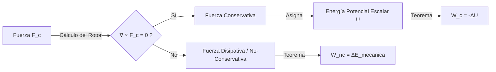

# Trabajo y Energía

Mientras que las Leyes de Newton permiten resolver ecuaciones de movimiento vectorial instantáneo, el enfoque energético se basa en leyes de conservación escalares. Este paradigma matemático a menudo simplifica radicalmente los problemas físicos complejos.

## 📜 Contexto Histórico
El concepto de "fuerza viva" (*vis viva*, lo que hoy llamamos energía cinética) fue propuesto originalmente por **Gottfried Leibniz**, gran rival de Newton. Sin embargo, no fue hasta el siglo XIX cuando científicos como Thomas Young, Émilie du Châtelet, James Prescott Joule y Lord Kelvin formalizaron matemáticamente los conceptos de Trabajo y Energía, demostrando que el calor y el movimiento mecánico son formas equivalentes de una misma cantidad que se conserva.

---

## 🧮 Desarrollo Teórico Profundo

El uso de los teoremas de campo energético en Mecánica Clásica no solo representa un cambio pragmático al obviar vectores para operar con escalares matemáticos dóciles; en la formulación de Lagrange y de Hamilton, los campos potenciales invariantes se convierten intrínsecamente en la entidad ontológica de la que deriva el espacio de fases entero a través del Principio de Mínima Acción.

### 1. Formulación del Trabajo como Integral de Trayectoria Paramétrica

El "Trabajo Termodinámico y Mecánico" $W$ transmitido por un campo vectorial de Fuerza $\vec{F}(\vec{r})$ a un cuerpo en traslación desde la topología punto $A$ al $B$, a lo largo de una curva paramétrica de desplazamiento diferenciable en el hiperespacio $C(\vec{r}(t))$, queda modelado rigurosamente como una integral de línea covariante.
$$ W = \int_C \vec{F} \cdot d\vec{r} $$
Esta integración acusa al espacio interno del producto escalar, decodificando que las asimetrías de interacciones puramente transversales no trasmiten variaciones cinemáticas; $\vec{F} \perp d\vec{r} \implies \vec{F} \cdot d\vec{r} = 0$. Solo se realiza trabajo neto si hay proyección cosinusoidal sobre la tangente del movimiento espaciotemporal:
$$ W = \int_A^B |\vec{F}| \cos\theta \, ds $$

### 2. Teorema Fuerte del Trabajo y Energía Cinética Escalar

Utilizando la Segunda Ley como identidad intrínseca de acoplamiento diferencial ($\vec{F}_{net} = m \frac{d\vec{v}}{dt}$) y el puente cinemático $d\vec{r} = \vec{v} dt$, se infiere analíticamente el primer gran teorema innegable de la mecánica continua macroscópica:
$$ W_{neto} = \int_C \left( m \frac{d\vec{v}}{dt} \right) \cdot (\vec{v} dt) = m \int_A^B \left( \frac{1}{2} \frac{d}{dt}(\vec{v} \cdot \vec{v}) \right) dt $$
$$ W_{neto} = \frac{1}{2}m (\vec{v} \cdot \vec{v})\Big|_B - \frac{1}{2}m (\vec{v} \cdot \vec{v})\Big|_A = \Delta K $$
Este teorema es abrumadoramente robusto, dado que liga el *total global del trabajo de cualquier fuerza combinada* con la variación simple de un campo métrico positivo definido $K = \frac{1}{2}mv^2$ de una partícula libre.

### 3. Operadores Vectoriales y el Condicional Funcional de la Conservación

Un aspecto radical e insustituible del análisis de superficies tridimensionales vectoriales establece que existe una selecta raza de campos de fuerza cuyo flujo integral de línea *es ajeno a la ruta topológica $C$ tomada entre dos puntos*. A estos campos determinísticos se les llama **Conservativos**.
Matemáticamente, para toda ruta cerrada continua en un campo simplemente conexo:
$$ \oint_C \vec{F}_c \cdot d\vec{r} = 0 $$
Por el Teorema de Stokes del diferencial de superficies, la identidad se colapsa a la condición irrotacional de la nulidad asintótica del rotor (Curl):
$$ \nabla \times \vec{F}_c = \vec{0} $$
Si, y solo si se cumple esto, el teorema fundamental de los gradientes funcionales dictamina que $\vec{F}_c$ puede expresarse unívocamente como el gradiente descendente de una superficie escalar subyacente determinística dependiente solo de las coordenadas, conocida como Energía Potencial $U(\vec{r})$:
$$ \vec{F}_c = - \nabla U(\vec{r}) = - \left( \frac{\partial U}{\partial x} \hat{i} + \frac{\partial U}{\partial y} \hat{j} + \frac{\partial U}{\partial z} \hat{k} \right) $$
El signo menos simboliza que los sistemas inerciales buscan incesantemente minimizar su $U$, deslizando por los gradientes hacia las depresiones y valles de los pozos de potencial subyacente espacial.



### 4. Simetrías Temporales e Identidad de la Energía Mecánica Global

Al acoplar el Teorema Fuerte de Trabajo con la existencia de estos campos escalares potenciales puros, los integrandos asombrosamente se balancean en la formulación:
$$ W_{neto} = W_{conservativos} + W_{no-conservativos} $$
$$ \Delta K = -\Delta U + W_{nc} \implies \Delta(K + U) = W_{nc} $$
Si el entorno está aislado asintóticamente de perturbadores externos no modelables disipativos friccionales o convectivos ($W_{nc} = 0$), el acoplamiento global invariante termodinámico de la suma $E = K + U$ permanece indomeñable frente al paso del cronómetro.
$$ \mathbf{\frac{dE}{dt} = 0 \implies E_{inicial} = E_{final}} $$

### 5. Curvas de Estabilidad y Pozos Potenciales Parabólicos (Oscilador Armónico)

Cualquier sistema atrapado asimétricamente en el fondo de un pozo de potencial elástico, gravitacional o atómico $U(x)$, y sometido a exiguas perturbaciones dinámicas con respecto al punto base de equilibrio metaestable local $x_0$, puede analizarse deparando la Expansión Lineal por Series de Taylor de la energía local:
$$ U(x) \approx U(x_0) + \left.\frac{dU}{dx}\right|_{x_0}(x-x_0) + \frac{1}{2}\left.\frac{d^2U}{dx^2}\right|_{x_0}(x-x_0)^2 + ... $$
Dado que $x_0$ representa un punto de quietud estructural estática $\vec{F} = -dU/dx = 0$, el primer término de derivadas cruzadas depara en cero absoluto. Redefiniendo las constantes subyacentes e imponiendo la segunda derivada local evaluada como resorte fundamental restitutivo equivalente $k_{eff} = \left.\frac{d^2U}{dx^2}\right|_{x_0}$:
$$ U(x) \approx \frac{1}{2} k_{eff} \Delta x^2 $$
Esta es la poderosa e indeleble prueba de que *todo sistema* del cosmos que oscile suavemente cerca del mínimo estable y absoluto energético de su campo natural reaccionará mimetizándose en el modelo analítico de la **Ley de Hooke (Oscilador Armónico Simple)**.

---

## 🛠 Ejemplo Práctico: Péndulo y Velocidad Máxima
Un péndulo de masa $m$ y cuerda de longitud $L$ se suelta desde el reposo con un ángulo horizontal ($\theta = 90^\circ$). ¿Cuál es la velocidad en el punto más bajo (la vertical)?

**Solución por Newton**: Increíblemente compleja porque la tensión de la cuerda cambia constantemente de magnitud y dirección, afectando la aceleración instantánea.
**Solución por Energía**: Trivíal y elegante.
1. Tomamos como referencia de energía potencial cero ($U=0$) el punto más bajo del péndulo.
2. Estado Inicial (Posición horizontal): $v_i = 0 \implies K_i = 0$. Altura $h_i = L$. $U_i = mgL$. $E_i = mgL$.
3. Estado Final (Punto más bajo): Altura $h_f = 0 \implies U_f = 0$. Velocidad $v_f$ desconocida. $K_f = \frac{1}{2}mv_f^2$.
4. Como la tensión de la cuerda hace $W=0$ (siempre es perpendicular al movimiento), la energía se conserva:
   $$ E_i = E_f \implies mgL = \frac{1}{2}mv_f^2 $$
5. Despejando $v_f$:
   $$ \mathbf{v_f = \sqrt{2gL}} $$

---

## 📝 Guía de Ejercicios Resueltos

**Problema 1: Partícula en potencial de Morse intermolecular**
El potencial de interacción entre dos átomos diatómicos se aproxima mediante el potencial de Morse: $U(r) = D_e [1 - e^{-a(r - r_e)}]^2$, donde $D_e$ es la profundidad del pozo, $r_e$ la distancia de equilibrio y $a$ una constante de anchura. Encuentre la constante de elasticidad efectiva $k_{eff}$ para oscilaciones muy pequeñas alrededor del equilibrio.
**Solución paso a paso:**
1. Para encontrar el punto de equilibrio, buscamos $r$ tal que la fuerza sea nula: $F = -\frac{dU}{dr} = 0$.
2. $\frac{dU}{dr} = 2 D_e [1 - e^{-a(r - r_e)}] (-e^{-a(r - r_e)})(-a) = 2 a D_e e^{-a(r - r_e)} [1 - e^{-a(r - r_e)}]$.
3. Igualando a cero, deducimos que el corchete debe anularse: $1 - e^{-a(r - r_e)} = 0 \implies e^{-a(r - r_e)} = 1 \implies r = r_e$. (El equilibrio está en $r_e$).
4. Para hallar $k_{eff}$, calculamos la segunda derivada evaluada en el equilibrio $r=r_e$.
5. Derivamos la expresión $\frac{dU}{dr} = 2 a D_e (e^{-a(r-r_e)} - e^{-2a(r-r_e)})$.
6. $\frac{d^2U}{dr^2} = 2 a D_e ( -a e^{-a(r-r_e)} - (-2a) e^{-2a(r-r_e)} ) = 2 a^2 D_e ( 2 e^{-2a(r-r_e)} - e^{-a(r-r_e)} )$.
7. Evaluando en $r = r_e$, la exponencial se hace 1:
   $k_{eff} = \left. \frac{d^2U}{dr^2} \right|_{r_e} = 2 a^2 D_e ( 2(1) - 1 ) = 2 a^2 D_e$.
8. Esta constante permite modelar la vibración atómica en infrarrojo como un oscilador armónico simple $E_n = \hbar \sqrt{\frac{2 a^2 D_e}{\mu}} (n + \frac{1}{2})$.

**Problema 2: Teorema del Trabajo para masa deslizante sobre una cuña móvil**
Una masa pequeña $m$ se suelta desde la cima de una cuña triangular de masa $M$ y altura $h$, apoyada sin fricción sobre un suelo horizontal. La superficie de la cuña también carece de fricción. Utilizando estrictamente conservación de momento y energía, halle la velocidad de la cuña $V$ justo cuando la masita llega al suelo.
**Solución paso a paso:**
1. No hay fuerzas externas netas en la dirección horizontal (la gravedad y normales apuntan en $y$). Se conserva el momento horizontal:
   $\vec{P}_{tot, x} = 0 \implies m v_x + M V = 0 \implies v_x = -\frac{M}{m}V$.
2. Note que $V$ es la velocidad de la cuña en el referencial inercial del laboratorio. La masita desliza a lo largo del perfil de la cuña. Su velocidad relativa a la cuña es paralela al perfil inclinado $\theta$.
3. Sea $u$ la velocidad relativa de $m$ a lo largo de la cuña. La velocidad absoluta de $m$ es $\vec{v}_m = \vec{u} + \vec{V} = (u\cos\theta - V)\hat{i} - u\sin\theta\hat{j}$.
4. Del paso 1, $v_x = u\cos\theta - V = -\frac{M}{m}V$.
5. Despejamos la velocidad relativa: $u\cos\theta = V - \frac{M}{m}V = V\left(1 - \frac{M}{m}\right)$. Por tanto, $u = \frac{V(1 - M/m)}{\cos\theta}$. (Nota: Considerando signos, asumimos $V$ hacia la izquierda, y $m$ resbala a la derecha, de modo que $m v_x = M V$, lo que da $u\cos\theta - V = \frac{M}{m}V \implies u = \frac{(M+m)V}{m\cos\theta}$).
6. Conservación de energía mecánica: el sistema completo aislado intercambia energía potencial por cinética.
   $E_i = mgh$.
   $E_f = \frac{1}{2}MV^2 + \frac{1}{2}m(v_x^2 + v_y^2)$.
7. Expresamos la celeridad cuadrada absoluta de la masita:
   $v_m^2 = v_x^2 + v_y^2 = \left(\frac{M}{m}V\right)^2 + (-u\sin\theta)^2$.
8. Reemplazando $u$:
   $v_m^2 = \left(\frac{M}{m}V\right)^2 + \left(\frac{(M+m)V\sin\theta}{m\cos\theta}\right)^2 = \frac{V^2}{m^2} \left[ M^2 + (M+m)^2 \tan^2\theta \right]$.
9. Igualamos en la ecuación de energía:
   $mgh = \frac{1}{2}MV^2 + \frac{1}{2}m \left( \frac{V^2}{m^2} \left[ M^2 + (M+m)^2 \tan^2\theta \right] \right)$.
10. Despejamos $V$:
    $2m^2 gh = m M V^2 + V^2 [ M^2 + (M+m)^2 \tan^2\theta ] = V^2 [ mM + M^2 + (M+m)^2 \tan^2\theta ] = V^2 (M+m)[ M + (M+m)\tan^2\theta ]$.
    $V = \sqrt{\frac{2m^2 gh}{(M+m)(M + (M+m)\tan^2\theta)}}$.

**Problema 3: Fuerzas no conservativas y bucle con rozamiento**
Un pequeño bloque resbala por un bucle circular (loop-the-loop) vertical de radio $R$. Entra por la base inferior con velocidad $v_0$. El bucle no es liso; ejerce una fuerza de fricción viscosa proporcional a la velocidad angular del bloque $\vec{f} = -b \omega \hat{e}_\theta = -b \frac{v}{R} \hat{e}_\theta$. ¿Cuánto trabajo realiza esta fuerza friccional cuando el bloque llega a un ángulo $\theta$ desde la parte inferior?
**Solución paso a paso:**
1. Planteamos el teorema de las fuerzas vivas diferencialmente: $dW = dK$.
2. $dW = dW_g + dW_{nc} = (-mg \sin\theta) (R d\theta) - \left(b \frac{v}{R}\right) (R d\theta)$.
3. Escribimos la energía cinética diferencialmente: $dK = d(\frac{1}{2}mv^2) = mv dv$.
4. Igualamos: $mv \frac{dv}{d\theta} d\theta = (-mgR \sin\theta - bv) d\theta$.
5. Ecuación diferencial para la velocidad: $mv \frac{dv}{d\theta} + bv = -mgR \sin\theta$.
6. Si bien es posible resolverla (EDO no lineal), el problema pide el trabajo total. Sabemos que $W_{nc} = \int -bv d\theta$.
7. Como $v = R \frac{d\theta}{dt}$, el diferencial temporal surge mágicamente:
   $W_{nc} = \int_{0}^{\theta} -b \left(R \frac{d\theta'}{dt}\right) d\theta' = -b R \int_0^\theta \frac{d\theta'}{dt} d\theta'$.
   Cambiando la variable de integración temporal: $d\theta' = \omega dt$.
   $W_{nc} = -b R \int_{0}^{t(\theta)} \omega^2 dt$.
8. Esta forma integral denota precisamente la función de disipación de Rayleigh. Evaluada cinemáticamente, drena la celeridad según la historia temporal del paso de la partícula por la curva.

## 💻 Simulaciones Computacionales

Mapeo de las líneas equipotenciales y simulación de la trayectoria de una partícula conservativa en un pozo de potencial de Lennard-Jones (interacción molecular).

```python
import numpy as np
import matplotlib.pyplot as plt
from scipy.integrate import solve_ivp

def lennard_jones_potential(x, y):
    r = np.hypot(x, y)
    r = np.clip(r, 0.8, None) # Evitar singularidad
    return 4 * ((1/r)**12 - (1/r)**6)

def force_field(x, y):
    r = np.hypot(x, y)
    r = np.clip(r, 0.8, None)
    F_mag = 4 * (12*(1/r)**13 - 6*(1/r)**7)
    return F_mag * (x/r), F_mag * (y/r)

def motion(t, state):
    x, y, vx, vy = state
    fx, fy = force_field(x, y)
    return [vx, vy, fx, fy]

# Resolver trayectoria
sol = solve_ivp(motion, [0, 5], [2.0, 0.5, -0.5, -0.2], t_eval=np.linspace(0, 5, 500))

X, Y = np.meshgrid(np.linspace(-3, 3, 100), np.linspace(-3, 3, 100))
Z = lennard_jones_potential(X, Y)

plt.figure(figsize=(8, 6))
cp = plt.contourf(X, Y, np.clip(Z, -2, 2), levels=30, cmap='viridis')
plt.colorbar(cp, label='Energía Potencial $U(x,y)$')
plt.plot(sol.y[0], sol.y[1], color='red', linewidth=2, label='Trayectoria')
plt.scatter([0], [0], color='white', marker='x', s=100, label='Centro de Fuerza')
plt.title('Conservación de Energía en Potencial de Lennard-Jones')
plt.xlabel('X')
plt.ylabel('Y')
plt.legend()
plt.show()
```

## 📚 Recursos Específicos de Trabajo y Energía

### 🎓 Cursos y Clases Recomendadas (5-7)
1. **[MIT 8.01 - Work and Energy (Walter Lewin)](https://ocw.mit.edu/courses/8-01sc-classical-mechanics-fall-2016/pages/week-4-work-and-energy/)**: Un bloque magistral que muestra el inmenso poder de las leyes de conservación para evitar las engorrosas ecuaciones diferenciales directas.
2. **[Yale PHYS 200 - Lecture 4: Conservation of Energy](https://oyc.yale.edu/physics/phys-200/lecture-4)**: Shankar formaliza brillantemente el trabajo mecánico como una integral de línea y el uso del operador gradiente para el potencial.
3. **[Khan Academy - Trabajo y Energía](https://es.khanacademy.org/science/physics/work-and-energy)**: Excelente progresión desde el cálculo de nivel básico hasta temas intermedios usando resortes (Ley de Hooke).
4. **[Coursera - Introduction to Mechanics, Part 1 (Rice University)](https://www.coursera.org/learn/physics-101-forces-kinematics)**: Un análisis en profundidad de la energía mecánica, fuerzas no conservativas y máquinas simples.
5. **[edX - Dynamics and Energy (MITx)](https://www.edx.org/course/mechanics-momentum-and-energy)**: Simulaciones interactivas enfocadas a comprender los pozos de potencial y los puntos de equilibrio estable e inestable.

### 📝 Artículos, Simulaciones e Interactivos (8-10)
1. **Artículo / Matemática**: [Gradient, Divergence and Curl (Math is Fun)](https://www.mathsisfun.com/calculus/gradient-divergence-curl.html) - Para comprender qué significa el teorema $ec{F} = -
abla U$ y las fuerzas conservativas.
2. **Artículo Histórico**: [James Prescott Joule and the Conservation of Energy](https://www.aps.org/publications/apsnews/201507/physicshistory.cfm) - El fascinante experimento de las paletas y la deducción del equivalente mecánico del calor.
3. **Simulador**: [PhET - Energía en la Pista de Patinaje](https://phet.colorado.edu/es/simulations/energy-skate-park) - Para entender visualmente el trasvase continuo entre cinética, potencial gravitacional y térmica.
4. **Simulador**: [PhET - Masas y Resortes](https://phet.colorado.edu/es/simulations/masses-and-springs) - Conservación de la energía mecánica con sistemas que implican Energía Potencial Elástica oscilante.
5. **Video/Visualización**: [SmarterEveryDay - Pendulum demonstration](https://www.youtube.com/watch?v=02w9lSii_Hs) - Intuición física extrema en la vida real confiando en la conservación de $E$.
6. **Artículo**: [Work and Kinetic Energy (HyperPhysics)](http://hyperphysics.phy-astr.gsu.edu/hbase/work.html) - Resumen conciso sobre el teorema fundamental trabajo-energía para fuerzas escalares netas.
7. **Simulador**: [GeoGebra - Pozo de Potencial Oscilador Armónico](https://www.geogebra.org/m/jJjF4D3d) - Explora cómo las partículas están atrapadas en valles de potencial parabólico (resortes).
8. **Video Analítico**: [Veritasium - Surprising Applications of the Magnus Effect](https://www.youtube.com/watch?v=2OSrvzNW9FE) - Cuando las fuerzas no conservativas consumen energía mecánica para alterar trayectorias.

### 📖 Referencias Útiles y Bibliografía
- **[Classical Mechanics (John R. Taylor)](https://uscibooks.aip.org/books/classical-mechanics/)**: Incluye un análisis fenomenal sobre la oscilación en torno a mínimos de potencial genéricos, expandiendo la energía en series de Taylor.
- **[Classical Dynamics of Particles and Systems (Marion & Thornton)](https://www.cengage.com/c/classical-dynamics-of-particles-and-systems-5e-thornton/9780534408961/)**: Sus primeros capítulos asientan el formalismo de la integral de trayectoria y el uso exhaustivo de campos gradientes.
- **[Classical Mechanics (Herbert Goldstein)](https://en.wikipedia.org/wiki/Classical_Mechanics_(Goldstein_book))**: Fundamento clave para saltar hacia la formulación Lagrangiana; reescribe toda la física basada en el Principio de Hamilton de la Mínima Acción.
- **[Física Universitaria (Sears & Zemansky)](https://www.pearson.com/en-us/subject-catalog/p/university-physics-with-modern-physics/P200000003295/9780135159552)**: Una cantidad enorme de ejemplos prácticos sobre conservación, bucles circulares (loop-the-loop) y potencias de sistemas de tracción.
- **[The Feynman Lectures on Physics (Vol 1, Cap. 4)](https://www.feynmanlectures.caltech.edu/I_04.html)**: Considerada por muchos como la mejor exposición conceptual escrita sobre qué "es" la energía.
