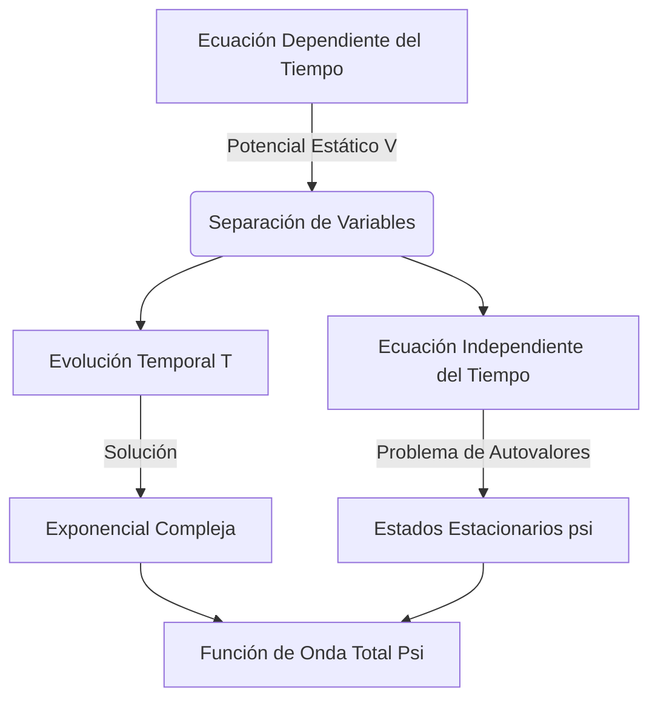

# La Ecuación de Schrödinger

La ecuación de Schrödinger es la piedra angular de la mecánica cuántica no relativista, análoga a la segunda ley de Newton en la mecánica clásica. Describe cómo evoluciona en el espacio y el tiempo el estado cuántico (la función de onda) de un sistema físico.

## 📜 Contexto Histórico
* **Erwin Schrödinger (1926):** Inspirado por la tesis de de Broglie, buscó una ecuación de onda continua que describiera a los electrones en los átomos, publicando la ecuación que hoy lleva su nombre.
* **Max Born (1926):** Proporcionó la interpretación física de la función de onda $\Psi$. Afirmó que $\Psi$ en sí no es algo físico, sino que el cuadrado de su módulo $|\Psi|^2$ representa la **densidad de probabilidad** de encontrar a la partícula en un punto del espacio.
* Este trabajo consolidó el formalismo de la mecánica ondulatoria, que se demostró equivalente a la mecánica matricial de Werner Heisenberg.

---

## 🧮 Desarrollo Teórico Profundo

La formulación de la mecánica cuántica no relativista encuentra en la Ecuación de Schrödinger su pilar fundamental. Esta ecuación diferencial lineal en derivadas parciales describe la evolución en el tiempo del estado cuántico de un sistema físico. 

### Derivación Heurística y Motivación Física

A partir de la relación de de Broglie para el momento $p = \hbar k$ y de Planck-Einstein para la energía $E = \hbar \omega$, consideramos una onda plana libre en una dimensión:
$$ \Psi(x,t) = A e^{i(kx - \omega t)} $$

Derivando con respecto a la posición $x$:
$$ \frac{\partial \Psi}{\partial x} = ik \Psi \implies \frac{\partial^2 \Psi}{\partial x^2} = -k^2 \Psi $$
Multiplicando por $-\frac{\hbar^2}{2m}$ y recordando que la energía cinética clásica es $T = \frac{p^2}{2m} = \frac{\hbar^2 k^2}{2m}$, obtenemos:
$$ -\frac{\hbar^2}{2m}\frac{\partial^2 \Psi}{\partial x^2} = \frac{\hbar^2 k^2}{2m}\Psi = T\Psi $$

Derivando respecto al tiempo $t$:
$$ \frac{\partial \Psi}{\partial t} = -i\omega \Psi \implies i\hbar \frac{\partial \Psi}{\partial t} = \hbar \omega \Psi = E\Psi $$

Para una partícula en presencia de un potencial $V(\vec{r},t)$, la energía total es $E = T + V$. Postulando que la relación de operadores energéticos se mantiene, llegamos a la Ecuación de Schrödinger dependiente del tiempo:
$$ i\hbar \frac{\partial}{\partial t} \Psi(\vec{r}, t) = \left( -\frac{\hbar^2}{2m}\nabla^2 + V(\vec{r}, t) \right) \Psi(\vec{r}, t) = \hat{H} \Psi(\vec{r}, t) $$

### Ecuación Independiente del Tiempo y Separación de Variables

Si el potencial no depende explícitamente del tiempo, es decir $V = V(\vec{r})$, podemos proponer una solución separable de la forma $\Psi(\vec{r}, t) = \psi(\vec{r})T(t)$. Sustituyendo en la ecuación original:
$$ i\hbar \psi(\vec{r}) \frac{dT(t)}{dt} = T(t) \left( -\frac{\hbar^2}{2m}\nabla^2 + V(\vec{r}) \right) \psi(\vec{r}) $$

Dividiendo entre $\Psi(\vec{r}, t) = \psi(\vec{r})T(t)$:
$$ i\hbar \frac{1}{T(t)} \frac{dT(t)}{dt} = \frac{1}{\psi(\vec{r})} \left( -\frac{\hbar^2}{2m}\nabla^2 + V(\vec{r}) \right) \psi(\vec{r}) = E $$

Dado que el lado izquierdo solo depende del tiempo y el derecho solo de la posición, ambos deben ser iguales a una constante de separación, la cual identificamos físicamente con la energía total del sistema $E$. Esto da lugar a dos ecuaciones:

1. **Evolución Temporal:**
$$ \frac{dT(t)}{dt} = -\frac{iE}{\hbar}T(t) \implies T(t) = e^{-iEt/\hbar} $$

2. **Ecuación de Schrödinger Independiente del Tiempo (Problema de Autovalores):**
$$ \hat{H}\psi(\vec{r}) = E\psi(\vec{r}) \implies \left( -\frac{\hbar^2}{2m}\nabla^2 + V(\vec{r}) \right) \psi(\vec{r}) = E \psi(\vec{r}) $$

### Propiedades de las Soluciones y Condiciones de Contorno

Las soluciones físicas $\psi(\vec{r})$ de la ecuación independiente del tiempo deben satisfacer condiciones estrictas para representar un estado válido:
- **Continuidad:** $\psi(\vec{r})$ y sus derivadas parciales de primer orden $\nabla\psi(\vec{r})$ deben ser continuas en todo el espacio. Solo si el potencial presenta discontinuidades infinitas (e.g., barrera infinita) se relaja la continuidad de la derivada.
- **Integrabilidad de Cuadrado:** La función de onda debe tender a cero cuando $|\vec{r}| \to \infty$ para asegurar que la probabilidad total sea finita y normalizable:
$$ \int_{\text{todo el espacio}} |\Psi(\vec{r}, t)|^2 d^3r = 1 $$
- **Ortogonalidad:** Dos estados propios (autofunciones) $\psi_m$ y $\psi_n$ correspondientes a distintos autovalores de energía $E_m \neq E_n$ son ortogonales:
$$ \int \psi_m^*(\vec{r}) \psi_n(\vec{r}) d^3r = 0 $$
Esta propiedad surge del carácter hermitiano del operador Hamiltoniano $\hat{H}$.

### Teorema de Ehrenfest

El puente entre la mecánica cuántica y la clásica se ilustra a través del Teorema de Ehrenfest, que dictamina la evolución temporal de los valores esperados. Para la posición $x$ y el momento $p$:
$$ \frac{d\langle x \rangle}{dt} = \frac{\langle p \rangle}{m} $$
$$ \frac{d\langle p \rangle}{dt} = -\left\langle \frac{\partial V}{\partial x} \right\rangle $$
Esto demuestra que los centros de los paquetes de ondas cuánticos siguen, en promedio, trayectorias clásicas regidas por las ecuaciones de Newton, siempre y cuando la dispersión del paquete sea pequeña comparada con la escala de variación del potencial.

---

## 🛠 Ejemplo Práctico
**Problema:** Demostrar que para un estado estacionario $\Psi(x,t) = \psi(x)e^{-iEt/\hbar}$, la densidad de probabilidad no depende del tiempo.

**Solución paso a paso:**
1. Escribimos la expresión para la densidad de probabilidad:
$$ \rho(x,t) = |\Psi(x,t)|^2 = \Psi^*(x,t) \Psi(x,t) $$
2. Sustituimos la forma del estado estacionario. Recordemos que el conjugado complejo de $e^{-iEt/\hbar}$ es $e^{+iEt/\hbar}$:
$$ \Psi^*(x,t) = \psi^*(x)e^{+iEt/\hbar} $$
3. Calculamos el producto:
$$ \rho(x,t) = \left( \psi^*(x)e^{+iEt/\hbar} \right) \left( \psi(x)e^{-iEt/\hbar} \right) $$
4. Los términos exponenciales se cancelan ya que sus exponentes suman cero ($e^{0} = 1$):
$$ \rho(x,t) = \psi^*(x)\psi(x) e^{i(E-E)t/\hbar} = |\psi(x)|^2 $$
Dado que $|\psi(x)|^2$ solo depende de la coordenada espacial $x$, la densidad de probabilidad (y todos los valores esperados de operadores que no dependan explícitamente del tiempo) son constantes en el tiempo. ¡Por eso se llaman *estados estacionarios*!

---

## 📚 Recursos Específicos

### 🎓 Cursos y Clases Recomendadas
1. [MIT 8.04 Quantum Physics I (Allan Adams)](https://ocw.mit.edu/courses/8-04-quantum-physics-i-spring-2013/): Clases detalladas sobre la construcción heurística y motivación de la ecuación de Schrödinger a partir de las ondas de materia de de Broglie.
2. [Stanford - Quantum Mechanics (Leonard Susskind)](https://www.youtube.com/playlist?list=PLpGHT1n4-mAtWCAh1E_yT1eF82k7bFepf): Conferencias enfocadas en la evolución temporal, el operador Hamiltoniano y cómo se relaciona la ecuación de onda con las matrices.
3. [Yale PHYS 201 (Ramamurti Shankar)](https://oyc.yale.edu/physics/phys-201): Principios Básicos de la Mecánica Cuántica; una introducción amena y rigurosa al formalismo ondulatorio.
4. [NPTEL Quantum Mechanics I (Prof. S. Lakshmi Bala)](https://nptel.ac.in/courses/115106066): Lecciones que detallan la derivación matemática y las propiedades de la ecuación diferencial.
5. [Coursera - Exploring Quantum Physics (University of Maryland)](https://www.coursera.org/learn/quantum-physics): Incluye lecciones sobre las implicaciones del uso de la ecuación de Schrödinger y sus soluciones en sistemas físicos.
6. [Oxford University - Quantum Mechanics Lectures (James Binney)](https://podcasts.ox.ac.uk/series/quantum-mechanics): Excelente exposición de la teoría detrás de la ecuación independiente y dependiente del tiempo.

### 📝 Artículos e Interactivos Interesantes
1. **PhET Interactive Simulations:** [Quantum Wave Interference](https://phet.colorado.edu/en/simulations/quantum-wave-interference) - Para visualizar ondas probabilísticas, su propagación e interferencia.
2. **Visual Quantum Mechanics (VQM):** [VQM Project](https://phys.ksu.edu/vqm/) - Simuladores interactivos de la evolución temporal de paquetes de ondas.
3. **Wikipedia:** [Ecuación de Schrödinger](https://es.wikipedia.org/wiki/Ecuaci%C3%B3n_de_Schr%C3%B6dinger) - Lectura matemática profunda sobre su derivación, justificación y simetrías.
4. **HyperPhysics:** [The Schrödinger Equation](http://hyperphysics.phy-astr.gsu.edu/hbase/quantum/schr.html) - Resúmenes visuales, fórmulas directas y aplicaciones simples en distintos potenciales.
5. **Wolfram Demonstrations Project:** [Time Evolution of a Wavepacket](https://demonstrations.wolfram.com/TimeEvolutionOfAWavepacket/) - Herramientas analíticas para observar cómo se dispersa una función de onda en el tiempo.
6. **Scholarpedia:** [Schrödinger Equation](http://www.scholarpedia.org/article/Schrodinger_equation) - Artículo de revisión por pares que examina la historia y formulación moderna de la ecuación.
7. **Falstad Quantum 1D Applet:** [Quantum Mechanics 1D](http://www.falstad.com/qm1d/) - Simulación en el navegador (muy recomendable) que permite modificar potenciales al vuelo y ver la evolución temporal real.
8. **Article:** [On the Physical Interpretation of the Kinematics and Dynamics of Quantum Theory (Max Born)](https://link.springer.com/article/10.1007/BF01327159) - Lectura clásica sobre la interpretación probabilística de la función de onda $\Psi$.

### 📖 Referencias Útiles y Bibliografía
1. **Libro**: [Introduction to Quantum Mechanics - David J. Griffiths](https://www.cambridge.org/highereducation/books/introduction-to-quantum-mechanics/990799252758F46C8765A2C3946C342C) (Capítulos 1 y 2). Una exposición muy clara sobre la función de onda y la ecuación independiente del tiempo.
2. **Libro**: [Principles of Quantum Mechanics - R. Shankar](https://link.springer.com/book/10.1007/978-1-4615-7675-4) (Capítulo 4). Profundiza en los postulados y conecta elegantemente con el formalismo matemático de postulados.
3. **Libro**: [Quantum Mechanics - Claude Cohen-Tannoudji](https://www.wiley.com/en-us/Quantum+Mechanics%2C+Volume+1%3A+Basic+Concepts%2C+Tools%2C+and+Applications%2C+2nd+Edition-p-9783527345533) (Vol. 1, Capítulo III). Presenta una derivación detallada y extensiva de las propiedades matemáticas y físicas.
4. **Libro**: [Modern Quantum Mechanics - J.J. Sakurai](https://www.cambridge.org/highereducation/books/modern-quantum-mechanics/144AE26BDEFB9A7CB06C0CD0696D12CA) (Capítulo 2). Enfoque superior que deriva la ecuación de Schrödinger a partir del operador de evolución temporal.
