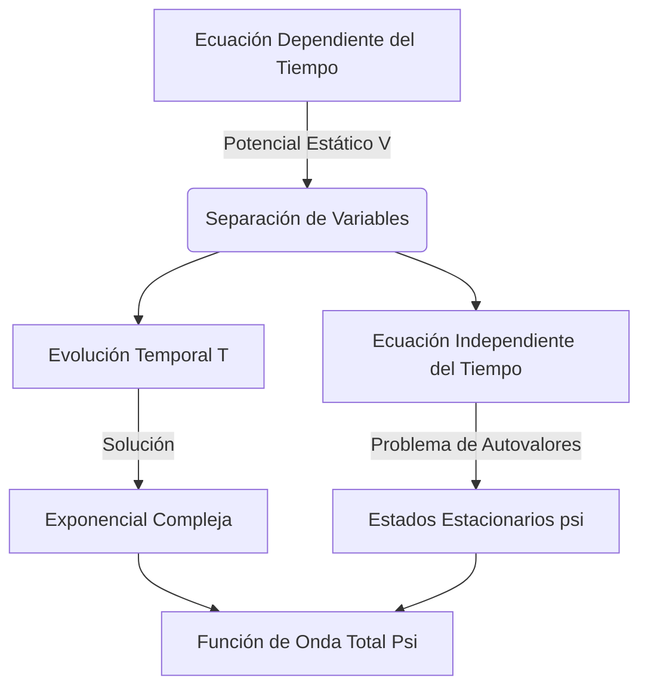

# La Ecuación de Schrödinger

La ecuación de Schrödinger es la piedra angular de la mecánica cuántica no relativista, análoga a la segunda ley de Newton en la mecánica clásica. Describe cómo evoluciona en el espacio y el tiempo el estado cuántico (la función de onda) de un sistema físico.

## 📜 Contexto Histórico
* **Erwin Schrödinger (1926):** Inspirado por la tesis de de Broglie, buscó una ecuación de onda continua que describiera a los electrones en los átomos, publicando la ecuación que hoy lleva su nombre.
* **Max Born (1926):** Proporcionó la interpretación física de la función de onda $\Psi$. Afirmó que $\Psi$ en sí no es algo físico, sino que el cuadrado de su módulo $|\Psi|^2$ representa la **densidad de probabilidad** de encontrar a la partícula en un punto del espacio.
* Este trabajo consolidó el formalismo de la mecánica ondulatoria, que se demostró equivalente a la mecánica matricial de Werner Heisenberg.

---

## 🧮 Desarrollo Teórico Profundo

La formulación de la mecánica cuántica no relativista encuentra en la Ecuación de Schrödinger su pilar fundamental. Esta ecuación diferencial lineal en derivadas parciales describe la evolución en el tiempo del estado cuántico de un sistema físico. 

### Derivación Heurística y Motivación Física

A partir de la relación de de Broglie para el momento $p = \hbar k$ y de Planck-Einstein para la energía $E = \hbar \omega$, consideramos una onda plana libre en una dimensión:
$$ \Psi(x,t) = A e^{i(kx - \omega t)} $$

Derivando con respecto a la posición $x$:
$$ \frac{\partial \Psi}{\partial x} = ik \Psi \implies \frac{\partial^2 \Psi}{\partial x^2} = -k^2 \Psi $$
Multiplicando por $-\frac{\hbar^2}{2m}$ y recordando que la energía cinética clásica es $T = \frac{p^2}{2m} = \frac{\hbar^2 k^2}{2m}$, obtenemos:
$$ -\frac{\hbar^2}{2m}\frac{\partial^2 \Psi}{\partial x^2} = \frac{\hbar^2 k^2}{2m}\Psi = T\Psi $$

Derivando respecto al tiempo $t$:
$$ \frac{\partial \Psi}{\partial t} = -i\omega \Psi \implies i\hbar \frac{\partial \Psi}{\partial t} = \hbar \omega \Psi = E\Psi $$

Para una partícula en presencia de un potencial $V(\vec{r},t)$, la energía total es $E = T + V$. Postulando que la relación de operadores energéticos se mantiene, llegamos a la Ecuación de Schrödinger dependiente del tiempo:
$$ i\hbar \frac{\partial}{\partial t} \Psi(\vec{r}, t) = \left( -\frac{\hbar^2}{2m}\nabla^2 + V(\vec{r}, t) \right) \Psi(\vec{r}, t) = \hat{H} \Psi(\vec{r}, t) $$

### Ecuación Independiente del Tiempo y Separación de Variables

Si el potencial no depende explícitamente del tiempo, es decir $V = V(\vec{r})$, podemos proponer una solución separable de la forma $\Psi(\vec{r}, t) = \psi(\vec{r})T(t)$. Sustituyendo en la ecuación original:
$$ i\hbar \psi(\vec{r}) \frac{dT(t)}{dt} = T(t) \left( -\frac{\hbar^2}{2m}\nabla^2 + V(\vec{r}) \right) \psi(\vec{r}) $$

Dividiendo entre $\Psi(\vec{r}, t) = \psi(\vec{r})T(t)$:
$$ i\hbar \frac{1}{T(t)} \frac{dT(t)}{dt} = \frac{1}{\psi(\vec{r})} \left( -\frac{\hbar^2}{2m}\nabla^2 + V(\vec{r}) \right) \psi(\vec{r}) = E $$

Dado que el lado izquierdo solo depende del tiempo y el derecho solo de la posición, ambos deben ser iguales a una constante de separación, la cual identificamos físicamente con la energía total del sistema $E$. Esto da lugar a dos ecuaciones:

1. **Evolución Temporal:**
$$ \frac{dT(t)}{dt} = -\frac{iE}{\hbar}T(t) \implies T(t) = e^{-iEt/\hbar} $$

2. **Ecuación de Schrödinger Independiente del Tiempo (Problema de Autovalores):**
$$ \hat{H}\psi(\vec{r}) = E\psi(\vec{r}) \implies \left( -\frac{\hbar^2}{2m}\nabla^2 + V(\vec{r}) \right) \psi(\vec{r}) = E \psi(\vec{r}) $$



### Propiedades de las Soluciones y Condiciones de Contorno

Las soluciones físicas $\psi(\vec{r})$ de la ecuación independiente del tiempo deben satisfacer condiciones estrictas para representar un estado válido:
- **Continuidad:** $\psi(\vec{r})$ y sus derivadas parciales de primer orden $\nabla\psi(\vec{r})$ deben ser continuas en todo el espacio. Solo si el potencial presenta discontinuidades infinitas (e.g., barrera infinita) se relaja la continuidad de la derivada.
- **Integrabilidad de Cuadrado:** La función de onda debe tender a cero cuando $|\vec{r}| \to \infty$ para asegurar que la probabilidad total sea finita y normalizable:
$$ \int_{\text{todo el espacio}} |\Psi(\vec{r}, t)|^2 d^3r = 1 $$
- **Ortogonalidad:** Dos estados propios (autofunciones) $\psi_m$ y $\psi_n$ correspondientes a distintos autovalores de energía $E_m \neq E_n$ son ortogonales:
$$ \int \psi_m^*(\vec{r}) \psi_n(\vec{r}) d^3r = 0 $$
Esta propiedad surge del carácter hermitiano del operador Hamiltoniano $\hat{H}$.

### Teorema de Ehrenfest

El puente entre la mecánica cuántica y la clásica se ilustra a través del Teorema de Ehrenfest, que dictamina la evolución temporal de los valores esperados. Para la posición $x$ y el momento $p$:
$$ \frac{d\langle x \rangle}{dt} = \frac{\langle p \rangle}{m} $$
$$ \frac{d\langle p \rangle}{dt} = -\left\langle \frac{\partial V}{\partial x} \right\rangle $$
Esto demuestra que los centros de los paquetes de ondas cuánticos siguen, en promedio, trayectorias clásicas regidas por las ecuaciones de Newton, siempre y cuando la dispersión del paquete sea pequeña comparada con la escala de variación del potencial.

---

## 🛠 Ejemplo Práctico
**Problema:** Demostrar que para un estado estacionario $\Psi(x,t) = \psi(x)e^{-iEt/\hbar}$, la densidad de probabilidad no depende del tiempo.

**Solución paso a paso:**
1. Escribimos la expresión para la densidad de probabilidad:
$$ \rho(x,t) = |\Psi(x,t)|^2 = \Psi^*(x,t) \Psi(x,t) $$
2. Sustituimos la forma del estado estacionario. Recordemos que el conjugado complejo de $e^{-iEt/\hbar}$ es $e^{+iEt/\hbar}$:
$$ \Psi^*(x,t) = \psi^*(x)e^{+iEt/\hbar} $$
3. Calculamos el producto:
$$ \rho(x,t) = \left( \psi^*(x)e^{+iEt/\hbar} \right) \left( \psi(x)e^{-iEt/\hbar} \right) $$
4. Los términos exponenciales se cancelan ya que sus exponentes suman cero ($e^{0} = 1$):
$$ \rho(x,t) = \psi^*(x)\psi(x) e^{i(E-E)t/\hbar} = |\psi(x)|^2 $$
Dado que $|\psi(x)|^2$ solo depende de la coordenada espacial $x$, la densidad de probabilidad (y todos los valores esperados de operadores que no dependan explícitamente del tiempo) son constantes en el tiempo. ¡Por eso se llaman *estados estacionarios*!

---

## 📝 Guía de Ejercicios Resueltos

**Problema 1: Ecuación de Continuidad de la Probabilidad**
Deriva la ecuación de continuidad para la densidad de probabilidad cuántica a partir de la ecuación de Schrödinger dependiente del tiempo en 3D.
**Solución paso a paso:**
1. La ecuación de Schrödinger es $i\hbar \frac{\partial \Psi}{\partial t} = -\frac{\hbar^2}{2m}\nabla^2\Psi + V\Psi$.
2. Tomamos el conjugado complejo: $-i\hbar \frac{\partial \Psi^*}{\partial t} = -\frac{\hbar^2}{2m}\nabla^2\Psi^* + V\Psi^*$ (asumiendo que $V$ es real).
3. Multiplicamos la primera por $\Psi^*$ y la segunda por $\Psi$, y restamos la segunda de la primera:
$$ i\hbar \left( \Psi^* \frac{\partial \Psi}{\partial t} + \Psi \frac{\partial \Psi^*}{\partial t} \right) = -\frac{\hbar^2}{2m} (\Psi^*\nabla^2\Psi - \Psi\nabla^2\Psi^*) $$
4. El lado izquierdo es $i\hbar \frac{\partial}{\partial t}(\Psi^*\Psi) = i\hbar \frac{\partial \rho}{\partial t}$.
5. El lado derecho se puede reescribir usando la identidad $\nabla \cdot (\Psi^*\nabla\Psi - \Psi\nabla\Psi^*)$.
6. Definimos la corriente de probabilidad $\vec{J} = \frac{\hbar}{2mi}(\Psi^*\nabla\Psi - \Psi\nabla\Psi^*)$.
7. Así obtenemos $\frac{\partial \rho}{\partial t} + \nabla \cdot \vec{J} = 0$, que es la ecuación de continuidad.

**Problema 2: Evolución de un Paquete de Ondas Libre**
Un electrón libre en 1D tiene una función de onda inicial gaussiana $\Psi(x,0) = \frac{1}{(2\pi a^2)^{1/4}} e^{-x^2 / 4a^2}$. Calcula el ancho del paquete $\Delta x(t)$ para $t>0$.
**Solución paso a paso:**
1. Escribimos $\Psi(x,0)$ en el espacio de momentos mediante la transformada de Fourier:
$$ \phi(p) = \frac{1}{\sqrt{2\pi\hbar}} \int \Psi(x,0) e^{-ipx/\hbar} dx = \left(\frac{2a^2}{\pi\hbar^2}\right)^{1/4} e^{-p^2 a^2 / \hbar^2} $$
2. La evolución temporal en el espacio de momentos adquiere una fase $e^{-iE_p t/\hbar}$ con $E_p = p^2/2m$:
$$ \phi(p,t) = \phi(p) e^{-i p^2 t / 2m\hbar} $$
3. Transformamos de vuelta al espacio de posiciones:
$$ \Psi(x,t) = \frac{1}{\sqrt{2\pi\hbar}} \int \phi(p,t) e^{ipx/\hbar} dp $$
La integral resultante es gaussiana compleja.
4. Al calcular la densidad de probabilidad $|\Psi(x,t)|^2$, la nueva varianza se vuelve:
$$ (\Delta x(t))^2 = a^2 + \left(\frac{\hbar t}{2ma}\right)^2 $$
5. El paquete de ondas se dispersa con el tiempo, y el ancho es $\Delta x(t) = a \sqrt{1 + \left(\frac{\hbar t}{2ma^2}\right)^2}$.

**Problema 3: Teorema de Ehrenfest para un Potencial Lineal**
Considera una partícula en un campo gravitatorio uniforme, $V(x) = mgx$. Calcula la evolución temporal del valor esperado del momento $\langle p \rangle$ y la posición $\langle x \rangle$.
**Solución paso a paso:**
1. Por el Teorema de Ehrenfest: $\frac{d\langle p \rangle}{dt} = \langle -\frac{\partial V}{\partial x} \rangle$.
2. Como $V(x) = mgx$, $\frac{\partial V}{\partial x} = mg$. Así que $\frac{d\langle p \rangle}{dt} = -mg$.
3. Integrando respecto al tiempo: $\langle p \rangle(t) = \langle p \rangle(0) - mgt$.
4. Para la posición, $\frac{d\langle x \rangle}{dt} = \frac{\langle p \rangle}{m}$.
5. Sustituimos el momento: $\frac{d\langle x \rangle}{dt} = \frac{\langle p \rangle(0)}{m} - gt$.
6. Integrando nuevamente: $\langle x \rangle(t) = \langle x \rangle(0) + \frac{\langle p \rangle(0)}{m} t - \frac{1}{2}gt^2$.
Esto demuestra que los valores esperados siguen exactamente las trayectorias parabólicas clásicas de Newton.

## 💻 Simulaciones Computacionales

A continuación se presenta un script avanzado en Python que simula la evolución temporal de un paquete de ondas gaussiano sometido a un pozo de potencial cuántico utilizando el método de diferencias finitas (Crank-Nicolson) para la Ecuación de Schrödinger dependiente del tiempo.

```python
import numpy as np
import matplotlib.pyplot as plt
import matplotlib.animation as animation
from scipy.sparse import diags
from scipy.sparse.linalg import spsolve

# Parámetros físicos
L = 10.0         # Longitud del dominio
N = 500          # Número de puntos espaciales
x = np.linspace(0, L, N)
dx = x[1] - x[0]
dt = 0.005       # Paso de tiempo
steps = 200      # Número de pasos de tiempo a simular

# Potencial (pozo armónico)
V = 0.5 * (x - L/2)**2
V[0] = V[-1] = 1e6 # Condiciones de frontera infinitas

# Paquete de ondas inicial (Gaussiana)
x0 = L / 4.0
sigma = 0.5
k0 = 5.0
psi0 = np.exp(-0.5 * ((x - x0) / sigma)**2) * np.exp(1j * k0 * x)
psi0 = psi0 / np.sqrt(np.sum(np.abs(psi0)**2) * dx) # Normalización

# Operador de evolución (Crank-Nicolson)
alpha = 1j * dt / (4 * dx**2)
main_diag_A = 1 + 2*alpha + 1j * dt / 2 * V
off_diag_A = -alpha * np.ones(N-1)
main_diag_B = 1 - 2*alpha - 1j * dt / 2 * V
off_diag_B = alpha * np.ones(N-1)

A = diags([off_diag_A, main_diag_A, off_diag_A], [-1, 0, 1], format='csc')
B = diags([off_diag_B, main_diag_B, off_diag_B], [-1, 0, 1], format='csc')

# Simulación
psi = psi0.copy()
densities = []

for _ in range(steps):
    densities.append(np.abs(psi)**2)
    # Resolver A * psi_new = B * psi_old
    rhs = B.dot(psi)
    psi = spsolve(A, rhs)

# Visualización
fig, ax = plt.subplots(figsize=(8, 5))
line, = ax.plot(x, densities[0], color='blue', lw=2, label='|Ψ|²')
ax.plot(x, V * 0.1, color='red', linestyle='--', label='Potencial V(x) (escalado)')
ax.set_ylim(0, np.max(densities) * 1.2)
ax.set_xlim(0, L)
ax.set_xlabel('Posición x')
ax.set_ylabel('Densidad de Probabilidad')
ax.set_title('Evolución de un Paquete de Ondas Cuántico')
ax.legend(loc='upper right')

def animate(i):
    line.set_ydata(densities[i])
    return line,

ani = animation.FuncAnimation(fig, animate, frames=steps, interval=50, blit=True)
plt.tight_layout()
# plt.show() # Descomentar para ver la animación localmente
```

## 📚 Recursos Específicos

### 🎓 Cursos y Clases Recomendadas
1. [MIT OCW 8.04 Quantum Physics I (Allan Adams)](https://ocw.mit.edu/courses/8-04-quantum-physics-i-spring-2013/): Clases detalladas sobre la construcción heurística y motivación de la ecuación de Schrödinger a partir de las ondas de materia de de Broglie.
2. [Stanford - Quantum Mechanics (Leonard Susskind)](https://www.youtube.com/playlist?list=PLpGHT1n4-mAtWCAh1E_yT1eF82k7bFepf): Conferencias enfocadas en la evolución temporal, el operador Hamiltoniano y cómo se relaciona la ecuación de onda con las matrices.
3. [Yale PHYS 201 (Ramamurti Shankar)](https://oyc.yale.edu/physics/phys-201): Principios Básicos de la Mecánica Cuántica; una introducción amena y rigurosa al formalismo ondulatorio.

### 📝 Artículos Científicos Clave
1. **Schrödinger, E. (1926). "An Undulatory Theory of the Mechanics of Atoms and Molecules"**. *Phys. Rev.*, 28, 1049. [DOI: 10.1103/PhysRev.28.1049](https://doi.org/10.1103/PhysRev.28.1049)
   *Importancia Teórica y Matemática:* Presenta la derivación de la ecuación de onda como un problema de valores propios del Hamiltoniano:
   $$ \hat{H}\psi(\vec{r},t) = E\psi(\vec{r},t) \implies \left(-\frac{\hbar^2}{2m}\nabla^2 + V(\vec{r})\right)\psi(\vec{r},t) = i\hbar\frac{\partial}{\partial t}\psi(\vec{r},t) $$
   *Implicaciones Físicas:* Fundamentó la mecánica ondulatoria al mostrar que los estados estacionarios son análogos a modos resonantes, suprimiendo las reglas de cuantización empíricas de Bohr en favor de un marco determinista de evolución ondulatoria.

2. **Born, M. (1926). "Zur Quantenmechanik der Stoßvorgänge"**. *Zeitschrift für Physik*, 37, 863-867. [DOI: 10.1007/BF01397477](https://doi.org/10.1007/BF01397477)
   *Importancia Teórica y Matemática:* Introduce la regla de Born, dando el salto del formalismo determinista puro a la predicción estocástica:
   $$ P(\vec{r}, t) = |\psi(\vec{r}, t)|^2 $$
   *Implicaciones Físicas:* Estableció que las ondas de Schrödinger no son ondas materiales de carga continua (como pensaba Schrödinger), sino amplitudes de probabilidad. Esto resolvió el problema del colapso y preparó el terreno para la interpretación de Copenhague.

3. **Ehrenfest, P. (1927). "Bemerkung über die angenäherte Gültigkeit der klassischen Mechanik innerhalb der Quantenmechanik"**. *Z. Phys.*, 45, 455-457. [DOI: 10.1007/BF01329203](https://doi.org/10.1007/BF01329203)
   *Importancia Teórica y Matemática:* Demuestra matemáticamente que el valor esperado de operadores recupera la mecánica clásica:
   $$ m\frac{d^2\langle \vec{r} \rangle}{dt^2} = \langle -\nabla V(\vec{r}) \rangle $$
   *Implicaciones Físicas:* Formula el Teorema de Ehrenfest. Garantiza el principio de correspondencia, demostrando que los centros de paquetes de ondas suficientemente localizados siguen trayectorias newtonianas clásicas.

### 📖 Referencias Útiles y Bibliografía
1. **Libro**: [Introduction to Quantum Mechanics - David J. Griffiths](https://www.cambridge.org/highereducation/books/introduction-to-quantum-mechanics/990799252758F46C8765A2C3946C342C) (Capítulos 1 y 2). 
2. **Libro**: [Principles of Quantum Mechanics - R. Shankar](https://link.springer.com/book/10.1007/978-1-4615-7675-4) (Capítulo 4).
3. **Libro**: [Modern Quantum Mechanics - J.J. Sakurai](https://www.cambridge.org/highereducation/books/modern-quantum-mechanics/144AE26BDEFB9A7CB06C0CD0696D12CA) (Capítulo 2).
