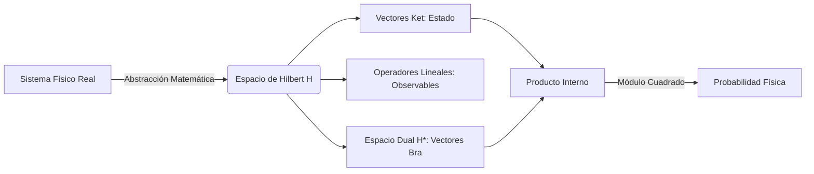

# Espacio de Hilbert y Formalismo de Operadores

El formalismo matemático de la mecánica cuántica se construye sobre el álgebra lineal en espacios vectoriales complejos de infinitas dimensiones. Este nivel de abstracción es necesario para tratar estados continuos y discretos de manera unificada.

## 📜 Contexto Histórico
* **John von Neumann (1932):** En su obra cumbre *Mathematical Foundations of Quantum Mechanics*, proporcionó el marco riguroso de la teoría estableciendo los espacios de Hilbert como el hogar de los estados cuánticos.
* **Paul Dirac (1939):** Inventó la notación "Bra-Ket" $\langle \phi | \psi \rangle$, una notación tremendamente elegante y poderosa que simplificó la representación de vectores de estado y productos internos.
* El formalismo permitió demostrar que la Mecánica Ondulatoria (Schrödinger) y la Mecánica Matricial (Heisenberg, Born, Jordan) eran representaciones isomórficas de una misma teoría subyacente.

---

## 🧮 Desarrollo Teórico Profundo

### Estructura Rigurosa del Espacio de Hilbert ($\mathcal{H}$)

La formulación matricial y ondulatoria pueden entenderse como distintas bases de un mismo espacio abstracto de infinitas dimensiones. Un estado cuántico puro se describe por un vector $|\psi\rangle$ en un Espacio de Hilbert complejo, denotado por $\mathcal{H}$.

Un Espacio de Hilbert es un espacio vectorial sobre el cuerpo de los complejos $\mathbb{C}$, dotado de un producto interno $\langle \phi | \psi \rangle$ que cumple con:
1. **Linealidad respecto al segundo argumento:** $\langle \phi | c_1 \psi_1 + c_2 \psi_2 \rangle = c_1 \langle \phi | \psi_1 \rangle + c_2 \langle \phi | \psi_2 \rangle$
2. **Simetría conjugada (Hermitianidad):** $\langle \phi | \psi \rangle = \langle \psi | \phi \rangle^*$
3. **Definido positivo:** $\langle \psi | \psi \rangle \ge 0$, y $\langle \psi | \psi \rangle = 0$ si y solo si $|\psi\rangle = 0$.
4. **Completitud topológica:** Toda sucesión de Cauchy converge a un vector que también pertenece al espacio $\mathcal{H}$.



### Operadores Lineales y la Medición

Un observable clásico $A$ (como energía, posición o espín) se representa en cuántica por un operador lineal autoadjunto (Hermitiano) $\hat{A}$.
La propiedad de autoadjunto asegura que $\hat{A} = \hat{A}^\dagger$, lo cual tiene consecuencias monumentales dictaminadas por el Teorema Espectral:
- Todos los autovalores $a_n$ de la ecuación secular $\hat{A}|a_n\rangle = a_n|a_n\rangle$ son estrictamente **reales**.
- Los autovectores $|a_n\rangle$ forman una base ortonormal completa del espacio $\mathcal{H}$: $\langle a_m | a_n \rangle = \delta_{mn}$.
- Cualquier estado $|\psi\rangle$ puede expandirse en esta base: $|\psi\rangle = \sum_n c_n |a_n\rangle$, donde los coeficientes de Fourier cuánticos son $c_n = \langle a_n | \psi \rangle$.

**Postulado de la Medición (Colapso):** Al medir el observable $\hat{A}$ en el estado $|\psi\rangle$, la probabilidad de obtener el valor $a_n$ es:
$$ P(a_n) = |c_n|^2 = |\langle a_n | \psi \rangle|^2 $$
Y tras la medición, el estado "colapsa" abruptamente al autoestado correspondiente $|a_n\rangle$.

### Relaciones de Conmutación y Álgebra de Operadores

Dos operadores $\hat{A}$ y $\hat{B}$ pueden o no conmutar. Definimos el conmutador como:
$$ [\hat{A}, \hat{B}] = \hat{A}\hat{B} - \hat{B}\hat{A} $$
**Teorema de operadores simultáneos:** Dos observables $\hat{A}$ y $\hat{B}$ admiten una base común de autovectores (son simultáneamente diagonalizables) si y solo si su conmutador es nulo ($[\hat{A}, \hat{B}] = 0$). Físicamente, esto implica que se pueden medir simultáneamente sin incertidumbre recíproca.

### Derivación Generalizada del Principio de Incertidumbre

Para dos observables que no conmutan, existe una restricción fundamental. Definimos los operadores de desviación $\Delta\hat{A} = \hat{A} - \langle A \rangle\mathbb{I}$ y $\Delta\hat{B} = \hat{B} - \langle B \rangle\mathbb{I}$. Las varianzas son $(\sigma_A)^2 = \langle (\Delta\hat{A})^2 \rangle$ y $(\sigma_B)^2 = \langle (\Delta\hat{B})^2 \rangle$.

Consideremos un estado auxiliar:
$$ |f\rangle = \left(\Delta\hat{A} + i\lambda \Delta\hat{B}\right)|\psi\rangle $$
Para cualquier $\lambda$ real, la norma de $|f\rangle$ debe ser no negativa $\langle f | f \rangle \ge 0$:
$$ \langle \psi | (\Delta\hat{A} - i\lambda \Delta\hat{B})(\Delta\hat{A} + i\lambda \Delta\hat{B}) | \psi \rangle \ge 0 $$
Desarrollando los términos:
$$ \langle (\Delta\hat{A})^2 \rangle + \lambda^2 \langle (\Delta\hat{B})^2 \rangle + i\lambda \langle [\Delta\hat{A}, \Delta\hat{B}] \rangle \ge 0 $$
$$ (\sigma_A)^2 + \lambda^2 (\sigma_B)^2 + i\lambda \langle [\hat{A}, \hat{B}] \rangle \ge 0 $$
Notemos que el valor esperado del conmutador de operadores hermitianos es imaginario puro, por lo que $i\langle [\hat{A}, \hat{B}] \rangle$ es real. Para que esta ecuación cuadrática en $\lambda$ sea siempre positiva, su discriminante debe ser menor o igual a cero:
$$ \left(i\langle [\hat{A}, \hat{B}] \rangle\right)^2 - 4(\sigma_A)^2(\sigma_B)^2 \le 0 $$
Lo que nos lleva al **Principio de Incertidumbre de Robertson-Schrödinger**:
$$ \sigma_A \sigma_B \ge \frac{1}{2} \left| \langle [\hat{A}, \hat{B}] \rangle \right| $$

---

## 🛠 Ejemplo Práctico
**Problema:** Demostrar el Principio de Incertidumbre de Heisenberg para la posición ($\hat{x}$) y el momento ($\hat{p}$), sabiendo que su conmutador canónico es $[\hat{x}, \hat{p}] = i\hbar$.

**Solución paso a paso:**
1. Partimos del Principio de Incertidumbre Generalizado para dos observables arbitrarios $\hat{A}$ y $\hat{B}$:
$$ \sigma_A \sigma_B \ge \frac{1}{2} \left| \langle [\hat{A}, \hat{B}] \rangle \right| $$
2. Sustituimos $\hat{A} = \hat{x}$ (operador posición) y $\hat{B} = \hat{p}$ (operador momento). 
En la base de coordenadas, $\hat{x} = x$ y $\hat{p} = -i\hbar \frac{\partial}{\partial x}$.
3. Evaluamos la relación de conmutación $[\hat{x}, \hat{p}]$. Aplicada a una función de prueba $\psi(x)$:
$$ [\hat{x}, \hat{p}]\psi = (\hat{x}\hat{p} - \hat{p}\hat{x})\psi = x \left(-i\hbar \frac{\partial \psi}{\partial x}\right) - \left(-i\hbar \frac{\partial}{\partial x}(x\psi)\right) $$
Aplicando la regla del producto en el segundo término:
$$ = -i\hbar x \frac{\partial \psi}{\partial x} + i\hbar \left( \psi + x\frac{\partial \psi}{\partial x} \right) = i\hbar \psi $$
Por lo tanto, operativamente: $[\hat{x}, \hat{p}] = i\hbar$.
4. Sustituimos este conmutador en la desigualdad general:
$$ \sigma_x \sigma_p \ge \frac{1}{2} \left| \langle i\hbar \rangle \right| $$
5. Como el valor esperado de una constante es la constante misma, $\langle i\hbar \rangle = i\hbar$, y su módulo es $|i\hbar| = \hbar$.
$$ \sigma_x \sigma_p \ge \frac{\hbar}{2} $$
¡Queda demostrado el famoso principio de incertidumbre!

---

## 📝 Guía de Ejercicios Resueltos

**Problema 1: Operador de Traslación Espacial**
Demuestra que el operador $\hat{T}(a) = \exp(-i\hat{p}a/\hbar)$ actúa como un operador de traslación espacial sobre las funciones de onda.
**Solución paso a paso:**
1. Escribimos la acción del operador sobre una función $\psi(x)$ usando su expansión en serie de Taylor:
$$ \hat{T}(a) = \sum_{n=0}^{\infty} \frac{1}{n!} \left( \frac{-ia}{\hbar} \right)^n \hat{p}^n $$
2. En la base de posiciones, el operador momento es $\hat{p} = -i\hbar \frac{\partial}{\partial x}$.
3. Sustituyendo $\hat{p}$ en la serie:
$$ \hat{T}(a) = \sum_{n=0}^{\infty} \frac{1}{n!} \left( \frac{-ia}{\hbar} \right)^n \left(-i\hbar \frac{\partial}{\partial x}\right)^n = \sum_{n=0}^{\infty} \frac{(-a)^n}{n!} \frac{\partial^n}{\partial x^n} $$
4. Aplicamos el operador a la función de onda $\psi(x)$:
$$ \hat{T}(a)\psi(x) = \sum_{n=0}^{\infty} \frac{(-a)^n}{n!} \frac{\partial^n \psi}{\partial x^n} $$
5. Esta es exactamente la serie de Taylor para $\psi(x - a)$. Por lo tanto, $\hat{T}(a)\psi(x) = \psi(x - a)$, demostrando que es el generador de las traslaciones espaciales.

**Problema 2: Conmutador de Operadores de Momento Angular**
Dados los operadores de momento angular $\hat{L}_i = \epsilon_{ijk} \hat{x}_j \hat{p}_k$, demuestra la relación de conmutación $[\hat{L}_x, \hat{L}_y] = i\hbar\hat{L}_z$.
**Solución paso a paso:**
1. Escribimos explícitamente los operadores: $\hat{L}_x = \hat{y}\hat{p}_z - \hat{z}\hat{p}_y$ y $\hat{L}_y = \hat{z}\hat{p}_x - \hat{x}\hat{p}_z$.
2. Calculamos el conmutador: $[\hat{L}_x, \hat{L}_y] = [\hat{y}\hat{p}_z - \hat{z}\hat{p}_y, \hat{z}\hat{p}_x - \hat{x}\hat{p}_z]$.
3. Usando la linealidad del conmutador:
$$ [\hat{L}_x, \hat{L}_y] = [\hat{y}\hat{p}_z, \hat{z}\hat{p}_x] - [\hat{y}\hat{p}_z, \hat{x}\hat{p}_z] - [\hat{z}\hat{p}_y, \hat{z}\hat{p}_x] + [\hat{z}\hat{p}_y, \hat{x}\hat{p}_z] $$
4. Como operadores de diferentes ejes conmutan, los términos centrales se anulan: $[\hat{y}\hat{p}_z, \hat{x}\hat{p}_z] = 0$ y $[\hat{z}\hat{p}_y, \hat{z}\hat{p}_x] = 0$.
5. Los términos no nulos son:
$$ [\hat{y}\hat{p}_z, \hat{z}\hat{p}_x] = \hat{y}\hat{p}_x [\hat{p}_z, \hat{z}] = \hat{y}\hat{p}_x (-i\hbar) $$
$$ [\hat{z}\hat{p}_y, \hat{x}\hat{p}_z] = \hat{p}_y\hat{x} [\hat{z}, \hat{p}_z] = \hat{p}_y\hat{x} (i\hbar) $$
6. Sumamos: $[\hat{L}_x, \hat{L}_y] = -i\hbar \hat{y}\hat{p}_x + i\hbar \hat{x}\hat{p}_y = i\hbar (\hat{x}\hat{p}_y - \hat{y}\hat{p}_x) = i\hbar \hat{L}_z$.

**Problema 3: Matriz Densidad para un Estado Mixto**
Considera un ensamble estadístico de espines 1/2 donde el $75\%$ está en el estado $|\uparrow_z\rangle$ y el $25\%$ en el estado $|\downarrow_z\rangle$. Calcula la matriz densidad $\hat{\rho}$ y el valor esperado de $\hat{S}_x$.
**Solución paso a paso:**
1. La matriz densidad se define como $\hat{\rho} = \sum p_i |\psi_i\rangle\langle\psi_i|$.
2. Sustituyendo las probabilidades: $\hat{\rho} = 0.75 |\uparrow_z\rangle\langle\uparrow_z| + 0.25 |\downarrow_z\rangle\langle\downarrow_z|$.
3. En la base $\{|\uparrow_z\rangle, |\downarrow_z\rangle\}$, esto se representa matricialmente como:
$$ \rho = \begin{pmatrix} 0.75 & 0 \\ 0 & 0.25 \end{pmatrix} $$
4. El operador $\hat{S}_x$ está dado por la matriz de Pauli $\sigma_x$:
$$ \hat{S}_x = \frac{\hbar}{2} \begin{pmatrix} 0 & 1 \\ 1 & 0 \end{pmatrix} $$
5. El valor esperado se calcula como $\langle \hat{S}_x \rangle = \operatorname{Tr}(\hat{\rho} \hat{S}_x)$.
6. Multiplicando las matrices:
$$ \hat{\rho} \hat{S}_x = \begin{pmatrix} 0.75 & 0 \\ 0 & 0.25 \end{pmatrix} \frac{\hbar}{2} \begin{pmatrix} 0 & 1 \\ 1 & 0 \end{pmatrix} = \frac{\hbar}{2} \begin{pmatrix} 0 & 0.75 \\ 0.25 & 0 \end{pmatrix} $$
7. La traza de esta matriz es $0+0=0$. Por lo tanto, $\langle \hat{S}_x \rangle = 0$.

## 💻 Simulaciones Computacionales

El siguiente script ilustra el formalismo algebraico en el Espacio de Hilbert calculando los autovalores y autovectores del operador momento angular cuántico. Se enfoca en la construcción de las matrices de espín (Pauli para S=1/2) y analiza cómo evolucionan los valores esperados bajo un campo magnético.

```python
import numpy as np
import scipy.linalg as la
import matplotlib.pyplot as plt

# Matrices de Pauli (Espín 1/2, omitiendo factor hbar/2 por simplicidad)
sigma_x = np.array([[0, 1], [1, 0]], dtype=complex)
sigma_y = np.array([[0, -1j], [1j, 0]], dtype=complex)
sigma_z = np.array([[1, 0], [0, -1]], dtype=complex)

# Hamiltoniano de un espín en un campo magnético B = (Bx, By, Bz)
B = np.array([1.0, 0.5, 2.0]) # Vector campo magnético
gamma = 1.0 # Relación giromagnética
H = -gamma * (B[0]*sigma_x + B[1]*sigma_y + B[2]*sigma_z)

# Diagonalización del Hamiltoniano (Problema de autovalores)
eigenvalues, eigenvectors = la.eigh(H)
print(f"Energías de los autoestados: {eigenvalues}")

# Evolución temporal
# Estado inicial: spin up a lo largo de z
psi_0 = np.array([1, 0], dtype=complex)

t_vals = np.linspace(0, 10, 200)
exp_Sx = []
exp_Sy = []
exp_Sz = []

for t in t_vals:
    # Operador de evolución U(t) = exp(-iHt)
    U = la.expm(-1j * H * t)
    psi_t = U.dot(psi_0)
    
    # Cálculo de valores esperados <psi | sigma | psi>
    sx_val = np.real(np.vdot(psi_t, sigma_x.dot(psi_t)))
    sy_val = np.real(np.vdot(psi_t, sigma_y.dot(psi_t)))
    sz_val = np.real(np.vdot(psi_t, sigma_z.dot(psi_t)))
    
    exp_Sx.append(sx_val)
    exp_Sy.append(sy_val)
    exp_Sz.append(sz_val)

# Graficando las proyecciones del espín (Precesión de Larmor)
plt.figure(figsize=(10, 6))
plt.plot(t_vals, exp_Sx, label=r'$\langle S_x \rangle$', color='red')
plt.plot(t_vals, exp_Sy, label=r'$\langle S_y \rangle$', color='green')
plt.plot(t_vals, exp_Sz, label=r'$\langle S_z \rangle$', color='blue')
plt.axhline(0, color='black', linewidth=0.8, linestyle='--')
plt.title("Precesión de Larmor de un Espín 1/2 en Campo Magnético Estático")
plt.xlabel("Tiempo t")
plt.ylabel("Valor Esperado")
plt.legend()
plt.grid(True, alpha=0.3)
plt.tight_layout()
# plt.show() # Descomentar para visualizar
```

## 📚 Recursos Específicos

### 🎓 Cursos y Clases Recomendadas
1. [MIT OCW 8.05 Quantum Physics II (Barton Zwiebach)](https://ocw.mit.edu/courses/8-05-quantum-physics-ii-fall-2013/): La primera mitad del curso enseña rigurosamente la notación de Dirac, espacios vectoriales complejos y formalismo de operadores hermitianos.
2. [Stanford - Quantum Mechanics (Leonard Susskind)](https://www.youtube.com/playlist?list=PLpGHT1n4-mAtWCAh1E_yT1eF82k7bFepf): Primeros videos de la serie que arrancan directamente desde el enfoque de espacios vectoriales usando el espín como motivación principal.
3. [NPTEL - Quantum Mechanics I (Prof. P. Ramadevi)](https://nptel.ac.in/courses/115106066): Una aproximación sistemática y matemática al formalismo, explicando operadores, conmutadores y representaciones matriciales.

### 📝 Artículos Científicos Clave
1. **Dirac, P. A. M. (1939). "A new notation for quantum mechanics"**. *Mathematical Proceedings of the Cambridge Philosophical Society*, 35(3), 416-418. [DOI: 10.1017/S030500410002118X](https://doi.org/10.1017/S030500410002118X)
   *Importancia Teórica y Matemática:* Introduce formalmente la notación *Bra-Ket* para representar vectores en el espacio de Hilbert y su dual. Define los productos internos y externos algebraicamente:
   $$ \langle \phi | \psi \rangle \in \mathbb{C}, \quad |\psi\rangle \langle \phi | = \hat{O} $$
   *Implicaciones Físicas:* Simplificó drásticamente la manipulación de operadores y demostró la invarianza de la mecánica cuántica ante cambios de base, unificando la mecánica matricial y ondulatoria.

2. **von Neumann, J. (1927). "Mathematische Begründung der Quantenmechanik"**. *Nachrichten von der Gesellschaft der Wissenschaften zu Göttingen*, 1927, 1-57. [Link GDZ](https://gdz.sub.uni-goettingen.de/id/PPN252457811_1927)
   *Importancia Teórica y Matemática:* Establece el marco riguroso de la teoría cuántica usando espacios de Hilbert de dimensión infinita. Formula el teorema espectral para operadores autoadjuntos:
   $$ \hat{A} = \int \lambda \, dE(\lambda) $$
   *Implicaciones Físicas:* Puso la mecánica cuántica sobre bases matemáticas inexpugnables, definiendo precisamente qué constituye un "observable" (operador hermitiano acotado o no acotado denso) y un estado físico (operador de densidad).

3. **Robertson, H. P. (1929). "The Uncertainty Principle"**. *Phys. Rev.*, 34, 163-164. [DOI: 10.1103/PhysRev.34.163](https://doi.org/10.1103/PhysRev.34.163)
   *Importancia Teórica y Matemática:* Derivación general del principio de incertidumbre a partir de las relaciones de conmutación empleando la desigualdad de Cauchy-Schwarz en espacios de Hilbert:
   $$ \sigma_A \sigma_B \ge \frac{1}{2} \left| \langle [\hat{A}, \hat{B}] \rangle \right| $$
   *Implicaciones Físicas:* Demuestra que la incertidumbre de Heisenberg no es un artefacto de los instrumentos de medición ni exclusivo de posición/momento, sino una propiedad fundamental del álgebra no conmutativa de cualquier par de observables incompatibles.

### 📖 Referencias Útiles y Bibliografía
1. **Libro**: [Principles of Quantum Mechanics - R. Shankar](https://link.springer.com/book/10.1007/978-1-4615-7675-4) (Capítulo 1). Resumen excelente del álgebra lineal.
2. **Libro**: [Mathematical Foundations of Quantum Mechanics - John von Neumann](https://press.princeton.edu/books/paperback/9780691178578/mathematical-foundations-of-quantum-mechanics). 
3. **Libro**: [The Principles of Quantum Mechanics - Paul Dirac](https://global.oup.com/academic/product/the-principles-of-quantum-mechanics-9780198520115). La obra fundacional original.
