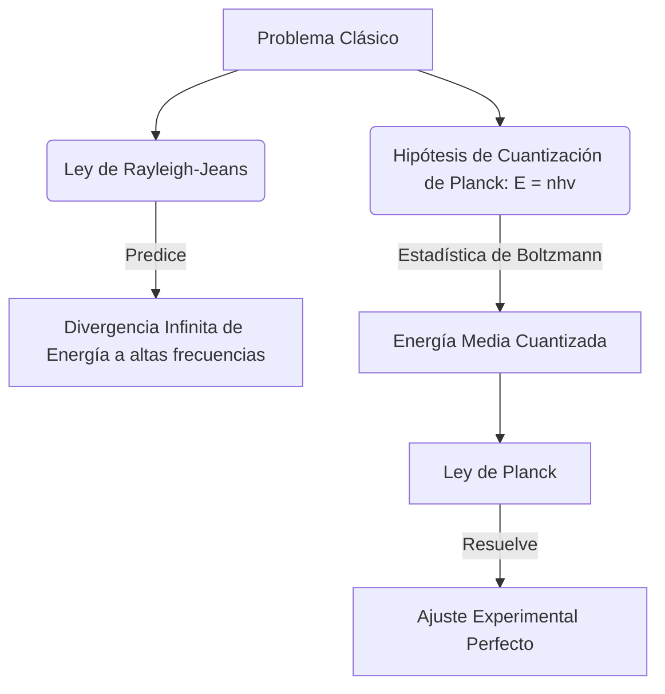

# Fundamentos y Dualidad Onda-Partícula

En esta sección exploramos los orígenes de la mecánica cuántica, donde la física clásica (newtoniana y maxwelliana) fracasó al intentar explicar fenómenos a escala atómica, dando lugar a una nueva descripción de la naturaleza en términos de cuantos de energía y el comportamiento dual onda-partícula.

## 📜 Contexto Histórico
A finales del siglo XIX y principios del XX, una serie de experimentos inexplicables para la física clásica iniciaron la revolución cuántica:
* **Max Planck (1900)**: Para resolver la "catástrofe ultravioleta" en la radiación del cuerpo negro, propuso que la energía electromagnética se emite y absorbe en "cuantos" discretos.
* **Albert Einstein (1905)**: Explicó el efecto fotoeléctrico postulando que la luz en sí misma está cuantizada en fotones.
* **Arthur Compton (1923)**: Demostró que los fotones tienen momento y pueden colisionar con electrones como si fueran partículas (Efecto Compton).
* **Louis de Broglie (1924)**: Extendió la idea de la dualidad luz-partícula a la materia, sugiriendo que las partículas masivas, como los electrones, también tienen propiedades ondulatorias.

---

## 🧮 Desarrollo Teórico Profundo

### Teoría Cuántica de la Radiación del Cuerpo Negro

El inicio del formalismo cuántico surgió al analizar la densidad de energía de la radiación electromagnética en una cavidad en equilibrio térmico. Clásicamente, la física estadística y el electromagnetismo (ley de Rayleigh-Jeans) asumen que la energía térmica se reparte equitativamente en todos los modos vibracionales. Como el número de modos por unidad de frecuencia escala con $\nu^2$, la densidad de energía sería:
$$ \rho_{RJ}(\nu, T) = \frac{8\pi \nu^2 k_B T}{c^3} $$
Esto predice que un objeto a temperatura constante radiará una cantidad infinita de energía en altas frecuencias ($\nu \to \infty$), un absurdo físico bautizado como la "Catástrofe Ultravioleta".

Para resolver esto, Max Planck propuso una hipótesis ad hoc (1900): los osciladores materiales en las paredes de la cavidad no pueden emitir o absorber energía de manera continua, sino en paquetes discretos o "cuantos". La energía de un oscilador de frecuencia $\nu$ se cuantiza en múltiplos enteros:
$$ E_n = nh\nu, \quad n = 0, 1, 2, \dots $$
donde $h$ es la constante de Planck ($6.62607015 \times 10^{-34} \text{ J}\cdot\text{s}$). Calculando el valor esperado estadístico de la energía de los osciladores usando la distribución de Boltzmann:
$$ \langle E \rangle = \frac{\sum_{n=0}^{\infty} (nh\nu) e^{-nh\nu / k_B T}}{\sum_{n=0}^{\infty} e^{-nh\nu / k_B T}} = \frac{h\nu}{e^{h\nu / k_B T} - 1} $$
Multiplicando por la densidad de modos $\frac{8\pi \nu^2}{c^3}$, surge la **Ley de Radiación de Planck**:
$$ \rho(\nu, T) = \frac{8\pi h \nu^3}{c^3} \frac{1}{e^{h\nu / k_B T} - 1} $$
Esta fórmula coincide perfectamente con los espectros observados y decae exponencialmente a altas frecuencias, resolviendo la divergencia clásica.



### Efecto Fotoeléctrico y la Naturaleza Corpuscular de la Luz

En 1905, Einstein fue más allá: la cuantización no era un artefacto de los osciladores de las paredes, sino una propiedad fundamental del campo electromagnético en sí. La luz está compuesta por partículas inseparables (luego llamadas fotones) de energía $E = h\nu$.

En el efecto fotoeléctrico, cuando una placa de metal es iluminada, emite electrones. Clásicamente se esperaba que una luz más intensa aumentara la energía de estos electrones y que existiera un retardo temporal. Sin embargo, la energía de los electrones resultaba ser independiente de la intensidad, pero linealmente dependiente de la frecuencia. 
Einstein modeló el proceso como colisiones uno-a-uno entre fotones y electrones. La conservación de la energía en la extracción de un electrón dicta:
$$ h\nu = K_{\max} + \Phi $$
$$ K_{\max} = h\nu - \Phi $$
donde $\Phi$ (función de trabajo) es la energía mínima necesaria para arrancar un electrón, dependiente del material. Si $h\nu < \Phi$, ningún electrón es emitido, explicando el efecto del umbral de frecuencia.

### Dualidad Onda-Partícula y Momento del Fotón

El fotón viaja a la velocidad de la luz $c$, por lo que su masa invariante es nula. Por relatividad especial, la relación energía-momento es $E^2 = (pc)^2 + (m_0 c^2)^2$. Para $m_0 = 0$:
$$ E = pc \implies p = \frac{E}{c} = \frac{h\nu}{c} = \frac{h}{\lambda} $$
Arthur Compton (1923) confirmó que los fotones portan este momento $p = h/\lambda$ colisionándolos con electrones y verificando la conservación del momento (Dispersión Compton):
$$ \Delta \lambda = \lambda' - \lambda = \frac{h}{m_e c} (1 - \cos\theta) $$

### Hipótesis de de Broglie: Ondas de Materia

Si las ondas de luz presentan comportamiento de partícula (fotón), Louis de Broglie propuso (1924) la simetría opuesta: las partículas materiales (como los electrones) deberían exhibir comportamiento de onda. A toda partícula con momento $p$ se le asocia una onda de materia de longitud:
$$ \lambda_{dB} = \frac{h}{p} = \frac{h}{mv} $$
Esta relación revolucionaria fue confirmada cuando se observó difracción cristalina en haces de electrones (Davisson-Germer, 1927). A partir de la hipótesis de de Broglie, la condición de cuantización del átomo de Bohr ($mvr = n\hbar$) emerge naturalmente al exigir que la onda electrónica forme una onda estacionaria estable en la órbita atómica:
$$ 2\pi r = n\lambda_{dB} = n\frac{h}{p} \implies pr = n\frac{h}{2\pi} = n\hbar $$
Este salto conceptual prepararía el terreno para la formulación completa de la función de onda de Schrödinger.

---

## 🛠 Ejemplo Práctico
**Problema:** Calcula la longitud de onda de de Broglie de un electrón acelerado desde el reposo a través de una diferencia de potencial de $V = 100 \text{ V}$.

**Solución paso a paso:**
1. La energía cinética ganada por el electrón es $K = eV$, donde $e = 1.6 \times 10^{-19} \text{ C}$.
$$ K = (1.6 \times 10^{-19} \text{ C})(100 \text{ V}) = 1.6 \times 10^{-17} \text{ J} $$
2. Relacionamos la energía cinética (no relativista) con el momento:
$$ K = \frac{p^2}{2m_e} \implies p = \sqrt{2m_e K} $$
3. Sustituimos la masa del electrón $m_e = 9.11 \times 10^{-31} \text{ kg}$:
$$ p = \sqrt{2 (9.11 \times 10^{-31}) (1.6 \times 10^{-17})} \approx 5.4 \times 10^{-24} \text{ kg}\cdot\text{m/s} $$
4. Usamos la relación de de Broglie:
$$ \lambda = \frac{h}{p} = \frac{6.626 \times 10^{-34}}{5.4 \times 10^{-24}} \approx 1.23 \times 10^{-10} \text{ m} = 0.123 \text{ nm} $$
La longitud de onda está en el rango de los rayos X, adecuada para difracción cristalina.

---

## 📝 Guía de Ejercicios Resueltos

**Problema 1: Efecto Compton Inverso**
Considera un fotón de baja energía que choca contra un electrón ultra-relativista de energía $E_e \gg m_e c^2$. Calcula la energía máxima que el fotón puede adquirir (dispersión hacia atrás).
**Solución paso a paso:**
1. En el sistema de reposo del electrón inicial, el fotón incidente tiene una energía aumentada por el efecto Doppler relativista: $E'_0 \approx 2\gamma E_0$, donde $\gamma = E_e / m_e c^2$.
2. En este marco de referencia, ocurre la dispersión Compton normal. Para un fotón de baja energía en este marco ($E'_0 \ll m_e c^2$), la transferencia de energía es pequeña, luego $E'_f \approx E'_0$.
3. Transformamos de vuelta al sistema de laboratorio (donde el electrón inicialmente se movía rápido). El fotón reflejado hacia atrás (en la dirección del electrón) sufre otro corrimiento Doppler:
$$ E_f \approx 2\gamma E'_f \approx 2\gamma (2\gamma E_0) = 4\gamma^2 E_0 $$
4. Si la colisión es extrema (régimen de Klein-Nishina), toda la energía cinética del electrón se transfiere. Pero en el límite de baja energía, el fotón emerge con una energía multiplicada por un factor $4\gamma^2$, un mecanismo crucial en astrofísica de altas energías.

**Problema 2: Cuantización de Sommerfeld-Wilson**
Usa la regla de cuantización de Bohr-Sommerfeld $\oint p \, dq = n h$ para encontrar los niveles de energía de un oscilador armónico clásico $V(x) = \frac{1}{2}kx^2$.
**Solución paso a paso:**
1. La energía total es invariante: $E = \frac{p^2}{2m} + \frac{1}{2}kx^2$.
2. Esta ecuación describe una elipse en el espacio de fase $(x,p)$:
$$ \frac{p^2}{2mE} + \frac{x^2}{2E/k} = 1 $$
3. Los semiejes de la elipse son $a = \sqrt{2E/k}$ (en $x$) y $b = \sqrt{2mE}$ (en $p$).
4. El área de la elipse, que corresponde a la integral cíclica $\oint p \, dx$, es $\text{Área} = \pi a b$.
5. Sustituimos: $\oint p \, dx = \pi \sqrt{2E/k} \sqrt{2mE} = 2\pi E \sqrt{m/k}$.
6. Sabiendo que la frecuencia clásica es $\nu = \frac{1}{2\pi}\sqrt{\frac{k}{m}}$, la integral es $\oint p \, dx = \frac{E}{\nu}$.
7. Aplicamos la regla de cuantización: $\frac{E}{\nu} = nh \implies E_n = nh\nu$. Este es el resultado correcto de Planck original (antes del punto cero de Schrödinger).

**Problema 3: Longitud de onda térmica de de Broglie**
Determina la longitud de onda de de Broglie térmica para un gas ideal clásico a temperatura $T$. Demuestra bajo qué condición los efectos cuánticos dominan.
**Solución paso a paso:**
1. Para un gas clásico, la energía cinética media en 3D es $E = \frac{3}{2} k_B T$.
2. El momento cuadrático medio térmico es $p = \sqrt{2mE} = \sqrt{3mk_B T}$. Sin embargo, rigurosamente, se utiliza $p_{\text{term}} = \sqrt{2\pi m k_B T}$ al promediar en el espacio de momentos.
3. La longitud de onda de de Broglie asociada es $\lambda_{\text{dB}} = \frac{h}{p} = \frac{h}{\sqrt{2\pi m k_B T}}$.
4. El régimen cuántico comienza cuando el volumen de una partícula (la caja de de Broglie $\lambda_{\text{dB}}^3$) es del mismo orden de magnitud que el volumen promedio por partícula en el gas ($V/N = 1/n$).
5. Por lo tanto, los efectos cuánticos son fundamentales cuando $n \lambda_{\text{dB}}^3 \gtrsim 1$, lo que significa altas densidades o temperaturas muy cercanas al cero absoluto (el criterio para un condensado de Bose-Einstein o un gas de Fermi degenerado).

## 💻 Simulaciones Computacionales

Esta simulación explora el origen de la física cuántica modelando la Ley de Radiación de Planck para la emisión del cuerpo negro y contrastándola con el colapso clásico de Rayleigh-Jeans (la catástrofe ultravioleta).

```python
import numpy as np
import matplotlib.pyplot as plt
from scipy.constants import h, c, k

def planck_law(wavelength, T):
    """Ley de Planck para la radiancia espectral."""
    # Evitamos división por cero en lambda = 0
    wavelength = np.clip(wavelength, 1e-10, None)
    term1 = (2.0 * h * c**2) / (wavelength**5)
    term2 = np.exp((h * c) / (wavelength * k * T)) - 1.0
    return term1 / term2

def rayleigh_jeans_law(wavelength, T):
    """Aproximación clásica de Rayleigh-Jeans."""
    wavelength = np.clip(wavelength, 1e-10, None)
    return (2.0 * c * k * T) / (wavelength**4)

# Rango de longitudes de onda: 100 nm a 3000 nm
wavelengths = np.linspace(100e-9, 3000e-9, 500)
wavelengths_nm = wavelengths * 1e9

# Temperaturas a simular (en Kelvin)
temperatures = [3000, 4000, 5000, 5778] # 5778 K es la temperatura superficial del Sol

plt.figure(figsize=(10, 6))

# Curvas de Planck
colors = ['#FF4500', '#FF8C00', '#FFD700', '#1E90FF']
for T, color in zip(temperatures, colors):
    radiance = planck_law(wavelengths, T)
    plt.plot(wavelengths_nm, radiance, label=f'Planck {T} K', color=color, linewidth=2)

# Curva clásica de Rayleigh-Jeans para 5778 K
radiance_rj = rayleigh_jeans_law(wavelengths, 5778)
plt.plot(wavelengths_nm, radiance_rj, label='Rayleigh-Jeans 5778 K', 
         color='black', linestyle='--', linewidth=2)

# Limitamos el eje Y para ver la divergencia de Rayleigh-Jeans sin distorsionar todo
plt.ylim(0, planck_law(wavelengths, 5778).max() * 1.5)
plt.xlim(100, 3000)

plt.title("Radiación del Cuerpo Negro: Ley de Planck vs Física Clásica")
plt.xlabel("Longitud de Onda (nm)")
plt.ylabel("Radiancia Espectral (W / m^3 / sr)")
plt.legend()
plt.grid(True, alpha=0.3)
plt.fill_betweenx([0, plt.ylim()[1]], 380, 750, color='gray', alpha=0.2, label='Rango Visible')
plt.tight_layout()
# plt.show() # Descomentar para visualizar
```

## 📚 Recursos Específicos

### 🎓 Cursos y Clases Recomendadas
1. [MIT 8.04 Quantum Physics I (Allan Adams)](https://ocw.mit.edu/courses/8-04-quantum-physics-i-spring-2013/): Clases 1 y 2, absolutamente excelentes para motivación histórica, relatando paso a paso el fallo espectacular de la física clásica.
2. [Stanford - Quantum Mechanics (Leonard Susskind)](https://www.youtube.com/playlist?list=PLpGHT1n4-mAtWCAh1E_yT1eF82k7bFepf): Introducción magistral a la "rareza cuántica" utilizando la fenomenología del experimento de la doble rendija.
3. [Física Cuántica Básica (Universidad de Colorado)](https://www.coursera.org/learn/quantum-mechanics): Clases teóricas (Coursera/edX) que cubren exhaustivamente los orígenes históricos de la teoría de los cuantos.
4. [Yale PHYS 201 (Ramamurti Shankar)](https://oyc.yale.edu/physics/phys-201): Las primeras conferencias de este curso brindan una transición inigualable entre la óptica de ondas clásica y el fotón cuántico.
5. [Khan Academy - Quantum Physics](https://es.khanacademy.org/science/physics/quantum-physics): Módulos cortos enfocados en comprender cualitativamente y cuantitativamente la radiación de cuerpo negro y el efecto fotoeléctrico.

### 📝 Artículos e Interactivos Interesantes
1. **PhET Interactive Simulations:** [Photoelectric Effect](https://phet.colorado.edu/en/simulations/photoelectric) - Excelente simulación visual del experimento que le dio el Nobel a Einstein.
2. **PhET Interactive Simulations:** [Blackbody Spectrum](https://phet.colorado.edu/en/simulations/blackbody-spectrum) - Visualiza cómo cambia la curva de emisión de Planck en función de la temperatura del objeto.
3. **HyperPhysics:** [Wave-Particle Duality](http://hyperphysics.phy-astr.gsu.edu/hbase/mod1.html) - Mapa conceptual interactivo que conecta la fórmula de De Broglie, el fotón y los experimentos.
4. **Wikipedia:** [Experimento de Davisson-Germer](https://es.wikipedia.org/wiki/Experimento_de_Davisson-Germer) - Descripción de la primera evidencia experimental firme de la difracción de electrones predicha por de Broglie.
5. **Wikipedia:** [Catástrofe Ultravioleta](https://es.wikipedia.org/wiki/Cat%C3%A1strofe_ultravioleta) - Explicación matemática del fallo de la ley de Rayleigh-Jeans.
6. **Stanford Encyclopedia of Philosophy:** [The Equivalence of Mass and Energy & Quantum Early Origins](https://plato.stanford.edu/entries/equivME/) - Contexto filosófico sobre la materia y la energía a la luz de los descubrimientos de 1905.
7. **Artículo Original:** [A Heuristic Point of View Concerning the Production and Transformation of Light](https://einsteinpapers.press.princeton.edu/vol2-trans/100) - Traducción al inglés del artículo original de Einstein de 1905.
8. **PhysicsWorld:** [Quantum Physics Early History](https://physicsworld.com/c/quantum/) - Artículos sobre el centenario del modelo de Bohr y la relevancia del átomo de hidrógeno.

### 📖 Referencias Útiles y Bibliografía
1. **Libro**: [Quantum Physics of Atoms, Molecules, Solids, Nuclei, and Particles - Eisberg & Resnick](https://www.wiley.com/en-us/Quantum+Physics+of+Atoms%2C+Molecules%2C+Solids%2C+Nuclei%2C+and+Particles%2C+2nd+Edition-p-9780471873730). Un texto fantástico sobre la física moderna y los experimentos fundamentales.
2. **Libro**: [Introduction to Quantum Mechanics - David J. Griffiths](https://www.cambridge.org/highereducation/books/introduction-to-quantum-mechanics/990799252758F46C8765A2C3946C342C) (Introduction). Repaso de la fenomenología antes de entrar a Schrödinger.
3. **Libro**: [Quantum Physics - Stephen Gasiorowicz](https://www.wiley.com/en-us/Quantum+Physics%2C+3rd+Edition-p-9780471057000) (Capítulo 1). Detalles numéricos y experimentales sobre el cuerpo negro y el efecto Compton.
4. **Libro**: [Concepts of Modern Physics - Arthur Beiser](https://www.mheducation.com/highered/product/concepts-modern-physics-beiser/M9780072448481.html). Ideal para una base conceptual firme en los fenómenos relativistas y cuánticos pioneros.
