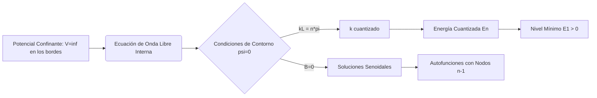

# Sistemas Unidimensionales

El estudio de los sistemas unidimensionales permite resolver de forma exacta la ecuación de Schrödinger y comprender fenómenos cuánticos puramente no clásicos, como la cuantización de la energía, la penetración en regiones clásicamente prohibidas y el efecto túnel.

## 📜 Contexto Histórico
* Tras el establecimiento de la ecuación de Schrödinger en 1926, los físicos aplicaron la teoría a los "modelos de juguete" más simples para ver sus consecuencias.
* **George Gamow (1928):** Aplicó el concepto de efecto túnel a través de barreras unidimensionales para explicar la desintegración alfa de los núcleos radiactivos.
* Las soluciones exactas de pozos de potencial y osciladores armónicos sentaron las bases para modelos más complejos en la física del estado sólido y la química cuántica.

---

## 🧮 Desarrollo Teórico Profundo

Resolver la ecuación de Schrödinger en una dimensión permite aislar y examinar el corazón matemático de la mecánica cuántica sin la complejidad del momento angular de las soluciones en 3D. Esto revela directamente la naturaleza de las restricciones impuestas por las condiciones de contorno y la aparición de energías cuantizadas.

### El Pozo Cuadrado Infinito (Partícula en una Caja)

Supongamos una partícula de masa $m$ en un potencial $V(x)$:

$$
V(x) = \begin{cases} 0 & \text{si } 0 < x < L \\ \infty & \text{en el exterior} \end{cases}
$$

Fuera de la caja, la probabilidad de encontrar la partícula es nula debido al potencial infinito; por ende, $\psi(x) = 0$ para $x \le 0$ y $x \ge L$. 

En el interior de la caja, el Hamiltoniano es el de una partícula libre, y la ecuación de Schrödinger independiente del tiempo se reduce a:

$$
-\frac{\hbar^2}{2m} \frac{d^2\psi(x)}{dx^2} = E \psi(x) \implies \frac{d^2\psi}{dx^2} + k^2\psi = 0 \quad \text{donde } k = \frac{\sqrt{2mE}}{\hbar}
$$

Esta es una ecuación diferencial ordinaria de segundo orden con coeficientes constantes. La solución general es una combinación lineal de ondas planas:

$$
\psi(x) = A\sin(kx) + B\cos(kx)
$$

**Imposición de Condiciones de Contorno:**
1. $\psi(0) = 0 \implies A\sin(0) + B\cos(0) = B = 0$. La solución se reduce a $\psi(x) = A\sin(kx)$.
2. $\psi(L) = 0 \implies A\sin(kL) = 0$. Dado que $A \neq 0$ (la solución trivial no es normalizable), la función seno debe anularse, lo que implica que su argumento es un múltiplo entero de $\pi$:

$$
kL = n\pi \implies k_n = \frac{n\pi}{L}, \quad \text{con } n = 1, 2, 3, \dots
$$

Al sustituir el valor cuantizado de $k_n$ en la definición de energía, descubrimos la **cuantización de la energía**:

$$
E_n = \frac{\hbar^2 k_n^2}{2m} = \frac{n^2\pi^2\hbar^2}{2mL^2}
$$

Es crucial destacar que la energía más baja posible no es cero ($E_1 > 0$). Este es el llamado nivel de punto cero, una manifestación del Principio de Incertidumbre: confinar la partícula reduce drásticamente su incertidumbre espacial $\Delta x$, lo que fuerza un aumento en la incertidumbre del momento $\Delta p$ y, en consecuencia, en la energía cinética promedio.

Aplicando la condición de normalización $\int_0^L |A\sin(n\pi x / L)|^2 dx = 1$, encontramos la amplitud $A = \sqrt{2/L}$. Las autofunciones resultan:

$$
\psi_n(x) = \sqrt{\frac{2}{L}} \sin\left(\frac{n\pi x}{L}\right)
$$



### El Oscilador Armónico Cuántico: Enfoque Algebraico

El potencial armónico clásico $V(x) = \frac{1}{2}m\omega^2 x^2$ es fundamental, ya que aproxima el comportamiento de cualquier potencial cerca de un punto de equilibrio estable (expansión de Taylor).
El Hamiltoniano cuántico es:

$$
\hat{H} = \frac{\hat{p}^2}{2m} + \frac{1}{2}m\omega^2 \hat{x}^2
$$

En lugar de resolver la complicada ecuación diferencial que involucra polinomios de Hermite, Paul Dirac introdujo el método algebraico de operadores de creación y aniquilación (u operadores escalera). Definimos operadores adimensionales, no hermitianos:

$$
\hat{a} = \sqrt{\frac{m\omega}{2\hbar}}\left( \hat{x} + \frac{i}{m\omega}\hat{p} \right), \quad \hat{a}^\dagger = \sqrt{\frac{m\omega}{2\hbar}}\left( \hat{x} - \frac{i}{m\omega}\hat{p} \right)
$$

Se puede demostrar, a partir del conmutador fundamental $[\hat{x}, \hat{p}] = i\hbar$, que:

$$
[\hat{a}, \hat{a}^\dagger] = 1
$$

Reescribiendo el Hamiltoniano en términos de estos operadores:

$$
\hat{H} = \hbar\omega \left( \hat{a}^\dagger\hat{a} + \frac{1}{2} \right)
$$

Si actuamos con $\hat{H}$ sobre el estado modificado $\hat{a}|n\rangle$, se comprueba que disminuye la energía en $\hbar\omega$; por eso $\hat{a}$ es el **operador de aniquilación** o descenso. De manera análoga, $\hat{a}^\dagger$ la aumenta, siendo el **operador de creación**. 

Para evitar un colapso hacia energías negativas infinitas (lo cual violaría la positividad del espectro), debe existir un estado fundamental mínimo $|0\rangle$ tal que la aplicación de $\hat{a}$ lo anule: $\hat{a}|0\rangle = 0$.
A partir de aquí, la energía del estado fundamental es:

$$
\hat{H}|0\rangle = \hbar\omega \left( 0 + \frac{1}{2} \right)|0\rangle = \frac{1}{2}\hbar\omega |0\rangle \implies E_0 = \frac{1}{2}\hbar\omega
$$

Los autoestados excitados superiores se obtienen aplicando iterativamente el operador escalera de subida:

$$
E_n = \hbar\omega \left( n + \frac{1}{2} \right), \quad n=0, 1, 2, \dots
$$

Este espectro está igualmente espaciado.

### Efecto Túnel Cuántico

Una característica contraria a la intuición surge cuando resolvemos la ecuación de Schrödinger para una barrera de potencial de altura $V_0$ y ancho $a$, sobre la cual incide una partícula con energía $E < V_0$. Clásicamente, la partícula rebotaría con un 100% de certeza en el punto de retorno.

Cuantitativamente, la ecuación en la zona prohibida (dentro de la barrera $0 \le x \le a$) es:

$$
\frac{d^2\psi}{dx^2} = \frac{2m(V_0 - E)}{\hbar^2} \psi = \kappa^2 \psi
$$

Donde $\kappa$ es una constante real. La solución no oscila, sino que decrece exponencialmente:

$$
\psi(x) = C e^{-\kappa x} + D e^{+\kappa x}
$$

Empalmando las funciones de onda y sus primeras derivadas (condiciones de continuidad) en las fronteras de la barrera $x=0$ y $x=a$, se descubre que la amplitud de la onda en la región más allá de la barrera ($x > a$) no es cero. La partícula tiene una probabilidad de "hacer un túnel".
El coeficiente de transmisión $T$ para una barrera ancha y alta decae exponencialmente de la forma:

$$
T \approx e^{-2\kappa a} = \exp\left( -2a \frac{\sqrt{2m(V_0 - E)}}{\hbar} \right)
$$

Este fenómeno explica procesos tan diversos como la desintegración radiactiva alfa, el funcionamiento de microscopios de efecto túnel (STM) y las fusiones nucleares en los centros estelares, que ocurren a temperaturas "demasiado frías" para superar clásicamente las barreras de repulsión de Coulomb.

---

## 🛠 Ejemplo Práctico
**Problema:** Una partícula se encuentra en el estado fundamental de un pozo infinito de potencial unidimensional de anchura $L$. ¿Cuál es la probabilidad de encontrar a la partícula en el tercio central de la caja, es decir, entre $x = L/3$ y $x = 2L/3$?

**Solución paso a paso:**
1. La función de onda del estado fundamental ($n=1$) es:

$$
\psi_1(x) = \sqrt{\frac{2}{L}} \sin\left(\frac{\pi x}{L}\right)
$$

2. La densidad de probabilidad es $P(x) = |\psi_1(x)|^2 = \frac{2}{L} \sin^2\left(\frac{\pi x}{L}\right)$.
3. Calculamos la integral de probabilidad en el intervalo pedido:

$$
P = \int_{L/3}^{2L/3} \frac{2}{L} \sin^2\left(\frac{\pi x}{L}\right) dx
$$

4. Usamos la identidad trigonométrica $\sin^2(\theta) = \frac{1 - \cos(2\theta)}{2}$:

$$
P = \frac{2}{L} \int_{L/3}^{2L/3} \frac{1 - \cos\left(\frac{2\pi x}{L}\right)}{2} dx = \frac{1}{L} \left[ x - \frac{L}{2\pi}\sin\left(\frac{2\pi x}{L}\right) \right]_{L/3}^{2L/3}
$$

5. Evaluamos en los límites:

$$
P = \frac{1}{L} \left[ \left( \frac{2L}{3} - \frac{L}{2\pi}\sin\left(\frac{4\pi}{3}\right) \right) - \left( \frac{L}{3} - \frac{L}{2\pi}\sin\left(\frac{2\pi}{3}\right) \right) \right]
$$

Sabiendo que $\sin(4\pi/3) = -\sqrt{3}/2$ y $\sin(2\pi/3) = \sqrt{3}/2$:

$$
P = \frac{1}{L} \left[ \frac{L}{3} - \frac{L}{2\pi}\left(-\frac{\sqrt{3}}{2} - \frac{\sqrt{3}}{2}\right) \right] = \frac{1}{3} + \frac{\sqrt{3}}{2\pi} \approx 0.333 + 0.276 = 0.609
$$

La probabilidad es del 60.9%, mucho mayor al 33.3% clásico esperado, debido a que la onda de probabilidad "se abulta" en el centro.

---

## 📝 Guía de Ejercicios Resueltos

**Problema 1: Potencial Delta Atractivo de Dirac**
Encuentra el estado ligado y su energía para una partícula de masa $m$ bajo la influencia de un potencial de pozo de la forma $V(x) = -\alpha \delta(x)$ con $\alpha > 0$.
**Solución paso a paso:**
1. La ecuación de Schrödinger es $-\frac{\hbar^2}{2m} \frac{d^2\psi}{dx^2} - \alpha \delta(x)\psi = E\psi$.
2. Para $x \neq 0$, $V=0$. Las soluciones acotadas para estados ligados ($E < 0$) son ondas evanescentes: $\psi(x) = A e^{-\kappa x}$ (para $x>0$) y $\psi(x) = A e^{+\kappa x}$ (para $x<0$), donde $\kappa = \sqrt{-2mE}/\hbar$. Podemos escribir $\psi(x) = A e^{-\kappa |x|}$.
3. Integramos la ecuación de Schrödinger en un intervalo $[-\epsilon, +\epsilon]$ alrededor del origen y tomamos el límite $\epsilon \to 0$:

$$
-\frac{\hbar^2}{2m} \left( \left. \frac{d\psi}{dx} \right|_{0^+} - \left. \frac{d\psi}{dx} \right|_{0^-} \right) - \alpha \psi(0) = 0
$$

4. Calculamos los saltos de las derivadas en $x=0$:

$$
\left. \frac{d\psi}{dx} \right|_{0^+} = -A\kappa, \quad \left. \frac{d\psi}{dx} \right|_{0^-} = +A\kappa
$$

5. Sustituimos en la condición de discontinuidad: $-\frac{\hbar^2}{2m} (-2A\kappa) = \alpha A$.
6. Simplificando obtenemos $\frac{\hbar^2 \kappa}{m} = \alpha \implies \kappa = \frac{m\alpha}{\hbar^2}$.
7. Recordando que $E = -\frac{\hbar^2 \kappa^2}{2m}$, la energía del único estado ligado es $E_0 = -\frac{m\alpha^2}{2\hbar^2}$.

**Problema 2: Barrera de Potencial y Aproximación WKB**
Estima el coeficiente de transmisión $T$ para una barrera de potencial parabólica invertida $V(x) = V_0 - \frac{1}{2}kx^2$ usando la aproximación WKB para un electrón de energía $E < V_0$.
**Solución paso a paso:**
1. La aproximación WKB para el coeficiente de transmisión es $T \approx \exp\left( -2 \int_{x_1}^{x_2} \kappa(x) dx \right)$, donde $\kappa(x) = \frac{\sqrt{2m(V(x) - E)}}{\hbar}$.
2. Encontramos los puntos de retorno $x_1, x_2$ igualando $E = V(x)$:

$$
E = V_0 - \frac{1}{2}kx^2 \implies x_{1,2} = \pm \sqrt{\frac{2(V_0 - E)}{k}}
$$

3. Evaluamos la integral $I = \int_{-x_0}^{x_0} \sqrt{2m \left( V_0 - E - \frac{1}{2}kx^2 \right)} dx$, donde $x_0 = \sqrt{\frac{2(V_0 - E)}{k}}$.
4. Esta integral tiene la forma del área de un semi-círculo/elipse. Sea $V_0 - E = \Delta E$:

$$
I = \sqrt{mk} \int_{-x_0}^{x_0} \sqrt{x_0^2 - x^2} dx
$$

5. La integral matemática $\int_{-a}^a \sqrt{a^2-x^2} dx = \frac{\pi}{2}a^2$.
6. Así, $I = \sqrt{mk} \frac{\pi}{2} x_0^2 = \sqrt{mk} \frac{\pi}{2} \frac{2\Delta E}{k} = \pi \Delta E \sqrt{\frac{m}{k}}$.
7. Notando que la frecuencia natural del oscilador parabólico es $\omega = \sqrt{k/m}$, $I = \frac{\pi \Delta E}{\omega}$.
8. Sustituyendo en $T$: $T \approx \exp\left( -2 \frac{I}{\hbar} \right) = \exp\left( -\frac{2\pi(V_0 - E)}{\hbar\omega} \right)$.

**Problema 3: Base del Oscilador Armónico e Incertidumbre**
Para el estado fundamental $|0\rangle$ del oscilador armónico cuántico, demuestra explícitamente usando los operadores de creación y aniquilación que se minimiza el principio de incertidumbre de Heisenberg ($\Delta x \Delta p = \hbar / 2$).
**Solución paso a paso:**
1. Definimos $\hat{x} = \sqrt{\frac{\hbar}{2m\omega}}(\hat{a} + \hat{a}^\dagger)$ y $\hat{p} = -i\sqrt{\frac{m\hbar\omega}{2}}(\hat{a} - \hat{a}^\dagger)$.
2. En el estado base, $\langle 0 | \hat{x} | 0 \rangle = 0$ y $\langle 0 | \hat{p} | 0 \rangle = 0$ debido a la simetría de paridad y las propiedades de $\hat{a}|0\rangle = 0$.
3. Calculamos $\langle \hat{x}^2 \rangle = \frac{\hbar}{2m\omega} \langle 0 | (\hat{a} + \hat{a}^\dagger)^2 | 0 \rangle$.
Al expandir: $\hat{a}^2 + \hat{a}\hat{a}^\dagger + \hat{a}^\dagger\hat{a} + (\hat{a}^\dagger)^2$. Los términos $\hat{a}^2$ y $(\hat{a}^\dagger)^2$ cambian el estado en $\pm 2$ cuantos, dando un producto interno cero con $|0\rangle$.
4. Usamos el conmutador $[\hat{a}, \hat{a}^\dagger] = 1 \implies \hat{a}\hat{a}^\dagger = 1 + \hat{a}^\dagger\hat{a}$.
Así, $\langle 0 | \hat{a}\hat{a}^\dagger | 0 \rangle = 1 + \langle 0|\hat{a}^\dagger\hat{a}|0\rangle = 1 + 0 = 1$.
5. Por lo tanto, $(\Delta x)^2 = \langle \hat{x}^2 \rangle = \frac{\hbar}{2m\omega}$.
6. Del mismo modo para $\langle \hat{p}^2 \rangle = -\frac{m\hbar\omega}{2} \langle 0 | (\hat{a} - \hat{a}^\dagger)^2 | 0 \rangle$.
Expansión arroja un término útil $-\hat{a}\hat{a}^\dagger$, que aporta $-1$.
7. $(\Delta p)^2 = \langle \hat{p}^2 \rangle = \frac{m\hbar\omega}{2}$.
8. Multiplicando las varianzas: $(\Delta x)^2(\Delta p)^2 = \left( \frac{\hbar}{2m\omega} \right) \left( \frac{m\hbar\omega}{2} \right) = \frac{\hbar^2}{4}$.
Tomando la raíz cuadrada, obtenemos $\Delta x \Delta p = \hbar / 2$, el límite inferior exacto.

## 💻 Simulaciones Computacionales

A continuación se presenta un script que calcula y grafica numéricamente las funciones de onda (eigenestados) y los niveles de energía del oscilador armónico cuántico resolviendo el problema de autovalores del Hamiltoniano mediante un esquema de diferencias finitas de matriz dispersa.

```python
import numpy as np
import matplotlib.pyplot as plt
from scipy.sparse import diags
from scipy.sparse.linalg import eigsh

# Parámetros del espacio y del oscilador
N = 1000        # Puntos de la malla
L = 10.0        # Dimensión de la caja
x = np.linspace(-L/2, L/2, N)
dx = x[1] - x[0]

# Constantes físicas (unidades naturales: m=1, hbar=1)
m = 1.0
hbar = 1.0
omega = 1.0

# Potencial del oscilador armónico V(x) = (1/2)*m*omega^2*x^2
V = 0.5 * m * omega**2 * x**2

# Construcción del Hamiltoniano H = T + V usando diferencias finitas
# Derivada segunda: d^2/dx^2 f_i approx (f_{i+1} - 2f_i + f_{i-1}) / dx^2
t_coeff = -hbar**2 / (2.0 * m * dx**2)

main_diag = -2.0 * t_coeff * np.ones(N) + V
off_diag = t_coeff * np.ones(N-1)

H = diags([off_diag, main_diag, off_diag], [-1, 0, 1], format='csc')

# Resolviendo para los primeros 5 autoestados
num_eigenstates = 5
eigenvalues, eigenvectors = eigsh(H, k=num_eigenstates, which='SM')

# Graficando
plt.figure(figsize=(10, 7))
plt.plot(x, V, color='black', linewidth=2, label='Potencial Armónico $V(x)$')

# Escala para la visualización de las funciones de onda
scale = 2.0 

colors = ['#1f77b4', '#ff7f0e', '#2ca02c', '#d62728', '#9467bd']
for i in range(num_eigenstates):
    E = eigenvalues[i]
    psi = eigenvectors[:, i]
    # Aseguramos un signo consistente para los gráficos
    if psi[np.argmax(np.abs(psi))] < 0:
        psi = -psi
    
    # Dibujamos el nivel de energía
    plt.axhline(E, color=colors[i], linestyle='--', alpha=0.5)
    
    # Dibujamos la función de onda desplazada al nivel de energía correspondiente
    plt.plot(x, E + scale * psi, color=colors[i], 
             label=f'n={i}, $E_{i}$={E:.2f} $\hbar\omega$')

plt.xlim(-5, 5)
plt.ylim(0, max(eigenvalues) + 1)
plt.xlabel('Posición (x)')
plt.ylabel('Energía / Amplitud de Onda')
plt.title('Estados Ligados del Oscilador Armónico Cuántico (1D)')
plt.legend(loc='upper right')
plt.grid(True, alpha=0.3)
plt.tight_layout()
# plt.show() # Descomentar para visualizar
```

## 🚀 Fronteras de Investigación y Problemas Abiertos

En los confines de 2026, los sistemas unidimensionales dejaron de ser meros "modelos de juguete" para ser las plataformas físicas más codiciadas en la computación cuántica topológica. En 1D interactuante, el modelo del líquido de Fermi se quiebra completamente, dando lugar a los Líquidos de Luttinger, donde ocurren fenómenos de fraccionalización cuántica (ej. separación espín-carga). Otra frontera masiva es la observación y manipulación de Modos Cero de Majorana en hilos cuánticos (nanowires) unidimensionales acoplados a superconductores de onda-$p$. Al estar localizados en los bordes del sistema 1D, estos estados permiten el entrelazamiento trenzado (braiding) para bits cuánticos topológicos intrínsecamente protegidos contra la decoherencia local. Adicionalmente, el estudio de estados de borde en cadenas 1D, como el modelo Su-Schrieffer-Heeger (SSH), provee los prototipos para simuladores cuánticos en redes ópticas de átomos fríos.

## 📐 Formalismo Matemático Avanzado (Nivel Posgrado/Doctorado)

La física 1D en el límite de bajas energías (cerca de la superficie de Fermi reducida a dos puntos) es gobernada dictatorialmente por la **Teoría de Campos Conformes (CFT)** en el espacio de Minkowski 1+1D. El mapeo del álgebra de observables resulta en el Álgebra de Virasoro de dimensiones infinitas con una carga central $c$:

$$
[L_n, L_m] = (n-m)L_{n+m} + \frac{c}{12} n(n^2-1) \delta_{n+m, 0}
$$

Esta simetría confiere integrabilidad a muchos sistemas 1D acoplados y permite la técnica matemática exacta de la **Bosonización**. En 1D, las estadísticas fermiónicas y bosónicas pueden ser isomórficas; un campo fermiónico de Dirac $\psi(x)$ puede reescribirse a partir de un campo escalar bosónico $\phi(x)$ mediante la transformación compacta:

$$
\psi(x) \sim \frac{1}{\sqrt{2\pi\alpha}} \exp\left( -i\sqrt{4\pi} \phi(x) \right)
$$

Por el lado de la topología unidimensional, para sistemas periódicos gobernados por el teorema de Bloch, definimos la fase de Zak, la integral unidimensional de la conexión de Berry de los estados de banda $\mathcal{A}(k) = i \langle u_k | \partial_k u_k \rangle$ sobre la zona de Brillouin (BZ):

$$
\gamma_{\text{Zak}} = \oint_{\text{BZ}} \mathcal{A}(k) \, dk = \int_{-\pi/a}^{\pi/a} i \langle u_k | \frac{\partial}{\partial k} | u_k \rangle \, dk
$$

Para cadenas poliméricas 1D o aislantes topológicos 1D con simetría de inversión, esta fase es un invariante topológico cuantizado $\mathbb{Z}_2$, pudiendo tomar estrictamente los valores $0$ o $\pi$. Un valor de $\pi$ predice inequívocamente la existencia física de un estado topológicamente protegido de energía nula incrustado en el borde 1D.

## 📚 Recursos Específicos
### 🎓 Cursos y Clases Recomendadas
1. [MIT OCW 8.04 Quantum Physics I (Allan Adams)](https://ocw.mit.edu/courses/8-04-quantum-physics-i-spring-2013/): Serie de clases meticulosamente dedicadas a pozos cuadrados, pozos finitos, dispersión en escalones de potencial y funciones de onda atadas.
2. [Stanford - Quantum Mechanics (Leonard Susskind)](https://www.youtube.com/playlist?list=PLpGHT1n4-mAtWCAh1E_yT1eF82k7bFepf): Lecciones que resuelven el oscilador armónico cuántico de manera puramente algebraica usando operadores de creación y destrucción.
3. [MIT OCW 8.05 Quantum Physics II (Barton Zwiebach)](https://ocw.mit.edu/courses/8-05-quantum-physics-ii-fall-2013/): Repaso profundo de los potenciales en una dimensión haciendo énfasis en los teoremas generales de degeneración y nodos.

### 📝 Artículos Científicos Clave
1. **Gamow, G. (1928). "Zur Quantentheorie des Atomkernes"**. *Zeitschrift für Physik*, 51(3-4), 204-212. [DOI: 10.1007/BF01343196](https://doi.org/10.1007/BF01343196)
   *Importancia Teórica y Matemática:* Formula la teoría de la desintegración radiactiva alfa mediante el efecto túnel cuántico. Calcula la probabilidad de transmisión a través de la barrera Coulombiana:

   

$$
T \approx \exp\left( - \frac{2}{\hbar} \int_{r_0}^{R} \sqrt{2m (V(r) - E)} \, dr \right)
$$

   *Implicaciones Físicas:* Fue el primer gran triunfo predictivo del efecto túnel cuántico en sistemas unidimensionales radiales efectivos, estableciendo una relación directa entre el periodo de semidesintegración y la energía de la partícula alfa (Ley de Geiger-Nuttall).

2. **Dirac, P. A. M. (1927). "The Quantum Theory of the Emission and Absorption of Radiation"**. *Proc. R. Soc. Lond. A*, 114(767), 243-265. [DOI: 10.1098/rspa.1927.0039](https://doi.org/10.1098/rspa.1927.0039)
   *Importancia Teórica y Matemática:* Introdujo formalmente los operadores escalera (creación y aniquilación) para tratar modos electromagnéticos equivalentes a osciladores armónicos 1D, un formalismo algebraico central:

   

$$
\hat{H} = \hbar \omega \left( \hat{a}^\dagger \hat{a} + \frac{1}{2} \right), \quad [\hat{a}, \hat{a}^\dagger] = 1
$$

   *Implicaciones Físicas:* No solo resolvió el problema espectral del oscilador de forma elegante, sino que fundamentó la Segunda Cuantización, transformando osciladores abstractos en "partículas" (fotones).

3. **Kramers, H. A. (1926). "Wellenmechanik und halbzählige Quantisierung"**. *Zeitschrift für Physik*, 39, 828-840. [DOI: 10.1007/BF01451751](https://doi.org/10.1007/BF01451751)
   *Importancia Teórica y Matemática:* Junto con Brillouin y Wentzel (WKB), desarrolla una solución asintótica a la ecuación de Schrödinger dependiente de la acción semiclásica $S(x)$:

   

$$
\psi(x) \approx \frac{1}{\sqrt{p(x)}} \exp\left( \pm \frac{i}{\hbar} \int p(x) dx \right)
$$

   *Implicaciones Físicas:* La aproximación WKB en una dimensión proporcionó la conexión explícita entre la teoría cuántica rigurosa y las reglas de cuantización de Bohr-Sommerfeld de la antigua mecánica cuántica.

### 📖 Referencias Útiles y Bibliografía
1. **Libro**: [Introduction to Quantum Mechanics - David J. Griffiths](https://www.cambridge.org/highereducation/books/introduction-to-quantum-mechanics/990799252758F46C8765A2C3946C342C) (Capítulo 2). Estándar indiscutible para problemas en 1D.
2. **Libro**: [Principles of Quantum Mechanics - R. Shankar](https://link.springer.com/book/10.1007/978-1-4615-7675-4) (Capítulos 5 y 7).

## 🌐 Seminarios Avanzados y Literatura de Frontera

- [Harvard - Condensed Matter Physics](https://www.physics.harvard.edu/): Cursos centrados en sistemas de electrones de baja dimensión y líquidos de Luttinger.
- [MIT 8.05 Quantum Physics II](https://ocw.mit.edu/courses/8-05-quantum-physics-ii-fall-2013/): Un curso enfocado en resolver sistemas 1D acoplados y efectos cuánticos de baja dimensionalidad.
- [Perimeter Institute - Topological Quantum Matter](https://pirsa.org/): Conferencias sobre cómo los sistemas unidimensionales albergan modos de Majorana.
- [RMP: Colloquium: Majorana fermions in wire networks and quantum computing](https://journals.aps.org/rmp/abstract/10.1103/RevModPhys.87.137): Revisa cómo los sistemas 1D semiconductores son cruciales para la topología cuántica.
- [Nature: Signatures of Majorana fermions in hybrid superconductor-semiconductor nanowire devices](https://www.nature.com/articles/nature11062): Experimento pionero observando estados cuantizados de borde en sistemas unidimensionales.
- [Science: Realization of a Tonks-Girardeau Gas in One-Dimensional Atomic Gases](https://www.science.org/doi/10.1126/science.1098650): Confirmación de ferminización de bosones al ser confinados en una dimensión estricta.
