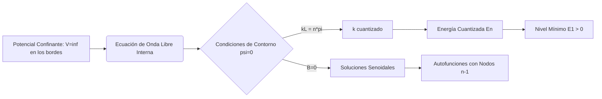

# Sistemas Unidimensionales

El estudio de los sistemas unidimensionales permite resolver de forma exacta la ecuación de Schrödinger y comprender fenómenos cuánticos puramente no clásicos, como la cuantización de la energía, la penetración en regiones clásicamente prohibidas y el efecto túnel.

## 📜 Contexto Histórico
* Tras el establecimiento de la ecuación de Schrödinger en 1926, los físicos aplicaron la teoría a los "modelos de juguete" más simples para ver sus consecuencias.
* **George Gamow (1928):** Aplicó el concepto de efecto túnel a través de barreras unidimensionales para explicar la desintegración alfa de los núcleos radiactivos.
* Las soluciones exactas de pozos de potencial y osciladores armónicos sentaron las bases para modelos más complejos en la física del estado sólido y la química cuántica.

---

## 🧮 Desarrollo Teórico Profundo

Resolver la ecuación de Schrödinger en una dimensión permite aislar y examinar el corazón matemático de la mecánica cuántica sin la complejidad del momento angular de las soluciones en 3D. Esto revela directamente la naturaleza de las restricciones impuestas por las condiciones de contorno y la aparición de energías cuantizadas.

### El Pozo Cuadrado Infinito (Partícula en una Caja)

Supongamos una partícula de masa $m$ en un potencial $V(x)$:
$$ V(x) = \begin{cases} 0 & \text{si } 0 < x < L \\ \infty & \text{en el exterior} \end{cases} $$
Fuera de la caja, la probabilidad de encontrar la partícula es nula debido al potencial infinito; por ende, $\psi(x) = 0$ para $x \le 0$ y $x \ge L$. 

En el interior de la caja, el Hamiltoniano es el de una partícula libre, y la ecuación de Schrödinger independiente del tiempo se reduce a:
$$ -\frac{\hbar^2}{2m} \frac{d^2\psi(x)}{dx^2} = E \psi(x) \implies \frac{d^2\psi}{dx^2} + k^2\psi = 0 \quad \text{donde } k = \frac{\sqrt{2mE}}{\hbar} $$
Esta es una ecuación diferencial ordinaria de segundo orden con coeficientes constantes. La solución general es una combinación lineal de ondas planas:
$$ \psi(x) = A\sin(kx) + B\cos(kx) $$

**Imposición de Condiciones de Contorno:**
1. $\psi(0) = 0 \implies A\sin(0) + B\cos(0) = B = 0$. La solución se reduce a $\psi(x) = A\sin(kx)$.
2. $\psi(L) = 0 \implies A\sin(kL) = 0$. Dado que $A \neq 0$ (la solución trivial no es normalizable), la función seno debe anularse, lo que implica que su argumento es un múltiplo entero de $\pi$:
$$ kL = n\pi \implies k_n = \frac{n\pi}{L}, \quad \text{con } n = 1, 2, 3, \dots $$

Al sustituir el valor cuantizado de $k_n$ en la definición de energía, descubrimos la **cuantización de la energía**:
$$ E_n = \frac{\hbar^2 k_n^2}{2m} = \frac{n^2\pi^2\hbar^2}{2mL^2} $$
Es crucial destacar que la energía más baja posible no es cero ($E_1 > 0$). Este es el llamado nivel de punto cero, una manifestación del Principio de Incertidumbre: confinar la partícula reduce drásticamente su incertidumbre espacial $\Delta x$, lo que fuerza un aumento en la incertidumbre del momento $\Delta p$ y, en consecuencia, en la energía cinética promedio.

Aplicando la condición de normalización $\int_0^L |A\sin(n\pi x / L)|^2 dx = 1$, encontramos la amplitud $A = \sqrt{2/L}$. Las autofunciones resultan:
$$ \psi_n(x) = \sqrt{\frac{2}{L}} \sin\left(\frac{n\pi x}{L}\right) $$

### El Oscilador Armónico Cuántico: Enfoque Algebraico

El potencial armónico clásico $V(x) = \frac{1}{2}m\omega^2 x^2$ es fundamental, ya que aproxima el comportamiento de cualquier potencial cerca de un punto de equilibrio estable (expansión de Taylor).
El Hamiltoniano cuántico es:
$$ \hat{H} = \frac{\hat{p}^2}{2m} + \frac{1}{2}m\omega^2 \hat{x}^2 $$
En lugar de resolver la complicada ecuación diferencial que involucra polinomios de Hermite, Paul Dirac introdujo el método algebraico de operadores de creación y aniquilación (u operadores escalera). Definimos operadores adimensionales, no hermitianos:
$$ \hat{a} = \sqrt{\frac{m\omega}{2\hbar}}\left( \hat{x} + \frac{i}{m\omega}\hat{p} \right), \quad \hat{a}^\dagger = \sqrt{\frac{m\omega}{2\hbar}}\left( \hat{x} - \frac{i}{m\omega}\hat{p} \right) $$
Se puede demostrar, a partir del conmutador fundamental $[\hat{x}, \hat{p}] = i\hbar$, que:
$$ [\hat{a}, \hat{a}^\dagger] = 1 $$
Reescribiendo el Hamiltoniano en términos de estos operadores:
$$ \hat{H} = \hbar\omega \left( \hat{a}^\dagger\hat{a} + \frac{1}{2} \right) $$
Si actuamos con $\hat{H}$ sobre el estado modificado $\hat{a}|n\rangle$, se comprueba que disminuye la energía en $\hbar\omega$; por eso $\hat{a}$ es el **operador de aniquilación** o descenso. De manera análoga, $\hat{a}^\dagger$ la aumenta, siendo el **operador de creación**. 

Para evitar un colapso hacia energías negativas infinitas (lo cual violaría la positividad del espectro), debe existir un estado fundamental mínimo $|0\rangle$ tal que la aplicación de $\hat{a}$ lo anule: $\hat{a}|0\rangle = 0$.
A partir de aquí, la energía del estado fundamental es:
$$ \hat{H}|0\rangle = \hbar\omega \left( 0 + \frac{1}{2} \right)|0\rangle = \frac{1}{2}\hbar\omega |0\rangle \implies E_0 = \frac{1}{2}\hbar\omega $$
Los autoestados excitados superiores se obtienen aplicando iterativamente el operador escalera de subida:
$$ E_n = \hbar\omega \left( n + \frac{1}{2} \right), \quad n=0, 1, 2, \dots $$
Este espectro está igualmente espaciado.

### Efecto Túnel Cuántico

Una característica contraria a la intuición surge cuando resolvemos la ecuación de Schrödinger para una barrera de potencial de altura $V_0$ y ancho $a$, sobre la cual incide una partícula con energía $E < V_0$. Clásicamente, la partícula rebotaría con un 100% de certeza en el punto de retorno.

Cuantitativamente, la ecuación en la zona prohibida (dentro de la barrera $0 \le x \le a$) es:
$$ \frac{d^2\psi}{dx^2} = \frac{2m(V_0 - E)}{\hbar^2} \psi = \kappa^2 \psi $$
Donde $\kappa$ es una constante real. La solución no oscila, sino que decrece exponencialmente:
$$ \psi(x) = C e^{-\kappa x} + D e^{+\kappa x} $$
Empalmando las funciones de onda y sus primeras derivadas (condiciones de continuidad) en las fronteras de la barrera $x=0$ y $x=a$, se descubre que la amplitud de la onda en la región más allá de la barrera ($x > a$) no es cero. La partícula tiene una probabilidad de "hacer un túnel".
El coeficiente de transmisión $T$ para una barrera ancha y alta decae exponencialmente de la forma:
$$ T \approx e^{-2\kappa a} = \exp\left( -2a \frac{\sqrt{2m(V_0 - E)}}{\hbar} \right) $$
Este fenómeno explica procesos tan diversos como la desintegración radiactiva alfa, el funcionamiento de microscopios de efecto túnel (STM) y las fusiones nucleares en los centros estelares, que ocurren a temperaturas "demasiado frías" para superar clásicamente las barreras de repulsión de Coulomb.

---

## 🛠 Ejemplo Práctico
**Problema:** Una partícula se encuentra en el estado fundamental de un pozo infinito de potencial unidimensional de anchura $L$. ¿Cuál es la probabilidad de encontrar a la partícula en el tercio central de la caja, es decir, entre $x = L/3$ y $x = 2L/3$?

**Solución paso a paso:**
1. La función de onda del estado fundamental ($n=1$) es:
$$ \psi_1(x) = \sqrt{\frac{2}{L}} \sin\left(\frac{\pi x}{L}\right) $$
2. La densidad de probabilidad es $P(x) = |\psi_1(x)|^2 = \frac{2}{L} \sin^2\left(\frac{\pi x}{L}\right)$.
3. Calculamos la integral de probabilidad en el intervalo pedido:
$$ P = \int_{L/3}^{2L/3} \frac{2}{L} \sin^2\left(\frac{\pi x}{L}\right) dx $$
4. Usamos la identidad trigonométrica $\sin^2(\theta) = \frac{1 - \cos(2\theta)}{2}$:
$$ P = \frac{2}{L} \int_{L/3}^{2L/3} \frac{1 - \cos\left(\frac{2\pi x}{L}\right)}{2} dx = \frac{1}{L} \left[ x - \frac{L}{2\pi}\sin\left(\frac{2\pi x}{L}\right) \right]_{L/3}^{2L/3} $$
5. Evaluamos en los límites:
$$ P = \frac{1}{L} \left[ \left( \frac{2L}{3} - \frac{L}{2\pi}\sin\left(\frac{4\pi}{3}\right) \right) - \left( \frac{L}{3} - \frac{L}{2\pi}\sin\left(\frac{2\pi}{3}\right) \right) \right] $$
Sabiendo que $\sin(4\pi/3) = -\sqrt{3}/2$ y $\sin(2\pi/3) = \sqrt{3}/2$:
$$ P = \frac{1}{L} \left[ \frac{L}{3} - \frac{L}{2\pi}\left(-\frac{\sqrt{3}}{2} - \frac{\sqrt{3}}{2}\right) \right] = \frac{1}{3} + \frac{\sqrt{3}}{2\pi} \approx 0.333 + 0.276 = 0.609 $$
La probabilidad es del 60.9%, mucho mayor al 33.3% clásico esperado, debido a que la onda de probabilidad "se abulta" en el centro.

---

## 📚 Recursos Específicos

### 🎓 Cursos y Clases Recomendadas
1. [MIT 8.04 Quantum Physics I (Allan Adams)](https://ocw.mit.edu/courses/8-04-quantum-physics-i-spring-2013/): Serie de clases meticulosamente dedicadas a pozos cuadrados, pozos finitos, dispersión en escalones de potencial y funciones de onda atadas.
2. [Stanford - Quantum Mechanics (Leonard Susskind)](https://www.youtube.com/playlist?list=PLpGHT1n4-mAtWCAh1E_yT1eF82k7bFepf): Lecciones que resuelven el oscilador armónico cuántico de manera puramente algebraica usando operadores de creación y destrucción.
3. [NPTEL Quantum Mechanics I (IIT Madras)](https://nptel.ac.in/courses/115106066): Enfoque analítico riguroso en las soluciones matemáticas de sistemas 1D, ideal para quienes buscan derivaciones paso a paso de las ecuaciones diferenciales.
4. [MIT 8.05 Quantum Physics II (Barton Zwiebach)](https://ocw.mit.edu/courses/8-05-quantum-physics-ii-fall-2013/): Repaso profundo de los potenciales en una dimensión haciendo énfasis en los teoremas generales de degeneración y nodos de la función de onda.
5. [Coursera - Quantum Mechanics (University of Colorado)](https://www.coursera.org/learn/quantum-mechanics): Análisis visual de las barreras de potencial y cálculo detallado del coeficiente de transmisión de túnel.

### 📝 Artículos e Interactivos Interesantes
1. **PhET Interactive Simulations:** [Quantum Bound States](https://phet.colorado.edu/en/simulations/bound-states) - Magnífica simulación para construir potenciales arbitrarios y visualizar los niveles de energía discretos.
2. **PhET Interactive Simulations:** [Quantum Tunneling and Wave Packets](https://phet.colorado.edu/en/simulations/quantum-tunneling) - Simulador en tiempo real que permite mandar paquetes de ondas Gaussianos hacia barreras y ver las ondas transmitidas y reflejadas.
3. **Falstad Quantum 1D Applet:** [QM 1D](http://www.falstad.com/qm1d/) - (Imprescindible) Visualiza fasores, funciones de onda, valores esperados y evolución temporal para el oscilador armónico y otras geometrías 1D.
4. **HyperPhysics:** [Particle in a Box](http://hyperphysics.phy-astr.gsu.edu/hbase/quantum/schr.html#c3) - Descripción concisa con calculadora interactiva de energías según la anchura y masa.
5. **HyperPhysics:** [Quantum Harmonic Oscillator](http://hyperphysics.phy-astr.gsu.edu/hbase/quantum/hosc.html) - Resume maravillosamente las energías y grafica las distribuciones probabilísticas contra el caso clásico.
6. **Wikipedia:** [Oscilador Armónico Cuántico](https://es.wikipedia.org/wiki/Oscilador_arm%C3%B3nico_cu%C3%A1ntico) - Artículo completo, incluye tablas con las formas explícitas de los polinomios de Hermite.
7. **Wikipedia:** [Efecto Túnel](https://es.wikipedia.org/wiki/Efecto_t%C3%BAnel) - Artículo teórico sobre el cálculo matemático, la aproximación WKB y aplicaciones.
8. **Wolfram Demonstrations Project:** [Harmonic Oscillator Wavefunctions](https://demonstrations.wolfram.com/HarmonicOscillatorWavefunctions/) - Manipula los parámetros $n$ y $\omega$ para visualizar la probabilidad cuántica y su límite clásico.

### 📖 Referencias Útiles y Bibliografía
1. **Libro**: [Introduction to Quantum Mechanics - David J. Griffiths](https://www.cambridge.org/highereducation/books/introduction-to-quantum-mechanics/990799252758F46C8765A2C3946C342C) (Capítulo 2). El estándar de oro. Todo el capítulo está dedicado a problemas en 1D: pozo infinito, oscilador, partícula libre y barrera de potencial.
2. **Libro**: [Quantum Mechanics - Claude Cohen-Tannoudji](https://www.wiley.com/en-us/Quantum+Mechanics%2C+Volume+1%3A+Basic+Concepts%2C+Tools%2C+and+Applications%2C+2nd+Edition-p-9783527345533) (Vol. 1). Aborda en detalle los complementos matemáticos y soluciones hipergeométricas para potenciales en una dimensión.
3. **Libro**: [Principles of Quantum Mechanics - R. Shankar](https://link.springer.com/book/10.1007/978-1-4615-7675-4) (Capítulos 5 y 7). Su resolución analítica y algebraica del oscilador armónico unidimensional es insuperable.
4. **Libro**: [Feynman Lectures on Physics - Richard Feynman](https://www.feynmanlectures.caltech.edu/III_toc.html) (Vol. III). Aporta una perspectiva única sobre los estados base en el amoníaco y cómo modelos simples 1D explican moléculas complejas.
