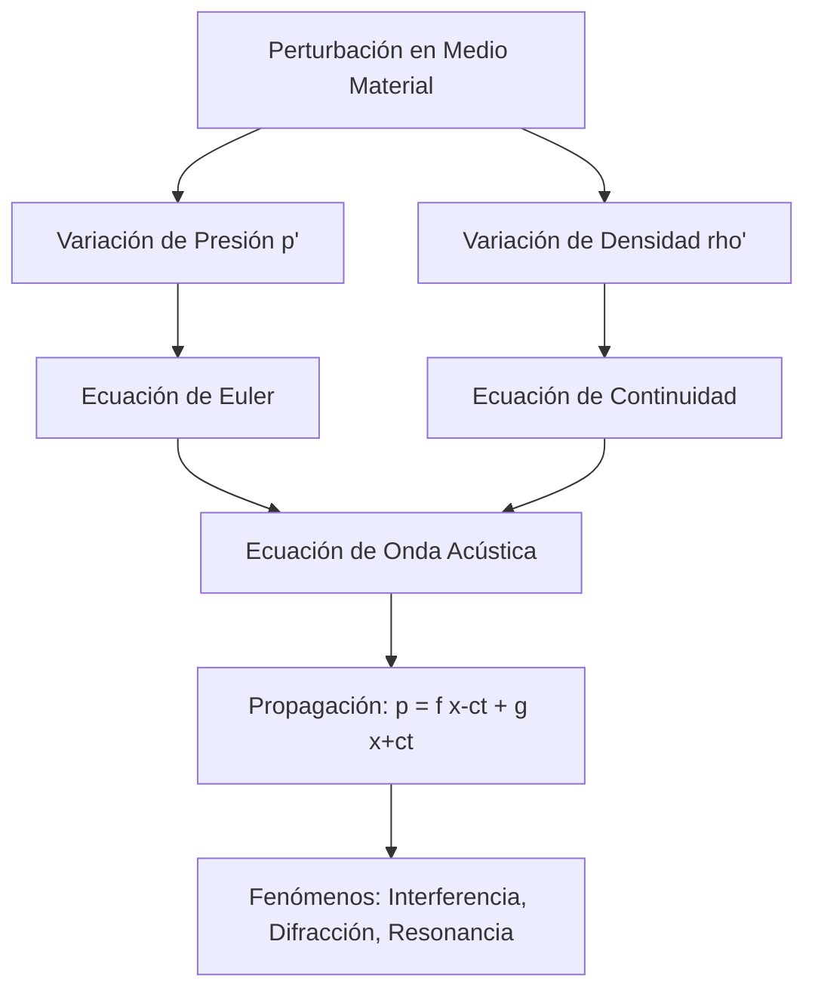

# Acústica

La acústica estudia la producción, propagación y detección del sonido. En gases y líquidos, el sonido suele propagarse como una onda longitudinal de presión; en sólidos, puede propagarse tanto en modos longitudinales como transversales.

## Conceptos Fundamentales

- **Sonido**: Onda mecánica que requiere un medio material para propagarse.
- **Frecuencia**: Determina el tono percibido.
- **Amplitud e intensidad**: Relacionadas con la energía transportada y el volumen percibido.
- **Armónicos**: Modos discretos de vibración que determinan el timbre.
- **Impedancia acústica**: Controla la transmisión y reflexión del sonido entre medios.

## 🧮 Desarrollo Teórico Profundo

La acústica se fundamenta en las ecuaciones de la mecánica de fluidos aplicadas a perturbaciones de pequeña amplitud. A nivel universitario, el sonido se modela a partir de las ecuaciones de conservación de masa, momento y la ecuación de estado termodinámica.

### 1. Ecuación de Onda Acústica Unidimensional

Consideremos un tubo lleno de un fluido con densidad de equilibrio $\rho_0$ y presión estática $p_0$. Una onda acústica introduce perturbaciones:
$$ \rho = \rho_0 + \rho' \quad \text{y} \quad p = p_0 + p' $$
donde $\rho'$ y $p'$ son fluctuaciones acústicas. 

La ecuación de continuidad (conservación de la masa) linealizada en una dimensión espacial $x$ es:
$$ \frac{\partial \rho'}{\partial t} + \rho_0 \frac{\partial u}{\partial x} = 0 $$
donde $u$ es la velocidad de la partícula del fluido.

La ecuación de Euler (conservación del momento) linealizada, asumiendo ausencia de fuerzas externas y viscosidad, es:
$$ \rho_0 \frac{\partial u}{\partial t} + \frac{\partial p'}{\partial x} = 0 $$

### 2. Relación de Estado y Velocidad del Sonido

Para cerrar el sistema, necesitamos una relación entre la presión y la densidad. Asumiendo un proceso adiabático reversible (isentrópico), porque las variaciones de presión ocurren demasiado rápido para el intercambio de calor:
$$ p' = \left( \frac{\partial p}{\partial \rho} \right)_S \rho' = c^2 \rho' $$
donde definimos la velocidad termodinámica del sonido como:
$$ c = \sqrt{\left( \frac{\partial p}{\partial \rho} \right)_S} $$

Para un gas ideal con ecuación de estado $p = \rho R T / M$, la relación isentrópica es $p \propto \rho^\gamma$, donde $\gamma = C_p/C_v$ es el coeficiente de dilatación adiabática. Derivando obtenemos:
$$ c = \sqrt{\frac{\gamma p_0}{\rho_0}} = \sqrt{\frac{\gamma R T}{M}} $$

### 3. Derivación de la Ecuación de Onda

Tomando la derivada parcial con respecto al tiempo de la ecuación de continuidad y la derivada parcial con respecto a $x$ de la ecuación de Euler:
$$ \frac{\partial^2 \rho'}{\partial t^2} + \rho_0 \frac{\partial^2 u}{\partial x \partial t} = 0 $$
$$ \rho_0 \frac{\partial^2 u}{\partial t \partial x} + \frac{\partial^2 p'}{\partial x^2} = 0 $$
Restando estas dos ecuaciones e introduciendo la relación isentrópica $\rho' = p'/c^2$, obtenemos la **ecuación de onda acústica**:
$$ \frac{\partial^2 p'}{\partial x^2} - \frac{1}{c^2} \frac{\partial^2 p'}{\partial t^2} = 0 $$

La solución general de D'Alembert es:
$$ p'(x, t) = f(x - ct) + g(x + ct) $$
que representa ondas viajeras hacia la derecha y hacia la izquierda.

### 4. Impedancia Acústica e Intensidad

La impedancia acústica específica $Z$ de un medio determina cómo se transmite la energía y se define como la razón entre la presión acústica y la velocidad de partícula:
$$ Z = \frac{p'}{u} = \rho_0 c $$
Para una onda plana progresiva pura, esta relación es real y constante. La intensidad sonora $I$ (energía por unidad de área y tiempo) transportada por una onda armónica es el promedio temporal del producto de la presión y la velocidad:
$$ I = \langle p' u \rangle = \frac{p_{\text{rms}}^2}{Z} = \frac{p_m^2}{2 \rho_0 c} $$
donde $p_m$ es la amplitud de presión. El nivel de intensidad se mide en decibelios (dB):
$$ \beta = 10 \log_{10}\left( \frac{I}{I_0} \right) \quad \text{con} \quad I_0 = 10^{-12} \, \text{W/m}^2 $$

## Aplicaciones

- Diseño de instrumentos musicales.
- Ultrasonido médico.
- Ingeniería de salas y aislamiento acústico.
- Sonar, geofísica y monitoreo industrial.

## 📚 Recursos
### Cursos
1. ["Acoustics: Basic Physics" - Coursera (UNSW Sydney)](https://www.coursera.org/learn/acoustics)
2. ["Fundamentals of Audio and Music Engineering" - Coursera (University of Rochester)](https://www.coursera.org/learn/audio-engineering)
3. ["Introduction to Acoustics" - edX (TU Delft)](https://www.edx.org/course/introduction-to-acoustics)
4. ["Architectural Acoustics" - NPTEL (IIT Kharagpur)](https://nptel.ac.in/courses/105105152)
5. ["Sound and Waves" - Khan Academy](https://www.khanacademy.org/science/physics/mechanical-waves-and-sound)

### Artículos y Simulaciones
1. ["Sound" - PhET Interactive Simulations](https://phet.colorado.edu/en/simulations/sound)
2. ["Wave Interference" - PhET Interactive Simulations](https://phet.colorado.edu/en/simulations/wave-interference)
3. ["Hearing Frequency Test" - Online Tone Generator](https://www.szynalski.com/tone-generator/)
4. ["The Physics of Music" - Michigan Technological University](https://pages.mtu.edu/~suits/Physicsofmusic.html)
5. ["Ultrasound in Medicine" - Physics World](https://physicsworld.com/a/ultrasound-in-medicine/)
6. ["Ripple Tank Simulation" - Falstad](http://www.falstad.com/ripple/)
7. ["Acoustic Metamaterials" - Science Direct](https://www.sciencedirect.com/topics/engineering/acoustic-metamaterials)
8. ["Doppler Effect Simulation" - oPhysics](https://ophysics.com/w11.html)

### 📖 Referencias Útiles y Bibliografía
1. [*Fundamentals of Acoustics* por Lawrence E. Kinsler et al.](https://www.wiley.com/en-us/Fundamentals+of+Acoustics%2C+4th+Edition-p-9780471847892)
2. [*Acoustics* por Leo L. Beranek](https://asa.scitation.org/doi/book/10.1121/1.4920216)
3. [*The Theory of Sound* por Lord Rayleigh](https://archive.org/details/theoryofsound01rayl)
