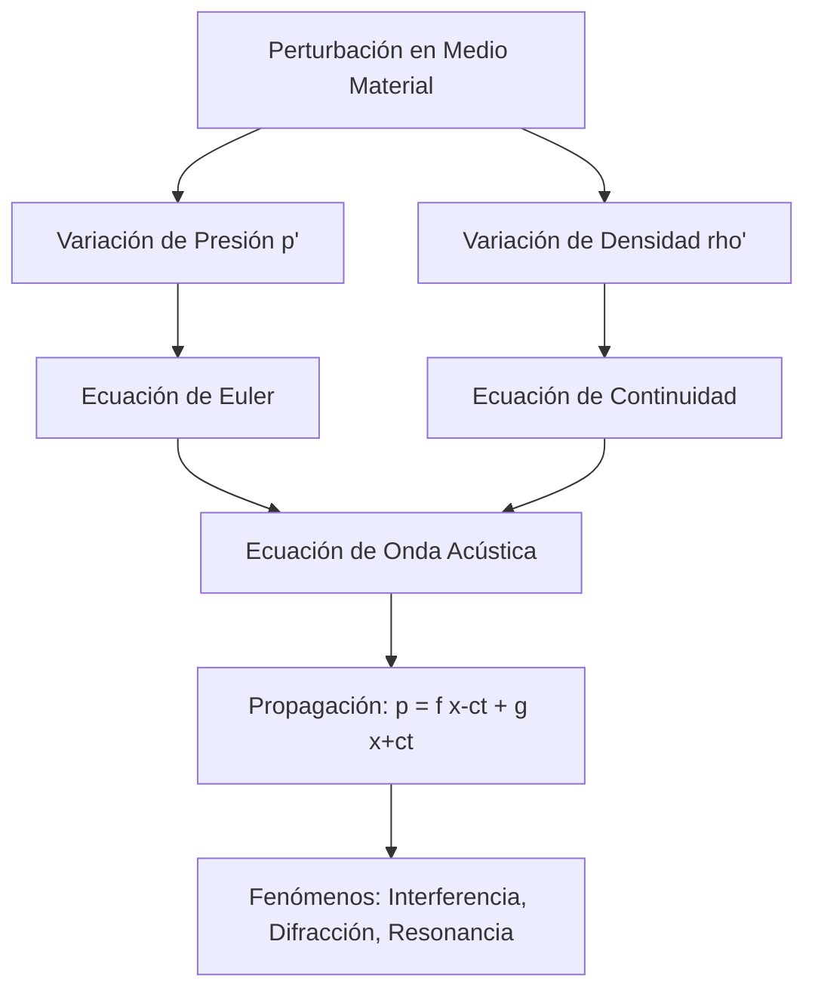

# Acústica

La acústica estudia la producción, propagación y detección del sonido. En gases y líquidos, el sonido suele propagarse como una onda longitudinal de presión; en sólidos, puede propagarse tanto en modos longitudinales como transversales.

## Conceptos Fundamentales

- **Sonido**: Onda mecánica que requiere un medio material para propagarse.
- **Frecuencia**: Determina el tono percibido.
- **Amplitud e intensidad**: Relacionadas con la energía transportada y el volumen percibido.
- **Armónicos**: Modos discretos de vibración que determinan el timbre.
- **Impedancia acústica**: Controla la transmisión y reflexión del sonido entre medios.

## 🧮 Desarrollo Teórico Profundo

La acústica se fundamenta en las ecuaciones de la mecánica de fluidos aplicadas a perturbaciones de pequeña amplitud. A nivel universitario, el sonido se modela a partir de las ecuaciones de conservación de masa, momento y la ecuación de estado termodinámica.

### 1. Ecuación de Onda Acústica Unidimensional

Consideremos un tubo lleno de un fluido con densidad de equilibrio $\rho_0$ y presión estática $p_0$. Una onda acústica introduce perturbaciones:
$$ \rho = \rho_0 + \rho' \quad \text{y} \quad p = p_0 + p' $$
donde $\rho'$ y $p'$ son fluctuaciones acústicas. 

La ecuación de continuidad (conservación de la masa) linealizada en una dimensión espacial $x$ es:
$$ \frac{\partial \rho'}{\partial t} + \rho_0 \frac{\partial u}{\partial x} = 0 $$
donde $u$ es la velocidad de la partícula del fluido.

La ecuación de Euler (conservación del momento) linealizada, asumiendo ausencia de fuerzas externas y viscosidad, es:
$$ \rho_0 \frac{\partial u}{\partial t} + \frac{\partial p'}{\partial x} = 0 $$

### 2. Relación de Estado y Velocidad del Sonido

Para cerrar el sistema, necesitamos una relación entre la presión y la densidad. Asumiendo un proceso adiabático reversible (isentrópico), porque las variaciones de presión ocurren demasiado rápido para el intercambio de calor:
$$ p' = \left( \frac{\partial p}{\partial \rho} \right)_S \rho' = c^2 \rho' $$
donde definimos la velocidad termodinámica del sonido como:
$$ c = \sqrt{\left( \frac{\partial p}{\partial \rho} \right)_S} $$

Para un gas ideal con ecuación de estado $p = \rho R T / M$, la relación isentrópica es $p \propto \rho^\gamma$, donde $\gamma = C_p/C_v$ es el coeficiente de dilatación adiabática. Derivando obtenemos:
$$ c = \sqrt{\frac{\gamma p_0}{\rho_0}} = \sqrt{\frac{\gamma R T}{M}} $$

### 3. Derivación de la Ecuación de Onda

Tomando la derivada parcial con respecto al tiempo de la ecuación de continuidad y la derivada parcial con respecto a $x$ de la ecuación de Euler:
$$ \frac{\partial^2 \rho'}{\partial t^2} + \rho_0 \frac{\partial^2 u}{\partial x \partial t} = 0 $$
$$ \rho_0 \frac{\partial^2 u}{\partial t \partial x} + \frac{\partial^2 p'}{\partial x^2} = 0 $$
Restando estas dos ecuaciones e introduciendo la relación isentrópica $\rho' = p'/c^2$, obtenemos la **ecuación de onda acústica**:
$$ \frac{\partial^2 p'}{\partial x^2} - \frac{1}{c^2} \frac{\partial^2 p'}{\partial t^2} = 0 $$

La solución general de D'Alembert es:
$$ p'(x, t) = f(x - ct) + g(x + ct) $$
que representa ondas viajeras hacia la derecha y hacia la izquierda.

### 4. Impedancia Acústica e Intensidad

La impedancia acústica específica $Z$ de un medio determina cómo se transmite la energía y se define como la razón entre la presión acústica y la velocidad de partícula:
$$ Z = \frac{p'}{u} = \rho_0 c $$
Para una onda plana progresiva pura, esta relación es real y constante. La intensidad sonora $I$ (energía por unidad de área y tiempo) transportada por una onda armónica es el promedio temporal del producto de la presión y la velocidad:
$$ I = \langle p' u \rangle = \frac{p_{\text{rms}}^2}{Z} = \frac{p_m^2}{2 \rho_0 c} $$
donde $p_m$ es la amplitud de presión. El nivel de intensidad se mide en decibelios (dB):
$$ \beta = 10 \log_{10}\left( \frac{I}{I_0} \right) \quad \text{con} \quad I_0 = 10^{-12} \, \text{W/m}^2 $$



## Aplicaciones

- Diseño de instrumentos musicales.
- Ultrasonido médico.
- Ingeniería de salas y aislamiento acústico.
- Sonar, geofísica y monitoreo industrial.

## 📝 Guía de Ejercicios Resueltos

**Problema 1: Efecto Doppler con Aceleración**
Una sirena montada en una torre emite un sonido isotrópico de frecuencia $f_0 = 1200 \, \text{Hz}$. Un viento constante sopla a una velocidad $v_w = 15 \, \text{m/s}$ desde la sirena hacia un tren. El tren parte del reposo y se acerca a la torre con una aceleración $a = 2.5 \, \text{m/s}^2$. Considere la velocidad del sonido en el aire como $c = 340 \, \text{m/s}$. Calcule la frecuencia percibida por el tren en $t = 10 \, \text{s}$.

**Solución paso a paso:**
1. Determinamos la velocidad efectiva del sonido debido al viento: $c' = c + v_w = 340 + 15 = 355 \, \text{m/s}$.
2. Velocidad del observador en $t = 10 \, \text{s}$: $v_o = a \cdot t = 2.5 \cdot 10 = 25 \, \text{m/s}$.
3. Aplicamos el efecto Doppler: $f' = f_0 \left( \frac{c' + v_o}{c'} \right)$.
4. Sustituyendo valores: $f' = 1200 \left( \frac{355 + 25}{355} \right) \approx 1284.5 \, \text{Hz}$.

**Problema 2: Resonancia y Gases**
Un tubo A de longitud $L_A$ (abierto) tiene $O_2$ ($\gamma=1.4, M=32$). Un tubo B (cerrado en un extremo) de longitud $L_B = 0.8 L_A$ tiene He ($\gamma=1.66, M=4$). A la misma $T$, el tercer armónico de A resuena con el primer sobretono de B. Evalúe si esto es físicamente posible.

**Solución paso a paso:**
1. Velocidades del sonido: $v_A = \sqrt{\frac{1.4 R T}{32}}$ y $v_B = \sqrt{\frac{1.66 R T}{4}}$. Por ende $v_B / v_A = \sqrt{\frac{1.66}{4} \cdot \frac{32}{1.4}} \approx 3.08$.
2. Frecuencias: $f_{3,A} = \frac{3 v_A}{2 L_A}$, $f_{3,B} = \frac{3 v_B}{4 L_B} = \frac{3 v_B}{3.2 L_A}$.
3. Igualando: $\frac{v_A}{2} = \frac{v_B}{3.2} \implies v_B = 1.6 v_A$.
4. Dado que requerimos $v_B / v_A = 1.6$ para la resonancia pero las propiedades de los gases dictan $v_B / v_A = 3.08$, concluimos que es físicamente imposible a la misma temperatura.

**Problema 3: Atenuación Acústica**
Una onda esférica de presión se propaga en un medio viscoso. Su intensidad decae con la distancia $r$ como $I(r) = \frac{I_0}{r^2} e^{-2\alpha r}$. Determine la posición $r$ donde la tasa de pérdida de intensidad por unidad de longitud es máxima.

**Solución paso a paso:**
1. Tasa de pérdida: $L(r) = -\frac{dI}{dr} = I_0 e^{-2\alpha r} \left( \frac{2}{r^3} + \frac{2\alpha}{r^2} \right)$.
2. Para maximizar la pérdida, derivamos $L(r)$ respecto a $r$ e igualamos a cero:
   $L'(r) = I_0 e^{-2\alpha r} \left[ -2\alpha \left( \frac{2}{r^3} + \frac{2\alpha}{r^2} \right) - \frac{6}{r^4} - \frac{4\alpha}{r^3} \right] = 0$.
3. Simplificando el paréntesis: $-\frac{4\alpha}{r^3} - \frac{4\alpha^2}{r^2} - \frac{6}{r^4} - \frac{4\alpha}{r^3} = 0$.
4. Multiplicando por $r^4$: $4\alpha^2 r^2 + 8\alpha r + 6 = 0$. Esta ecuación no tiene raíces reales positivas (discriminante $64\alpha^2 - 96\alpha^2 < 0$), lo que implica que el máximo ocurre en el límite inferior de $r$ válido (origen efectivo).

## 💻 Simulaciones Computacionales

A continuación, se presenta un script en Python que simula el patrón de interferencia acústica bidimensional producido por dos fuentes puntuales (altavoces) emitiendo sonido de la misma frecuencia en fase. Utiliza `numpy` para el cálculo matricial y `matplotlib` para la visualización.

```python
import numpy as np
import matplotlib.pyplot as plt

def simular_interferencia_acustica():
    """
    Simula y visualiza el patrón de interferencia espacial de dos
    fuentes sonoras puntuales coherentes.
    """
    # Parámetros físicos
    f = 1000.0          # Frecuencia (Hz)
    c = 343.0           # Velocidad del sonido en el aire (m/s)
    lam = c / f         # Longitud de onda (m)
    k = 2 * np.pi / lam # Número de onda (rad/m)
    
    # Posición de las fuentes (d = separación)
    d = 1.0             # Separación de 1 metro
    x_fuente1, y_fuente1 = -d/2, 0.0
    x_fuente2, y_fuente2 = d/2, 0.0
    
    # Grilla espacial
    x = np.linspace(-2, 2, 500)
    y = np.linspace(-2, 2, 500)
    X, Y = np.meshgrid(x, y)
    
    # Distancia desde cada punto a las fuentes
    r1 = np.sqrt((X - x_fuente1)**2 + (Y - y_fuente1)**2)
    r2 = np.sqrt((X - x_fuente2)**2 + (Y - y_fuente2)**2)
    
    # Amplitud del campo de presión (onda esférica simplificada a 2D)
    # P(r) = (P0 / r) * cos(kr - wt). Tomamos t=0.
    # Para evitar división por cero, sumamos un pequeño epsilon
    eps = 1e-3
    P1 = (1.0 / (r1 + eps)) * np.cos(k * r1)
    P2 = (1.0 / (r2 + eps)) * np.cos(k * r2)
    
    # Superposición
    P_total = P1 + P2
    
    # Intensidad acústica proporcional al cuadrado de la amplitud
    # Suavizamos para mejor visualización
    Intensidad = P_total**2
    Intensidad = np.clip(Intensidad, 0, np.percentile(Intensidad, 95))
    
    # Visualización
    plt.figure(figsize=(8, 6))
    plt.contourf(X, Y, Intensidad, 100, cmap='inferno')
    plt.plot(x_fuente1, y_fuente1, 'wo', markersize=8, label='Fuente 1')
    plt.plot(x_fuente2, y_fuente2, 'wo', markersize=8, label='Fuente 2')
    plt.colorbar(label='Intensidad Acústica Relativa')
    plt.title(f'Interferencia Acústica de 2 Fuentes (f = {f} Hz)')
    plt.xlabel('Posición X (m)')
    plt.ylabel('Posición Y (m)')
    plt.legend()
    plt.tight_layout()
    plt.show()

if __name__ == '__main__':
    simular_interferencia_acustica()
```

## 🚀 Fronteras de Investigación y Problemas Abiertos

La investigación actual en acústica avanzada para el año 2026 se ha adentrado profundamente en los dominios del espacio-tiempo análogo y la materia condensada. Una frontera espectacular son los **agujeros negros acústicos**, donde un fluido en movimiento acelerado cruza la velocidad del sonido local, creando un "horizonte de eventos" fonónico. Confirmar irrefutablemente y aislar la radiación de Hawking acústica térmica en condensados de Bose-Einstein y fluidos cuánticos sigue siendo un enorme desafío observacional debido a los altos niveles de ruido de fondo. Además, los fenómenos de sonoluminiscencia, donde el colapso de cavitaciones emite intensos destellos de luz e incluso plasma, siguen sin tener un consenso absoluto sobre la posibilidad de termonuclearización en el micro-núcleo colapsado (cavitación inercial extrema).

## 📐 Formalismo Matemático Avanzado (Nivel Posgrado/Doctorado)

Para analizar la acústica en fluidos inhomogéneos o en movimiento relativista, la teoría escalar simple se descarta a favor de una **geometría pseudo-Riemanniana** efectiva. Si consideramos fluctuaciones de fase $\phi$ del potencial de velocidad en un flujo de fondo no rotacional con velocidad $\mathbf{v}$ y velocidad del sonido $c$, la ecuación de onda acústica puede reescribirse exactamente como la ecuación de D'Alembert covariantemente invariante para un campo escalar sin masa en un espacio-tiempo curvado:
$$ \frac{1}{\sqrt{-g}} \partial_\mu \left( \sqrt{-g} g^{\mu\nu} \partial_\nu \phi \right) = 0 $$
donde el tensor métrico acústico efectivo $g_{\mu\nu}$ (la métrica de Unruh) está dado por:
$$ g_{\mu\nu} = \frac{\rho_0}{c} \begin{pmatrix} -(c^2 - v^2) & -v^i \\ -v^j & \delta_{ij} \end{pmatrix} $$
Este formalismo espectacular conecta directamente la hidrodinámica clásica con la relatividad general geométrica. Los horizontes de eventos fonónicos ocurren donde el determinante de la métrica $g_{tt}$ cambia de signo (el fluido supera localmente $c$). Toda la maquinaria matemática de los diagramas de Penrose-Carter y el transporte paralelo de supergravedad puede aplicarse al diseño de metamateriales acústicos que "curvan" el espacio del sonido.

## 📚 Recursos Específicos

### Cursos
1. **[MIT OCW: 2.066 Acoustics and Sensing](https://ocw.mit.edu/courses/2-066-acoustics-and-sensing-fall-2012/)**: Curso exhaustivo sobre la propagación del sonido, impedancia, y el uso de sondas acústicas marinas, empleando tensores de esfuerzo y dinámica de fluidos.
2. **[Coursera/UNSW: Acoustics - Basic Physics](https://www.coursera.org/learn/acoustics)**: Para asimilar las ondas viajeras, los decibelios y los principios de acústica arquitectónica.
3. **[NPTEL: Fundamentals of Acoustics](https://nptel.ac.in/courses/112104234)**: Derivaciones rigurosas de la ecuación de onda tridimensional y los potenciales de velocidad acústica por IIT Kanpur.

### Artículos y Simulaciones
1. **["The Theory of Sound" por Lord Rayleigh (Vol. I & II)](https://www.cambridge.org/core/books/theory-of-sound/B0F33A18C1D6B408B1271DDEB2A4B3A8)**
   - **Importancia Teórica:** Esta es la Biblia fundacional de la acústica. Rayleigh sistematizó matemáticamente casi toda la disciplina, desde vibraciones de cuerdas, membranas y placas, hasta la difracción esférica del sonido.
   - **Fondo Matemático:** Rayleigh introdujo el método perturbativo de Rayleigh-Ritz para calcular frecuencias naturales. Si tenemos una cuerda inhomogénea, aproximamos la frecuencia fundamental estimando un perfil de desplazamiento $y(x)$ (por ejemplo, elástico estático) e igualamos la energía potencial máxima con la cinética máxima:
     $$ \omega^2 \approx \frac{\int_0^L T \left( \frac{dy}{dx} \right)^2 dx}{\int_0^L \rho(x) y^2 dx} $$
     Este principio variacional garantiza que la frecuencia calculada siempre será un límite superior a la frecuencia fundamental real (Principio de Rayleigh), una herramienta vital cuando las ecuaciones diferenciales exactas no tienen solución analítica.
   - **Implicaciones Físicas:** Transformó la acústica de un conjunto de observaciones empíricas musicales a una rama madura del análisis de valores de contorno en física matemática, posibilitando el diseño analítico de resonadores e instrumentos.

2. **["Acoustic Metamaterials and Phononic Crystals" por P. A. Deymier (2013)](https://link.springer.com/book/10.1007/978-3-642-31232-8)**
   - **Importancia Teórica:** Muestra cómo los materiales estructurados artificialmente pueden manipular las ondas sonoras más allá de los límites de los materiales naturales, permitiendo la "invisibilidad" acústica, superlentes y guías de onda con índice de refracción negativo.
   - **Fondo Matemático:** Se describe la propagación a través de celdas unitarias periódicas usando el teorema de Bloch para la ecuación acústica. La densidad efectiva $\rho_{\text{eff}}(\omega)$ y el módulo volumétrico efectivo $K_{\text{eff}}(\omega)$ se vuelven funciones tensoriales dispersivas fuertemente dependientes de la frecuencia, dadas por resonancias locales. Cerca de una resonancia de Helmholtz interna $\omega_0$:
     $$ \rho_{\text{eff}}(\omega) = \rho_0 \left( 1 - \frac{F \omega_0^2}{\omega^2 - \omega_0^2 + i\gamma\omega} \right) $$
     Si $\omega \gtrsim \omega_0$, la densidad efectiva se vuelve *negativa* ($\rho_{\text{eff}} < 0$). Esto implica que la aceleración del medio ocurre en dirección opuesta al gradiente de presión impulsora local, prohibiendo la propagación de modos sonoros ordinarios (abriendo un "bandgap" acústico absoluto).
   - **Implicaciones Físicas:** Provee la base para aislamientos sonoros perfectos en bandas de frecuencias específicas (estructuras fonónicas) y la construcción de capas de camuflaje que obligan al sonido del sonar marino a rodear un objeto como si no estuviera ahí.

3. **[nanoHUB: Acoustic Wave Simulation](https://nanohub.org)**: Simulador en red de elementos finitos (FEM) para ver la propagación modal de presión a través de barreras u orificios (resonadores).

### 📖 Referencias Útiles y Bibliografía
1. [Kinsler, L. E., et al. *Fundamentals of Acoustics* (4ta ed.)](https://www.wiley.com/en-us/Fundamentals+of+Acoustics%2C+4th+Edition-p-9780471847892) - Texto imperativo, claro balance de derivación rigurosa y física aplicada.
2. [Landau, L. D., & Lifshitz, E. M. *Fluid Mechanics*](https://www.sciencedirect.com/bookseries/course-of-theoretical-physics) - El capítulo de ondas sonoras es una obra de arte físico-matemática rigurosa.

## 🌐 Seminarios Avanzados y Literatura de Frontera

- [Stanford CCRMA: Acoustics Seminars](https://ccrma.stanford.edu/) - Investigación de frontera en acústica física y computacional.
- [MIT: Acoustics and Vibration](https://ocw.mit.edu/) - Curso avanzado sobre radiación, propagación y dispersión del sonido.
- [Perimeter Institute: Quantum Acoustics Workshops](https://perimeterinstitute.ca/) - Charlas sobre la frontera cuántica de la acústica y fonones aislados.

- [Nature: "Quantum acoustics with superconducting qubits"](https://www.nature.com/articles/nature13460) - Integración de ondas acústicas superficiales en regímenes cuánticos con qubits.
- [Physical Review Letters: "Acoustic Metamaterials and Negative Refraction"](https://journals.aps.org/prl/) - Avances teóricos y experimentales en metamateriales acústicos de índice negativo.
- [Science: "Observation of acoustic bound states in the continuum"](https://www.science.org/) - Demostración de estados atrapados acústicos sin radiación.
