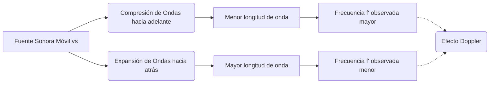

# Acústica y Sonido
La acústica es la disciplina que trata la propagación de ondas mecánicas en gases, líquidos y sólidos, incluyendo fenómenos como la vibración, el sonido, el ultrasonido y el infrasonido.

## 📜 Contexto Histórico
Pitágoras (siglo VI a.C.) fue uno de los primeros en investigar las propiedades musicales del sonido mediante cuerdas vibrantes. Posteriormente, en el siglo XVII, Marin Mersenne determinó empíricamente la velocidad del sonido en el aire y relacionó la frecuencia de una cuerda con su tensión y densidad. La teoría moderna del sonido se consolidó con la publicación de *The Theory of Sound* por Lord Rayleigh en 1877.

## 🧮 Desarrollo Teórico Profundo

El tratamiento riguroso de las ondas sonoras en fluidos requiere un análisis desde la mecánica de medios continuos y la termodinámica. Las ondas sonoras son perturbaciones infinitesimales longitudinales caracterizadas por fluctuaciones de presión, densidad y velocidad del fluido.

### 1. Sistema de Ecuaciones Linealizado

En un fluido ideal sin viscosidad ni conductividad térmica, el flujo acústico se describe mediante las ecuaciones de Navier-Stokes linealizadas. Sea un estado de reposo con presión $P_0$ y densidad $\rho_0$. Una perturbación induce $p = P_0 + p'$ y $\rho = \rho_0 + \rho'$. Las ecuaciones gobernantes son:

**Ecuación de Continuidad (Masa):**

$$ \frac{\partial \rho'}{\partial t} + \rho_0 \nabla \cdot \vec{u} = 0 $$

**Ecuación de Euler (Momento):**

$$ \rho_0 \frac{\partial \vec{u}}{\partial t} = - \nabla p' $$

**Relación Adiabática (Termodinámica):**
Dado que la oscilación acústica es típicamente un proceso rápido, el calor transferido es despreciable (condición isentrópica):

$$ p' = c^2 \rho' $$

donde $ c = \sqrt{(\partial P/\partial \rho)_S} $ es la velocidad del sonido en el medio.

### 2. Obtención de la Ecuación de Onda Tridimensional

Para encontrar una ecuación en términos únicamente de la presión $p'$, tomamos la divergencia de la ecuación de Euler:

$$ \rho_0 \nabla \cdot \frac{\partial \vec{u}}{\partial t} = - \nabla^2 p' $$

Al derivar la ecuación de continuidad respecto al tiempo:

$$ \frac{\partial^2 \rho'}{\partial t^2} + \rho_0 \frac{\partial}{\partial t}(\nabla \cdot \vec{u}) = 0 $$

Combinando ambas ecuaciones y usando la relación adiabática $\rho' = p'/c^2$:

$$ \frac{1}{c^2} \frac{\partial^2 p'}{\partial t^2} - \nabla^2 p' = 0 $$

Esta es la **Ecuación de Onda Acústica**.

### 3. Solución para Ondas Planas y Esféricas

Para una **onda plana** monocromática propagándose en la dirección $\vec{k}$:

$$ p'(\vec{r}, t) = P_m e^{i(\vec{k} \cdot \vec{r} - \omega t)} $$

donde el número de onda $k = |\vec{k}| = \omega / c = 2\pi/\lambda$.

Para una **onda esférica** simétrica radiando desde una fuente puntual, el operador Laplaciano en coordenadas esféricas se simplifica, y la solución armónica es:

$$ p'(r, t) = \frac{A}{r} e^{i(kr - \omega t)} $$

La amplitud de presión disminuye inversamente con la distancia $r$ desde la fuente, lo cual implica que la intensidad $I \propto |p'|^2 \propto 1/r^2$ (Ley de la inversa del cuadrado).

### 4. Energía e Intensidad Sonora

La densidad de energía acústica $w$ en el medio tiene dos componentes: energía cinética y energía potencial elástica:

$$ w = \frac{1}{2} \rho_0 u^2 + \frac{1}{2} \frac{p'^2}{\rho_0 c^2} $$

El flujo de energía está dado por el vector de intensidad acústica $\vec{I} = p' \vec{u}$. Para una onda plana progresiva:

$$ I = \langle p' u \rangle = \frac{p_{\text{rms}}^2}{\rho_0 c} $$

El nivel de intensidad sonora (NPS) se define logarítmicamente:

$$ \beta = 10 \log_{10} \left( \frac{I}{I_0} \right) \, \text{dB} \quad (I_0 = 10^{-12} \, \text{W/m}^2) $$

### 5. El Efecto Doppler

El cambio de frecuencia percibido debido al movimiento relativo se deriva considerando las ondas en el marco de referencia del medio material. Si una fuente se mueve con velocidad $v_s$ (positiva hacia el observador) y el observador con velocidad $v_o$ (positiva hacia la fuente):

$$ f' = f \left( \frac{c + v_o}{c - v_s} \right) $$



### 🛠 Ejemplo Práctico
**Problema Universitario:** Un altavoz puntual irradia una potencia acústica promedio de $ \Pi = 0.5 \text{ W} $ uniformemente en todas direcciones en aire estacionario ($\rho_0 = 1.2 \text{ kg/m}^3, c = 343 \text{ m/s}$). Determine (a) la intensidad sonora a $ 5 \text{ m} $, (b) el nivel de intensidad en decibelios y (c) la amplitud de desplazamiento de las partículas de aire para un sonido de $ 1000 \text{ Hz} $.

**Solución paso a paso:**
1. **Intensidad (a):** La intensidad a distancia $r=5\text{ m}$ por conservación de energía en una esfera de área $4\pi r^2$:

   $$ I = \frac{\Pi}{4 \pi r^2} = \frac{0.5}{4 \pi (5)^2} = \frac{0.5}{100 \pi} \approx 1.59 \times 10^{-3} \text{ W/m}^2 $$

2. **Nivel de Intensidad (b):**

   $$ \beta = 10 \log_{10} \left( \frac{1.59 \times 10^{-3}}{10^{-12}} \right) = 10 \log_{10}(1.59 \times 10^9) \approx 92 \text{ dB} $$

3. **Amplitud de desplazamiento (c):** 
   Sabemos que $ I = \frac{1}{2} \rho_0 c \omega^2 s_m^2 $, donde $\omega = 2\pi f$ y $s_m$ es la amplitud de desplazamiento.

   $$ \omega = 2\pi(1000) \approx 6283 \text{ rad/s} $$

   $$ s_m = \sqrt{ \frac{2I}{\rho_0 c \omega^2} } = \sqrt{ \frac{2 (1.59 \times 10^{-3})}{(1.2)(343)(6283)^2} } $$

   $$ s_m \approx \sqrt{ \frac{3.18 \times 10^{-3}}{1.62 \times 10^{10}} } \approx 1.4 \times 10^{-7} \text{ m} \text{ (0.14 micrómetros)} $$

   Esta minúscula amplitud de vibración es suficiente para ser percibida como un sonido muy fuerte.

## 📝 Guía de Ejercicios Resueltos

**Problema 1: Efecto Doppler Generalizado**
Un murciélago vuela a velocidad $v_b$ hacia una pared plana mientras emite pulsos ultrasónicos a frecuencia $f_0$. El murciélago percibe el eco reflejado en la pared con una frecuencia de batido $\Delta f$. Deduzca la expresión para $v_b$ en función de $\Delta f$, $f_0$ y la velocidad del sonido $c$.

**Solución paso a paso:**
1. Frecuencia recibida por la pared (observador en reposo, fuente móvil): $f_w = f_0 \left( \frac{c}{c - v_b} \right)$.
2. La pared actúa como fuente estacionaria reflejando $f_w$. El murciélago la percibe como observador móvil acercándose: $f_r = f_w \left( \frac{c + v_b}{c} \right) = f_0 \left( \frac{c + v_b}{c - v_b} \right)$.
3. La frecuencia de batido es $\Delta f = f_r - f_0 = f_0 \left( \frac{c + v_b}{c - v_b} - 1 \right) = f_0 \left( \frac{2v_b}{c - v_b} \right)$.
4. Despejando $v_b$: $\Delta f (c - v_b) = 2 f_0 v_b \implies v_b = \frac{c \Delta f}{2 f_0 + \Delta f}$.

**Problema 2: Impedancia Acústica**
Calcule el coeficiente de transmisión de intensidad acústica del agua ($Z_1 = 1.48 \times 10^6 \, \text{kg/m}^2\text{s}$) al aire ($Z_2 = 415 \, \text{kg/m}^2\text{s}$) a incidencia normal.

**Solución paso a paso:**
1. El coeficiente de reflexión de intensidad para incidencia normal es $R = \left( \frac{Z_2 - Z_1}{Z_2 + Z_1} \right)^2$.
2. Dado $Z_1 \gg Z_2$, $R \approx \left( \frac{-Z_1}{Z_1} \right)^2 \approx 1$.
3. Computando exactamente: $R = \left( \frac{415 - 1.48 \times 10^6}{415 + 1.48 \times 10^6} \right)^2 = (-0.99944)^2 \approx 0.99888$.
4. El coeficiente de transmisión es $T = 1 - R \approx 0.00112$, por lo que solo el $0.11\%$ de la energía acústica se transmite del agua al aire, explicando la sordera bajo el agua a sonidos aéreos.

**Problema 3: Interferencia en 3D**
Tres fuentes sonoras idénticas se ubican en los vértices de un triángulo equilátero de lado $L$. Emiten en fase con longitud de onda $\lambda = L/2$. Encuentre la intensidad acústica en el centro geométrico del triángulo en función de la intensidad $I_0$ de una sola fuente.

**Solución paso a paso:**
1. La distancia del centroide a cada vértice es $r = \frac{L}{\sqrt{3}}$.
2. La fase espacial adquirida por cada onda al llegar al centroide es $\phi = k r = \frac{2\pi}{\lambda} \frac{L}{\sqrt{3}}$.
3. Sustituyendo $\lambda = L/2$: $\phi = \frac{2\pi}{L/2} \frac{L}{\sqrt{3}} = \frac{4\pi}{\sqrt{3}} \approx 7.255 \, \text{rad}$.
4. Como las tres fuentes son equidistantes y están en fase, las ondas llegan al centroide con la misma fase y amplitud $A$.
5. La amplitud total es la suma coherente: $A_{tot} = A + A + A = 3A$.
6. Como la intensidad es proporcional a la amplitud al cuadrado ($I \propto A^2$), la intensidad total es $I_{tot} = (3A)^2 = 9 I_0$.

## 💻 Simulaciones Computacionales

A continuación, se presenta un script en Python que simula el fenómeno de batido (pulsaciones) resultante de la superposición de dos ondas sonoras con frecuencias muy cercanas, y realiza un análisis de Fourier (FFT) para identificar las frecuencias individuales involucradas.

```python
import numpy as np
import matplotlib.pyplot as plt
from scipy.fft import fft, fftfreq

def simular_batido_sonoro():
    """
    Simula la superposición de dos ondas sonoras de frecuencias cercanas
    mostrando el fenómeno de batido en el tiempo y su espectro de frecuencias.
    """
    # Parámetros de la simulación
    fs = 44100            # Frecuencia de muestreo (Hz)
    T = 0.5               # Duración (segundos)
    t = np.linspace(0, T, int(fs * T), endpoint=False)
    
    # Frecuencias de las dos ondas (cercanas para producir batido)
    f1 = 440.0            # La4 (Hz)
    f2 = 448.0            # Frecuencia ligeramente mayor (Hz)
    f_batido = abs(f1 - f2)
    
    # Generación de las señales
    y1 = np.sin(2 * np.pi * f1 * t)
    y2 = np.sin(2 * np.pi * f2 * t)
    
    # Superposición (Batido)
    y_superposicion = y1 + y2
    
    # Transformada Rápida de Fourier (FFT)
    N = len(t)
    yf = fft(y_superposicion)
    xf = fftfreq(N, 1 / fs)[:N//2]
    yf_mag = 2.0/N * np.abs(yf[0:N//2])
    
    # Visualización
    fig, (ax1, ax2) = plt.subplots(2, 1, figsize=(10, 8))
    
    # Gráfica en el dominio del tiempo
    ax1.plot(t, y_superposicion, color='royalblue')
    # Envolvente teórica del batido
    envolvente = 2 * np.cos(2 * np.pi * (f_batido / 2) * t)
    ax1.plot(t, envolvente, 'r--', alpha=0.8, linewidth=2, label=f'Envolvente (f_batido = {f_batido} Hz)')
    ax1.plot(t, -envolvente, 'r--', alpha=0.8, linewidth=2)
    
    ax1.set_title('Dominio del Tiempo: Fenómeno de Batido (Pulsación)')
    ax1.set_xlabel('Tiempo (s)')
    ax1.set_ylabel('Amplitud')
    ax1.set_xlim(0, 0.25) # Mostrar solo un cuarto de segundo para claridad
    ax1.legend(loc='upper right')
    ax1.grid(True)
    
    # Gráfica en el dominio de la frecuencia (Espectro)
    ax2.plot(xf, yf_mag, color='darkorange')
    ax2.set_title('Dominio de la Frecuencia: Espectro (FFT)')
    ax2.set_xlabel('Frecuencia (Hz)')
    ax2.set_ylabel('Magnitud')
    ax2.set_xlim(400, 500) # Zoom alrededor de las frecuencias de interés
    ax2.grid(True)
    
    # Marcadores de las frecuencias originales
    ax2.axvline(f1, color='green', linestyle=':', label=f'f1 = {f1} Hz')
    ax2.axvline(f2, color='purple', linestyle=':', label=f'f2 = {f2} Hz')
    ax2.legend()
    
    plt.tight_layout()
    plt.show()

if __name__ == '__main__':
    simular_batido_sonoro()
```

## 🚀 Fronteras de Investigación y Problemas Abiertos

Hacia el 2026, las fronteras entre acústica, biología e informática han creado el campo de la **Acústica Neuromórfica** y la **Levitación Acústica Avanzada**. Se están investigando transductores que actúan directamente como redes neuronales físicas procesando ondas sonoras sin necesidad de digitalización previa. Por otro lado, los misterios persisten en la acústica no lineal extrema, particularmente en la cavitación acústica inducida en tejidos vivos durante litotricia y terapias focalizadas, donde predecir y controlar las microburbujas en interfaces de tejido complejo para la administración localizada de fármacos (sonoporación) requiere superar el caos inherente a la formación de burbujas asimétricas.

## 📐 Formalismo Matemático Avanzado (Nivel Posgrado/Doctorado)

La acústica fuertemente no lineal (como ondas de choque direccionales) requiere abandonar las suposiciones de pequeña amplitud. El formalismo se traslada a la modelización asintótica avanzada y a la Ecuación de Westervelt. Sin embargo, para incluir atenuación acústica termoviscosa anómala que no sigue el modelo clásico de Stokes (la disipación no es proporcional a $\omega^2$), como ocurre fuertemente en polímeros complejos y tejidos biológicos humanos, se requiere utilizar el **Cálculo Diferencial Fraccionario**. 
La propagación de la perturbación de presión se formula incorporando derivadas de Caputo de orden fraccionario $\alpha$ ($1 < \alpha < 2$):

$$ \nabla^2 p - \frac{1}{c_0^2} \frac{\partial^2 p}{\partial t^2} + \tau^\alpha \frac{\partial^\alpha}{\partial t^\alpha} (\nabla^2 p) = -\frac{\beta}{\rho_0 c_0^4} \frac{\partial^2 p^2}{\partial t^2} $$

donde $\beta$ es el parámetro de no linealidad y la derivada temporal fraccionaria está dada por:

$$ \frac{\partial^\alpha p(t)}{\partial t^\alpha} = \frac{1}{\Gamma(m-\alpha)} \int_0^t \frac{p^{(m)}(\tau)}{(t-\tau)^{\alpha - m + 1}} d\tau $$

Este marco integro-diferencial con memoria no local captura correctamente el retardo de relajación y la dispersión polinómica del sonido a lo largo del espectro de frecuencias completo, representando la vanguardia matemática en acústica médica.

## 📚 Recursos Específicos

### Cursos
1. **[MIT OCW: 2.066 Acoustics and Sensing](https://ocw.mit.edu/courses/2-066-acoustics-and-sensing-fall-2012/)**: Excelente para asimilar cómo las ondas acústicas son el medio fundamental para explorar la hidrodinámica y sensado marino.
2. **[Coursera: Fundamentals of Audio and Music Engineering (Rochester)](https://www.coursera.org/learn/audio-engineering)**: Conecta la física matemática de las ondas mecánicas con el procesamiento y percepción acústica humana.
3. **[NPTEL: Architectural Acoustics](https://nptel.ac.in/courses/105105152)**: Profundiza en fenómenos de difracción, reverberación de Sabine, y control de transmisión sonora de sala.

### Artículos y Simulaciones
1. **["Theory of the Acoustic Radiation Force" por L.V. King (1934)](https://royalsocietypublishing.org/doi/10.1098/rspa.1934.0190)**
   - **Importancia Teórica:** Revela los efectos no lineales que la acústica puede ejercer. Mientras la acústica lineal describe ondas donde la presión temporal promedio es cero ($\langle p' \rangle = 0$), King demostró analíticamente que la dispersión de sonido alrededor de objetos produce una fuerza de radiación continua promediada en el tiempo (Acoustic Radiation Force).
   - **Fondo Matemático:** Para calcular esta fuerza, la ecuación de momento de Navier-Stokes debe ser retenida hasta el segundo orden en el desarrollo de la perturbación (retener el término convectivo material $(\vec{v}\cdot\nabla)\vec{v}$). La fuerza estacionaria sobre una pequeña esfera de radio $a \ll \lambda$ en una onda estacionaria $p = p_0 \cos(kx)\cos(\omega t)$ resulta proporcional a la energía acústica promediada espacialmente $E_{ac}$:

     $$ F_R = \frac{5\pi}{6} k a^3 E_{ac} \sin(2kx) \left( \frac{\rho_{esf} - \rho_0}{2\rho_{esf} + \rho_0} \right) $$

   - **Implicaciones Físicas:** Esta fuerza empuja a los objetos hacia los nodos o antinodos espaciales de presión. Constituye el principio físico rector de las "pinzas acústicas" (Acoustic Tweezers) modernas, permitiendo la levitación acústica paramétrica de células u objetos pesados utilizando metamateriales sonoros sin tocarlos en absoluto.

2. **["Acoustic Black Holes" por V.V. Krylov (2004)](https://asa.scitation.org/doi/10.1121/1.1710502)**
   - **Importancia Teórica:** Traslación asombrosa de la astrofísica a la mecánica elástica. Demuestra cómo una cuña sólida diseñada con un perfil de grosor que sigue una ley de potencia (perfil decreciente hasta cero) actúa funcionalmente igual a un horizonte de sucesos para ondas acústicas de flexión.
   - **Fondo Matemático:** La velocidad de fase de una onda flexional en una placa sólida disminuye al reducirse el grosor local $h(x)$. Si diseñamos $h(x) = \epsilon x^m$ (para $m \ge 2$), la velocidad se precipita a cero conforme la onda avanza hacia la punta ($x \to 0$): $c(x) \propto \sqrt{h(x)} \to 0$. El tiempo de viaje de la onda para alcanzar el borde se calcula como:

     $$ t = \int_{x_0}^0 \frac{dx}{c(x)} \propto \int_{x_0}^0 x^{-m/2} dx $$

     Si $m \ge 2$, ¡la integral diverge asintóticamente a $\infty$! La onda nunca logra alcanzar el extremo matemáticamente, y en la práctica cualquier remanente amortiguador la disipa por completo, reduciendo el coeficiente de reflexión exactamente a cero.
   - **Implicaciones Físicas:** Permite el diseño de terminaciones amortiguadoras absolutas para vehículos (aviones o autos), extinguiendo el 100% de la energía de vibración acústica que entra a la cuña sin necesidad de materiales de goma pesados, lo que se ha popularizado en diseños estructurales avanzados.

3. **[PhET: Sound and Waves](https://phet.colorado.edu/en/simulations/sound)**: Entorno ideal para observar frentes de onda interactivos, patrones de interferencia de dos fuentes (efectos muaré temporales) y dependencia barométrica.

### 📖 Referencias Útiles y Bibliografía
1. [Pierce, A. D. *Acoustics: An Introduction to Its Physical Principles and Applications*](https://link.springer.com/book/10.1007/978-3-030-11214-1) - El texto definitivo nivel graduado que integra acústica no lineal e impedancia.
2. [Blackstock, D. T. *Fundamentals of Physical Acoustics*](https://www.wiley.com/en-us/Fundamentals+of+Physical+Acoustics-p-9780471319794) - Formulación magistral de ecuaciones termodinámicas perturbativas.

## 🌐 Seminarios Avanzados y Literatura de Frontera

- [Acoustical Society of America (ASA) Seminars](https://acousticalsociety.org/) - Serie de charlas abarcando lo último en ciencia del sonido.
- [ISVR University of Southampton Seminars](https://www.southampton.ac.uk/isvr) - Investigaciones sobre control de sonido y vibración.
- [Penn State Center for Acoustics and Vibration](https://www.cav.psu.edu/) - Charlas de alto impacto en acústica no lineal.

- [Nature Materials: "Acoustic metamaterials: from local resonances to broad horizons"](https://www.nature.com/articles/nmat4393) - Revisión crítica del diseño moderno de metamateriales acústicos.
- [Science: "Phononic crystals for shaping acoustic waves"](https://www.science.org/) - Aplicaciones del control espectral del sonido a escalas nanoscópicas y macroscópicas.
- [Physical Review Letters: "Parity-Time Symmetric Acoustics"](https://journals.aps.org/prl/) - Avances en la dirección asimétrica de ondas de sonido simulando hamiltonianos cuánticos.
