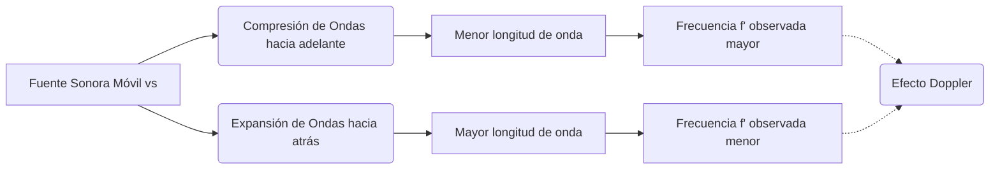

# Acústica y Sonido
La acústica es la disciplina que trata la propagación de ondas mecánicas en gases, líquidos y sólidos, incluyendo fenómenos como la vibración, el sonido, el ultrasonido y el infrasonido.

## 📜 Contexto Histórico
Pitágoras (siglo VI a.C.) fue uno de los primeros en investigar las propiedades musicales del sonido mediante cuerdas vibrantes. Posteriormente, en el siglo XVII, Marin Mersenne determinó empíricamente la velocidad del sonido en el aire y relacionó la frecuencia de una cuerda con su tensión y densidad. La teoría moderna del sonido se consolidó con la publicación de *The Theory of Sound* por Lord Rayleigh en 1877.

## 🧮 Desarrollo Teórico Profundo

El tratamiento riguroso de las ondas sonoras en fluidos requiere un análisis desde la mecánica de medios continuos y la termodinámica. Las ondas sonoras son perturbaciones infinitesimales longitudinales caracterizadas por fluctuaciones de presión, densidad y velocidad del fluido.

### 1. Sistema de Ecuaciones Linealizado

En un fluido ideal sin viscosidad ni conductividad térmica, el flujo acústico se describe mediante las ecuaciones de Navier-Stokes linealizadas. Sea un estado de reposo con presión $P_0$ y densidad $\rho_0$. Una perturbación induce $p = P_0 + p'$ y $\rho = \rho_0 + \rho'$. Las ecuaciones gobernantes son:

**Ecuación de Continuidad (Masa):**
$$ \frac{\partial \rho'}{\partial t} + \rho_0 \nabla \cdot \vec{u} = 0 $$

**Ecuación de Euler (Momento):**
$$ \rho_0 \frac{\partial \vec{u}}{\partial t} = - \nabla p' $$

**Relación Adiabática (Termodinámica):**
Dado que la oscilación acústica es típicamente un proceso rápido, el calor transferido es despreciable (condición isentrópica):
$$ p' = c^2 \rho' $$
donde $ c = \sqrt{(\partial P/\partial \rho)_S} $ es la velocidad del sonido en el medio.

### 2. Obtención de la Ecuación de Onda Tridimensional

Para encontrar una ecuación en términos únicamente de la presión $p'$, tomamos la divergencia de la ecuación de Euler:
$$ \rho_0 \nabla \cdot \frac{\partial \vec{u}}{\partial t} = - \nabla^2 p' $$
Al derivar la ecuación de continuidad respecto al tiempo:
$$ \frac{\partial^2 \rho'}{\partial t^2} + \rho_0 \frac{\partial}{\partial t}(\nabla \cdot \vec{u}) = 0 $$
Combinando ambas ecuaciones y usando la relación adiabática $\rho' = p'/c^2$:
$$ \frac{1}{c^2} \frac{\partial^2 p'}{\partial t^2} - \nabla^2 p' = 0 $$
Esta es la **Ecuación de Onda Acústica**.

### 3. Solución para Ondas Planas y Esféricas

Para una **onda plana** monocromática propagándose en la dirección $\vec{k}$:
$$ p'(\vec{r}, t) = P_m e^{i(\vec{k} \cdot \vec{r} - \omega t)} $$
donde el número de onda $k = |\vec{k}| = \omega / c = 2\pi/\lambda$.

Para una **onda esférica** simétrica radiando desde una fuente puntual, el operador Laplaciano en coordenadas esféricas se simplifica, y la solución armónica es:
$$ p'(r, t) = \frac{A}{r} e^{i(kr - \omega t)} $$
La amplitud de presión disminuye inversamente con la distancia $r$ desde la fuente, lo cual implica que la intensidad $I \propto |p'|^2 \propto 1/r^2$ (Ley de la inversa del cuadrado).

### 4. Energía e Intensidad Sonora

La densidad de energía acústica $w$ en el medio tiene dos componentes: energía cinética y energía potencial elástica:
$$ w = \frac{1}{2} \rho_0 u^2 + \frac{1}{2} \frac{p'^2}{\rho_0 c^2} $$
El flujo de energía está dado por el vector de intensidad acústica $\vec{I} = p' \vec{u}$. Para una onda plana progresiva:
$$ I = \langle p' u \rangle = \frac{p_{\text{rms}}^2}{\rho_0 c} $$
El nivel de intensidad sonora (NPS) se define logarítmicamente:
$$ \beta = 10 \log_{10} \left( \frac{I}{I_0} \right) \, \text{dB} \quad (I_0 = 10^{-12} \, \text{W/m}^2) $$

### 5. El Efecto Doppler

El cambio de frecuencia percibido debido al movimiento relativo se deriva considerando las ondas en el marco de referencia del medio material. Si una fuente se mueve con velocidad $v_s$ (positiva hacia el observador) y el observador con velocidad $v_o$ (positiva hacia la fuente):
$$ f' = f \left( \frac{c + v_o}{c - v_s} \right) $$

### 🛠 Ejemplo Práctico
**Problema Universitario:** Un altavoz puntual irradia una potencia acústica promedio de $ \Pi = 0.5 \text{ W} $ uniformemente en todas direcciones en aire estacionario ($\rho_0 = 1.2 \text{ kg/m}^3, c = 343 \text{ m/s}$). Determine (a) la intensidad sonora a $ 5 \text{ m} $, (b) el nivel de intensidad en decibelios y (c) la amplitud de desplazamiento de las partículas de aire para un sonido de $ 1000 \text{ Hz} $.

**Solución paso a paso:**
1. **Intensidad (a):** La intensidad a distancia $r=5\text{ m}$ por conservación de energía en una esfera de área $4\pi r^2$:
   $$ I = \frac{\Pi}{4 \pi r^2} = \frac{0.5}{4 \pi (5)^2} = \frac{0.5}{100 \pi} \approx 1.59 \times 10^{-3} \text{ W/m}^2 $$
2. **Nivel de Intensidad (b):**
   $$ \beta = 10 \log_{10} \left( \frac{1.59 \times 10^{-3}}{10^{-12}} \right) = 10 \log_{10}(1.59 \times 10^9) \approx 92 \text{ dB} $$
3. **Amplitud de desplazamiento (c):** 
   Sabemos que $ I = \frac{1}{2} \rho_0 c \omega^2 s_m^2 $, donde $\omega = 2\pi f$ y $s_m$ es la amplitud de desplazamiento.
   $$ \omega = 2\pi(1000) \approx 6283 \text{ rad/s} $$
   $$ s_m = \sqrt{ \frac{2I}{\rho_0 c \omega^2} } = \sqrt{ \frac{2 (1.59 \times 10^{-3})}{(1.2)(343)(6283)^2} } $$
   $$ s_m \approx \sqrt{ \frac{3.18 \times 10^{-3}}{1.62 \times 10^{10}} } \approx 1.4 \times 10^{-7} \text{ m} \text{ (0.14 micrómetros)} $$
   Esta minúscula amplitud de vibración es suficiente para ser percibida como un sonido muy fuerte.

## 📚 Recursos Específicos
### Cursos
1. ["Acoustics: Basic Physics" - Coursera (UNSW Sydney)](https://www.coursera.org/learn/acoustics)
2. ["Fundamentals of Audio and Music Engineering" - Coursera (University of Rochester)](https://www.coursera.org/learn/audio-engineering)
3. ["Introduction to Acoustics" - edX (TU Delft)](https://www.edx.org/course/introduction-to-acoustics)
4. ["Architectural Acoustics" - NPTEL (IIT Kharagpur)](https://nptel.ac.in/courses/105105152)
5. ["Vibrations and Waves" - MIT OCW](https://ocw.mit.edu/courses/8-03-physics-iii-vibrations-and-waves-fall-2004/)
6. ["Sound and Waves" - Khan Academy](https://www.khanacademy.org/science/physics/mechanical-waves-and-sound)

### Artículos y Simulaciones
1. ["Sound" - PhET Interactive Simulations](https://phet.colorado.edu/en/simulations/sound)
2. ["Wave on a String" - PhET Interactive Simulations](https://phet.colorado.edu/en/simulations/wave-on-a-string)
3. ["Normal Modes" - PhET Interactive Simulations](https://phet.colorado.edu/en/simulations/normal-modes)
4. ["Online Tone Generator" - Szynalski](https://www.szynalski.com/tone-generator/)
5. ["Ripple Tank" - Falstad](http://www.falstad.com/ripple/)
6. ["Doppler Effect Simulation" - oPhysics](https://ophysics.com/w11.html)
7. ["Standing Waves Simulation" - oPhysics](https://ophysics.com/w8.html)
8. ["Beat Frequency Simulation" - oPhysics](https://ophysics.com/w10.html)
9. ["Physics of Musical Instruments" - UNSW](https://newt.phys.unsw.edu.au/jw/basics.html)

### 📖 Referencias Útiles y Bibliografía
1. [*Fundamentals of Acoustics* por Lawrence E. Kinsler et al.](https://www.wiley.com/en-us/Fundamentals+of+Acoustics%2C+4th+Edition-p-9780471847892)
2. [*The Theory of Sound* por Lord Rayleigh](https://archive.org/details/theoryofsound01rayl)
3. [*Acoustics* por Leo L. Beranek](https://asa.scitation.org/doi/book/10.1121/1.4920216)
4. [*Vibrations and Waves* por A.P. French](https://www.routledge.com/Vibrations-and-Waves/French/p/book/9780393099362)
