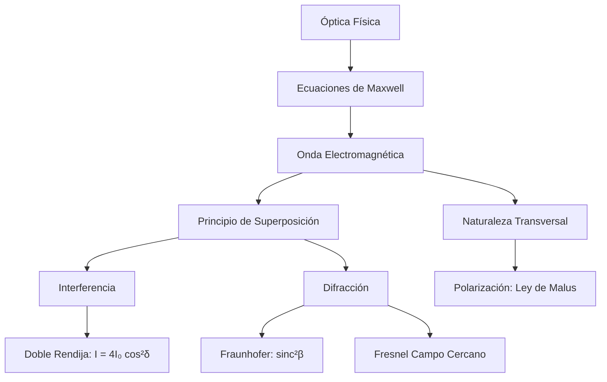

# Óptica Física
La óptica física (u óptica ondulatoria) considera la naturaleza electromagnética y ondulatoria de la luz para explicar fenómenos que la óptica geométrica no puede, tales como la interferencia, la difracción y la polarización.

## 📜 Contexto Histórico
El modelo ondulatorio de la luz fue propuesto inicialmente por Christiaan Huygens en 1678. Sin embargo, no fue hasta 1801, con el famoso experimento de la doble rendija de Thomas Young, que la naturaleza ondulatoria de la luz se demostró concluyentemente a través del fenómeno de interferencia. James Clerk Maxwell unificó más tarde la óptica con el electromagnetismo en la década de 1860.

## 🧮 Desarrollo Teórico Profundo

El marco formal de la óptica física es el electromagnetismo clásico regido por las ecuaciones de Maxwell. Desde este punto de vista, la luz es una onda transversal conformada por campos eléctricos ($\vec{E}$) y magnéticos ($\vec{B}$) oscilando perpendicularmente entre sí y a la dirección de propagación. En el vacío, la ecuación de onda se expresa como:
$$ \nabla^2 \vec{E} - \frac{1}{c^2} \frac{\partial^2 \vec{E}}{\partial t^2} = 0 \quad \text{con} \quad c = \frac{1}{\sqrt{\mu_0 \epsilon_0}} $$

### 1. Interferencia por Superposición de Ondas

Cuando dos ondas luminosas armónicas, emitidas por fuentes coherentes, se superponen en un punto del espacio, el campo eléctrico resultante es la suma vectorial:
$$ \vec{E}_{T} = \vec{E}_1 + \vec{E}_2 = \vec{E}_{01} \cos(\vec{k}_1\cdot\vec{r} - \omega t + \phi_1) + \vec{E}_{02} \cos(\vec{k}_2\cdot\vec{r} - \omega t + \phi_2) $$
La intensidad óptica observable $I$ es proporcional al promedio temporal del vector de Poynting ($I \propto \langle |\vec{E}_{T}|^2 \rangle$). Al promediar temporalmente, obtenemos:
$$ I = I_1 + I_2 + 2\sqrt{I_1 I_2} \cos(\delta) $$
donde $\delta = (\vec{k}_2\cdot\vec{r} - \vec{k}_1\cdot\vec{r}) + (\phi_2 - \phi_1)$ es la **diferencia de fase total**.

**Experimento de Young (Doble Rendija):**
Si la luz proviene de dos rendijas separadas por una distancia $d$, incidiendo sobre una pantalla distante a distancia $L$ ($L \gg d$), la diferencia de camino óptico es $\Delta r = d \sin(\theta) \approx d \frac{y}{L}$. Así, $\delta = k \Delta r = \frac{2\pi}{\lambda} d \sin \theta$. 
Si las fuentes tienen igual intensidad ($I_1 = I_2 = I_0$), la intensidad resultante es:
$$ I(\theta) = 4 I_0 \cos^2\left(\frac{\pi d \sin \theta}{\lambda}\right) $$
Los máximos brillantes (interferencia constructiva) ocurren cuando $\cos^2(...) = 1$, es decir, $\delta = 2\pi m \implies d \sin \theta = m\lambda$.

### 2. Teoría de Difracción Escalar de Fraunhofer

La difracción resulta de la interferencia de un número infinito de fuentes secundarias (Principio de Huygens-Fresnel). El límite de Fraunhofer (campo lejano) se alcanza cuando la pantalla está suficientemente lejos de la apertura de modo que las ondas que llegan pueden considerarse aproximadamente planas.

**Difracción por una rendija de ancho $a$:**
Consideremos la rendija en el eje $y$ desde $-a/2$ hasta $a/2$. Cada segmento diferencial $dy$ emite una onda esférica secundaria con amplitud proporcional a $dy$. La diferencia de fase respecto al centro de la rendija es $\beta(y) = k y \sin \theta$. 
El campo total en la pantalla es la integral:
$$ E(\theta) \propto \int_{-a/2}^{a/2} e^{i k y \sin \theta} dy = \left[ \frac{e^{i k y \sin \theta}}{i k \sin \theta} \right]_{-a/2}^{a/2} = a \frac{\sin\left(\frac{k a \sin \theta}{2}\right)}{\frac{k a \sin \theta}{2}} $$
Definiendo el parámetro adimensional $\beta = \frac{\pi a \sin \theta}{\lambda}$, la intensidad $I(\theta) \propto |E(\theta)|^2$ resulta en el patrón sinc cuadrado:
$$ I(\theta) = I_0 \text{sinc}^2(\beta) = I_0 \left( \frac{\sin(\beta)}{\beta} \right)^2 $$
Los mínimos de intensidad ocurren para $\beta = m\pi$ (donde $m = \pm 1, \pm 2, \dots$), lo que lleva a la condición $a \sin \theta = m\lambda$. Notemos que no hay mínimo para $m=0$, ya que $\lim_{\beta \to 0} \frac{\sin \beta}{\beta} = 1$ (máximo central).

### 3. Redes de Difracción y Poder Resolutivo

Una red de difracción contiene $N$ rendijas igualmente espaciadas por una distancia $d$. La amplitud transmitida es una serie geométrica de fases. La distribución de intensidad combina la difracción de una sola rendija con la interferencia de $N$ fuentes:
$$ I(\theta) = I_0 \left( \frac{\sin\left(\frac{\pi a \sin \theta}{\lambda}\right)}{\frac{\pi a \sin \theta}{\lambda}} \right)^2 \left( \frac{\sin\left(\frac{N \pi d \sin \theta}{\lambda}\right)}{\sin\left(\frac{\pi d \sin \theta}{\lambda}\right)} \right)^2 $$
Los máximos principales (o "órdenes") ocurren cuando $\frac{\pi d \sin \theta}{\lambda} = m\pi$, o $d \sin \theta = m\lambda$. La nitidez de los picos aumenta drásticamente con $N$, lo que hace a las redes de difracción esenciales en espectroscopía.
El poder de resolución espectral $\mathcal{R} = \frac{\lambda}{\Delta \lambda}$ de una red operando en orden $m$ es fundamental:
$$ \mathcal{R} = m N $$

### 4. Polarización y Ley de Malus

El vector de campo eléctrico $\vec{E}$ en una onda transversal puede oscilar en un plano específico (polarización lineal), rotar en un círculo (polarización circular) o ser una mezcla probabilística (luz no polarizada). 
Cuando luz polarizada linealmente con intensidad $I_0$ e incidente bajo un ángulo de polarización $\phi_i$ atraviesa un analizador ideal con eje de transmisión en ángulo $\phi_a$, la componente del campo transmitido es la proyección paralela al eje:
$$ E_t = E_0 \cos(\phi_i - \phi_a) = E_0 \cos \theta $$
Puesto que la intensidad es proporcional a $E^2$, se deduce la **Ley de Malus**:
$$ I = I_0 \cos^2 \theta $$
Si luz natural no polarizada incide sobre un polarizador, la intensidad se reduce exactamente a la mitad: $I = I_0 / 2$.



### 🛠 Ejemplo Práctico Universitario
**Problema:** Una onda luminosa plana incide normalmente sobre una pantalla con dos ranuras delgadas. Su distribución de intensidad en un esquema de campo lejano presenta un máximo principal central. Sin embargo, en el punto donde se esperaría el tercer máximo de interferencia ($m=3$), la intensidad es exactamente cero debido al patrón envolvente de difracción de las ranuras individuales. Determine la relación entre la separación de las ranuras $d$ y el ancho $a$ de cada ranura.

**Demostración y Solución:**
1. La intensidad total para una doble rendija de ancho finito es el producto del término de interferencia y la envolvente de difracción:
   $$ I(\theta) \propto \cos^2\left(\frac{\pi d \sin \theta}{\lambda}\right) \text{sinc}^2\left(\frac{\pi a \sin \theta}{\lambda}\right) $$
2. Los máximos de interferencia ocurren donde el argumento del coseno es $m\pi$, es decir, $\sin \theta_m = \frac{m\lambda}{d}$. El tercer máximo ideal correspondería a $m=3$, donde $\sin \theta_3 = \frac{3\lambda}{d}$.
3. Para que este máximo se cancele ("órdenes faltantes"), el primer mínimo de difracción de la envolvente sinc debe coincidir con este mismo ángulo $\theta_3$. 
4. El primer mínimo de difracción ocurre cuando el argumento de la función sinc es $\pi$, es decir, $\sin \theta_{\text{min}} = \frac{\lambda}{a}$.
5. Igualando los senos de los ángulos: $\frac{3\lambda}{d} = \frac{\lambda}{a}$.
6. Por lo tanto, cancelando $\lambda$, obtenemos la relación estricta:
   $$ d = 3a $$
   La distancia entre centros de ranura debe ser exactamente el triple de la anchura de la ranura.

## 📝 Guía de Ejercicios Resueltos

**Problema 1: Experimento de Young y Medio Refringente**
En un experimento de doble rendija de Young en el aire, se coloca una lámina de vidrio ($n = 1.5$) de espesor $t$ frente a una de las rendijas. El patrón de interferencia central se desplaza exactamente 5 franjas brillantes. Si $\lambda = 600 \, \text{nm}$, halle el espesor $t$.

**Solución paso a paso:**
1. La diferencia de camino óptico introducida por la lámina de vidrio de espesor $t$ es $\Delta x = n t - 1 t = t(n - 1)$.
2. Para que el patrón se desplace $N$ franjas brillantes, esta diferencia óptica debe corresponder a $N$ longitudes de onda, es decir, $\Delta x = N \lambda$.
3. Igualando: $t(n - 1) = N \lambda$.
4. Despejamos $t = \frac{N \lambda}{n - 1} = \frac{5 \times 600 \times 10^{-9}}{1.5 - 1} = \frac{3000 \times 10^{-9}}{0.5} = 6 \times 10^{-6} \, \text{m} = 6 \, \mu\text{m}$.

**Problema 2: Red de Difracción Tridimensional**
Una red de difracción plana iluminada en incidencia normal transmite luz en los ángulos donde $d \sin \theta = m \lambda$. Si el haz incide en un ángulo $\phi$ con la normal a la red en el plano de difracción, deduzca la condición de máximos principales.

**Solución paso a paso:**
1. La diferencia de camino óptico entre dos rendijas adyacentes para el haz incidente es $\Delta_1 = d \sin \phi$.
2. La diferencia de camino para la luz difractada en el ángulo $\theta$ es $\Delta_2 = d \sin \theta$.
3. La diferencia de fase total debe ser múltiplo de $2\pi$, así que la diferencia de camino total debe ser múltiplo de $\lambda$.
4. Si $\theta$ y $\phi$ están al mismo lado de la normal, $\Delta = d(\sin \theta - \sin \phi) = m \lambda$. Si están a lados opuestos, $\Delta = d(\sin \theta + \sin \phi) = m \lambda$.

**Problema 3: Ley de Malus y Polarizadores Sucesivos**
Se colocan $N$ polarizadores ideales tras un polarizador inicial alineado verticalmente. Cada uno rota el eje de transmisión un ángulo $\theta/N$ respecto al anterior, de modo que el último forma un ángulo $\theta$ con la vertical. Demuestre qué ocurre con la intensidad transmitida $I_N$ cuando $N \to \infty$.

**Solución paso a paso:**
1. Un haz inicialmente polarizado con intensidad $I_0$ pasa por $N$ filtros. Según la ley de Malus, cada filtro reduce la intensidad por un factor $\cos^2(\theta/N)$.
2. Tras $N$ filtros, la intensidad es $I_N = I_0 \left[ \cos^2\left(\frac{\theta}{N}\right) \right]^N = I_0 \cos^{2N}\left(\frac{\theta}{N}\right)$.
3. Para hallar el límite $N \to \infty$, estudiamos el logaritmo de la fracción de transmisión $f(N) = \cos^{2N}(\theta/N)$:
   $\ln f(N) = 2N \ln \cos(\theta/N)$. Usando la expansión de Taylor para pequeños argumentos $\cos x \approx 1 - x^2/2$, con $x = \theta/N$.
   $\ln f(N) \approx 2N \ln\left(1 - \frac{\theta^2}{2N^2}\right) \approx 2N \left( - \frac{\theta^2}{2N^2} \right) = -\frac{\theta^2}{N}$.
4. Cuando $N \to \infty$, $\ln f(N) \to 0$, por lo que $f(N) \to e^0 = 1$.
5. Por lo tanto, $\lim_{N \to \infty} I_N = I_0$. El vector de polarización se rota gradualmente sin pérdida de energía.

## 💻 Simulaciones Computacionales

A continuación, se presenta un script en Python que modela el experimento de la doble rendija de Young. La simulación calcula y visualiza el patrón de intensidad resultante en una pantalla distante, teniendo en cuenta tanto el efecto de interferencia entre las rendijas como la difracción de Fraunhofer debido al ancho finito de cada una.

```python
import numpy as np
import matplotlib.pyplot as plt

def simular_doble_rendija():
    """
    Simula el patrón de intensidad de un experimento de doble rendija,
    combinando interferencia y difracción.
    """
    # Parámetros físicos
    lam = 632.8e-9    # Longitud de onda del láser He-Ne (632.8 nm)
    a = 50e-6         # Ancho de cada rendija (50 micrómetros)
    d = 200e-6        # Separación entre rendijas (200 micrómetros)
    L = 2.0           # Distancia a la pantalla (2 metros)
    I0 = 1.0          # Intensidad central máxima
    
    # Coordenadas espaciales en la pantalla
    y = np.linspace(-0.05, 0.05, 2000) # De -5 cm a 5 cm
    
    # Ángulo theta (asumiendo aproximación paraxial y/L)
    theta = np.arctan(y / L)
    
    # Término de difracción (sinc)
    # beta = (pi * a * sin(theta)) / lam
    beta = (np.pi * a * np.sin(theta)) / lam
    # np.sinc en NumPy se define como sin(pi*x)/(pi*x), así que dividimos por pi
    difraccion = np.sinc(beta / np.pi)**2
    
    # Término de interferencia
    # delta = (2 * pi * d * sin(theta)) / lam
    delta = (2 * np.pi * d * np.sin(theta)) / lam
    interferencia = np.cos(delta / 2)**2
    
    # Intensidad total
    I_total = I0 * difraccion * interferencia
    
    # Visualización
    fig, (ax1, ax2) = plt.subplots(2, 1, figsize=(10, 8), gridspec_kw={'height_ratios': [3, 1]})
    
    # Gráfica 1: Perfil de intensidad 1D
    ax1.plot(y * 1000, I_total, 'b-', label='Intensidad Total (Interf + Difrac)')
    ax1.plot(y * 1000, difraccion, 'r--', alpha=0.7, label='Envolvente de Difracción')
    ax1.set_title('Perfil de Intensidad en la Pantalla (Experimento de Young)')
    ax1.set_xlabel('Posición en la pantalla $y$ (mm)')
    ax1.set_ylabel('Intensidad Relativa')
    ax1.grid(True, alpha=0.5)
    ax1.legend(loc='upper right')
    
    # Gráfica 2: Representación 2D (simulación de cómo se vería la luz)
    # Repetimos el arreglo 1D para formar una imagen 2D
    imagen_2d = np.tile(I_total, (200, 1))
    ax2.imshow(imagen_2d, extent=[y.min()*1000, y.max()*1000, 0, 10], 
               cmap='hot', aspect='auto')
    ax2.set_yticks([]) # Ocultar eje Y
    ax2.set_xlabel('Posición en la pantalla $y$ (mm)')
    ax2.set_title('Visualización 2D del Patrón')
    
    plt.tight_layout()
    plt.show()

if __name__ == '__main__':
    simular_doble_rendija()
```

## 📚 Recursos Específicos
### Cursos
1. ["Physics III: Vibrations and Waves" - MIT OCW](https://ocw.mit.edu/courses/8-03-physics-iii-vibrations-and-waves-fall-2004/)
2. ["Exploring Quantum Optics" - Coursera (École Polytechnique)](https://www.coursera.org/learn/quantum-optics)
3. ["Waves and Optics" - edX (Rice University)](https://www.edx.org/course/waves-and-optics)
4. ["Light and Optics" - Khan Academy](https://www.khanacademy.org/science/physics/light-waves)
5. ["Optics" - NPTEL (IIT Kharagpur)](https://nptel.ac.in/courses/115105099)
6. ["Understanding Optics" - Coursera (University of Central Florida)](https://www.coursera.org/learn/optics)

### Artículos y Simulaciones
1. ["Wave Interference" - PhET Interactive Simulations](https://phet.colorado.edu/en/simulations/wave-interference)
2. ["Quantum Wave Interference" - PhET Interactive Simulations](https://phet.colorado.edu/en/simulations/quantum-wave-interference)
3. ["Single Slit Diffraction" - oPhysics](https://ophysics.com/l5.html)
4. ["Double Slit Interference" - oPhysics](https://ophysics.com/l4.html)
5. ["Polarization of Light" - oPhysics](https://ophysics.com/l3.html)
6. ["Michelson Interferometer Simulation" - Amrita O-labs](http://vlab.amrita.edu/?sub=1&brch=189&sim=1106&cnt=1)
7. ["Diffraction Grating Simulation" - oPhysics](https://ophysics.com/l6.html)
8. ["Thin Film Interference" - oPhysics](https://ophysics.com/l7.html)
9. ["Faraday Effect and Polarization" - HyperPhysics](http://hyperphysics.phy-astr.gsu.edu/hbase/phyopt/faraday.html)

### 📖 Referencias Útiles y Bibliografía
1. [*Principles of Optics* por Max Born y Emil Wolf](https://www.cambridge.org/core/books/principles-of-optics/1B445037E90B051D57457FBD56A1F6E2)
2. [*Introduction to Electrodynamics* por David J. Griffiths](https://www.cambridge.org/highereducation/books/introduction-to-electrodynamics/9781108420419)
3. [*Optics* por Eugene Hecht](https://www.pearson.com/en-us/subject-catalog/p/optics/P200000006793/9780133977226)
4. ["On the Theory of Light and Colors" por Thomas Young](https://royalsocietypublishing.org/doi/10.1098/rstl.1802.0004)
