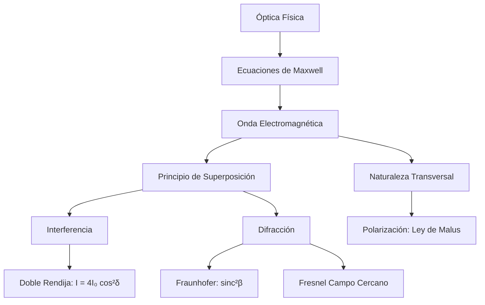

# Óptica Física
La óptica física (u óptica ondulatoria) considera la naturaleza electromagnética y ondulatoria de la luz para explicar fenómenos que la óptica geométrica no puede, tales como la interferencia, la difracción y la polarización.

## 📜 Contexto Histórico
El modelo ondulatorio de la luz fue propuesto inicialmente por Christiaan Huygens en 1678. Sin embargo, no fue hasta 1801, con el famoso experimento de la doble rendija de Thomas Young, que la naturaleza ondulatoria de la luz se demostró concluyentemente a través del fenómeno de interferencia. James Clerk Maxwell unificó más tarde la óptica con el electromagnetismo en la década de 1860.

## 🧮 Desarrollo Teórico Profundo

El marco formal de la óptica física es el electromagnetismo clásico regido por las ecuaciones de Maxwell. Desde este punto de vista, la luz es una onda transversal conformada por campos eléctricos ($\vec{E}$) y magnéticos ($\vec{B}$) oscilando perpendicularmente entre sí y a la dirección de propagación. En el vacío, la ecuación de onda se expresa como:
$$ \nabla^2 \vec{E} - \frac{1}{c^2} \frac{\partial^2 \vec{E}}{\partial t^2} = 0 \quad \text{con} \quad c = \frac{1}{\sqrt{\mu_0 \epsilon_0}} $$

### 1. Interferencia por Superposición de Ondas

Cuando dos ondas luminosas armónicas, emitidas por fuentes coherentes, se superponen en un punto del espacio, el campo eléctrico resultante es la suma vectorial:
$$ \vec{E}_{T} = \vec{E}_1 + \vec{E}_2 = \vec{E}_{01} \cos(\vec{k}_1\cdot\vec{r} - \omega t + \phi_1) + \vec{E}_{02} \cos(\vec{k}_2\cdot\vec{r} - \omega t + \phi_2) $$
La intensidad óptica observable $I$ es proporcional al promedio temporal del vector de Poynting ($I \propto \langle |\vec{E}_{T}|^2 \rangle$). Al promediar temporalmente, obtenemos:
$$ I = I_1 + I_2 + 2\sqrt{I_1 I_2} \cos(\delta) $$
donde $\delta = (\vec{k}_2\cdot\vec{r} - \vec{k}_1\cdot\vec{r}) + (\phi_2 - \phi_1)$ es la **diferencia de fase total**.

**Experimento de Young (Doble Rendija):**
Si la luz proviene de dos rendijas separadas por una distancia $d$, incidiendo sobre una pantalla distante a distancia $L$ ($L \gg d$), la diferencia de camino óptico es $\Delta r = d \sin(\theta) \approx d \frac{y}{L}$. Así, $\delta = k \Delta r = \frac{2\pi}{\lambda} d \sin \theta$. 
Si las fuentes tienen igual intensidad ($I_1 = I_2 = I_0$), la intensidad resultante es:
$$ I(\theta) = 4 I_0 \cos^2\left(\frac{\pi d \sin \theta}{\lambda}\right) $$
Los máximos brillantes (interferencia constructiva) ocurren cuando $\cos^2(...) = 1$, es decir, $\delta = 2\pi m \implies d \sin \theta = m\lambda$.

### 2. Teoría de Difracción Escalar de Fraunhofer

La difracción resulta de la interferencia de un número infinito de fuentes secundarias (Principio de Huygens-Fresnel). El límite de Fraunhofer (campo lejano) se alcanza cuando la pantalla está suficientemente lejos de la apertura de modo que las ondas que llegan pueden considerarse aproximadamente planas.

**Difracción por una rendija de ancho $a$:**
Consideremos la rendija en el eje $y$ desde $-a/2$ hasta $a/2$. Cada segmento diferencial $dy$ emite una onda esférica secundaria con amplitud proporcional a $dy$. La diferencia de fase respecto al centro de la rendija es $\beta(y) = k y \sin \theta$. 
El campo total en la pantalla es la integral:
$$ E(\theta) \propto \int_{-a/2}^{a/2} e^{i k y \sin \theta} dy = \left[ \frac{e^{i k y \sin \theta}}{i k \sin \theta} \right]_{-a/2}^{a/2} = a \frac{\sin\left(\frac{k a \sin \theta}{2}\right)}{\frac{k a \sin \theta}{2}} $$
Definiendo el parámetro adimensional $\beta = \frac{\pi a \sin \theta}{\lambda}$, la intensidad $I(\theta) \propto |E(\theta)|^2$ resulta en el patrón sinc cuadrado:
$$ I(\theta) = I_0 \text{sinc}^2(\beta) = I_0 \left( \frac{\sin(\beta)}{\beta} \right)^2 $$
Los mínimos de intensidad ocurren para $\beta = m\pi$ (donde $m = \pm 1, \pm 2, \dots$), lo que lleva a la condición $a \sin \theta = m\lambda$. Notemos que no hay mínimo para $m=0$, ya que $\lim_{\beta \to 0} \frac{\sin \beta}{\beta} = 1$ (máximo central).

### 3. Redes de Difracción y Poder Resolutivo

Una red de difracción contiene $N$ rendijas igualmente espaciadas por una distancia $d$. La amplitud transmitida es una serie geométrica de fases. La distribución de intensidad combina la difracción de una sola rendija con la interferencia de $N$ fuentes:
$$ I(\theta) = I_0 \left( \frac{\sin\left(\frac{\pi a \sin \theta}{\lambda}\right)}{\frac{\pi a \sin \theta}{\lambda}} \right)^2 \left( \frac{\sin\left(\frac{N \pi d \sin \theta}{\lambda}\right)}{\sin\left(\frac{\pi d \sin \theta}{\lambda}\right)} \right)^2 $$
Los máximos principales (o "órdenes") ocurren cuando $\frac{\pi d \sin \theta}{\lambda} = m\pi$, o $d \sin \theta = m\lambda$. La nitidez de los picos aumenta drásticamente con $N$, lo que hace a las redes de difracción esenciales en espectroscopía.
El poder de resolución espectral $\mathcal{R} = \frac{\lambda}{\Delta \lambda}$ de una red operando en orden $m$ es fundamental:
$$ \mathcal{R} = m N $$

### 4. Polarización y Ley de Malus

El vector de campo eléctrico $\vec{E}$ en una onda transversal puede oscilar en un plano específico (polarización lineal), rotar en un círculo (polarización circular) o ser una mezcla probabilística (luz no polarizada). 
Cuando luz polarizada linealmente con intensidad $I_0$ e incidente bajo un ángulo de polarización $\phi_i$ atraviesa un analizador ideal con eje de transmisión en ángulo $\phi_a$, la componente del campo transmitido es la proyección paralela al eje:
$$ E_t = E_0 \cos(\phi_i - \phi_a) = E_0 \cos \theta $$
Puesto que la intensidad es proporcional a $E^2$, se deduce la **Ley de Malus**:
$$ I = I_0 \cos^2 \theta $$
Si luz natural no polarizada incide sobre un polarizador, la intensidad se reduce exactamente a la mitad: $I = I_0 / 2$.

### 🛠 Ejemplo Práctico Universitario
**Problema:** Una onda luminosa plana incide normalmente sobre una pantalla con dos ranuras delgadas. Su distribución de intensidad en un esquema de campo lejano presenta un máximo principal central. Sin embargo, en el punto donde se esperaría el tercer máximo de interferencia ($m=3$), la intensidad es exactamente cero debido al patrón envolvente de difracción de las ranuras individuales. Determine la relación entre la separación de las ranuras $d$ y el ancho $a$ de cada ranura.

**Demostración y Solución:**
1. La intensidad total para una doble rendija de ancho finito es el producto del término de interferencia y la envolvente de difracción:
   $$ I(\theta) \propto \cos^2\left(\frac{\pi d \sin \theta}{\lambda}\right) \text{sinc}^2\left(\frac{\pi a \sin \theta}{\lambda}\right) $$
2. Los máximos de interferencia ocurren donde el argumento del coseno es $m\pi$, es decir, $\sin \theta_m = \frac{m\lambda}{d}$. El tercer máximo ideal correspondería a $m=3$, donde $\sin \theta_3 = \frac{3\lambda}{d}$.
3. Para que este máximo se cancele ("órdenes faltantes"), el primer mínimo de difracción de la envolvente sinc debe coincidir con este mismo ángulo $\theta_3$. 
4. El primer mínimo de difracción ocurre cuando el argumento de la función sinc es $\pi$, es decir, $\sin \theta_{\text{min}} = \frac{\lambda}{a}$.
5. Igualando los senos de los ángulos: $\frac{3\lambda}{d} = \frac{\lambda}{a}$.
6. Por lo tanto, cancelando $\lambda$, obtenemos la relación estricta:
   $$ d = 3a $$
   La distancia entre centros de ranura debe ser exactamente el triple de la anchura de la ranura.

## 📚 Recursos Específicos
### Cursos
1. ["Physics III: Vibrations and Waves" - MIT OCW](https://ocw.mit.edu/courses/8-03-physics-iii-vibrations-and-waves-fall-2004/)
2. ["Exploring Quantum Optics" - Coursera (École Polytechnique)](https://www.coursera.org/learn/quantum-optics)
3. ["Waves and Optics" - edX (Rice University)](https://www.edx.org/course/waves-and-optics)
4. ["Light and Optics" - Khan Academy](https://www.khanacademy.org/science/physics/light-waves)
5. ["Optics" - NPTEL (IIT Kharagpur)](https://nptel.ac.in/courses/115105099)
6. ["Understanding Optics" - Coursera (University of Central Florida)](https://www.coursera.org/learn/optics)

### Artículos y Simulaciones
1. ["Wave Interference" - PhET Interactive Simulations](https://phet.colorado.edu/en/simulations/wave-interference)
2. ["Quantum Wave Interference" - PhET Interactive Simulations](https://phet.colorado.edu/en/simulations/quantum-wave-interference)
3. ["Single Slit Diffraction" - oPhysics](https://ophysics.com/l5.html)
4. ["Double Slit Interference" - oPhysics](https://ophysics.com/l4.html)
5. ["Polarization of Light" - oPhysics](https://ophysics.com/l3.html)
6. ["Michelson Interferometer Simulation" - Amrita O-labs](http://vlab.amrita.edu/?sub=1&brch=189&sim=1106&cnt=1)
7. ["Diffraction Grating Simulation" - oPhysics](https://ophysics.com/l6.html)
8. ["Thin Film Interference" - oPhysics](https://ophysics.com/l7.html)
9. ["Faraday Effect and Polarization" - HyperPhysics](http://hyperphysics.phy-astr.gsu.edu/hbase/phyopt/faraday.html)

### 📖 Referencias Útiles y Bibliografía
1. [*Principles of Optics* por Max Born y Emil Wolf](https://www.cambridge.org/core/books/principles-of-optics/1B445037E90B051D57457FBD56A1F6E2)
2. [*Introduction to Electrodynamics* por David J. Griffiths](https://www.cambridge.org/highereducation/books/introduction-to-electrodynamics/9781108420419)
3. [*Optics* por Eugene Hecht](https://www.pearson.com/en-us/subject-catalog/p/optics/P200000006793/9780133977226)
4. ["On the Theory of Light and Colors" por Thomas Young](https://royalsocietypublishing.org/doi/10.1098/rstl.1802.0004)
