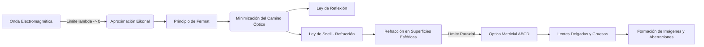

# Óptica Geométrica
La óptica geométrica es la rama de la física que estudia la propagación de la luz asumiendo que viaja en líneas rectas (rayos). Es una aproximación válida cuando la longitud de onda de la luz es mucho menor que el tamaño de los objetos con los que interactúa.

## 📜 Contexto Histórico
El estudio de la óptica geométrica data de la antigüedad, con Euclides escribiendo "Óptica" alrededor del año 300 a.C. En el siglo XI, Ibn al-Haytham (Alhazen) hizo contribuciones fundamentales en su "Libro de Óptica". La ley de refracción fue descubierta empíricamente por Willebrord Snellius en 1621 y deducida a partir del principio del tiempo mínimo por Pierre de Fermat.

## 🧮 Desarrollo Teórico Profundo

El núcleo de la óptica geométrica puede derivarse rigurosamente a partir de las Ecuaciones de Maxwell en el límite de altas frecuencias (donde la longitud de onda $\lambda \to 0$). Esta derivación, conocida como la aproximación eikonal, nos conduce al Principio de Fermat, sobre el cual se asienta el trazado de rayos.

### 1. El Eikonal y el Principio de Fermat

Asumamos una onda electromagnética monocromática de la forma $\vec{E}(\vec{r}, t) = \vec{E}_0(\vec{r}) e^{i(k_0 \mathcal{S}(\vec{r}) - \omega t)}$, donde $k_0 = 2\pi/\lambda_0$ es el número de onda en el vacío, y $\mathcal{S}(\vec{r})$ es una función escalar llamada el **eikonal** (frente de onda óptico). Insertando esto en la ecuación de onda y tomando el límite $\lambda_0 \to 0$, se obtiene la Ecuación del Eikonal:
$$ |\nabla \mathcal{S}|^2 = n(\vec{r})^2 $$
donde $n(\vec{r}) = c/v(\vec{r})$ es el índice de refracción espacial. Las curvas ortogonales a las superficies de fase constante $\mathcal{S}(\vec{r}) = C$ definen las trayectorias de los **rayos de luz**. 

La solución geométrica a esta ecuación diferencial parcial es equivalente al problema variacional de encontrar la trayectoria $\Gamma$ que minimiza el camino óptico $L_O$ (Principio de Fermat):
$$ \delta \int_{\Gamma} n(\vec{r}) \, ds = 0 $$
donde el tiempo de vuelo es $t = \frac{1}{c} \int_\Gamma n(s) ds$. Así, la luz sigue la trayectoria de tiempo estacionario (usualmente mínimo).

### 2. Derivación de las Leyes de Reflexión y Refracción

Usando el Principio de Fermat para dos puntos $A$ y $B$ separados por una interfaz plana entre medios de índices $n_1$ y $n_2$:
Sea el punto de incidencia sobre la interfaz $x$. El camino óptico total es:
$$ L_O(x) = n_1 \sqrt{h_1^2 + x^2} + n_2 \sqrt{h_2^2 + (D - x)^2} $$
Para minimizar el camino óptico, fijamos la derivada respecto a $x$ en cero:
$$ \frac{dL_O}{dx} = n_1 \frac{x}{\sqrt{h_1^2 + x^2}} - n_2 \frac{D - x}{\sqrt{h_2^2 + (D - x)^2}} = 0 $$
A partir de la geometría, reconocemos que $\frac{x}{\sqrt{h_1^2 + x^2}} = \sin \theta_1$ y $\frac{D - x}{\sqrt{h_2^2 + (D - x)^2}} = \sin \theta_2$.
Por tanto, recuperamos la **Ley de Snell**:
$$ n_1 \sin \theta_1 = n_2 \sin \theta_2 $$
Por un argumento análogo con un solo medio ($n_1 = n_2$), se obtiene $\sin \theta_i = \sin \theta_r$, o la **Ley de Reflexión**.

### 3. Matriz de Transferencia de Rayos (Óptica Paraxial)

En sistemas ópticos complejos (lentes gruesas, múltiples elementos), el método matricial ABCD proporciona un análisis potente en el régimen paraxial (ángulos pequeños donde $\sin \theta \approx \theta$).
Un rayo se caracteriza por su altura respecto al eje óptico, $y$, y su ángulo paraxial, $\theta$. El vector de estado del rayo es $\begin{pmatrix} y \\ \theta \end{pmatrix}$.

**Matriz de Traslación en un medio homogéneo (distancia $d$):**
El ángulo no cambia, la altura cambia en $d \cdot \theta$:
$$ \begin{pmatrix} y_2 \\ \theta_2 \end{pmatrix} = \begin{bmatrix} 1 & d \\ 0 & 1 \end{bmatrix} \begin{pmatrix} y_1 \\ \theta_1 \end{pmatrix} $$

**Matriz de Refracción en una superficie esférica de radio $R$:**
$$ \begin{pmatrix} y_2 \\ \theta_2 \end{pmatrix} = \begin{bmatrix} 1 & 0 \\ \frac{n_1 - n_2}{n_2 R} & \frac{n_1}{n_2} \end{bmatrix} \begin{pmatrix} y_1 \\ \theta_1 \end{pmatrix} $$

**Lente Delgada con focal $f$ en aire:**
Aproximando el espesor de la lente a 0 y combinando las refracciones, la matriz característica es:
$$ M_{lente} = \begin{bmatrix} 1 & 0 \\ -1/f & 1 \end{bmatrix} $$
donde el poder focal es $P = 1/f = (n - 1)(1/R_1 - 1/R_2)$, también conocida como la **Ecuación del Fabricante de Lentes**.

La ecuación de formación de imágenes $\frac{1}{s} + \frac{1}{s'} = \frac{1}{f}$ se deriva exigiendo que la posición final $y'$ sea independiente del ángulo inicial $\theta$ del rayo proveniente del punto objeto para una traslación $s$, paso por lente, y traslación $s'$.

### 🛠 Ejemplo Práctico Universitario
**Problema (Diseño por Matriz Paraxial):**
Determine la matriz de transferencia de sistema (ABCD) para una lente gruesa de grosor $d=5\text{ cm}$, índice de refracción $n=1.5$, y radios de curvatura $R_1=10\text{ cm}$ (superficie convexa frontal) y $R_2=-20\text{ cm}$ (superficie convexa trasera), inmersa en aire ($n_0=1$). Posteriormente, calcule la longitud focal efectiva (EFL) de esta lente gruesa.

**Solución paso a paso:**
1. El sistema consiste en tres operaciones sucesivas: Refracción en $R_1$, Traslación por $d$, y Refracción en $R_2$. El orden de multiplicación matricial es inverso al orden físico.
   $$ M = M_{R_2} \times M_d \times M_{R_1} $$
2. Matriz de refracción inicial ($1 \to n$ en $R_1$):
   $$ M_{R_1} = \begin{bmatrix} 1 & 0 \\ \frac{1 - 1.5}{1.5 (10)} & \frac{1}{1.5} \end{bmatrix} = \begin{bmatrix} 1 & 0 \\ -\frac{1}{30} & \frac{2}{3} \end{bmatrix} $$
3. Matriz de traslación en vidrio por $d=5$:
   $$ M_d = \begin{bmatrix} 1 & 5 \\ 0 & 1 \end{bmatrix} $$
4. Matriz de refracción final ($n \to 1$ en $R_2$):
   $$ M_{R_2} = \begin{bmatrix} 1 & 0 \\ \frac{1.5 - 1}{1 (-20)} & \frac{1.5}{1} \end{bmatrix} = \begin{bmatrix} 1 & 0 \\ -\frac{1}{40} & \frac{3}{2} \end{bmatrix} $$
5. Calculamos $M_d \times M_{R_1}$:
   $$ M' = \begin{bmatrix} 1 & 5 \\ 0 & 1 \end{bmatrix} \begin{bmatrix} 1 & 0 \\ -1/30 & 2/3 \end{bmatrix} = \begin{bmatrix} 1 - 5/30 & 10/3 \\ -1/30 & 2/3 \end{bmatrix} = \begin{bmatrix} 5/6 & 10/3 \\ -1/30 & 2/3 \end{bmatrix} $$
6. Multiplicamos por $M_{R_2}$ por la izquierda:
   $$ M = \begin{bmatrix} 1 & 0 \\ -1/40 & 3/2 \end{bmatrix} \begin{bmatrix} 5/6 & 10/3 \\ -1/30 & 2/3 \end{bmatrix} = \begin{bmatrix} 5/6 & 10/3 \\ -\frac{1}{48} - \frac{1}{20} & -\frac{1}{12} + 1 \end{bmatrix} = \begin{bmatrix} 5/6 & 10/3 \\ -17/240 & 11/12 \end{bmatrix} $$
7. La matriz final es $M = \begin{bmatrix} A & B \\ C & D \end{bmatrix}$. El poder focal del sistema se define como $P = -C$. Por tanto, $1/f = 17/240 \text{ cm}^{-1}$.
8. La longitud focal efectiva (EFL) es:
   $$ f = \frac{240}{17} \approx 14.12 \text{ cm} $$
   Si usáramos la aproximación de lente delgada $(d=0)$, habríamos tenido $1/f = (0.5)(1/10 + 1/20) = 0.5(3/20) = 3/40$, entonces $f_{delgada} = 13.33\text{ cm}$. El espesor añade una corrección importante.

## 📚 Recursos Específicos
### Cursos
1. ["Optics" - Coursera (University of Rochester)](https://www.coursera.org/learn/optics)
2. ["Introduction to Light" - edX](https://www.edx.org/course/introduction-to-light)
3. ["Geometric Optics" - Khan Academy](https://www.khanacademy.org/science/physics/geometric-optics)
4. ["Physics III: Waves and Optics" - MIT OCW](https://ocw.mit.edu/courses/8-03-physics-iii-vibrations-and-waves-fall-2004/)
5. ["Ray Optics" - NPTEL (IIT Bombay)](https://nptel.ac.in/courses/115101011)
6. ["Applied Optics" - Coursera](https://www.coursera.org/learn/applied-optics)

### Artículos y Simulaciones
1. ["Geometric Optics" - PhET Interactive Simulations](https://phet.colorado.edu/en/simulations/geometric-optics)
2. ["Bending Light" - PhET Interactive Simulations](https://phet.colorado.edu/en/simulations/bending-light)
3. ["Lens and Mirror Simulator" - oPhysics](https://ophysics.com/l12.html)
4. ["Refraction and Snell's Law" - oPhysics](https://ophysics.com/l8.html)
5. ["Total Internal Reflection" - oPhysics](https://ophysics.com/l9.html)
6. ["Prism Simulator" - oPhysics](https://ophysics.com/l11.html)
7. ["Ray Tracing Tool" - Ricktu288](https://ricktu288.github.io/ray-optics/)
8. ["Optics Bench" - Amrita O-labs](http://vlab.amrita.edu/?sub=1&brch=281&sim=1509&cnt=1)
9. ["Interactive Ray Tracing" - PhET](https://phet.colorado.edu/en/simulations/geometric-optics-basics)

### 📖 Referencias Útiles y Bibliografía
1. [*Optics* por Eugene Hecht](https://www.pearson.com/en-us/subject-catalog/p/optics/P200000006793/9780133977226)
2. [*Fundamentals of Physics* (Capítulos de Óptica) por Halliday & Resnick](https://www.wiley.com/en-us/Fundamentals+of+Physics%2C+12th+Edition-p-9781119773511)
3. ["Book of Optics" - Alhazen (Contexto Histórico)](https://archive.org/details/AlhazenBookOfOptics)
4. [*Principles of Optics* por Max Born y Emil Wolf](https://www.cambridge.org/core/books/principles-of-optics/1B445037E90B051D57457FBD56A1F6E2)
