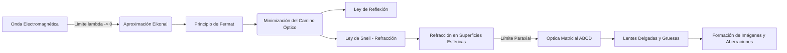

# Óptica Geométrica
La óptica geométrica es la rama de la física que estudia la propagación de la luz asumiendo que viaja en líneas rectas (rayos). Es una aproximación válida cuando la longitud de onda de la luz es mucho menor que el tamaño de los objetos con los que interactúa.

## 📜 Contexto Histórico
El estudio de la óptica geométrica data de la antigüedad, con Euclides escribiendo "Óptica" alrededor del año 300 a.C. En el siglo XI, Ibn al-Haytham (Alhazen) hizo contribuciones fundamentales en su "Libro de Óptica". La ley de refracción fue descubierta empíricamente por Willebrord Snellius en 1621 y deducida a partir del principio del tiempo mínimo por Pierre de Fermat.

## 🧮 Desarrollo Teórico Profundo

El núcleo de la óptica geométrica puede derivarse rigurosamente a partir de las Ecuaciones de Maxwell en el límite de altas frecuencias (donde la longitud de onda $\lambda \to 0$). Esta derivación, conocida como la aproximación eikonal, nos conduce al Principio de Fermat, sobre el cual se asienta el trazado de rayos.

### 1. El Eikonal y el Principio de Fermat

Asumamos una onda electromagnética monocromática de la forma $\vec{E}(\vec{r}, t) = \vec{E}_0(\vec{r}) e^{i(k_0 \mathcal{S}(\vec{r}) - \omega t)}$, donde $k_0 = 2\pi/\lambda_0$ es el número de onda en el vacío, y $\mathcal{S}(\vec{r})$ es una función escalar llamada el **eikonal** (frente de onda óptico). Insertando esto en la ecuación de onda y tomando el límite $\lambda_0 \to 0$, se obtiene la Ecuación del Eikonal:

$$ |\nabla \mathcal{S}|^2 = n(\vec{r})^2 $$

donde $n(\vec{r}) = c/v(\vec{r})$ es el índice de refracción espacial. Las curvas ortogonales a las superficies de fase constante $\mathcal{S}(\vec{r}) = C$ definen las trayectorias de los **rayos de luz**. 

La solución geométrica a esta ecuación diferencial parcial es equivalente al problema variacional de encontrar la trayectoria $\Gamma$ que minimiza el camino óptico $L_O$ (Principio de Fermat):

$$ \delta \int_{\Gamma} n(\vec{r}) \, ds = 0 $$

donde el tiempo de vuelo es $t = \frac{1}{c} \int_\Gamma n(s) ds$. Así, la luz sigue la trayectoria de tiempo estacionario (usualmente mínimo).

### 2. Derivación de las Leyes de Reflexión y Refracción

Usando el Principio de Fermat para dos puntos $A$ y $B$ separados por una interfaz plana entre medios de índices $n_1$ y $n_2$:
Sea el punto de incidencia sobre la interfaz $x$. El camino óptico total es:

$$ L_O(x) = n_1 \sqrt{h_1^2 + x^2} + n_2 \sqrt{h_2^2 + (D - x)^2} $$

Para minimizar el camino óptico, fijamos la derivada respecto a $x$ en cero:

$$ \frac{dL_O}{dx} = n_1 \frac{x}{\sqrt{h_1^2 + x^2}} - n_2 \frac{D - x}{\sqrt{h_2^2 + (D - x)^2}} = 0 $$

A partir de la geometría, reconocemos que $\frac{x}{\sqrt{h_1^2 + x^2}} = \sin \theta_1$ y $\frac{D - x}{\sqrt{h_2^2 + (D - x)^2}} = \sin \theta_2$.
Por tanto, recuperamos la **Ley de Snell**:

$$ n_1 \sin \theta_1 = n_2 \sin \theta_2 $$

Por un argumento análogo con un solo medio ($n_1 = n_2$), se obtiene $\sin \theta_i = \sin \theta_r$, o la **Ley de Reflexión**.

### 3. Matriz de Transferencia de Rayos (Óptica Paraxial)

En sistemas ópticos complejos (lentes gruesas, múltiples elementos), el método matricial ABCD proporciona un análisis potente en el régimen paraxial (ángulos pequeños donde $\sin \theta \approx \theta$).
Un rayo se caracteriza por su altura respecto al eje óptico, $y$, y su ángulo paraxial, $\theta$. El vector de estado del rayo es $\begin{pmatrix} y \\ \theta \end{pmatrix}$.

**Matriz de Traslación en un medio homogéneo (distancia $d$):**
El ángulo no cambia, la altura cambia en $d \cdot \theta$:

$$ \begin{pmatrix} y_2 \\ \theta_2 \end{pmatrix} = \begin{bmatrix} 1 & d \\ 0 & 1 \end{bmatrix} \begin{pmatrix} y_1 \\ \theta_1 \end{pmatrix} $$

**Matriz de Refracción en una superficie esférica de radio $R$:**

$$ \begin{pmatrix} y_2 \\ \theta_2 \end{pmatrix} = \begin{bmatrix} 1 & 0 \\ \frac{n_1 - n_2}{n_2 R} & \frac{n_1}{n_2} \end{bmatrix} \begin{pmatrix} y_1 \\ \theta_1 \end{pmatrix} $$

**Lente Delgada con focal $f$ en aire:**
Aproximando el espesor de la lente a 0 y combinando las refracciones, la matriz característica es:

$$ M_{lente} = \begin{bmatrix} 1 & 0 \\ -1/f & 1 \end{bmatrix} $$

donde el poder focal es $P = 1/f = (n - 1)(1/R_1 - 1/R_2)$, también conocida como la **Ecuación del Fabricante de Lentes**.

La ecuación de formación de imágenes $\frac{1}{s} + \frac{1}{s'} = \frac{1}{f}$ se deriva exigiendo que la posición final $y'$ sea independiente del ángulo inicial $\theta$ del rayo proveniente del punto objeto para una traslación $s$, paso por lente, y traslación $s'$.



### 🛠 Ejemplo Práctico Universitario
**Problema (Diseño por Matriz Paraxial):**
Determine la matriz de transferencia de sistema (ABCD) para una lente gruesa de grosor $d=5\text{ cm}$, índice de refracción $n=1.5$, y radios de curvatura $R_1=10\text{ cm}$ (superficie convexa frontal) y $R_2=-20\text{ cm}$ (superficie convexa trasera), inmersa en aire ($n_0=1$). Posteriormente, calcule la longitud focal efectiva (EFL) de esta lente gruesa.

**Solución paso a paso:**
1. El sistema consiste en tres operaciones sucesivas: Refracción en $R_1$, Traslación por $d$, y Refracción en $R_2$. El orden de multiplicación matricial es inverso al orden físico.

   $$ M = M_{R_2} \times M_d \times M_{R_1} $$

2. Matriz de refracción inicial ($1 \to n$ en $R_1$):

   $$ M_{R_1} = \begin{bmatrix} 1 & 0 \\ \frac{1 - 1.5}{1.5 (10)} & \frac{1}{1.5} \end{bmatrix} = \begin{bmatrix} 1 & 0 \\ -\frac{1}{30} & \frac{2}{3} \end{bmatrix} $$

3. Matriz de traslación en vidrio por $d=5$:

   $$ M_d = \begin{bmatrix} 1 & 5 \\ 0 & 1 \end{bmatrix} $$

4. Matriz de refracción final ($n \to 1$ en $R_2$):

   $$ M_{R_2} = \begin{bmatrix} 1 & 0 \\ \frac{1.5 - 1}{1 (-20)} & \frac{1.5}{1} \end{bmatrix} = \begin{bmatrix} 1 & 0 \\ -\frac{1}{40} & \frac{3}{2} \end{bmatrix} $$

5. Calculamos $M_d \times M_{R_1}$:

   $$ M' = \begin{bmatrix} 1 & 5 \\ 0 & 1 \end{bmatrix} \begin{bmatrix} 1 & 0 \\ -1/30 & 2/3 \end{bmatrix} = \begin{bmatrix} 1 - 5/30 & 10/3 \\ -1/30 & 2/3 \end{bmatrix} = \begin{bmatrix} 5/6 & 10/3 \\ -1/30 & 2/3 \end{bmatrix} $$

6. Multiplicamos por $M_{R_2}$ por la izquierda:

   $$ M = \begin{bmatrix} 1 & 0 \\ -1/40 & 3/2 \end{bmatrix} \begin{bmatrix} 5/6 & 10/3 \\ -1/30 & 2/3 \end{bmatrix} = \begin{bmatrix} 5/6 & 10/3 \\ -\frac{1}{48} - \frac{1}{20} & -\frac{1}{12} + 1 \end{bmatrix} = \begin{bmatrix} 5/6 & 10/3 \\ -17/240 & 11/12 \end{bmatrix} $$

7. La matriz final es $M = \begin{bmatrix} A & B \\ C & D \end{bmatrix}$. El poder focal del sistema se define como $P = -C$. Por tanto, $1/f = 17/240 \text{ cm}^{-1}$.
8. La longitud focal efectiva (EFL) es:

   $$ f = \frac{240}{17} \approx 14.12 \text{ cm} $$

   Si usáramos la aproximación de lente delgada $(d=0)$, habríamos tenido $1/f = (0.5)(1/10 + 1/20) = 0.5(3/20) = 3/40$, entonces $f_{delgada} = 13.33\text{ cm}$. El espesor añade una corrección importante.

## 📝 Guía de Ejercicios Resueltos

**Problema 1: Principio de Fermat y Espejos Parabólicos**
Demuestre utilizando el principio de Fermat que todos los rayos paralelos al eje óptico de un espejo parabólico convergen en su foco geométrico tras la reflexión, de modo que la imagen es perfectamente estigmática.

**Solución paso a paso:**
1. Consideremos un espejo parabólico de ecuación $y^2 = 4fx$. El foco está en $F(f, 0)$ y el eje óptico es el eje x.
2. Un rayo incidente paralelo al eje $x$ viene desde $x = -\infty$, pero podemos tomar un frente de onda plano incidente estacionario en la directriz de la parábola, $x = -f$.
3. El camino óptico para un rayo que golpea el espejo en $P(x, y)$ y va a $F(f, 0)$ comienza en la directriz. La distancia de la directriz al punto $P$ es $d_1 = x - (-f) = x + f$.
4. La distancia desde $P(x, y)$ al foco $F(f, 0)$ es $d_2 = \sqrt{(x-f)^2 + y^2}$.
5. Sustituyendo la ecuación de la parábola $y^2 = 4fx$:
   $d_2 = \sqrt{x^2 - 2fx + f^2 + 4fx} = \sqrt{x^2 + 2fx + f^2} = \sqrt{(x+f)^2} = x + f$.
6. El camino óptico total es $\Delta L = d_1 + d_2 = (x+f) + (x+f)$ desde un frente arbitrario, o directamente notamos que la propiedad fundamental geométrica de la parábola es que cualquier punto en ella es equidistante al foco y a la directriz. 
7. Todos los rayos recorren el mismo camino óptico total al llegar al foco. Por el principio de Fermat, el tiempo de vuelo es el mismo, luego todos interfieren constructivamente en $F$, formando un punto imagen perfecto (estigmático).

**Problema 2: Dioptrio Esférico y Lentes Gruesas**
Una esfera de cristal de radio $R$ e índice de refracción $n = 2$ está en el aire. Encuentre la posición de la imagen de un objeto situado en el infinito mediante el cálculo directo de refracción en las dos superficies.

**Solución paso a paso:**
1. Fórmula del dioptrio esférico: $\frac{n_1}{s} + \frac{n_2}{s'} = \frac{n_2 - n_1}{r}$.
2. Primera superficie: el objeto está en el infinito ($s_1 = \infty$), $n_1 = 1$, $n_2 = 2$, radio $r_1 = +R$.
   $\frac{1}{\infty} + \frac{2}{s'_1} = \frac{2 - 1}{R} \implies \frac{2}{s'_1} = \frac{1}{R} \implies s'_1 = 2R$.
   La imagen se forma a una distancia $2R$ del primer vértice.
3. Segunda superficie: La imagen actuará como objeto virtual para la segunda cara. La distancia desde el primer vértice al segundo es $2R$ (diámetro). 
   La posición del objeto para la segunda cara es $s_2 = 2R - s'_1 = 2R - 2R = 0$.
4. Refracción en la segunda cara: $n_1 = 2$, $n_2 = 1$, $r_2 = -R$, $s_2 = 0$.
   $\frac{2}{0} + \frac{1}{s'_2} = \frac{1 - 2}{-R} \implies \infty + \frac{1}{s'_2} = \frac{1}{R}$.
   Esto implica $s'_2 = 0$. La imagen se forma justo en el vértice trasero (superficie) de la esfera de cristal.

**Problema 3: Reflexión Total Interna y Fibras Ópticas**
Una fibra óptica cilíndrica de índice $n_1$ está rodeada por un revestimiento de índice $n_2$ ($n_1 > n_2$). Calcule el ángulo de aceptación máximo $\theta_{max}$ en el aire ($n_0=1$) para que la luz sea guiada por la fibra.

**Solución paso a paso:**
1. Sea $\theta_i$ el ángulo de incidencia en el aire y $\theta_t$ el ángulo transmitido al núcleo de la fibra. Por ley de Snell: $n_0 \sin \theta_i = n_1 \sin \theta_t$.
2. El rayo refractado incide en la interfaz núcleo-revestimiento con un ángulo $\phi = 90^\circ - \theta_t$ (respecto a la normal de esa pared).
3. Para la reflexión total interna, requerimos que $\phi \geq \theta_c$, donde $\sin \theta_c = \frac{n_2}{n_1}$.
4. Esto implica $\sin \phi \geq \frac{n_2}{n_1} \implies \cos \theta_t \geq \frac{n_2}{n_1}$.
5. Expresamos $\cos \theta_t = \sqrt{1 - \sin^2 \theta_t} = \sqrt{1 - \left(\frac{\sin \theta_i}{n_1}\right)^2}$.
6. Por lo tanto, $\sqrt{1 - \frac{\sin^2 \theta_i}{n_1^2}} \geq \frac{n_2}{n_1}$. Elevando al cuadrado: $1 - \frac{\sin^2 \theta_i}{n_1^2} \geq \frac{n_2^2}{n_1^2}$.
7. $n_1^2 - \sin^2 \theta_i \geq n_2^2 \implies \sin^2 \theta_i \leq n_1^2 - n_2^2$.
8. El ángulo máximo, o Apertura Numérica (NA), cumple: $\sin \theta_{max} = \sqrt{n_1^2 - n_2^2}$. Si $\sqrt{n_1^2 - n_2^2} \geq 1$, la fibra acepta luz desde cualquier ángulo $\theta_i < 90^\circ$.

## 💻 Simulaciones Computacionales

A continuación, se presenta un script en Python que realiza un trazado de rayos básico (ray tracing) a través de una lente delgada convergente, ilustrando cómo los rayos paralelos, centrales y focales se refractan para converger y formar una imagen real, siguiendo las leyes fundamentales de la óptica geométrica matricial.

```python
import numpy as np
import matplotlib.pyplot as plt

def trazar_rayos_lente_delgada():
    """
    Simula el trazado de rayos principales (ray tracing) desde un objeto
    hacia una lente convergente delgada para formar una imagen real.
    """
    # Parámetros del sistema óptico
    f = 10.0      # Distancia focal (cm)
    s = 30.0      # Distancia del objeto a la lente (cm)
    h = 5.0       # Altura del objeto (cm)
    
    # Ecuación de las lentes: 1/f = 1/s + 1/s'
    # s' = (s * f) / (s - f)
    s_prima = (s * f) / (s - f)
    
    # Magnificación transversal: M = -s'/s = h'/h
    M = -s_prima / s
    h_prima = M * h
    
    # Configuración del lienzo
    fig, ax = plt.subplots(figsize=(12, 6))
    
    # Dibujar eje óptico y la lente
    ax.axhline(0, color='black', linestyle='-.', linewidth=1)
    ax.axvline(0, color='lightblue', linewidth=4, alpha=0.8, label='Lente Delgada')
    
    # Dibujar focos
    ax.plot([-f, f], [0, 0], 'ko', markersize=6, label='Focos (F, F\')')
    ax.text(-f, -1, "F", ha='center', fontweight='bold')
    ax.text(f, -1, "F'", ha='center', fontweight='bold')
    
    # Dibujar Objeto e Imagen
    ax.arrow(-s, 0, 0, h, head_width=0.8, head_length=1.5, fc='blue', ec='blue', width=0.2)
    ax.text(-s, h+1.5, "Objeto", ha='center', color='blue')
    
    ax.arrow(s_prima, 0, 0, h_prima, head_width=0.8, head_length=1.5, fc='red', ec='red', width=0.2)
    ax.text(s_prima, h_prima-2, "Imagen Real", ha='center', color='red')
    
    # Rayo 1: Paralelo al eje óptico, pasa por el foco imagen
    ax.plot([-s, 0], [h, h], 'g-', alpha=0.7)
    ax.plot([0, s_prima, s_prima + 10], [h, h_prima, h_prima + 10*(h_prima-h)/s_prima], 'g-', alpha=0.7)
    
    # Rayo 2: Pasa por el centro óptico (no se desvía)
    ax.plot([-s, s_prima, s_prima + 10], [h, h_prima, h_prima + 10*(h_prima-h)/(-s-s_prima)*(-1)], 'orange', alpha=0.7)
    
    # Rayo 3: Pasa por el foco objeto, emerge paralelo
    ax.plot([-s, 0], [h, 0 + (-h)/(-s+f)*(f)], 'purple', alpha=0.7)
    ax.plot([0, s_prima + 10], [h_prima, h_prima], 'purple', alpha=0.7)
    
    # Detalles visuales
    ax.set_title(f'Trazado de Rayos: Lente Convergente (f={f} cm)\ns={s} cm, s\'={s_prima:.1f} cm, M={M:.2f}')
    ax.set_xlabel('Posición en el eje óptico (cm)')
    ax.set_ylabel('Altura (cm)')
    ax.grid(True, linestyle=':', alpha=0.6)
    ax.legend(loc='upper right')
    
    # Ajustar límites
    ax.set_xlim(-s - 5, s_prima + 15)
    
    # Asegurar márgenes simétricos en Y
    max_y = max(abs(h), abs(h_prima)) + 5
    ax.set_ylim(-max_y, max_y)
    
    plt.tight_layout()
    plt.show()

if __name__ == '__main__':
    trazar_rayos_lente_delgada()
```

## 🚀 Fronteras de Investigación y Problemas Abiertos

La frontera de la óptica geométrica en 2026 ha evolucionado hacia la **Óptica de Forma Libre (Freeform Optics)** y los metamateriales GRIN (Gradient-Index) extremos. Con el advenimiento del diseño computacional inverso impulsado por IA y la nanofabricación, las superficies ópticas ya no se restringen a formas esféricas o asféricas de revolución, sino que utilizan superficies paramétricas complejas (polinomios de Zernike generalizados). El gran problema abierto es la corrección cromática perfecta en un solo elemento óptico (metalentes) a través de todo el espectro visible, utilizando resonadores plasmónicos a sub-longitud de onda para controlar localmente el frente de fase sin sufrir aberraciones cromáticas masivas típicas del diseño plano.

## 📐 Formalismo Matemático Avanzado (Nivel Posgrado/Doctorado)

A un nivel avanzado, la óptica geométrica no es más que el estudio del **flujo geodésico en variedades Riemannianas** y geometría de contacto. Según el Principio de Fermat, los rayos de luz trazan trayectorias que minimizan el camino óptico temporal. Matemáticamente, esto equivale a encontrar las geodésicas en una variedad Riemanniana $M$ dotada de una métrica óptica conforme, definida por el índice de refracción $n(x)$:

$$ ds^2 = n(x)^2 \left( dx_1^2 + dx_2^2 + dx_3^2 \right) = n(x)^2 \delta_{ij} dx^i dx^j $$

La ecuación de las geodésicas (ecuación del rayo) se expresa a través de los símbolos de Christoffel $\Gamma^i_{jk}$:

$$ \frac{d^2 x^i}{d\tau^2} + \Gamma^i_{jk} \frac{dx^j}{d\tau} \frac{dx^k}{d\tau} = 0 $$

Más profundamente, en el marco del espacio de fases $T^*M$, la óptica geométrica es la teoría de la **propagación de singularidades** (frentes de onda) para operadores hiperbólicos. Los rayos son precisamente las curvas bi-características del símbolo principal del operador de onda hamiltoniano. El frente de onda evoluciona como una subvariedad Legendriana dentro de una variedad de contacto, permitiendo aplicar el poderoso formalismo de la teoría de Morse y la topología diferencial para clasificar rigurosamente las cáusticas y singularidades ópticas (catástrofes de Arnold).

## 📚 Recursos Específicos

### Cursos
1. **[MIT OCW: 8.03 Physics III: Vibrations and Waves](https://ocw.mit.edu/courses/8-03-physics-iii-vibrations-and-waves-fall-2004/)**: Lewin expone el principio de Fermat de forma soberbia y cómo los frentes de onda colapsan en trayectorias discretas.
2. **[Coursera/Colorado: Introduction to Optical Engineering](https://www.coursera.org/specializations/optical-engineering)**: Aborda las aberraciones geométricas de Seidel (esférica, coma, astigmatismo) usando matrices ABCD reales para láseres.
3. **[NPTEL: Ray Optics](https://nptel.ac.in/courses/115101011)**: Tratamiento matemático matricial impecable sobre la formulación paraxial completa de Gauss y puntos nodales.

### Artículos y Simulaciones
1. **["Sir W.R. Hamilton’s Theory of Systems of Rays" (1828)](https://www.maths.tcd.ie/pub/HistMath/People/Hamilton/Rays/Rays.pdf)**
   - **Importancia Teórica:** William Rowan Hamilton unificó de golpe el principio de Fermat de la óptica geométrica con la mecánica analítica de la acción mínima de Lagrange. Fue la pista teórica principal que llevó a Schrödinger, 100 años después, a deducir su ecuación cuántica partiendo de la analogía entre materia y óptica.
   - **Fondo Matemático:** Hamilton demostró que el trazado geométrico entero puede derivarse a partir de una única Función Característica $V(\vec{r}_0, \vec{r}_1)$, que representa el camino óptico exacto entre el plano emisor y el receptor en un sistema asimétrico:

     $$ V(\vec{r}_0, \vec{r}_1) = \int_{\vec{r}_0}^{\vec{r}_1} n(x,y,z) ds $$

     Al aplicar la formulación del principio de mínima acción, demostró que el vector unitario de la dirección del rayo saliente está dado estrictamente por el gradiente de esta matriz espacial:

     $$ \vec{v}_1 = \frac{1}{n_1} \nabla_{\vec{r}_1} V \quad \text{y} \quad \vec{v}_0 = -\frac{1}{n_0} \nabla_{\vec{r}_0} V $$

   - **Implicaciones Físicas:** Al igual que en la mecánica clásica donde conocer el lagrangiano resuelve toda la dinámica futura, si uno conoce (o diseña) la función característica $V$ del bloque de cristal o arreglo de lentes, puede predecir exactamente hacia dónde escapará cada rayo de luz sin tener que calcular explícitamente refracciones sucesivas de Snell en múltiples interfaces intrincadas, dando nacimiento al análisis de aberraciones puramente algebraico.

2. **["Gradient-Index (GRIN) Optics: A Review" (Moore, 1980)](https://opg.optica.org/ao/abstract.cfm?uri=ao-19-7-1035)**
   - **Importancia Teórica:** Analiza los medios donde la luz se curva de forma continua y elegante, no abruptamente en paredes discretas. Es la física matemática usada detrás del camuflaje ("mirages", oasis del desierto) y el diseño de endoscopios de fibra GRIN de un milímetro de diámetro sin usar cristal curvo.
   - **Fondo Matemático:** Cuando el índice $n$ no es constante, sino un perfil paraboide inyectado como $n(r) = n_0(1 - \frac{1}{2}g^2 r^2)$ (con $r$ la distancia radial del cilindro), la ecuación del Eikonal de rayos se reduce, para pequeños ángulos, a la ecuación de un oscilador armónico simple para la trayectoria meridional geométrica:

     $$ \frac{d^2 r(z)}{dz^2} + g^2 r(z) = 0 $$

     Cuyas soluciones exactas son funciones armónicas tipo $r(z) = r_0 \cos(gz) + \frac{\theta_0}{g} \sin(gz)$.
   - **Implicaciones Físicas:** Esto es milagroso; los rayos de luz trazan trayectorias sinusoidales en espiral continuas a lo largo de un cilindro perfecto y plano, enfocándose a sí mismos periódicamente en un "punto focal" interno repetitivo sin que haya una sola superficie esférica curva en toda la fibra, abaratando e impulsando la fibra óptica para telecomunicaciones intercontinentales.

3. **[Ray Optics Simulator web-app (Ricktu288)](https://ricktu288.github.io/ray-optics/)**: Un entorno "sandbox" inigualable escrito en JS que resuelve trayectorias ópticas complejas dibujadas a mano mediante las leyes de Snell aplicadas numéricamente paso a paso.

### 📖 Referencias Útiles y Bibliografía
1. [Hecht, E. *Optics* (5ta ed.)](https://www.pearson.com/en-us/subject-catalog/p/optics/P200000006793/9780133977226) - Un trato ejemplar del diseño matricial ABCD para lentes complejas.
2. [Gerrard, A., & Burch, J. M. *Introduction to Matrix Methods in Optics*](https://store.doverpublications.com/products/9780486680446) - Exclusivamente centrado en la matriz de transferencia y cavidades láser.

## 🌐 Seminarios Avanzados y Literatura de Frontera

- [MIT OpenCourseWare: Optics](https://ocw.mit.edu/courses/2-71-optics-spring-2009/) - Curso profundo sobre la propagación geométrica y sistemas de imágenes.
- [The Institute of Optics (University of Rochester) Seminars](https://www.hajim.rochester.edu/optics/events/) - Seminarios avanzados de diseño óptico e instrumentación.
- [Harvard Physics: Modern Optical Design Seminars](https://www.physics.harvard.edu/) - Discusiones sobre los límites modernos de las aproximaciones de rayos.

- [Nature Photonics: "Transformation optics and cloaking"](https://www.nature.com/nphoton/) - Revisión del uso de óptica de transformación para diseñar capas de invisibilidad controlando el flujo de luz.
- [Science: "Flat optics with designer metasurfaces"](https://www.science.org/doi/10.1126/science.1255936) - Paradigma revolucionario de lentes ultradelgadas (metalentes) que reemplazan la óptica geométrica tradicional.
- [Physical Review Letters: "Ray dynamics in microcavities"](https://journals.aps.org/prl/) - Estudio sobre caos cuántico y óptica geométrica en cavidades ópticas microscópicas.
