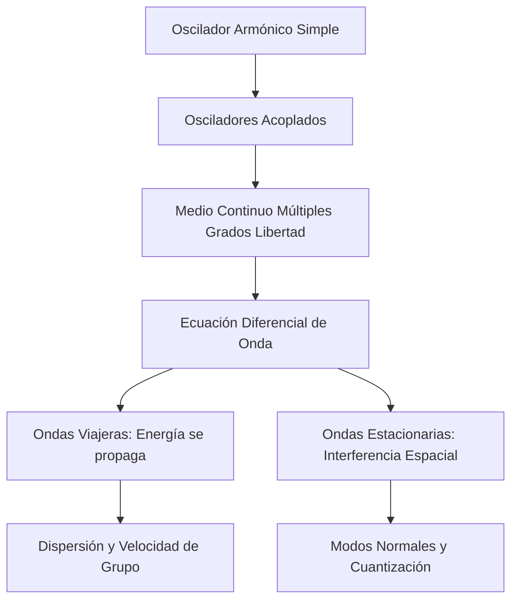

# Oscilaciones y Ondas

Las oscilaciones describen sistemas que evolucionan alrededor de un equilibrio estable. Cuando ese comportamiento se transmite en el espacio, aparecen las ondas: perturbaciones que transportan energía e información sin transportar materia de manera neta.

## 🧮 Desarrollo Teórico Profundo

El estudio de las oscilaciones y ondas constituye uno de los pilares de la física teórica y aplicada. Comienza con el análisis dinámico de sistemas perturbados alrededor de un equilibrio estable y se extiende a la propagación de esta energía en medios continuos.

### 1. El Oscilador Armónico Simple, Amortiguado y Forzado

Un sistema de masa $m$ sujeto a una fuerza restauradora lineal (Ley de Hooke) $F = -kx$ obedece la ecuación diferencial:
$$ m \frac{d^2 x}{dt^2} + kx = 0 $$
Definiendo la frecuencia angular natural $\omega_0 = \sqrt{k/m}$, la solución general es $x(t) = A \cos(\omega_0 t + \phi)$. 

**Oscilador Amortiguado:** Si consideramos una fuerza disipativa proporcional a la velocidad, $F_d = -b v$, la ecuación se convierte en:
$$ m \frac{d^2 x}{dt^2} + b \frac{dx}{dt} + kx = 0 \implies \frac{d^2 x}{dt^2} + 2\gamma \frac{dx}{dt} + \omega_0^2 x = 0 $$
donde $\gamma = b/2m$. En el caso subamortiguado ($\gamma < \omega_0$), la solución es:
$$ x(t) = A e^{-\gamma t} \cos(\omega_d t + \phi) \quad \text{con} \quad \omega_d = \sqrt{\omega_0^2 - \gamma^2} $$
La amplitud decrece exponencialmente, perdiendo energía cinética y potencial en forma de calor.

**Oscilador Forzado y Resonancia:** Al aplicar una fuerza armónica externa $F_{ext}(t) = F_0 \cos(\omega t)$, el estado estacionario adopta la frecuencia de la fuerza externa:
$$ x(t) = A(\omega) \cos(\omega t - \delta) $$
donde la amplitud $A(\omega)$ tiene un máximo absoluto (resonancia) cuando $\omega \approx \omega_0$:
$$ A(\omega) = \frac{F_0 / m}{\sqrt{(\omega_0^2 - \omega^2)^2 + (2\gamma\omega)^2}} $$

### 2. La Ecuación de Onda Clásica

Cuando conectamos una infinidad de osciladores acoplados, pasamos del dominio discreto al continuo. Consideremos una cuerda bajo tensión $T$ y con densidad lineal de masa $\mu$. Aplicando la Segunda Ley de Newton a un segmento infinitesimal $dx$, y asumiendo ángulos pequeños $\theta \approx \partial y/\partial x$, la componente vertical de la fuerza neta es:
$$ dF_y = T \left( \frac{\partial y}{\partial x}\Big|_{x+dx} - \frac{\partial y}{\partial x}\Big|_{x} \right) \approx T \frac{\partial^2 y}{\partial x^2} dx $$
Igualando esto a la masa $(\mu dx)$ por la aceleración $(\partial^2 y/\partial t^2)$, obtenemos la **Ecuación de Onda de d'Alembert**:
$$ \frac{\partial^2 y}{\partial x^2} = \frac{1}{v^2} \frac{\partial^2 y}{\partial t^2} $$
donde la velocidad de propagación es $v = \sqrt{T/\mu}$. 

### 3. Soluciones de la Ecuación de Onda

La solución de d'Alembert demuestra que cualquier función dos veces diferenciable de la forma $y(x,t) = f(x - vt) + g(x + vt)$ satisface la ecuación de onda.
Para ondas armónicas, usamos el método de separación de variables $y(x,t) = X(x)T(t)$, que nos lleva a:
$$ y(x,t) = A \cos(kx \pm \omega t + \phi) $$
donde el número de onda $k = 2\pi/\lambda$ y $\omega = 2\pi/T = 2\pi f$. La velocidad de fase está dada por la relación de dispersión $v_p = \omega / k$.

### 4. Interferencia y Ondas Estacionarias

Si una onda viajera incidente $y_1 = A \sin(kx - \omega t)$ se refleja en un extremo fijo, produce una onda reflejada $y_2 = A \sin(kx + \omega t)$. La superposición $y = y_1 + y_2$ resulta en una **onda estacionaria**:
$$ y(x,t) = [2A \sin(kx)] \cos(\omega t) $$
El término espacial $\sin(kx)$ obliga a la cuerda a tener nodos inmóviles en los puntos $x = n\pi/k = n\lambda/2$. Si la cuerda está fija en sus dos extremos (longitud $L$), se imponen las condiciones de frontera de Dirichlet $y(0,t)=y(L,t)=0$. Esto restringe las longitudes de onda permitidas (cuantización):
$$ \lambda_n = \frac{2L}{n} \implies f_n = \frac{nv}{2L} = n f_1 $$
Estos $f_n$ representan los modos normales de vibración o armónicos del sistema.

## Aplicaciones

- Cuerdas vibrantes e instrumentos musicales.
- Circuitos eléctricos oscilantes.
- Sismología y ondas en sólidos.
- Ondas electromagnéticas y cuánticas.

## 📚 Recursos
### Cursos
1. ["Vibrations and Waves" - MIT OpenCourseWare (Walter Lewin)](https://ocw.mit.edu/courses/8-03-physics-iii-vibrations-and-waves-fall-2004/)
2. ["Waves and Optics" - edX (Rice University)](https://www.edx.org/course/waves-and-optics)
3. ["Oscillations and Waves" - Khan Academy](https://www.khanacademy.org/science/physics/mechanical-waves-and-sound)
4. ["Vibrations and Waves" - NPTEL (IIT Bombay)](https://nptel.ac.in/courses/115101011)
5. ["Physics 101: Simple Harmonic Motion" - Coursera](https://www.coursera.org/learn/physics-101)

### Artículos y Simulaciones
1. ["Masses and Springs" - PhET Interactive Simulations](https://phet.colorado.edu/en/simulations/masses-and-springs)
2. ["Wave on a String" - PhET Interactive Simulations](https://phet.colorado.edu/en/simulations/wave-on-a-string)
3. ["Pendulum Lab" - PhET Interactive Simulations](https://phet.colorado.edu/en/simulations/pendulum-lab)
4. ["Coupled Oscillators Simulation" - oPhysics](https://ophysics.com/w2.html)
5. ["Resonance Simulator" - PhET](https://phet.colorado.edu/en/simulations/resonance)
6. ["Harmonic Motion and Circular Motion" - oPhysics](https://ophysics.com/k6.html)
7. ["Lissajous Figures Simulation" - oPhysics](https://ophysics.com/w3.html)
8. ["Standing Waves on a String" - oPhysics](https://ophysics.com/w8.html)
9. ["Fourier: Making Waves" - PhET Interactive Simulations](https://phet.colorado.edu/en/simulations/fourier-making-waves)

### 📖 Referencias Útiles y Bibliografía
1. [*Vibrations and Waves* por A.P. French](https://www.routledge.com/Vibrations-and-Waves/French/p/book/9780393099362)
2. [*Physics of Waves* por William C. Elmore y Mark A. Heald](https://store.doverpublications.com/products/9780486649269)
3. ["The Feynman Lectures on Physics, Vol. I" (Capítulos 21-31)](https://www.feynmanlectures.caltech.edu/I_toc.html)
4. [*Vibrations and Waves in Physics* por Iain G. Main](https://www.cambridge.org/core/books/vibrations-and-waves-in-physics/B1E1E6B9E93C3852DF39634B0B9D65E1)
