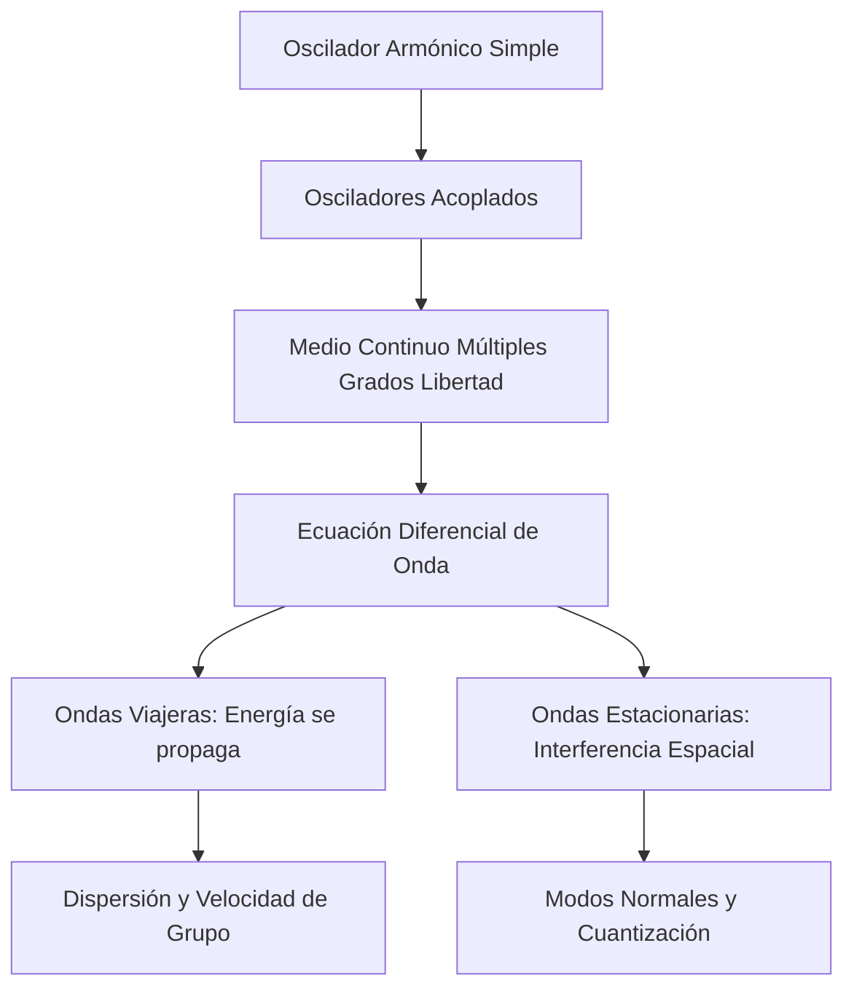

# Oscilaciones y Ondas

Las oscilaciones describen sistemas que evolucionan alrededor de un equilibrio estable. Cuando ese comportamiento se transmite en el espacio, aparecen las ondas: perturbaciones que transportan energía e información sin transportar materia de manera neta.

## 🧮 Desarrollo Teórico Profundo

El estudio de las oscilaciones y ondas constituye uno de los pilares de la física teórica y aplicada. Comienza con el análisis dinámico de sistemas perturbados alrededor de un equilibrio estable y se extiende a la propagación de esta energía en medios continuos.

### 1. El Oscilador Armónico Simple, Amortiguado y Forzado

Un sistema de masa $m$ sujeto a una fuerza restauradora lineal (Ley de Hooke) $F = -kx$ obedece la ecuación diferencial:
$$ m \frac{d^2 x}{dt^2} + kx = 0 $$
Definiendo la frecuencia angular natural $\omega_0 = \sqrt{k/m}$, la solución general es $x(t) = A \cos(\omega_0 t + \phi)$. 

**Oscilador Amortiguado:** Si consideramos una fuerza disipativa proporcional a la velocidad, $F_d = -b v$, la ecuación se convierte en:
$$ m \frac{d^2 x}{dt^2} + b \frac{dx}{dt} + kx = 0 \implies \frac{d^2 x}{dt^2} + 2\gamma \frac{dx}{dt} + \omega_0^2 x = 0 $$
donde $\gamma = b/2m$. En el caso subamortiguado ($\gamma < \omega_0$), la solución es:
$$ x(t) = A e^{-\gamma t} \cos(\omega_d t + \phi) \quad \text{con} \quad \omega_d = \sqrt{\omega_0^2 - \gamma^2} $$
La amplitud decrece exponencialmente, perdiendo energía cinética y potencial en forma de calor.

**Oscilador Forzado y Resonancia:** Al aplicar una fuerza armónica externa $F_{ext}(t) = F_0 \cos(\omega t)$, el estado estacionario adopta la frecuencia de la fuerza externa:
$$ x(t) = A(\omega) \cos(\omega t - \delta) $$
donde la amplitud $A(\omega)$ tiene un máximo absoluto (resonancia) cuando $\omega \approx \omega_0$:
$$ A(\omega) = \frac{F_0 / m}{\sqrt{(\omega_0^2 - \omega^2)^2 + (2\gamma\omega)^2}} $$

### 2. La Ecuación de Onda Clásica

Cuando conectamos una infinidad de osciladores acoplados, pasamos del dominio discreto al continuo. Consideremos una cuerda bajo tensión $T$ y con densidad lineal de masa $\mu$. Aplicando la Segunda Ley de Newton a un segmento infinitesimal $dx$, y asumiendo ángulos pequeños $\theta \approx \partial y/\partial x$, la componente vertical de la fuerza neta es:
$$ dF_y = T \left( \frac{\partial y}{\partial x}\Big|_{x+dx} - \frac{\partial y}{\partial x}\Big|_{x} \right) \approx T \frac{\partial^2 y}{\partial x^2} dx $$
Igualando esto a la masa $(\mu dx)$ por la aceleración $(\partial^2 y/\partial t^2)$, obtenemos la **Ecuación de Onda de d'Alembert**:
$$ \frac{\partial^2 y}{\partial x^2} = \frac{1}{v^2} \frac{\partial^2 y}{\partial t^2} $$
donde la velocidad de propagación es $v = \sqrt{T/\mu}$. 

### 3. Soluciones de la Ecuación de Onda

La solución de d'Alembert demuestra que cualquier función dos veces diferenciable de la forma $y(x,t) = f(x - vt) + g(x + vt)$ satisface la ecuación de onda.
Para ondas armónicas, usamos el método de separación de variables $y(x,t) = X(x)T(t)$, que nos lleva a:
$$ y(x,t) = A \cos(kx \pm \omega t + \phi) $$
donde el número de onda $k = 2\pi/\lambda$ y $\omega = 2\pi/T = 2\pi f$. La velocidad de fase está dada por la relación de dispersión $v_p = \omega / k$.

### 4. Interferencia y Ondas Estacionarias

Si una onda viajera incidente $y_1 = A \sin(kx - \omega t)$ se refleja en un extremo fijo, produce una onda reflejada $y_2 = A \sin(kx + \omega t)$. La superposición $y = y_1 + y_2$ resulta en una **onda estacionaria**:
$$ y(x,t) = [2A \sin(kx)] \cos(\omega t) $$
El término espacial $\sin(kx)$ obliga a la cuerda a tener nodos inmóviles en los puntos $x = n\pi/k = n\lambda/2$. Si la cuerda está fija en sus dos extremos (longitud $L$), se imponen las condiciones de frontera de Dirichlet $y(0,t)=y(L,t)=0$. Esto restringe las longitudes de onda permitidas (cuantización):
$$ \lambda_n = \frac{2L}{n} \implies f_n = \frac{nv}{2L} = n f_1 $$
Estos $f_n$ representan los modos normales de vibración o armónicos del sistema.



## Aplicaciones

- Cuerdas vibrantes e instrumentos musicales.
- Circuitos eléctricos oscilantes.
- Sismología y ondas en sólidos.
- Ondas electromagnéticas y cuánticas.

## 📝 Guía de Ejercicios Resueltos

**Problema 1: Oscilador Armónico Amortiguado No Lineal**
Un oscilador de masa $m$ y constante elástica $k$ está sujeto a una fuerza de amortiguamiento $F_v = -c v^2 \text{sgn}(v)$. Plantee la ecuación de movimiento diferencial y resuelva la pérdida de energía mecánica por ciclo asumiendo baja disipación.

**Solución paso a paso:**
1. La ecuación de movimiento es $m\ddot{x} + c\dot{x}^2\text{sgn}(\dot{x}) + kx = 0$.
2. Para baja disipación, asumimos una solución aproximada de un ciclo: $x(t) = A \cos(\omega t)$ con $\omega = \sqrt{k/m}$.
3. La velocidad es $v(t) = -A\omega \sin(\omega t)$.
4. El trabajo realizado por la fuerza disipativa en un ciclo es $\Delta E = \int_0^T F_v v \, dt$.
5. Sustituyendo: $F_v v = (-c v^2 \text{sgn}(v)) v = -c |v|^3 = -c A^3 \omega^3 |\sin(\omega t)|^3$.
6. $\Delta E = -c A^3 \omega^3 \int_0^{2\pi/\omega} |\sin(\omega t)|^3 \, dt$.
7. Haciendo $\theta = \omega t$, $dt = d\theta/\omega$: $\Delta E = -c A^3 \omega^2 \int_0^{2\pi} |\sin \theta|^3 \, d\theta$.
8. $\int_0^{2\pi} |\sin \theta|^3 \, d\theta = 4 \int_0^{\pi/2} \sin^3 \theta \, d\theta = 4 \left( \frac{2}{3} \right) = \frac{8}{3}$.
9. Entonces, $\Delta E = -\frac{8}{3} c A^3 \omega^2 = -\frac{8}{3} \frac{ck}{m} A^3$. La pérdida de energía por ciclo es proporcional al cubo de la amplitud.

**Problema 2: Ecuación de Onda en Cuerda con Masa Variable**
Una cuerda de longitud $L$ cuelga verticalmente desde un soporte en $z = L$. La masa por unidad de longitud es constante $\mu$. Encuentre el tiempo que tarda un pulso transversal en viajar desde $z = 0$ (extremo inferior libre) hasta $z = L$.

**Solución paso a paso:**
1. La tensión en la cuerda a una altura $z$ se debe al peso de la porción debajo de $z$: $T(z) = \mu g z$.
2. La velocidad de propagación de la onda transversal localmente es $v(z) = \sqrt{\frac{T(z)}{\mu}} = \sqrt{\frac{\mu g z}{\mu}} = \sqrt{gz}$.
3. El tiempo de propagación es $t = \int_0^L \frac{dz}{v(z)} = \int_0^L \frac{dz}{\sqrt{gz}}$.
4. Evaluamos la integral: $t = \frac{1}{\sqrt{g}} \int_0^L z^{-1/2} \, dz = \frac{1}{\sqrt{g}} \left[ 2z^{1/2} \right]_0^L = 2\sqrt{\frac{L}{g}}$.
5. Curiosamente, este tiempo es el mismo que el período de oscilación de un péndulo de longitud $L$ o el doble del tiempo de caída libre desde una altura $L$.

**Problema 3: Osciladores Acoplados**
Dos masas idénticas $m$ están conectadas entre sí y a paredes rígidas mediante tres resortes idénticos de constante $k$. Determine las frecuencias normales del sistema (modos normales).

**Solución paso a paso:**
1. Sean $x_1$ y $x_2$ los desplazamientos desde el equilibrio. Ecuaciones:
   $m\ddot{x}_1 = -k x_1 + k(x_2 - x_1)$
   $m\ddot{x}_2 = -k x_2 - k(x_2 - x_1)$
2. Reordenando matricialmente: $m \begin{pmatrix} \ddot{x}_1 \\ \ddot{x}_2 \end{pmatrix} = \begin{pmatrix} -2k & k \\ k & -2k \end{pmatrix} \begin{pmatrix} x_1 \\ x_2 \end{pmatrix}$.
3. Buscamos soluciones oscilatorias $x_j(t) = A_j e^{i\omega t}$, lo que da el problema de autovalores:
   $\det \begin{pmatrix} -2k + m\omega^2 & k \\ k & -2k + m\omega^2 \end{pmatrix} = 0$.
4. $(-2k + m\omega^2)^2 - k^2 = 0 \implies m\omega^2 - 2k = \pm k$.
5. Las frecuencias son $m\omega_1^2 = 2k - k = k \implies \omega_1 = \sqrt{k/m}$ (modo simétrico).
6. $m\omega_2^2 = 2k + k = 3k \implies \omega_2 = \sqrt{3k/m}$ (modo antisimétrico).

## 💻 Simulaciones Computacionales

A continuación, se presenta un script en Python que simula la dinámica de dos osciladores armónicos acoplados débilmente. Se utiliza `scipy.integrate.solve_ivp` para resolver el sistema de ecuaciones diferenciales, permitiendo observar cómo la energía se transfiere periódicamente entre ambas masas, generando un patrón de batido (modos normales mezclados).

```python
import numpy as np
import matplotlib.pyplot as plt
from scipy.integrate import solve_ivp

def simular_osciladores_acoplados():
    """
    Simula el movimiento de dos masas acopladas por resortes utilizando
    integración numérica, mostrando la transferencia de energía (batido).
    """
    # Parámetros del sistema
    m1, m2 = 1.0, 1.0    # Masas (kg)
    k1, k3 = 20.0, 20.0  # Resortes extremos (N/m)
    k2 = 1.0             # Resorte de acoplamiento central débil (N/m)
    
    # Definición del sistema de EDOs (Ecuaciones Diferenciales Ordinarias)
    # y = [x1, v1, x2, v2]
    def sistema(t, y):
        x1, v1, x2, v2 = y
        
        # Ecuaciones de movimiento (Segunda Ley de Newton)
        dx1_dt = v1
        dv1_dt = (-k1 * x1 + k2 * (x2 - x1)) / m1
        
        dx2_dt = v2
        dv2_dt = (-k3 * x2 - k2 * (x2 - x1)) / m2
        
        return [dx1_dt, dv1_dt, dx2_dt, dv2_dt]

    # Condiciones iniciales: Masa 1 desplazada, Masa 2 en reposo
    # Esto excitará una superposición de los modos simétrico y antisimétrico
    y0 = [1.0, 0.0, 0.0, 0.0]
    
    # Intervalo de tiempo
    t_span = (0, 30)
    t_eval = np.linspace(t_span[0], t_span[1], 1000)
    
    # Resolución numérica
    sol = solve_ivp(sistema, t_span, y0, t_eval=t_eval, method='RK45')
    
    t = sol.t
    x1 = sol.y[0]
    x2 = sol.y[2]
    
    # Energías cinéticas (para ilustrar la transferencia de energía)
    E1 = 0.5 * m1 * sol.y[1]**2 + 0.5 * k1 * x1**2 + 0.25 * k2 * (x1 - x2)**2
    E2 = 0.5 * m2 * sol.y[3]**2 + 0.5 * k3 * x2**2 + 0.25 * k2 * (x1 - x2)**2
    # El término del resorte central se divide para visualizar aproximada/ la energía "perteneciente" a cada masa
    
    # Visualización
    fig, (ax1, ax2) = plt.subplots(2, 1, figsize=(10, 8))
    
    # Gráfica de posiciones
    ax1.plot(t, x1, label='Posición Masa 1 (x1)', color='b', linewidth=2)
    ax1.plot(t, x2, label='Posición Masa 2 (x2)', color='r', linewidth=2, alpha=0.8)
    ax1.set_title('Desplazamiento de Masas Acopladas (Efecto Batido)')
    ax1.set_ylabel('Posición (m)')
    ax1.grid(True)
    ax1.legend(loc='upper right')
    
    # Gráfica de energías
    ax1_e = ax2.plot(t, E1, label='Energía Aprox. Masa 1', color='b', alpha=0.7)
    ax2_e = ax2.plot(t, E2, label='Energía Aprox. Masa 2', color='r', alpha=0.7)
    ax2.plot(t, E1 + E2, 'k--', label='Energía Total Conservada')
    ax2.set_title('Transferencia de Energía Mecánica')
    ax2.set_xlabel('Tiempo (s)')
    ax2.set_ylabel('Energía (J)')
    ax2.grid(True)
    ax2.legend(loc='center right')
    
    plt.tight_layout()
    plt.show()

if __name__ == '__main__':
    simular_osciladores_acoplados()
```

## 🚀 Fronteras de Investigación y Problemas Abiertos

En 2026, la frontera de investigación en oscilaciones y ondas se centra fuertemente en la **mecánica topológica** y la **física de ondas no hermíticas**. Inspirados por el descubrimiento de aislantes topológicos en física del estado sólido, los investigadores están diseñando redes de osciladores acoplados macroscópicos y metamateriales mecánicos que exhiben estados de borde robustos y protegidos topológicamente. Además, el estudio de sistemas que rompen la simetría de inversión temporal y espacial (PT-simetría) ha llevado al descubrimiento de **puntos excepcionales (Exceptional Points)** en sistemas clásicos. Cerca de estos puntos, el comportamiento de fase de los osciladores experimenta transiciones abruptas, abriendo vías revolucionarias para el diseño de sensores hiper-sensibles y aisladores acústicos/mecánicos unidireccionales.

## 📐 Formalismo Matemático Avanzado (Nivel Posgrado/Doctorado)

El estudio avanzado de oscilaciones acopladas requiere abandonar la notación matricial básica y adentrarse en la **geometría simpléctica**. Consideremos una variedad simpléctica $(M, \omega)$, donde $M$ es el espacio de fases $T^*Q$ del sistema de osciladores, y $\omega = \sum_{i} dq^i \wedge dp_i$ es la 2-forma simpléctica canónica. La dinámica está gobernada por un Hamiltoniano $H: M \to \mathbb{R}$. Los campos vectoriales Hamiltonianos $X_H$ se definen mediante la relación geométrica:
$$ i_{X_H} \omega = dH $$
Para perturbaciones no lineales y modos normales resonantes (Resonancias de Fermi-Pasta-Ulam-Tsingou), el análisis se formaliza mediante la **Forma Normal de Birkhoff** y la **teoría de perturbaciones de Kolmogorov-Arnold-Moser (KAM)**. Una perturbación integrable $H = H_0(I) + \epsilon H_1(I, \theta)$, expresada en variables de acción-ángulo, preserva toros invariantes si se cumple la condición de no degeneración $\det \left( \frac{\partial^2 H_0}{\partial I_i \partial I_j} \right) \neq 0$ y si el vector de frecuencias satisface la condición Diofántica:
$$ |\mathbf{k} \cdot \boldsymbol{\omega}| \geq \frac{\gamma}{|\mathbf{k}|^\tau} \quad \forall \mathbf{k} \in \mathbb{Z}^n \setminus \{0\} $$
Esto rigurosamente demuestra la estabilidad de las oscilaciones casi-periódicas frente a perturbaciones arbitrariamente complejas en sistemas no disipativos.

## 📚 Recursos Específicos

### Cursos
1. **[MIT OCW: 8.03 Physics III: Vibrations and Waves](https://ocw.mit.edu/courses/8-03-physics-iii-vibrations-and-waves-fall-2004/)**: El curso insignia de Walter Lewin sobre la temática. Una exhibición perfecta de osciladores acoplados, simetrías y transformadas de Fourier, con abundancia de experimentos reales.
2. **[Coursera/Yale: Introduction to Mechanics, Part 2](https://www.coursera.org/learn/mechanics-part2)**: Incluye clases rigurosas de Shankar que abordan analíticamente los osciladores armónicos amortiguados.
3. **[NPTEL: Waves and Oscillations](https://nptel.ac.in/courses/115101011)**: Detalla de manera excelsa el concepto matricial de la matriz dinámica $M\ddot{x} = Kx$ para autovalores normales en mallas cristalinas.

### Artículos y Simulaciones
1. **["Nonlinear Dynamics and Chaos" por S. H. Strogatz (Capítulo de Osciladores No Lineales)](https://www.taylorfrancis.com/books/mono/10.1201/9780429492563/nonlinear-dynamics-chaos-steven-strogatz)** (Fragmentos Históricos y Físicos)
   - **Importancia Teórica:** Muestra cómo el modelo pacífico del oscilador de Hooke ($F=-kx$) se fractura bajo fuerzas intensas o disipaciones excéntricas. Introduce al oscilador amortiguado negativo clásico, el Oscilador de Van der Pol, crucial para los primeros radios, circuitos biológicos rítmicos neuronales (marcapasos del corazón) y ciclos límite estructurales (aleteo aerodinámico de puentes).
   - **Fondo Matemático:** El Oscilador de Van der Pol viene modelado por una fuerza no-conservativa y no-lineal $\ddot{x} + \mu (x^2 - 1)\dot{x} + x = 0$. 
     El término de fricción $\mu(x^2 - 1)\dot{x}$ es sumamente peculiar. Si la amplitud actual es pequeña $(|x| < 1)$, el coeficiente es negativo, lo que infunde una inyección exponencial (retroalimentación positiva) de energía al sistema, inestabilizando el reposo. Si la amplitud es gigantesca $(|x| > 1)$, el coeficiente es positivamente viscoso amortiguador, devorando energía e impidiendo un colapso explosivo divergente.
   - **Implicaciones Físicas:** Por el Teorema de Poincaré-Bendixson, el sistema obligatoriamente cae atrapado termodinámicamente en una única órbita periódica cerrada autosostenida ("Ciclo Límite"). No importa cómo inicie el sistema, el oscilador convergirá a oscilar por la eternidad en la misma órbita asimétrica exacta, sin depender del estado inicial, siendo la primera ventana rigurosa al estudio analítico del Caos y fractales.

2. **["Solitons and the Inverse Scattering Transform" por M. J. Ablowitz](https://epubs.siam.org/doi/book/10.1137/1.9781611970883)**
   - **Importancia Teórica:** Rompe el paradigma de la Ecuación de Onda Lineal (D'Alembert) que predecía la dispersión de pulsos. Un solitón es un colosal pulso robusto de onda única que se desplaza eternamente sin cambiar su forma al estabilizar la dispersión natural disipadora balanceándola matemáticamente contra un término de no-linealidad amplificadora. (Históricamente observado por J.S. Russell galopando en un canal a caballo en 1834).
   - **Fondo Matemático:** En agua de canal estrecho y largo, la elevación solitaria $\eta(x,t)$ responde rigurosamente a la endiablada ecuación diferencial diferencial no lineal de Korteweg-de Vries (KdV):
     $$ \frac{\partial \eta}{\partial t} + 6\eta \frac{\partial \eta}{\partial x} + \frac{\partial^3 \eta}{\partial x^3} = 0 $$
     El término central $6\eta \partial_x\eta$ provoca que los picos altos viajen más rápido (inclinando el frente de onda), mientras el término dispersivo $\partial^3_{xxx}\eta$ trata de deshacer el pico desparramando sus colas de baja longitud. 
     La solución asombrosa es el solitón puro secante-hiperbólico constante, viajando a velocidad de fase pura $c$: 
     $$ \eta(x,t) = \frac{c}{2} \text{sech}^2\left( \frac{\sqrt{c}}{2} (x - ct - x_0) \right) $$
   - **Implicaciones Físicas:** Dos de estos pulsos al colisionar se atraviesan mutuamente como si fueran corpúsculos o fantasmas, preservando tamaño, masa e identidad luego del impacto, solo exhibiendo un leve desfase posicional. Fundamento indispensable para que hoy los cables de fibra óptica submarinos envíen terabytes de pulsos láser intercontinentales sin que estos se vuelvan borrosos durante el gigantesco viaje por el océano.

3. **[PhET Interactive: Normal Modes & Strings](https://phet.colorado.edu/en/simulations/normal-modes)**: Simulador de mecánica hamiltoniana interactiva; ideal para armar cristales oscilatorios acoplados unidimensionales y observar Fourier emerger vívidamente en modos normales purísimos de onda estacionaria.

### 📖 Referencias Útiles y Bibliografía
1. [French, A.P. *Vibrations and Waves* (MIT Intro Physics Series)](https://www.routledge.com/Vibrations-and-Waves/French/p/book/9780393099362) - El texto definitivo nivel licenciatura. Explica soberbiamente por qué existen y cómo operan matemáticamente las impedancias de onda.
2. [Elmore, W.C. & Heald, M.A. *Physics of Waves*](https://store.doverpublications.com/products/9780486649269) - Expande severamente la ecuación de D'Alembert usando variables complejas y contorno de propagación vectorial.

## 🌐 Seminarios Avanzados y Literatura de Frontera

- [MIT OpenCourseWare: Vibrations and Waves](https://ocw.mit.edu/courses/8-03sc-physics-iii-vibrations-and-waves-fall-2016/) - Un curso fundamental para comprender las bases de las oscilaciones y su propagación.
- [Perimeter Institute: Wave Phenomena Seminars](https://perimeterinstitute.ca/seminars/) - Seminarios avanzados sobre fenómenos ondulatorios en física teórica.
- [Harvard University: Waves and Optics Course](https://www.physics.harvard.edu/academics/undergrad/courses) - Recursos avanzados sobre el comportamiento de ondas mecánicas y electromagnéticas.

- [Nature: "Observation of topological edge states in a mechanical lattice"](https://www.nature.com/articles/nphys3411) - Demuestra la existencia de estados topológicos de borde en sistemas mecánicos macroscópicos.
- [Physical Review Letters: "Nonlinear Waves in Periodic Media"](https://journals.aps.org/prl/) - Un análisis profundo de ondas no lineales y solitones en redes periódicas.
- [Science: "Phononic crystals and metamaterials"](https://www.science.org/) - Revisión del diseño de cristales fonónicos para controlar ondas elásticas de formas sin precedentes.
