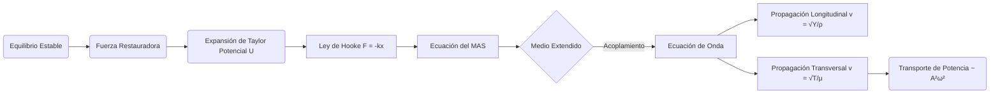

# Oscilaciones y Ondas Mecánicas
Este apartado profundiza en los sistemas que presentan movimiento periódico y en cómo las perturbaciones se propagan a través de medios materiales, transportando energía sin transporte neto de materia.

## 📜 Contexto Histórico
El estudio del movimiento oscilatorio tiene raíces en las observaciones de Galileo Galilei sobre los péndulos en el siglo XVI. Christiaan Huygens posteriormente desarrolló el reloj de péndulo en 1656. La descripción matemática rigurosa de las ondas en cuerdas fue formulada por Jean le Rond d'Alembert en 1747, sentando las bases para la ecuación de onda clásica.

## 🧮 Desarrollo Teórico Profundo

El formalismo de las oscilaciones y ondas mecánicas es esencial para entender cómo la materia y la energía interactúan a través de fuerzas elásticas en sistemas físicos.

### 1. Oscilador Armónico: Formalismo Energético y Dinámico

El Movimiento Armónico Simple (MAS) puede derivarse de un potencial escalar alrededor de un punto de equilibrio estable $x_0$. Expandiendo en serie de Taylor la energía potencial $U(x)$:
$$ U(x) \approx U(x_0) + \frac{dU}{dx}\Big|_{x_0} (x - x_0) + \frac{1}{2} \frac{d^2U}{dx^2}\Big|_{x_0} (x - x_0)^2 + \dots $$
Si $x_0$ es un mínimo estable, $\frac{dU}{dx} = 0$, y absorbiendo $U(x_0)$ en el nivel cero, tenemos $U(x) \approx \frac{1}{2}k x^2$ donde la constante efectiva del resorte es $k = \frac{d^2U}{dx^2}$.
La fuerza conservativa es $F = -\nabla U = -kx$. Por la segunda ley de Newton:
$$ \frac{d^2x}{dt^2} + \omega_0^2 x = 0 \quad \text{con} \quad \omega_0 = \sqrt{\frac{k}{m}} $$
La energía mecánica total del oscilador es constante y es una métrica invariante del sistema:
$$ E = K + U = \frac{1}{2} m \dot{x}^2 + \frac{1}{2} k x^2 = \frac{1}{2} k A^2 $$

### 2. Ecuación de Onda en Cuerdas y Barras Sólidas

**Ondas Transversales (Cuerda):**
Como se derivó históricamente, una cuerda sometida a tensión $T$ y con masa por unidad de longitud $\mu$ presenta una fuerza restauradora perpendicular al equilibrio, resultando en:
$$ \frac{\partial^2 y}{\partial x^2} - \frac{1}{v^2} \frac{\partial^2 y}{\partial t^2} = 0 \quad \text{donde} \quad v = \sqrt{\frac{T}{\mu}} $$

**Ondas Longitudinales (Barra sólida):**
Si consideramos una barra elástica de densidad $\rho$, sección transversal $A$ y módulo de Young $Y$, un desplazamiento longitudinal $u(x,t)$ induce una deformación unitaria $\epsilon = \partial u/\partial x$. Por la Ley de Hooke, el esfuerzo es $\sigma = Y \epsilon$. La fuerza neta sobre un elemento $dx$ es $A \frac{\partial \sigma}{\partial x} dx = A Y \frac{\partial^2 u}{\partial x^2} dx$.
Igualando a la masa $(\rho A dx)$ por la aceleración $\frac{\partial^2 u}{\partial t^2}$, llegamos a la misma estructura matemática:
$$ \frac{\partial^2 u}{\partial x^2} - \frac{1}{c^2} \frac{\partial^2 u}{\partial t^2} = 0 \quad \text{donde la velocidad del sonido es} \quad c = \sqrt{\frac{Y}{\rho}} $$

### 3. Potencia y Flujo de Energía en la Onda

Una onda mecánica viajera transporta energía a través de la interfaz del medio material. La potencia $P$ transmitida por una onda transversal a lo largo de una cuerda es el producto de la componente transversal de la tensión y la velocidad transversal del elemento de cuerda:
$$ P(x,t) = F_y v_y \approx \left(-T \frac{\partial y}{\partial x}\right) \left(\frac{\partial y}{\partial t}\right) $$
Para una onda armónica $y(x,t) = A \sin(kx - \omega t)$, las derivadas son $\partial y/\partial x = kA \cos(kx-\omega t)$ y $\partial y/\partial t = -A\omega \cos(kx-\omega t)$. Sustituyendo, la potencia instantánea es:
$$ P(x,t) = T k \omega A^2 \cos^2(kx - \omega t) = \mu v \omega^2 A^2 \cos^2(kx - \omega t) $$
La **potencia promedio temporal** (promedio del coseno cuadrado es $1/2$) transmitida es:
$$ \langle P \rangle = \frac{1}{2} \mu v \omega^2 A^2 $$
Esto demuestra el teorema de conservación para el transporte de energía: la tasa de energía transmitida es estrictamente proporcional a la densidad del medio, la velocidad de onda, y fundamentalmente, al cuadrado de la amplitud y la frecuencia angular del movimiento.



## 🛠 Ejemplo Práctico
**Problema:** Una cuerda de $ 2 \text{ m} $ de longitud y masa de $ 0.01 \text{ kg} $ está sometida a una tensión de $ 200 \text{ N} $. Se genera una onda armónica con una frecuencia de $ 50 \text{ Hz} $ y amplitud $ 0.05 \text{ m} $. Calcula la velocidad de la onda, la longitud de onda y la ecuación de la onda asumiendo que viaja en la dirección positiva de x y $ \phi = 0 $.

**Solución paso a paso:**
1. Densidad lineal de masa: $ \mu = \frac{m}{L} = \frac{0.01 \text{ kg}}{2 \text{ m}} = 0.005 \text{ kg/m} $.
2. Velocidad de la onda: $ v = \sqrt{\frac{T}{\mu}} = \sqrt{\frac{200}{0.005}} = \sqrt{40000} = 200 \text{ m/s} $.
3. Longitud de onda: $ v = \lambda f \implies \lambda = \frac{v}{f} = \frac{200 \text{ m/s}}{50 \text{ Hz}} = 4 \text{ m} $.
4. Parámetros angulares:
   - $ k = \frac{2\pi}{\lambda} = \frac{2\pi}{4} = \frac{\pi}{2} \text{ rad/m} $.
   - $ \omega = 2\pi f = 2\pi(50) = 100\pi \text{ rad/s} $.
5. Ecuación de la onda: $ y(x,t) = 0.05 \sin\left(\frac{\pi}{2} x - 100\pi t\right) \text{ m} $.

## 📝 Guía de Ejercicios Resueltos

**Problema 1: Reflexión de Ondas en Interfaz de Cuerdas**
Una onda armónica $y_i = A \cos(k_1 x - \omega t)$ incide desde una cuerda de densidad $\mu_1$ hacia otra de densidad $\mu_2$. La tensión $T$ es uniforme en ambas. Demuestre la fórmula de conservación de la energía en la unión.

**Solución paso a paso:**
1. Potencia transmitida por la onda: $P = \frac{1}{2} \mu v \omega^2 A^2$. En términos de impedancia $Z = \sqrt{T\mu} = \mu v$, tenemos $P = \frac{1}{2} Z \omega^2 A^2$.
2. Coeficientes de reflexión $R$ y transmisión $T$:
   $A_r = \frac{Z_1 - Z_2}{Z_1 + Z_2} A_i \quad \text{y} \quad A_t = \frac{2 Z_1}{Z_1 + Z_2} A_i$.
3. Potencia incidente: $P_i = \frac{1}{2} Z_1 \omega^2 A_i^2$.
   Potencia reflejada: $P_r = \frac{1}{2} Z_1 \omega^2 A_r^2 = P_i \left( \frac{Z_1 - Z_2}{Z_1 + Z_2} \right)^2$.
   Potencia transmitida: $P_t = \frac{1}{2} Z_2 \omega^2 A_t^2 = \frac{1}{2} Z_2 \omega^2 \left( \frac{2 Z_1}{Z_1 + Z_2} A_i \right)^2 = P_i \frac{4 Z_1 Z_2}{(Z_1 + Z_2)^2}$.
4. Verificación de energía: $P_r + P_t = P_i \left( \frac{(Z_1 - Z_2)^2 + 4 Z_1 Z_2}{(Z_1 + Z_2)^2} \right)$.
5. Expandiendo el numerador: $(Z_1 - Z_2)^2 + 4 Z_1 Z_2 = Z_1^2 - 2Z_1 Z_2 + Z_2^2 + 4 Z_1 Z_2 = Z_1^2 + 2 Z_1 Z_2 + Z_2^2 = (Z_1 + Z_2)^2$.
6. Por ende, $P_r + P_t = P_i \frac{(Z_1 + Z_2)^2}{(Z_1 + Z_2)^2} = P_i$. La energía se conserva de forma exacta.

**Problema 2: Oscilaciones de un Fluido en un Tubo en U**
Un tubo en forma de U de sección transversal uniforme $A$ contiene un líquido de densidad $\rho$. La longitud total de la columna de líquido es $L$. Si el fluido se desplaza ligeramente de su posición, halle el período de las oscilaciones resultantes despreciando la fricción de las paredes.

**Solución paso a paso:**
1. Sea $x$ el desplazamiento vertical de un lado respecto al equilibrio. El otro lado se desplaza $-x$.
2. La diferencia de altura total de las columnas es $2x$.
3. La fuerza restauradora es el peso de esta diferencia de columna gravitacional: $F = -(\rho A (2x)) g = -2\rho g A x$.
4. La masa total del líquido en oscilación es $m = \rho A L$.
5. Ecuación de movimiento de Newton: $m \ddot{x} = F \implies \rho A L \ddot{x} = -2\rho g A x$.
6. Simplificando: $L \ddot{x} + 2g x = 0 \implies \ddot{x} + \frac{2g}{L} x = 0$.
7. Esta es la ecuación del oscilador armónico simple con frecuencia angular $\omega = \sqrt{\frac{2g}{L}}$.
8. El período de las oscilaciones es $T = \frac{2\pi}{\omega} = 2\pi \sqrt{\frac{L}{2g}}$.

**Problema 3: Impedancia Mecánica en Sistema Masa-Resorte**
Un oscilador de masa $m$, resorte $k$ y amortiguador $b$ es impulsado por una fuerza $F(t) = F_0 e^{i\omega t}$. Derive la impedancia mecánica $Z_m = F/v$ y exprese el desfase de la velocidad respecto a la fuerza aplicada.

**Solución paso a paso:**
1. Ecuación de movimiento: $m\ddot{x} + b\dot{x} + kx = F_0 e^{i\omega t}$.
2. Asumimos solución en estado estacionario $x(t) = x_0 e^{i\omega t}$. La velocidad es $v(t) = \dot{x} = i\omega x_0 e^{i\omega t}$.
3. Las derivadas son: $\ddot{x} = i\omega v$. Expresamos todo en función de la velocidad compleja $v$:
   $m(i\omega v) + bv + k\left(\frac{v}{i\omega}\right) = F(t)$.
4. Agrupando términos para la impedancia mecánica $Z_m = \frac{F(t)}{v(t)}$:
   $Z_m = i\omega m + b - \frac{i k}{\omega} = b + i \left( \omega m - \frac{k}{\omega} \right)$.
5. La parte real de la impedancia es la resistencia mecánica $b$, y la parte imaginaria es la reactancia mecánica $X_m = \omega m - k/\omega$.
6. Expresada en forma polar: $Z_m = |Z_m| e^{i\phi}$, donde $|Z_m| = \sqrt{b^2 + X_m^2}$ y $\tan \phi = \frac{X_m}{b}$.
7. Puesto que $v(t) = F(t) / Z_m$, el desfase de la velocidad respecto a la fuerza es $-\phi$.
   Si $\omega = \sqrt{k/m}$ (resonancia), $X_m = 0$, $Z_m = b$, y la velocidad está en fase con la fuerza.

## 💻 Simulaciones Computacionales

A continuación, se presenta un script en Python que modela y visualiza los tres primeros modos normales (ondas estacionarias o armónicos) de una cuerda tensa fijada en ambos extremos, aplicando las condiciones de frontera de Dirichlet impuestas por la ecuación de onda unidimensional.

```python
import numpy as np
import matplotlib.pyplot as plt

def simular_ondas_estacionarias():
    """
    Calcula y grafica los primeros tres modos normales de vibración
    (ondas estacionarias) para una cuerda sujeta en ambos extremos.
    """
    # Parámetros físicos de la cuerda
    L = 1.0       # Longitud de la cuerda (m)
    T_tension = 100.0 # Tensión (N)
    mu = 0.01     # Densidad lineal de masa (kg/m)
    
    # Velocidad de propagación de la onda transversal
    v = np.sqrt(T_tension / mu)
    
    # Vector espacial (posiciones a lo largo de la cuerda)
    x = np.linspace(0, L, 500)
    
    # Tiempo fijo para ilustrar los perfiles espaciales en amplitud máxima
    # En t=0, cos(w*t) = 1, por lo que y(x) = A * sin(k_n * x)
    
    # Configuración del gráfico
    fig, ax = plt.subplots(figsize=(10, 6))
    
    colores = ['royalblue', 'crimson', 'forestgreen']
    
    for n in range(1, 4):
        # Longitud de onda y vector de onda para el n-ésimo armónico
        lambda_n = 2 * L / n
        k_n = 2 * np.pi / lambda_n
        
        # Frecuencia del modo
        f_n = v / lambda_n
        
        # Perfil de la onda estacionaria (amplitud máxima normalizada)
        A = 1.0
        y = A * np.sin(k_n * x)
        
        # Graficamos el perfil
        ax.plot(x, y, label=f'Modo n={n} ($f_{n}$ = {f_n:.1f} Hz)', 
                color=colores[n-1], linewidth=2.5)
        
        # Sombreamos el área para mejor estética visual
        ax.fill_between(x, 0, y, color=colores[n-1], alpha=0.1)
        
        # Marcamos los nodos (puntos donde la cuerda no se mueve)
        nodos_x = [i * L / n for i in range(n + 1)]
        nodos_y = [0] * len(nodos_x)
        ax.plot(nodos_x, nodos_y, 'ko', markersize=6)
        
    ax.axhline(0, color='black', linewidth=1.5, linestyle='--')
    ax.set_title(f'Modos Normales de Vibración (Ondas Estacionarias)\nL={L}m, v={v:.1f} m/s')
    ax.set_xlabel('Posición en la cuerda $x$ (m)')
    ax.set_ylabel('Amplitud Transversal $y$')
    ax.grid(True, alpha=0.4)
    ax.legend(loc='upper right')
    
    # Limites
    ax.set_xlim(0, L)
    ax.set_ylim(-1.5, 1.5)
    
    plt.tight_layout()
    plt.show()

if __name__ == '__main__':
    simular_ondas_estacionarias()
```

## 📚 Recursos Específicos
### Cursos
1. ["Vibrations and Waves" - MIT OpenCourseWare (Walter Lewin)](https://ocw.mit.edu/courses/8-03-physics-iii-vibrations-and-waves-fall-2004/)
2. ["Physics of Waves" - edX](https://www.edx.org/course/waves-and-optics)
3. ["Mechanical Waves" - Khan Academy](https://www.khanacademy.org/science/physics/mechanical-waves-and-sound)
4. ["Introduction to Oscillations and Waves" - Coursera](https://www.coursera.org/learn/physics-101)
5. ["Vibrations and Waves" - NPTEL (IIT Bombay)](https://nptel.ac.in/courses/115101011)

### Artículos y Simulaciones
1. ["Wave on a String" - PhET Interactive Simulations](https://phet.colorado.edu/en/simulations/wave-on-a-string)
2. ["Masses and Springs" - PhET Interactive Simulations](https://phet.colorado.edu/en/simulations/masses-and-springs)
3. ["Normal Modes" - PhET Interactive Simulations](https://phet.colorado.edu/en/simulations/normal-modes)
4. ["Longitudinal vs Transverse Waves" - oPhysics](https://ophysics.com/w7.html)
5. ["Standing Waves Simulation" - oPhysics](https://ophysics.com/w8.html)
6. ["Beat Frequency" - oPhysics](https://ophysics.com/w10.html)
7. ["Resonance in a Tube" - oPhysics](https://ophysics.com/w9.html)
8. ["Wave Interference" - PhET Interactive Simulations](https://phet.colorado.edu/en/simulations/wave-interference)
9. ["Simple Harmonic Motion" - oPhysics](https://ophysics.com/w1.html)

### 📖 Referencias Útiles y Bibliografía
1. [*Vibrations and Waves* por A.P. French](https://www.routledge.com/Vibrations-and-Waves/French/p/book/9780393099362)
2. [*Physics of Waves* por William C. Elmore y Mark A. Heald](https://store.doverpublications.com/products/9780486649269)
3. ["The Feynman Lectures on Physics, Vol. I"](https://www.feynmanlectures.caltech.edu/I_toc.html)
4. [*Fundamentals of Physics* por Halliday & Resnick](https://www.wiley.com/en-us/Fundamentals+of+Physics%2C+12th+Edition-p-9781119773511)
