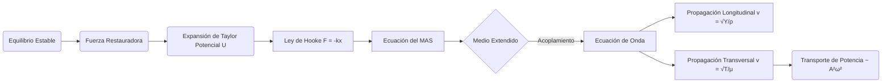

# Oscilaciones y Ondas Mecánicas
Este apartado profundiza en los sistemas que presentan movimiento periódico y en cómo las perturbaciones se propagan a través de medios materiales, transportando energía sin transporte neto de materia.

## 📜 Contexto Histórico
El estudio del movimiento oscilatorio tiene raíces en las observaciones de Galileo Galilei sobre los péndulos en el siglo XVI. Christiaan Huygens posteriormente desarrolló el reloj de péndulo en 1656. La descripción matemática rigurosa de las ondas en cuerdas fue formulada por Jean le Rond d'Alembert en 1747, sentando las bases para la ecuación de onda clásica.

## 🧮 Desarrollo Teórico Profundo

El formalismo de las oscilaciones y ondas mecánicas es esencial para entender cómo la materia y la energía interactúan a través de fuerzas elásticas en sistemas físicos.

### 1. Oscilador Armónico: Formalismo Energético y Dinámico

El Movimiento Armónico Simple (MAS) puede derivarse de un potencial escalar alrededor de un punto de equilibrio estable $x_0$. Expandiendo en serie de Taylor la energía potencial $U(x)$:
$$ U(x) \approx U(x_0) + \frac{dU}{dx}\Big|_{x_0} (x - x_0) + \frac{1}{2} \frac{d^2U}{dx^2}\Big|_{x_0} (x - x_0)^2 + \dots $$
Si $x_0$ es un mínimo estable, $\frac{dU}{dx} = 0$, y absorbiendo $U(x_0)$ en el nivel cero, tenemos $U(x) \approx \frac{1}{2}k x^2$ donde la constante efectiva del resorte es $k = \frac{d^2U}{dx^2}$.
La fuerza conservativa es $F = -\nabla U = -kx$. Por la segunda ley de Newton:
$$ \frac{d^2x}{dt^2} + \omega_0^2 x = 0 \quad \text{con} \quad \omega_0 = \sqrt{\frac{k}{m}} $$
La energía mecánica total del oscilador es constante y es una métrica invariante del sistema:
$$ E = K + U = \frac{1}{2} m \dot{x}^2 + \frac{1}{2} k x^2 = \frac{1}{2} k A^2 $$

### 2. Ecuación de Onda en Cuerdas y Barras Sólidas

**Ondas Transversales (Cuerda):**
Como se derivó históricamente, una cuerda sometida a tensión $T$ y con masa por unidad de longitud $\mu$ presenta una fuerza restauradora perpendicular al equilibrio, resultando en:
$$ \frac{\partial^2 y}{\partial x^2} - \frac{1}{v^2} \frac{\partial^2 y}{\partial t^2} = 0 \quad \text{donde} \quad v = \sqrt{\frac{T}{\mu}} $$

**Ondas Longitudinales (Barra sólida):**
Si consideramos una barra elástica de densidad $\rho$, sección transversal $A$ y módulo de Young $Y$, un desplazamiento longitudinal $u(x,t)$ induce una deformación unitaria $\epsilon = \partial u/\partial x$. Por la Ley de Hooke, el esfuerzo es $\sigma = Y \epsilon$. La fuerza neta sobre un elemento $dx$ es $A \frac{\partial \sigma}{\partial x} dx = A Y \frac{\partial^2 u}{\partial x^2} dx$.
Igualando a la masa $(\rho A dx)$ por la aceleración $\frac{\partial^2 u}{\partial t^2}$, llegamos a la misma estructura matemática:
$$ \frac{\partial^2 u}{\partial x^2} - \frac{1}{c^2} \frac{\partial^2 u}{\partial t^2} = 0 \quad \text{donde la velocidad del sonido es} \quad c = \sqrt{\frac{Y}{\rho}} $$

### 3. Potencia y Flujo de Energía en la Onda

Una onda mecánica viajera transporta energía a través de la interfaz del medio material. La potencia $P$ transmitida por una onda transversal a lo largo de una cuerda es el producto de la componente transversal de la tensión y la velocidad transversal del elemento de cuerda:
$$ P(x,t) = F_y v_y \approx \left(-T \frac{\partial y}{\partial x}\right) \left(\frac{\partial y}{\partial t}\right) $$
Para una onda armónica $y(x,t) = A \sin(kx - \omega t)$, las derivadas son $\partial y/\partial x = kA \cos(kx-\omega t)$ y $\partial y/\partial t = -A\omega \cos(kx-\omega t)$. Sustituyendo, la potencia instantánea es:
$$ P(x,t) = T k \omega A^2 \cos^2(kx - \omega t) = \mu v \omega^2 A^2 \cos^2(kx - \omega t) $$
La **potencia promedio temporal** (promedio del coseno cuadrado es $1/2$) transmitida es:
$$ \langle P \rangle = \frac{1}{2} \mu v \omega^2 A^2 $$
Esto demuestra el teorema de conservación para el transporte de energía: la tasa de energía transmitida es estrictamente proporcional a la densidad del medio, la velocidad de onda, y fundamentalmente, al cuadrado de la amplitud y la frecuencia angular del movimiento.



## 🛠 Ejemplo Práctico
**Problema:** Una cuerda de $ 2 \text{ m} $ de longitud y masa de $ 0.01 \text{ kg} $ está sometida a una tensión de $ 200 \text{ N} $. Se genera una onda armónica con una frecuencia de $ 50 \text{ Hz} $ y amplitud $ 0.05 \text{ m} $. Calcula la velocidad de la onda, la longitud de onda y la ecuación de la onda asumiendo que viaja en la dirección positiva de x y $ \phi = 0 $.

**Solución paso a paso:**
1. Densidad lineal de masa: $ \mu = \frac{m}{L} = \frac{0.01 \text{ kg}}{2 \text{ m}} = 0.005 \text{ kg/m} $.
2. Velocidad de la onda: $ v = \sqrt{\frac{T}{\mu}} = \sqrt{\frac{200}{0.005}} = \sqrt{40000} = 200 \text{ m/s} $.
3. Longitud de onda: $ v = \lambda f \implies \lambda = \frac{v}{f} = \frac{200 \text{ m/s}}{50 \text{ Hz}} = 4 \text{ m} $.
4. Parámetros angulares:
   - $ k = \frac{2\pi}{\lambda} = \frac{2\pi}{4} = \frac{\pi}{2} \text{ rad/m} $.
   - $ \omega = 2\pi f = 2\pi(50) = 100\pi \text{ rad/s} $.
5. Ecuación de la onda: $ y(x,t) = 0.05 \sin\left(\frac{\pi}{2} x - 100\pi t\right) \text{ m} $.

## 📝 Guía de Ejercicios Resueltos

**Problema 1: Reflexión de Ondas en Interfaz de Cuerdas**
Una onda armónica $y_i = A \cos(k_1 x - \omega t)$ incide desde una cuerda de densidad $\mu_1$ hacia otra de densidad $\mu_2$. La tensión $T$ es uniforme en ambas. Demuestre la fórmula de conservación de la energía en la unión.

**Solución paso a paso:**
1. Potencia transmitida por la onda: $P = \frac{1}{2} \mu v \omega^2 A^2$. En términos de impedancia $Z = \sqrt{T\mu} = \mu v$, tenemos $P = \frac{1}{2} Z \omega^2 A^2$.
2. Coeficientes de reflexión $R$ y transmisión $T$:
   $A_r = \frac{Z_1 - Z_2}{Z_1 + Z_2} A_i \quad \text{y} \quad A_t = \frac{2 Z_1}{Z_1 + Z_2} A_i$.
3. Potencia incidente: $P_i = \frac{1}{2} Z_1 \omega^2 A_i^2$.
   Potencia reflejada: $P_r = \frac{1}{2} Z_1 \omega^2 A_r^2 = P_i \left( \frac{Z_1 - Z_2}{Z_1 + Z_2} \right)^2$.
   Potencia transmitida: $P_t = \frac{1}{2} Z_2 \omega^2 A_t^2 = \frac{1}{2} Z_2 \omega^2 \left( \frac{2 Z_1}{Z_1 + Z_2} A_i \right)^2 = P_i \frac{4 Z_1 Z_2}{(Z_1 + Z_2)^2}$.
4. Verificación de energía: $P_r + P_t = P_i \left( \frac{(Z_1 - Z_2)^2 + 4 Z_1 Z_2}{(Z_1 + Z_2)^2} \right)$.
5. Expandiendo el numerador: $(Z_1 - Z_2)^2 + 4 Z_1 Z_2 = Z_1^2 - 2Z_1 Z_2 + Z_2^2 + 4 Z_1 Z_2 = Z_1^2 + 2 Z_1 Z_2 + Z_2^2 = (Z_1 + Z_2)^2$.
6. Por ende, $P_r + P_t = P_i \frac{(Z_1 + Z_2)^2}{(Z_1 + Z_2)^2} = P_i$. La energía se conserva de forma exacta.

**Problema 2: Oscilaciones de un Fluido en un Tubo en U**
Un tubo en forma de U de sección transversal uniforme $A$ contiene un líquido de densidad $\rho$. La longitud total de la columna de líquido es $L$. Si el fluido se desplaza ligeramente de su posición, halle el período de las oscilaciones resultantes despreciando la fricción de las paredes.

**Solución paso a paso:**
1. Sea $x$ el desplazamiento vertical de un lado respecto al equilibrio. El otro lado se desplaza $-x$.
2. La diferencia de altura total de las columnas es $2x$.
3. La fuerza restauradora es el peso de esta diferencia de columna gravitacional: $F = -(\rho A (2x)) g = -2\rho g A x$.
4. La masa total del líquido en oscilación es $m = \rho A L$.
5. Ecuación de movimiento de Newton: $m \ddot{x} = F \implies \rho A L \ddot{x} = -2\rho g A x$.
6. Simplificando: $L \ddot{x} + 2g x = 0 \implies \ddot{x} + \frac{2g}{L} x = 0$.
7. Esta es la ecuación del oscilador armónico simple con frecuencia angular $\omega = \sqrt{\frac{2g}{L}}$.
8. El período de las oscilaciones es $T = \frac{2\pi}{\omega} = 2\pi \sqrt{\frac{L}{2g}}$.

**Problema 3: Impedancia Mecánica en Sistema Masa-Resorte**
Un oscilador de masa $m$, resorte $k$ y amortiguador $b$ es impulsado por una fuerza $F(t) = F_0 e^{i\omega t}$. Derive la impedancia mecánica $Z_m = F/v$ y exprese el desfase de la velocidad respecto a la fuerza aplicada.

**Solución paso a paso:**
1. Ecuación de movimiento: $m\ddot{x} + b\dot{x} + kx = F_0 e^{i\omega t}$.
2. Asumimos solución en estado estacionario $x(t) = x_0 e^{i\omega t}$. La velocidad es $v(t) = \dot{x} = i\omega x_0 e^{i\omega t}$.
3. Las derivadas son: $\ddot{x} = i\omega v$. Expresamos todo en función de la velocidad compleja $v$:
   $m(i\omega v) + bv + k\left(\frac{v}{i\omega}\right) = F(t)$.
4. Agrupando términos para la impedancia mecánica $Z_m = \frac{F(t)}{v(t)}$:
   $Z_m = i\omega m + b - \frac{i k}{\omega} = b + i \left( \omega m - \frac{k}{\omega} \right)$.
5. La parte real de la impedancia es la resistencia mecánica $b$, y la parte imaginaria es la reactancia mecánica $X_m = \omega m - k/\omega$.
6. Expresada en forma polar: $Z_m = |Z_m| e^{i\phi}$, donde $|Z_m| = \sqrt{b^2 + X_m^2}$ y $\tan \phi = \frac{X_m}{b}$.
7. Puesto que $v(t) = F(t) / Z_m$, el desfase de la velocidad respecto a la fuerza es $-\phi$.
   Si $\omega = \sqrt{k/m}$ (resonancia), $X_m = 0$, $Z_m = b$, y la velocidad está en fase con la fuerza.

## 💻 Simulaciones Computacionales

A continuación, se presenta un script en Python que modela y visualiza los tres primeros modos normales (ondas estacionarias o armónicos) de una cuerda tensa fijada en ambos extremos, aplicando las condiciones de frontera de Dirichlet impuestas por la ecuación de onda unidimensional.

```python
import numpy as np
import matplotlib.pyplot as plt

def simular_ondas_estacionarias():
    """
    Calcula y grafica los primeros tres modos normales de vibración
    (ondas estacionarias) para una cuerda sujeta en ambos extremos.
    """
    # Parámetros físicos de la cuerda
    L = 1.0       # Longitud de la cuerda (m)
    T_tension = 100.0 # Tensión (N)
    mu = 0.01     # Densidad lineal de masa (kg/m)
    
    # Velocidad de propagación de la onda transversal
    v = np.sqrt(T_tension / mu)
    
    # Vector espacial (posiciones a lo largo de la cuerda)
    x = np.linspace(0, L, 500)
    
    # Tiempo fijo para ilustrar los perfiles espaciales en amplitud máxima
    # En t=0, cos(w*t) = 1, por lo que y(x) = A * sin(k_n * x)
    
    # Configuración del gráfico
    fig, ax = plt.subplots(figsize=(10, 6))
    
    colores = ['royalblue', 'crimson', 'forestgreen']
    
    for n in range(1, 4):
        # Longitud de onda y vector de onda para el n-ésimo armónico
        lambda_n = 2 * L / n
        k_n = 2 * np.pi / lambda_n
        
        # Frecuencia del modo
        f_n = v / lambda_n
        
        # Perfil de la onda estacionaria (amplitud máxima normalizada)
        A = 1.0
        y = A * np.sin(k_n * x)
        
        # Graficamos el perfil
        ax.plot(x, y, label=f'Modo n={n} ($f_{n}$ = {f_n:.1f} Hz)', 
                color=colores[n-1], linewidth=2.5)
        
        # Sombreamos el área para mejor estética visual
        ax.fill_between(x, 0, y, color=colores[n-1], alpha=0.1)
        
        # Marcamos los nodos (puntos donde la cuerda no se mueve)
        nodos_x = [i * L / n for i in range(n + 1)]
        nodos_y = [0] * len(nodos_x)
        ax.plot(nodos_x, nodos_y, 'ko', markersize=6)
        
    ax.axhline(0, color='black', linewidth=1.5, linestyle='--')
    ax.set_title(f'Modos Normales de Vibración (Ondas Estacionarias)\nL={L}m, v={v:.1f} m/s')
    ax.set_xlabel('Posición en la cuerda $x$ (m)')
    ax.set_ylabel('Amplitud Transversal $y$')
    ax.grid(True, alpha=0.4)
    ax.legend(loc='upper right')
    
    # Limites
    ax.set_xlim(0, L)
    ax.set_ylim(-1.5, 1.5)
    
    plt.tight_layout()
    plt.show()

if __name__ == '__main__':
    simular_ondas_estacionarias()
```

## 🚀 Fronteras de Investigación y Problemas Abiertos

La física contemporánea de ondas mecánicas en 2026 está dominada por los **metamateriales fonónicos no lineales** y el estudio de solitones discretos (discrete breathers). Se busca entender cómo la no-linealidad intrínseca de los enlaces atómicos o macroscópicos puede rectificar el flujo de fonones (calor) o crear "diodos acústicos" perfectos. Un área abierta crucial es la termalización de redes mecánicas unidimensionales; el problema de Fermi-Pasta-Ulam-Tsingou sigue arrojando sorpresas sobre por qué ciertos sistemas mecánicos de muchas partículas tardan tiempos cosmológicamente largos en alcanzar la equipartición de energía térmica, desafiando los pilares fundamentales de la mecánica estadística clásica.

## 📐 Formalismo Matemático Avanzado (Nivel Posgrado/Doctorado)

En el régimen avanzado no lineal, la dinámica de ondas mecánicas continuas disipativas o dispersivas se describe poderosamente utilizando el **método de la Transformada Espectral Inversa (Inverse Scattering Transform, IST)**, aplicado a ecuaciones integrables como la de Korteweg-de Vries (KdV) para ondas solitarias. La ecuación KdV, $u_t + 6u u_x + u_{xxx} = 0$, puede reformularse geométricamente como una condición de curvatura cero (Ecuación de Lax):
$$ \frac{dL}{dt} = [B, L] $$
donde $L$ y $B$ son los operadores de Lax (por ejemplo, el operador de Schrödinger $L = -\frac{\partial^2}{\partial x^2} - u(x,t)$). El hecho de que el conmutador sea igual a la evolución temporal de $L$ implica que los autovalores $\lambda$ del operador de Schrödinger asociado son invariantes en el tiempo ($d\lambda/dt = 0$). Los solitones emergen directamente como los estados ligados discretos de este potencial equivalente. Este formalismo eleva la propagación de perturbaciones mecánicas a un estudio riguroso sobre álgebras de Lie de dimensión infinita (álgebras de Virasoro y Kac-Moody).

## 📚 Recursos Específicos

### Cursos
1. **[MIT OCW: 8.03 Physics III: Vibrations and Waves](https://ocw.mit.edu/courses/8-03-physics-iii-vibrations-and-waves-fall-2004/)**: Aborda de manera analítica y experimental las transiciones fenomenológicas desde el oscilador armónico simple acoplado al límite continuo.
2. **[Coursera/EPFL: Mechanics 2 - Oscillations](https://www.coursera.org/learn/mechanics-2)**: Se enfoca en formalismos lagrangianos puristas para derivar la dinámica del batido acústico y mecánico sin necesidad de tensiones analizadas con Newton.
3. **[NPTEL: Waves and Oscillations](https://nptel.ac.in/courses/115101011)**: Tratamiento matemático riguroso de medios continuos y la respuesta espectral y armónica (Resonancia) para ingenieros estructurales y geólogos acústicos.

### Artículos y Simulaciones
1. **["Theory of Normal Modes in Multi-Degree-of-Freedom Systems" (Review clásico)](https://link.springer.com/book/10.1007/978-94-015-7795-3)**
   - **Importancia Teórica:** Conecta los problemas discretos (moléculas en vibración, masa-resorte, péndulos adyacentes) con el análisis universal del espectro de Fourier, unificando cómo los objetos aparentemente aleatorios resuenan como sumas ponderadas finitas de "frecuencias puras" inalterables.
   - **Fondo Matemático:** En un sistema mecánico no disipativo de $N$ grados de libertad descrito por el vector desplazamiento columna $\mathbf{q}(t)$, cerca del equilibrio el hamiltoniano asume la forma cinética de masa matricial $\mathbf{M}$ simétrica-positiva y la rigidez de Hooke $\mathbf{K}$:
     $$ \mathbf{M} \mathbf{\ddot{q}} + \mathbf{K} \mathbf{q} = \mathbf{0} $$
     Para las soluciones de estado estacionario oscilatorio purísimo $\mathbf{q}(t) = \mathbf{a} e^{i\omega t}$, insertándolas devuelven la ecuación de autovalores generalizada (Generalized Eigenvalue Problem en Algebra Lineal):
     $$ (\mathbf{K} - \omega^2 \mathbf{M}) \mathbf{a} = \mathbf{0} $$
     Asegurando el determinante $|\mathbf{K} - \omega^2 \mathbf{M}| = 0$, obtenemos exactamente $N$ frecuencias propias (polinomio característico) y $N$ autovectores (modos normales orquestales). La solución general es una superposición lineal (onda batiente caótica): $\mathbf{q}(t) = \sum_{j=1}^N c_j \mathbf{a}_j e^{i\omega_j t}$.
   - **Implicaciones Físicas:** Demuestra universalmente que el comportamiento de cualquier puente que oscila por el viento, cualquier molécula de CO2 vibrante por choque infrarrojo, o cualquier cristal en fase, no es aleatorio: todos están obligados a seguir el ritmo intrínseco de los autovalores invariantes dependientes estrictamente de su simetría física constructiva y no de cómo fueron excitados incialmente.

2. **["Wave Propagation in Elastic Solids" por J.D. Achenbach](https://www.sciencedirect.com/book/9780720403251/wave-propagation-in-elastic-solids)**
   - **Importancia Teórica:** Fundacional para la Sismología Teórica e Ingeniería Civil Antiterremotos, extendiendo la ecuación de la cuerda d'Alembert simple al dominio infinito tridimensional tensorial para cualquier masa dúctil con módulo de corte transversal.
   - **Fondo Matemático:** Utilizando la ecuación constitutiva de Hooke tensorial generalizada isótropa con los dos parámetros de elasticidad de Lamé ($\lambda$ y $\mu_{corte}$), la perturbación del cuerpo elástico (Ecuación de Navier-Cauchy) se define con base de desplazamientos $\mathbf{u}$:
     $$ \rho \frac{\partial^2 \mathbf{u}}{\partial t^2} = (\lambda + \mu) \nabla (\nabla \cdot \mathbf{u}) + \mu \nabla^2 \mathbf{u} $$
     Mediante la invención genial del Teorema de Descomposición de Helmholtz vectorizado, postulamos que cualquier perturbación física deformante $\mathbf{u}$ del mundo es una suma pura de un campo dilatacional sin rotación (gradiente escalar) y un campo torsional divergencia-cero (rotacional vectorial): $\mathbf{u} = \nabla \Phi + \nabla \times \mathbf{H}$. Al introducirlos, la matriz se desenreda en dos frentes de onda independientes desacoplados que jamás se mezclan viajando por la tierra:
     $$ \nabla^2 \Phi = \frac{1}{c_L^2} \frac{\partial^2 \Phi}{\partial t^2} \quad (c_L = \sqrt{\frac{\lambda + 2\mu}{\rho}}, \text{ Onda Longitudinal } P) $$
     $$ \nabla^2 \mathbf{H} = \frac{1}{c_T^2} \frac{\partial^2 \mathbf{H}}{\partial t^2} \quad (c_T = \sqrt{\frac{\mu}{\rho}}, \text{ Onda Transversal } S) $$
   - **Implicaciones Físicas:** Esta abstracción puramente matemática corrobora por qué en un desastre de terremoto, las estaciones sismológicas de medición siempre detectan un primer sacudón expansivo super rápido de presión (ondas primarias $P$) inofensivas, seguido fatalmente minutos después de las ondas de corte cortantes devastadoras (ondas secundarias $S$ de transversal cortadura estructural), brindando el retardo natural indispensable actual para advertir segundos valiosos y disparar alarmas de ciudades sísmicas (México, Japón).

3. **[oPhysics: Resonance Simulation](https://ophysics.com/w2.html)**: Simulador ideal para cambiar dinámicamente constantes de amortiguamiento en un oscilador empujado y observar cuán estrecha (fino valor de Q) o ancha se vuelve la absorción pico de energía (Lorentziana) dependiendo de la disipación viscosa termodinámica.

### 📖 Referencias Útiles y Bibliografía
1. [French, A.P. *Vibrations and Waves* (MIT Intro Physics Series)](https://www.routledge.com/Vibrations-and-Waves/French/p/book/9780393099362) - Texto fundamental por excelencia de MIT, desglosando la física y las analogías eléctricas y acústicas con las cuerdas acopladas.
2. [Elmore, W.C. & Heald, M.A. *Physics of Waves*](https://store.doverpublications.com/products/9780486649269) - Aterriza en la profundidad matemática para transiciones modales, Fourier, frentes e impedancias en sistemas acústicos.
