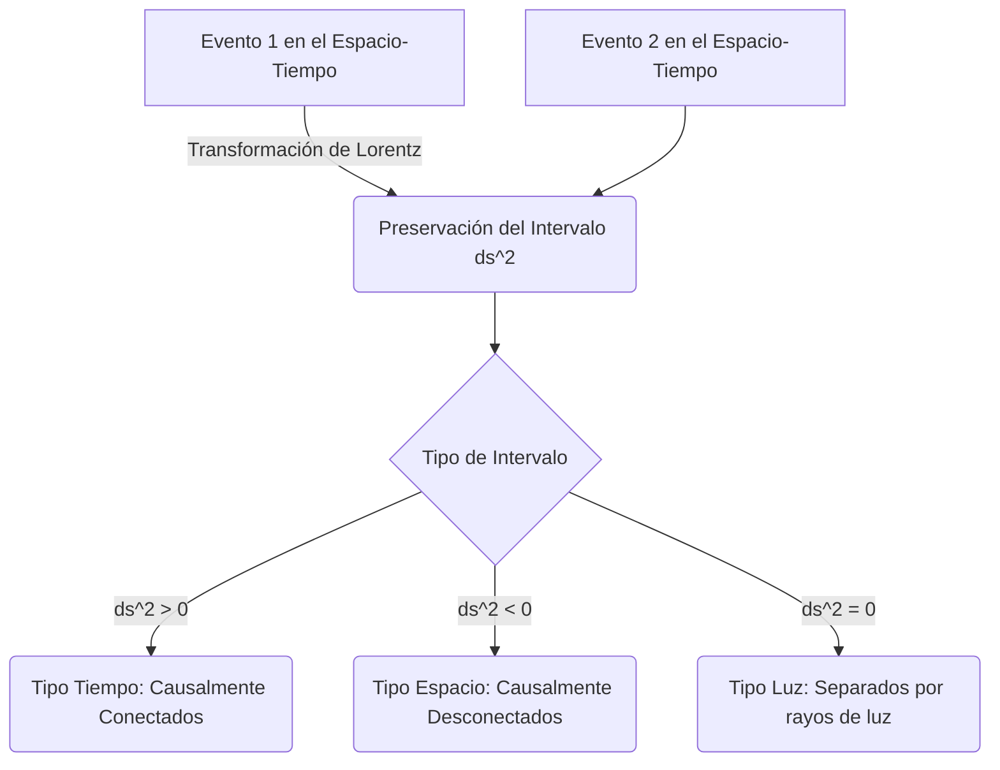

# Relatividad Especial

La Relatividad Especial es una teoría física publicada por Albert Einstein en 1905, que revolucionó nuestra comprensión del espacio, el tiempo y la energía, sustituyendo la mecánica newtoniana para objetos que se mueven a velocidades cercanas a la de la luz.

## 📜 Contexto Histórico

A finales del siglo XIX, las ecuaciones de Maxwell para el electromagnetismo predecían que la velocidad de la luz en el vacío es constante, independientemente del movimiento de la fuente. Esto contradecía la mecánica clásica de Newton y la relatividad de Galileo, donde las velocidades se sumaban linealmente. El experimento de Michelson-Morley (1887) falló en encontrar evidencia del "éter luminífero", el medio hipotético a través del cual se pensaba que viajaba la luz.

En 1905, Albert Einstein, en su artículo "Sobre la electrodinámica de los cuerpos en movimiento", resolvió este conflicto introduciendo dos postulados fundamentales: las leyes de la física son las mismas para todos los observadores en movimiento inercial uniforme, y la velocidad de la luz en el vacío es la misma para todos los observadores inerciales. Posteriormente, Hermann Minkowski (1908) formuló esta teoría geométricamente introduciendo el espacio-tiempo cuatridimensional, donde el espacio y el tiempo están entrelazados en una única estructura, el espacio-tiempo de Minkowski.

---

## 🧮 Desarrollo Teórico Profundo

La Relatividad Especial (RE) se fundamenta en los postulados de la constancia de la velocidad de la luz y el principio de relatividad. Para formalizar esta teoría, se requiere abandonar el concepto de tiempo absoluto newtoniano y adoptar el formalismo matemático del espacio-tiempo de Minkowski.

### 1. Transformaciones de Lorentz

Para dos sistemas de referencia inerciales $S$ y $S'$, donde $S'$ se mueve con velocidad constante $v$ a lo largo del eje $x$ respecto a $S$, las transformaciones de Galileo ($x' = x - vt, t' = t$) son inconsistentes con el segundo postulado de Einstein. Debemos encontrar transformaciones lineales que preserven la velocidad de la luz $c$.

Consideremos un pulso de luz emitido desde el origen $O$ (y $O'$) en $t = t' = 0$. La ecuación del frente de onda esférico en $S$ es:
$$ x^2 + y^2 + z^2 = c^2 t^2 $$
Y en el sistema $S'$ debe ser simultáneamente:
$$ (x')^2 + (y')^2 + (z')^2 = c^2 (t')^2 $$

Asumiendo linealidad y homogeneidad del espacio, y sabiendo que $y' = y$, $z' = z$, buscamos coeficientes $\gamma$ tales que:
$$ x' = \gamma (x - vt) $$
$$ x = \gamma (x' + vt') $$

Sustituyendo $x'$ en la segunda ecuación, obtenemos $t'$ en función de $x$ y $t$:
$$ x = \gamma (\gamma(x - vt) + vt') \implies vt' = \frac{x}{\gamma} - \gamma x + \gamma v t $$
$$ t' = \gamma \left( t - \frac{x}{v} \left(1 - \frac{1}{\gamma^2}\right) \right) $$

Para un rayo de luz moviéndose a lo largo del eje $x$, $x = ct$ y $x' = ct'$. Sustituyendo estas condiciones:
$$ ct' = \gamma (c - v) t $$
$$ t' = \gamma t \left( 1 - \frac{c}{v} \left(1 - \frac{1}{\gamma^2}\right) \right) $$

Igualando los factores de $t$ a la izquierda y derecha para el caso luminoso ($ct' = x'$):
$$ c \gamma \left( 1 - \frac{c}{v} \left(1 - \frac{1}{\gamma^2}\right) \right) = \gamma(c - v) $$
Resolviendo esta ecuación para $\gamma$, descubrimos que:
$$ 1 - \frac{c}{v} \left(1 - \frac{1}{\gamma^2}\right) = 1 - \frac{v}{c} $$
$$ \frac{c}{v} \left(1 - \frac{1}{\gamma^2}\right) = \frac{v}{c} \implies 1 - \frac{1}{\gamma^2} = \frac{v^2}{c^2} \implies \gamma = \frac{1}{\sqrt{1 - \frac{v^2}{c^2}}} $$

Esto define el **Factor de Lorentz** $\gamma$. Las ecuaciones completas de transformación de Lorentz son:
$$ x' = \gamma (x - vt) $$
$$ y' = y $$
$$ z' = z $$
$$ t' = \gamma \left(t - \frac{vx}{c^2}\right) $$

### 2. Espacio-Tiempo de Minkowski y Cuadrivectores

En RE, eventos físicos se representan en una variedad de cuatro dimensiones (una temporal, tres espaciales) conocida como **Espacio-Tiempo de Minkowski**. El vector de posición en este espacio se denomina *cuadrivector contravariante* de coordenadas:
$$ x^\mu = (x^0, x^1, x^2, x^3) = (ct, x, y, z) $$

Para que las leyes físicas sean invariantes bajo transformaciones de Lorentz, se expresan en términos tensoriales. La métrica del espacio de Minkowski $\eta_{\mu\nu}$ viene dada por la matriz diagonal (con firma $+---$):
$$ \eta_{\mu\nu} = \text{diag}(1, -1, -1, -1) $$

El intervalo espacio-temporal, o **elemento de línea**, se define rigurosamente usando la convención de suma de Einstein como:
$$ ds^2 = \eta_{\mu\nu} dx^\mu dx^\nu = c^2 dt^2 - dx^2 - dy^2 - dz^2 $$
Este escalar es un invariante de Lorentz, lo que significa que su valor es el mismo para cualquier observador inercial ($ds^2 = (ds')^2$).



### 3. Cinemática Relativista: Dilatación Temporal y Contracción de Longitudes

A partir de las transformaciones de Lorentz, derivamos directamente los fenómenos cinemáticos relativistas:

**Dilatación del Tiempo:** Consideremos un reloj en el origen de $S'$, marcando tiempos propios $\tau = t'$. Para este reloj, $x' = 0$ siempre. Desde $S$, medimos dos "tics" consecutivos. Sabemos que $t = \gamma(t' + \frac{vx'}{c^2})$. Como $\Delta x' = 0$:
$$ \Delta t = \gamma \Delta t' = \gamma \Delta \tau $$
Dado que $\gamma \ge 1$, $\Delta t \ge \Delta \tau$. El tiempo en $S$ transcurre más rápido, es decir, *los relojes en movimiento funcionan más lentamente*.

**Contracción de la Longitud:** Consideremos una varilla en reposo en $S'$, con extremos en $x'_1$ y $x'_2$. Su longitud propia es $L_0 = x'_2 - x'_1$. Desde el sistema $S$, queremos medir su longitud $L = x_2 - x_1$. Para que la medición sea válida, debe ser *simultánea* en $S$ ($\Delta t = 0$).
Usando $x' = \gamma(x - vt)$, evaluamos en los extremos:
$$ x'_2 - x'_1 = \gamma (x_2 - vt_2) - \gamma (x_1 - vt_1) $$
Como medimos simultáneamente en $S$ ($t_1 = t_2$):
$$ L_0 = \gamma (x_2 - x_1) = \gamma L \implies L = \frac{L_0}{\gamma} $$
Los objetos se acortan en la dirección del movimiento relativista respecto al observador inercial.

### 4. Cuadrimomento y Dinámica Relativista

El momento lineal clásico $\mathbf{p} = m\mathbf{v}$ no es un invariante ni se conserva bajo transformaciones de Lorentz. Para arreglar esto, definimos el **Cuadrimomento** $p^\mu$, multiplicando la masa invariante (o masa en reposo) $m_0$ por la cuadrivelocidad $u^\mu = \frac{dx^\mu}{d\tau}$:
$$ p^\mu = m_0 u^\mu = m_0 \frac{dx^\mu}{dt}\frac{dt}{d\tau} = m_0 \gamma (c, \mathbf{v}) = (\gamma m_0 c, \gamma m_0 \mathbf{v}) $$

La componente espacial es el momento relativista:
$$ \mathbf{p} = \gamma m_0 \mathbf{v} $$
La componente temporal está relacionada con la energía relativista total del objeto $E = \gamma m_0 c^2$. Por tanto:
$$ p^\mu = \left(\frac{E}{c}, \mathbf{p}\right) $$

Para encontrar la famosa relación invariante, evaluamos la norma escalar del cuadrimomento:
$$ p^\mu p_\mu = \eta_{\mu\nu} p^\mu p^\nu = \left(\frac{E}{c}\right)^2 - \mathbf{p}^2 $$
Al mismo tiempo, $p^\mu p_\mu = (m_0 c \gamma)^2 - (\gamma m_0 v)^2 = m_0^2 c^2 \gamma^2 \left(1 - \frac{v^2}{c^2}\right) = m_0^2 c^2$. Igualando ambas expresiones:
$$ \left(\frac{E}{c}\right)^2 - \mathbf{p}^2 = m_0^2 c^2 \implies E^2 = (\mathbf{p}c)^2 + (m_0 c^2)^2 $$

Esta es la relación de dispersión relativista, fundamental para entender las colisiones de alta energía y la física de partículas. Si un objeto está en reposo ($\mathbf{p} = 0$), se simplifica a la ecuación de equivalencia masa-energía de Einstein:
$$ E = m_0 c^2 $$
Y para fotones (masa invariante $m_0 = 0$), su energía está dada puramente por el momento $E = pc$.

---

## 🛠 Ejemplo Práctico

**Problema:** Un pión neutral ($\pi^0$) con una masa en reposo $m_{\pi} = 135 \text{ MeV}/c^2$ viaja a una velocidad $v = 0.99c$ en el sistema del laboratorio. El pión decae en dos fotones ($\pi^0 \rightarrow \gamma + \gamma$). Calcule la energía total del pión antes de decaer y el momento máximo posible que uno de los fotones puede tener en la dirección de vuelo.

**Solución paso a paso:**
1. Calculamos el factor de Lorentz $\gamma$:
   $$ \gamma = \frac{1}{\sqrt{1 - 0.99^2}} \approx \frac{1}{\sqrt{1 - 0.9801}} = \frac{1}{\sqrt{0.0199}} \approx 7.0888 $$
2. La energía total del pión $E_{\pi}$ usando la relación masa-energía:
   $$ E_{\pi} = \gamma m_{\pi} c^2 = 7.0888 \times 135 \text{ MeV} \approx 956.99 \text{ MeV} $$
3. El momento del pión $p_{\pi}$:
   $$ p_{\pi} = \gamma m_{\pi} v = 7.0888 \times 135 \text{ MeV}/c^2 \times 0.99c \approx 947.42 \text{ MeV}/c $$
4. En el decaimiento de dos cuerpos $\pi^0 \rightarrow \gamma + \gamma$, el momento máximo para un fotón en el sistema del laboratorio ocurre cuando se emite exactamente hacia adelante (colineal). Por la conservación del cuadrimomento, la energía y el momento del fotón hacia adelante ($E_1, p_1$) y el fotón hacia atrás ($E_2, p_2$) deben sumar los del pión:
   $$ E_{\pi} = E_1 + E_2 $$
   $$ p_{\pi} = p_1 - p_2 $$
   Dado que los fotones carecen de masa, $E_1 = p_1 c$ y $E_2 = p_2 c$.
   Sumando las dos primeras ecuaciones escaladas:
   $$ E_{\pi} + p_{\pi}c = E_1 + E_2 + E_1 - E_2 = 2E_1 = 2p_1 c $$
   Despejando $p_1$:
   $$ p_1 = \frac{E_{\pi} + p_{\pi}c}{2c} = \frac{956.99 \text{ MeV} + 947.42 \text{ MeV}}{2c} = \frac{1904.41}{2} \text{ MeV}/c \approx 952.2 \text{ MeV}/c $$
5. **Conclusión:** La energía del pión en vuelo es masivamente mayor que su masa en reposo, y el decaimiento transmite un impulso enorme en dirección frontal, ejemplificando el "boost" de Lorentz que se aprovecha en los aceleradores de partículas.

---

## 📝 Guía de Ejercicios Resueltos

**Problema 1: Colisión Inelástica Relativista**
Dos partículas idénticas de masa en reposo $m_0$ se mueven la una hacia la otra con la misma velocidad $v$ relativa al sistema del laboratorio. Chocan frontalmente y se fusionan para formar una sola partícula de masa $M_0$. Calcule $M_0$ en función de $m_0$ y $v$, y determine la velocidad de la partícula resultante en el sistema de referencia de una de las partículas incidentes.

**Solución paso a paso:**
1. **Conservación del cuadrimomento en el laboratorio:**
   El cuadrimomento inicial total es $P^\mu_{in} = P^\mu_1 + P^\mu_2$.
   $P^\mu_1 = (\gamma m_0 c, \gamma m_0 v, 0, 0)$
   $P^\mu_2 = (\gamma m_0 c, -\gamma m_0 v, 0, 0)$
   $P^\mu_{in} = (2\gamma m_0 c, 0, 0, 0)$
   Para la partícula final en reposo en el lab, su cuadrimomento es $P^\mu_{fin} = (M_0 c, 0, 0, 0)$.
   Igualando componentes temporales: $M_0 c = 2\gamma m_0 c \implies M_0 = 2\gamma m_0 = \frac{2m_0}{\sqrt{1 - v^2/c^2}}$.
2. **Transformación al sistema de una partícula (S'):**
   Supongamos que el sistema S' viaja con la partícula 1 (velocidad $V = v$).
   La velocidad de la partícula 2 en S' se obtiene mediante la regla relativista de adición de velocidades:
   $u'_2 = \frac{-v - v}{1 - (-v)(v)/c^2} = -\frac{2v}{1 + v^2/c^2}$.
   La partícula resultante de masa $M_0$ estaba en reposo en S. En S', S se mueve hacia la izquierda con velocidad $v$.
   Por tanto, en S', la partícula resultante se mueve con velocidad $-v$.

**Problema 2: Efecto Compton Inverso**
Un electrón de alta energía con factor de Lorentz $\gamma \gg 1$ colisiona frontalmente con un fotón de baja energía de frecuencia $\nu_0$. Calcule la frecuencia máxima del fotón dispersado $\nu'$ tras la colisión.

**Solución paso a paso:**
1. En el sistema del laboratorio, el electrón tiene cuadrimomento $p^\mu = (\gamma m_e c, -p, 0, 0)$ (asumiendo fotón en $+x$ y electrón en $-x$). Con $\gamma \gg 1$, $p \approx \gamma m_e c$.
   El fotón inicial tiene cuadrimomento $k^\mu = (h\nu_0/c, h\nu_0/c, 0, 0)$.
2. En el sistema de reposo del electrón (S'), la energía del fotón incidente es (vía transformación de Lorentz con $v \approx c$ hacia $-x$):
   $E'_{\gamma} = \gamma(E_{\gamma} - (-v)p_x) \approx \gamma h\nu_0 (1 + v/c) \approx 2\gamma h\nu_0$.
3. Asumiendo que $E'_{\gamma} \ll m_e c^2$ (dispersión de Thomson en S'), el fotón rebota elásticamente:
   El fotón dispersado en S' se emite hacia $+x$ con energía $E'_{f} \approx 2\gamma h\nu_0$.
4. Transformando de vuelta al laboratorio:
   $E_f = \gamma(E'_f + v p'_x) \approx \gamma(E'_f + c(E'_f/c)) \approx 2\gamma E'_f \approx 4\gamma^2 h\nu_0$.
5. Por lo tanto, la frecuencia final es $\nu' \approx 4\gamma^2 \nu_0$. La energía del fotón se ha amplificado por un factor $\sim 4\gamma^2$.

**Problema 3: Viaje a las estrellas y tiempo propio**
Una nave espacial viaja desde la Tierra hacia un sistema estelar a distancia $D$ con una aceleración propia constante $g$ (medida en su sistema instantáneo de reposo) hasta el punto medio del viaje, donde desacelera a $-g$ hasta llegar. Calcule el tiempo transcurrido en la Tierra ($T$) y el tiempo propio experimentado por los astronautas ($\tau$).

**Solución paso a paso:**
1. **Fase de aceleración (0 a $D/2$):**
   La ecuación de movimiento bajo aceleración propia $g$ es $\frac{d}{dt}(\gamma v) = g$. Integrando con $v(0)=0$:
   $\gamma v = gt \implies \frac{v}{\sqrt{1-v^2/c^2}} = gt \implies v(t) = \frac{gt}{\sqrt{1+(gt/c)^2}}$.
2. **Tiempo coordinado y distancia:**
   $x(t) = \int v dt = \frac{c^2}{g} \left( \sqrt{1 + (gt/c)^2} - 1 \right)$.
   En el punto medio, $x = D/2$. Entonces, $\frac{D}{2} = \frac{c^2}{g} \left( \sqrt{1 + (gt_{1/2}/c)^2} - 1 \right)$.
   Despejando el tiempo $t_{1/2}$ en la Tierra para la mitad del viaje:
   $t_{1/2} = \frac{c}{g} \sqrt{ \left( \frac{gD}{2c^2} + 1 \right)^2 - 1 }$.
   El tiempo total terrestre es $T = 2 t_{1/2}$.
3. **Tiempo propio:**
   $d\tau = dt \sqrt{1-v^2/c^2} = \frac{dt}{\sqrt{1+(gt/c)^2}}$.
   Integrando de $0$ a $t_{1/2}$:
   $\tau_{1/2} = \int_0^{t_{1/2}} \frac{dt}{\sqrt{1+(gt/c)^2}} = \frac{c}{g} \text{arsinh}\left(\frac{gt_{1/2}}{c}\right)$.
   El tiempo propio total del viaje es $\tau = 2 \tau_{1/2} = \frac{2c}{g} \text{arsinh}\left( \sqrt{ \left( \frac{gD}{2c^2} + 1 \right)^2 - 1 } \right) = \frac{2c}{g} \text{arcosh}\left(\frac{gD}{2c^2} + 1\right)$.

## 💻 Simulaciones Computacionales

A continuación, se presenta una simulación avanzada en Python que visualiza el fenómeno de la dilatación del tiempo y la contracción de Lorentz para un viajero relativista.

```python
import numpy as np
import matplotlib.pyplot as plt
from matplotlib.animation import FuncAnimation

# Constante de velocidad de la luz (simplificada)
c = 1.0

def lorentz_factor(v):
    return 1 / np.sqrt(1 - (v**2 / c**2))

# Configuración del espacio y observadores
v_traveler = 0.8 * c
gamma = lorentz_factor(v_traveler)

# Tiempos para el observador en la Tierra (S)
t_earth = np.linspace(0, 10, 100)
# Tiempos propios para el viajero (S')
t_traveler = t_earth / gamma

fig, (ax1, ax2) = plt.subplots(1, 2, figsize=(12, 5))
fig.suptitle('Simulación de Efectos Relativistas (v = 0.8c)')

# Gráfica de dilatación temporal
ax1.plot(t_earth, t_earth, label='Tiempo Terrestre (Rest Frame)', color='blue')
ax1.plot(t_earth, t_traveler, label='Tiempo Viajero (Dilatado)', color='red')
ax1.set_xlabel('Tiempo coordinado (Tierra)')
ax1.set_ylabel('Tiempo propio transcurrido')
ax1.set_title('Dilatación del Tiempo')
ax1.legend()
ax1.grid(True)

# Contracción de longitudes (Visualización estática de un objeto moviéndose)
L0 = 10.0 # Longitud propia
L_contracted = L0 / gamma
x = np.linspace(-15, 15, 400)
rect_rest = np.where((x >= -L0/2) & (x <= L0/2), 1, 0)
rect_mov = np.where((x >= -L_contracted/2) & (x <= L_contracted/2), 1, 0)

ax2.fill_between(x, 0, rect_rest, color='blue', alpha=0.3, label=f'Reposo (L0 = {L0})')
ax2.fill_between(x, 0, rect_mov, color='red', alpha=0.5, label=f'Movimiento (L = {L_contracted:.2f})')
ax2.set_xlabel('Espacio x')
ax2.set_yticks([])
ax2.set_title('Contracción de Longitudes')
ax2.legend()

plt.tight_layout()
plt.show()
```

## 🚀 Fronteras de Investigación y Problemas Abiertos

En pleno 2026, la Relatividad Especial (RE) sigue siendo una piedra angular inquebrantable de la física moderna, pero las fronteras de la investigación se centran paradójicamente en buscar su ruptura. La búsqueda de violaciones a la Invariancia de Lorentz (LIV - Lorentz Invariance Violation) es uno de los campos más activos en la fenomenología de la gravedad cuántica. Modelos como la Gravedad Cuántica de Bucles y ciertas formulaciones de la Teoría de Cuerdas sugieren que, a la escala de Planck ($10^{-35}$ metros), el espacio-tiempo podría tener una estructura discreta o no conmutativa, lo que implicaría que la velocidad de la luz depende sutilmente de su energía. Observatorios de rayos gamma y neutrinos de muy alta energía, como IceCube y el Cherenkov Telescope Array (CTA), analizan los tiempos de llegada de partículas extragalácticas para detectar retrasos anómalos que confirmarían esta dispersión del vacío. Además, el desarrollo de relojes ópticos de red ultra-precisos permite realizar pruebas del Principio de Equivalencia y de dilatación del tiempo a escalas milimétricas, buscando desviaciones en el marco de la Extensión del Modelo Estándar (SME).

## 📐 Formalismo Matemático Avanzado (Nivel Posgrado/Doctorado)

A un nivel avanzado, la Relatividad Especial se formula en el lenguaje de la teoría de grupos y geometría diferencial. El espacio-tiempo de Minkowski $\mathcal{M}$ es un espacio afín cuya variedad vectorial subyacente posee una métrica pseudo-riemanniana plana de signatura $(1,3)$. Las isometrías de este espacio forman el **Grupo de Poincaré** $\text{ISO}(1,3) = \mathbb{R}^{1,3} \rtimes \text{SO}^+(1,3)$, el cual es el producto semidirecto del grupo de traslaciones espacio-temporales y el grupo de Lorentz propio ortocrónico.

El álgebra de Lie asociada, $\mathfrak{iso}(1,3)$, está generada por los momentos $P_\mu$ (generadores de traslaciones) y los generadores de Lorentz $M_{\mu\nu}$ (rotaciones y boosts), que satisfacen el álgebra:
$$ [P_\mu, P_\nu] = 0 $$
$$ [M_{\mu\nu}, P_\rho] = -i(\eta_{\mu\rho}P_\nu - \eta_{\nu\rho}P_\mu) $$
$$ [M_{\mu\nu}, M_{\rho\sigma}] = -i(\eta_{\mu\rho}M_{\nu\sigma} - \eta_{\mu\sigma}M_{\nu\rho} - \eta_{\nu\rho}M_{\mu\sigma} + \eta_{\nu\sigma}M_{\mu\rho}) $$

Para incluir fermiones en la teoría, es necesario recurrir a las representaciones del grupo recubridor universal del grupo de Lorentz, $\text{SL}(2,\mathbb{C})$. Un espinor de Weyl de quiralidad izquierda se transforma bajo una representación irreducible $(1/2, 0)$, mientras que uno de quiralidad derecha bajo $(0, 1/2)$. La ecuación de Dirac surge naturalmente al requerir invariancia bajo el grupo de Poincaré completo combinando estas representaciones en un espinor de Dirac (bispinor) $\psi$, donde la acción de los generadores se construye usando el álgebra de Clifford de las matrices gamma $\{\gamma^\mu, \gamma^\nu\} = 2\eta^{\mu\nu}\mathbb{I}_4$. La acción de la teoría, acoplada al campo electromagnético $A_\mu$, se expresa mediante la derivada covariante de gauge:
$$ \mathcal{S} = \int d^4x \, \bar{\psi}(i\gamma^\mu D_\mu - m)\psi - \frac{1}{4}F_{\mu\nu}F^{\mu\nu} $$
donde $D_\mu = \partial_\mu + iqA_\mu$ y $F_{\mu\nu}$ es el tensor de curvatura asociado a la conexión del fibrado principal $\text{U}(1)$.

## 📚 Recursos Específicos

### 🎓 Cursos y Clases Recomendadas
1. **[Stanford University: Special Relativity (Leonard Susskind)](https://theoreticalminimum.com/courses/special-relativity-and-electrodynamics/2012/spring)** - Clases magistrales profundas enfocadas en la derivación rigurosa de la métrica de Minkowski, el espacio-tiempo y los tensores.
2. **[MIT OpenCourseWare: 8.20 Introduction to Special Relativity](https://ocw.mit.edu/courses/8-20-introduction-to-special-relativity-january-iap-2005/)** - Curso universitario completo del MIT con énfasis en la cinemática, la dinámica relativista y las paradojas (gemelos, pértiga y granero).
3. **[Yale Courses: Fundamentals of Physics I (PHYS 200) - Ramamurti Shankar](https://oyc.yale.edu/physics/phys-200)** - Las últimas conferencias del curso brindan una de las introducciones más claras e intuitivas a los postulados de Einstein y la transformación de Lorentz.
4. **[Coursera: Understanding Einstein: The Special Theory of Relativity](https://www.coursera.org/learn/einstein-relativity)** - Curso de la Universidad de Stanford que busca desmitificar los conceptos físicos, filosóficos y matemáticos subyacentes, centrándose en el espacio-tiempo.

### 📝 Artículos Científicos Históricos y Avanzados

1. **Zur Elektrodynamik bewegter Körper (Sobre la electrodinámica de los cuerpos en movimiento)**  
   *Albert Einstein (1905)*. [Annalen der Physik, 322(10), 891-921](https://onlinelibrary.wiley.com/doi/10.1002/andp.19053221004).  
   **Importancia Teórica:** Este es el artículo fundacional de la Relatividad Especial. Einstein resuelve la asimetría en la inducción electromagnética de Maxwell y descarta la necesidad del éter luminífero.  
   **Fondo Matemático:** Establece empíricamente los dos postulados. A partir de ellos, deduce las transformaciones de Lorentz para el espacio y el tiempo, demostrando que la simultaneidad es relativa:
   $$ t' = \frac{t - vx/c^2}{\sqrt{1 - v^2/c^2}} $$
   **Implicaciones Físicas:** Cambió irrevocablemente nuestra comprensión del tiempo absoluto newtoniano, demostrando que la medida del tiempo y la longitud dependen del estado de movimiento del observador.

2. **Raum und Zeit (Espacio y Tiempo)**  
   *Hermann Minkowski (1909)*. [Physikalische Zeitschrift, 10, 104-111](https://es.wikisource.org/wiki/Espacio_y_tiempo_(Hermann_Minkowski)).  
   **Importancia Teórica:** Introdujo la interpretación geométrica de la relatividad especial, unificando el espacio tridimensional y el tiempo unidimensional en un continuo cuatridimensional (el Espacio-Tiempo de Minkowski).  
   **Fondo Matemático:** Define la métrica invariante $ds^2$, demostrando que la distancia espacio-temporal entre dos eventos es absoluta para cualquier observador inercial:
   $$ ds^2 = c^2 dt^2 - dx^2 - dy^2 - dz^2 = \eta_{\mu\nu} dx^\mu dx^\nu $$
   **Implicaciones Físicas:** Sentó el formalismo matemático de cuadrivectores (como el cuadrimomento $p^\mu$) necesario para que, años más tarde, Einstein pudiera desarrollar la Relatividad General mediante geometría diferencial.

3. **Ist die Trägheit eines Körpers von seinem Energieinhalt abhängig? (¿Depende la inercia de un cuerpo de su contenido de energía?)**  
   *Albert Einstein (1905)*. [Annalen der Physik, 323(13), 639-641](https://onlinelibrary.wiley.com/doi/10.1002/andp.19053231314).  
   **Importancia Teórica:** Publicado meses después de su artículo principal, deduce la ecuación más famosa de la física, relacionando la masa inercial con la energía en reposo.  
   **Fondo Matemático:** Analiza la emisión de dos pulsos de luz en direcciones opuestas desde un cuerpo en reposo y visto desde un sistema en movimiento. El balance del cambio de energía cinética requiere que la masa del cuerpo disminuya en $\Delta m = E/c^2$, generalizado como:
   $$ E_0 = m_0 c^2 $$
   **Implicaciones Físicas:** Demuestra que masa y energía son manifestaciones de la misma entidad física, lo cual es la base de la fisión y fusión nuclear.

### 📖 Referencias Útiles y Bibliografía
1. **Edwin F. Taylor & John Archibald Wheeler - [Spacetime Physics (W. H. Freeman, 1992)](https://www.eftaylor.com/spacetimephysics/)** - El mejor libro pedagógico para desarrollar intuición sobre diagramas de espacio-tiempo y la métrica de Lorentz.
2. **David J. Griffiths - [Introduction to Electrodynamics (Cambridge University Press)](https://www.cambridge.org/highereducation/books/introduction-to-electrodynamics/40B7E0D3528A32A17EFB738C2ACAEFDE)** - El Capítulo 12 es magistral al tratar cómo el campo magnético emerge como un efecto relativista del campo eléctrico al aplicar el formalismo covariante (tensor $F^{\mu\nu}$).
3. **Wolfgang Rindler - [Introduction to Special Relativity (Oxford University Press)](https://global.oup.com/academic/product/introduction-to-special-relativity-9780198539520)** - Un texto avanzado y riguroso para profundizar en tensores, cuadrivectores y espinores, sentando las bases para cursos de Relatividad General.
