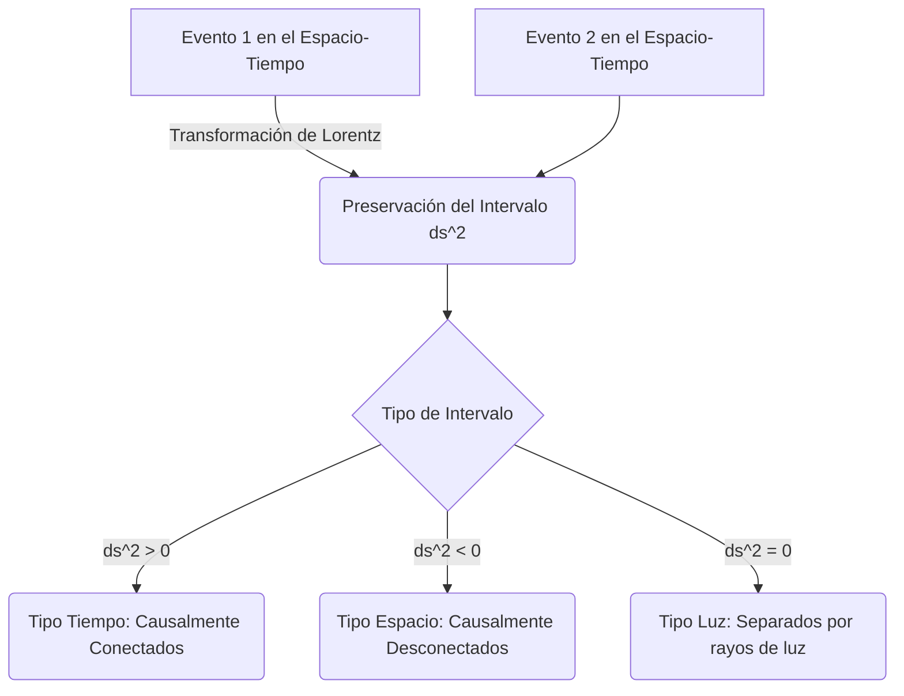

# Relatividad Especial

La Relatividad Especial es una teoría física publicada por Albert Einstein en 1905, que revolucionó nuestra comprensión del espacio, el tiempo y la energía, sustituyendo la mecánica newtoniana para objetos que se mueven a velocidades cercanas a la de la luz.

## 📜 Contexto Histórico

A finales del siglo XIX, las ecuaciones de Maxwell para el electromagnetismo predecían que la velocidad de la luz en el vacío es constante, independientemente del movimiento de la fuente. Esto contradecía la mecánica clásica de Newton y la relatividad de Galileo, donde las velocidades se sumaban linealmente. El experimento de Michelson-Morley (1887) falló en encontrar evidencia del "éter luminífero", el medio hipotético a través del cual se pensaba que viajaba la luz.

En 1905, Albert Einstein, en su artículo "Sobre la electrodinámica de los cuerpos en movimiento", resolvió este conflicto introduciendo dos postulados fundamentales: las leyes de la física son las mismas para todos los observadores en movimiento inercial uniforme, y la velocidad de la luz en el vacío es la misma para todos los observadores inerciales. Posteriormente, Hermann Minkowski (1908) formuló esta teoría geométricamente introduciendo el espacio-tiempo cuatridimensional, donde el espacio y el tiempo están entrelazados en una única estructura, el espacio-tiempo de Minkowski.

---

## 🧮 Desarrollo Teórico Profundo

La Relatividad Especial (RE) se fundamenta en los postulados de la constancia de la velocidad de la luz y el principio de relatividad. Para formalizar esta teoría, se requiere abandonar el concepto de tiempo absoluto newtoniano y adoptar el formalismo matemático del espacio-tiempo de Minkowski.

### 1. Transformaciones de Lorentz

Para dos sistemas de referencia inerciales $S$ y $S'$, donde $S'$ se mueve con velocidad constante $v$ a lo largo del eje $x$ respecto a $S$, las transformaciones de Galileo ($x' = x - vt, t' = t$) son inconsistentes con el segundo postulado de Einstein. Debemos encontrar transformaciones lineales que preserven la velocidad de la luz $c$.

Consideremos un pulso de luz emitido desde el origen $O$ (y $O'$) en $t = t' = 0$. La ecuación del frente de onda esférico en $S$ es:
$$ x^2 + y^2 + z^2 = c^2 t^2 $$
Y en el sistema $S'$ debe ser simultáneamente:
$$ (x')^2 + (y')^2 + (z')^2 = c^2 (t')^2 $$

Asumiendo linealidad y homogeneidad del espacio, y sabiendo que $y' = y$, $z' = z$, buscamos coeficientes $\gamma$ tales que:
$$ x' = \gamma (x - vt) $$
$$ x = \gamma (x' + vt') $$

Sustituyendo $x'$ en la segunda ecuación, obtenemos $t'$ en función de $x$ y $t$:
$$ x = \gamma (\gamma(x - vt) + vt') \implies vt' = \frac{x}{\gamma} - \gamma x + \gamma v t $$
$$ t' = \gamma \left( t - \frac{x}{v} \left(1 - \frac{1}{\gamma^2}\right) \right) $$

Para un rayo de luz moviéndose a lo largo del eje $x$, $x = ct$ y $x' = ct'$. Sustituyendo estas condiciones:
$$ ct' = \gamma (c - v) t $$
$$ t' = \gamma t \left( 1 - \frac{c}{v} \left(1 - \frac{1}{\gamma^2}\right) \right) $$

Igualando los factores de $t$ a la izquierda y derecha para el caso luminoso ($ct' = x'$):
$$ c \gamma \left( 1 - \frac{c}{v} \left(1 - \frac{1}{\gamma^2}\right) \right) = \gamma(c - v) $$
Resolviendo esta ecuación para $\gamma$, descubrimos que:
$$ 1 - \frac{c}{v} \left(1 - \frac{1}{\gamma^2}\right) = 1 - \frac{v}{c} $$
$$ \frac{c}{v} \left(1 - \frac{1}{\gamma^2}\right) = \frac{v}{c} \implies 1 - \frac{1}{\gamma^2} = \frac{v^2}{c^2} \implies \gamma = \frac{1}{\sqrt{1 - \frac{v^2}{c^2}}} $$

Esto define el **Factor de Lorentz** $\gamma$. Las ecuaciones completas de transformación de Lorentz son:
$$ x' = \gamma (x - vt) $$
$$ y' = y $$
$$ z' = z $$
$$ t' = \gamma \left(t - \frac{vx}{c^2}\right) $$

### 2. Espacio-Tiempo de Minkowski y Cuadrivectores

En RE, eventos físicos se representan en una variedad de cuatro dimensiones (una temporal, tres espaciales) conocida como **Espacio-Tiempo de Minkowski**. El vector de posición en este espacio se denomina *cuadrivector contravariante* de coordenadas:
$$ x^\mu = (x^0, x^1, x^2, x^3) = (ct, x, y, z) $$

Para que las leyes físicas sean invariantes bajo transformaciones de Lorentz, se expresan en términos tensoriales. La métrica del espacio de Minkowski $\eta_{\mu\nu}$ viene dada por la matriz diagonal (con firma $+---$):
$$ \eta_{\mu\nu} = \text{diag}(1, -1, -1, -1) $$

El intervalo espacio-temporal, o **elemento de línea**, se define rigurosamente usando la convención de suma de Einstein como:
$$ ds^2 = \eta_{\mu\nu} dx^\mu dx^\nu = c^2 dt^2 - dx^2 - dy^2 - dz^2 $$
Este escalar es un invariante de Lorentz, lo que significa que su valor es el mismo para cualquier observador inercial ($ds^2 = (ds')^2$).

### 3. Cinemática Relativista: Dilatación Temporal y Contracción de Longitudes

A partir de las transformaciones de Lorentz, derivamos directamente los fenómenos cinemáticos relativistas:

**Dilatación del Tiempo:** Consideremos un reloj en el origen de $S'$, marcando tiempos propios $\tau = t'$. Para este reloj, $x' = 0$ siempre. Desde $S$, medimos dos "tics" consecutivos. Sabemos que $t = \gamma(t' + \frac{vx'}{c^2})$. Como $\Delta x' = 0$:
$$ \Delta t = \gamma \Delta t' = \gamma \Delta \tau $$
Dado que $\gamma \ge 1$, $\Delta t \ge \Delta \tau$. El tiempo en $S$ transcurre más rápido, es decir, *los relojes en movimiento funcionan más lentamente*.

**Contracción de la Longitud:** Consideremos una varilla en reposo en $S'$, con extremos en $x'_1$ y $x'_2$. Su longitud propia es $L_0 = x'_2 - x'_1$. Desde el sistema $S$, queremos medir su longitud $L = x_2 - x_1$. Para que la medición sea válida, debe ser *simultánea* en $S$ ($\Delta t = 0$).
Usando $x' = \gamma(x - vt)$, evaluamos en los extremos:
$$ x'_2 - x'_1 = \gamma (x_2 - vt_2) - \gamma (x_1 - vt_1) $$
Como medimos simultáneamente en $S$ ($t_1 = t_2$):
$$ L_0 = \gamma (x_2 - x_1) = \gamma L \implies L = \frac{L_0}{\gamma} $$
Los objetos se acortan en la dirección del movimiento relativista respecto al observador inercial.

### 4. Cuadrimomento y Dinámica Relativista

El momento lineal clásico $\mathbf{p} = m\mathbf{v}$ no es un invariante ni se conserva bajo transformaciones de Lorentz. Para arreglar esto, definimos el **Cuadrimomento** $p^\mu$, multiplicando la masa invariante (o masa en reposo) $m_0$ por la cuadrivelocidad $u^\mu = \frac{dx^\mu}{d\tau}$:
$$ p^\mu = m_0 u^\mu = m_0 \frac{dx^\mu}{dt}\frac{dt}{d\tau} = m_0 \gamma (c, \mathbf{v}) = (\gamma m_0 c, \gamma m_0 \mathbf{v}) $$

La componente espacial es el momento relativista:
$$ \mathbf{p} = \gamma m_0 \mathbf{v} $$
La componente temporal está relacionada con la energía relativista total del objeto $E = \gamma m_0 c^2$. Por tanto:
$$ p^\mu = \left(\frac{E}{c}, \mathbf{p}\right) $$

Para encontrar la famosa relación invariante, evaluamos la norma escalar del cuadrimomento:
$$ p^\mu p_\mu = \eta_{\mu\nu} p^\mu p^\nu = \left(\frac{E}{c}\right)^2 - \mathbf{p}^2 $$
Al mismo tiempo, $p^\mu p_\mu = (m_0 c \gamma)^2 - (\gamma m_0 v)^2 = m_0^2 c^2 \gamma^2 \left(1 - \frac{v^2}{c^2}\right) = m_0^2 c^2$. Igualando ambas expresiones:
$$ \left(\frac{E}{c}\right)^2 - \mathbf{p}^2 = m_0^2 c^2 \implies E^2 = (\mathbf{p}c)^2 + (m_0 c^2)^2 $$

Esta es la relación de dispersión relativista, fundamental para entender las colisiones de alta energía y la física de partículas. Si un objeto está en reposo ($\mathbf{p} = 0$), se simplifica a la ecuación de equivalencia masa-energía de Einstein:
$$ E = m_0 c^2 $$
Y para fotones (masa invariante $m_0 = 0$), su energía está dada puramente por el momento $E = pc$.

---

## 🛠 Ejemplo Práctico

**Problema:** Un pión neutral ($\pi^0$) con una masa en reposo $m_{\pi} = 135 \text{ MeV}/c^2$ viaja a una velocidad $v = 0.99c$ en el sistema del laboratorio. El pión decae en dos fotones ($\pi^0 \rightarrow \gamma + \gamma$). Calcule la energía total del pión antes de decaer y el momento máximo posible que uno de los fotones puede tener en la dirección de vuelo.

**Solución paso a paso:**
1. Calculamos el factor de Lorentz $\gamma$:
   $$ \gamma = \frac{1}{\sqrt{1 - 0.99^2}} \approx \frac{1}{\sqrt{1 - 0.9801}} = \frac{1}{\sqrt{0.0199}} \approx 7.0888 $$
2. La energía total del pión $E_{\pi}$ usando la relación masa-energía:
   $$ E_{\pi} = \gamma m_{\pi} c^2 = 7.0888 \times 135 \text{ MeV} \approx 956.99 \text{ MeV} $$
3. El momento del pión $p_{\pi}$:
   $$ p_{\pi} = \gamma m_{\pi} v = 7.0888 \times 135 \text{ MeV}/c^2 \times 0.99c \approx 947.42 \text{ MeV}/c $$
4. En el decaimiento de dos cuerpos $\pi^0 \rightarrow \gamma + \gamma$, el momento máximo para un fotón en el sistema del laboratorio ocurre cuando se emite exactamente hacia adelante (colineal). Por la conservación del cuadrimomento, la energía y el momento del fotón hacia adelante ($E_1, p_1$) y el fotón hacia atrás ($E_2, p_2$) deben sumar los del pión:
   $$ E_{\pi} = E_1 + E_2 $$
   $$ p_{\pi} = p_1 - p_2 $$
   Dado que los fotones carecen de masa, $E_1 = p_1 c$ y $E_2 = p_2 c$.
   Sumando las dos primeras ecuaciones escaladas:
   $$ E_{\pi} + p_{\pi}c = E_1 + E_2 + E_1 - E_2 = 2E_1 = 2p_1 c $$
   Despejando $p_1$:
   $$ p_1 = \frac{E_{\pi} + p_{\pi}c}{2c} = \frac{956.99 \text{ MeV} + 947.42 \text{ MeV}}{2c} = \frac{1904.41}{2} \text{ MeV}/c \approx 952.2 \text{ MeV}/c $$
5. **Conclusión:** La energía del pión en vuelo es masivamente mayor que su masa en reposo, y el decaimiento transmite un impulso enorme en dirección frontal, ejemplificando el "boost" de Lorentz que se aprovecha en los aceleradores de partículas.

---

## 📚 Recursos Específicos

### 🎓 Cursos y Clases Recomendadas (5-7 Recomendados)
1. **[Stanford University: Special Relativity (Leonard Susskind)](https://theoreticalminimum.com/courses/special-relativity-and-electrodynamics/2012/spring)** - Clases magistrales profundas enfocadas en la derivación rigurosa de la métrica de Minkowski y el espacio-tiempo.
2. **[MIT OpenCourseWare: 8.20 Introduction to Special Relativity](https://ocw.mit.edu/courses/8-20-introduction-to-special-relativity-january-iap-2005/)** - Curso universitario completo del Independent Activities Period (IAP) con tareas, notas y exámenes.
3. **[Yale Courses: Fundamentals of Physics (Ramamurti Shankar)](https://oyc.yale.edu/physics/phys-200)** - Las últimas conferencias del curso brindan una de las introducciones más intuitivas a la cinemática relativista.
4. **[Coursera: Understanding Einstein: The Special Theory of Relativity](https://www.coursera.org/learn/einstein-relativity)** - Curso de Stanford enfocado en desmitificar los conceptos físicos y filosóficos subyacentes.
5. **[World Science U: Special Relativity (Brian Greene)](https://www.worldscienceu.com/courses/special-relativity-primer/)** - Módulos altamente interactivos llenos de animaciones visuales para comprender dilatación temporal y simultaneidad.
6. **[Khan Academy: Special Relativity](https://es.khanacademy.org/science/physics/special-relativity)** - Explicaciones sencillas paso a paso, ideales para quienes no tienen conocimientos profundos de cálculo.
7. **[Perimeter Institute: Special Relativity](https://perimeterinstitute.ca/training/perimeter-scholars-international/psi-lectures)** - Charlas para estudiantes de física teórica que buscan transitar hacia mecánica cuántica relativista.

### 📝 Artículos y Simulaciones Interesantes (8-10 Recomendados)
1. **Documento Original**: [On the Electrodynamics of Moving Bodies (1905)](http://www.fourmilab.ch/etexts/einstein/specrel/www/) - La traducción clásica al inglés del artículo de Einstein.
2. **Simulador**: [PhET Viaje Espacial Relativista](https://phet.colorado.edu/en/simulations/relativity) - Explora la dilatación del tiempo y la contracción de Lorentz interactivamente.
3. **Simulador**: [A Slower Speed of Light (MIT Game Lab)](http://gamelab.mit.edu/games/a-slower-speed-of-light/) - Juego que simula los efectos visuales de moverse cerca de la velocidad de la luz (efecto Doppler, aberración).
4. **Simulador**: [Test of Relativity (Visualizing Relativistic Effects)](https://a-way-to-go.com/) - Visualización de la deformación óptica a altas velocidades.
5. **Wikipedia**: [Minkowski Space](https://en.wikipedia.org/wiki/Minkowski_space) - Fundamental para entender los diagramas de espacio-tiempo y la causalidad mediante conos de luz.
6. **Scholarpedia**: [Special Relativity](http://www.scholarpedia.org/article/Special_relativity) - Revisión profunda revisada por pares sobre la estructura matemática de la teoría.
7. **Stanford Encyclopedia**: [Conventionality of Simultaneity](https://plato.stanford.edu/entries/spacetime-convensimul/) - Discusión filosófica sobre la sincronización de relojes de Poincaré-Einstein.
8. **MinutePhysics**: [Special Relativity Series (YouTube)](https://www.youtube.com/playlist?list=PL3z817C-p6788-bZ8s8C3lJ78vA1tK7_S) - Explicaciones animadas cortas que aclaran las famosas paradojas de la relatividad.
9. **FísicaLab**: [Postulados y Cinemática Relativista](https://www.fisicalab.com/tema/relatividad-especial) - Ejercicios resueltos y teoría para nivel bachillerato.
10. **HyperPhysics**: [Relativistic Energy and Momentum](http://hyperphysics.phy-astr.gsu.edu/hbase/relativ/releng.html) - Esquemas conceptuales sobre $E=mc^2$ y colisiones.

### 📖 Referencias Útiles y Bibliografía
1. **[Edwin F. Taylor & John Archibald Wheeler - Spacetime Physics](https://www.eftaylor.com/spacetimephysics/)** - Probablemente el mejor libro de introducción a la relatividad especial, famoso por su claridad pedagógica y uso de "fábulas" físicas.
2. **[A.P. French - Special Relativity (M.I.T. Introductory Physics Series)](https://archive.org/details/specialrelativit0000fren)** - Un clásico riguroso utilizado durante décadas para enseñar cinemática y dinámica relativista.
3. **[Wolfgang Rindler - Introduction to Special Relativity](https://global.oup.com/academic/product/introduction-to-special-relativity-9780198539520)** - Texto estándar y más formal, ideal para profundizar en cuadrivectores y tensores.
4. **[David J. Griffiths - Introduction to Electrodynamics](https://www.cambridge.org/highereducation/books/introduction-to-electrodynamics/40B7E0D3528A32A17EFB738C2ACAEFDE)** - El capítulo 12 es famoso por presentar cómo la relatividad especial unifica la electricidad y el magnetismo en el tensor electromagnético.
5. **[Robert Resnick - Introduction to Special Relativity](https://archive.org/details/introductiontosp0000resn)** - Una presentación clara que conecta con la física general y ofrece excelentes problemas de final de capítulo.
