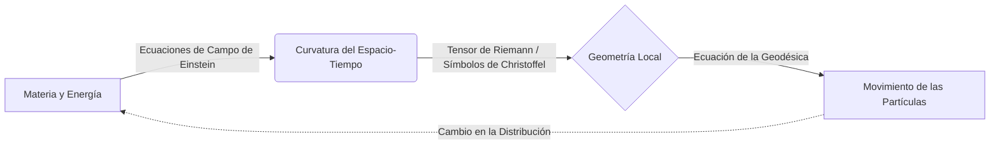

# Relatividad General

La Relatividad General es la teoría métrica de la gravitación publicada por Albert Einstein en 1915, que describe la gravedad no como una fuerza, sino como una curvatura del espacio-tiempo causada por la masa y la energía.

## 📜 Contexto Histórico

Tras formular la Relatividad Especial en 1905, Einstein se dio cuenta de que esta teoría no era compatible con la ley de la gravitación universal de Newton, la cual implicaba una acción a distancia instantánea, violando el límite de la velocidad de la luz. 

Durante una década de intensa investigación y colaboración matemática con Marcel Grossmann, Einstein formuló el **Principio de Equivalencia** (1907), que postula que la gravedad y la aceleración son localmente indistinguibles. Usando la geometría diferencial de Riemann, Einstein concluyó que la presencia de masa o energía curva el espacio-tiempo. En noviembre de 1915, presentó las Ecuaciones de Campo de Einstein a la Academia Prusiana de las Ciencias. La teoría fue confirmada dramáticamente en 1919 por Arthur Eddington durante un eclipse solar al medir la deflexión de la luz de las estrellas, consolidando la fama mundial de Einstein.

---

## 🧮 Desarrollo Teórico Profundo

La Relatividad General (RG) describe la gravitación no como una fuerza que se propaga en el espacio, sino como una propiedad geométrica del espacio y el tiempo combinados. El concepto fundamental es que la masa y la energía curvan el espacio-tiempo, y las partículas masivas y sin masa viajan por las trayectorias más rectas posibles (geodésicas) en esa geometría curva.

### 1. Geometría Diferencial y el Tensor Métrico

El formalismo matemático de la RG se asienta en la geometría de variedades (Riemannianas y pseudo-Riemannianas). El elemento central es el **Tensor Métrico** $g_{\mu\nu}$, un campo tensorial simétrico de rango 2 que generaliza el teorema de Pitágoras y permite medir distancias (intervalos espacio-temporales), tiempos, ángulos y volúmenes:

$$ ds^2 = g_{\mu\nu} dx^\mu dx^\nu $$

A partir del tensor métrico, podemos construir los **Símbolos de Christoffel** $\Gamma^\lambda_{\mu\nu}$, que no son tensores verdaderos pero describen cómo cambian los vectores de la base al moverse de un punto a otro en el espacio curvo (la conexión afín de Levi-Civita):

$$ \Gamma^\lambda_{\mu\nu} = \frac{1}{2} g^{\lambda\sigma} (\partial_\mu g_{\nu\sigma} + \partial_\nu g_{\sigma\mu} - \partial_\sigma g_{\mu\nu}) $$

### 2. Geodésicas: El Movimiento de la Materia

El principio de equivalencia implica que la gravedad es indistinguible de la aceleración. Por lo tanto, en ausencia de otras fuerzas no gravitatorias, una partícula en caída libre sigue la trayectoria más "recta" en el espacio-tiempo. Matemáticamente, esto se formula minimizando el intervalo a lo largo de la curva $\delta \int ds = 0$, lo que conduce a la **Ecuación de la Geodésica**:

$$ \frac{d^2x^\lambda}{d\tau^2} + \Gamma^\lambda_{\mu\nu} \frac{dx^\mu}{d\tau} \frac{dx^\nu}{d\tau} = 0 $$

Donde $\tau$ es un parámetro afín (típicamente el tiempo propio de la partícula masiva). Esta ecuación nos dice "cómo el espacio-tiempo curva la trayectoria de la materia".



### 3. El Tensor de Riemann y la Curvatura

Para cuantificar verdaderamente si el espacio-tiempo es curvo de forma independiente a la elección de coordenadas, debemos examinar el **Tensor de Curvatura de Riemann** $R^\rho_{\sigma\mu\nu}$. Este tensor mide la no-conmutatividad de las derivadas covariantes o, equivalentemente, cuánto difiere un vector de sí mismo tras ser transportado paralelamente a lo largo de un bucle infinitesimal:

$$ R^\rho_{\sigma\mu\nu} = \partial_\mu \Gamma^\rho_{\nu\sigma} - \partial_\nu \Gamma^\rho_{\mu\sigma} + \Gamma^\rho_{\mu\lambda}\Gamma^\lambda_{\nu\sigma} - \Gamma^\rho_{\nu\lambda}\Gamma^\lambda_{\mu\sigma} $$

El tensor de Riemann se puede contraer para obtener el **Tensor de Ricci** $R_{\mu\nu} = R^\lambda_{\mu\lambda\nu}$, y contrayéndolo una vez más usando el tensor métrico obtenemos la curvatura escalar o **Escalar de Ricci** $R = g^{\mu\nu} R_{\mu\nu}$.

### 4. Las Ecuaciones de Campo de Einstein

El objetivo máximo de Einstein era relacionar la geometría (representada por tensores formados a partir de $g_{\mu\nu}$ y sus derivadas) con la fuente de gravedad: el **Tensor de Energía-Impulso** $T_{\mu\nu}$, el cual describe la densidad de masa-energía, el momento y los esfuerzos en la materia.

Exigiendo que la divergencia covariante del lado geométrico sea cero (para asegurar la conservación local de la energía y el momento $\nabla_\mu T^{\mu\nu} = 0$), Einstein llegó a sus famosas ecuaciones:

$$ R_{\mu\nu} - \frac{1}{2} R g_{\mu\nu} + \Lambda g_{\mu\nu} = \frac{8\pi G}{c^4} T_{\mu\nu} $$

- $G$ es la Constante Gravitacional de Newton.
- $c$ es la velocidad de la luz.
- $\Lambda$ es la Constante Cosmológica, añadida originalmente para permitir un universo estático, y que hoy asociamos con la "Energía Oscura" que acelera la expansión del universo.

A este conjunto de 10 ecuaciones diferenciales parciales no lineales (debido a la simetría de los tensores involucrados) se les llama a menudo simplemente *la ecuación de Einstein*. 

### 5. La Solución de Schwarzschild

La primera solución analítica exacta de estas ecuaciones en el vacío ($T_{\mu\nu} = 0$, excepto en la singularidad central) fue encontrada por Karl Schwarzschild en 1916. Describe el campo gravitatorio alrededor de una masa esféricamente simétrica y estática (no rotatoria) sin carga:

$$ ds^2 = \left(1 - \frac{r_s}{r}\right) c^2 dt^2 - \left(1 - \frac{r_s}{r}\right)^{-1} dr^2 - r^2(d\theta^2 + \sin^2\theta d\phi^2) $$

Donde $r_s = \frac{2GM}{c^2}$ es el **Radio de Schwarzschild**.
- Cuando $r \rightarrow \infty$, la métrica se reduce a la métrica plana de Minkowski.
- Cuando $r = r_s$, el componente de tiempo se vuelve cero y el componente radial diverge: esto es el **Horizonte de Sucesos** del agujero negro.
- Cuando $r \rightarrow 0$, tenemos una singularidad gravitacional física donde las curvaturas (como el invariante de Kretschmann $R^{\mu\nu\rho\sigma}R_{\mu\nu\rho\sigma}$) divergen hasta el infinito.

---

## 🛠 Ejemplo Práctico

**Problema:** Un fotón es emitido radialmente hacia afuera desde la superficie de una estrella masiva de radio $R$ y masa $M$, hacia un observador lejano en el infinito. Utilizando la métrica de Schwarzschild, demuestre y calcule el **corrimiento al rojo gravitacional** (redshift) que sufrirá el fotón. Considere una estrella de neutrones donde $M = 1.4 M_\odot$ y $R = 10 \text{ km}$.

**Solución paso a paso:**
1. Consideremos el intervalo $ds^2$ en la superficie ($r=R$) y en el infinito ($r \rightarrow \infty$). Para relojes estacionarios en un campo gravitacional, $dr=d\theta=d\phi=0$, y el tiempo propio medido por un observador $\tau$ se relaciona con el tiempo coordinado $t$ mediante:
   $$ d\tau = \sqrt{g_{00}} dt = \sqrt{1 - \frac{r_s}{r}} dt $$
2. Si un emisor E en $r=R$ envía señales luminosas con un período de tiempo propio $\Delta \tau_E$, el intervalo de tiempo coordinado entre las emisiones es $\Delta t = \Delta \tau_E / \sqrt{1 - r_s/R}$.
3. Al viajar los fotones por la misma trayectoria radial, llegan a un observador receptor O en $r \rightarrow \infty$ con el mismo intervalo coordinado $\Delta t$. Sin embargo, para O, en el infinito $g_{00} \approx 1$, por lo tanto, el tiempo propio del observador es $\Delta \tau_O = \Delta t$.
4. Así, la relación de los tiempos propios, que son inversamente proporcionales a las frecuencias observadas ($\nu = 1/\Delta \tau$), es:
   $$ \frac{\nu_O}{\nu_E} = \frac{\Delta \tau_E}{\Delta \tau_O} = \frac{\sqrt{1 - r_s/R} \Delta t}{\Delta t} = \sqrt{1 - \frac{r_s}{R}} $$
   Sabiendo que el corrimiento al rojo $z$ se define como $1 + z = \frac{\lambda_O}{\lambda_E} = \frac{\nu_E}{\nu_O}$:
   $$ 1 + z = \frac{1}{\sqrt{1 - \frac{2GM}{Rc^2}}} $$
5. Evaluamos el radio de Schwarzschild para la estrella de neutrones:
   $$ M = 1.4 \times 1.989 \times 10^{30} \text{ kg} \approx 2.78 \times 10^{30} \text{ kg} $$
   $$ r_s = \frac{2 \times 6.674\times 10^{-11} \times 2.78 \times 10^{30}}{(3 \times 10^8)^2} = \frac{37.1 \times 10^{19}}{9 \times 10^{16}} \approx 4122 \text{ m} = 4.122 \text{ km} $$
6. Calculamos el redshift para la emisión desde $R=10 \text{ km}$:
   $$ z = \frac{1}{\sqrt{1 - \frac{4.122}{10}}} - 1 = \frac{1}{\sqrt{1 - 0.4122}} - 1 = \frac{1}{\sqrt{0.5878}} - 1 = \frac{1}{0.7667} - 1 \approx 1.304 - 1 = 0.304 $$
7. **Conclusión:** La luz escapando del inmenso pozo de potencial de una estrella de neutrones pierde energía (corrimiento gravitacional al rojo), incrementando su longitud de onda observada en un $\sim 30.4\%$.

---

## 📝 Guía de Ejercicios Resueltos

**Problema 1: Desviación de la luz en la métrica de Schwarzschild**
Calcule el ángulo de deflexión $\Delta \phi$ de un rayo de luz que pasa cerca de una estrella esféricamente simétrica de masa $M$ con un parámetro de impacto $b$.

**Solución paso a paso:**
1. **Ecuación de la órbita de fotones:**
   A partir de $ds^2=0$ y las cantidades conservadas (energía $E$ y momento angular $L$) en Schwarzschild, la ecuación de la trayectoria de un fotón con $u = 1/r$ es:
   $\frac{d^2u}{d\phi^2} + u = \frac{3GM}{c^2}u^2$.
2. **Aproximación perturbativa:**
   La solución de orden cero (espacio plano, sin masa) es una línea recta: $u_0 = \frac{\sin\phi}{b}$.
   Para encontrar la perturbación debida a $M$, asumimos $u = u_0 + u_1$ donde $u_1 \ll u_0$.
   Sustituyendo en la ED: $\frac{d^2u_1}{d\phi^2} + u_1 = \frac{3GM}{c^2} \frac{\sin^2\phi}{b^2} = \frac{3GM}{2bc^2}(1 - \cos 2\phi)$.
3. **Resolución de la ED:**
   Una solución particular es $u_1(\phi) = \frac{3GM}{2b^2 c^2} \left( 1 + \frac{1}{3} \cos 2\phi \right)$.
   Sabiendo que $\cos 2\phi = 1 - 2\sin^2\phi$, reescribimos: $u_1(\phi) = \frac{GM}{b^2 c^2} (1 + \cos^2\phi)$.
   Entonces, $u(\phi) \approx \frac{\sin\phi}{b} + \frac{GM}{b^2 c^2}(1 + \cos^2\phi)$.
4. **Cálculo de la deflexión:**
   El rayo viene desde el infinito $u=0$ en $\phi_1 \approx -\delta$ y escapa a $\phi_2 \approx \pi + \delta$.
   Para $\phi = \pi + \delta$: $\sin(\pi+\delta) = -\sin\delta \approx -\delta$, y $\cos^2(\pi+\delta) \approx 1$.
   $0 = -\frac{\delta}{b} + \frac{GM}{b^2 c^2}(1 + 1) \implies \delta = \frac{2GM}{bc^2}$.
   El ángulo de deflexión total es $\Delta \phi = 2\delta = \frac{4GM}{bc^2}$.

**Problema 2: Frecuencia orbital en ISCO (Innermost Stable Circular Orbit)**
Determine el radio de la órbita circular estable más interna (ISCO) para una partícula masiva en la geometría de Schwarzschild, y calcule su frecuencia orbital coordinada.

**Solución paso a paso:**
1. **Potencial efectivo:**
   Para una partícula masiva con momento angular específico $l = L/m$, el potencial efectivo radial es:
   $V_{eff}(r) = \left(1 - \frac{r_s}{r}\right)\left(1 + \frac{l^2}{r^2c^2}\right)$, donde $r_s = \frac{2GM}{c^2}$.
2. **Órbitas circulares:**
   Se requieren dos condiciones: $V_{eff}'(r) = 0$ (extremo del potencial) y $V_{eff}''(r) \ge 0$ (estabilidad).
   $V_{eff}'(r) = \frac{r_s}{r^2} - \frac{l^2}{r^3 c^2}\left(1 - \frac{3r_s}{2r}\right) = 0 \implies l^2 = \frac{r_s r^2 c^2}{2r - 3r_s}$.
3. **Condición marginal de estabilidad (ISCO):**
   $V_{eff}''(r) = 0$ en la transición.
   Sustituyendo $l^2$ en $V_{eff}''(r) = 0$, se obtiene la condición radial $r - 3r_s = 0 \implies r_{ISCO} = 3r_s = \frac{6GM}{c^2}$.
4. **Frecuencia orbital:**
   Por la ecuación geodésica o la tercera ley de Kepler relativista en Schwarzschild, la velocidad angular coordinada es $\Omega = \frac{d\phi}{dt} = \sqrt{\frac{GM}{r^3}}$.
   En el ISCO: $\Omega = \sqrt{\frac{GM}{(6GM/c^2)^3}} = \frac{c^3}{6\sqrt{6} G M}$.
   La frecuencia orbital coordinada es $f_{ISCO} = \frac{\Omega}{2\pi} = \frac{c^3}{12\pi \sqrt{6} G M}$.

**Problema 3: Avance del perihelio de Mercurio**
Usando la métrica de Schwarzschild, obtenga el ángulo aproximado de precesión del perihelio por órbita para un planeta.

**Solución paso a paso:**
1. Usamos la ecuación de órbita con perturbación relativista (en notación $u=1/r$):
   $u'' + u = \frac{GM}{h^2} + \frac{3GM}{c^2}u^2$, con momento angular $h$.
2. La órbita newtoniana es $u_0 = \frac{GM}{h^2}(1 + e \cos \phi)$, con excentricidad $e$.
3. Inyectamos $u_0$ en el término perturbativo $\frac{3GM}{c^2}u_0^2$.
   Nos interesa el término resonante $\propto \cos \phi$, que causará la precesión secular:
   $\frac{3GM}{c^2} \left[ \frac{G^2 M^2}{h^4} (1 + e \cos \phi)^2 \right] \approx \frac{6G^3 M^3 e}{c^2 h^4} \cos \phi$.
4. La ecuación para $u$ queda (ignorando términos constantes/armónicos de alta frecuencia):
   $u'' + u \approx \frac{GM}{h^2} + \alpha \cos \phi$, con $\alpha = \frac{6G^3 M^3 e}{c^2 h^4}$.
5. Una solución aproximada es $u(\phi) \approx u_0 + \frac{\alpha}{2} \phi \sin \phi = \frac{GM}{h^2} \left( 1 + e \cos \phi + \frac{3G^2 M^2 e}{c^2 h^2} \phi \sin \phi \right)$.
6. Para una perturbación pequeña, factorizamos $\cos(\phi - \delta\phi) \approx \cos\phi + \delta\phi \sin\phi$.
   Entonces, $\delta\phi = \frac{3G^2 M^2}{c^2 h^2} \phi$.
   Por cada órbita $\Delta\phi = 2\pi$, el avance del perihelio es $\Delta \omega = \frac{6\pi G^2 M^2}{c^2 h^2}$.
   Usando $h^2 = GMa(1-e^2)$, $\Delta \omega = \frac{6\pi GM}{c^2 a (1-e^2)}$.

## 💻 Simulaciones Computacionales

Esta simulación en Python integra la ecuación de la geodésica para mostrar la precesión del perihelio de un planeta alrededor de una masa central en la métrica de Schwarzschild (efecto relativista de la órbita de Mercurio).

```python
import numpy as np
import matplotlib.pyplot as plt
from scipy.integrate import odeint

# Unidades normalizadas: GM = 1, c = 1
def geodesic_derivs(state, phi, alpha):
    # u = 1/r, state = [u, du/dphi]
    u, u_prime = state
    # Ecuación de órbita con perturbación GR: u'' + u = M/h^2 + 3M u^2 / c^2
    # Normalizamos M/h^2 = 1 (órbita base)
    # alpha representa 3GM^2/(c^2 h^2), el término de precesión
    du_dphi = u_prime
    du_prime_dphi = 1 - u + alpha * u**2
    return [du_dphi, du_prime_dphi]

# Parámetro relativista (exagerado para visualización)
alpha = 0.05
# Condiciones iniciales: apoastro
u0 = 0.5   # 1 / r_max
u_prime0 = 0.0
state0 = [u0, u_prime0]

# Rango de ángulos (varias órbitas)
phi = np.linspace(0, 10 * np.pi, 2000)

# Integración
sol = odeint(geodesic_derivs, state0, phi, args=(alpha,))
u = sol[:, 0]
r = 1 / u

# Conversión a coordenadas cartesianas
x = r * np.cos(phi)
y = r * np.sin(phi)

plt.figure(figsize=(7, 7))
plt.plot(x, y, 'b-', lw=1, label=f'Órbita Relativista ($\\alpha={alpha}$)')
plt.plot(0, 0, 'ro', markersize=8, label='Masa Central (Agujero Negro / Estrella)')
plt.title('Precesión del Perihelio en Relatividad General')
plt.xlabel('x')
plt.ylabel('y')
plt.legend()
plt.axis('equal')
plt.grid(True)
plt.show()
```

## 🚀 Fronteras de Investigación y Problemas Abiertos

En 2026, la Relatividad General (RG) vive una edad de oro impulsada por la astronomía multimensajero y las ondas gravitacionales, aunque se enfrenta a tensiones teóricas fundamentales. El mayor desafío cosmológico sigue siendo la naturaleza de la Energía Oscura y la Materia Oscura. Alternativas a la RG pura, como las teorías $f(R)$, gravedad de Horndeski, o gravedad masiva, se contrastan rigurosamente mediante las precisas mediciones de ondas gravitacionales (LIGO/Virgo/KAGRA y el próximo LISA) buscando desviaciones en la velocidad de propagación tensorial o modos de polarización adicionales (escalar o vectorial). Otro enigma de gran relevancia es el problema de la Singularidad y la Gravedad Cuántica: cómo reconciliar los horizontes de sucesos y la resolución de las singularidades cosmológicas en el centro de los agujeros negros. El fondo estocástico de ondas gravitacionales, evidenciado recientemente por consorcios de pulsar timing arrays (PTAs como NANOGrav), abre una nueva ventana hacia la inflación cósmica primigenia, transiciones de fase de primer orden en el universo temprano, o la existencia de cuerdas cósmicas, todas regiones donde la RG debe ser extendida hacia teorías cuánticas efectivas.

## 📐 Formalismo Matemático Avanzado (Nivel Posgrado/Doctorado)

El tratamiento riguroso de la Relatividad General se formula en el lenguaje de la geometría diferencial de variedades pseudo-riemannianas. Sea $(\mathcal{M}, g)$ una variedad diferenciable de dimensión 4 equipada con una métrica lorentziana $g$ de signatura $(-,+,+,+)$. La conexión afín natural es la **conexión de Levi-Civita** $\nabla$, que es la única conexión libre de torsión ($\nabla_X Y - \nabla_Y X = [X,Y]$) y métrica-compatible ($\nabla g = 0$).

La curvatura de la variedad está completamente descrita por el tensor de Riemann $R^\rho_{\ \sigma\mu\nu}$, definido por el conmutador de derivadas covariantes aplicadas a un campo vectorial $V^\rho$:
$$ [\nabla_\mu, \nabla_\nu] V^\rho = R^\rho_{\ \sigma\mu\nu} V^\sigma $$

La dinámica del espacio-tiempo está dictada por las Ecuaciones de Campo de Einstein, las cuales pueden derivarse variacionalmente del principio de mínima acción utilizando la **Acción de Einstein-Hilbert**, incluyendo un término cosmológico $\Lambda$ y la acción de la materia $\mathcal{S}_M$:
$$ \mathcal{S} = \frac{1}{16\pi G} \int_\mathcal{M} (R - 2\Lambda) \sqrt{-g} \, d^4x + \mathcal{S}_M $$

Al realizar la variación de la acción con respecto a la métrica inversa $g^{\mu\nu}$, $\delta\mathcal{S} / \delta g^{\mu\nu} = 0$, obtenemos las ecuaciones de campo completas:
$$ G_{\mu\nu} + \Lambda g_{\mu\nu} = 8\pi G T_{\mu\nu} $$
donde $G_{\mu\nu} \equiv R_{\mu\nu} - \frac{1}{2}R g_{\mu\nu}$ es el tensor de Einstein (que satisface la identidad contraída de Bianchi $\nabla^\mu G_{\mu\nu} = 0$, asegurando la conservación local de energía e impulso $\nabla^\mu T_{\mu\nu} = 0$), $R_{\mu\nu}$ es el tensor de Ricci y $R$ es el escalar de Ricci.

Para estudiar fermiones en RG, el formalismo requiere la introducción de **tétradas (o vielbeins)** $e^a_\mu$ que relacionan la métrica del espacio-tiempo con la métrica plana local $\eta_{ab}$: $g_{\mu\nu} = e^a_\mu e^b_\nu \eta_{ab}$. Esto nos permite levantar la estructura al fibrado ortonormal e introducir la conexión de espín $\omega_{\mu}^{ab}$, definiendo así la derivada covariante espinorial $\mathcal{D}_\mu = \partial_\mu + \frac{1}{8} \omega_{\mu ab}[\gamma^a, \gamma^b]$ necesaria para acoplar espinores a la gravedad.

## 📚 Recursos Específicos

### 🎓 Cursos y Clases Recomendadas
1. **[Stanford University: General Relativity (Leonard Susskind)](https://theoreticalminimum.com/courses/general-relativity/2012/fall)** - Un excelente punto de partida que introduce tensores y geometría de Riemann paso a paso para estudiantes sin formación matemática avanzada previa.
2. **[MIT OpenCourseWare: 8.962 General Relativity (Scott Hughes)](https://ocw.mit.edu/courses/8-962-general-relativity-spring-2020/)** - Curso de nivel de posgrado extremadamente completo. Aborda derivaciones complejas del tensor de curvatura de Riemann, la solución de Schwarzschild y la emisión de ondas gravitacionales.
3. **[Perimeter Institute: General Relativity (PSI Lectures)](https://pirsa.org/)** - Diversas clases magistrales de nivel avanzado centradas en estructuras causales, el diagrama de Penrose-Carter, horizontes de sucesos y agujeros negros rotatorios (solución de Kerr).
4. **[NPTEL: General Theory of Relativity](https://nptel.ac.in/courses/115/106/115106059/)** - Un curso profundo en matemáticas, cubriendo derivadas covariantes, la conexión afín y el formalismo de tetradas.

### 📝 Artículos Científicos Históricos y Avanzados

1. **Die Grundlage der allgemeinen Relativitätstheorie (Los fundamentos de la Teoría de la Relatividad General)**  
   *Albert Einstein (1916)*. [Annalen der Physik, 354(7), 769-822](https://onlinelibrary.wiley.com/doi/10.1002/andp.19163540702).  
   **Importancia Teórica:** La presentación maestra, estructurada y completa de la Relatividad General tras años de intentos fallidos ("el argumento del agujero"). Eleva el Principio de Equivalencia a una formulación geométrica covariante.  
   **Fondo Matemático:** Introduce las Ecuaciones de Campo de Einstein que acoplan la geometría del espacio-tiempo con el contenido de energía-impulso (materia):
   $$ R_{\mu\nu} - \frac{1}{2}Rg_{\mu\nu} = \frac{8\pi G}{c^4}T_{\mu\nu} $$
   **Implicaciones Físicas:** Define la gravedad como curvatura y no como fuerza newtoniana; logra derivar analíticamente la precesión anómala del perihelio de Mercurio y predice la deflexión de la luz, ambos confirmados observacionalmente.

2. **Über das Gravitationsfeld eines Massenpunktes nach der Einsteinschen Theorie (Sobre el campo gravitacional de una masa puntual según la teoría de Einstein)**  
   *Karl Schwarzschild (1916)*. [Sitzungsberichte der Königlich Preussischen Akademie der Wissenschaften, 189-196](https://arxiv.org/abs/physics/9905030). *(Traducción al inglés en arXiv)*.  
   **Importancia Teórica:** Publicado pocas semanas después del artículo de Einstein (y poco antes de la muerte de Schwarzschild en la Primera Guerra Mundial), representa la primera solución exacta no trivial a las Ecuaciones de Einstein en el vacío ($T_{\mu\nu}=0$).  
   **Fondo Matemático:** Deriva la métrica esféricamente simétrica y estática para una masa puntual $M$, revelando el "radio de Schwarzschild" $r_s = 2GM/c^2$:
   $$ ds^2 = \left(1 - \frac{r_s}{r}\right) c^2 dt^2 - \left(1 - \frac{r_s}{r}\right)^{-1} dr^2 - r^2 d\Omega^2 $$
   **Implicaciones Físicas:** Introduce matemáticamente el concepto de singularidad gravitacional y horizonte de sucesos, sentando las bases teóricas de la física de los agujeros negros, mucho antes de que se entendiera su posibilidad física.

3. **Observation of Gravitational Waves from a Binary Black Hole Merger (GW150914)**  
   *B. P. Abbott et al. (LIGO Scientific Collaboration) (2016)*. [Physical Review Letters, 116(6), 061102](https://journals.aps.org/prl/abstract/10.1103/PhysRevLett.116.061102).  
   **Importancia Teórica:** La primera observación directa de ondas gravitacionales, cien años después de su predicción por Einstein en la aproximación de campo débil de RG.  
   **Fondo Matemático:** Las ondas se comportan como perturbaciones espaciales $h_{\mu\nu}$ sobre una métrica de fondo plana $\eta_{\mu\nu}$ que satisfacen una ecuación de onda linealizada $\Box \bar{h}_{\mu\nu} = 0$ (en el calibre armónico en el vacío). La señal "chirp" coincide milimétricamente con las simulaciones de Relatividad Numérica de la fusión orbital completa y "ringdown" de dos agujeros negros masivos.  
   **Implicaciones Físicas:** Confirma de forma concluyente la existencia de agujeros negros estelares binarios, la radiación gravitacional transportando energía según la fórmula del cuadrupolo, e inicia la era de la astronomía multi-mensajero.

### 📖 Referencias Útiles y Bibliografía
1. **Sean M. Carroll - [Spacetime and Geometry: An Introduction to General Relativity (Cambridge, 2019)](https://www.cambridge.org/highereducation/books/spacetime-and-geometry/1F2F2D1F6E20700B025C6BE60037BD62)** - El equilibrio perfecto entre accesibilidad intuitiva y rigor matemático de alto nivel, ideal para cursos modernos de posgrado o pregrado avanzado.
2. **Bernard F. Schutz - [A First Course in General Relativity (Cambridge, 2009)](https://www.cambridge.org/highereducation/books/a-first-course-in-general-relativity/94B2E0D6528A32A17EFB738C2ACAEFDE)** - La recomendación más sólida para el primer acercamiento matemático; es sumamente cuidadoso en la enseñanza del cálculo tensorial.
3. **Charles W. Misner, Kip S. Thorne, John Archibald Wheeler - [Gravitation (Princeton University Press, 1973)](https://press.princeton.edu/books/hardcover/9780691177793/gravitation)** - Conocida coloquialmente como "MTW" (o "el ladrillo"). Un clásico monumental, enciclopédico y muy geométrico (usando formas diferenciales) que no ha perdido vigencia en su poder conceptual.
