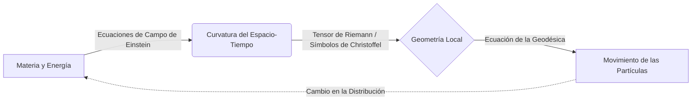

# Relatividad General

La Relatividad General es la teoría métrica de la gravitación publicada por Albert Einstein en 1915, que describe la gravedad no como una fuerza, sino como una curvatura del espacio-tiempo causada por la masa y la energía.

## 📜 Contexto Histórico

Tras formular la Relatividad Especial en 1905, Einstein se dio cuenta de que esta teoría no era compatible con la ley de la gravitación universal de Newton, la cual implicaba una acción a distancia instantánea, violando el límite de la velocidad de la luz. 

Durante una década de intensa investigación y colaboración matemática con Marcel Grossmann, Einstein formuló el **Principio de Equivalencia** (1907), que postula que la gravedad y la aceleración son localmente indistinguibles. Usando la geometría diferencial de Riemann, Einstein concluyó que la presencia de masa o energía curva el espacio-tiempo. En noviembre de 1915, presentó las Ecuaciones de Campo de Einstein a la Academia Prusiana de las Ciencias. La teoría fue confirmada dramáticamente en 1919 por Arthur Eddington durante un eclipse solar al medir la deflexión de la luz de las estrellas, consolidando la fama mundial de Einstein.

---

## 🧮 Desarrollo Teórico Profundo

La Relatividad General (RG) describe la gravitación no como una fuerza que se propaga en el espacio, sino como una propiedad geométrica del espacio y el tiempo combinados. El concepto fundamental es que la masa y la energía curvan el espacio-tiempo, y las partículas masivas y sin masa viajan por las trayectorias más rectas posibles (geodésicas) en esa geometría curva.

### 1. Geometría Diferencial y el Tensor Métrico

El formalismo matemático de la RG se asienta en la geometría de variedades (Riemannianas y pseudo-Riemannianas). El elemento central es el **Tensor Métrico** $g_{\mu\nu}$, un campo tensorial simétrico de rango 2 que generaliza el teorema de Pitágoras y permite medir distancias (intervalos espacio-temporales), tiempos, ángulos y volúmenes:

$$ ds^2 = g_{\mu\nu} dx^\mu dx^\nu $$

A partir del tensor métrico, podemos construir los **Símbolos de Christoffel** $\Gamma^\lambda_{\mu\nu}$, que no son tensores verdaderos pero describen cómo cambian los vectores de la base al moverse de un punto a otro en el espacio curvo (la conexión afín de Levi-Civita):

$$ \Gamma^\lambda_{\mu\nu} = \frac{1}{2} g^{\lambda\sigma} (\partial_\mu g_{\nu\sigma} + \partial_\nu g_{\sigma\mu} - \partial_\sigma g_{\mu\nu}) $$

### 2. Geodésicas: El Movimiento de la Materia

El principio de equivalencia implica que la gravedad es indistinguible de la aceleración. Por lo tanto, en ausencia de otras fuerzas no gravitatorias, una partícula en caída libre sigue la trayectoria más "recta" en el espacio-tiempo. Matemáticamente, esto se formula minimizando el intervalo a lo largo de la curva $\delta \int ds = 0$, lo que conduce a la **Ecuación de la Geodésica**:

$$ \frac{d^2x^\lambda}{d\tau^2} + \Gamma^\lambda_{\mu\nu} \frac{dx^\mu}{d\tau} \frac{dx^\nu}{d\tau} = 0 $$

Donde $\tau$ es un parámetro afín (típicamente el tiempo propio de la partícula masiva). Esta ecuación nos dice "cómo el espacio-tiempo curva la trayectoria de la materia".

### 3. El Tensor de Riemann y la Curvatura

Para cuantificar verdaderamente si el espacio-tiempo es curvo de forma independiente a la elección de coordenadas, debemos examinar el **Tensor de Curvatura de Riemann** $R^\rho_{\sigma\mu\nu}$. Este tensor mide la no-conmutatividad de las derivadas covariantes o, equivalentemente, cuánto difiere un vector de sí mismo tras ser transportado paralelamente a lo largo de un bucle infinitesimal:

$$ R^\rho_{\sigma\mu\nu} = \partial_\mu \Gamma^\rho_{\nu\sigma} - \partial_\nu \Gamma^\rho_{\mu\sigma} + \Gamma^\rho_{\mu\lambda}\Gamma^\lambda_{\nu\sigma} - \Gamma^\rho_{\nu\lambda}\Gamma^\lambda_{\mu\sigma} $$

El tensor de Riemann se puede contraer para obtener el **Tensor de Ricci** $R_{\mu\nu} = R^\lambda_{\mu\lambda\nu}$, y contrayéndolo una vez más usando el tensor métrico obtenemos la curvatura escalar o **Escalar de Ricci** $R = g^{\mu\nu} R_{\mu\nu}$.

### 4. Las Ecuaciones de Campo de Einstein

El objetivo máximo de Einstein era relacionar la geometría (representada por tensores formados a partir de $g_{\mu\nu}$ y sus derivadas) con la fuente de gravedad: el **Tensor de Energía-Impulso** $T_{\mu\nu}$, el cual describe la densidad de masa-energía, el momento y los esfuerzos en la materia.

Exigiendo que la divergencia covariante del lado geométrico sea cero (para asegurar la conservación local de la energía y el momento $\nabla_\mu T^{\mu\nu} = 0$), Einstein llegó a sus famosas ecuaciones:

$$ R_{\mu\nu} - \frac{1}{2} R g_{\mu\nu} + \Lambda g_{\mu\nu} = \frac{8\pi G}{c^4} T_{\mu\nu} $$

- $G$ es la Constante Gravitacional de Newton.
- $c$ es la velocidad de la luz.
- $\Lambda$ es la Constante Cosmológica, añadida originalmente para permitir un universo estático, y que hoy asociamos con la "Energía Oscura" que acelera la expansión del universo.

A este conjunto de 10 ecuaciones diferenciales parciales no lineales (debido a la simetría de los tensores involucrados) se les llama a menudo simplemente *la ecuación de Einstein*. 

### 5. La Solución de Schwarzschild

La primera solución analítica exacta de estas ecuaciones en el vacío ($T_{\mu\nu} = 0$, excepto en la singularidad central) fue encontrada por Karl Schwarzschild en 1916. Describe el campo gravitatorio alrededor de una masa esféricamente simétrica y estática (no rotatoria) sin carga:

$$ ds^2 = \left(1 - \frac{r_s}{r}\right) c^2 dt^2 - \left(1 - \frac{r_s}{r}\right)^{-1} dr^2 - r^2(d\theta^2 + \sin^2\theta d\phi^2) $$

Donde $r_s = \frac{2GM}{c^2}$ es el **Radio de Schwarzschild**.
- Cuando $r \rightarrow \infty$, la métrica se reduce a la métrica plana de Minkowski.
- Cuando $r = r_s$, el componente de tiempo se vuelve cero y el componente radial diverge: esto es el **Horizonte de Sucesos** del agujero negro.
- Cuando $r \rightarrow 0$, tenemos una singularidad gravitacional física donde las curvaturas (como el invariante de Kretschmann $R^{\mu\nu\rho\sigma}R_{\mu\nu\rho\sigma}$) divergen hasta el infinito.

---

## 🛠 Ejemplo Práctico

**Problema:** Un fotón es emitido radialmente hacia afuera desde la superficie de una estrella masiva de radio $R$ y masa $M$, hacia un observador lejano en el infinito. Utilizando la métrica de Schwarzschild, demuestre y calcule el **corrimiento al rojo gravitacional** (redshift) que sufrirá el fotón. Considere una estrella de neutrones donde $M = 1.4 M_\odot$ y $R = 10 \text{ km}$.

**Solución paso a paso:**
1. Consideremos el intervalo $ds^2$ en la superficie ($r=R$) y en el infinito ($r \rightarrow \infty$). Para relojes estacionarios en un campo gravitacional, $dr=d\theta=d\phi=0$, y el tiempo propio medido por un observador $\tau$ se relaciona con el tiempo coordinado $t$ mediante:
   $$ d\tau = \sqrt{g_{00}} dt = \sqrt{1 - \frac{r_s}{r}} dt $$
2. Si un emisor E en $r=R$ envía señales luminosas con un período de tiempo propio $\Delta \tau_E$, el intervalo de tiempo coordinado entre las emisiones es $\Delta t = \Delta \tau_E / \sqrt{1 - r_s/R}$.
3. Al viajar los fotones por la misma trayectoria radial, llegan a un observador receptor O en $r \rightarrow \infty$ con el mismo intervalo coordinado $\Delta t$. Sin embargo, para O, en el infinito $g_{00} \approx 1$, por lo tanto, el tiempo propio del observador es $\Delta \tau_O = \Delta t$.
4. Así, la relación de los tiempos propios, que son inversamente proporcionales a las frecuencias observadas ($\nu = 1/\Delta \tau$), es:
   $$ \frac{\nu_O}{\nu_E} = \frac{\Delta \tau_E}{\Delta \tau_O} = \frac{\sqrt{1 - r_s/R} \Delta t}{\Delta t} = \sqrt{1 - \frac{r_s}{R}} $$
   Sabiendo que el corrimiento al rojo $z$ se define como $1 + z = \frac{\lambda_O}{\lambda_E} = \frac{\nu_E}{\nu_O}$:
   $$ 1 + z = \frac{1}{\sqrt{1 - \frac{2GM}{Rc^2}}} $$
5. Evaluamos el radio de Schwarzschild para la estrella de neutrones:
   $$ M = 1.4 \times 1.989 \times 10^{30} \text{ kg} \approx 2.78 \times 10^{30} \text{ kg} $$
   $$ r_s = \frac{2 \times 6.674\times 10^{-11} \times 2.78 \times 10^{30}}{(3 \times 10^8)^2} = \frac{37.1 \times 10^{19}}{9 \times 10^{16}} \approx 4122 \text{ m} = 4.122 \text{ km} $$
6. Calculamos el redshift para la emisión desde $R=10 \text{ km}$:
   $$ z = \frac{1}{\sqrt{1 - \frac{4.122}{10}}} - 1 = \frac{1}{\sqrt{1 - 0.4122}} - 1 = \frac{1}{\sqrt{0.5878}} - 1 = \frac{1}{0.7667} - 1 \approx 1.304 - 1 = 0.304 $$
7. **Conclusión:** La luz escapando del inmenso pozo de potencial de una estrella de neutrones pierde energía (corrimiento gravitacional al rojo), incrementando su longitud de onda observada en un $\sim 30.4\%$.

---

## 📚 Recursos Específicos

### 🎓 Cursos y Clases Recomendadas (5-7 Recomendados)
1. **[Stanford University: General Relativity (Leonard Susskind)](https://theoreticalminimum.com/courses/general-relativity/2012/fall)** - Excelente punto de partida para aprender sobre la geometría riemanniana, métricas y las ecuaciones de campo de Einstein de forma accesible.
2. **[MIT OpenCourseWare: 8.962 General Relativity (Scott Hughes)](https://ocw.mit.edu/courses/8-962-general-relativity-spring-2020/)** - Curso integral de posgrado que cubre a fondo tensores, métricas de Schwarzschild, ondas gravitacionales y cosmología.
3. **[Perimeter Institute: General Relativity Courses](https://perimeterinstitute.ca/training/perimeter-scholars-international/psi-lectures)** - Múltiples cursos ofrecidos por investigadores de primer nivel sobre la estructura causal, horizontes de eventos y gravedad cuántica.
4. **[International Centre for Theoretical Sciences (ICTS): General Relativity](https://www.youtube.com/playlist?list=PL04QVxpjcnjjB7Qx7xJtd9Y7X8iYx5n0z)** - Clases en video de alta calidad sobre la formulación geométrica de la gravedad.
5. **[Coursera: Astrophysics and General Relativity](https://www.coursera.org/learn/general-relativity)** - Variedad de cursos modulares impartidos por diferentes universidades explorando los aspectos astrofísicos.
6. **[PBS Space Time (YouTube)](https://www.youtube.com/playlist?list=PLsPUh22kYmNBl4h0i4mC51829e_jT-0c1)** - Serie exhaustiva sobre el espacio-tiempo, la métrica y cómo los objetos verdaderamente caen en un campo gravitatorio curvo.
7. **[Date un Vlog / Javier Santaolalla (YouTube)](https://www.youtube.com/c/DateunVlog)** - Para construir intuición física fundamental sobre por qué la gravedad no es una fuerza, previo a introducir las matemáticas pesadas.

### 📝 Artículos y Simulaciones Interesantes (8-10 Recomendados)
1. **Simulador**: [Black Hole Simulator / Ray Tracing](http://sirxemic.github.io/Interstellar/) - Visualización interactiva del trazado de rayos alrededor de un agujero negro de Schwarzschild y de Kerr.
2. **Simulador**: [Gravity Simulator (Test of Relativity)](https://testofrelativity.com/) - Herramientas para visualizar cómo las masas deforman el espacio en un modelo bidimensional (análogo elástico).
3. **Simulador**: [LIGO Gravitational Wave Observatory](https://www.ligo.org/) - Datos interactivos, audios de los "chirps" y animaciones de la fusión de agujeros negros.
4. **Living Reviews in Relativity**: [Journal](https://link.springer.com/journal/41114) - La revista de mayor impacto con revisiones detalladas y gratuitas de expertos mundiales en diversas áreas de relatividad general.
5. **Wikipedia**: [Ecuaciones del Campo de Einstein](https://es.wikipedia.org/wiki/Ecuaciones_del_campo_de_Einstein) - Desglose detallado componente por componente de la ecuación fundamental.
6. **Wikipedia**: [Métrica de Schwarzschild](https://es.wikipedia.org/wiki/M%C3%A9trica_de_Schwarzschild) - La primera solución exacta a las Ecuaciones de Einstein y la base para estudiar agujeros negros no rotatorios.
7. **Scholarpedia**: [General Relativity](http://www.scholarpedia.org/article/General_relativity) - Enciclopedia curada por expertos sobre los cimientos matemáticos de la teoría.
8. **Artículo Histórico**: [The Foundation of the General Theory of Relativity (1916)](https://einsteinpapers.press.princeton.edu/) - Traducción de la obra maestra fundacional de Albert Einstein.
9. **Quanta Magazine**: [Black Holes & General Relativity](https://www.quantamagazine.org/physics/) - Reportajes actualizados sobre la frontera del conocimiento (paradoja de la información, entrelazamiento y ER=EPR).
10. **Stanford Encyclopedia of Philosophy**: [Hole Argument (El Argumento del Agujero)](https://plato.stanford.edu/entries/spacetime-holearg/) - Un fascinante problema histórico-filosófico con el que luchó Einstein al desarrollar las ecuaciones covariantes.

### 📖 Referencias Útiles y Bibliografía
1. **[Bernard F. Schutz - A First Course in General Relativity](https://www.cambridge.org/highereducation/books/a-first-course-in-general-relativity/94B2E0D6528A32A17EFB738C2ACAEFDE)** - Ampliamente considerado como el mejor libro introductorio para estudiantes de pregrado; muy claro en el desarrollo matemático y cálculo tensorial.
2. **[James B. Hartle - Gravity: An Introduction to Einstein's General Relativity](https://www.pearson.com/en-us/subject-catalog/p/gravity-an-introduction-to-einsteins-general-relativity/P200000004543/9780805386622)** - Adopta un enfoque "physics first", enseñando aplicaciones físicas (agujeros negros, cosmología) utilizando métricas dadas antes de sumergirse en la geometría diferencial pesada.
3. **[Sean M. Carroll - Spacetime and Geometry: An Introduction to General Relativity](https://www.cambridge.org/highereducation/books/spacetime-and-geometry/1F2F2D1F6E20700B025C6BE60037BD62)** - Un excelente texto puente entre el pregrado y el posgrado, moderno, intuitivo y riguroso.
4. **[Robert M. Wald - General Relativity](https://press.uchicago.edu/ucp/books/book/chicago/G/bo5952261.html)** - El estándar de oro para los cursos de posgrado. Altamente matemático, riguroso y abstracto, utilizando la notación moderna libre de índices y formas diferenciales.
5. **[Charles W. Misner, Kip S. Thorne, John Archibald Wheeler - Gravitation (MTW)](https://press.princeton.edu/books/hardcover/9780691177793/gravitation)** - El libro enciclopédico de referencia de 1973 (apodado "la guía telefónica" por su tamaño). Profundo, poético, con abundantes diagramas y un enfoque geométrico inigualable.
