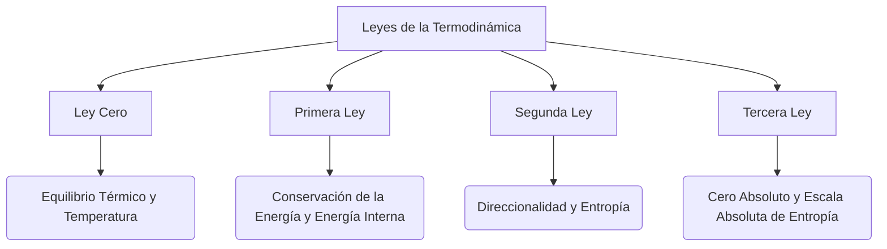

# Leyes de la Termodinámica

La termodinámica clásica estudia las transferencias de calor, la realización de trabajo y las propiedades macroscópicas de los sistemas en equilibrio. Todo el marco teórico descansa sobre cuatro postulados fundamentales empíricamente validados, conocidos como las Leyes de la Termodinámica.

## 📜 Contexto Histórico
El desarrollo de la termodinámica fue fuertemente motivado por la Revolución Industrial y la necesidad de mejorar la eficiencia de las máquinas de vapor. En 1824, Nicolas Léonard Sadi Carnot publicó un tratado sobre el calor, sentando las bases teóricas de la eficiencia térmica. Julius Robert von Mayer y James Prescott Joule, en la década de 1840, demostraron experimentalmente la equivalencia entre el calor y el trabajo mecánico. Lord Kelvin (William Thomson) y Rudolf Clausius formularon luego las primeras y segundas leyes de la termodinámica en la década de 1850, y Clausius acuñó el término "entropía" en 1865. Finalmente, Walther Nernst propuso la tercera ley a principios del siglo XX.

---

## 🧮 Desarrollo Teórico Profundo

La termodinámica clásica, desde una perspectiva axiomática, se construye rigurosamente sobre cuatro leyes empíricas. Estas leyes gobiernan las relaciones entre la energía, el calor, el trabajo, la temperatura y la entropía de los sistemas macroscópicos. A continuación, desarrollamos detalladamente el formalismo matemático de estas leyes y sus consecuencias directas.

### 1. Ley Cero de la Termodinámica: Equilibrio Térmico y Temperatura

La Ley Cero postula la existencia de una relación de equivalencia entre sistemas termodinámicos. 

**Definición (Equilibrio Térmico):** Dos sistemas se encuentran en equilibrio térmico si, al estar conectados por una pared diatérmana, no hay flujo neto de calor entre ellos y sus variables de estado permanecen constantes en el tiempo.

**Enunciado formal:** *Si un sistema $A$ está en equilibrio térmico con un sistema $C$, y un sistema $B$ está también en equilibrio térmico con $C$, entonces $A$ y $B$ están en equilibrio térmico entre sí.*

Esta transitividad permite definir una clase de equivalencia. Todos los sistemas en equilibrio térmico mutuo comparten una propiedad intrínseca, que llamamos **temperatura** empírica $\theta$. Matemáticamente, el estado de un sistema viene descrito por ciertas variables (por ejemplo, presión $P$ y volumen $V$). La condición de equilibrio entre los sistemas $A$ y $C$ implica una restricción funcional:
$$ F_1(P_A, V_A, P_C, V_C) = 0 $$
Que puede reescribirse como $\theta_A(P_A, V_A) = \theta_C(P_C, V_C)$. Así, la Ley Cero fundamenta la termometría, garantizando que un termómetro (el sistema $C$) puede utilizarse para comparar empíricamente la temperatura de otros sistemas.

### 2. Primera Ley de la Termodinámica: Conservación de Energía y Variables Conjugadas

La Primera Ley es una generalización del principio de conservación de la energía, incorporando el concepto de calor como una forma de transferencia de energía.

**Enunciado formal:** *Para cualquier sistema termodinámico aislado, la energía total se mantiene constante. En sistemas cerrados, la variación de la energía interna $U$ durante un proceso es igual a la suma de las transferencias de energía térmica (calor $Q$) y mecánica o no mecánica (trabajo $W$).*

En términos diferenciales, para una transformación infinitesimal, se tiene:
$$ dU = \delta Q + \delta W $$
Aquí, usamos la notación clásica donde $dU$ es una diferencial exacta (dado que $U$ es una función de estado), mientras que $\delta Q$ y $\delta W$ son diferenciales inexactas (dependen de la trayectoria del proceso en el espacio de fases). 

**Nota de convención de signos:** Adoptamos la convención moderna de la IUPAC donde $\delta Q$ es el calor absorbido *por* el sistema y $\delta W$ es el trabajo realizado *sobre* el sistema. (En muchos textos tradicionales se usa $dU = \delta Q - \delta W$ para trabajo realizado *por* el sistema).

#### Trabajo Reversible y Fuerzas Generalizadas
Para un proceso reversible, el trabajo $\delta W$ puede expresarse como el producto de una variable intensiva (fuerza generalizada $Y_i$) y el cambio en su variable extensiva conjugada $dX_i$:
$$ \delta W_{\text{rev}} = \sum_i Y_i \, dX_i $$
Para un sistema P-V simple (gas fluido), la fuerza es $-P$ (presión) y el desplazamiento es $dV$ (volumen), por lo que:
$$ \delta W_{\text{rev}} = -P \, dV $$
Si consideramos trabajo químico (potencial químico $\mu$, número de partículas $N$) y trabajo magnético (campo $B$, magnetización $M$), la Primera Ley para un proceso reversible se expande a:
$$ dU = \delta Q_{\text{rev}} - P \, dV + \sum_j \mu_j \, dN_j + B \, dM + \dots $$

**Propiedad cíclica:** Puesto que $U$ es una función de estado, su integral a través de cualquier trayectoria cerrada en el espacio de fases es estrictamente nula:
$$ \oint dU = \oint (\delta Q + \delta W) = 0 \implies W_{\text{ciclo}} = -Q_{\text{ciclo}} $$

### 3. Segunda Ley de la Termodinámica: Entropía y la Flecha del Tiempo

La Primera Ley asegura el balance energético, pero no establece ninguna direccionalidad para los procesos naturales. La Segunda Ley postula la irreversibilidad inherente en la naturaleza, cuantificada mediante una nueva función de estado: la **entropía** ($S$).

#### Enunciados Clásicos
1. **Enunciado de Clausius:** *Es imposible que un proceso termodinámico cuyo único resultado final sea la transferencia de calor de un cuerpo de menor temperatura a uno de mayor temperatura.*
2. **Enunciado de Kelvin-Planck:** *Es imposible construir un motor cíclico que extraiga calor de un único reservorio térmico y lo convierta íntegramente en trabajo macroscópico.*

Estos enunciados son matemáticamente equivalentes y se relacionan directamente con el Teorema de Carnot, que estipula que el rendimiento térmico máximo $\eta$ de un motor operando entre dos focos a temperaturas $T_H$ y $T_C$ es:
$$ \eta \le \eta_{\text{Carnot}} = 1 - \frac{T_C}{T_H} $$

#### La Desigualdad de Clausius y la Formulación Matemática
La fundamentación matemática de la Segunda Ley proviene de la desigualdad de Clausius, que rige cualquier proceso cíclico cerrado:
$$ \oint \frac{\delta Q}{T} \le 0 $$
La igualdad se cumple de forma exclusiva para ciclos completamente reversibles. Para una trayectoria reversible abierta del estado $A$ al estado $B$, la integral $\int_A^B \frac{\delta Q_{\text{rev}}}{T}$ es independiente de la trayectoria. Esto nos permite definir el diferencial exacto de la entropía $S$:
$$ dS = \frac{\delta Q_{\text{rev}}}{T} $$
Si aplicamos la Primera Ley a un sistema P-V simple reversible, obtenemos la **Ecuación Fundamental de la Termodinámica**:
$$ dU = T \, dS - P \, dV $$
Para un proceso **irreversible** entre dos estados infinitesimalmente próximos, la Segunda Ley impone que la producción de entropía en el universo es siempre positiva. Matemáticamente:
$$ dS > \frac{\delta Q_{\text{irrev}}}{T} $$
Para un sistema absolutamente aislado ($\delta Q = 0$), el cambio de entropía debe ser monotónicamente creciente:
$$ \Delta S_{\text{aislado}} \ge 0 $$

### 4. Tercera Ley de la Termodinámica: El Cero Absoluto

Propuesta inicialmente por Walther Nernst como el "Teorema del Calor de Nernst" y luego reformulada por Max Planck.

**Enunciado de Nernst-Planck:** *La entropía de todo sistema en equilibrio interno perfecto tiende a un valor constante, independiente de la presión, volumen, u otras variables termodinámicas externas, a medida que la temperatura se aproxima al cero absoluto ($T \to 0\text{ K}$). Para un cristal perfectamente estructurado, este límite es exactamente cero.*

Matemáticamente, la tercera ley establece que:
$$ \lim_{T \to 0} S(T, X_i) = S_0 $$
Y para un estado macroscópico que posee un único microestado cuántico fundamental no degenerado ($\Omega = 1$ en la interpretación de Boltzmann $S = k_B \ln \Omega$), $S_0 = 0$.

#### Consecuencias Rigurosas de la Tercera Ley
1. **Capacidades Caloríficas en el límite $T \to 0$:**
   Puesto que $S(T) = \int_0^T \frac{C_V(T')}{T'} dT'$, para que la integral converja en el límite inferior, es matemáticamente necesario que las capacidades caloríficas tiendan a cero conforme la temperatura tiende a cero:
   $$ \lim_{T \to 0} C_V = 0 \quad \text{y} \quad \lim_{T \to 0} C_P = 0 $$
2. **Inaccesibilidad del Cero Absoluto:**
   Otra formulación equivalente de la Tercera Ley es el **Principio de Inaccesibilidad**: *Es imposible reducir la temperatura de cualquier sistema al cero absoluto mediante un número finito de operaciones físicas.* Cada paso de enfriamiento adiabático en un proceso en cascada será progresivamente menos eficiente, convergiendo asintóticamente pero sin llegar jamás a alcanzar $0\text{ K}$.

---

## 🛠 Ejemplo Práctico
**Problema:** Calcular el trabajo, calor y cambio de energía interna de un mol de gas ideal monoatómico que sufre una expansión isotérmica reversible desde un volumen $V_1$ hasta $V_2$ a una temperatura constante $T$.

**Solución paso a paso:**
1. **Energía Interna:** Para un gas ideal, la energía interna depende únicamente de la temperatura. Puesto que el proceso es isotérmico ($\Delta T = 0$):
   $$ \Delta U = 0 $$
2. **Trabajo Realizado ($W$):**
   El trabajo viene dado por la integral de presión respecto al volumen:
   $$ W = \int_{V_1}^{V_2} P \, dV $$
   Usando la ecuación de los gases ideales $P = \frac{nRT}{V}$:
   $$ W = \int_{V_1}^{V_2} \frac{nRT}{V} dV = nRT \ln\left(\frac{V_2}{V_1}\right) $$
3. **Calor Intercambiado ($Q$):**
   De la Primera Ley, $\Delta U = Q - W$. Puesto que $\Delta U = 0$:
   $$ Q = W = nRT \ln\left(\frac{V_2}{V_1}\right) $$
   Si $V_2 > V_1$, $W > 0$ y $Q > 0$, lo que significa que el gas absorbe calor para expandirse manteniendo su temperatura.

---

## 📚 Recursos Específicos

### 🎓 Cursos y Clases Recomendadas
1. **MIT 8.044 (Statistical Physics I):** [Página del Curso OCW](https://ocw.mit.edu/courses/8-044-statistical-physics-i-spring-2013/) - Las primeras clases de este curso brindan una recapitulación muy rigurosa de las leyes macroscópicas.
2. **Yale Fundamentals of Physics (PHYS 200):** [Sesiones de Termodinámica](https://oyc.yale.edu/physics/phys-200) - Prof. Ramamurti Shankar, excelentes analogías para comprender la Segunda Ley y el ciclo de Carnot.
3. **The Theoretical Minimum (Thermodynamics):** [Curso Completo](https://theoreticalminimum.com/courses/statistical-mechanics/2013/spring) - Curso por Leonard Susskind, muy enfocado a físicos teóricos.
4. **Coursera - Introduction to Thermodynamics:** [Enlace a Coursera](https://www.coursera.org/learn/thermodynamics-intro) - Universidad de Míchigan, curso profundo sobre la conservación de energía.
5. **NPTEL - Classical Thermodynamics:** [Curso de NPTEL](https://nptel.ac.in/courses/112/105/112105123/) - Curso avanzado sobre equilibrio y estabilidad termodinámica.

### 📝 Artículos e Interactivos Interesantes
1. **PhET - Propiedades de los Gases:** [Simulación Interactiva](https://phet.colorado.edu/es/simulation/gas-properties) - Para ver en tiempo real cómo cambia la presión y el trabajo al modificar volúmenes y temperaturas.
2. **"Reflections on the Motive Power of Fire" (1824):** [Sadi Carnot's Book](https://en.wikipedia.org/wiki/Reflections_on_the_Motive_Power_of_Fire) - El clásico de Sadi Carnot donde plantea el concepto de la máquina térmica ideal y la eficiencia máxima.
3. **Artículo sobre el Demonio de Maxwell:** [Maxwell's Demon](https://en.wikipedia.org/wiki/Maxwell%27s_demon) - Un experimento mental fundamental sobre la entropía y la información de la naturaleza.
4. **Wikipedia - Leyes de la Termodinámica:** [Leyes de la Termodinámica](https://es.wikipedia.org/wiki/Leyes_de_la_termodin%C3%A1mica) - Excelente resumen de los cuatro postulados fundamentales.
5. **HyperPhysics - Primera Ley:** [Primera Ley](http://hyperphysics.phy-astr.gsu.edu/hbase/thermo/firlaw.html) - Detalles sobre procesos isobáricos, isocóricos e isotérmicos.
6. **HyperPhysics - Segunda Ley:** [Segunda Ley](http://hyperphysics.phy-astr.gsu.edu/hbase/thermo/seclaw.html) - Entropía y los enunciados de Kelvin y Clausius.
7. **Feynman Lectures - Ch. 44:** [The Laws of Thermodynamics](https://www.feynmanlectures.caltech.edu/I_44.html) - Una explicación brillante del concepto de máquinas reversibles.
8. **Wolfram Demonstrations - Carnot Cycle:** [Simulación del Ciclo Carnot](https://demonstrations.wolfram.com/CarnotCycleOnIdealGas/) - Simulaciones interactivas del ciclo de Carnot.

### 📖 Referencias Útiles y Bibliografía
* [Fundamentals of Statistical and Thermal Physics - Reif, F.](https://books.google.com/books?id=0sM4DgAAQBAJ) - Un estándar indispensable que detalla cómo la termodinámica emerge de las leyes estadísticas, ideal para entender las leyes clásicas en profundidad.
* [An Introduction to Thermal Physics - Schroeder, D. V.](https://physics.weber.edu/thermal/) - Texto excelente e intuitivo, muy claro en sus explicaciones de calor y trabajo.
* [Statistical Mechanics - Pathria, R. K.](https://www.elsevier.com/books/statistical-mechanics/pathria/978-0-12-382188-1) - Aunque más estadístico, sus primeros capítulos sobre las leyes termodinámicas son profundos.
* [Heat and Thermodynamics - Zemansky, M. W. & Dittman, R. H.](https://www.mheducation.com/highered/product/heat-thermodynamics-zemansky-dittman/M9780070170599.html) - Un texto puramente termodinámico y muy completo para las leyes clásicas.
* [Thermodynamics and an Introduction to Thermostatistics - Callen, H. B.](https://books.google.com/books/about/Thermodynamics_and_an_Introduction_to_Th.html?id=R2s_AQAAIAAJ) - Uno de los mejores textos formales sobre el enfoque axiomático de la termodinámica.
