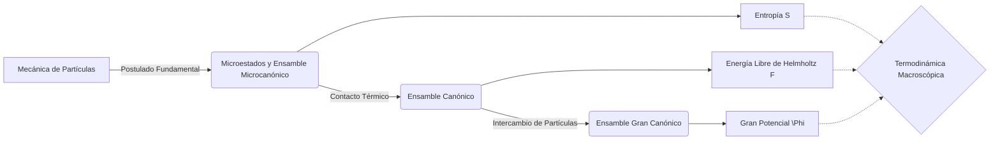

# Mecánica Estadística

La mecánica estadística es la formulación matemática que deduce todas las leyes de la termodinámica clásica partiendo del estudio probabilístico de los incontables microestados (configuraciones atómicas o cuánticas) compatibles con un macroestado dado (como energía, volumen y temperatura fijas).

## 📜 Contexto Histórico
A finales del siglo XIX, Ludwig Boltzmann y Josiah Willard Gibbs sentaron las bases fundacionales de esta disciplina. Boltzmann propuso que la entropía es una medida del número de microestados disponibles (expresado en su famosa lápida $S = k \log W$). Gibbs, por su parte, desarrolló la noción de los "colectivos" o "ensembles" (microcanónico, canónico, macrocanónico). Con el advenimiento de la mecánica cuántica, Albert Einstein, Satyendra Nath Bose, Enrico Fermi y Paul Dirac ampliaron la teoría a los bosones y fermiones en la década de 1920, lo que permitió explicar fenómenos que escapaban a la física clásica (como el cuerpo negro, la conducción en metales y la superfluidez).

---

## 🧮 Desarrollo Teórico Profundo

El objetivo central de la mecánica estadística es derivar las leyes de la termodinámica macroscópica y predecir los comportamientos colectivos de la materia a partir de la dinámica microscópica (clásica o cuántica) de un número masivo de grados de libertad (del orden del número de Avogadro, $N_A \approx 6.022 \times 10^{23}$). Este enlace analítico se logra formalmente mediante el concepto de *ensamble* o *colectivo* estadístico, introducido por J. Willard Gibbs.



### 1. El Postulado Fundamental de la Mecánica Estadística a priori

En un sistema físico aislado con energía constante $E$, volumen $V$, y número de partículas $N$, el sistema transitará, a lo largo del tiempo, por diversos microestados debido a sus interacciones internas.
El **Postulado Fundamental** establece que: *En equilibrio térmico, un sistema macroscópico aislado tiene igual probabilidad de encontrarse en cualquiera de sus microestados accesibles que satisfacen las restricciones macroscópicas.*
Si el número total de tales microestados permitidos es $\Omega(N,V,E)$, la probabilidad de encontrar el sistema en el microestado $i$ es:
$$ P_i = \begin{cases} \frac{1}{\Omega} & \text{si } E_i = E \\ 0 & \text{si } E_i \neq E \end{cases} $$

### 2. Ensamble Microcanónico: Conexión con la Entropía

El ensamble microcanónico modeliza sistemas estrictamente aislados. El punto de anclaje con la termodinámica viene proporcionado por la famosa ecuación de Boltzmann para la entropía $S$:
$$ S(N,V,E) = k_B \ln \Omega(N,V,E) $$
donde $k_B \approx 1.3806 \times 10^{-23} \text{ J/K}$ es la constante de Boltzmann. La entropía, como medida macroscópica, cuantifica en esencia nuestro "desconocimiento" del microestado específico del sistema.
Desde la definición diferencial de la termodinámica, recordamos que $dU = TdS - PdV + \mu dN$. Puesto que aquí la energía interna $U \equiv E$, derivamos las identidades fundamentales inversas:
$$ \frac{1}{T} = \left( \frac{\partial S}{\partial E} \right)_{N,V} \quad , \quad \frac{P}{T} = \left( \frac{\partial S}{\partial V} \right)_{N,E} \quad , \quad \frac{\mu}{T} = -\left( \frac{\partial S}{\partial N} \right)_{V,E} $$
Esto demuestra cómo los gradientes de $\Omega$ dictan las temperaturas, presiones y potenciales químicos del sistema.

### 3. Ensamble Canónico: Fluctuaciones Térmicas

El ensamble microcanónico es matemáticamente engorroso debido a la restricción absoluta de conservación de energía. Es preferible modelar un sistema en contacto con un gran baño térmico a temperatura $T$, donde el sistema intercambia energía libremente. Ahora, la energía del sistema, $E_i$, no es constante, sino que fluctúa.

Para derivar la probabilidad de un microestado $r$ con energía $E_r$, consideramos el sistema total (Sistema + Baño) como aislado y microcanónico. Por una expansión de Taylor de la entropía del baño térmico alrededor de su energía principal, se demuestra que la probabilidad del microestado decae exponencialmente con su energía:
$$ P_r = \frac{e^{-\beta E_r}}{Z} $$
donde $\beta = \frac{1}{k_B T}$. El denominador es la constante de normalización, o **función de partición canónica** $Z(N,V,T)$:
$$ Z = \sum_{r} e^{-\beta E_r} \quad (\text{sistemas discretos}) \quad \text{o} \quad Z = \frac{1}{N!h^{3N}} \int \int e^{-\beta \mathcal{H}(\mathbf{q},\mathbf{p})} \, d^{3N}q \, d^{3N}p \quad (\text{sistemas continuos clásicos}) $$

La función $Z$ es el puente hacia la termodinámica. Genera directamente la **Energía Libre de Helmholtz** $F$:
$$ F(N,V,T) = -k_B T \ln Z $$
Del diferencial exacto $dF = -SdT - PdV + \mu dN$, podemos calcular variables medias:
* Energía Interna Media: $\langle E \rangle = -\left( \frac{\partial \ln Z}{\partial \beta} \right)_{V,N}$
* Capacidad Calorífica (a su vez dependiente de las fluctuaciones de energía): $C_V = \left( \frac{\partial \langle E \rangle}{\partial T} \right)_V = \frac{\langle E^2 \rangle - \langle E \rangle^2}{k_B T^2}$

### 4. Ensamble Gran Canónico: Número de Partículas Variable

Si el sistema puede intercambiar no solo energía, sino también partículas, con un reservorio que mantiene $T$ y $\mu$ constantes, usamos el **Ensamble Gran Canónico**. 
La probabilidad de un microestado con energía $E_r$ y número de partículas $N_r$ es:
$$ P_{r} = \frac{e^{-\beta (E_r - \mu N_r)}}{\mathcal{Z}} $$
La función de **Gran Partición** $\mathcal{Z}$ es:
$$ \mathcal{Z}(T, V, \mu) = \sum_{N=0}^{\infty} \sum_{r} e^{-\beta (E_{r,N} - \mu N)} = \sum_{N=0}^{\infty} e^{\beta \mu N} Z(N, V, T) $$
El potencial termodinámico asociado es el Gran Potencial $\Phi$:
$$ \Phi(T, V, \mu) = -k_B T \ln \mathcal{Z} $$
Donde $\Phi = -PV$. Las fluctuaciones del número de partículas se relacionan de igual modo con la compresibilidad isoterma del material.

### 5. Formulaciones de Estadísticas Cuánticas y Fermiones/Bosones

En el régimen donde las longitudes de onda térmicas de De Broglie $\lambda = \frac{h}{\sqrt{2 \pi m k_B T}}$ de las partículas se superponen ($\lambda \sim (V/N)^{1/3}$), los efectos puramente cuánticos de la indistinguibilidad de partículas y sus restricciones topológicas (espín) dominan. No existe "trayectoria" clásica.
Los sistemas cuánticos con muchas partículas se analizan mediante números de ocupación $n_k$ de los estados de una sola partícula con energía $\epsilon_k$.

* **Estadística de Fermi-Dirac (Fermiones):** Partículas con espín semi-entero (e.g. electrones, quarks, protones). Sometidas al principio de exclusión de Pauli. El número de partículas en el estado $k$ solo puede ser $n_k = 0$ o $1$.
  La gran función de partición factoriza por estado: $\mathcal{Z}_k = \sum_{n_k=0}^{1} e^{-\beta(\epsilon_k - \mu)n_k} = 1 + e^{-\beta(\epsilon_k - \mu)}$.
  El número de ocupación media resulta:
  $$ \langle n_k \rangle_{FD} = \frac{1}{e^{\beta(\epsilon_k - \mu)} + 1} $$
  Esto explica la presión de degeneración que sostiene a enanas blancas y estrellas de neutrones contra el colapso gravitatorio.

* **Estadística de Bose-Einstein (Bosones):** Partículas con espín entero (e.g. fotones, fonones, átomos de Helio-4). Sin límite de ocupación cuántica ($n_k = 0, 1, 2, \dots$).
  Aquí, $\mathcal{Z}_k = \sum_{n_k=0}^{\infty} e^{-\beta(\epsilon_k - \mu)n_k} = \frac{1}{1 - e^{-\beta(\epsilon_k - \mu)}}$ (requiriendo rigurosamente que $\mu < \epsilon_0$).
  El número de ocupación media resulta:
  $$ \langle n_k \rangle_{BE} = \frac{1}{e^{\beta(\epsilon_k - \mu)} - 1} $$
  En el límite $T \to 0$ y con partículas conservadas (donde $\mu \to \epsilon_0$), surge un comportamiento patológico macroscópico donde una fracción dominante de partículas se condensa en el estado fundamental cuántico uniparticular. A este fenómeno lo denominamos **Condensación de Bose-Einstein**.

---

## 🛠 Ejemplo Práctico
**Problema:** Calcular la energía interna promedio y la capacidad calorífica de un paramagneto de espín $1/2$ que consta de $N$ átomos fijos y no interactuantes, en presencia de un campo magnético externo $B$, a temperatura $T$.

**Solución paso a paso:**
1. **Identificar los microestados de un átomo:**
   Cada espín puede apuntar "arriba" (energía $\epsilon_{\uparrow} = -\mu_B B$) o "abajo" (energía $\epsilon_{\downarrow} = +\mu_B B$), donde $\mu_B$ es el magnetón de Bohr.
2. **Calcular la función de partición de una sola partícula ($z$):**
   $$ z = e^{-\beta(-\mu_B B)} + e^{-\beta(+\mu_B B)} = e^{\beta \mu_B B} + e^{-\beta \mu_B B} = 2 \cosh(\beta \mu_B B) $$
3. **Calcular la función de partición total ($Z$):**
   Como las partículas son distinguibles por estar fijas en la red cristalina:
   $$ Z = z^N = \left[ 2 \cosh(\beta \mu_B B) \right]^N $$
4. **Calcular la energía interna ($U$):**
   $$ U = -\frac{\partial \ln Z}{\partial \beta} = -N \frac{\partial}{\partial \beta} \ln[2 \cosh(\beta \mu_B B)] $$
   $$ U = -N \frac{2 \mu_B B \sinh(\beta \mu_B B)}{2 \cosh(\beta \mu_B B)} = -N \mu_B B \tanh(\beta \mu_B B) $$
5. **Calcular la capacidad calorífica ($C$):**
   $$ C = \frac{\partial U}{\partial T} = \frac{\partial U}{\partial \beta} \frac{\partial \beta}{\partial T} $$
   Como $\frac{\partial \beta}{\partial T} = -\frac{1}{k_B T^2}$:
   $$ C = N k_B (\beta \mu_B B)^2 \operatorname{sech}^2(\beta \mu_B B) $$
   Este resultado demuestra de forma teórica la "anomalía de Schottky", un pico en la capacidad calorífica a bajas temperaturas típico de sistemas de dos niveles.

---

## 📝 Guía de Ejercicios Resueltos

**Problema 1: Modelo de Schottky de Dos Niveles**
Considera un cristal con $N$ átomos no interactuantes. Cada átomo posee dos estados energéticos posibles: un estado base de energía $0$ y un estado excitado de energía $\epsilon > 0$. Determina la capacidad calorífica $C_V$ a temperatura $T$ y examina sus límites extremos.
**Solución paso a paso:**
1. La función de partición de una sola partícula es $Z_1 = e^{0} + e^{-\beta\epsilon} = 1 + e^{-\beta\epsilon}$.
2. Dado que los átomos en el cristal son distinguibles (fijos en su red), la función de partición total es $Z = (Z_1)^N = (1 + e^{-\beta\epsilon})^N$.
3. La energía media del sistema es $U = -\frac{\partial \ln Z}{\partial \beta} = -N \frac{\partial}{\partial \beta} \ln(1 + e^{-\beta\epsilon})$.
4. Derivando: $U = N \frac{\epsilon e^{-\beta\epsilon}}{1 + e^{-\beta\epsilon}} = \frac{N\epsilon}{e^{\beta\epsilon} + 1}$.
5. La capacidad calorífica es $C_V = \left( \frac{\partial U}{\partial T} \right)_V = \frac{\partial U}{\partial \beta} \frac{d\beta}{dT} = \left( \frac{\partial U}{\partial \beta} \right) \left(-\frac{1}{k_B T^2}\right)$.
6. Evaluando la derivada respecto a $\beta$: $\frac{\partial U}{\partial \beta} = - \frac{N\epsilon^2 e^{\beta\epsilon}}{(e^{\beta\epsilon} + 1)^2}$.
7. Así, $C_V = \frac{N\epsilon^2}{k_B T^2} \frac{e^{\beta\epsilon}}{(e^{\beta\epsilon} + 1)^2} = N k_B \left(\frac{\epsilon}{k_B T}\right)^2 \frac{e^{\epsilon/k_B T}}{(e^{\epsilon/k_B T} + 1)^2}$.
8. Límites: Para $T \to 0$ ($\beta \to \infty$), $C_V \sim T^{-2} e^{-\epsilon/k_B T} \to 0$ (cumple la 3ra Ley). Para $T \to \infty$, $C_V \sim T^{-2} \to 0$. Esto genera un "Pico de Schottky" a temperaturas intermedias.

**Problema 2: Gas de Fotones en una Cavidad**
Deriva la ecuación de estado de la presión de radiación $P = \frac{1}{3}u(T)$, donde $u(T) = U/V$ es la densidad de energía, modelando la radiación electromagnética como un gas de fotones (bosones) encerrado en un volumen $V$.
**Solución paso a paso:**
1. El Gran Potencial para un gas de bosones (los fotones no se conservan, luego $\mu = 0$) viene dado por $\Phi = k_B T \sum_k \ln(1 - e^{-\beta\epsilon_k})$.
2. Al estar en un volumen continuo macroscópico, transformamos la sumatoria en una integral sobre el momento continuo $p$: $\sum_k \to \frac{V}{(2\pi\hbar)^3} \int g_s d^3p$, donde la degeneración de espín del fotón (polarizaciones) es $g_s = 2$.
3. Usando coordenadas esféricas para los momentos: $d^3p = 4\pi p^2 dp$. Sabiendo que para los fotones $E = pc$:
$$ \Phi = k_B T \frac{2V}{8\pi^3 \hbar^3} \int_0^\infty 4\pi p^2 \ln(1 - e^{-\beta pc}) dp = \frac{Vk_B T}{\pi^2 \hbar^3} \int_0^\infty p^2 \ln(1 - e^{-\beta pc}) dp $$
4. Integramos por partes, donde $u = \ln(1 - e^{-\beta pc})$ y $dv = p^2 dp$. Resulta en $v = \frac{1}{3}p^3$ y $du = \frac{\beta c e^{-\beta pc}}{1 - e^{-\beta pc}} dp$.
5. El término de frontera desaparece. La integral se vuelve:
$$ \Phi = -\frac{V}{3\pi^2 \hbar^3} \int_0^\infty \frac{p^3 c}{e^{\beta pc} - 1} dp $$
6. Reconocemos que la energía total interna del gas es $U = \sum_k \langle n_k \rangle \epsilon_k = \frac{V}{\pi^2 \hbar^3} \int_0^\infty \frac{pc \cdot p^2}{e^{\beta pc} - 1} dp$.
7. Comparando las integrales, $\Phi = -\frac{1}{3} U$.
8. Como el gran potencial termodinámico también satisface $\Phi = -PV$, igualando términos deducimos que $-PV = -\frac{1}{3}U \implies P = \frac{1}{3} \frac{U}{V} = \frac{1}{3}u(T)$.

**Problema 3: Energía de Fermi en Gas de Electrones 3D**
Un metal se puede modelar como un gas de electrones (fermiones, espín 1/2) libres e independientes. Calcula la Energía de Fermi $E_F$ a temperatura $T=0\text{ K}$ como función de la densidad electrónica $n = N/V$.
**Solución paso a paso:**
1. A $T=0\text{ K}$, la distribución de Fermi-Dirac es un escalón de Heaviside perfecto. Los electrones llenan todos los estados cuánticos desde energía $0$ hasta el nivel máximo de energía $E_F$.
2. La densidad de estados uniparticulares (incluyendo factor de degeneración $g_s = 2$ por el espín) en función del momento $p$ es $D(p)dp = 2 \frac{V}{h^3} 4\pi p^2 dp$.
3. El número total de electrones $N$ es la integral de esta densidad desde $p=0$ hasta el momento de Fermi $p_F$ (correspondiente a $E_F$):
$$ N = \int_0^{p_F} \frac{8\pi V}{h^3} p^2 dp = \frac{8\pi V}{h^3} \frac{p_F^3}{3} $$
4. Despejamos el momento de Fermi en función de la densidad $n = N/V$:
$$ p_F = \left( \frac{3N h^3}{8\pi V} \right)^{1/3} = \hbar \left( 3\pi^2 n \right)^{1/3} \quad (\text{usando } h = 2\pi\hbar) $$
5. La Energía de Fermi es la energía cinética correspondiente a las partículas más energéticas en este momento límite de la esfera de Fermi:
$$ E_F = \frac{p_F^2}{2m} $$
6. Sustituyendo $p_F$:
$$ E_F = \frac{\hbar^2}{2m} (3\pi^2 n)^{2/3} $$
Este resultado monumental subyace a toda la teoría de metales y semiconductores.

## 💻 Simulaciones Computacionales

Esta simulación en Python utiliza la estadística de Fermi-Dirac y Bose-Einstein para visualizar la ocupación media de los estados de energía en función de la temperatura, evidenciando el comportamiento fermiónico (principio de exclusión) y la condensación bosónica.

```python
import numpy as np
import matplotlib.pyplot as plt

def fermi_dirac(E, mu, T):
    k_B = 8.617e-5 # eV/K
    beta = 1 / (k_B * T)
    return 1 / (np.exp(beta * (E - mu)) + 1)

def bose_einstein(E, mu, T):
    k_B = 8.617e-5
    beta = 1 / (k_B * T)
    # Evitar la singularidad para bosones
    E_adj = np.clip(E, mu + 1e-6, np.inf)
    return 1 / (np.exp(beta * (E_adj - mu)) - 1)

E = np.linspace(0.0, 2.0, 500) # Energía en eV
mu_f = 1.0 # Potencial químico para fermiones
mu_b = 0.0 # Potencial químico para bosones (debe ser <= E_min)

temperatures = [100, 300, 1000] # K

fig, (ax1, ax2) = plt.subplots(1, 2, figsize=(14, 5))

# Fermi-Dirac
for T in temperatures:
    ax1.plot(E, fermi_dirac(E, mu_f, T), label=f'T = {T} K')
ax1.axvline(mu_f, color='k', linestyle='--', label='$\\mu$ (Nivel de Fermi)')
ax1.set_title('Estadística de Fermi-Dirac')
ax1.set_xlabel('Energía (eV)')
ax1.set_ylabel('Ocupación Media $\\langle n \\rangle$')
ax1.legend()
ax1.grid(True)

# Bose-Einstein
for T in temperatures:
    ax2.plot(E, bose_einstein(E, mu_b, T), label=f'T = {T} K')
ax2.set_title('Estadística de Bose-Einstein')
ax2.set_xlabel('Energía (eV)')
ax2.set_ylabel('Ocupación Media $\\langle n \\rangle$')
ax2.set_ylim(0, 10) # Limitar y para ver la divergencia en E=mu
ax2.legend()
ax2.grid(True)

plt.tight_layout()
plt.show()
```

## 🚀 Fronteras de Investigación y Problemas Abiertos

La investigación en Mecánica Estadística en 2026 está dominada por las propiedades de sistemas cuánticos de muchos cuerpos fuertemente correlacionados y su dinámica fuera del equilibrio. Un problema abierto crucial es entender los límites de la **Eigenstate Thermalization Hypothesis (ETH)**, que explica cómo sistemas cuánticos aislados pueden termalizar internamente mediante estados propios que actúan como baños térmicos para subsistemas locales. Sin embargo, sistemas con desorden profundo exhiben Localización de Muchos Cuerpos (MBL - Many-Body Localization), donde la termalización falla y la memoria de las condiciones iniciales perdura indefinidamente, desafiando la mecánica estadística ergódica tradicional. Además, el estudio de las transiciones de fase topológicas, la topología en sistemas disipativos (non-Hermitian physics), y el papel del entrelazamiento multipartito en la emergencia de la termodinámica cuántica en simuladores cuánticos de redes ópticas o computadoras cuánticas ruidosas (NISQ), conforman una de las áreas teóricas y experimentales más candentes.

## 📐 Formalismo Matemático Avanzado (Nivel Posgrado/Doctorado)

El tratamiento avanzado de la mecánica estadística cuántica requiere la **Teoría Cuántica de Campos a Temperatura Finita** (formalismo de tiempo imaginario o Matsubara). Para un sistema en equilibrio térmico a temperatura $T = 1/\beta$, la función de partición gran canónica $\mathcal{Z} = \text{Tr}[e^{-\beta(H - \mu N)}]$ se evalúa mapeando la traza mecanocuántica a una **Integral de Camino Euclídea**.
La variable de tiempo real $t$ se prolonga analíticamente al tiempo imaginario $\tau = i t$, y la termodinámica se recupera imponiendo condiciones de contorno periódicas (para bosones) o antiperiódicas (para fermiones) sobre un intervalo temporal imaginario $\tau \in [0, \beta]$. La función de partición en formalismo de campos coherentes $\phi(\mathbf{x}, \tau)$ viene dada por:
$$ \mathcal{Z} = \int \mathcal{D}[\phi, \phi^\dagger] \exp\left( - \int_0^\beta d\tau \int d^3x \, \mathcal{L}_E(\phi^\dagger, \phi) \right) $$
donde la densidad lagrangiana euclídea efectiva incorpora el potencial químico:
$$ \mathcal{L}_E = \phi^\dagger \left(\partial_\tau - \mu - \frac{\nabla^2}{2m}\right)\phi + V(\phi^\dagger, \phi) $$

Para tratar fluctuaciones críticas cerca de transiciones de fase continuas, se emplea el **Grupo de Renormalización (RG) de Wilson**. Definimos una acción efectiva al nivel de un corte de momento $\Lambda$, e integramos los modos de corto alcance $\Lambda' < k < \Lambda$. El flujo de las constantes de acoplamiento $\{g_i\}$ a medida que el sistema escala espacialmente dictamina los exponentes críticos. En el punto fijo de RG, las transformaciones beta se anulan ($\beta(g_i^*) = \mu \partial_\mu g_i = 0$), dictando que el sistema exhibe invariancia de escala conforme (Conformal Field Theory - CFT).

Para estudiar sistemas *fuera del equilibrio* (non-equilibrium), el tiempo imaginario es insuficiente y se requiere el riguroso **Formalismo de Schwinger-Keldysh** (Closed Time-Path Green's Functions), donde el contorno de tiempo se duplica en una rama de ida y vuelta para calcular observables reales dependientes del tiempo, permitiendo tratar el decaimiento y la disipación cuántica de manera exacta.

## 📚 Recursos Específicos

### 🎓 Cursos y Clases Recomendadas
1. **[Stanford University: Statistical Mechanics (Leonard Susskind)](https://theoreticalminimum.com/courses/statistical-mechanics/2013/spring)** - Clases geniales que abordan directamente la física fundamental, comenzando con el teorema de Liouville, los microestados, el entrelazamiento de información y la derivación del ensamble de Gibbs.
2. **[MIT OpenCourseWare: 8.044 Statistical Physics I](https://ocw.mit.edu/courses/8-044-statistical-physics-i-spring-2013/)** - Excelente desarrollo universitario formal. Pasa rigurosamente de la termodinámica macroscópica a las variables aleatorias continuas, ensambles de Gibbs, y aplicaciones como el gas fotónico.
3. **[Perimeter Institute: Statistical Physics (PSI Lectures)](https://pirsa.org/)** - Diversos minicursos intensivos de maestría orientados a la teoría de transiciones de fase críticas, el modelo de Ising y renormalización en mecánica estadística avanzada.
4. **[Oxford University: Statistical Mechanics](https://podcasts.ox.ac.uk/series/statistical-mechanics)** - Clases de audio/video magistrales que cubren la derivación de la Función de Partición ($Z$) para ensambles canónicos y las estadísticas cuánticas (Bose-Einstein, Fermi-Dirac).

### 📝 Artículos Científicos Históricos y Avanzados

1. **Weitere Studien über das Wärmegleichgewicht unter Gasmolekülen (Estudios adicionales sobre el equilibrio térmico entre moléculas de gas)**  
   *Ludwig Boltzmann (1872)*. [Sitzungsberichte der Akademie der Wissenschaften, Wien 66, 275-370](https://en.wikipedia.org/wiki/H-theorem).  
   **Importancia Teórica:** Es la obra cumbre donde Boltzmann formula su célebre Teorema-H (H-Theorem), intentando derivar la flecha irreversible del tiempo macroscópico partiendo puramente de leyes microscópicas reversibles de colisión mecanicista.  
   **Fondo Matemático:** Boltzmann define una cantidad estadística de su distribución $f(\mathbf{v}, t)$ llamada funcional $H$:
   $$ H(t) = \int f(\mathbf{v}, t) \ln f(\mathbf{v}, t) d^3\mathbf{v} $$
   Mediante su ecuación de transporte, demuestra matemáticamente que por interacciones de colisión, la derivada del tiempo siempre decrece ($\frac{dH}{dt} \le 0$), identificando astutamente $-H$ como proporcional a la entropía $S$.  
   **Implicaciones Físicas:** Fundamentó el concepto estadístico de entropía. Originó críticas masivas (paradojas de Loschmidt y Zermelo) que lo forzaron a reinterpretar la Segunda Ley no como una ley absoluta e inviolable, sino probabilísticamente asintótica.

2. **On the Elementary Theory of Statistical Mechanics**  
   *J. Willard Gibbs (1902)*. [Dover Books (Elementary Principles in Statistical Mechanics)](https://archive.org/details/elementaryprinci00gibb).  
   **Importancia Teórica:** Un tratado monumental que estructuró matemáticamente toda la disciplina en su forma actual, inventando el concepto del *espacio de fases* y los *ensambles estadísticos*.  
   **Fondo Matemático:** Desarrolla el Ensamble Canónico de forma abstracta e independiente de la naturaleza atómica (resolviendo los ataques anti-atomistas de su época). Demuestra que para un sistema en equilibrio a temperatura $T$, la distribución de densidad en el espacio de fases depende del Hamiltoniano $\mathcal{H}$:
   $$ \rho(\mathbf{q}, \mathbf{p}) = \frac{1}{Z} \exp\left(-\frac{\mathcal{H}(\mathbf{q}, \mathbf{p})}{k_B T}\right) \quad \text{donde} \quad Z = \int d^{3N}q \, d^{3N}p \, e^{-\beta \mathcal{H}} $$
   **Implicaciones Físicas:** Proporciona un marco matemático unificado y universal capaz de derivar todos los potenciales termodinámicos macroscópicos a partir del colectivo canónico y gran canónico.

3. **Plancksches Gesetz und Lichtquantenhypothese (La ley de Planck y la hipótesis de los cuantos de luz)**  
   *Satyendra Nath Bose & Albert Einstein (1924)*. [Zeitschrift für Physik, 26(1), 178-181](https://link.springer.com/article/10.1007/BF01327326).  
   **Importancia Teórica:** En este asombroso artículo enviado por Bose y traducido por Einstein, se deriva el espectro de cuerpo negro de Planck de una forma revolucionaria: tratando a los fotones como un gas de partículas estadísticamente idénticas e indistinguibles.  
   **Fondo Matemático:** Si existen estados cuánticos discretos, y las partículas bosónicas (espín entero) pueden agruparse sin restricciones de exclusión, la ocupación estadística de un estado energético discreto $i$ es:
   $$ \langle n_i \rangle = \frac{1}{e^{(E_i - \mu)/k_B T} - 1} $$
   **Implicaciones Físicas:** Nace la "Estadística de Bose-Einstein". Poco después, Einstein la extendería a átomos con masa para formular la teórica *Condensación de Bose-Einstein*, un nuevo estado de la materia donde la entropía macroscópica colapsa a nivel microscópico al llegar a $0\text{ K}$, hallado experimentalmente recién en 1995.

### 📖 Referencias Útiles y Bibliografía
1. **R. K. Pathria & Paul D. Beale - [Statistical Mechanics (Elsevier/Academic Press, 3rd Ed)](https://www.elsevier.com/books/statistical-mechanics/pathria/978-0-12-382188-1)** - El libro estándar para cursos de posgrado. Rigor matemático supremo, ideal para dominar condensación BE, gases de Fermi, transiciones de fase y fluctuaciones de Onsager.
2. **Kerson Huang - [Statistical Mechanics (Wiley)](https://www.wiley.com/en-us/Statistical+Mechanics%2C+2nd+Edition-p-9780471815181)** - Un clásico respetado con una exposición profunda de la teoría de gases imperfectos (expansión virial), superfluidez e Ising.
3. **Frederick Reif - [Fundamentals of Statistical and Thermal Physics (Waveland Press)](https://books.google.com/books?id=0sM4DgAAQBAJ)** - Un texto extenso, didáctico y extremadamente formativo que une termodinámica clásica, caminos aleatorios microscópicos y ensambles de manera magistral (recomendado a nivel de pregrado).
