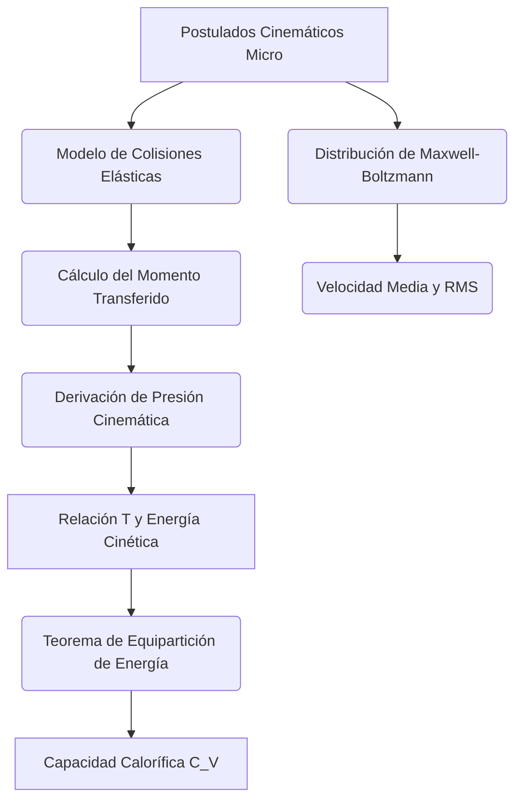

# Teoría Cinética de los Gases

La teoría cinética de los gases proporciona una descripción microscópica y mecánica del comportamiento macroscópico de los gases. Sustituye la visión continua de la termodinámica por un modelo estadístico de un número inmenso de partículas diminutas en movimiento constante y aleatorio.

## 📜 Contexto Histórico
La idea atómica de la materia se originó en la Antigua Grecia, pero Daniel Bernoulli (1738) fue el primero en derivar la ley de Boyle a partir de colisiones de partículas. En la segunda mitad del siglo XIX, James Clerk Maxwell y Ludwig Boltzmann desarrollaron esta idea formalmente, creando la distribución de velocidades de Maxwell-Boltzmann. Ellos establecieron cómo la temperatura macroscópica se correlaciona con la energía cinética microscópica. Posteriormente, el trabajo de Albert Einstein en 1905 sobre el movimiento browniano proporcionó la confirmación definitiva de la realidad física de átomos y moléculas.

---

## 🧮 Desarrollo Teórico Profundo

La teoría cinética de los gases constituye uno de los mayores triunfos de la física clásica pre-cuántica. Es una aplicación pura de la mecánica analítica newtoniana a sistemas masivos de partículas tratadas estadísticamente, derivando leyes macroscópicas termodinámicas estáticas y de transporte.



### 1. Marco Axiomático de la Teoría de Gases Ideales

Para deducir las propiedades emergentes del gas, es imprescindible un conjunto sólido de hipótesis que configuran el límite ideal de los gases (baja densidad, alta temperatura relativa). El gas ideal obedece cinco supuestos críticos:
1. **Puntualidad Geométrica:** Las partículas poseen un tamaño espacial que es rigurosamente despreciable frente a su camino libre medio $\lambda$. Su volumen intrínseco se aproxima a cero.
2. **Dinámica Molecular Aleatoria (Caos Molecular):** Las moléculas de gas obedecen un movimiento en línea recta incesante, caótico e isotrópico. No existe una dirección macroscópica preferencial del flujo de masa.
3. **Ausencia de Campos de Interacción:** El potencial intermolecular es nulo a distancias mayores que el diámetro molecular $V(r) = 0$; no existen fuerzas de atracción tipo Van der Waals ni enlaces dipolares de largo alcance. Las partículas solo "sienten" mutuamente la fuerza electromagnética de repulsión estricta a un radio $\sigma$ en el breve instante temporal del choque físico.
4. **Colisiones Perfectamente Elásticas:** Toda colisión entre partículas, o contra los límites del recipiente, preserva por completo la magnitud neta del momento lineal y la energía cinética de traslación del sistema. 
5. **Estadística Continua y Numerosa:** El número de partículas $N$ es inmensamente grande ($N \gg 1$), lo que permite que las fluctuaciones estadísticas relativas que escalan como $1/\sqrt{N}$ tiendan a cero en mediciones macroscópicas.

### 2. Derivación Mecánica del Tensor de Presiones

Consideremos geométricamente un gas encerrado en una caja rectangular rígida de lados $L_x, L_y, L_z$, cuyo volumen total es $V = L_x L_y L_z$. Nos fijamos en una molécula arbitraria de masa constante $m$ colisionando elásticamente con una de las paredes planares perpendiculares al eje $X$, cuya área es $A = L_y L_z$.
La velocidad inicial de la molécula posee un vector tridimensional $\vec{v} = v_x \hat{i} + v_y \hat{j} + v_z \hat{k}$. Al impactar frontalmente de manera elástica con el plano $YZ$, solo su componente de velocidad normal se invierte, convirtiéndose en $-v_x$.
La transferencia o cambio de momento lineal de la molécula es:
$$ \Delta p_x = m(-v_x) - m(v_x) = -2mv_x $$
Por la Tercera Ley de Newton, el momento exacto transferido a la pared durante cada colisión microscópica es $+2mv_x$.
Para que esta misma molécula colisione nuevamente con la misma pared de $X$, debe viajar hasta la pared opuesta y regresar, una distancia cinemática de $2L_x$. El tiempo que toma en completar este periplo $x$ de ida y vuelta es:
$$ \Delta t = \frac{2L_x}{v_x} $$
Aplicando el Teorema del Impulso, la fuerza impulsiva promediada ejercida por una sola partícula, $F_{1x}$, resulta de dividir la transferencia de momento por el tiempo del ciclo entre colisiones:
$$ \langle F_{1x} \rangle = \frac{\Delta p_{\text{pared}}}{\Delta t} = \frac{2mv_x}{2L_x / v_x} = \frac{mv_x^2}{L_x} $$
Ahora, superponemos linealmente la fuerza ejercida de forma independiente por el total de las $N$ moléculas en el gas:
$$ \langle F_x^{\text{tot}} \rangle = \frac{m}{L_x} \sum_{i=1}^{N} v_{ix}^2 = \frac{m N}{L_x} \langle v_x^2 \rangle $$
Donde $\langle v_x^2 \rangle$ corresponde al promedio del cuadrado de las velocidades a lo largo del eje $X$ en el sistema.
Macroscópicamente, definimos la variable conjugada presión, $P$, como la magnitud intensiva de la fuerza por unidad de área perpendicular ejercida sobre los márgenes del contorno $A$:
$$ P = \frac{\langle F_x^{\text{tot}} \rangle}{A} = \frac{m N \langle v_x^2 \rangle}{L_x \cdot A} = \frac{N m \langle v_x^2 \rangle}{V} $$
Dada la isotropía espacial del "caos molecular", las velocidades en promedio satisfacen que $\langle v_x^2 \rangle = \langle v_y^2 \rangle = \langle v_z^2 \rangle$. Y puesto que el módulo al cuadrado del vector velocidad es $v^2 = v_x^2 + v_y^2 + v_z^2$, la media requiere que $\langle v^2 \rangle = 3\langle v_x^2 \rangle$.  Sustituyendo esta asimetría esférica de regreso en nuestra derivación de la presión, obtenemos la **Ecuación Maestra de la Teoría Cinética**:
$$ P = \frac{1}{3} \frac{N m \langle v^2 \rangle}{V} $$
Aquí resalta vívidamente la interconexión dimensional de la presión con la densidad molecular del sistema y el término microscópico inercial-cinético.

### 3. Temperatura y la Interpretación Mecánica de la Energía

La ecuación fundamental del gas ideal, derivada macroscópicamente mediante síntesis empírica por Boyle, Charles y Gay-Lussac, dicta que $PV = N k_B T$, donde $T$ es la temperatura termodinámica absoluta y $k_B$ la constante de Boltzmann.
Asimilando esta igualdad a nuestra Ecuación Maestra reordenada:
$$ P V = \frac{1}{3} N m \langle v^2 \rangle $$
Encontramos de inmediato la simetría térmica de los gases:
$$ N k_B T = \frac{1}{3} N m \langle v^2 \rangle $$
Dividiendo por $N$ e introduciendo el factor de 2 para revelar la forma de la energía cinética traslacional $\langle E_K \rangle = \frac{1}{2}m\langle v^2 \rangle$:
$$ \frac{1}{2} m \langle v^2 \rangle = \frac{3}{2} k_B T $$
Este resultado revolucionario provee de sentido ontológico a la magnitud de la "temperatura": **La temperatura no es más que el indicador macroscópico observable del nivel promedio de energía cinética de traslación aleatoria de las moléculas que constituyen el sistema**.

Desde aquí, definimos además la importante métrica de velocidad cuadrática media $v_{\text{rms}}$:
$$ v_{\text{rms}} = \sqrt{\langle v^2 \rangle} = \sqrt{\frac{3 k_B T}{m}} = \sqrt{\frac{3 R T}{M}} $$
donde $M$ es la masa molar del gas y $R = N_A k_B$ es la constante de los gases universales.

### 4. Teorema Fundamental de la Equipartición de la Energía

El resultado anterior $\langle E_K \rangle = \frac{3}{2} k_B T$ puede descomponerse direccionalmente considerando que hay $3$ grados de libertad espaciales ($x, y, z$). Por ende, el promedio de energía que aloja cada uno de los grados de libertad espaciales independientes resulta en exactamente $\frac{1}{2} k_B T$.

James Clerk Maxwell y Ludwig Boltzmann generalizaron este corolario analítico a cualquier tipo de energía cuadrática de forma fenomenológica para la física estadística clásica.
**Teorema:** *Para un sistema dinámico clásico que se encuentre en perfecto equilibrio térmico absoluto a temperatura constante $T$, la media de su energía cinética total está distribuida uniforme y equitativamente entre todos y cada uno de los grados de libertad independientes que intervengan de forma cuadrática en su formulación del Hamiltoniano (energías cinéticas de traslación o rotación angular, o energías potenciales armónicas espaciales).*

Así, si una molécula gaseosa polinuclear consta de un total de $f$ grados de libertad efectivamente accesibles (no congelados termodinámicamente a nivel cuántico) en un instante dado, la energía interna macroscópica de una muestra con un número $N$ de tales moléculas valdrá:
$$ U = N \cdot \frac{f}{2} k_B T $$
Esta ecuación permite calcular de forma inmediata una predicción empírica crucial sobre el comportamiento macroscópico del gas: la capacidad calorífica isocórica molar $C_V$, definida como la derivada termodinámica parcial $\left(\frac{\partial U}{\partial T}\right)_V$. Para 1 mol ($N = N_A$):
$$ C_V = \frac{f}{2} R $$
Lo que asienta valores predecibles: para un gas atómico monoatómico ($f=3$, $C_V = \frac{3}{2} R$), y para un gas diatómico con excitación rotacional simple ($f=5$, $C_V = \frac{5}{2} R$).

### 5. Distribución de Velocidades de Maxwell-Boltzmann

Aunque las moléculas poseen un $v_{\text{rms}}$ característico, el gas contiene un mar agitado de partículas volando con velocidades dispares a causa de las incesantes colisiones recíprocas termalizadoras. La caracterización estadística es abordada por la función de densidad de probabilidad $f(v)$ que especifica el porcentaje estocástico de las moléculas cuya velocidad reside infinitesimalmente entre $v$ y $v+dv$. Derivada considerando condiciones isométricas y de probabilidad separada en las componentes espaciales de la velocidad, Maxwell generó su icónica ley:
$$ f(v) = 4\pi \left( \frac{m}{2\pi k_B T} \right)^{3/2} v^2 \exp\left(-\frac{mv^2}{2k_B T}\right) $$
La distribución es asimétrica y refleja una curva de "campana" modificada (sesgada positivamente por el factor $v^2$ originado del elemento diferencial esférico de fases). Esta ecuación domina de forma ubicua y magistral los fundamentos del equilibrio termodinámico de fluidos desde presiones bajas hasta su aproximación relativista.

---

## 🛠 Ejemplo Práctico
**Problema:** Determinar la velocidad cuadrática media ($v_{\text{rms}}$) de las moléculas de gas oxígeno (O$_2$) a una temperatura de $T = 300\text{ K}$.

**Solución paso a paso:**
1. **Identificar la masa molar del oxígeno:** La molécula diatómica O$_2$ tiene una masa molar aproximada de $M = 32\text{ g/mol} = 0.032\text{ kg/mol}$.
2. **Relacionar $k_B$ y la masa molecular con $R$ y la masa molar:**
   La constante de Boltzmann es $k_B = R/N_A$, y la masa molecular es $m = M/N_A$.
3. **Aplicar la fórmula de $v_{\text{rms}}$:**
   Por definición, $v_{\text{rms}} = \sqrt{\langle v^2 \rangle}$. De la teoría cinética:
   $$ \langle v^2 \rangle = \frac{3 k_B T}{m} = \frac{3 R T}{M} $$
4. **Sustituir los valores:**
   Usamos $R \approx 8.314\text{ J/(mol}\cdot\text{K)}$:
   $$ v_{\text{rms}} = \sqrt{\frac{3 \times 8.314 \times 300}{0.032}} $$
   $$ v_{\text{rms}} = \sqrt{233831.25} \approx 483.5\text{ m/s} $$
   A temperatura ambiente, ¡las moléculas de oxígeno viajan a casi $500\text{ m/s}$ (más de $1700\text{ km/h}$)!

---

## 📝 Guía de Ejercicios Resueltos

**Problema 1: Cálculo del Camino Libre Medio**
Deriva la fórmula para el camino libre medio $\lambda$ de un gas ideal compuesto por moléculas modeladas como esferas rígidas de diámetro $d$, con densidad numérica $n = N/V$.
**Solución paso a paso:**
1. Imaginemos que una molécula viaja a una velocidad $\langle v \rangle$ y barre un cilindro de sección transversal $\sigma = \pi d^2$ (donde $d$ es el radio de colisión, es decir, dos veces el radio molecular).
2. En un tiempo $\Delta t$, el cilindro barrido tiene un volumen $V_c = \sigma \langle v \rangle \Delta t$.
3. El número de colisiones sufridas equivale al número de partículas diana en ese volumen: $Z = n V_c = n \sigma \langle v \rangle \Delta t$.
4. El camino libre medio se define como la distancia total recorrida dividida por el número de colisiones:
$$ \lambda = \frac{\langle v \rangle \Delta t}{Z} = \frac{\langle v \rangle \Delta t}{n \sigma \langle v \rangle \Delta t} = \frac{1}{n \sigma} $$
5. Una derivación más rigurosa usando la distribución de Maxwell-Boltzmann de velocidades relativas entre partículas $\langle v_{\text{rel}} \rangle = \sqrt{2} \langle v \rangle$, nos da:
$$ Z = n \sigma \sqrt{2} \langle v \rangle \Delta t \implies \lambda = \frac{1}{\sqrt{2} n \pi d^2} $$
Esta fórmula predice que el camino libre de los gases decrece al aumentar la presión.

**Problema 2: Frecuencia de Colisión con la Pared (Flujo Efusivo)**
A partir de la distribución de velocidades de Maxwell-Boltzmann, calcula el flujo molecular $\Phi$, es decir, el número de partículas que colisionan contra una unidad de área de una pared plana por unidad de tiempo.
**Solución paso a paso:**
1. Consideremos un elemento de área $dA$ en la pared $YZ$. Solo las partículas con velocidad $v_x > 0$ colisionarán.
2. En un tiempo $dt$, todas las partículas en el volumen $dV = v_x dt dA$ llegarán al área. El número es $dN = (N/V) v_x dt dA = n v_x dt dA$.
3. Por tanto, el flujo es $d\Phi = \frac{dN}{dA dt} = n v_x$.
4. Debemos integrar este flujo microscópico sobre todas las partículas promediadas por la distribución de probabilidad unidimensional $f(v_x)$:
$$ \Phi = n \int_0^\infty v_x f(v_x) dv_x $$
5. La distribución gaussiana unidimensional es $f(v_x) = \left(\frac{m}{2\pi k_B T}\right)^{1/2} e^{-mv_x^2 / 2k_B T}$.
6. Resolviendo la integral estándar:
$$ \int_0^\infty v_x e^{-mv_x^2 / 2k_B T} dv_x = \frac{k_B T}{m} $$
7. Resulta $\Phi = n \left(\frac{m}{2\pi k_B T}\right)^{1/2} \frac{k_B T}{m} = n \sqrt{\frac{k_B T}{2\pi m}}$.
8. Sabiendo que la velocidad media escalar 3D es $\langle v \rangle = \sqrt{\frac{8 k_B T}{\pi m}}$, observamos que $\sqrt{\frac{k_B T}{2\pi m}} = \frac{1}{4} \langle v \rangle$.
9. Concluimos que $\Phi = \frac{1}{4} n \langle v \rangle$, una fórmula fundamental en física del vacío y efusión de gases (Ley de Graham).

**Problema 3: Distribución de Velocidades Extremas (V_p, Promedio y RMS)**
Dada la distribución de velocidades de Maxwell-Boltzmann: $f(v) = 4\pi \left(\frac{m}{2\pi k_B T}\right)^{3/2} v^2 e^{-mv^2 / 2k_B T}$.
Encuentra la velocidad más probable $v_p$ y verifica que $v_p < \langle v \rangle < v_{\text{rms}}$.
**Solución paso a paso:**
1. La velocidad más probable $v_p$ es el máximo de la función de densidad de probabilidad. Encontramos esto derivando y haciendo cero:
$$ \frac{df}{dv} \propto \frac{d}{dv} (v^2 e^{-av^2}) = 2v e^{-av^2} - 2av^3 e^{-av^2} = 0 $$
Donde $a = \frac{m}{2k_B T}$.
2. Dividiendo por $2v e^{-av^2}$, obtenemos $1 - av^2 = 0 \implies v_p = \frac{1}{\sqrt{a}} = \sqrt{\frac{2k_B T}{m}}$.
3. La velocidad media se calcula integrando: $\langle v \rangle = \int_0^\infty v f(v) dv$.
Con una integral tipo gamma, $\langle v \rangle = \sqrt{\frac{8 k_B T}{\pi m}} \approx 1.59 \sqrt{\frac{k_B T}{m}}$.
4. La velocidad cuadrática media $v_{\text{rms}} = \sqrt{\langle v^2 \rangle}$ se obtuvo previamente: $v_{\text{rms}} = \sqrt{\frac{3 k_B T}{m}} \approx 1.73 \sqrt{\frac{k_B T}{m}}$.
5. Comparando los factores numéricos frente al término común $\sqrt{k_B T / m}$:
   - $v_p = 1.414$
   - $\langle v \rangle = 1.596$
   - $v_{\text{rms}} = 1.732$
Queda demostrado matemáticamente que la relación de jerarquía es siempre $v_p < \langle v \rangle < v_{\text{rms}}$ debido a la asimetría log-normal de la distribución exponencial.

## 💻 Simulaciones Computacionales

La siguiente simulación en Python traza la distribución de velocidades de Maxwell-Boltzmann para un gas ideal a diferentes temperaturas, mostrando cómo la velocidad cuadrática media y la velocidad más probable se desplazan térmicamente.

```python
import numpy as np
import matplotlib.pyplot as plt
from scipy.constants import k, atomic_mass

def maxwell_boltzmann(v, m, T):
    """
    Distribución de velocidades de Maxwell-Boltzmann.
    v: array de velocidades (m/s)
    m: masa de una molécula (kg)
    T: temperatura (K)
    """
    factor = 4 * np.pi * (m / (2 * np.pi * k * T))**1.5
    return factor * (v**2) * np.exp(-m * v**2 / (2 * k * T))

# Masa de una molécula de Oxígeno (O2)
mass_O2 = 32.0 * atomic_mass

v = np.linspace(0, 2000, 1000)
temperatures = [100, 300, 1000] # Kelvin

plt.figure(figsize=(10, 6))

for T in temperatures:
    f_v = maxwell_boltzmann(v, mass_O2, T)
    plt.plot(v, f_v, label=f'T = {T} K')
    
    # Calcular y marcar V_p (Velocidad más probable)
    v_p = np.sqrt(2 * k * T / mass_O2)
    plt.axvline(v_p, color=plt.gca().lines[-1].get_color(), linestyle='--', alpha=0.5)

plt.title('Distribución de Velocidades de Maxwell-Boltzmann (Gas O$_2$)')
plt.xlabel('Velocidad $v$ (m/s)')
plt.ylabel('Densidad de Probabilidad $f(v)$')
plt.legend()
plt.grid(True, alpha=0.3)
plt.xlim(0, 2000)
plt.ylim(0, max(maxwell_boltzmann(v, mass_O2, temperatures[0])) * 1.1)
plt.show()
```

## 📚 Recursos Específicos

### 🎓 Cursos y Clases Recomendadas
1. **Feynman Lectures on Physics:** [Vol I, Ch. 39 & 40](https://www.feynmanlectures.caltech.edu/I_39.html) - Capítulos 39 (Teoría cinética de los gases) y 40 (Mecánica estadística).
2. **MIT 8.044 (Statistical Physics I):** [Página del Curso](https://ocw.mit.edu/courses/8-044-statistical-physics-i-spring-2013/) - Primeras sesiones centradas en la derivación de Maxwell y las distribuciones de velocidad.
3. **Stanford - Mecánica Estadística (Susskind):** [Enlace al Curso](https://theoreticalminimum.com/courses/statistical-mechanics/2013/spring) - Conferencias sobre el significado físico de la equipartición de la energía.
4. **Yale PHYS 200 - Thermodynamics:** [Yale Open Courses](https://oyc.yale.edu/physics/phys-200) - Clases específicas sobre la derivación de la ley de los gases ideales desde el modelo microscópico.
5. **Coursera / edX - Physics Intro:** [edX Introductory Physics](https://www.edx.org/course/introduction-to-mechanics) - Módulos que exploran visualmente cómo surgen propiedades macroscópicas desde partículas chocando.

### 📝 Artículos e Interactivos Interesantes
1. **PhET - Gases Intro:** [Simulador de Gases](https://phet.colorado.edu/es/simulation/gases-intro) - Una simulación increíble para medir presiones, temperaturas y ver colisiones de partículas en tiempo real.
2. **Artículo de Einstein de 1905 sobre el Movimiento Browniano:** [Brownian Motion](https://en.wikipedia.org/wiki/Brownian_motion) - Un pilar histórico para probar la teoría cinética de la materia y la existencia de los átomos.
3. **Maxwell-Boltzmann Distribution Calculator:** [HyperPhysics Tool](http://hyperphysics.phy-astr.gsu.edu/hbase/Kinetic/maxspe.html) - Para explorar la distribución de velocidades de diferentes gases a distintas temperaturas y masas molares.
4. **FísicaLab - Teoría Cinética:** [Lección Interactiva](https://www.fisicalab.com/tema/teoria-cinetica-gases) - Explicación detallada paso a paso para estudiantes de los postulados fundamentales.
5. **Wikipedia - Teoría cinética de los gases:** [Artículo Principal](https://es.wikipedia.org/wiki/Teor%C3%ADa_cin%C3%A9tica) - Exhaustivo artículo con todas las derivaciones matemáticas paso a paso.
6. **Wolfram Demonstrations - Gas en una caja:** [Simulación 3D](https://demonstrations.wolfram.com/IdealGasInABox/) - Simulador interactivo que muestra las trayectorias de partículas y colisiones elásticas.
7. **HyperPhysics - Equipartición de la energía:** [Teorema de Equipartición](http://hyperphysics.phy-astr.gsu.edu/hbase/Kinetic/eqpar.html) - Gráficos y explicaciones claras de los grados de libertad vibracionales, rotacionales y traslacionales.
8. **Falstad - Gas 2D Simulation:** [Falstad Gas 2D](http://www.falstad.com/gas/) - Applet muy útil para ver la estadística de colisiones.

### 📖 Referencias Útiles y Bibliografía
* [Fundamentals of Statistical and Thermal Physics - Reif, F.](https://books.google.com/books?id=0sM4DgAAQBAJ) - Proporciona excelentes secciones tempranas detallando los postulados de la teoría cinética.
* [An Introduction to Thermal Physics - Schroeder, D. V.](https://physics.weber.edu/thermal/) - Aborda la teoría cinética y sus aplicaciones astrofísicas o atmosféricas con ejemplos muy interesantes.
* [Thermal Physics - Kittel, C. & Kroemer, H.](https://www.macmillanlearning.com/college/us/product/Thermal-Physics/p/0716710889) - Tiene análisis claros sobre el teorema de equipartición y la distribución de velocidades.
* [The Feynman Lectures on Physics, Vol. 1 - Feynman, R.](https://www.feynmanlectures.caltech.edu/) - Los capítulos correspondientes son magistrales para comprender la intuición detrás de la presión.
* [Concepts in Thermal Physics - Blundell, S. J. & Blundell, K. M.](https://global.oup.com/academic/product/concepts-in-thermal-physics-9780199562107) - Libro altamente recomendado para estudiantes universitarios, claro y moderno en la exposición de la teoría de gases.
